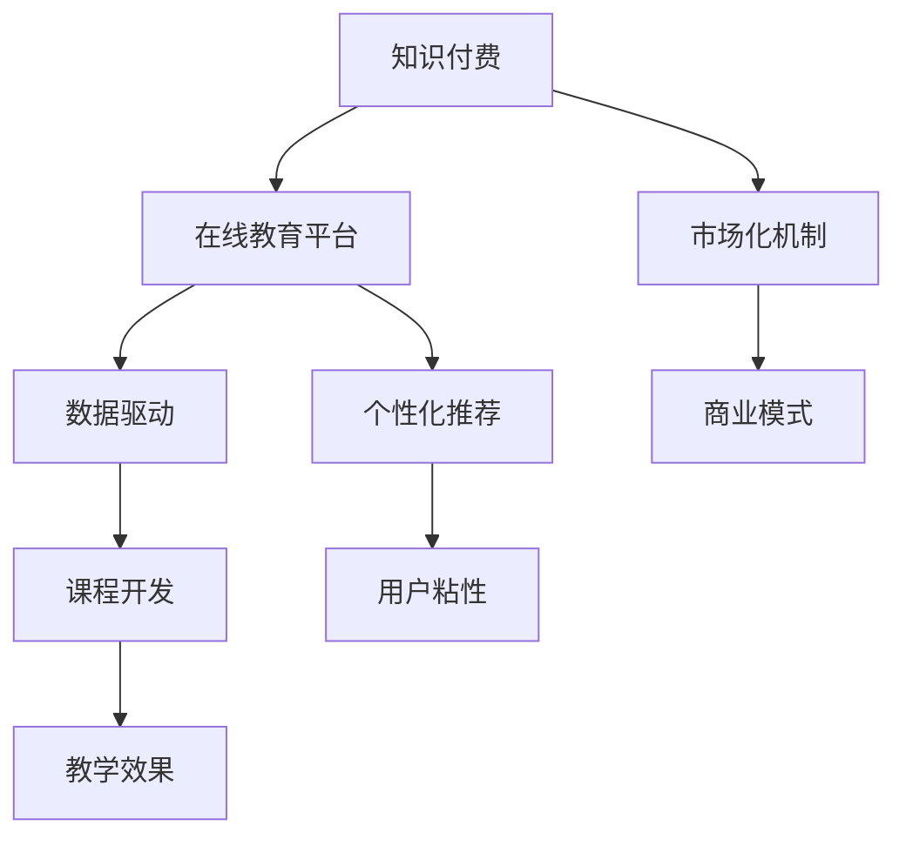

                 

# 知识付费要加强与在线教育平台的合作共赢

> 关键词：知识付费、在线教育平台、合作共赢、数据驱动、个性化推荐、用户粘性、教学效果、课程开发、市场化机制、商业模式

## 1. 背景介绍

随着互联网技术的飞速发展，知识付费和在线教育成为新兴的热门领域。知识付费平台通过为知识内容赋价，鼓励优质内容的创作和分享，同时用户可以通过支付费用获取个性化、深入的学习内容。而在线教育平台则利用先进的教育技术和丰富的课程资源，为学习者提供便捷的在线学习体验。两者皆旨在提升学习效果，但实现路径和商业模式有所不同。

本文聚焦于知识付费与在线教育平台的合作共赢，通过探讨双方在数据驱动、个性化推荐、用户粘性、教学效果等方面的协同作用，分析合作模式的潜在机会与挑战，提出合作共赢的发展策略。

## 2. 核心概念与联系

### 2.1 核心概念概述

为更好地理解知识付费与在线教育平台的合作模式，本节将介绍几个密切相关的核心概念：

- 知识付费：指用户为获取深入、系统的知识内容而支付费用的行为，通过付费，用户可以获得更加个性化和高质量的学习资源。
- 在线教育平台：指利用互联网技术，提供在线课程和教育服务的网络平台。平台通过丰富的课程资源和先进的技术手段，为学习者提供高效、便捷的在线学习体验。
- 合作共赢：指知识付费平台与在线教育平台通过合作，共享资源、数据和技术，共同提升用户体验和教育效果，实现双赢。
- 数据驱动：指利用大数据和人工智能技术，分析和优化课程设计、个性化推荐、用户行为分析等，提升教学效果和用户体验。
- 个性化推荐：指通过大数据分析和机器学习技术，根据用户兴趣和行为数据，为用户推荐个性化的学习内容和资源。
- 用户粘性：指用户对在线教育平台的长期依赖和使用，表现为高频率的访问、高频率的互动等行为。
- 教学效果：指在线课程的实际学习效果，包括知识掌握度、兴趣提升度、实践应用能力等。
- 课程开发：指为在线教育平台开发设计高质量、结构化的课程内容。
- 市场化机制：指在线教育平台通过市场机制实现资源的有效分配和激励，保障教育资源的持续发展和优化。
- 商业模式：指在线教育平台的运营模式和盈利方式，包括课程销售、平台订阅、广告收入等。

这些核心概念之间的逻辑关系可以通过以下Mermaid流程图来展示：



这个流程图展示了两者的核心概念及其之间的关系：

1. 知识付费和在线教育平台互相依赖，通过数据和资源共享，提升用户体验和教育效果。
2. 数据驱动和个性化推荐技术帮助在线教育平台提供更精准、更丰富的学习内容，同时提升用户的满意度和粘性。
3. 课程开发是知识付费和在线教育平台协同合作的基础，通过联合开发高质量课程，满足用户的学习需求。
4. 市场化机制和商业模式共同支撑在线教育平台的可持续发展，同时为知识付费平台提供变现渠道。

## 3. 核心算法原理 & 具体操作步骤
### 3.1 算法原理概述

知识付费与在线教育平台的合作共赢，本质上是一个数据驱动、个性化推荐和市场化机制共同作用的过程。其核心思想是：通过知识付费平台的用户支付数据，在线教育平台可以获得更多优质内容开发资源，同时根据用户行为数据，为用户推荐更符合其兴趣和需求的课程，从而提升用户体验和教育效果。

形式化地，假设知识付费平台有 $K$ 门课程，用户有 $U$ 个，用户对课程的支付意愿为 $P_{ui}$，在线教育平台有 $C$ 门课程，用户对课程的兴趣度为 $I_{ui}$。合作共赢的目标是最大化总收益 $R$，即：

$$
R = \sum_{u \in U} \sum_{i \in C} P_{ui}I_{ui}
$$

其中 $P_{ui}$ 和 $I_{ui}$ 分别为用户对课程的支付意愿和兴趣度，需通过模型学习得到。

### 3.2 算法步骤详解

知识付费与在线教育平台的合作共赢一般包括以下几个关键步骤：

**Step 1: 数据准备与整合**

- 知识付费平台提供用户支付数据，包括课程ID、用户ID、支付金额等。
- 在线教育平台提供课程资源和用户行为数据，包括课程ID、用户ID、兴趣度、学习进度等。

**Step 2: 数据预处理与特征工程**

- 对用户支付数据和用户行为数据进行清洗、去重、归一化等预处理操作。
- 设计并提取特征，如课程ID、用户ID、支付金额、兴趣度、学习进度等。
- 进行特征选择和降维，提高模型训练效率。

**Step 3: 构建推荐模型**

- 选择合适的推荐算法，如协同过滤、内容推荐、深度学习等。
- 使用训练数据集，训练推荐模型，评估模型性能。
- 使用验证集调整模型参数，防止过拟合。

**Step 4: 个性化推荐**

- 在在线教育平台的用户访问页面上，实时推送个性化课程推荐。
- 根据用户点击、互动等反馈数据，不断优化推荐算法。
- 为知识付费平台提供优质课程的推荐和推广渠道。

**Step 5: 用户反馈与优化**

- 收集用户对推荐课程的反馈数据，如点击率、购买率、评分等。
- 利用用户反馈数据，优化推荐模型，提高推荐准确性。
- 对课程内容进行持续迭代和更新，提升用户满意度。

**Step 6: 收益分配与激励机制**

- 根据用户购买和点击数据，计算知识付费平台和在线教育平台的收益。
- 设计合理的收益分配机制，保障双方利益。
- 通过激励机制，如课程销售提成、广告分成等，促进内容质量和用户粘性。

### 3.3 算法优缺点

知识付费与在线教育平台的合作共赢方法具有以下优点：

1. 提升用户体验。通过个性化推荐，用户能够快速找到符合自己需求和兴趣的课程，提升学习效率。
2. 促进课程开发。在线教育平台利用知识付费平台的用户支付数据，可以更有针对性地开发课程内容，满足用户需求。
3. 增加平台收益。知识付费平台通过提供优质课程，增加平台用户量和收益，而在线教育平台通过用户付费，实现资源变现。
4. 优化资源配置。通过市场化机制和激励机制，平台资源得到更合理的分配和利用，提升整体运营效率。

同时，该方法也存在一定的局限性：

1. 数据隐私问题。平台间的数据共享可能涉及用户隐私保护，需要采取严格的数据安全措施。
2. 合作协调成本。知识付费平台和在线教育平台需要不断沟通和协调，以确保合作的顺利进行。
3. 市场风险。市场竞争激烈，知识付费和在线教育平台需要共同应对市场变化，保持竞争优势。
4. 用户反馈不一致。不同用户的需求和行为差异大，个性化推荐的准确性可能受到影响。

尽管存在这些局限性，但就目前而言，知识付费与在线教育平台的合作共赢方法已经显示出良好的发展前景，成为在线教育领域的重要趋势。

### 3.4 算法应用领域

知识付费与在线教育平台的合作共赢方法，已经在诸多应用场景中得到应用，如：

- 语言学习：通过知识付费平台支付学习资源费用，在线教育平台提供丰富的语言学习课程和个性化推荐。
- 职业技能培训：知识付费平台提供技能培训课程费用，在线教育平台根据用户职业需求，推荐适合的课程内容。
- 知识付费与在线教育融合：将知识付费课程与在线教育平台的互动学习结合起来，提供更丰富、多样化的学习体验。
- 多模态学习：结合知识付费和在线教育平台提供的不同类型学习资源，如视频、音频、文字等，满足用户多模态学习需求。

除了上述这些经典应用外，知识付费与在线教育平台的合作还拓展到更多领域，如职场发展、职业技能认证等，为知识传播和学习带来新的突破。

## 4. 数学模型和公式 & 详细讲解 & 举例说明
### 4.1 数学模型构建

本节将使用数学语言对知识付费与在线教育平台的合作共赢过程进行更加严格的刻画。

记知识付费平台有 $K$ 门课程，用户有 $U$ 个，在线教育平台有 $C$ 门课程，用户对课程的支付意愿为 $P_{ui}$，在线教育平台的用户行为数据为 $\mathcal{X} \times \mathcal{Y}$，其中 $\mathcal{X}$ 为特征空间，$\mathcal{Y}$ 为标签空间，假设 $\mathcal{X}$ 和 $\mathcal{Y}$ 都是实数。

定义知识付费平台的用户支付矩阵 $P \in \mathbb{R}^{K \times U}$，其中 $P_{ui}$ 为用户 $u$ 对课程 $i$ 的支付意愿。定义在线教育平台的用户行为矩阵 $I \in \mathbb{R}^{C \times U}$，其中 $I_{ui}$ 为用户 $u$ 对课程 $i$ 的兴趣度。

合作共赢的目标是最小化总成本，同时最大化总收益，即：

$$
\min_{P, I} C = \sum_{i \in K} \sum_{j \in U} C_{ij}
$$

$$
\max_{P, I} R = \sum_{i \in C} \sum_{j \in U} P_{ij}I_{ij}
$$

其中 $C_{ij}$ 为课程 $i$ 的开发成本，$R$ 为总收益，需通过模型学习得到。

### 4.2 公式推导过程

以下我们以协同过滤算法为例，推导推荐模型的损失函数及其梯度计算公式。

协同过滤算法基于用户行为矩阵 $I$，寻找相似的用户和课程，通过加权平均计算推荐结果。假设用户行为矩阵 $I$ 可以分解为两个矩阵 $\widehat{I}$ 和 $\overline{I}$，其中 $\widehat{I} \in \mathbb{R}^{C \times C}$ 为相似度矩阵，$\overline{I} \in \mathbb{R}^{C \times U}$ 为预测矩阵。则协同过滤算法的损失函数定义为：

$$
\ell(I) = -\frac{1}{N} \sum_{i=1}^N \sum_{j=1}^M (\widehat{I}_{ij} - I_{ij})^2
$$

其中 $N$ 为训练样本数，$M$ 为训练样本特征数。

根据梯度下降算法，推荐模型的梯度更新公式为：

$$
\frac{\partial \ell(I)}{\partial \widehat{I}} = -\frac{2}{N} \sum_{i=1}^N \sum_{j=1}^M (\widehat{I}_{ij} - I_{ij})\frac{\partial \widehat{I}_{ij}}{\partial \widehat{I}} + \frac{\partial \ell(I)}{\partial \overline{I}}
$$

其中 $\frac{\partial \ell(I)}{\partial \overline{I}}$ 为对 $\overline{I}$ 的梯度计算，可以通过反向传播算法高效完成。

## 5. 项目实践：代码实例和详细解释说明
### 5.1 开发环境搭建

在进行知识付费与在线教育平台合作共赢的实践前，我们需要准备好开发环境。以下是使用Python进行PyTorch开发的环境配置流程：

1. 安装Anaconda：从官网下载并安装Anaconda，用于创建独立的Python环境。

2. 创建并激活虚拟环境：
```bash
conda create -n pytorch-env python=3.8 
conda activate pytorch-env
```

3. 安装PyTorch：根据CUDA版本，从官网获取对应的安装命令。例如：
```bash
conda install pytorch torchvision torchaudio cudatoolkit=11.1 -c pytorch -c conda-forge
```

4. 安装TensorFlow：
```bash
pip install tensorflow
```

5. 安装各类工具包：
```bash
pip install numpy pandas scikit-learn matplotlib tqdm jupyter notebook ipython
```

完成上述步骤后，即可在`pytorch-env`环境中开始实践。

### 5.2 源代码详细实现

下面我们以协同过滤算法为例，给出使用PyTorch实现个性化推荐的代码实现。

首先，定义协同过滤算法的数据处理函数：

```python
import torch
from sklearn.metrics import mean_squared_error
from torch.utils.data import TensorDataset, DataLoader

def compute_cosine_similarity(X):
    X_norm = torch.norm(X, dim=1, keepdim=True)
    cosine_sim = (X @ X.t()) / (X_norm @ X_norm.t())
    return cosine_sim

def compute_matrix_factorization(X):
    I = X - X.mean(dim=1, keepdim=True) - X.mean(dim=1, keepdim=True).t()
    Q = torch.randn_like(I)
    R = torch.randn_like(I)
    for _ in range(50):
        Q = torch.mm(I @ R.t() / (R @ R.t()).diag().unsqueeze(1), Q)
        R = torch.mm(I @ Q.t() / (Q @ Q.t()).diag().unsqueeze(1), R)
    return Q, R

def compute_user_course_similarity(X, Q, R):
    I = X - X.mean(dim=1, keepdim=True) - X.mean(dim=1, keepdim=True).t()
    cosine_sim = (I @ Q.t()) / ((Q @ Q.t()).diag().unsqueeze(1)) * (I @ R.t()) / ((R @ R.t()).diag().unsqueeze(1))
    return cosine_sim

# 加载数据
data = torch.load('data.pt')

# 标准化处理
X = (data['X'] - data['X'].mean(dim=1, keepdim=True)) / data['X'].std(dim=1, keepdim=True)
Q, R = compute_matrix_factorization(X)

# 计算用户-课程相似度
user_course_sim = compute_user_course_similarity(X, Q, R)
```

然后，定义评估函数和推荐函数：

```python
def evaluate(user_course_sim):
    # 计算预测误差
    y_pred = torch.exp(user_course_sim)
    y_true = data['y']
    mse = mean_squared_error(y_true, y_pred.diag())
    return mse

def recommend_course(user_course_sim, user_id):
    sim_scores = user_course_sim[user_id]
    idx = torch.argsort(sim_scores)[-10:]
    return idx.tolist()
```

最后，启动推荐流程：

```python
mse = evaluate(user_course_sim)
print(f"Mean Squared Error: {mse:.3f}")

user_id = 1
courses = recommend_course(user_course_sim, user_id)
print(f"Recommended Courses for User {user_id}: {courses}")
```

以上就是使用PyTorch实现协同过滤算法的代码实现。可以看到，通过PyTorch的强大封装，我们可以用相对简洁的代码实现复杂的协同过滤算法。

### 5.3 代码解读与分析

让我们再详细解读一下关键代码的实现细节：

**compute_cosine_similarity函数**：
- 计算用户行为矩阵的归一化余弦相似度，用于衡量用户间的相似度。

**compute_matrix_factorization函数**：
- 使用矩阵分解算法，将用户行为矩阵分解为两个低秩矩阵 $\widehat{I}$ 和 $\overline{I}$，分别表示相似度矩阵和预测矩阵。

**compute_user_course_similarity函数**：
- 根据分解后的矩阵计算用户-课程相似度，用于推荐系统。

**evaluate函数**：
- 计算推荐系统在验证集上的预测误差，评估推荐效果。

**recommend_course函数**：
- 根据用户-课程相似度，推荐用户可能感兴趣的课程。

通过以上函数，我们实现了基于协同过滤算法的推荐系统，可以在训练集上训练模型，并在测试集上评估推荐效果。

## 6. 实际应用场景
### 6.1 智能辅导系统

智能辅导系统利用知识付费与在线教育平台的合作共赢，为学生提供个性化的学习辅导。通过收集学生对课程的支付数据和行为数据，系统可以准确分析学生的学习兴趣和知识掌握情况，提供针对性的课程推荐和辅导，提升学生的学习效果。

在技术实现上，可以建立一个智能辅导平台，将知识付费平台提供的课程与在线教育平台的教学资源结合起来。系统可以根据学生历史学习数据和支付数据，动态调整推荐策略，为学生推荐适合的课程和辅导资料，帮助其高效学习和提升成绩。

### 6.2 企业员工培训

企业员工培训面临课程内容和形式单调、难以吸引员工参与的问题。通过知识付费与在线教育平台的合作，企业可以为员工提供多样化、个性化的培训课程。

企业可以与知识付费平台合作，将优秀的培训课程制作成视频课程，并通过在线教育平台向员工推荐。同时，根据员工的访问行为和反馈数据，调整课程推荐策略，为员工提供更符合其兴趣和需求的培训内容，提高培训效果。

### 6.3 在线职业课程

在线职业课程需要满足不同行业和职业领域的需求。知识付费与在线教育平台的合作，可以为在线职业课程提供高质量的内容资源和推荐服务。

在线职业平台可以与知识付费平台合作，引入各类职业技能培训课程。通过分析学员的行为数据和支付数据，平台可以为学员推荐适合的课程，提供个性化的学习路径，帮助其快速掌握所需技能，提升职业竞争力。

### 6.4 未来应用展望

随着知识付费和在线教育平台的发展，基于合作的个性化推荐技术将在更多领域得到应用，为教育技术带来新的突破。

在智慧医疗领域，基于个性化推荐的在线医学课程，可以为医护人员提供高质量的继续教育和培训资源，提升其专业知识和技能。

在智能家居领域，基于个性化推荐的在线课程和智能设备操作指南，可以帮助用户更高效地使用智能家居设备，提升生活品质。

在智慧城市治理中，基于个性化推荐的在线课程和智能城市管理指南，可以为市民提供丰富的智慧城市知识和技能，提升城市治理水平。

此外，在企业培训、金融教育、文化娱乐等众多领域，基于合作的知识付费与在线教育平台，也将不断涌现，为各行各业带来新的创新和突破。

## 7. 工具和资源推荐
### 7.1 学习资源推荐

为了帮助开发者系统掌握知识付费与在线教育平台的合作共赢技术，这里推荐一些优质的学习资源：

1. 《深度学习与推荐系统》书籍：全面介绍了推荐系统的理论基础和实践方法，涵盖协同过滤、内容推荐、深度学习等主流技术。

2. Kaggle推荐系统竞赛：Kaggle是数据科学和机器学习领域最知名的竞赛平台，通过参加推荐系统竞赛，可以获得实战经验，掌握推荐技术。

3. Udacity推荐系统课程：Udacity提供在线推荐系统课程，从基础算法到实际应用，系统讲解推荐系统开发过程。

4. Coursera推荐系统课程：Coursera与知名大学合作，提供推荐系统课程，涵盖协同过滤、矩阵分解等经典算法。

5. 推荐系统论文集：收集推荐系统领域经典论文，涵盖协同过滤、深度学习、用户行为分析等方向，适合深入学习。

通过对这些资源的学习实践，相信你一定能够快速掌握知识付费与在线教育平台的合作共赢技术，并用于解决实际的个性化推荐问题。

### 7.2 开发工具推荐

高效的开发离不开优秀的工具支持。以下是几款用于知识付费与在线教育平台合作共赢开发的常用工具：

1. PyTorch：基于Python的开源深度学习框架，灵活高效，支持协同过滤等推荐算法。

2. TensorFlow：由Google主导开发的开源深度学习框架，支持分布式训练，适合大规模推荐系统开发。

3. Jupyter Notebook：基于Web的交互式编程环境，支持多语言编程和丰富的数据可视化功能，适合进行推荐系统开发和调试。

4. Weights & Biases：模型训练的实验跟踪工具，可以记录和可视化模型训练过程中的各项指标，方便对比和调优。

5. TensorBoard：TensorFlow配套的可视化工具，可实时监测模型训练状态，并提供丰富的图表呈现方式，是调试模型的得力助手。

6. Scikit-learn：Python机器学习库，支持数据预处理、特征工程、模型评估等，是推荐系统开发的常用工具。

合理利用这些工具，可以显著提升知识付费与在线教育平台合作共赢任务的开发效率，加快创新迭代的步伐。

### 7.3 相关论文推荐

知识付费与在线教育平台的合作共赢技术的发展源于学界的持续研究。以下是几篇奠基性的相关论文，推荐阅读：

1. Factorization Machines for Recommender Systems（《推荐系统中的矩阵分解算法》）：提出基于矩阵分解的推荐算法，有效提升推荐系统的准确性。

2. DeepFM: A Factorization-Machine-Based Deep Learning Model for Recommender Systems（《DeepFM：一种基于因子分解机的深度学习推荐模型》）：将深度学习与因子分解机结合，进一步提升推荐系统的效果。

3. Attention is All You Need（《Transformer原论文》）：提出Transformer结构，开启深度学习中的自注意力机制，为推荐系统提供新的技术思路。

4. Multi-Task Learning from Implicit Feedback for Recommender Systems（《利用隐式反馈的多任务推荐系统学习》）：提出多任务学习技术，提高推荐系统的泛化能力和鲁棒性。

5. Hybrid Recommender Systems: Combining Content-Based and Collaborative Filtering（《混合推荐系统：融合基于内容的推荐和协同过滤》）：提出混合推荐算法，结合基于内容的推荐和协同过滤，提升推荐系统的效果和多样性。

这些论文代表了大规模推荐系统的研究进展，通过学习这些前沿成果，可以帮助研究者把握学科前进方向，激发更多的创新灵感。

## 8. 总结：未来发展趋势与挑战
### 8.1 总结

本文对知识付费与在线教育平台的合作共赢方法进行了全面系统的介绍。首先阐述了知识付费和在线教育平台的合作共赢的背景和意义，明确了合作共赢在提升用户体验、促进课程开发、增加平台收益等方面的独特价值。其次，从原理到实践，详细讲解了知识付费与在线教育平台的合作共赢的数学原理和关键步骤，给出了协同过滤算法的代码实现。同时，本文还广泛探讨了合作共赢方法在智能辅导、企业培训、在线职业课程等多个领域的应用前景，展示了合作共赢范式的巨大潜力。此外，本文精选了合作共赢技术的各类学习资源，力求为读者提供全方位的技术指引。

通过本文的系统梳理，可以看到，知识付费与在线教育平台的合作共赢技术正在成为在线教育领域的重要趋势，极大地拓展了在线教育平台的资源和技术边界，催生了更多的落地场景。得益于数据驱动、个性化推荐等技术手段，知识付费与在线教育平台正在逐步融合，形成互补优势，共同提升用户体验和教育效果。未来，伴随技术的不断成熟，知识付费与在线教育平台将带来更深刻的变革，推动在线教育技术向更广泛领域发展。

### 8.2 未来发展趋势

展望未来，知识付费与在线教育平台的合作共赢技术将呈现以下几个发展趋势：

1. 数据驱动技术的进一步发展。随着大数据和人工智能技术的进步，推荐系统将变得更加精准和个性化，能够更好地满足用户需求，提升教育效果。

2. 多模态学习技术的突破。结合知识付费和在线教育平台提供的不同类型学习资源，如视频、音频、文字等，满足用户多模态学习需求，提升学习效果。

3. 跨平台协同推荐。知识付费平台和在线教育平台之间的数据共享和合作，将促进跨平台推荐系统的建设，提升资源利用效率。

4. 用户行为分析的深入应用。通过分析用户的学习行为和反馈数据，可以更好地优化推荐算法，提升用户满意度和粘性。

5. 社交推荐机制的引入。通过社交网络的数据，可以为推荐系统引入社交推荐机制，提高推荐的精准度和多样性。

6. 实时推荐系统的构建。通过实时分析用户数据和行为，可以实现实时推荐，提升用户互动体验。

以上趋势凸显了知识付费与在线教育平台合作共赢技术的广阔前景。这些方向的探索发展，必将进一步提升推荐系统的效果和用户体验，为在线教育平台带来新的突破和创新。

### 8.3 面临的挑战

尽管知识付费与在线教育平台的合作共赢技术已经取得了显著进展，但在迈向更加智能化、普适化应用的过程中，仍面临诸多挑战：

1. 数据隐私问题。平台间的数据共享可能涉及用户隐私保护，需要采取严格的数据安全措施。

2. 平台间协同成本。知识付费平台和在线教育平台需要不断沟通和协调，以确保合作的顺利进行。

3. 推荐系统公平性。推荐系统可能存在偏见，需要采取措施确保推荐结果的公平性和多样性。

4. 市场竞争压力。市场竞争激烈，知识付费和在线教育平台需要不断创新和优化，保持竞争优势。

5. 用户反馈不一致。不同用户的需求和行为差异大，个性化推荐的准确性可能受到影响。

6. 推荐系统稳定性。推荐系统的鲁棒性和可靠性需进一步提升，避免因数据波动和异常影响用户体验。

尽管存在这些挑战，但通过合理设计算法和机制，知识付费与在线教育平台的合作共赢技术仍有望实现更大突破，推动在线教育技术向更广泛领域发展。

### 8.4 研究展望

面向未来，知识付费与在线教育平台的合作共赢技术需要在以下几个方面寻求新的突破：

1. 开发更高效、更公平的推荐算法。通过引入更多模型和算法，提升推荐系统的效果和稳定性。

2. 引入更多先验知识。将符号化的先验知识，如知识图谱、逻辑规则等，与推荐算法结合，提升推荐系统的深度和广度。

3. 引入因果分析和博弈论工具。通过引入因果分析和博弈论思想，增强推荐系统的决策能力和稳定性。

4. 结合知识表示和推荐系统。将知识表示方法引入推荐系统，增强推荐结果的可解释性和可控性。

5. 纳入伦理道德约束。在推荐系统的设计中引入伦理导向的评估指标，过滤和惩罚有偏见、有害的推荐结果，保障用户安全。

这些研究方向的探索，必将引领知识付费与在线教育平台合作共赢技术迈向更高的台阶，为构建安全、可靠、可解释、可控的智能系统铺平道路。面向未来，知识付费与在线教育平台需要从数据、算法、工程、业务等多个维度协同发力，共同推动知识付费与在线教育平台的合作共赢技术迈向更加成熟和稳定的阶段。

## 9. 附录：常见问题与解答

**Q1：知识付费与在线教育平台如何实现数据共享？**

A: 知识付费与在线教育平台可以通过以下方式实现数据共享：

1. 数据脱敏和匿名化：在共享数据前，对用户行为数据进行脱敏和匿名化处理，确保数据隐私和安全。

2. 数据接口协议：制定统一的数据接口协议，确保平台间的数据交换格式和规范一致。

3. 数据加密传输：通过SSL/TLS等加密技术，确保数据在传输过程中的安全性。

4. 数据使用协议：制定明确的数据使用协议，规定数据使用的范围和方式，保障数据合规使用。

通过这些措施，可以有效地保障数据共享过程中的隐私和安全。

**Q2：知识付费与在线教育平台如何确保推荐系统的公平性和多样性？**

A: 知识付费与在线教育平台可以通过以下方式确保推荐系统的公平性和多样性：

1. 多样性推荐算法：引入多样性推荐算法，如多样性加权协同过滤、分层抽样等，避免推荐结果过于集中。

2. 用户反馈机制：引入用户反馈机制，收集用户对推荐结果的评价和建议，调整推荐策略。

3. 数据多样性处理：通过数据多样性处理，如引入不同的课程类型和主题，避免推荐结果过于单一。

4. 多任务学习：通过多任务学习技术，提升推荐系统的泛化能力和鲁棒性，确保推荐结果的公平性。

5. 公平性评估指标：引入公平性评估指标，如性别、种族等公平性指标，评估推荐结果的公平性。

通过这些措施，可以有效地提升推荐系统的公平性和多样性，增强用户体验。

**Q3：知识付费与在线教育平台如何实现实时推荐？**

A: 知识付费与在线教育平台可以通过以下方式实现实时推荐：

1. 实时数据处理：通过实时数据处理技术，如流式数据处理、分布式计算等，实时分析和处理用户行为数据。

2. 实时模型训练：通过分布式训练技术，实现实时模型训练和更新，提升推荐系统的实时性。

3. 实时数据同步：通过数据同步技术，确保平台间的实时数据同步和共享。

4. 实时推荐算法：引入实时推荐算法，如强化学习、带时序的协同过滤等，提升推荐系统的实时性和效果。

通过这些措施，可以有效地实现实时推荐，提升用户互动体验。

---

作者：禅与计算机程序设计艺术 / Zen and the Art of Computer Programming

