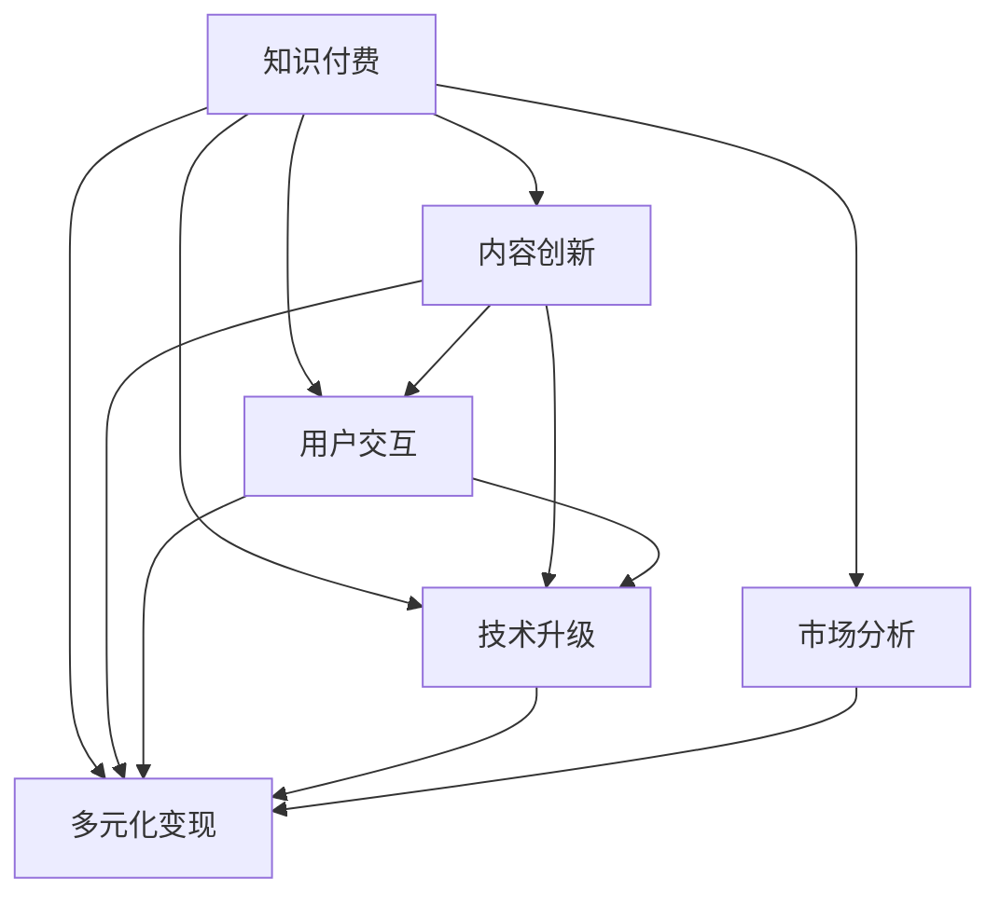

                 

# 知识付费要及时调整策略,满足用户需求

在数字化转型不断加速的今天，知识付费已经成为了一个热门领域，其背后的逻辑基于人们对于深度知识和专业技能的强烈需求。然而，随着市场的快速发展和用户需求的不断变化，知识付费平台亟需对现有的策略进行调整，以更好地满足用户的实际需求。本文将从背景介绍、核心概念与联系、核心算法原理与操作步骤、数学模型与公式推导、项目实践、实际应用场景、工具和资源推荐、总结与展望以及附录等方面，全面探讨知识付费策略的调整。

## 1. 背景介绍

### 1.1 问题由来

知识付费的概念可以追溯到信息爆炸和知识分享的蓬勃兴起。随着互联网的普及，用户对于获取深度知识、技能和见解的需求愈发强烈。知识付费平台凭借其独有的优势，迅速崛起，成为用户获取专业知识和信息的主要渠道。但随着时间的推移，用户对于知识付费的期望值不断升高，现有平台在内容和形式上出现了一些不适应，如内容同质化、价值不足、体验感不佳等问题逐渐凸显。

### 1.2 问题核心关键点

面对这些问题，知识付费平台需要从多个角度进行调整：
1. **内容创新**：提供更具深度和专业性的原创内容。
2. **用户交互**：强化用户与内容生产者之间的互动和反馈机制。
3. **技术升级**：利用先进技术提升内容推荐和用户体验。
4. **多元化变现**：探索多样化的盈利模式，如社群服务、企业合作等。
5. **市场分析**：持续进行市场分析，了解用户行为和需求变化。

## 2. 核心概念与联系

### 2.1 核心概念概述

以下是与知识付费策略调整相关的核心概念：

- **知识付费**：用户为获取深度知识和专业技能，通过付费方式获取知识和技能的过程。
- **内容创新**：生产具有独特价值、创新性的内容和形式。
- **用户交互**：用户与内容生产者之间的交流和反馈机制。
- **技术升级**：利用AI、大数据、区块链等先进技术提升平台功能和用户体验。
- **多元化变现**：除传统订阅模式外，探索包括社群服务、企业合作在内的多种盈利模式。
- **市场分析**：通过数据分析和用户调研了解市场需求和变化趋势。

这些概念之间存在紧密联系，相互影响，共同构建了知识付费平台的发展框架。

### 2.2 核心概念原理和架构的 Mermaid 流程图



这个流程图展示了知识付费平台的核心概念及其相互关系。内容创新是基础，用户交互和技术升级是支撑，多元化变现是发展方向，市场分析是指导思想。

## 3. 核心算法原理 & 具体操作步骤

### 3.1 算法原理概述

知识付费平台的内容推荐算法，旨在根据用户的历史行为、兴趣偏好、地理位置等信息，个性化地推荐适合用户的知识内容。核心算法包括协同过滤、基于内容的推荐、深度学习推荐等。

协同过滤算法基于用户-物品矩阵，通过用户相似性或物品相似性进行推荐。基于内容的推荐算法根据物品的属性特征，找到与之相似的物品进行推荐。深度学习推荐则利用神经网络模型，学习用户与物品间的隐式关联，从而实现更精准的推荐。

### 3.2 算法步骤详解

以下是知识付费平台推荐算法的详细步骤：

1. **数据收集**：收集用户行为数据（如浏览记录、购买记录等）、内容特征（如文章摘要、标签等）和用户特征（如地理位置、兴趣偏好等）。
2. **用户建模**：将用户行为数据和内容特征进行向量化处理，构建用户-物品矩阵。
3. **协同过滤**：通过相似性计算，找出与目标用户相似的用户，获取其历史浏览和购买记录，进行推荐。
4. **深度学习**：利用神经网络模型学习用户与物品间的隐式关联，输出推荐结果。
5. **反馈优化**：根据用户的反馈（如点击率、购买率等），不断调整模型参数，提升推荐精度。

### 3.3 算法优缺点

- **优点**：
  - **个性化推荐**：能够根据用户的历史行为和偏好进行个性化推荐，提高用户满意度和留存率。
  - **多样性保证**：能够平衡推荐结果的多样性，避免单一内容推荐。
  - **动态更新**：能够实时更新推荐算法，根据用户行为变化进行调整。

- **缺点**：
  - **数据依赖**：需要大量用户行为数据和内容特征，对于新用户的推荐效果可能较差。
  - **模型复杂**：深度学习推荐算法复杂度较高，计算和存储成本较高。
  - **推荐公平性**：协同过滤和基于内容的推荐算法可能存在数据偏见，影响推荐公平性。

### 3.4 算法应用领域

知识付费平台推荐算法已广泛应用于内容推荐、个性化服务、用户行为分析等多个领域，为平台带来了显著的收益和用户黏性。

- **内容推荐**：通过个性化推荐，提高内容的曝光率和用户留存率。
- **个性化服务**：根据用户偏好，提供定制化服务，如订阅计划、专题课程等。
- **用户行为分析**：通过分析用户行为数据，进行用户画像建模和市场细分，制定精准的营销策略。

## 4. 数学模型和公式 & 详细讲解 & 举例说明

### 4.1 数学模型构建

知识付费平台推荐算法的数学模型主要包括以下几部分：

- **用户行为矩阵**：$U \in \mathbb{R}^{N \times M}$，$N$为用户数，$M$为内容项数。
- **内容特征矩阵**：$I \in \mathbb{R}^{M \times D}$，$D$为内容特征数。
- **用户特征向量**：$U^\prime \in \mathbb{R}^N$，$U^\prime_i$为第$i$个用户的特征向量。

### 4.2 公式推导过程

1. **协同过滤**：
   - **余弦相似度**：
     \[
     s_{ij} = \frac{\vec{u}_i \cdot \vec{u}_j}{\|\vec{u}_i\|\|\vec{u}_j\|}
     \]
     其中，$\vec{u}_i$和$\vec{u}_j$分别为用户$i$和用户$j$的特征向量，$\cdot$表示内积。

   - **基于用户-物品矩阵的推荐**：
     \[
     P_{ui} = \sum_{j=1}^N s_{ij} \cdot c_{uj}
     \]
     其中，$P_{ui}$为对用户$i$推荐内容项$u$的概率，$c_{uj}$为内容项$u$的评分。

2. **基于内容的推荐**：
   - **特征向量的余弦相似度**：
     \[
     s_{iu} = \frac{\vec{i}_u \cdot \vec{u}_i}{\|\vec{i}_u\|\|\vec{u}_i\|}
     \]
     其中，$\vec{i}_u$和$\vec{u}_i$分别为内容项$u$和用户$i$的内容特征向量。

   - **基于内容特征的推荐**：
     \[
     P_{ui} = \alpha s_{iu} + (1-\alpha) c_{ui}
     \]
     其中，$\alpha$为推荐策略的参数，$c_{ui}$为内容项$u$的评分。

### 4.3 案例分析与讲解

以Netflix推荐系统为例，其基于协同过滤和深度学习模型实现推荐算法。Netflix使用多种协同过滤方法，如基于用户相似性和基于物品相似性。同时，利用深度神经网络模型，学习用户与物品间的隐式关联。Netflix的推荐系统成功实现了用户满意度的提升和平台的盈利增长。

## 5. 项目实践：代码实例和详细解释说明

### 5.1 开发环境搭建

在搭建开发环境时，可以使用以下工具和库：

- **Python**：推荐算法的主要开发语言。
- **Pandas**：用于数据处理和分析。
- **NumPy**：用于高效计算矩阵运算。
- **Scikit-learn**：提供了协同过滤算法的实现。
- **TensorFlow**或**PyTorch**：用于深度学习推荐模型的实现。

### 5.2 源代码详细实现

以下是一个简单的Python代码示例，用于实现基于协同过滤的推荐算法：

```python
import pandas as pd
from sklearn.metrics.pairwise import cosine_similarity

# 用户行为数据
user_matrix = pd.read_csv('user_matrix.csv', sep='\t')

# 用户-物品矩阵
U = user_matrix.values

# 计算用户相似度矩阵
similarity_matrix = cosine_similarity(U)

# 推荐函数
def recommend_user(u):
    # 计算用户相似度向量
    similarity_vector = similarity_matrix[u]
    
    # 计算推荐项
    recommended_items = []
    for i, item in enumerate(similarity_vector):
        recommended_items.append((i, item))
    
    # 按照相似度排序
    recommended_items = sorted(recommended_items, key=lambda x: x[1], reverse=True)
    
    # 获取推荐项
    recommended_items = recommended_items[1:]

    return recommended_items
```

### 5.3 代码解读与分析

上述代码主要实现了基于余弦相似度的协同过滤推荐算法。首先，读取用户行为数据并将其转化为矩阵形式。然后，计算用户之间的余弦相似度矩阵。最后，定义推荐函数，根据相似度矩阵推荐给用户可能感兴趣的内容。

## 6. 实际应用场景

### 6.1 智能内容推荐

智能内容推荐是知识付费平台的核心应用场景之一。通过深度学习算法，平台可以根据用户的历史行为和偏好，实时生成个性化推荐列表，帮助用户快速找到感兴趣的内容。例如，在线课程平台可以通过分析用户的观看历史和评分记录，推荐相关课程。

### 6.2 用户互动平台

用户互动平台是知识付费平台的另一个重要应用场景。平台可以通过互动模块，如在线讨论、实时问答、社群分享等，增加用户之间的互动和交流，提升用户满意度和平台粘性。例如，在线教育平台可以建立专业社群，供学员互相交流学习经验。

### 6.3 企业知识管理

知识付费平台还可以为企业提供知识管理服务。企业可以通过平台进行知识共享和传播，提升员工的综合素质和业务能力。例如，企业可以建立内部知识库，鼓励员工上传自己的学习心得和业务经验。

### 6.4 未来应用展望

随着人工智能和大数据技术的不断发展，知识付费平台未来的应用场景将更加丰富和多样化。例如，结合自然语言处理技术，平台可以提供智能问答服务，利用聊天机器人解答用户问题；结合区块链技术，平台可以保障内容版权和用户隐私。

## 7. 工具和资源推荐

### 7.1 学习资源推荐

- **《推荐系统原理与算法》**：该书详细介绍了推荐系统的原理和算法，是推荐系统学习的经典之作。
- **Coursera推荐系统课程**：由斯坦福大学教授讲授，涵盖协同过滤、深度学习等多种推荐算法。
- **Kaggle竞赛**：参与Kaggle推荐系统竞赛，可以锻炼实战能力，积累经验。

### 7.2 开发工具推荐

- **TensorFlow**：开源的深度学习框架，提供了丰富的推荐系统算法和工具。
- **PyTorch**：高效的深度学习框架，适合快速迭代和原型开发。
- **Pandas**：强大的数据处理和分析工具，适合处理和处理用户行为数据。

### 7.3 相关论文推荐

- **“Collaborative Filtering for Implicit Feedback Datasets”**：Wang et al.（2006）提出了协同过滤算法的经典模型。
- **“Feature-based Collaborative Filtering for Recommendation Systems”**：Liu et al.（2003）探讨了基于内容特征的推荐算法。
- **“Deep Neural Networks for Recommendations: A Unified Approach”**：Wang et al.（2015）介绍了深度学习推荐算法的基本思想和实现方法。

## 8. 总结：未来发展趋势与挑战

### 8.1 研究成果总结

通过以上分析，可以发现知识付费平台推荐算法具有以下特点：
- **个性化推荐**：通过深度学习算法，提高推荐精度和用户体验。
- **多样性保证**：通过协同过滤和深度学习算法，平衡推荐结果的多样性。
- **实时更新**：通过持续的数据更新和模型优化，保持推荐算法的有效性。

### 8.2 未来发展趋势

未来知识付费平台推荐算法的趋势如下：
1. **模型融合**：结合多种推荐算法和模型，构建更加复杂和稳健的推荐系统。
2. **实时化**：利用流式计算和在线学习技术，实现实时推荐。
3. **跨平台融合**：将推荐系统与其他平台和服务进行融合，实现全场景的推荐。
4. **可解释性**：引入可解释性算法，提升推荐系统的透明性和可信度。

### 8.3 面临的挑战

尽管推荐算法在知识付费平台中取得了显著成效，但仍然面临以下挑战：
1. **数据隐私**：如何保护用户数据隐私，避免数据泄露。
2. **推荐公平性**：避免推荐算法的偏见，确保推荐公平性。
3. **计算成本**：大规模推荐算法需要高计算资源，如何降低计算成本。

### 8.4 研究展望

未来推荐算法的研究方向包括：
1. **数据隐私保护**：采用差分隐私、联邦学习等技术，保护用户隐私。
2. **推荐公平性**：引入公平性算法，减少推荐算法中的偏见。
3. **计算优化**：采用模型压缩、量化等技术，降低推荐算法的计算成本。

## 9. 附录：常见问题与解答

### Q1: 知识付费平台推荐算法的核心是什么？

A: 知识付费平台推荐算法的核心是通过协同过滤、基于内容的推荐和深度学习推荐等多种算法，根据用户的历史行为和偏好，提供个性化的内容推荐。

### Q2: 知识付费平台推荐算法的优势是什么？

A: 推荐算法的优势在于能够根据用户的历史行为和偏好，提供个性化的内容推荐，提高用户满意度和平台留存率。同时，推荐算法还能够平衡推荐结果的多样性，避免单一内容推荐。

### Q3: 推荐算法在知识付费平台中的应用场景有哪些？

A: 推荐算法在知识付费平台中的应用场景包括内容推荐、用户互动平台、企业知识管理等。例如，在线课程平台可以通过推荐算法，帮助用户找到感兴趣的内容；在线教育平台可以建立专业社群，提升用户互动和满意度。

通过本文的全面分析，可以得出结论：知识付费平台推荐算法的核心在于个性化推荐，优势在于提高用户满意度和平台留存率。未来推荐算法的趋势是模型融合、实时化和跨平台融合。面对数据隐私、推荐公平性和计算成本等挑战，需要在数据隐私保护、推荐公平性和计算优化等方面进行深入研究。

---

作者：禅与计算机程序设计艺术 / Zen and the Art of Computer Programming

