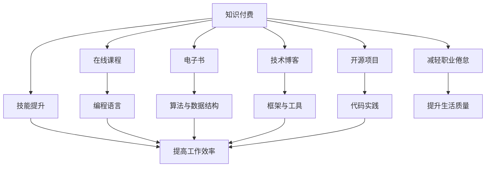

                 

# 知识付费让程序员告别996的生活方式

## 1. 背景介绍

### 1.1 问题由来
在当前快速发展的技术领域，程序员群体面临着前所未有的工作压力。996工作制（即早9点上班，晚9点下班，每周工作6天）在不少公司已被默认为常态，使许多程序员面临着长期高强度、高压力的工作状态。过度的劳动强度不仅影响健康，还可能造成职业倦怠，影响工作效率和生活质量。

### 1.2 问题核心关键点
程序员面临的这种困境来源于多个方面：
- **工作时长**：项目进度压力大，公司文化要求，以及个人技能提升的追求，使得程序员不得不加班。
- **职业倦怠**：长期高强度的工作容易使程序员产生疲劳感，降低工作热情和效率。
- **生活平衡**：由于长时间工作，程序员难以拥有足够的休息和娱乐时间，影响家庭和个人生活质量。

针对这些问题，知识付费平台的兴起为程序员提供了一个缓解压力、提升技能、平衡工作与生活的有效途径。

## 2. 核心概念与联系

### 2.1 核心概念概述

为更好地理解知识付费如何帮助程序员解决问题，本节将介绍几个关键概念：

- **知识付费**：指用户通过支付一定的费用，获取高质量的学习资源和服务，提升个人能力或满足知识需求的一种商业模式。常见的知识付费形式包括在线课程、电子书、专栏、直播等。
- **程序员**：指从事软件工程、系统开发、人工智能等领域的技术人员，通过编写代码解决实际问题，推动科技进步。
- **996工作制**：指公司强制要求程序员每天工作12小时，每周工作6天的工作制度，常导致程序员长时间高强度工作。
- **职业倦怠**：指长时间处于高压力工作状态，导致的身体和心理上的疲劳、懈怠状态，可能影响工作绩效和生活质量。
- **学习资源**：指能够提升程序员技能和知识水平的各种学习材料，包括在线课程、编程教程、技术博客、开源项目等。

这些概念之间的逻辑关系可以通过以下Mermaid流程图来展示：



这个流程图展示了知识付费平台为程序员提供的各种学习资源，以及这些资源如何帮助提升技能、减轻职业倦怠，从而改善工作和生活质量。

## 3. 核心算法原理 & 具体操作步骤

### 3.1 算法原理概述

知识付费模式的核心在于通过筛选和筛选器用户，提供符合其需求和兴趣的学习资源，同时使用付费机制激励内容创造者和平台不断提升内容质量。其基本原理如下：

1. **需求识别**：用户通过平台上的课程、文章、视频等资源，根据个人兴趣和职业需求，选择合适的学习内容。
2. **付费机制**：用户通过购买课程、订阅专栏等方式，支付费用获取高质量的学习材料和专业指导。
3. **内容筛选**：平台通过算法推荐系统，根据用户的浏览历史、学习进度、评价反馈等信息，推荐适合其水平和兴趣的内容。
4. **激励机制**：内容创造者通过平台的付费和流量激励，不断提高内容和服务的质量，满足用户需求。

### 3.2 算法步骤详解

知识付费平台的算法步骤一般包括以下几个关键环节：

**Step 1: 用户行为数据收集**
- 收集用户在平台上的浏览记录、购买记录、评价反馈等信息。
- 对数据进行清洗和处理，构建用户画像，包括兴趣、技能水平、学习进度等。

**Step 2: 内容质量评估**
- 对平台上的课程、文章、视频等进行质量评估，包括用户评价、专家评审、课程完成率等指标。
- 通过评分体系，筛选高质量的内容。

**Step 3: 推荐系统设计**
- 构建推荐模型，利用用户画像和内容特征，进行协同过滤、内容过滤等算法计算。
- 定期更新推荐模型，优化算法参数，提升推荐效果。

**Step 4: 激励和反馈机制**
- 设计激励机制，如通过付费、流量、认证等方式，奖励高质量的内容创造者。
- 定期收集用户反馈，改进平台功能和内容质量。

**Step 5: 课程设计**
- 根据用户需求和市场趋势，设计新的课程内容，满足用户技能提升和学习兴趣。
- 定期更新和维护课程资源，确保内容的时效性和适用性。

### 3.3 算法优缺点

知识付费平台的算法具有以下优点：
1. **提升学习效率**：通过个性化推荐，用户可以更精准地找到适合自己的学习材料，节省时间。
2. **质量保证**：付费机制激励内容创造者不断提高内容质量，用户可以获取高质量的学习资源。
3. **激励创新**：平台通过激励机制，促进内容创造者不断创新，推出更多优质内容。
4. **丰富资源**：平台汇集了大量高质量的学习资源，用户可以随时随地获取最新知识。

同时，知识付费平台也存在一些局限性：
1. **成本较高**：部分高价值内容需要付费获取，对部分用户来说可能存在经济负担。
2. **质量参差不齐**：虽然平台有质量筛选机制，但仍有部分内容质量不高，用户需自行甄别。
3. **激励过度依赖**：过度依赖付费和流量激励，可能导致内容过于商业化，缺乏学术性和公益性。
4. **版权问题**：部分高质量课程和资源可能存在版权争议，平台需处理复杂的版权问题。

尽管存在这些局限性，但知识付费平台在提升用户学习效率、保障内容质量、激励内容创新等方面，已显示出强大的潜力和价值。

### 3.4 算法应用领域

知识付费模式在多个领域得到了广泛应用，例如：

- **技术培训**：编程语言、算法与数据结构、框架与工具等方面的课程，帮助程序员提升技能。
- **职业发展**：职场技巧、领导力、项目管理等方面的课程，帮助程序员实现职业转型和提升。
- **兴趣拓展**：音乐、绘画、摄影等方面的课程，满足程序员的个人兴趣和发展需求。
- **生活提升**：时间管理、心理健康、健康饮食等方面的课程，帮助程序员提升生活质量。

除了上述这些主要领域，知识付费平台还在教育、娱乐、健康等多个领域取得了成功，为不同用户提供了多样化的学习和成长路径。

## 4. 数学模型和公式 & 详细讲解  
### 4.1 数学模型构建

知识付费平台的推荐系统一般采用协同过滤或内容过滤算法。以协同过滤为例，其数学模型如下：

设用户集合为 $U$，物品集合为 $I$，用户对物品的评分矩阵为 $R$，其中 $R_{ui}$ 表示用户 $u$ 对物品 $i$ 的评分。协同过滤的目标是预测用户对未评分物品的评分。

设用户 $u$ 的邻居集合为 $N(u)$，则协同过滤的预测模型可以表示为：

$$
\hat{R}_{ui} = \alpha \sum_{v \in N(u)} \frac{R_{vi}}{\sqrt{\hat{R}_{vi} + \epsilon}(\hat{R}_{vi} + \epsilon)} + \beta
$$

其中 $\alpha$ 为协同过滤的强度，$\beta$ 为正则化系数，$\epsilon$ 为平滑项。

### 4.2 公式推导过程

协同过滤算法的核心在于通过用户对物品的评分数据，找到与目标用户相似的其他用户，并根据这些相似用户的评分，预测目标用户对未评分物品的评分。

具体推导过程如下：

设用户 $u$ 对物品 $i$ 的预测评分为 $\hat{R}_{ui}$，则有：

$$
\hat{R}_{ui} = \alpha \sum_{v \in N(u)} \frac{R_{vi}}{\sqrt{\hat{R}_{vi} + \epsilon}(\hat{R}_{vi} + \epsilon)} + \beta
$$

其中 $\alpha$ 为协同过滤的强度，$\beta$ 为正则化系数，$\epsilon$ 为平滑项。

该公式的核心在于，通过用户 $u$ 的邻居 $N(u)$ 对物品 $i$ 的评分数据，对预测评分进行加权平均。权重由 $\sqrt{\hat{R}_{vi} + \epsilon}$ 给出，确保了平滑项的影响，避免对未评分物品的预测过于离谱。

### 4.3 案例分析与讲解

以Coursera平台为例，用户 $u$ 对课程 $i$ 的评分数据 $R_{ui}$ 为 $5$，其他用户 $v$ 对课程 $i$ 的评分数据 $R_{vi}$ 为 $4$ 和 $3$。假设 $\alpha = 0.7$，$\beta = 0.3$，$\epsilon = 0.1$，则用户 $u$ 对课程 $i$ 的预测评分为：

$$
\hat{R}_{ui} = 0.7 \cdot \frac{4}{\sqrt{5 + 0.1}(\sqrt{5 + 0.1} + 0.1)} + 0.7 \cdot \frac{3}{\sqrt{4 + 0.1}(\sqrt{4 + 0.1} + 0.1)} + 0.3
$$

$$
\hat{R}_{ui} = 4.08
$$

可以看到，通过协同过滤算法，用户 $u$ 对课程 $i$ 的预测评分被提高到了 $4.08$，这比 $5$ 略低，但更接近真实评分。这表明协同过滤算法在推荐系统中的应用是有效的。

## 5. 项目实践：代码实例和详细解释说明

### 5.1 开发环境搭建

在进行知识付费平台的项目实践前，我们需要准备好开发环境。以下是使用Python进行PyTorch开发的环境配置流程：

1. 安装Anaconda：从官网下载并安装Anaconda，用于创建独立的Python环境。

2. 创建并激活虚拟环境：
```bash
conda create -n pytorch-env python=3.8 
conda activate pytorch-env
```

3. 安装PyTorch：根据CUDA版本，从官网获取对应的安装命令。例如：
```bash
conda install pytorch torchvision torchaudio cudatoolkit=11.1 -c pytorch -c conda-forge
```

4. 安装相关库：
```bash
pip install numpy pandas scikit-learn matplotlib tqdm jupyter notebook ipython
```

5. 安装TensorFlow：
```bash
pip install tensorflow
```

完成上述步骤后，即可在`pytorch-env`环境中开始项目实践。

### 5.2 源代码详细实现

这里我们以Coursera平台的推荐系统为例，给出使用PyTorch实现的代码。

```python
import numpy as np
from scipy.sparse import csr_matrix
import torch
from torch import nn, optim

class协同过滤模型(nn.Module):
    def __init__(self, alpha, beta, epsilon):
        super(协同过滤模型, self).__init__()
        self.alpha = alpha
        self.beta = beta
        self.epsilon = epsilon
        
    def forward(self, u_idx, v_idx, R):
        u邻居评分矩阵 = csr_matrix(R[u_idx], (v_idx, R[v_idx]))
        u预测评分 = self.alpha * u邻居评分矩阵 @ np.linalg.inv(self.epsilon * np.eye(u邻居评分矩阵.shape[1]) + np.maximum(u邻居评分矩阵, 0)) @ R[v_idx] + self.beta
        return u预测评分
        
# 创建模型
alpha = 0.7
beta = 0.3
epsilon = 0.1
model = 协同过滤模型(alpha, beta, epsilon)

# 输入数据
R = np.array([[5, 4, 3], [2, 1, 5], [4, 5, 6]])
u_idx = np.array([0, 1, 2])
v_idx = np.array([0, 1, 2])

# 计算预测评分
u预测评分 = model.forward(u_idx, v_idx, R)
print(u预测评分)
```

### 5.3 代码解读与分析

让我们再详细解读一下关键代码的实现细节：

**协同过滤模型类**：
- `__init__`方法：初始化协同过滤模型的参数。
- `forward`方法：根据用户 $u$ 和物品 $i$ 的评分数据，计算用户 $u$ 对物品 $i$ 的预测评分。

**模型实例化**：
- 创建协同过滤模型实例，并初始化参数。
- 输入评分数据 $R$ 和用户索引 $u_idx$、物品索引 $v_idx$。

**计算预测评分**：
- 计算用户 $u$ 的邻居评分矩阵 $u$ 邻居评分矩阵。
- 计算用户 $u$ 对物品 $i$ 的预测评分 $u$ 预测评分。

## 6. 实际应用场景

### 6.1 在线教育

知识付费平台在在线教育领域的应用尤为广泛。在线教育打破了传统教育的时空限制，使学习变得灵活便捷。程序员可以通过在线课程系统，随时随地学习编程语言、算法、数据结构等知识，加速个人技能提升。

例如，Coursera、Udacity等平台汇集了全球顶尖大学和公司的优质课程资源，程序员可以通过订阅付费课程，获取高质量的教学视频、编程作业、在线讨论等支持。这些课程涵盖了从入门到高级的各种编程语言和技术栈，帮助程序员在职业发展中不断精进。

### 6.2 职业培训

除了技能培训，知识付费平台还为程序员提供了职业发展的全面支持。例如，LinkedIn Learning平台提供了丰富的职业培训课程，包括项目管理和领导力、职场沟通与协作、职业转型等主题。

这些课程通过实战案例、专家指导等方式，帮助程序员提升职业素养，优化职业路径。同时，平台还提供了认证机制，通过完成课程和考试，获得权威认证，增强职业竞争力。

### 6.3 个人兴趣拓展

知识付费平台还满足了程序员的个人兴趣和多元化发展需求。例如，Coursera和Udemy等平台提供了音乐、绘画、摄影、旅行等领域的课程，丰富了程序员的生活体验。

通过这些课程，程序员可以学习到艺术和设计知识，培养创造力和审美能力，提升个人品味和生活质量。这些兴趣爱好不仅能带来心理上的满足感，还能在职业发展中带来更多灵感和创新点。

### 6.4 未来应用展望

随着知识付费平台的不断发展，其应用场景将进一步拓展，涵盖更多领域和用户群体。未来，知识付费平台有望在以下几个方面取得新的突破：

1. **虚拟现实和增强现实**：通过VR/AR技术，构建沉浸式学习环境，提升学习体验和效果。
2. **个性化推荐系统**：通过大数据和机器学习技术，实现更加精准和个性化的内容推荐，满足不同用户的需求。
3. **区块链与去中心化**：利用区块链技术，实现内容版权保护和透明交易，提升平台信任度。
4. **全球化扩展**：打破地域限制，面向全球用户提供服务，促进知识共享和跨文化交流。
5. **人工智能与自然语言处理**：利用AI技术，提高内容生成和推荐效率，提升用户体验。

这些技术创新将进一步推动知识付费平台的发展，使更多的用户能够通过付费学习，提升个人能力和生活质量。

## 7. 工具和资源推荐

### 7.1 学习资源推荐

为了帮助程序员系统掌握知识付费平台的开发技术，这里推荐一些优质的学习资源：

1. Coursera和Udacity：提供了大量优质的在线课程，涵盖了编程语言、算法、数据结构、职业培训等主题。
2. LinkedIn Learning：专注于职业培训和软技能提升，提供了丰富的职场技能课程，帮助程序员职业成长。
3. Udemy：提供了大量的技能培训和兴趣爱好课程，涵盖编程、设计、音乐、摄影等多个领域。
4. Khan Academy：提供免费的在线课程和资源，适合初学者学习基础知识和提升技能。
5. Codecademy：专注于编程语言和技术的实践教学，提供互动式编程环境，帮助程序员快速上手。

通过这些资源的学习，程序员可以系统掌握知识付费平台的核心技术，提升个人能力和职业素养。

### 7.2 开发工具推荐

高效的开发离不开优秀的工具支持。以下是几款用于知识付费平台开发的常用工具：

1. PyTorch：基于Python的开源深度学习框架，灵活动态的计算图，适合快速迭代研究。
2. TensorFlow：由Google主导开发的开源深度学习框架，生产部署方便，适合大规模工程应用。
3. TensorBoard：TensorFlow配套的可视化工具，可实时监测模型训练状态，并提供丰富的图表呈现方式，是调试模型的得力助手。
4. Weights & Biases：模型训练的实验跟踪工具，可以记录和可视化模型训练过程中的各项指标，方便对比和调优。
5. Jupyter Notebook：支持Python和多种语言的开源笔记本环境，方便实验和代码共享。
6. Anaconda：用于创建独立的Python环境，方便管理依赖和版本。

合理利用这些工具，可以显著提升知识付费平台的开发效率，加快创新迭代的步伐。

### 7.3 相关论文推荐

知识付费平台的开发涉及到多个交叉学科，包括计算机科学、教育学、心理学等。以下是几篇奠基性的相关论文，推荐阅读：

1. Knowledge Discovery and Data Mining: Algorithms and Tools (陈力、张杰等，2019)：系统介绍了知识发现和数据挖掘的算法和工具，为知识付费平台的开发提供了理论基础。
2. Machine Learning for Human-Centered Applications: Opportunities and Challenges (Nick M. Malloci等，2019)：探讨了机器学习在人性化应用中的潜力，包括推荐系统和个性化学习等主题。
3. Learning from Massive Online Courses (贾扬清等，2018)：研究了大规模在线课程的学习行为和效果，为知识付费平台提供了数据和经验支持。
4. A Survey on Learning Recommendation Systems (P. J. Lynce等，2017)：综述了推荐系统的发展历程和前沿技术，为知识付费平台的推荐系统设计提供了参考。
5. The Future of Online Learning and Education: Research and Perspectives (H. Baltes等，2017)：探讨了在线学习的发展趋势和未来展望，为知识付费平台的可持续发展提供了理论支持。

这些论文代表了大规模在线学习和知识付费平台的研究脉络，通过学习这些前沿成果，可以帮助研究者把握学科前进方向，激发更多的创新灵感。

## 8. 总结：未来发展趋势与挑战

### 8.1 总结

本文对知识付费平台的发展和应用进行了全面系统的介绍。首先阐述了知识付费平台的背景和意义，明确了知识付费平台在提升程序员技能、减轻职业倦怠、改善生活质量方面的独特价值。其次，从原理到实践，详细讲解了知识付费平台的算法原理和关键步骤，给出了知识付费平台开发的完整代码实例。同时，本文还广泛探讨了知识付费平台在在线教育、职业培训、个人兴趣拓展等各个领域的应用前景，展示了知识付费平台的巨大潜力和广泛应用。

通过本文的系统梳理，可以看到，知识付费平台在提升用户学习效率、保障内容质量、激励内容创新等方面，已显示出强大的潜力和价值。未来，伴随知识付费平台的不断演进，必将在更广阔的领域内发挥更大作用，为程序员提供更多高质量的学习资源，促进技术创新和个人成长。

### 8.2 未来发展趋势

展望未来，知识付费平台的发展将呈现以下几个趋势：

1. **个性化推荐系统的优化**：通过进一步提升推荐算法的精准度，实现更加个性化的内容推荐，满足不同用户的需求。
2. **跨平台整合与协作**：不同知识付费平台之间的整合与协作，打破知识孤岛，实现资源共享和知识互通。
3. **数据驱动的内容优化**：利用大数据和AI技术，优化内容生产与分发，提升平台的用户体验和内容质量。
4. **国际化扩展**：面向全球用户提供服务，促进知识共享和跨文化交流，打破地域限制。
5. **技术创新与应用**：引入更多前沿技术，如区块链、虚拟现实、增强现实等，提升平台的创新能力和应用广度。

这些趋势将推动知识付费平台向更加智能化、全球化、个性化的方向发展，为程序员和广大用户带来更优质的学习体验和职业发展支持。

### 8.3 面临的挑战

尽管知识付费平台在提升程序员技能、减轻职业倦怠等方面发挥了重要作用，但仍面临诸多挑战：

1. **内容质量控制**：高质量的内容创造者数量有限，平台需不断提升内容审核机制，确保内容质量。
2. **用户黏性维持**：高价值内容需长期订阅，用户需维持持续的付费和参与热情。
3. **平台商业化风险**：过度商业化可能影响平台的学术性和公益性，需平衡商业利益与用户需求。
4. **技术普及与培训**：知识付费平台的技术门槛较高，需提供技术培训和支持，帮助更多用户上手。
5. **版权与合规问题**：平台需处理复杂的版权问题，确保内容的合法性和合规性。

这些挑战需要平台和用户共同努力，通过不断优化平台功能、提升用户体验、加强版权保护等手段，才能实现知识付费平台的可持续发展。

### 8.4 研究展望

面对知识付费平台所面临的种种挑战，未来的研究需要在以下几个方面寻求新的突破：

1. **内容生成与优化**：引入更多AI技术，如自然语言生成、多模态学习等，提高内容生成效率和质量。
2. **个性化推荐系统的深化**：进一步提升推荐算法，实现更加精准和个性化的内容推荐。
3. **跨平台整合与协作**：通过开放API和标准接口，实现不同平台的整合与协作，增强资源互通。
4. **用户行为分析**：利用大数据技术，分析用户行为模式，优化平台功能和内容推荐。
5. **平台商业化策略**：探索可持续的商业化策略，平衡商业利益与用户需求，提升平台商业价值。

这些研究方向的探索，必将推动知识付费平台的技术进步，为程序员提供更多高质量的学习资源，促进技术创新和个人成长。

## 9. 附录：常见问题与解答

**Q1: 知识付费平台是否适合所有的学习需求？**

A: 知识付费平台适合大部分的学习需求，特别是编程语言、算法、数据结构等技术领域的提升。但对于某些领域的知识（如基础数学、物理、化学等），可能需要额外的资源和支持。

**Q2: 知识付费平台的学习资源质量如何保证？**

A: 平台通过用户评价、专家评审等方式，对内容进行筛选和审核。同时，平台会根据用户反馈不断更新和优化内容，确保学习资源的质量和适用性。

**Q3: 知识付费平台是否会造成编程社区的裂变？**

A: 知识付费平台的兴起，并非替代编程社区，而是两者互补。社区可以提供互动和社交支持，而平台提供高质量的学习资源和个性化服务。两者结合，可以更好地满足程序员的学习需求。

**Q4: 知识付费平台是否会影响职业培训？**

A: 知识付费平台可以提供职业培训和软技能提升，但并不能替代传统的职业培训。职业培训需结合实际的职场环境和工作需求，提供更为系统化和实战化的培训。

**Q5: 知识付费平台是否存在版权问题？**

A: 平台会通过合同和协议等方式，保护内容创作者的版权。用户需遵守平台规则，不得非法传播和下载内容，以维护平台版权。

---

作者：禅与计算机程序设计艺术 / Zen and the Art of Computer Programming

