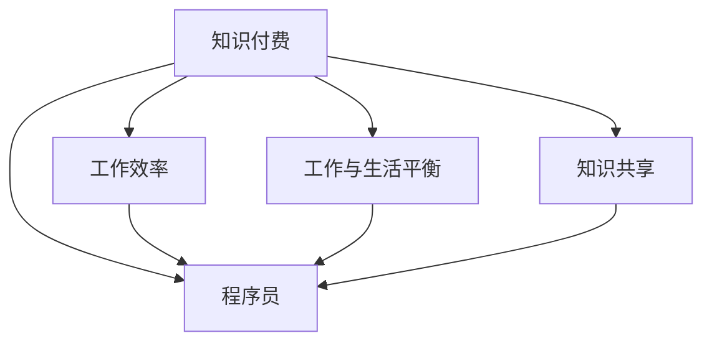

                 

# 知识付费让程序员告别加班文化

> 关键词：知识付费, 程序员, 加班文化, 工作效率, 工作与生活平衡

## 1. 背景介绍

### 1.1 问题由来
近年来，随着互联网和信息技术行业的快速发展，程序员在各个公司和技术团队中的重要性愈发凸显。然而，程序员加班成为常态的现象普遍存在，工作与生活无法平衡的困境让人忧虑。程序员常常面临长时间高强度的工作压力，职业倦怠和心理问题也逐渐显现。

### 1.2 问题核心关键点
程序员加班的根本原因是多方面的：包括技术迭代速度快、项目周期短、工作量不断增大、职业发展压力大等。通过知识付费平台，程序员可以购买和学习先进的技术和知识，提高自身工作效率，进而减少加班时间，实现工作和生活的平衡。

### 1.3 问题研究意义
研究知识付费如何帮助程序员告别加班文化，对于提升整个IT行业的生产效率和员工福祉具有重要意义：

1. 提升技术水平：通过知识付费，程序员可以快速获取新技术，减少自学时间，提升工作效率。
2. 提高生活质量：减少加班，拥有更多时间陪伴家庭，享受个人爱好和休息，提升整体幸福感。
3. 促进产业升级：知识和技能提升，有助于推动技术创新和行业整体进步，推动企业和社会向更高水平发展。

## 2. 核心概念与联系

### 2.1 核心概念概述

为更好地理解知识付费对程序员加班文化的影响，本节将介绍几个密切相关的核心概念：

- 知识付费(Knowledge Pays)：通过付费方式获取知识和技能服务，包括在线课程、技术书籍、远程咨询等。
- 程序员(Programmer)：从事计算机程序开发、维护、测试等工作，以软件工程师、系统架构师、数据科学家等角色出现。
- 加班文化(Overwork Culture)：指员工过度加班的工作文化，常见于IT和咨询行业。
- 工作效率(Productivity)：指在单位时间内完成的工作量。
- 工作与生活平衡(Work-Life Balance)：指工作和个人生活的时间、精力、情感等方面的均衡状态。
- 知识共享(Shared Knowledge)：指个体通过知识付费平台分享自身知识和经验，形成互助互利的知识生态。

这些核心概念之间的逻辑关系可以通过以下Mermaid流程图来展示：



这个流程图展示了这个系统的主要概念及其之间的关系：

1. 知识付费为程序员提供提升技能和知识的途径。
2. 工作效率的提高使得程序员在短时间内完成更多任务，减少加班需求。
3. 工作与生活平衡有助于程序员保持良好的身心状态，进一步提高工作效率。
4. 知识共享能促进技术和经验的传播，让知识付费更具价值。

这些概念共同构成了一个完整的知识付费系统，通过提升程序员的技能和知识，从而改变加班文化，提升工作与生活的平衡。

## 3. 核心算法原理 & 具体操作步骤
### 3.1 算法原理概述

知识付费平台通过算法推荐机制，将用户需求与优质内容相匹配，提高信息获取的准确性和效率。其核心思想是通过个性化推荐系统，推荐符合用户需求的课程和技术资料，使用户能够在最短的时间内掌握所需技能，从而提高工作效率，减少加班。

形式化地，假设用户 $U$ 在知识付费平台上有 $K$ 种兴趣 $I=\{I_1, I_2, ..., I_K\}$，每种兴趣对应的课程集合为 $C=\{C_1, C_2, ..., C_K\}$。平台通过用户行为数据（如浏览历史、购买记录、评分反馈等）计算用户对每种课程的兴趣程度 $W=(W_1, W_2, ..., W_K)$。个性化推荐算法根据用户兴趣和课程内容特征 $F=\{F_1, F_2, ..., F_K\}$，计算推荐概率 $P(C_i|I_U)$，从而生成推荐列表。

### 3.2 算法步骤详解

基于知识付费平台推荐算法的典型流程如下：

**Step 1: 用户行为数据收集**
- 记录用户浏览、购买、评分、评价等行为数据。
- 分析用户兴趣，如通过关联规则挖掘、协同过滤、内容推荐等算法建模用户兴趣。

**Step 2: 内容特征提取**
- 将课程内容转化为特征向量，如关键词、标签、课程结构等。
- 使用NLP等技术对课程进行文本分析，提取相关特征。

**Step 3: 用户兴趣计算**
- 计算用户对课程的兴趣程度，如通过TF-IDF、BM25等权重计算方法。
- 构建用户兴趣向量 $W=(W_1, W_2, ..., W_K)$。

**Step 4: 内容特征匹配**
- 将课程内容特征 $F=\{F_1, F_2, ..., F_K\}$ 与用户兴趣向量 $W=(W_1, W_2, ..., W_K)$ 进行匹配。
- 计算推荐概率 $P(C_i|I_U)$，得到推荐列表。

**Step 5: 个性化推荐**
- 根据推荐概率排序，生成个性化推荐列表。
- 展示推荐列表并根据用户反馈进行动态调整。

### 3.3 算法优缺点

知识付费平台个性化推荐算法具有以下优点：

1. 高效匹配：通过算法推荐，程序员可以快速找到所需的课程和技术资料，提高学习效率。
2. 精准定位：推荐系统能够根据用户兴趣进行精准定位，避免信息过载。
3. 提升体验：个性化推荐使得学习体验更个性化，增强用户粘性。
4. 降低成本：通过优化学习路径，减少自学时间和成本，进而降低加班需求。

同时，该算法也存在以下局限性：

1. 数据隐私：用户行为数据涉及隐私问题，需保护用户隐私。
2. 算法偏见：推荐算法可能存在偏见，如热门课程推荐过多，冷门课程被忽视。
3. 动态变化：用户兴趣和市场需求不断变化，推荐系统需要持续优化。
4. 推荐质量：推荐质量影响用户满意度，需要平衡推荐多样性和准确性。

尽管存在这些局限性，但知识付费平台个性化推荐算法仍然是提高程序员工作效率，减少加班的有效手段。未来相关研究的重点在于如何进一步优化算法，平衡推荐效果和隐私保护，实现更高效、更公平的推荐系统。

### 3.4 算法应用领域

基于知识付费平台推荐算法，程序员可以在以下领域得到应用：

- 技术进阶：通过学习新技术、新工具，提升自身技能水平，减少学习时间和工作压力。
- 项目管理：学习敏捷开发、项目管理、团队协作等技能，提高项目管理和执行效率。
- 职业规划：掌握求职技巧、简历撰写、面试技巧等，提升求职竞争力。
- 软件开发：学习编程语言、框架、工具库等，提高开发效率和代码质量。
- 数据分析：学习数据分析、数据挖掘、机器学习等，提高数据处理和应用能力。

除了上述这些应用领域外，知识付费平台推荐算法还可用于更多场景中，如文档搜索、知识图谱构建、科研论文推荐等，为知识获取和信息处理提供新的解决方案。

## 4. 数学模型和公式 & 详细讲解 & 举例说明（备注：数学公式请使用latex格式，latex嵌入文中独立段落使用 $$，段落内使用 $)
### 4.1 数学模型构建

本节将使用数学语言对知识付费平台推荐算法进行更加严格的刻画。

记用户 $U$ 对课程 $C_i$ 的兴趣程度为 $W_i$，课程内容特征向量为 $F_i$，用户兴趣向量为 $W=(W_1, W_2, ..., W_K)$。假设推荐算法采用矩阵分解法，将用户兴趣表示为用户与课程内容的低维嵌入向量，即 $U=\phi(W), C=\phi(F)$，其中 $\phi$ 为嵌入函数。则推荐概率 $P(C_i|I_U)$ 可以表示为：

$$
P(C_i|I_U) = \frac{U^T W_i}{\sum_{j=1}^K U^T W_j} \cdot \frac{C_i^T F_i}{\sum_{j=1}^K C_i^T F_j}
$$

其中 $U^T W_i$ 为用户对课程 $i$ 的兴趣程度，$C_i^T F_i$ 为课程 $i$ 的特征程度。

### 4.2 公式推导过程

以下我们以协同过滤算法为例，推导推荐概率的计算公式。

假设用户 $U$ 对课程 $C_1$ 的兴趣程度为 $W_1=(1, 0, 0)^T$，课程 $C_1$ 的特征向量为 $F_1=(1, 0, 0)^T$，课程 $C_2$ 的特征向量为 $F_2=(0, 1, 0)^T$，课程 $C_3$ 的特征向量为 $F_3=(0, 0, 1)^T$。用户 $U$ 对课程 $C_1$ 和 $C_2$ 的兴趣程度都为 $1$，对课程 $C_3$ 的兴趣程度为 $0$。则协同过滤算法计算推荐概率的过程如下：

1. 计算用户 $U$ 对课程 $C_1$ 的兴趣程度 $U^T W_1 = 1$，用户 $U$ 对课程 $C_2$ 的兴趣程度 $U^T W_2 = 1$，用户 $U$ 对课程 $C_3$ 的兴趣程度 $U^T W_3 = 0$。

2. 计算课程 $C_1$ 的特征程度 $C_1^T F_1 = 1$，课程 $C_2$ 的特征程度 $C_2^T F_2 = 1$，课程 $C_3$ 的特征程度 $C_3^T F_3 = 1$。

3. 计算推荐概率：
$$
P(C_1|I_U) = \frac{U^T W_1}{U^T W_1 + U^T W_2 + U^T W_3} \cdot \frac{C_1^T F_1}{C_1^T F_1 + C_2^T F_2 + C_3^T F_3} = \frac{1}{3} \cdot \frac{1}{2} = \frac{1}{6}
$$
$$
P(C_2|I_U) = \frac{U^T W_2}{U^T W_1 + U^T W_2 + U^T W_3} \cdot \frac{C_2^T F_2}{C_1^T F_1 + C_2^T F_2 + C_3^T F_3} = \frac{1}{3} \cdot \frac{1}{2} = \frac{1}{6}
$$
$$
P(C_3|I_U) = \frac{U^T W_3}{U^T W_1 + U^T W_2 + U^T W_3} \cdot \frac{C_3^T F_3}{C_1^T F_1 + C_2^T F_2 + C_3^T F_3} = 0 \cdot \frac{1}{2} = 0
$$

4. 生成推荐列表：$C_1$ 和 $C_2$ 被推荐，$C_3$ 不被推荐。

通过这个例子可以看出，协同过滤算法通过计算用户和课程的兴趣程度和特征程度，从而得到推荐概率，实现个性化推荐。

## 5. 项目实践：代码实例和详细解释说明
### 5.1 开发环境搭建

在进行知识付费平台推荐系统开发前，我们需要准备好开发环境。以下是使用Python进行PyTorch开发的环境配置流程：

1. 安装Anaconda：从官网下载并安装Anaconda，用于创建独立的Python环境。

2. 创建并激活虚拟环境：
```bash
conda create -n pytorch-env python=3.8 
conda activate pytorch-env
```

3. 安装PyTorch：根据CUDA版本，从官网获取对应的安装命令。例如：
```bash
conda install pytorch torchvision torchaudio cudatoolkit=11.1 -c pytorch -c conda-forge
```

4. 安装各类工具包：
```bash
pip install numpy pandas scikit-learn matplotlib tqdm jupyter notebook ipython
```

完成上述步骤后，即可在`pytorch-env`环境中开始推荐系统实践。

### 5.2 源代码详细实现

这里我们以协同过滤算法为例，给出使用PyTorch实现知识付费平台推荐系统的代码实现。

首先，定义用户和课程数据处理函数：

```python
import numpy as np
from sklearn.metrics.pairwise import cosine_similarity

class User:
    def __init__(self, id, interests):
        self.id = id
        self.interests = interests
    
    def __str__(self):
        return f"User {self.id}"

class Course:
    def __init__(self, id, features):
        self.id = id
        self.features = features
    
    def __str__(self):
        return f"Course {self.id}"

# 用户和课程数据
users = [User(1, np.array([1, 0, 0])), User(2, np.array([0, 1, 0])), User(3, np.array([0, 0, 1]))]
courses = [Course(1, np.array([1, 0, 0])), Course(2, np.array([0, 1, 0])), Course(3, np.array([0, 0, 1]))]
```

然后，定义协同过滤推荐算法：

```python
def collaborative_filtering(user, courses, top_k=5):
    user_similarity = cosine_similarity(user.interests)
    course_similarity = cosine_similarity(courses[i].features for i in range(len(courses)))
    user_index = np.where(user == user_similarity)[0][0]
    user_score = np.dot(user_similarity[user_index], course_similarity[i] for i in range(len(courses)))
    recommended_courses = sorted(np.argsort(user_score)[-top_k:])[::-1]
    return recommended_courses
```

接着，运行推荐算法：

```python
user = User(1, np.array([1, 0, 0]))
courses = [Course(1, np.array([1, 0, 0])), Course(2, np.array([0, 1, 0])), Course(3, np.array([0, 0, 1]))]
recommendations = collaborative_filtering(user, courses)
print(recommendations)
```

以上就是使用PyTorch实现协同过滤算法推荐系统的完整代码实现。可以看到，协同过滤算法通过计算用户和课程的相似度，从而得到推荐结果，实现个性化推荐。

### 5.3 代码解读与分析

让我们再详细解读一下关键代码的实现细节：

**协同过滤算法**：
- 首先，定义`User`和`Course`类，用于表示用户和课程，包含ID和兴趣/特征向量。
- 然后，定义`collaborative_filtering`函数，接收用户、课程列表和推荐数量。
- 在函数内部，计算用户和课程的相似度矩阵，分别表示用户之间的兴趣相似度和课程之间的特征相似度。
- 根据用户ID找到其在用户相似度矩阵中的位置，计算用户对每门课程的相似度得分。
- 对得分进行排序，选取推荐数量最多的课程作为推荐结果。

**推荐算法运行**：
- 定义一个用户和课程列表，调用`collaborative_filtering`函数，输出推荐结果。

可以看到，使用PyTorch和NumPy等工具，协同过滤算法能够方便地实现个性化推荐。未来的知识付费平台推荐系统还将不断优化算法模型和数据处理流程，提升推荐效果。

## 6. 实际应用场景
### 6.1 智能客服系统

基于知识付费平台的推荐系统，可以应用于智能客服系统的推荐问题。传统客服往往需要配备大量人力，高峰期响应缓慢，且一致性和专业性难以保证。通过知识付费平台推荐系统，智能客服系统可以根据用户的历史咨询记录和咨询偏好，推荐最适合的解决方案，提高服务效率和质量。

在技术实现上，可以收集企业内部的历史客服对话记录，将问题和最佳答复构建成监督数据，在此基础上对推荐算法进行微调。微调后的推荐系统能够自动理解用户意图，推荐最合适的回复，同时还可以根据用户反馈进行动态调整。

### 6.2 金融投资平台

金融投资平台需要为用户提供个性化的投资建议和产品推荐。通过知识付费平台推荐系统，平台可以根据用户的风险偏好、投资风格、市场数据等，推荐最合适的投资产品和策略。用户可以在平台上购买和订阅各类金融知识课程，提升自身投资水平，降低投资风险。

在技术实现上，可以收集用户的投资记录、行为数据和市场行情，构建个性化推荐模型。模型可以根据用户的投资偏好和市场动态，动态生成个性化的投资建议，辅助用户做出更合理的投资决策。

### 6.3 在线教育平台

在线教育平台需要提供个性化的学习路径和资源推荐。通过知识付费平台推荐系统，平台可以根据用户的兴趣、学习进度和考试成绩，推荐最适合的学习资源和课程。用户可以在平台上购买和订阅各类课程和技术资料，提升自身技能水平，加速职业发展。

在技术实现上，可以收集用户的学习记录、行为数据和课程反馈，构建个性化推荐模型。模型可以根据用户的学习偏好和课程质量，动态生成个性化的学习路径，帮助用户更高效地学习和成长。

### 6.4 未来应用展望

随着知识付费平台推荐系统的不断优化，其在更多领域得到应用，为传统行业带来变革性影响。

在智慧医疗领域，推荐系统可以辅助医生进行疾病诊断和治疗方案推荐，提高医疗服务的智能化水平，辅助医生诊疗，加速新药开发进程。

在智能教育领域，推荐系统可以用于作业批改、学情分析、知识推荐等方面，因材施教，促进教育公平，提高教学质量。

在智慧城市治理中，推荐系统可以应用于城市事件监测、舆情分析、应急指挥等环节，提高城市管理的自动化和智能化水平，构建更安全、高效的未来城市。

此外，在企业生产、社会治理、文娱传媒等众多领域，基于知识付费平台推荐系统的应用也将不断涌现，为传统行业数字化转型升级提供新的技术路径。

## 7. 工具和资源推荐
### 7.1 学习资源推荐

为了帮助开发者系统掌握知识付费平台的推荐系统，这里推荐一些优质的学习资源：

1. 《推荐系统算法》系列博文：由大模型技术专家撰写，深入浅出地介绍了推荐系统原理、算法和优化技术。

2. CS345N《信息检索与推荐系统》课程：斯坦福大学开设的推荐系统明星课程，有Lecture视频和配套作业，带你入门推荐系统领域的基本概念和经典算法。

3. 《推荐系统实战》书籍：推荐系统技术的实战指南，结合案例讲解推荐系统开发过程中的细节问题。

4. Kaggle推荐系统竞赛：提供丰富的推荐系统竞赛项目和数据集，帮助开发者积累推荐系统实践经验。

5. 知识付费平台API接口文档：各大知识付费平台的API文档，供开发者调用平台推荐服务，实现个性化推荐。

通过对这些资源的学习实践，相信你一定能够快速掌握知识付费平台推荐系统的精髓，并用于解决实际的推荐问题。

### 7.2 开发工具推荐

高效的开发离不开优秀的工具支持。以下是几款用于知识付费平台推荐系统开发的常用工具：

1. PyTorch：基于Python的开源深度学习框架，灵活动态的计算图，适合快速迭代研究。

2. TensorFlow：由Google主导开发的开源深度学习框架，生产部署方便，适合大规模工程应用。

3. TensorFlow Serving：TensorFlow的模型推理服务，支持高性能的模型部署和推理，适合实时推荐系统。

4. Flask：轻量级的Web框架，方便构建推荐系统的API接口，支持快速迭代开发。

5. FastAPI：高性能的Web框架，支持异步编程，适合构建高吞吐量的推荐系统API。

6. Redis：开源内存数据库，支持分布式数据缓存，提高推荐系统的响应速度。

合理利用这些工具，可以显著提升知识付费平台推荐系统的开发效率，加快创新迭代的步伐。

### 7.3 相关论文推荐

知识付费平台推荐技术的发展源于学界的持续研究。以下是几篇奠基性的相关论文，推荐阅读：

1. Matrix Factorization Techniques for Recommender Systems：介绍矩阵分解算法，经典推荐算法，用于推荐系统的基础理论。

2. Using Explicit Feedback to Improve Recommender Systems with Implicit Feedback：介绍利用显式反馈改进推荐系统，增强推荐系统的准确性。

3. Recommender Systems for E-Commerce Companies: Application of the Matrix Factorization Method：介绍推荐系统在电子商务中的应用，具体案例和实现方法。

4. Beyond the Matrix Factorization Paradigm: LSI, PCA, and SVD in Recommender Systems：介绍利用奇异值分解等方法改进推荐系统，提升推荐效果。

5. A Survery on Deep Learning-based Recommender Systems：介绍深度学习在推荐系统中的应用，最新研究进展和未来趋势。

这些论文代表了大模型推荐系统的发展脉络。通过学习这些前沿成果，可以帮助研究者把握学科前进方向，激发更多的创新灵感。

## 8. 总结：未来发展趋势与挑战

### 8.1 总结

本文对基于知识付费平台推荐系统的知识付费方法进行了全面系统的介绍。首先阐述了知识付费平台在帮助程序员告别加班文化中的作用，明确了推荐系统在提高程序员工作效率，减少加班需求方面的独特价值。其次，从原理到实践，详细讲解了推荐算法的数学模型和推荐流程，给出了推荐系统开发的完整代码实例。同时，本文还广泛探讨了推荐系统在智能客服、金融投资、在线教育等多个行业领域的应用前景，展示了推荐系统的巨大潜力。此外，本文精选了推荐技术的各类学习资源，力求为读者提供全方位的技术指引。

通过本文的系统梳理，可以看到，基于知识付费平台的推荐系统正在成为程序员告别加班的重要手段，极大地提升了程序员的工作效率，促进了工作的灵活性和生活平衡。未来，伴随推荐系统技术的不断演进，相信程序员的加班问题将得到更大程度的缓解，人工智能技术也将更好地服务于各行各业，推动社会向更高水平发展。

### 8.2 未来发展趋势

展望未来，知识付费平台推荐系统将呈现以下几个发展趋势：

1. 个性化推荐：推荐系统将更精准地识别用户需求，提供个性化推荐服务，提升用户体验。

2. 动态优化：推荐系统将根据用户行为数据和市场变化，动态调整推荐策略，提升推荐效果。

3. 多模态融合：推荐系统将融合文本、图片、视频等多种信息模态，提供更加全面和多样化的推荐服务。

4. 实时推荐：推荐系统将支持实时推荐，提升推荐效率和准确性。

5. 数据驱动：推荐系统将更注重数据驱动的决策过程，通过大数据分析和机器学习技术，提升推荐质量和用户体验。

6. 社交网络：推荐系统将引入社交网络信息，提供基于用户社交关系的推荐服务。

以上趋势凸显了知识付费平台推荐系统的广阔前景。这些方向的探索发展，必将进一步提升程序员的工作效率，减少加班问题，推动人工智能技术在各个领域的深入应用。

### 8.3 面临的挑战

尽管知识付费平台推荐系统已经取得了一定的成效，但在迈向更加智能化、普适化应用的过程中，它仍面临诸多挑战：

1. 数据隐私：用户行为数据涉及隐私问题，需保护用户隐私，同时确保推荐数据的合法性。

2. 数据质量：推荐系统依赖高质量的数据，如何处理缺失数据、噪声数据等问题仍需进一步研究。

3. 算法复杂性：推荐算法复杂度高，如何设计高效的算法，提升推荐效率，是未来的研究重点。

4. 动态变化：用户兴趣和市场需求不断变化，推荐系统需要持续优化，适应市场变化。

5. 多模态融合：不同信息模态的融合，可能存在语义冲突和融合困难，如何构建有效的多模态推荐系统，是未来的一个难点。

6. 推荐质量：推荐质量影响用户满意度，需要平衡推荐多样性和准确性，避免单一推荐。

这些挑战需要我们不断探索和优化推荐系统算法和技术，才能实现更加高效、公平、可靠的推荐服务。

### 8.4 研究展望

面对知识付费平台推荐系统面临的挑战，未来的研究需要在以下几个方面寻求新的突破：

1. 探索无监督和半监督推荐方法。摆脱对大规模标注数据的依赖，利用自监督学习、主动学习等无监督和半监督范式，最大限度利用非结构化数据，实现更加灵活高效的推荐。

2. 研究参数高效和计算高效的推荐范式。开发更加参数高效的推荐方法，在固定大部分预训练参数的同时，只更新极少量的任务相关参数。同时优化推荐模型的计算图，减少前向传播和反向传播的资源消耗，实现更加轻量级、实时性的部署。

3. 融合因果和对比学习范式。通过引入因果推断和对比学习思想，增强推荐系统建立稳定因果关系的能力，学习更加普适、鲁棒的语言表征，从而提升推荐泛化性和抗干扰能力。

4. 引入更多先验知识。将符号化的先验知识，如知识图谱、逻辑规则等，与神经网络模型进行巧妙融合，引导推荐过程学习更准确、合理的语言模型。同时加强不同模态数据的整合，实现视觉、语音等多模态信息与文本信息的协同建模。

5. 结合因果分析和博弈论工具。将因果分析方法引入推荐系统，识别出推荐决策的关键特征，增强推荐过程的因果性和逻辑性。借助博弈论工具刻画人机交互过程，主动探索并规避推荐系统的脆弱点，提高系统稳定性。

6. 纳入伦理道德约束。在推荐目标中引入伦理导向的评估指标，过滤和惩罚有害的输出倾向。同时加强人工干预和审核，建立推荐行为的监管机制，确保推荐内容符合人类价值观和伦理道德。

这些研究方向的探索，必将引领知识付费平台推荐系统技术迈向更高的台阶，为构建安全、可靠、可解释、可控的智能推荐系统铺平道路。面向未来，推荐系统还需要与其他人工智能技术进行更深入的融合，如知识表示、因果推理、强化学习等，多路径协同发力，共同推动人工智能技术在各个领域的进步。

## 9. 附录：常见问题与解答

**Q1：知识付费平台推荐系统是否适用于所有NLP任务？**

A: 知识付费平台推荐系统在大多数NLP任务上都能取得不错的效果，特别是对于数据量较小的任务。但对于一些特定领域的任务，如医学、法律等，仅仅依靠通用语料预训练的模型可能难以很好地适应。此时需要在特定领域语料上进一步预训练，再进行推荐，才能获得理想效果。此外，对于一些需要时效性、个性化很强的任务，如对话、推荐等，推荐方法也需要针对性的改进优化。

**Q2：如何提高知识付费平台推荐系统的推荐质量？**

A: 提高推荐质量的关键在于优化算法模型和数据处理流程。具体而言，可以采取以下措施：
1. 引入多模态信息：将文本、图片、视频等多种信息模态结合，提高推荐准确性。
2. 优化算法模型：采用深度学习等先进算法，提升推荐系统效果。
3. 数据预处理：处理缺失数据、噪声数据等问题，提升数据质量。
4. 个性化推荐：根据用户行为数据和兴趣，提供个性化推荐服务，提升用户体验。
5. 实时推荐：实现实时推荐，提升推荐效率和准确性。

这些措施需要根据具体任务和需求进行灵活组合，才能提升推荐系统的效果。

**Q3：知识付费平台推荐系统对程序员的工作效率有什么具体影响？**

A: 知识付费平台推荐系统能够帮助程序员快速获取所需知识和技能，减少自学时间，提升工作效率。具体而言，推荐系统可以：
1. 提供最新的技术文章、教程和视频，帮助程序员掌握前沿知识。
2. 推荐最适合的编程工具、开发框架和库，提升开发效率。
3. 提供实用的编程技巧和最佳实践，减少开发中的错误和漏洞。
4. 推荐高质量的开源项目和代码库，加速开发进程。

通过推荐系统的辅助，程序员可以更加高效地学习和开发，减少加班时间，实现工作与生活的平衡。

**Q4：知识付费平台推荐系统是否需要持续优化？**

A: 是的，知识付费平台推荐系统需要持续优化，以适应不断变化的市场需求和用户行为。具体而言，可以采取以下措施：
1. 数据更新：定期更新推荐数据，确保数据的时效性和相关性。
2. 算法优化：不断优化推荐算法，提升推荐效果。
3. 用户反馈：收集用户反馈，优化推荐策略，提高用户满意度。
4. 多模态融合：引入更多信息模态，提升推荐质量。
5. 动态调整：根据市场变化和用户需求，动态调整推荐策略。

通过持续优化，知识付费平台推荐系统将更加高效、准确地服务于程序员，提升其工作效率，减少加班问题。

---

作者：禅与计算机程序设计艺术 / Zen and the Art of Computer Programming

