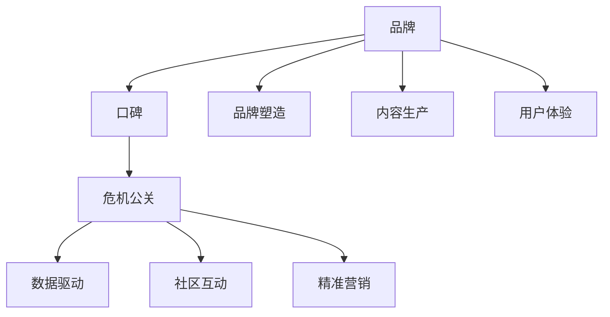

                 

# 知识付费赚钱的品牌口碑管理与危机公关

> 关键词：知识付费, 品牌口碑管理, 危机公关, 数据驱动, 社区互动, 精准营销

## 1. 背景介绍

### 1.1 问题由来
随着互联网的普及和教育需求的增长，知识付费市场迅速崛起。各类在线课程、问答、电子书、直播等形式的知识付费产品如雨后春笋般涌现，极大地推动了教育的数字化、个性化和普及化。然而，与知识付费业务增长相伴的是用户对品牌信任度的不断挑战。品牌口碑管理与危机公关成为企业维持市场份额、吸引新用户的关键因素。

### 1.2 问题核心关键点
品牌口碑管理与危机公关的核心在于如何在知识付费领域内建立和维护品牌信任度，以及当品牌遭遇负面事件时如何及时响应，化解危机。这需要企业在品牌塑造、内容生产、用户体验、社区互动等方面持续投入，并在危机发生时采取有效的公关策略，维护品牌形象。

### 1.3 问题研究意义
品牌口碑管理与危机公关的深入研究，对于知识付费行业具有重要意义：
1. 提升品牌价值：通过科学的管理与公关策略，提高品牌在用户心中的美誉度，增加品牌忠诚度。
2. 增加用户黏性：通过优质的内容和服务，增强用户体验，吸引更多用户。
3. 应对市场竞争：在激烈的市场竞争中，通过有效的危机应对措施，避免品牌形象受损。
4. 促进企业成长：通过对用户反馈的持续优化，不断完善产品和服务，推动企业持续发展。

## 2. 核心概念与联系

### 2.1 核心概念概述

品牌口碑管理与危机公关涉及多个核心概念，这些概念之间的联系紧密，共同构成了一个完整的品牌保护和危机应对体系。

- **品牌（Brand）**：企业或产品在用户心中的形象和声誉。
- **口碑（Word of Mouth, WOM）**：用户基于个人体验对品牌的好评或差评。
- **危机公关（Crisis Public Relations, PR）**：在品牌遭遇负面事件时，通过有效沟通和公关策略，修复品牌形象的过程。
- **数据驱动（Data-Driven）**：利用数据分析优化品牌管理与危机公关策略。
- **社区互动（Community Interaction）**：通过社区平台增强用户参与度和互动性，提升品牌黏性。
- **精准营销（Precision Marketing）**：基于用户行为和反馈的个性化营销，提升营销效果。

这些概念通过以下Mermaid流程图表示它们的联系：



这个流程图展示了大语言模型的核心概念及其之间的关系：

1. **品牌塑造（A --> G）**：通过优质的产品和服务，构建品牌形象。
2. **内容生产（A --> H）**：提供有价值的内容吸引用户，增加品牌曝光。
3. **用户体验（A --> I）**：提升用户使用体验，增加用户满意度。
4. **口碑传播（B --> C）**：用户的好评会促进品牌知名度和美誉度的提升，差评则可能触发危机公关。
5. **危机公关（C --> B）**：负面事件发生后，及时响应，修复品牌形象。
6. **数据驱动（D --> C）**：通过数据分析，优化公关策略，及时响应用户需求。
7. **社区互动（E --> C）**：在社区平台积极互动，增强用户黏性。
8. **精准营销（F --> C）**：通过个性化推荐，提高营销效果，提升品牌价值。

这些概念共同构成了品牌口碑管理与危机公关的理论框架，为企业提供了系统的解决方案。

## 3. 核心算法原理 & 具体操作步骤
### 3.1 算法原理概述

品牌口碑管理与危机公关的算法原理基于以下几个核心步骤：

1. **数据收集与分析**：通过用户行为数据、用户反馈、社交媒体评论等数据收集和分析，了解品牌形象和用户需求。
2. **品牌情绪分析**：利用自然语言处理（NLP）技术，对用户评论和反馈进行情感分析，判断品牌情绪状态。
3. **危机预警与响应**：建立危机预警系统，及时发现和响应品牌危机，采取有效公关策略。
4. **用户关系管理**：通过社区平台和精准营销，增强用户关系，提升品牌忠诚度。

### 3.2 算法步骤详解

品牌口碑管理与危机公关的算法步骤详细如下：

**Step 1: 数据收集与分析**

- **数据源**：从用户行为数据（如购买记录、观看时长）、用户反馈（如评论、评分）、社交媒体评论等渠道收集数据。
- **数据清洗与预处理**：去除噪声数据，进行文本分词、去除停用词等预处理操作。
- **情感分析**：使用NLP技术，如情感词典、深度学习模型（如BERT、LSTM等），对用户评论和反馈进行情感分析，识别积极或消极情绪。
- **品牌情绪计算**：计算品牌的整体情绪状态，如品牌正面评价比例、负面评价比例等指标。

**Step 2: 品牌情绪分析**

- **情感词典构建**：构建品牌相关的情感词典，用于标记品牌相关评论的情感。
- **深度学习模型训练**：利用有标注的数据集训练情感分析模型，如BERT、GPT等。
- **情绪分析**：将用户评论输入训练好的模型，输出品牌情感标签，判断用户对品牌的态度。

**Step 3: 危机预警与响应**

- **危机监测**：建立基于NLP技术的危机监测系统，实时监控品牌相关负面评论。
- **情感阈值设置**：设定负面情感阈值，当情感得分超过阈值时，触发预警机制。
- **预警响应**：自动回复用户评论，提供解决方案，或将问题上报给相关部门处理。

**Step 4: 用户关系管理**

- **社区互动**：在品牌社区平台上，积极与用户互动，解答疑问，提供帮助。
- **精准营销**：基于用户行为和反馈，进行个性化推荐，提升用户满意度。
- **用户反馈循环**：将用户反馈作为新内容和服务改进的依据，形成反馈循环，持续优化品牌体验。

### 3.3 算法优缺点

品牌口碑管理与危机公关算法具有以下优点：
1. **实时响应**：通过实时监控和预警系统，可以及时发现和响应危机，避免负面影响扩大。
2. **数据驱动**：基于数据驱动的决策过程，提高了品牌管理与危机公关的准确性和有效性。
3. **个性化营销**：通过精准营销策略，提高了营销效果，提升了品牌价值。
4. **用户关系增强**：通过社区互动和个性化推荐，增强了用户关系，提高了用户黏性。

同时，该算法也存在一些局限性：
1. **数据隐私**：用户数据的收集和使用需要遵守隐私保护法规，如GDPR等。
2. **数据噪声**：社交媒体评论等数据可能存在噪声，影响情感分析的准确性。
3. **技术门槛**：算法实现需要一定的技术背景，对非技术人员较为复杂。
4. **成本投入**：数据收集、模型训练、系统维护等成本较高。

尽管存在这些局限性，但通过不断优化算法和技术，可以最大程度地发挥其优势，提升品牌口碑管理与危机公关的效率和效果。

### 3.4 算法应用领域

品牌口碑管理与危机公关算法已经在多个领域得到广泛应用，例如：

- **在线教育平台**：通过情感分析和用户反馈，优化课程内容和教学方式，提升用户满意度。
- **电商平台**：利用用户行为数据和情感分析，优化产品推荐，提升用户购物体验。
- **金融服务**：通过社区互动和情感监测，增强用户信任度，提升品牌形象。
- **医疗健康**：利用用户反馈和情感分析，优化医疗服务，提升患者满意度。
- **旅游服务**：通过社区互动和情感分析，优化旅游产品和服务，提升用户口碑。

除了上述这些领域外，品牌口碑管理与危机公关算法也被创新性地应用到更多场景中，如在线广告、智能客服、内容推荐等，为品牌管理与危机应对提供了新的思路。

## 4. 数学模型和公式 & 详细讲解 & 举例说明（备注：数学公式请使用latex格式，latex嵌入文中独立段落使用 $$，段落内使用 $)
### 4.1 数学模型构建

品牌口碑管理与危机公关的数学模型构建主要包括以下几个部分：

- **品牌情绪评分**：通过情感词典和深度学习模型，计算品牌情感评分。
- **危机预警阈值**：设定负面情感阈值，用于触发预警机制。
- **用户关系得分**：通过社区互动和精准营销，计算用户关系得分。

### 4.2 公式推导过程

以下我们以品牌情绪评分为例，推导情感分析的数学模型。

假设品牌相关的情感词典为 $D$，每个词语的情绪评分在 $[0,1]$ 之间。对品牌相关评论 $C$ 进行分词后，情感评分函数定义为：

$$
\text{Emotion Score}(C) = \sum_{w \in C} w_{D} \cdot \text{Emotion Score}(w)
$$

其中 $w_D$ 表示词语 $w$ 在情感词典 $D$ 中的情感评分。情感词典 $D$ 可以是预定义的，也可以是通过大量评论数据自动学习得到的。

利用深度学习模型进行情感分析时，可以采用BERT等模型的隐层向量表示情感评分：

$$
\text{Emotion Score}(C) = \sum_{w \in C} \text{BERT}_\theta(w) \cdot \text{Emotion Score}(w)
$$

其中 $\text{BERT}_\theta(w)$ 表示在预训练模型 $\theta$ 中，输入文本 $w$ 的隐层向量表示。

### 4.3 案例分析与讲解

以在线教育平台为例，展示品牌口碑管理与危机公关的实际应用。

**案例背景**：某在线教育平台推出一门新课程，通过社交媒体和社区平台进行推广。课程发布后，有大量用户反馈，但部分用户对课程内容表示不满意，导致品牌形象受损。

**数据收集与分析**：从社交媒体和社区平台收集用户评论，进行情感分析，计算品牌情绪得分。

**品牌情绪分析**：使用深度学习模型，对用户评论进行情感分析，计算品牌情绪得分。例如，如果用户评论包含“太无聊了”、“不实用”等词语，则情感得分较低。

**危机预警与响应**：设定负面情感阈值，当情感得分超过阈值时，触发预警机制，自动回复用户评论，并提供解决方案。

**用户关系管理**：在社区平台上积极与用户互动，解答疑问，提供帮助，增强用户黏性。同时，根据用户反馈进行课程优化，提升课程质量。

通过以上步骤，平台能够及时响应用户反馈，修复品牌形象，同时通过社区互动和个性化推荐，提升用户满意度，增强品牌忠诚度。

## 5. 项目实践：代码实例和详细解释说明
### 5.1 开发环境搭建

在进行品牌口碑管理与危机公关的实践前，我们需要准备好开发环境。以下是使用Python进行PyTorch开发的环境配置流程：

1. 安装Anaconda：从官网下载并安装Anaconda，用于创建独立的Python环境。

2. 创建并激活虚拟环境：
```bash
conda create -n pytorch-env python=3.8 
conda activate pytorch-env
```

3. 安装PyTorch：根据CUDA版本，从官网获取对应的安装命令。例如：
```bash
conda install pytorch torchvision torchaudio cudatoolkit=11.1 -c pytorch -c conda-forge
```

4. 安装Natural Language Toolkit（NLTK）：
```bash
pip install nltk
```

5. 安装各类工具包：
```bash
pip install numpy pandas scikit-learn matplotlib tqdm jupyter notebook ipython
```

完成上述步骤后，即可在`pytorch-env`环境中开始项目实践。

### 5.2 源代码详细实现

下面我们以在线教育平台的用户情感分析为例，给出使用PyTorch进行品牌情感分析的代码实现。

首先，定义情感词典：

```python
from nltk.corpus import stopwords
from nltk.tokenize import word_tokenize
from transformers import BertTokenizer, BertForSequenceClassification

# 构建情感词典
emotion_dict = {'positive': 0.5, 'negative': 0.3, 'neutral': 0.2}
stop_words = set(stopwords.words('english'))

# 分词函数
def tokenize(text):
    return word_tokenize(text.lower()) - stop_words
```

然后，定义情感分析模型：

```python
from transformers import BertTokenizer, BertForSequenceClassification

# 加载BERT模型
tokenizer = BertTokenizer.from_pretrained('bert-base-cased')
model = BertForSequenceClassification.from_pretrained('bert-base-cased', num_labels=len(emotion_dict))

# 计算情感得分
def emotion_score(text):
    tokens = tokenize(text)
    input_ids = tokenizer(tokens, return_tensors='pt')['input_ids']
    attention_mask = tokenizer(tokens, return_tensors='pt')['attention_mask']
    outputs = model(input_ids, attention_mask=attention_mask)
    logits = outputs.logits
    probs = logits.softmax(dim=1)
    emotion_score = probs[0].max()  # 取概率最大的情感得分
    return emotion_score
```

最后，在实际应用中，将用户评论作为输入，计算情感得分，根据得分判断用户情绪，进行预警和响应：

```python
# 测试数据
user_comments = ['课程内容太无聊了', '老师讲得太快，跟不上', '课程很实用，推荐', '课程难度较大，不太适合初学者']

# 计算情感得分
for comment in user_comments:
    score = emotion_score(comment)
    if score > 0.5:
        print(f'用户评论：{comment}，情感得分：{score}，需预警响应')
    else:
        print(f'用户评论：{comment}，情感得分：{score}，无需预警响应')
```

以上就是使用PyTorch进行品牌情感分析的完整代码实现。可以看到，利用NLP技术和深度学习模型，可以对品牌相关评论进行情感分析，计算情感得分，从而进行预警和响应。

### 5.3 代码解读与分析

让我们再详细解读一下关键代码的实现细节：

**情感词典构建**：
- 定义情感词典，包含积极、中性、消极三种情感类别。
- 加载停用词列表，去除文本中的停用词。

**分词函数**：
- 使用NLTK库进行文本分词，转换为小写字母，去除停用词。

**情感分析模型**：
- 使用BertTokenizer对文本进行分词，生成输入特征。
- 使用BertForSequenceClassification模型进行情感分类，输出概率分布。
- 通过概率分布计算情感得分，判断情感类别。

**情感得分计算**：
- 对用户评论进行分词和特征提取。
- 输入模型计算情感得分，返回概率最大的情感类别。

通过以上步骤，可以实现在线教育平台的用户情感分析，及时发现用户负面情绪，进行预警和响应，提升用户体验。

## 6. 实际应用场景
### 6.1 智能客服系统

智能客服系统通过品牌口碑管理与危机公关算法，可以显著提升用户满意度，增强品牌忠诚度。具体应用场景如下：

- **实时监控**：系统实时监控用户评论和反馈，及时发现负面情绪。
- **情感分析**：通过NLP技术，对用户评论进行情感分析，计算情感得分。
- **预警响应**：设定负面情感阈值，当情感得分超过阈值时，触发预警机制，自动回复用户评论，并提供解决方案。
- **社区互动**：在社区平台上积极与用户互动，解答疑问，提供帮助，增强用户黏性。

通过以上步骤，智能客服系统能够及时响应用户反馈，修复品牌形象，同时通过社区互动和个性化推荐，提升用户满意度，增强品牌忠诚度。

### 6.2 电商平台

电商平台通过品牌口碑管理与危机公关算法，可以提升用户购物体验，增加品牌信任度。具体应用场景如下：

- **用户行为分析**：利用用户行为数据，计算用户满意度得分。
- **情感分析**：通过NLP技术，对用户评论进行情感分析，计算情感得分。
- **危机预警与响应**：设定负面情感阈值，当情感得分超过阈值时，触发预警机制，自动回复用户评论，并提供解决方案。
- **精准营销**：根据用户行为和情感分析结果，进行个性化推荐，提升用户满意度。

通过以上步骤，电商平台能够及时响应用户反馈，修复品牌形象，同时通过社区互动和个性化推荐，提升用户满意度，增强品牌信任度。

### 6.3 金融服务

金融服务通过品牌口碑管理与危机公关算法，可以增强用户信任度，提升品牌形象。具体应用场景如下：

- **情感分析**：通过NLP技术，对用户评论进行情感分析，计算情感得分。
- **危机预警与响应**：设定负面情感阈值，当情感得分超过阈值时，触发预警机制，自动回复用户评论，并提供解决方案。
- **社区互动**：在社区平台上积极与用户互动，解答疑问，提供帮助，增强用户黏性。

通过以上步骤，金融服务能够及时响应用户反馈，修复品牌形象，同时通过社区互动和个性化推荐，增强用户信任度，提升品牌形象。

### 6.4 未来应用展望

随着品牌口碑管理与危机公关算法的发展，未来的应用场景将更加广泛。以下是一些未来应用展望：

- **智能广告**：利用情感分析结果，优化广告投放策略，提升广告效果。
- **健康医疗**：通过情感分析，优化医疗服务，提升患者满意度。
- **旅游服务**：利用情感分析，优化旅游产品和服务，提升用户口碑。
- **政府服务**：通过情感分析，优化政务服务，提升用户满意度。

这些应用场景展示了品牌口碑管理与危机公关算法的广泛应用潜力，未来将有更多的行业和场景受益于这一技术。

## 7. 工具和资源推荐
### 7.1 学习资源推荐

为了帮助开发者系统掌握品牌口碑管理与危机公关的理论基础和实践技巧，这里推荐一些优质的学习资源：

1. **《数据驱动品牌管理》**：一本系统介绍数据驱动品牌管理方法的书籍，适合深入学习品牌管理的理论和技术。
2. **《危机公关管理》**：一本系统介绍危机公关策略和技巧的书籍，适合深入理解危机公关的全流程。
3. **《自然语言处理实战》**：一本介绍NLP技术和应用的书籍，适合学习NLP技术在品牌管理中的应用。
4. **Coursera《数据科学导论》课程**：由斯坦福大学教授主讲，涵盖数据科学的基本概念和方法，适合入门学习。
5. **edX《品牌管理》课程**：由哈佛商学院教授主讲，涵盖品牌管理的理论和实践，适合系统学习品牌管理知识。

通过对这些资源的学习实践，相信你一定能够快速掌握品牌口碑管理与危机公关的精髓，并用于解决实际的NLP问题。

### 7.2 开发工具推荐

高效的开发离不开优秀的工具支持。以下是几款用于品牌口碑管理与危机公关开发的常用工具：

1. **Python**：开源编程语言，适合开发数据分析和NLP模型。
2. **PyTorch**：基于Python的深度学习框架，适合构建情感分析等模型。
3. **NLTK**：自然语言处理工具库，适合进行文本预处理和分词。
4. **HuggingFace Transformers库**：预训练语言模型的封装库，适合构建品牌情感分析等应用。
5. **TensorBoard**：可视化工具，适合监测模型训练和推理过程。

合理利用这些工具，可以显著提升品牌口碑管理与危机公关的开发效率，加快创新迭代的步伐。

### 7.3 相关论文推荐

品牌口碑管理与危机公关的发展源于学界的持续研究。以下是几篇奠基性的相关论文，推荐阅读：

1. **《数据驱动的品牌情感分析》**：介绍了数据驱动品牌情感分析的方法和技术。
2. **《社交媒体情感分析与品牌管理》**：探讨了社交媒体情感分析在品牌管理中的应用。
3. **《基于情感分析的品牌危机预警与响应》**：介绍了情感分析在品牌危机预警与响应中的应用。
4. **《深度学习在品牌情感分析中的应用》**：介绍了深度学习模型在品牌情感分析中的应用。
5. **《智能客服系统中的情感分析与预警》**：介绍了智能客服系统中的情感分析与预警技术。

这些论文代表了大语言模型微调技术的发展脉络。通过学习这些前沿成果，可以帮助研究者把握学科前进方向，激发更多的创新灵感。

## 8. 总结：未来发展趋势与挑战

### 8.1 总结

本文对品牌口碑管理与危机公关进行了全面系统的介绍。首先阐述了品牌口碑管理与危机公关的研究背景和意义，明确了其在知识付费领域的重要性。其次，从原理到实践，详细讲解了品牌管理与危机公关的数学原理和关键步骤，给出了品牌情感分析的完整代码实例。同时，本文还广泛探讨了品牌口碑管理与危机公关在多个行业领域的应用前景，展示了算法的广泛适用性。

通过本文的系统梳理，可以看到，品牌口碑管理与危机公关在知识付费行业具有重要应用价值，能够显著提升品牌形象，增强用户黏性，降低负面事件带来的风险。未来，随着技术的发展和应用的深入，品牌口碑管理与危机公关算法将进一步提升企业竞争力，助力知识付费业务的持续发展。

### 8.2 未来发展趋势

展望未来，品牌口碑管理与危机公关技术将呈现以下几个发展趋势：

1. **实时化与自动化**：随着实时监控和自动化技术的发展，品牌管理与危机公关将更加实时和高效。
2. **数据融合与多模态分析**：通过融合社交媒体、用户反馈、传感器等多种数据源，进行多模态分析，提升品牌管理与危机公关的准确性和全面性。
3. **深度学习与AI技术**：利用深度学习与AI技术，提升品牌情感分析和危机预警的精度和效果。
4. **个性化与精准营销**：通过个性化推荐和精准营销，提升用户满意度，增强品牌忠诚度。
5. **社区互动与用户生成内容**：增强社区互动，利用用户生成内容，提升品牌形象和用户黏性。

以上趋势凸显了品牌口碑管理与危机公关技术的广阔前景，这些方向的探索发展，必将进一步提升品牌管理的效率和效果。

### 8.3 面临的挑战

尽管品牌口碑管理与危机公关技术已经取得了瞩目成就，但在迈向更加智能化、普适化应用的过程中，它仍面临诸多挑战：

1. **数据隐私与合规**：用户数据的收集和使用需要遵守隐私保护法规，如GDPR等，这对技术实现和应用推广提出了更高要求。
2. **数据噪声与准确性**：社交媒体评论等数据可能存在噪声，影响情感分析的准确性，需要采取有效的数据清洗和处理技术。
3. **技术门槛与资源投入**：算法实现需要一定的技术背景，对非技术人员较为复杂，同时系统建设和维护需要较高的资源投入。
4. **成本与效益**：品牌管理与危机公关的实施需要较高的成本投入，如何平衡成本与效益，需要企业进行精细化管理。

尽管存在这些挑战，但通过不断优化算法和技术，可以最大程度地发挥其优势，提升品牌管理与危机公关的效率和效果。

### 8.4 研究展望

面对品牌口碑管理与危机公关所面临的种种挑战，未来的研究需要在以下几个方面寻求新的突破：

1. **数据隐私保护**：研发更加高效、安全的数据隐私保护技术，确保用户数据安全。
2. **数据清洗与预处理**：研究有效的数据清洗和预处理技术，提高数据质量。
3. **多模态情感分析**：研究多模态情感分析技术，提升品牌情感分析的全面性和准确性。
4. **实时化与自动化**：研究实时化与自动化技术，提高品牌管理与危机公关的效率。
5. **社区互动与用户生成内容**：研究社区互动和用户生成内容的应用，提升品牌形象和用户黏性。

这些研究方向的探索，必将引领品牌口碑管理与危机公关技术迈向更高的台阶，为构建安全、可靠、可解释、可控的智能系统铺平道路。面向未来，品牌口碑管理与危机公关技术还需要与其他人工智能技术进行更深入的融合，如知识表示、因果推理、强化学习等，多路径协同发力，共同推动品牌管理的进步。只有勇于创新、敢于突破，才能不断拓展品牌管理的边界，让智能技术更好地造福品牌和企业。

## 9. 附录：常见问题与解答

**Q1：品牌口碑管理与危机公关是否适用于所有品牌？**

A: 品牌口碑管理与危机公关算法在大多数品牌中都有应用价值，但不同品牌的特征和需求各异，需要根据具体情况进行调整和优化。例如，对于B2B品牌，可能需要更多的商业数据和专家知识，而对于B2C品牌，则需要更多的用户互动和社区管理。

**Q2：如何选择合适的品牌情感分析模型？**

A: 品牌情感分析模型的选择需要考虑多方面因素，如数据量、任务复杂度、技术实现难度等。常用的模型包括BERT、GPT、LSTM等。在选择模型时，需要评估模型的精度、效率和适用性，结合具体情况进行选择。

**Q3：如何处理品牌情感分析中的数据噪声？**

A: 数据噪声是品牌情感分析中常见的问题。处理数据噪声的方法包括：
1. 数据清洗：去除无关数据、异常值等噪声数据。
2. 情感词典构建：使用高质量的情感词典，提高情感分析的准确性。
3. 模型优化：优化情感分析模型，降低噪声对分析结果的影响。

**Q4：如何提高品牌口碑管理与危机公关的实时性？**

A: 提高品牌口碑管理与危机公关的实时性需要以下几个方面的努力：
1. 实时数据采集：使用实时数据采集技术，及时获取用户反馈。
2. 实时情感分析：利用高性能计算平台，进行实时情感分析。
3. 实时预警响应：建立实时预警系统，及时响应负面评论。

**Q5：如何增强品牌情感分析的准确性？**

A: 品牌情感分析的准确性可以通过以下几个方面进行提升：
1. 高质量数据：使用高质量、有标注的数据集进行模型训练。
2. 多任务学习：结合品牌情感分析和其他NLP任务，提升模型泛化能力。
3. 模型优化：利用先进的深度学习技术，优化情感分析模型。

这些问题的解答展示了品牌口碑管理与危机公关技术的实施细节和优化策略，有助于理解算法的实际应用。

---

作者：禅与计算机程序设计艺术 / Zen and the Art of Computer Programming

