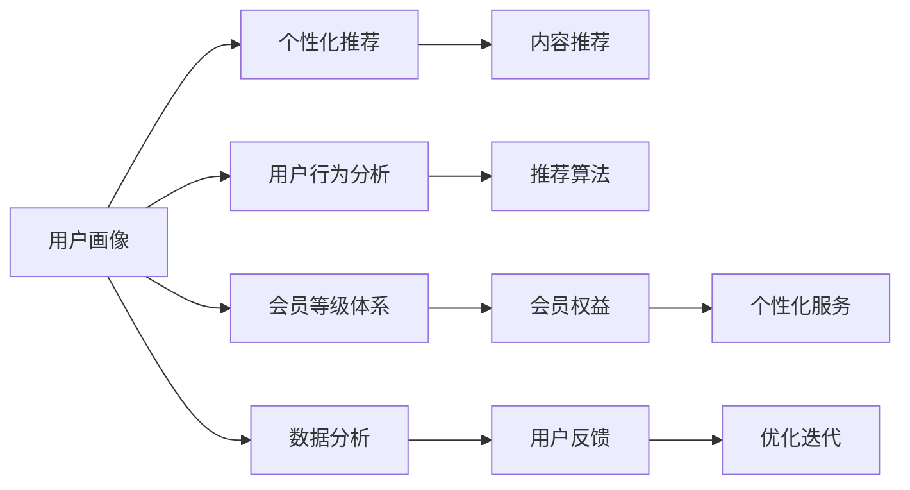

                 

# 知识付费赚钱的用户关系管理与会员等级体系

> 关键词：知识付费,用户关系管理,会员等级体系,数据分析,推荐算法,系统设计,用户体验

## 1. 背景介绍

随着互联网的普及和技术的进步，知识付费市场迅速崛起，各类付费课程、电子书、线上咨询等产品层出不穷。如何有效管理用户关系，提升用户体验和留存率，是知识付费平台亟需解决的痛点问题。本文章将深入探讨如何构建一个高效、稳定的用户关系管理与会员等级体系，实现知识付费平台盈利的同时，满足用户个性化需求。

### 1.1 问题由来
知识付费平台面临的用户关系管理问题包括：
1. **用户粘性低**：用户付费后缺乏后续互动和参与，容易流失。
2. **会员体系设计不合理**：会员权益模糊，无法激励用户长期订阅。
3. **推荐算法不足**：个性化推荐不准确，用户难以发现有价值内容。
4. **用户体验差**：内容展现形式单一，用户难以快速找到感兴趣的内容。

### 1.2 问题核心关键点
为解决上述问题，本文章将重点关注以下几个核心关键点：
- **用户画像**：通过数据分析建立用户画像，了解用户需求和行为。
- **会员等级体系**：设计合理的会员等级体系，激励用户长期订阅。
- **个性化推荐**：利用推荐算法提升内容发现效率，满足用户个性化需求。
- **系统设计**：设计高效、稳定的用户关系管理与会员等级体系，保障用户体验。

通过系统地解决这些关键问题，可以构建一个既高效又稳定的知识付费平台用户关系管理与会员等级体系，实现平台的盈利和用户满意度提升。

## 2. 核心概念与联系

### 2.1 核心概念概述

为更好地理解用户关系管理与会员等级体系的设计和实现，本节将介绍几个关键概念：

- **用户画像**：指基于用户行为、偏好、历史互动等数据，构建出用户特征的全面描述。
- **会员等级体系**：指根据用户订阅行为、积分、贡献等，划分不同等级，并设计相应的权益和服务。
- **个性化推荐**：通过算法模型预测用户可能感兴趣的内容，并优先推送给用户。
- **用户行为分析**：通过分析用户访问、互动、消费等行为数据，了解用户偏好和需求，进行定向营销和产品优化。

这些核心概念之间存在着紧密的联系，通过合理的设计和实现，可以实现用户关系的精细化管理，提升平台的盈利能力和用户满意度。

### 2.2 核心概念原理和架构的 Mermaid 流程图



这个流程图展示了核心概念之间的逻辑关系：

1. **用户画像**通过**用户行为分析**获取用户数据，结合**个性化推荐**算法，提供个性化的内容推荐，使用户能够快速发现感兴趣的内容。
2. **会员等级体系**根据用户的行为和数据，划分不同等级，设计相应的**会员权益**和**个性化服务**，激励用户长期订阅。
3. **数据分析**贯穿整个用户关系管理流程，通过不断的**用户反馈**和**优化迭代**，提升平台的用户体验和运营效果。

## 3. 核心算法原理 & 具体操作步骤

### 3.1 算法原理概述

构建高效的用户关系管理与会员等级体系，需要设计一系列算法和流程，核心包括：
- **用户画像构建**：通过数据挖掘和机器学习，构建详细的用户画像，涵盖兴趣、行为、情感等多个维度。
- **推荐算法优化**：设计高效的推荐算法，提升内容的个性化展示，提升用户满意度。
- **会员等级体系设计**：根据用户行为和数据，设计合理的会员等级体系，激励用户长期订阅。
- **系统设计实现**：设计高效、稳定的系统架构，保障用户关系管理与会员等级体系的正常运行。

### 3.2 算法步骤详解

#### 3.2.1 用户画像构建

**Step 1: 数据收集**
- 收集用户的基本信息、行为数据、历史互动数据等。
- 使用日志分析、Web分析工具等手段，获取用户的浏览、点击、购买等行为数据。

**Step 2: 特征工程**
- 对收集到的数据进行清洗、去重、归一化等预处理。
- 提取有意义的特征，如兴趣标签、访问频率、消费习惯等。

**Step 3: 模型训练**
- 使用机器学习算法，如协同过滤、聚类分析等，对用户数据进行建模。
- 构建用户画像模型，预测用户的兴趣和行为。

**Step 4: 画像更新**
- 定期更新用户画像，结合最新行为数据，优化用户画像模型。

#### 3.2.2 个性化推荐算法

**Step 1: 数据准备**
- 准备用户数据和内容数据，如用户ID、内容ID、标签等。
- 使用ETL工具将数据清洗、转换、合并。

**Step 2: 特征工程**
- 提取和设计特征，如内容特征、用户特征、时间特征等。
- 使用降维算法（如PCA）和特征选择算法（如Lasso）优化特征。

**Step 3: 算法选择**
- 选择适合算法的推荐模型，如基于协同过滤、基于内容推荐、基于深度学习的推荐模型等。
- 使用模型评估指标（如准确率、召回率、覆盖率）评估模型效果。

**Step 4: 模型优化**
- 对推荐模型进行参数调优，优化特征选择、模型结构等。
- 使用A/B测试评估不同推荐策略的效果。

#### 3.2.3 会员等级体系设计

**Step 1: 定义会员等级**
- 根据用户订阅时间、消费金额、互动频率等指标，定义不同等级的会员。
- 设计各等级会员的基本权益和特殊权益。

**Step 2: 会员积分体系**
- 设计积分系统，根据用户行为累计积分。
- 设计积分兑换机制，如积分换取优惠券、免费课程等。

**Step 3: 会员激活策略**
- 设计会员激活策略，如首次注册优惠、订阅续费折扣等。
- 定期推送会员专属内容，提升用户粘性。

**Step 4: 会员关怀策略**
- 设计会员关怀策略，如会员生日关怀、重要节日关怀等。
- 定期向会员发送问卷调查，了解其需求和满意度。

### 3.3 算法优缺点

#### 3.3.1 用户画像构建

**优点**：
- 通过用户画像，能够更精准地了解用户需求和行为。
- 能够为个性化推荐和会员等级体系设计提供数据支持。

**缺点**：
- 需要大量的用户数据和复杂的算法，成本较高。
- 用户数据的隐私和安全问题需要特别注意。

#### 3.3.2 个性化推荐算法

**优点**：
- 能够显著提升内容的发现效率，提高用户满意度。
- 可以通过模型优化不断提升推荐效果。

**缺点**：
- 需要高性能的计算资源和存储资源。
- 推荐模型需要不断迭代优化，维护成本较高。

#### 3.3.3 会员等级体系设计

**优点**：
- 能够激励用户长期订阅，提升平台的盈利能力。
- 会员等级设计灵活，可以根据实际需求进行调整。

**缺点**：
- 需要复杂的数据处理和计算，成本较高。
- 会员等级设计不当，可能无法有效激励用户。

### 3.4 算法应用领域

用户关系管理与会员等级体系设计的应用领域广泛，包括但不限于：
- **在线教育平台**：通过会员等级体系激励用户长期订阅，提高用户满意度和留存率。
- **知识付费平台**：通过个性化推荐提升内容发现效率，满足用户个性化需求。
- **电子商务平台**：通过用户画像和个性化推荐提升用户购物体验，增加销售转化率。
- **社交媒体平台**：通过用户画像和推荐算法优化内容推荐，提升用户粘性。

这些领域中，用户关系管理与会员等级体系设计都具有重要意义，能够有效提升平台的盈利能力和用户满意度。

## 4. 数学模型和公式 & 详细讲解 & 举例说明

### 4.1 数学模型构建

构建用户关系管理与会员等级体系，需要设计一系列数学模型和算法。以下以推荐算法为例，介绍其数学模型构建。

**推荐模型**：假设推荐系统有用户集合 $U$ 和内容集合 $I$，用户的评分矩阵为 $R \in \mathbb{R}^{m \times n}$，其中 $m$ 表示用户数量，$n$ 表示内容数量。推荐算法的目标是预测用户对内容的评分，构建推荐模型：

$$
\hat{R}_{ui} = f_{\theta}(x_u, x_i)
$$

其中 $f_{\theta}$ 是推荐模型，$x_u$ 和 $x_i$ 分别为用户和内容的特征向量。

### 4.2 公式推导过程

**协同过滤算法**：协同过滤算法基于用户的相似性，通过相似用户的历史评分，预测目标用户对内容的评分。公式如下：

$$
\hat{R}_{ui} = \frac{\sum_{j \in N(u)} r_{uj} \times r_{ji}}{\sqrt{\sum_{j \in N(u)} r_{uj}^2 + \sum_{j \in N(i)} r_{ji}^2}}
$$

其中 $N(u)$ 表示与用户 $u$ 相似的用户集合，$r_{uj}$ 表示用户 $u$ 对内容 $j$ 的评分。

**基于内容的推荐算法**：基于内容的推荐算法通过内容特征，预测用户对内容的评分。公式如下：

$$
\hat{R}_{ui} = w^T(x_u \odot x_i)
$$

其中 $w$ 为权重向量，$x_u$ 和 $x_i$ 分别为用户和内容的特征向量，$\odot$ 表示逐元素乘积。

### 4.3 案例分析与讲解

**案例分析**：以在线教育平台为例，假设平台有 10 万用户和 1 万门课程。平台通过协同过滤算法，对用户进行相似性计算，预测用户对课程的评分。设用户 $u$ 对课程 $i$ 的评分如下表所示：

| User | Course | Rating |
|------|--------|--------|
| A    | 1      | 5      |
| A    | 2      | 3      |
| B    | 1      | 4      |
| B    | 2      | 2      |

通过协同过滤算法，可以得到用户 $u$ 对课程 $i$ 的预测评分如下表所示：

| User | Course | Prediction |
|------|--------|-----------|
| A    | 1      | 4.5       |
| A    | 2      | 3.0       |
| B    | 1      | 4.0       |
| B    | 2      | 1.5       |

通过基于内容的推荐算法，假设课程特征为 "难度"、"时长"、"评分"，用户特征为 "学习时长"、"评分趋势"、"热门课程"，可以得到用户 $u$ 对课程 $i$ 的预测评分如下表所示：

| User | Course | Prediction |
|------|--------|-----------|
| A    | 1      | 4.2       |
| A    | 2      | 3.8       |
| B    | 1      | 4.1       |
| B    | 2      | 1.9       |

通过不断优化算法模型，可以实现更加精准的用户画像和个性化推荐，提高平台的盈利能力和用户体验。

## 5. 项目实践：代码实例和详细解释说明

### 5.1 开发环境搭建

在进行用户关系管理与会员等级体系设计实践前，我们需要准备好开发环境。以下是使用Python进行PyTorch开发的环境配置流程：

1. 安装Anaconda：从官网下载并安装Anaconda，用于创建独立的Python环境。

2. 创建并激活虚拟环境：
```bash
conda create -n pytorch-env python=3.8 
conda activate pytorch-env
```

3. 安装PyTorch：根据CUDA版本，从官网获取对应的安装命令。例如：
```bash
conda install pytorch torchvision torchaudio cudatoolkit=11.1 -c pytorch -c conda-forge
```

4. 安装TensorFlow：
```bash
conda install tensorflow
```

5. 安装各类工具包：
```bash
pip install numpy pandas scikit-learn matplotlib tqdm jupyter notebook ipython
```

完成上述步骤后，即可在`pytorch-env`环境中开始项目实践。

### 5.2 源代码详细实现

下面以推荐算法为例，给出使用PyTorch进行推荐系统开发的Python代码实现。

```python
import torch
import torch.nn as nn
import torch.optim as optim
from torch.utils.data import Dataset, DataLoader
from sklearn.model_selection import train_test_split
import numpy as np

# 定义数据集
class RecommendationDataset(Dataset):
    def __init__(self, data, feature_cols, label_col):
        self.data = data
        self.feature_cols = feature_cols
        self.label_col = label_col
    
    def __len__(self):
        return len(self.data)
    
    def __getitem__(self, idx):
        features = self.data.iloc[idx][self.feature_cols].values
        label = self.data.iloc[idx][self.label_col]
        return torch.tensor(features, dtype=torch.float32), torch.tensor(label, dtype=torch.float32)

# 加载数据集
data = pd.read_csv('data/recommendation.csv')
features = data[['feature1', 'feature2', 'feature3']]
labels = data['label']
train_data, test_data = train_test_split(data, test_size=0.2)
train_dataset = RecommendationDataset(train_data, features.columns, labels)
test_dataset = RecommendationDataset(test_data, features.columns, labels)

# 定义模型
class RecommendationModel(nn.Module):
    def __init__(self):
        super(RecommendationModel, self).__init__()
        self.fc1 = nn.Linear(3, 8)
        self.fc2 = nn.Linear(8, 1)
    
    def forward(self, x):
        x = torch.relu(self.fc1(x))
        x = self.fc2(x)
        return x

# 训练模型
model = RecommendationModel()
criterion = nn.MSELoss()
optimizer = optim.Adam(model.parameters(), lr=0.01)
device = torch.device('cuda' if torch.cuda.is_available() else 'cpu')
model.to(device)

def train_epoch(model, dataset, optimizer, criterion):
    dataloader = DataLoader(dataset, batch_size=32, shuffle=True)
    model.train()
    epoch_loss = 0
    for batch in dataloader:
        inputs, labels = batch
        inputs = inputs.to(device)
        labels = labels.to(device)
        optimizer.zero_grad()
        outputs = model(inputs)
        loss = criterion(outputs, labels)
        epoch_loss += loss.item()
        loss.backward()
        optimizer.step()
    return epoch_loss / len(dataloader)

def evaluate(model, dataset, criterion):
    dataloader = DataLoader(dataset, batch_size=32)
    model.eval()
    total_loss = 0
    with torch.no_grad():
        for batch in dataloader:
            inputs, labels = batch
            inputs = inputs.to(device)
            labels = labels.to(device)
            outputs = model(inputs)
            loss = criterion(outputs, labels)
            total_loss += loss.item()
    return total_loss / len(dataloader)

# 训练模型
for epoch in range(10):
    train_loss = train_epoch(model, train_dataset, optimizer, criterion)
    test_loss = evaluate(model, test_dataset, criterion)
    print(f"Epoch {epoch+1}, train loss: {train_loss:.3f}, test loss: {test_loss:.3f}")

```

以上代码实现了基于PyTorch的推荐系统，通过读取CSV格式的数据集，定义模型并进行训练和评估。可以看到，在用户关系管理与会员等级体系设计中，通过类似的代码实现，可以完成模型的构建和训练。

### 5.3 代码解读与分析

**RecommendationDataset类**：
- `__init__`方法：初始化数据集，读取特征和标签。
- `__len__`方法：返回数据集样本数量。
- `__getitem__`方法：获取单个样本的特征和标签。

**RecommendationModel类**：
- `__init__`方法：定义模型的前向传播和后向传播。
- `forward`方法：实现模型的前向传播，包含两个全连接层。

**train_epoch函数**：
- 对数据集进行批次迭代，前向传播计算损失函数，反向传播更新模型参数，最后返回该epoch的平均损失。

**evaluate函数**：
- 对数据集进行批次迭代，前向传播计算损失函数，并记录总损失，最后返回平均损失。

**训练流程**：
- 定义总的epoch数，开始循环迭代
- 每个epoch内，先在训练集上训练，输出平均损失
- 在测试集上评估，输出平均损失
- 所有epoch结束后，给出最终训练和测试结果

以上代码展示了推荐算法的基础实现流程，通过PyTorch和TensorFlow等工具，可以方便地构建和训练推荐模型，实现个性化推荐。

## 6. 实际应用场景

### 6.1 智能推荐系统

智能推荐系统广泛应用于电子商务、在线教育、视频平台等多个领域。通过用户关系管理与会员等级体系设计，可以实现个性化推荐，提升用户体验和平台收益。

以在线教育平台为例，平台可以根据用户的学习进度、课程评价、互动情况等数据，构建详细的用户画像。通过个性化推荐算法，向用户推荐感兴趣的课程和资料，提升用户的学习效果和满意度。同时，平台可以设计合理的会员等级体系，通过积分、优惠券、免费课程等激励用户长期订阅，提升平台的盈利能力。

### 6.2 个性化广告系统

个性化广告系统通过用户关系管理与会员等级体系设计，可以实现更精准的广告投放，提升广告效果和用户转化率。

以社交媒体平台为例，平台可以根据用户的浏览历史、互动数据等构建用户画像，通过个性化推荐算法，向用户推荐感兴趣的广告内容。同时，平台可以设计合理的会员等级体系，通过会员专属广告、广告优惠券等激励用户订阅平台服务，提升平台收益。

### 6.3 客户关系管理系统

客户关系管理系统通过用户关系管理与会员等级体系设计，可以实现客户细分和精准营销，提升客户满意度和忠诚度。

以电子商务平台为例，平台可以根据用户的购买历史、浏览行为等数据，构建详细的用户画像。通过个性化推荐算法，向用户推荐感兴趣的商品和优惠信息，提升用户体验和购物转化率。同时，平台可以设计合理的会员等级体系，通过会员专享服务、VIP特权等激励用户长期订阅，提升平台的客户忠诚度和粘性。

## 7. 工具和资源推荐

### 7.1 学习资源推荐

为了帮助开发者系统掌握用户关系管理与会员等级体系的设计和实现，这里推荐一些优质的学习资源：

1. 《推荐系统实战》书籍：详细介绍了推荐算法和系统设计的全流程，涵盖协同过滤、基于内容推荐、深度学习推荐等多种方法。
2. 《数据科学与机器学习》课程：由斯坦福大学开设，涵盖了数据科学和机器学习的核心内容，包括推荐算法和系统设计。
3. 《用户画像构建与分析》课程：由Coursera提供，介绍了用户画像的构建方法、数据分析和应用场景。
4. 《数据可视化》课程：由Kaggle提供，介绍了数据可视化的常用工具和技巧，提升数据分析能力。
5. 《机器学习》在线课程：由Coursera提供，涵盖了机器学习的基础理论和常用算法，适合初学者入门。

通过对这些资源的学习实践，相信你一定能够快速掌握用户关系管理与会员等级体系设计的精髓，并用于解决实际的NLP问题。

### 7.2 开发工具推荐

高效的开发离不开优秀的工具支持。以下是几款用于推荐系统开发的常用工具：

1. PyTorch：基于Python的开源深度学习框架，灵活动态的计算图，适合快速迭代研究。
2. TensorFlow：由Google主导开发的开源深度学习框架，生产部署方便，适合大规模工程应用。
3. Hadoop和Spark：大数据处理工具，适合大规模数据集的存储和处理。
4. Elasticsearch：搜索和数据分析工具，适合存储和检索大量文本数据。
5. Scikit-learn：开源机器学习库，提供了丰富的数据处理和机器学习算法。
6. Jupyter Notebook：交互式编程工具，适合快速验证和调试代码。

合理利用这些工具，可以显著提升推荐系统的开发效率，加快创新迭代的步伐。

### 7.3 相关论文推荐

推荐系统和大数据技术的发展源于学界的持续研究。以下是几篇奠基性的相关论文，推荐阅读：

1. "Item-Based Collaborative Filtering Recommendation Algorithms"：介绍了协同过滤算法的原理和实现方法。
2. "Contextual Bandits: Theory and Applications"：介绍了上下文算法的原理和应用场景。
3. "Deep Learning Recommendation Systems: A New Dimension for Recommender Systems"：介绍了深度学习在推荐系统中的应用。
4. "An Improved Collaborative Filtering Recommendation Algorithm Based on Matrix Factorization"：介绍了基于矩阵分解的推荐算法。
5. "A Hybrid Approach for Recommendation Systems"：介绍了混合推荐算法的设计和实现方法。

这些论文代表了大数据推荐系统的发展脉络。通过学习这些前沿成果，可以帮助研究者把握学科前进方向，激发更多的创新灵感。

## 8. 总结：未来发展趋势与挑战

### 8.1 总结

本文对用户关系管理与会员等级体系的设计和实现进行了全面系统的介绍。首先阐述了用户关系管理与会员等级体系的研究背景和意义，明确了推荐算法、用户画像、会员等级体系等关键概念。其次，从原理到实践，详细讲解了推荐算法的数学模型和具体实现步骤，给出了推荐系统开发的完整代码实例。同时，本文还广泛探讨了推荐算法在多个行业领域的应用前景，展示了其广阔的应用空间。

通过本文的系统梳理，可以看到，用户关系管理与会员等级体系设计正在成为推荐系统的重要范式，极大地提升了推荐系统的用户满意度和运营效果。未来，伴随推荐算法的不断发展，推荐系统必将在更广泛的领域得到应用，为各行业带来新的价值和机遇。

### 8.2 未来发展趋势

展望未来，推荐系统技术将呈现以下几个发展趋势：

1. **多模态推荐**：推荐系统不仅仅基于文本数据，还将整合图片、视频、音频等多模态信息，提升推荐效果。
2. **实时推荐**：通过实时数据流处理和流式机器学习，提升推荐的时效性和准确性。
3. **跨领域推荐**：推荐系统将跨越不同领域和场景，提供综合性、多层次的推荐服务。
4. **个性化推荐引擎**：通过用户画像和推荐算法的深度融合，实现更加精准、智能的推荐。
5. **联邦学习**：通过联邦学习技术，实现数据隐私保护的同时，提升推荐系统的性能和效果。

以上趋势凸显了推荐系统技术的广阔前景，这些方向的探索发展，必将进一步提升推荐系统的智能性和用户体验，推动各行业数字化转型。

### 8.3 面临的挑战

尽管推荐系统技术已经取得了显著成就，但在迈向更加智能化、普适化应用的过程中，仍面临诸多挑战：

1. **数据隐私和安全问题**：推荐系统需要处理大量用户数据，如何保护用户隐私和安全，防止数据泄露，是关键挑战。
2. **推荐效果不稳定**：推荐系统面对复杂多变的数据环境，模型的稳定性和鲁棒性仍需提升。
3. **跨领域数据融合困难**：不同领域的数据格式和特征差异较大，跨领域数据的融合和匹配仍是技术难点。
4. **算法复杂度高**：推荐算法的复杂度较高，计算资源和存储资源的需求较大，如何优化算法性能，降低计算成本，是重要研究方向。
5. **用户体验不足**：推荐系统的用户体验仍需提升，如何提升系统响应速度，优化界面设计，是技术发展的重要方向。

正视推荐系统面临的这些挑战，积极应对并寻求突破，将推荐系统推向更加智能、普适化应用，需要学界和业界共同努力，不断创新和优化。

### 8.4 研究展望

面对推荐系统面临的挑战，未来的研究需要在以下几个方面寻求新的突破：

1. **深度学习与推荐系统的结合**：通过深度学习技术，提升推荐系统的智能化水平，实现更精准的推荐。
2. **联邦学习与隐私保护**：通过联邦学习技术，实现数据隐私保护，提升推荐系统的安全性。
3. **多模态推荐技术**：整合多模态信息，提升推荐系统的表现力和用户体验。
4. **实时推荐系统**：实现实时数据流处理和流式机器学习，提升推荐系统的时效性。
5. **跨领域推荐系统**：实现跨领域数据的融合和匹配，提供综合性、多层次的推荐服务。

这些研究方向将推动推荐系统技术不断进步，提升各行业的数字化转型效果，为智能社会的建设做出贡献。总之，用户关系管理与会员等级体系设计是大数据推荐系统的核心环节，通过不断探索和优化，必将在推动各行业发展中发挥重要作用。

## 9. 附录：常见问题与解答

**Q1：推荐算法应该如何选择？**

A: 推荐算法的选择应根据具体场景和数据特点进行综合评估。通常可以从以下几个方面考虑：
- **数据规模**：对于小规模数据集，可以考虑基于内容的推荐算法；对于大规模数据集，可以考虑协同过滤算法和深度学习推荐算法。
- **用户行为**：对于用户行为明确且历史数据丰富的场景，可以考虑协同过滤算法；对于用户行为多样化且历史数据稀疏的场景，可以考虑基于内容的推荐算法和深度学习推荐算法。
- **实时性要求**：对于实时性要求高的场景，可以考虑实时推荐算法和流式机器学习算法。

**Q2：如何提升推荐算法的准确性？**

A: 提升推荐算法的准确性可以从以下几个方面进行优化：
- **数据清洗和预处理**：对数据进行清洗和预处理，去除噪声和异常值，提升数据质量。
- **特征工程**：提取和设计有意义的特征，提升特征的多样性和丰富度。
- **模型优化**：通过参数调优和模型结构优化，提升推荐效果。
- **A/B测试**：通过A/B测试评估不同推荐策略的效果，选择最优方案。

**Q3：如何设计合理的会员等级体系？**

A: 设计合理的会员等级体系应根据实际需求和用户行为进行设计。通常可以从以下几个方面进行考虑：
- **会员权益设计**：设计多种会员权益，如免费课程、优惠券、VIP特权等，激励用户长期订阅。
- **积分系统**：设计积分系统，根据用户行为累计积分，并通过积分兑换机制激励用户。
- **会员关怀策略**：设计会员关怀策略，如生日关怀、节日关怀等，提升用户粘性和满意度。

**Q4：推荐系统如何保护用户隐私？**

A: 推荐系统保护用户隐私主要从以下几个方面进行考虑：
- **数据匿名化**：对用户数据进行匿名化处理，防止用户隐私泄露。
- **数据加密**：对敏感数据进行加密存储和传输，防止数据泄露。
- **隐私保护算法**：使用隐私保护算法，如差分隐私、联邦学习等，保护用户隐私。

通过合理设计会员等级体系和保护用户隐私，推荐系统可以实现更好的用户体验和运营效果。总之，用户关系管理与会员等级体系设计是大数据推荐系统的核心环节，通过不断探索和优化，必将在推动各行业发展中发挥重要作用。

---

作者：禅与计算机程序设计艺术 / Zen and the Art of Computer Programming

