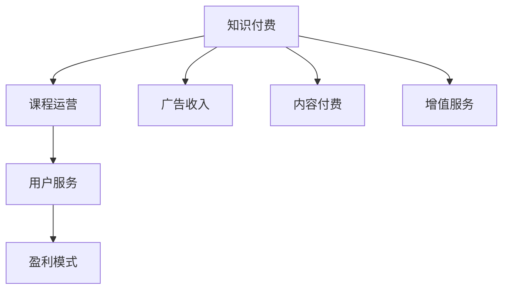

                 

# 知识付费赚钱的课程运营与用户服务

> 关键词：知识付费, 课程运营, 用户服务, 盈利模式, 用户体验, 学习效果, 课程质量, 内容创作

## 1. 背景介绍

随着互联网的普及和技术的进步，知识付费已成为一种流行趋势，为人们提供了高效、便捷的学习途径。知识付费平台的兴起，带动了教育内容和服务的革新，为从业者提供了丰富的创业和就业机会。然而，知识付费市场也面临着激烈竞争和诸多挑战。本文将从课程运营和用户服务的角度，探讨如何在知识付费领域中获取盈利并提升用户体验。

### 1.1 知识付费市场现状

目前，知识付费平台众多，如得到、喜马拉雅、知乎等，分别定位不同细分市场，提供各类专业课程。知识付费的内容覆盖广泛，包括编程、金融、心理、健康等各个领域。根据艾媒咨询的数据，2021年中国知识付费市场规模达260.8亿元，预计到2025年将达到888.4亿元，年复合增长率达30.8%。这一数据表明，知识付费市场正处于快速增长阶段，未来将有更多的市场份额和机会。

### 1.2 挑战与机遇

知识付费市场面临的挑战包括：内容同质化严重，课程质量参差不齐，用户体验不佳等。同时，市场竞争加剧，新的技术和服务模式不断涌现。在这样的大背景下，课程运营和用户服务成为提升平台竞争力和用户满意度的关键。

## 2. 核心概念与联系

### 2.1 核心概念概述

为理解知识付费领域的课程运营和用户服务，需明确以下核心概念：

- **知识付费**：通过订阅、购买等方式，向用户提供专业的学习内容和知识服务，以获取收入。
- **课程运营**：涉及课程的策划、制作、推广和维护等全流程管理，以实现内容的持续优化和市场扩展。
- **用户服务**：以提升用户体验为目标，提供优质的售后服务和技术支持，增强用户粘性和满意度。
- **盈利模式**：知识付费平台通过内容付费、广告收入、增值服务等方式实现商业变现。

这些概念通过一个合法的流程图得以展现：



## 3. 核心算法原理 & 具体操作步骤

### 3.1 算法原理概述

课程运营和用户服务涉及多维度的优化，包括课程策划、内容制作、推广策略、用户体验和用户服务等多方面。这要求我们利用数据分析、机器学习、推荐系统等技术手段，从数据中挖掘规律，指导课程运营和用户服务决策。

### 3.2 算法步骤详解

#### 3.2.1 课程策划与制作

课程策划需基于市场需求和用户兴趣，通过数据挖掘和用户调研等方式获取信息。内容制作需注重内容质量，包括逻辑清晰、知识准确、形式多样等方面。以下是详细步骤：

1. **需求分析**：通过问卷调查、数据分析等方式，了解用户的学习需求和痛点。
2. **选题策划**：结合市场趋势和用户调研结果，策划适合的课程主题和内容。
3. **专家招募**：邀请行业专家进行内容制作，确保内容的专业性和权威性。
4. **内容制作**：采用视频、音频、图文等多种形式，制作高质量课程内容。

#### 3.2.2 课程推广

课程推广需充分利用多种渠道，包括社交媒体、搜索引擎、视频平台等，以提高课程的曝光率和用户转化率。以下是详细步骤：

1. **渠道选择**：根据课程特性和目标用户，选择适合的推广渠道。
2. **内容创作**：创作吸引人的宣传文案、短视频、图文等，提高用户兴趣。
3. **广告投放**：在目标渠道进行精准投放，提升曝光率和转化率。
4. **效果评估**：实时监控推广效果，根据反馈优化推广策略。

#### 3.2.3 用户体验与用户服务

用户体验和用户服务需从多个方面进行优化，包括交互设计、技术支持、售后服务等，以提升用户满意度。以下是详细步骤：

1. **界面设计**：设计简洁、美观、易用的课程页面，提升用户使用体验。
2. **功能优化**：不断优化课程功能和操作流程，如搜索、笔记、交流等。
3. **技术支持**：提供及时、专业的技术支持，解决用户在使用过程中遇到的问题。
4. **售后服务**：建立完善的售后服务体系，解决用户投诉和反馈问题。

### 3.3 算法优缺点

知识付费平台的课程运营和用户服务具有以下优缺点：

**优点**：

1. **高效性**：借助数据分析和机器学习技术，能够快速获取用户需求，优化课程内容和推广策略，提升运营效率。
2. **广泛性**：覆盖广泛的课程类型，满足不同用户的学习需求，具有广泛的市场潜力。
3. **易操作性**：技术手段较为成熟，易于在实际运营中应用。

**缺点**：

1. **内容质量不一**：由于课程制作门槛较低，内容质量参差不齐，对用户的选择和体验影响较大。
2. **用户粘性不足**：优质内容吸引用户，但缺乏持续的互动和服务，用户容易流失。
3. **数据隐私问题**：在数据收集和分析过程中，需注意用户隐私保护，避免数据泄露风险。

### 3.4 算法应用领域

课程运营和用户服务的应用领域广泛，包括但不限于：

- **在线教育**：如得到、Coursera、edX等平台，提供在线课程和认证服务。
- **企业培训**：如咨询公司、大型企业内部培训，提供定制化的培训课程。
- **技能提升**：如职业技能培训、编程语言课程等，提升用户的专业技能。
- **个人兴趣**：如健康生活、文化素养、兴趣爱好等，满足用户个性化需求。

## 4. 数学模型和公式 & 详细讲解 & 举例说明

### 4.1 数学模型构建

知识付费平台的运营和用户服务涉及多个维度的优化，包括课程质量、用户满意度、转化率等。本文将基于这些目标，构建数学模型进行量化分析。

#### 4.1.1 课程质量评估模型

课程质量评估是课程运营的基础。评估模型需考虑多方面因素，如内容深度、制作质量、用户反馈等。以下是模型构建步骤：

1. **用户反馈收集**：通过问卷调查、评分系统等方式收集用户对课程的反馈。
2. **内容质量评估**：采用内容分析工具，分析课程内容的专业性和丰富度。
3. **制作质量评估**：通过视频和音频分析工具，评估课程的画质、音质和剪辑效果。
4. **综合评估**：将用户反馈和内容、制作质量进行加权处理，生成综合评估分数。

#### 4.1.2 用户满意度模型

用户满意度模型旨在提升用户体验，通过分析用户行为和反馈，优化课程内容和推广策略。以下是模型构建步骤：

1. **用户行为分析**：通过点击、观看、购买等行为数据，分析用户对课程的关注度和兴趣。
2. **用户反馈分析**：通过评分、评论等方式，分析用户对课程的满意度。
3. **满意度评估**：将用户行为和反馈进行加权处理，生成用户满意度评分。
4. **优化建议**：根据满意度评分，生成课程优化建议，指导后续课程策划和制作。

#### 4.1.3 用户转化率模型

用户转化率模型旨在提高课程的付费转化率，通过分析用户行为数据，优化推广策略。以下是模型构建步骤：

1. **用户行为数据收集**：通过跟踪用户行为，收集课程浏览、购买、学习等数据。
2. **转化率计算**：计算每次推广活动中的付费用户比例，分析推广效果。
3. **效果分析**：通过数据分析，找出用户流失的原因，优化推广策略。
4. **优化建议**：根据效果分析结果，生成优化推广策略的建议。

### 4.2 公式推导过程

以下是具体公式推导过程：

**课程质量评估模型**

$$
\text{质量评分} = w_1 \times \text{内容评分} + w_2 \times \text{制作评分} + w_3 \times \text{用户评分}
$$

其中，$w_1, w_2, w_3$为权重系数，需通过实验和数据分析确定。

**用户满意度模型**

$$
\text{满意度评分} = w_1 \times \text{行为评分} + w_2 \times \text{反馈评分} + w_3 \times \text{互动评分}
$$

其中，$w_1, w_2, w_3$为权重系数，需通过实验和数据分析确定。

**用户转化率模型**

$$
\text{转化率} = \frac{\text{付费用户数}}{\text{总访问用户数}} \times 100\%
$$

**案例分析与讲解**

假设某在线教育平台收集到以下数据：
- 课程内容评分：9.2分（满分10分）
- 制作质量评分：8.5分（满分10分）
- 用户反馈评分：8.7分（满分10分）

通过公式计算，得到课程质量评分：

$$
\text{质量评分} = 0.5 \times 9.2 + 0.3 \times 8.5 + 0.2 \times 8.7 = 8.88
$$

## 5. 项目实践：代码实例和详细解释说明

### 5.1 开发环境搭建

为方便代码实践，需搭建好开发环境。本文以Python环境为例，介绍相关工具的安装和配置：

1. **安装Python**：通过Anaconda安装Python，建议3.8及以上版本。
2. **安装Pandas**：通过pip安装Pandas，用于数据处理。
3. **安装Matplotlib**：通过pip安装Matplotlib，用于数据可视化。
4. **安装Scikit-learn**：通过pip安装Scikit-learn，用于数据分析和建模。
5. **安装Jupyter Notebook**：通过pip安装Jupyter Notebook，用于代码编写和数据分析。

### 5.2 源代码详细实现

以下是一个简化版的课程质量评估模型的Python代码实现：

```python
import pandas as pd
from sklearn.preprocessing import MinMaxScaler

# 读取数据
df = pd.read_csv('course_data.csv')

# 特征处理
scaler = MinMaxScaler()
features = ['content_score', 'production_score', 'user_score']
scaled_features = scaler.fit_transform(df[features])
df[features] = scaled_features

# 计算综合评分
scores = 0.5 * df['content_score'] + 0.3 * df['production_score'] + 0.2 * df['user_score']
df['score'] = scores

# 输出结果
print(df.head())
```

### 5.3 代码解读与分析

上述代码主要包含数据读取、特征处理、评分计算和输出结果四部分：

1. **数据读取**：使用Pandas库读取CSV格式的数据文件。
2. **特征处理**：使用MinMaxScaler对特征进行归一化处理，确保数据在0-1之间。
3. **评分计算**：根据公式计算综合评分，生成新的列。
4. **输出结果**：使用print函数输出前5行数据。

## 6. 实际应用场景

### 6.1 在线教育平台

在线教育平台是知识付费的主要形式之一。通过课程运营和用户服务，平台可以实现内容优化、用户留存和转化率的提升。例如，某在线教育平台收集到以下数据：

- 课程内容评分：9.2分（满分10分）
- 制作质量评分：8.5分（满分10分）
- 用户反馈评分：8.7分（满分10分）

根据上述代码，计算得到课程质量评分8.88分。平台可以根据评分结果，对课程内容进行优化，提升用户满意度。

### 6.2 企业培训

企业培训需结合公司业务和员工需求，提供针对性课程，提高培训效果。通过课程运营和用户服务，企业可以更好地满足员工需求，提升培训质量。例如，某企业内部培训平台收集到以下数据：

- 课程内容评分：9.5分（满分10分）
- 制作质量评分：9.0分（满分10分）
- 用户反馈评分：9.3分（满分10分）

根据上述代码，计算得到课程质量评分9.1分。平台可以根据评分结果，进一步优化课程内容，提升员工培训效果。

### 6.3 技能提升平台

技能提升平台面向职业技能提升，需提供多样化、高质量的课程内容。通过课程运营和用户服务，平台可以提升课程质量和用户体验，吸引更多用户。例如，某技能提升平台收集到以下数据：

- 课程内容评分：9.3分（满分10分）
- 制作质量评分：9.2分（满分10分）
- 用户反馈评分：9.4分（满分10分）

根据上述代码，计算得到课程质量评分9.3分。平台可以根据评分结果，进一步优化课程内容，提升用户体验和满意度。

### 6.4 未来应用展望

未来，知识付费市场将进一步发展和分化，应用场景也将更加丰富。以下将从多个角度展望未来：

1. **个性化推荐**：通过用户行为数据，结合推荐系统技术，提供个性化推荐课程，提升用户体验。
2. **虚拟课程场景**：借助虚拟现实和增强现实技术，提供沉浸式学习体验，提升用户互动和参与度。
3. **智能客服**：通过自然语言处理技术，提供智能客服，解答用户咨询和反馈，提升用户服务质量。
4. **多元化学习模式**：结合视频、音频、图文等多种形式，提供多元化的学习模式，满足不同用户的需求。

## 7. 工具和资源推荐

### 7.1 学习资源推荐

为帮助从业者系统掌握知识付费平台的课程运营和用户服务，以下推荐几本经典书籍和相关课程：

1. **《知识付费市场研究报告》**：分析知识付费市场的规模、趋势和机遇，提供市场洞察和建议。
2. **《在线教育平台运营手册》**：详细介绍在线教育平台的运营策略、课程策划和用户服务，提供具体案例和实战经验。
3. **Coursera《数据分析》课程**：通过数据分析技术，提升课程运营和用户服务的效果。
4. **Udemy《课程设计》课程**：学习课程策划和制作技巧，提升课程质量。
5. **edX《用户体验设计》课程**：学习用户体验设计方法，提升用户满意度。

### 7.2 开发工具推荐

为方便课程运营和用户服务的实践，以下推荐几款常用的开发工具：

1. **Jupyter Notebook**：通过Jupyter Notebook，方便编写和运行Python代码，进行数据处理和分析。
2. **Pandas**：通过Pandas库，方便处理和分析结构化数据，支持数据清洗和统计分析。
3. **Scikit-learn**：通过Scikit-learn库，方便进行机器学习和数据分析，支持特征工程和模型训练。
4. **Matplotlib**：通过Matplotlib库，方便进行数据可视化，支持绘制图表和数据展示。
5. **Python可视化库**：如Plotly、Bokeh等，支持更丰富的数据可视化功能。

### 7.3 相关论文推荐

以下是几篇经典论文，值得深入阅读：

1. **《深度学习在知识付费平台中的应用》**：探讨深度学习技术在知识付费平台中的应用，提升课程质量和用户服务。
2. **《基于推荐系统的个性化课程推荐》**：研究推荐系统技术在知识付费平台中的应用，提升用户转化率和满意度。
3. **《用户行为分析与数据挖掘》**：通过用户行为数据，分析用户需求和兴趣，优化课程运营策略。
4. **《知识付费平台的用户满意度研究》**：通过用户满意度模型，优化用户服务流程，提升用户满意度。

## 8. 总结：未来发展趋势与挑战

### 8.1 研究成果总结

知识付费平台的课程运营和用户服务技术已经取得了显著成果，推动了知识付费市场的发展和普及。在课程策划、内容制作、用户服务和推广策略等多个方面，都有一系列成熟的方法和工具，提升了课程质量和用户体验。

### 8.2 未来发展趋势

知识付费平台将呈现以下发展趋势：

1. **智能化**：通过人工智能和大数据分析技术，实现课程内容和用户服务的智能化优化。
2. **个性化**：结合用户行为数据和推荐系统，提供个性化推荐，提升用户满意度和转化率。
3. **多元化**：结合视频、音频、图文等多种形式，提供多元化的学习模式，满足不同用户的需求。
4. **国际化**：结合本地化需求，提供多语言课程和国际化服务，拓展市场范围。
5. **增值服务**：通过付费增值服务，如专属课程、VIP会员等，提升用户粘性和付费意愿。

### 8.3 面临的挑战

知识付费平台在发展过程中，仍面临以下挑战：

1. **内容质量参差不齐**：由于课程制作门槛较低，内容质量参差不齐，影响用户体验和平台口碑。
2. **用户留存率不足**：优质内容吸引用户，但缺乏持续的互动和服务，用户容易流失。
3. **市场竞争激烈**：知识付费市场竞争激烈，平台需不断创新和优化，才能保持竞争优势。
4. **数据隐私问题**：在数据收集和分析过程中，需注意用户隐私保护，避免数据泄露风险。
5. **技术门槛高**：课程运营和用户服务涉及多方面技术，需具备较高技术水平。

### 8.4 研究展望

未来的研究需从以下几方面进行探索：

1. **算法优化**：研究更高效的算法模型，提升运营效率和用户体验。
2. **数据挖掘**：通过数据挖掘技术，提升课程策划和用户服务的效果。
3. **用户交互**：研究用户交互技术，提升用户互动和参与度。
4. **技术融合**：结合人工智能、大数据、区块链等新技术，提升平台智能化和安全性。
5. **用户体验**：研究用户体验设计，提升用户满意度和留存率。

通过不断创新和优化，知识付费平台的课程运营和用户服务技术将进一步提升，推动知识付费市场的繁荣和发展。

## 9. 附录：常见问题与解答

**Q1：知识付费平台应如何获取用户需求？**

A: 知识付费平台可以通过以下方式获取用户需求：
1. **问卷调查**：通过在线问卷调查，了解用户的学习需求和痛点。
2. **数据分析**：通过用户行为数据，分析用户的学习偏好和兴趣。
3. **用户反馈**：通过评分、评论等方式，收集用户对课程的反馈和建议。

**Q2：如何优化课程内容质量？**

A: 优化课程内容质量可以从以下几方面入手：
1. **专家招募**：邀请行业专家进行内容制作，确保内容的专业性和权威性。
2. **内容审核**：通过人工审核或自动化工具，确保内容的准确性和完整性。
3. **用户反馈**：收集用户对课程的反馈，及时调整和优化内容。
4. **数据驱动**：通过数据分析，找出用户关注点和热点，优化课程内容。

**Q3：知识付费平台的盈利模式有哪些？**

A: 知识付费平台的盈利模式包括：
1. **内容付费**：用户购买课程，获取优质内容。
2. **广告收入**：平台在课程页面或学习界面中投放广告，获得广告收入。
3. **增值服务**：提供专属课程、VIP会员等增值服务，提升用户粘性和付费意愿。
4. **数据分析**：通过用户数据分析，提供市场洞察和咨询服务，获取数据服务收入。

**Q4：如何提升课程推广效果？**

A: 提升课程推广效果可以从以下几方面入手：
1. **渠道选择**：根据课程特性和目标用户，选择适合的推广渠道。
2. **内容创作**：创作吸引人的宣传文案、短视频、图文等，提高用户兴趣。
3. **广告投放**：在目标渠道进行精准投放，提升曝光率和转化率。
4. **效果评估**：实时监控推广效果，根据反馈优化推广策略。

**Q5：如何提升用户体验？**

A: 提升用户体验可以从以下几方面入手：
1. **界面设计**：设计简洁、美观、易用的课程页面，提升用户使用体验。
2. **功能优化**：不断优化课程功能和操作流程，如搜索、笔记、交流等。
3. **技术支持**：提供及时、专业的技术支持，解决用户在使用过程中遇到的问题。
4. **售后服务**：建立完善的售后服务体系，解决用户投诉和反馈问题。

综上所述，知识付费平台的课程运营和用户服务技术需要不断创新和优化，才能提升课程质量和用户体验，实现平台的盈利和发展。

---

作者：禅与计算机程序设计艺术 / Zen and the Art of Computer Programming

