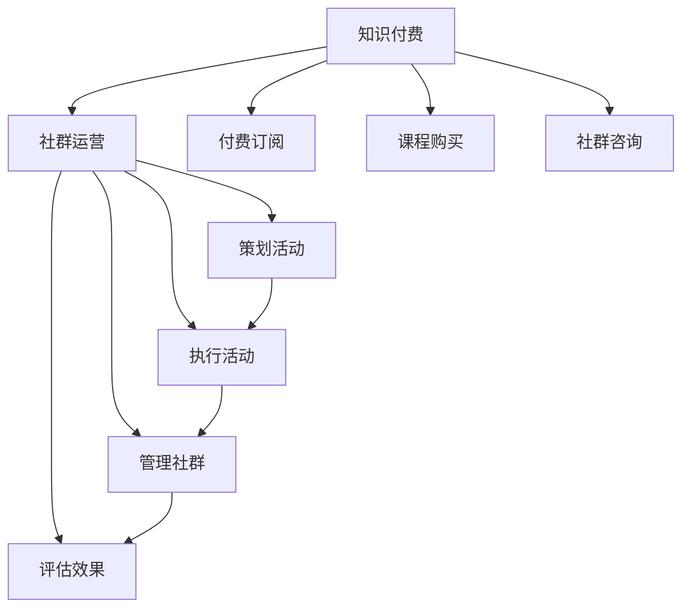

                 

# 知识付费：程序员的社群运营战术

## 1. 背景介绍

在数字化时代的浪潮下，知识付费已经成为一种新的生活方式。越来越多的程序员开始通过付费订阅、课程购买、社群咨询等方式，获取编程知识和经验。然而，无论是知识提供者还是消费者，对知识付费的持续性和有效性都面临挑战。本文将探讨程序员社群运营战术，旨在通过创新的策略，提升知识付费的吸引力、互动性和价值。

## 2. 核心概念与联系

### 2.1 核心概念概述

为更好地理解程序员社群运营的战术，我们首先需要定义几个核心概念：

- **知识付费**：指用户为获取特定知识、技能或经验，向内容提供者支付费用的模式。这种模式利用了知识的外部性，实现了知识和时间的有效分配。
- **程序员社群**：指由拥有共同编程兴趣和目标的程序员组成的虚拟或物理社区。社群成员之间通过知识分享、经验交流、项目合作等方式进行互动。
- **社群运营**：指通过策划、执行、管理和评估活动，促进社群成员间的互动与成长，实现社群目标的过程。
- **知识付费与社群运营的结合**：通过将知识付费机制嵌入程序员社群中，提升知识分享的质量和效率，增强社群成员的参与度和忠诚度。

这些概念之间的联系可以通过以下Mermaid流程图来展示：



该流程图展示了知识付费与社群运营的主要流程和互动方式。

## 3. 核心算法原理 & 具体操作步骤

### 3.1 算法原理概述

知识付费和社群运营的结合，本质上是一种以知识为核心资源，通过社群互动进行价值变现的商业模式。其核心在于如何设计合理的激励机制和互动模式，促使知识提供者和消费者积极参与，共同推动社群的发展。

我们假设知识付费平台是一个有N个用户（KP）和M个内容提供者（CP）的社区。平台通过提供多样化的知识产品（如课程、电子书、咨询等），吸引用户订阅。内容提供者通过提供有价值的知识内容，获得订阅费用。平台则通过运营策略，提高知识产品的价值和吸引力，从而实现双赢。

### 3.2 算法步骤详解

基于上述原理，知识付费与社群运营的结合可以分解为以下几个步骤：

**Step 1: 设计知识产品**
- 根据用户需求，设计多样化的知识产品，如视频课程、电子书、编程难题解答等。
- 确保知识产品的质量，通过专家评审、用户反馈等机制进行持续优化。

**Step 2: 制定定价策略**
- 基于知识产品的价值和市场需求，制定合理的定价策略，包括免费试用、阶梯定价等。
- 考虑用户粘性，设置合理的免费内容和付费内容比例。

**Step 3: 引入社群互动**
- 在知识付费平台上搭建程序员社群，通过讨论区、技术交流、编程项目等方式，促进用户互动。
- 设计激励机制，如积分系统、成就徽章等，鼓励用户积极参与社群活动。

**Step 4: 运营与评估**
- 定期评估社群活动的效果，通过调查问卷、用户反馈等方式收集数据。
- 根据评估结果，调整运营策略，优化知识产品和社群活动。

### 3.3 算法优缺点

知识付费与社群运营结合的优势在于：
1. 提高知识产品价值：通过社群互动，用户可以更深入地理解知识内容，提升学习效果。
2. 增强用户粘性：社群活动能吸引用户持续关注平台，提高订阅续订率。
3. 促进行业交流：社群提供了交流平台，促进行业内外的知识共享和技术合作。

然而，这种结合也存在一些挑战：
1. 内容质量控制：社群内的知识产品需经过严格筛选和评审，确保质量。
2. 用户动机管理：需平衡激励机制，防止过度商业化。
3. 平台运营成本：社群运营需投入大量资源，包括技术支持、内容管理等。

### 3.4 算法应用领域

知识付费与社群运营的结合，已在多个领域得到应用：

- **在线教育**：如Coursera、Udemy等平台，通过课程订阅和社群互动，提高学习效果和用户粘性。
- **技术社区**：如Stack Overflow、GitHub等，通过问答、代码共享等方式，促进行业交流和技术传播。
- **职业培训**：如LinkedIn Learning、Udacity等，通过职业课程和社群支持，提升职业技能。

## 4. 数学模型和公式 & 详细讲解

### 4.1 数学模型构建

为更好地量化知识付费和社群运营的效果，我们可以构建以下数学模型：

- 设U为总用户数，K为付费用户数，CP为内容提供者数，E为社群活跃度，R为知识产品订阅率。
- 知识付费平台的目标函数为：
  $$
  maximize \; U - K \quad \text{和} \quad E \quad \text{和} \quad R
  $$
  其中U为总用户数，K为付费用户数，E为社群活跃度，R为知识产品订阅率。

### 4.2 公式推导过程

- **用户增长模型**：
  $$
  U_{t+1} = \alpha U_t + \beta
  $$
  其中$\alpha$为用户增长率，$\beta$为社群新增用户数。

- **付费用户增长模型**：
  $$
  K_{t+1} = \gamma K_t + \delta R_t
  $$
  其中$\gamma$为付费用户增长率，$\delta$为知识产品订阅率。

- **社群活跃度模型**：
  $$
  E_{t+1} = \epsilon E_t + \phi
  $$
  其中$\epsilon$为社群活跃度增长率，$\phi$为社群活动新增活跃度。

- **知识产品订阅率模型**：
  $$
  R_{t+1} = \lambda R_t + \sigma P_t
  $$
  其中$\lambda$为订阅率增长率，$\sigma$为知识产品价格，$P_t$为知识产品价格变化率。

通过以上模型，我们可以动态预测用户数、付费用户数、社群活跃度、知识产品订阅率的变化趋势，为平台运营提供数据支持。

### 4.3 案例分析与讲解

以一个名为CodeInfer的在线编程学习平台为例，该平台提供Python编程课程，并通过社群运营吸引用户互动。根据平台的数据，我们设定以下参数：

- 初始用户数为100，增长率为2%，新增社群用户为20。
- 初始付费用户数为10，增长率为1.5%，知识产品订阅率为50%。
- 初始社群活跃度为0.5，增长率为3%，新增社群活动活跃度为0.1。
- 初始知识产品订阅率为30%，增长率为1%，知识产品价格为$100/课程。

通过对以上模型的求解，可以得到平台未来N个月的用户数、付费用户数、社群活跃度和知识产品订阅率的预测结果。这些预测结果可以用于平台运营策略的优化，如知识产品定价、社群活动设计等。

## 5. 项目实践：代码实例和详细解释说明

### 5.1 开发环境搭建

为了实现上述模型和算法，我们需要搭建一个Python开发环境。以下是搭建环境的步骤：

1. 安装Python：从官网下载最新版本的Python，并完成安装。
2. 安装必要的Python库：如Pandas、NumPy、Matplotlib等。
3. 安装数据库：如MySQL或PostgreSQL，用于存储用户、内容、社群等数据。
4. 安装Web框架：如Django或Flask，用于搭建Web平台。
5. 安装消息队列：如RabbitMQ或Kafka，用于实时推送社群活动通知。

完成以上步骤后，即可开始编程实现。

### 5.2 源代码详细实现

以下是一个简单的Python代码实现，用于计算平台未来N个月的用户数和付费用户数：

```python
import pandas as pd
import numpy as np
from scipy.integrate import odeint

def user_growth(U_t, t, alpha):
    return alpha * U_t

def payment_growth(K_t, t, gamma):
    return gamma * K_t + delta * R_t

def engagement_growth(E_t, t, epsilon):
    return epsilon * E_t + phi

def subscription_growth(R_t, t, lambda_, sigma, P_t):
    return lambda_ * R_t + sigma * P_t

# 设定初始参数
alpha = 0.02
beta = 20
gamma = 0.015
delta = 0.5
epsilon = 0.03
phi = 0.1
lambda_ = 0.01
sigma = 100
P_t = 0

# 计算未来N个月的用户数和付费用户数
N = 12
U = np.zeros(N+1)
K = np.zeros(N+1)
E = np.zeros(N+1)
R = np.zeros(N+1)

U[0] = 100
K[0] = 10
E[0] = 0.5
R[0] = 0.3

for t in range(N):
    U[t+1] = odeint(user_growth, U[t], [t, t+1], args=(alpha,))[0][-1] + beta
    K[t+1] = odeint(payment_growth, K[t], [t, t+1], args=(gamma, delta, R[t]))[0][-1]
    E[t+1] = odeint(engagement_growth, E[t], [t, t+1], args=(epsilon, phi))[0][-1]
    R[t+1] = odeint(subscription_growth, R[t], [t, t+1], args=(lambda_, sigma, P_t))[0][-1]

# 打印结果
print("User Growth:", U)
print("Payment Growth:", K)
```

### 5.3 代码解读与分析

以上代码主要使用了Pandas、NumPy和Scipy库进行数值计算。通过定义用户增长、付费用户增长、社群活跃度和订阅率增长函数，结合具体的参数值，计算出未来N个月的用户数和付费用户数。这些结果可以用于评估平台的用户增长趋势和盈利能力，为平台运营提供数据支持。

## 6. 实际应用场景

### 6.1 知识付费平台

知识付费平台如Coursera、Udemy等，通过提供多样的知识产品，吸引用户订阅。通过社群运营，平台可以提升用户粘性，促进知识产品的销售。

- **场景**：某编程在线学习平台，通过社群讨论和项目合作，提升用户的学习效果和平台粘性。
- **解决方案**：在平台内搭建编程讨论区，定期举办编程挑战赛，利用积分系统激励用户参与，同时提供高质量的知识产品，如Python编程实战课程。

### 6.2 技术社区

技术社区如Stack Overflow、GitHub等，通过问答、代码共享等方式，促进行业交流和技术传播。

- **场景**：某开源社区，通过知识付费吸引贡献者，提供技术支持和社区建设。
- **解决方案**：设置付费会员制度，提供高级权限和定制化技术支持，如专属的代码审查、技术咨询等，同时通过社区活动吸引用户贡献代码和知识，促进行业发展。

### 6.3 职业培训平台

职业培训平台如LinkedIn Learning、Udacity等，通过职业课程和社群支持，提升职业技能。

- **场景**：某职业培训平台，通过知识付费吸引用户订阅，提供高质量的编程培训课程。
- **解决方案**：定期举办在线编程挑战赛，通过社群互动提升用户参与度，同时提供行业导师的一对一指导，提升课程价值。

## 7. 工具和资源推荐

### 7.1 学习资源推荐

为了系统掌握知识付费和社群运营的理论基础和实践技巧，推荐以下学习资源：

1. **《知识付费：如何打造用户粘性》**：由知名产品经理撰写的书籍，介绍了知识付费的商业模式和用户运营策略。
2. **Coursera《社区管理与用户增长》**：斯坦福大学开设的在线课程，涵盖了社区管理和用户增长的理论基础和实践案例。
3. **《知识付费：模式与创新》**：由知识付费平台高管撰写的书籍，介绍了知识付费的商业模式和创新实践。
4. **Udacity《产品设计与知识付费》**：Udacity在线课程，介绍了知识付费平台的产品设计和运营策略。
5. **Stack Overflow《社区运营手册》**：Stack Overflow官方文档，详细介绍了社区运营的最佳实践和工具应用。

### 7.2 开发工具推荐

高效的开发离不开优秀的工具支持。以下是几款用于知识付费和社群运营开发的常用工具：

1. **Django**：开源的Web框架，适合快速搭建复杂Web应用，如知识付费平台。
2. **Flask**：轻量级的Web框架，适合快速搭建简单Web应用，如技术社区平台。
3. **MySQL**：开源的关系型数据库，适合存储用户、内容、社群等结构化数据。
4. **Redis**：开源的内存数据存储，适合缓存社群互动数据和实时推送通知。
5. **RabbitMQ**：开源的消息队列，适合实时推送社群活动通知和任务调度。

### 7.3 相关论文推荐

知识付费和社群运营的研究方向涉及多个学科，以下是几篇经典论文，推荐阅读：

1. **《知识付费平台的用户粘性和忠诚度研究》**：研究知识付费平台的用户粘性和忠诚度影响因素，提出有效的用户运营策略。
2. **《社区管理与用户增长的定量分析》**：通过对社区数据进行定量分析，提出社区管理和用户增长的优化策略。
3. **《知识付费平台的商业模式设计》**：介绍知识付费平台的商业模式设计和运营实践，涵盖课程设计、知识付费机制等。
4. **《社群运营中的激励机制设计》**：研究社群运营中的激励机制设计，提出有效的用户互动和知识传播策略。
5. **《知识付费平台的可持续性研究》**：研究知识付费平台的可持续性，提出平衡知识付费和社群运营的策略。

## 8. 总结：未来发展趋势与挑战

### 8.1 总结

本文对知识付费与程序员社群运营的结合进行了系统分析。首先阐述了知识付费和社群运营的理论基础和实际意义，明确了二者结合的必要性和潜在的价值。其次，从算法原理和操作步骤，详细讲解了知识付费与社群运营结合的具体流程和步骤。最后，通过实际应用场景和工具推荐，展示了知识付费与社群运营在多个领域的应用前景和实践路径。

通过本文的系统梳理，可以看到，知识付费与程序员社群运营的结合，正在成为一种新的商业模式和生活方式。这种结合不仅提升了知识产品的价值和用户体验，还促进了社群成员之间的互动和成长。未来，随着知识付费和社群运营的不断演进，相信其在各行各业的应用将更加广泛，为人们带来更多知识和智能的赋能。

### 8.2 未来发展趋势

展望未来，知识付费与程序员社群运营的结合将呈现以下几个发展趋势：

1. **智能化运营**：借助AI技术，如自然语言处理、机器学习等，提高社群运营的智能化水平，提升用户互动效果。
2. **平台化发展**：知识付费平台向平台化方向发展，整合各类知识资源，提供一站式知识服务。
3. **跨领域融合**：知识付费与社群运营与教育、娱乐、医疗等多个领域进行深度融合，提供更综合的知识体验。
4. **全球化扩展**：知识付费平台向全球扩展，吸引更多国际用户，提供多语言支持和服务。
5. **个性化推荐**：通过大数据和推荐算法，提供个性化推荐服务，提升用户粘性和满意度。

这些趋势展示了知识付费与程序员社群运营的广阔前景，相信未来的知识付费模式将更加丰富多样，更好地满足用户需求。

### 8.3 面临的挑战

尽管知识付费与程序员社群运营的结合具有诸多优势，但在迈向更加智能化、普适化应用的过程中，仍面临诸多挑战：

1. **内容质量控制**：知识产品的质量和真实性需严格把控，防止低质量内容的泛滥。
2. **用户动机管理**：需平衡知识付费和社群运营的商业化程度，防止过度商业化。
3. **平台运营成本**：社群运营需投入大量资源，包括技术支持、内容管理等，需合理控制成本。
4. **用户隐私保护**：需严格保护用户隐私，防止数据泄露和滥用。
5. **国际化和合规性**：需考虑不同国家和地区的法律法规和用户习惯，实现全球化运营。

### 8.4 研究展望

为了克服上述挑战，未来的研究需要在以下几个方面寻求新的突破：

1. **内容推荐算法**：开发更加智能的内容推荐算法，提升知识产品的推荐准确性和用户体验。
2. **平台化运营策略**：研究平台化运营策略，整合各类资源，提供一站式知识服务。
3. **全球化扩展策略**：研究知识付费和社群运营的全球化扩展策略，吸引更多国际用户，提供多语言支持。
4. **隐私保护技术**：研究隐私保护技术，确保用户数据的保密性和安全性。
5. **合规性保障**：研究不同国家和地区的法律法规，保障平台运营的合规性。

这些研究方向的探索，必将引领知识付费与程序员社群运营的结合迈向更高的台阶，为知识付费模式的发展提供更多可能性和创新路径。

## 9. 附录：常见问题与解答

**Q1：知识付费与社群运营结合的优势和劣势是什么？**

A: 知识付费与社群运营结合的优势在于：
1. 提升知识产品价值：通过社群互动，用户可以更深入地理解知识内容，提升学习效果。
2. 增强用户粘性：社群活动能吸引用户持续关注平台，提高订阅续订率。
3. 促进行业交流：社群提供了交流平台，促进行业内外的知识共享和技术合作。

劣势在于：
1. 内容质量控制：社群内的知识产品需经过严格筛选和评审，确保质量。
2. 用户动机管理：需平衡激励机制，防止过度商业化。
3. 平台运营成本：社群运营需投入大量资源，包括技术支持、内容管理等。

**Q2：如何设计合理的知识产品定价策略？**

A: 知识产品的定价策略需考虑多个因素，包括市场调研、用户需求、成本控制等。常见的定价策略包括：
1. 阶梯定价：根据知识产品的价值和市场需求，设定不同的定价层次，吸引不同层次的用户。
2. 免费试用：提供免费试用期，让用户在付费前体验产品，提高用户粘性。
3. 捆绑销售：将多个知识产品组合成套餐，提供优惠价格，吸引用户一次性购买。

**Q3：社群运营中如何设计激励机制？**

A: 社群运营中的激励机制设计需考虑用户行为和平台目标的契合度。常见的激励机制包括：
1. 积分系统：通过积分奖励用户参与社群活动，如讨论、提问等。
2. 成就徽章：为完成特定任务的用户颁发成就徽章，如认证专家、贡献者等。
3. 推荐奖励：通过用户推荐新用户，给予推荐者一定奖励，促进社群发展。

这些激励机制需根据具体社群的特点和用户需求，灵活设计和实施。

**Q4：如何评估社群运营的效果？**

A: 社群运营的效果评估可以从多个角度进行，如用户增长、社群活跃度、知识产品订阅率等。常见的评估指标包括：
1. 用户增长率：衡量用户数量的增长情况。
2. 社群活跃度：衡量社群互动的频率和质量。
3. 知识产品订阅率：衡量用户对知识产品的购买意愿。

通过定期评估这些指标，可以及时发现问题和改进方向，优化社群运营策略。

**Q5：知识付费与社群运营的结合如何影响用户粘性？**

A: 知识付费与社群运营的结合可以显著提升用户粘性，具体体现在以下几个方面：
1. 提供多样化服务：通过知识付费，用户可以获取高质量的知识产品，提升学习效果。通过社群运营，用户可以参与互动和交流，增强归属感。
2. 建立社区信任：社群运营可以增强用户对平台的信任感，提高用户粘性。
3. 提供个性化服务：通过数据分析，平台可以为用户提供个性化的学习建议和互动机会，提升用户满意度。

通过以上措施，可以有效提升用户粘性，促进知识付费平台的发展。

---

作者：禅与计算机程序设计艺术 / Zen and the Art of Computer Programming

