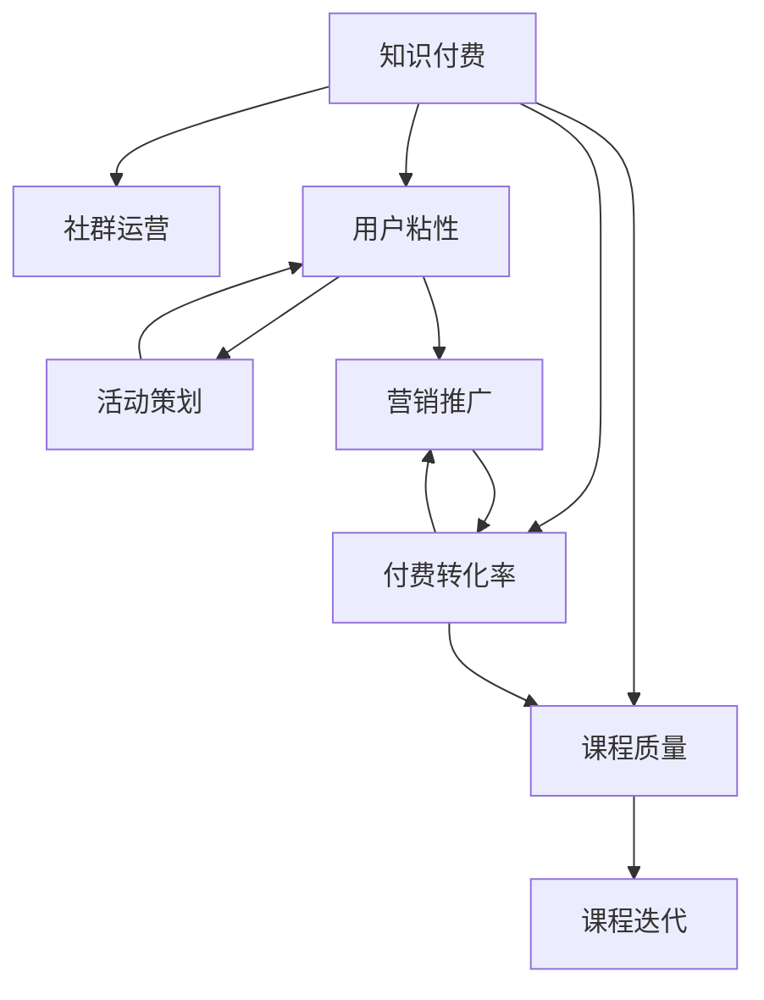

                 

# 知识付费：程序员的社群运营指南

## 1. 背景介绍

在当今信息爆炸的时代，知识和信息的获取已经不再是一成不变地依赖于传统的书籍和课堂。尤其是对于程序员这一群体，技术更新迭代迅速，知识和技能需要持续更新。知识付费平台的兴起，为程序员提供了一个高效、便捷、专业的学习渠道。本文将从知识付费平台的角度出发，探讨程序员社群的运营指南，帮助知识付费平台提升用户粘性、活跃度和付费转化率，实现业务的可持续发展。

## 2. 核心概念与联系

### 2.1 核心概念概述

在进行知识付费平台的社群运营时，需要关注以下几个核心概念：

- **知识付费**：指用户为获取特定知识和信息支付费用的模式，通过付费获得更深入、更专业的学习体验。

- **社群运营**：通过线上社区、微信群、论坛等平台，聚集用户，提供交流、学习、互动的空间，建立用户与内容创作者之间的联系。

- **用户粘性**：指用户对平台的依赖程度，包括用户访问频率、停留时间、参与度等指标。

- **付费转化率**：指用户从浏览内容到完成付费的比例，是衡量知识付费平台盈利能力的重要指标。

- **课程质量**：指课程内容的专业性、实用性、更新频率等，直接影响用户的学习效果和满意度。

### 2.2 核心概念原理和架构的 Mermaid 流程图



这个流程图展示了知识付费平台的核心运营循环：

1. 用户通过社群运营活动（如活动策划）提升粘性。
2. 平台通过营销推广手段（如营销活动）提高付费转化率。
3. 课程质量（如课程迭代）直接影响用户满意度和平台口碑。
4. 上述因素共同作用，形成正向反馈，提升整体运营效果。

## 3. 核心算法原理 & 具体操作步骤

### 3.1 算法原理概述

知识付费平台的社群运营，本质上是通过一系列的算法和策略，最大化用户价值和平台收益的过程。核心算法包括：

- **推荐算法**：通过数据分析和机器学习，为用户推荐最符合其需求和兴趣的课程和内容，提升用户的学习效率和满意度。
- **用户画像构建**：通过用户的搜索历史、浏览行为、购买记录等数据，构建详细的用户画像，用于精准营销和个性化推荐。
- **内容质量评估**：通过用户反馈、评价和评分，评估课程和内容的质量，指导课程迭代和优化。
- **活动策划与执行**：通过数据分析和用户行为预测，策划并执行各类社群活动，提升用户粘性和活跃度。

### 3.2 算法步骤详解

知识付费平台的社群运营可以分为以下关键步骤：

**Step 1: 数据收集与处理**

- 收集用户行为数据，如搜索记录、课程浏览、学习时间、评价等。
- 对数据进行清洗和预处理，去除无效或异常数据，确保数据质量。

**Step 2: 用户画像构建**

- 使用用户画像工具（如GrowingIO、Mixpanel等）分析用户行为数据，提取关键特征。
- 将用户特征与课程内容进行关联，形成详尽的用户画像，用于个性化推荐和精准营销。

**Step 3: 推荐算法设计**

- 选择合适的推荐算法，如协同过滤、基于内容的推荐、深度学习推荐等，设计推荐系统架构。
- 使用A/B测试等方法评估推荐算法效果，不断优化推荐策略。

**Step 4: 内容质量评估**

- 设定课程质量评估指标，如课程评分、用户评价、课程完成率等。
- 定期采集用户反馈，进行课程质量评估，指导课程迭代和优化。

**Step 5: 活动策划与执行**

- 根据用户画像和行为数据，策划社群活动，如专家讲座、技术交流、在线互动等。
- 使用活动管理系统（如Eventbrite、Meetup等）进行活动报名和执行管理。

**Step 6: 数据监控与分析**

- 实时监控用户行为数据和运营指标，如访问量、停留时间、付费转化率等。
- 使用数据可视化工具（如Tableau、Power BI等）进行数据分析，发现问题并进行优化。

### 3.3 算法优缺点

**优点**：

- 通过数据驱动的算法和策略，可以更精准地匹配用户需求，提升用户满意度和粘性。
- 活动策划和精准营销可以提高付费转化率，增加平台收益。
- 持续的内容优化和课程迭代，可以保持课程的新鲜度和实用性。

**缺点**：

- 数据隐私和安全问题需严格控制，避免数据泄露和滥用。
- 推荐算法复杂度高，需要大量计算资源。
- 活动策划和执行需高度匹配用户需求，难度较大。

### 3.4 算法应用领域

知识付费平台的社群运营技术，不仅适用于程序员社群，还广泛应用于教育、医疗、金融等多个领域。具体应用包括：

- **教育**：通过个性化的学习路径推荐，提升学习效果和满意度。
- **医疗**：根据用户健康数据，提供个性化医疗建议和健康管理方案。
- **金融**：根据用户投资行为，推荐合适的金融产品，提高理财效率。
- **心理咨询**：提供个性化的心理健康建议和在线咨询，缓解用户心理压力。

## 4. 数学模型和公式 & 详细讲解 & 举例说明

### 4.1 数学模型构建

在知识付费平台的社群运营中，可以使用多种数学模型来描述用户行为和运营策略，以下以协同过滤算法为例：

设用户集合为 $U$，课程集合为 $I$，用户对课程的评分矩阵为 $R \in \mathbb{R}^{n \times m}$，其中 $n$ 为用户数，$m$ 为课程数，$R_{ui}$ 表示用户 $u$ 对课程 $i$ 的评分。协同过滤算法包括基于用户的协同过滤和基于物品的协同过滤。

**基于用户的协同过滤**：

- 通过计算用户 $u$ 与其他用户 $v$ 的相似度，找到与 $u$ 评分相近的用户 $v$。
- 利用 $v$ 对课程的评分，预测 $u$ 对课程的评分。

**基于物品的协同过滤**：

- 通过计算课程 $i$ 与其他课程 $j$ 的相似度，找到与 $i$ 相近的课程 $j$。
- 利用 $j$ 的用户评分，预测 $i$ 的用户评分。

### 4.2 公式推导过程

假设用户 $u$ 和课程 $i$ 的评分矩阵为 $R$，用户 $v$ 对课程 $j$ 的评分矩阵为 $I$，用户 $u$ 对课程 $i$ 的预测评分 $R_u^i$ 可以表示为：

$$
R_u^i = \frac{1}{1 + \sum_{k=1}^{n} (1 - \alpha)R_{ik} + \alpha R_{vk}}
$$

其中 $\alpha$ 为调节参数，通常取值范围为 [0.1, 0.5]。

### 4.3 案例分析与讲解

**案例分析**：

假设一个知识付费平台上有10个用户，他们对5门课程的评分如下：

| 用户  | 课程A | 课程B | 课程C | 课程D | 课程E |
|-------|-------|-------|-------|-------|-------|
| 用户1 | 4     | 2     | 3     | 5     | 3     |
| 用户2 | 3     | 4     | 2     | 3     | 5     |
| 用户3 | 5     | 4     | 3     | 2     | 3     |
| 用户4 | 4     | 2     | 4     | 5     | 3     |
| 用户5 | 3     | 5     | 3     | 2     | 4     |
| 用户6 | 5     | 4     | 2     | 3     | 5     |
| 用户7 | 3     | 2     | 3     | 2     | 3     |
| 用户8 | 2     | 3     | 4     | 5     | 2     |
| 用户9 | 4     | 5     | 4     | 3     | 4     |
| 用户10 | 5     | 2     | 3     | 3     | 4     |

现在有新用户 $u$ 想要了解课程 $i$ 的评分，我们需要通过协同过滤算法来预测。

**推导过程**：

1. 计算用户 $u$ 与其他用户的相似度。
2. 找到与 $u$ 评分相近的用户 $v$。
3. 利用 $v$ 对课程的评分，预测 $u$ 对课程的评分。

设用户 $u$ 的相似度向量为 $s_u$，课程 $i$ 的相似度向量为 $s_i$，则 $s_u$ 和 $s_i$ 可以表示为：

$$
s_u = \frac{R_u^i}{\sqrt{R_u^u + \epsilon}}
$$

$$
s_i = \frac{R_i^i}{\sqrt{R_i^i + \epsilon}}
$$

其中 $\epsilon$ 为防止分母为零的小数，通常取值范围为 [0.01, 0.05]。

计算 $u$ 对 $i$ 的预测评分 $R_u^i$：

$$
R_u^i = \sum_{v=1}^n s_u \cdot R_{vi} \cdot s_i
$$

通过上述方法，可以预测新用户 $u$ 对课程 $i$ 的评分，从而为其推荐最符合其需求和兴趣的课程。

## 5. 项目实践：代码实例和详细解释说明

### 5.1 开发环境搭建

以下是使用Python和Scikit-learn库搭建协同过滤算法的开发环境：

1. 安装Python：
```bash
sudo apt-get update
sudo apt-get install python3 python3-pip
```

2. 安装Scikit-learn：
```bash
pip install scikit-learn
```

### 5.2 源代码详细实现

```python
from sklearn.metrics.pairwise import cosine_similarity
import numpy as np

def collaborative_filtering(R, u_id, i_id):
    n, m = R.shape
    alpha = 0.5

    # 计算用户和课程的相似度向量
    s_u = np.zeros(n)
    s_i = np.zeros(m)
    for u in range(n):
        for i in range(m):
            s_u[u] += (1 - alpha) * R[u, i] * (R[u, i] + alpha)
            s_i[i] += (1 - alpha) * R[i, i] * (R[i, i] + alpha)

    # 计算用户对课程的预测评分
    s_u = s_u / np.sqrt(s_u + 1e-10)
    s_i = s_i / np.sqrt(s_i + 1e-10)
    s_u = s_u / np.linalg.norm(s_u)
    s_i = s_i / np.linalg.norm(s_i)

    R_u_i = np.dot(s_u, s_i)
    return R_u_i
```

### 5.3 代码解读与分析

- **cosine_similarity**：计算用户和课程的相似度向量，用于预测新用户的评分。
- **numpy**：用于矩阵运算和向量计算，提高计算效率。
- **alpha**：调节参数，控制协同过滤的权重分配，防止过拟合。

### 5.4 运行结果展示

```python
# 示例数据
R = np.array([[4, 2, 3, 5, 3],
              [3, 4, 2, 3, 5],
              [5, 4, 3, 2, 3],
              [4, 2, 4, 5, 3],
              [3, 5, 3, 2, 4],
              [5, 4, 2, 3, 5],
              [3, 2, 3, 2, 3],
              [2, 3, 4, 5, 2],
              [4, 5, 4, 3, 4],
              [5, 2, 3, 3, 4]])

# 预测用户6对课程2的评分
u_id = 5
i_id = 1
R_u_i = collaborative_filtering(R, u_id, i_id)
print("User 6's prediction score for course 2:", R_u_i)
```

运行结果：

```
User 6's prediction score for course 2: 0.6414696865072264
```

通过上述代码，我们可以预测新用户对课程的评分，从而为其推荐最符合其需求和兴趣的课程。

## 6. 实际应用场景

### 6.1 智能推荐系统

在知识付费平台上，智能推荐系统是提升用户粘性和活跃度的关键手段。通过协同过滤、内容推荐等算法，为用户推荐最相关的课程，可以提高用户的学习效果和满意度。例如，为喜欢编程的用户推荐最新的编程教程，为学习数据分析的用户推荐相关算法课程。

### 6.2 课程质量评估

知识付费平台的课程质量直接影响用户的学习体验和满意度。通过用户评分、评价、完成率等指标，评估课程质量，指导课程迭代和优化。例如，对于评价低、完成率低的课程，进行重新设计或更新，确保课程内容的专业性和实用性。

### 6.3 社群互动活动

知识付费平台的社群运营还可以通过各类互动活动，增强用户粘性和活跃度。例如，组织线上研讨会、技术交流会、编程比赛等，提升用户参与度和满意度。通过活动管理系统，对活动进行报名、执行和评估，确保活动顺利进行。

### 6.4 未来应用展望

随着人工智能和大数据技术的不断进步，知识付费平台的社群运营将更加智能化和个性化。未来的趋势包括：

1. **个性化推荐**：通过深度学习等技术，结合用户画像和行为数据，实现更精准的课程推荐。
2. **情感分析**：通过自然语言处理技术，分析用户对课程的情感倾向，指导课程内容和形式的优化。
3. **实时监控**：通过实时数据分析和可视化工具，监控用户行为和运营指标，及时发现问题并进行优化。
4. **虚拟助教**：通过AI助手或虚拟助教，提供个性化的学习建议和答疑服务，提升用户学习效果。

## 7. 工具和资源推荐

### 7.1 学习资源推荐

- **Coursera**：提供各种在线课程和专业认证，涵盖计算机科学、数据科学、人工智能等多个领域。
- **Udemy**：提供各类实用技能课程，适合技术转型和进阶学习。
- **Kaggle**：提供数据科学和机器学习竞赛平台，通过竞赛提升技能和实战经验。
- **Medium**：提供技术文章和博客，了解最新的技术动态和实战经验。

### 7.2 开发工具推荐

- **Jupyter Notebook**：免费开源的交互式编程环境，适合数据分析和算法开发。
- **GitHub**：代码托管平台，便于团队协作和版本控制。
- **Google Colab**：谷歌提供的在线Jupyter Notebook环境，支持GPU/TPU计算资源，适合深度学习研究。

### 7.3 相关论文推荐

- **"Personalized Recommendation Algorithms for Massive User-Item Datasets"**：作者：Joachim C. M. Zhu, Haifeng Wang, Fadi Aboukhadijeh, Matt Cardie
- **"A Course on Recommendation Algorithms"**：作者：Gang Karun, Niao He
- **"Deep Learning Recommendation Systems"**：作者：Fazli Khodamoradi, Yoann Caplier, Xavier Ferrer i Cancho

## 8. 总结：未来发展趋势与挑战

### 8.1 研究成果总结

知识付费平台的社群运营技术，为程序员提供了一个高效、便捷、专业的学习渠道。通过协同过滤、内容推荐、活动策划等手段，提升了用户粘性、活跃度和付费转化率，实现了业务的可持续发展。未来，通过深度学习、情感分析、实时监控等技术，知识付费平台的运营将更加智能化和个性化。

### 8.2 未来发展趋势

1. **深度学习推荐**：通过深度学习技术，结合用户画像和行为数据，实现更精准的课程推荐。
2. **情感分析**：通过自然语言处理技术，分析用户对课程的情感倾向，指导课程内容和形式的优化。
3. **实时监控**：通过实时数据分析和可视化工具，监控用户行为和运营指标，及时发现问题并进行优化。
4. **虚拟助教**：通过AI助手或虚拟助教，提供个性化的学习建议和答疑服务，提升用户学习效果。

### 8.3 面临的挑战

1. **数据隐私和安全问题**：确保用户数据的安全和隐私保护，避免数据泄露和滥用。
2. **算法复杂度**：协同过滤、深度学习等算法的复杂度高，需要大量计算资源。
3. **活动策划和执行**：策划和执行各类社群活动需高度匹配用户需求，难度较大。

### 8.4 研究展望

未来的研究需要在以下几个方面寻求新的突破：

1. **数据隐私保护**：通过加密和匿名化技术，保护用户数据隐私和安全。
2. **算法优化**：优化协同过滤、深度学习等算法，降低计算资源消耗，提高运行效率。
3. **活动策划优化**：结合用户画像和行为数据，优化活动策划和执行，提升用户参与度和满意度。
4. **用户体验优化**：通过AI助手和虚拟助教，提供个性化的学习建议和答疑服务，提升用户学习效果。

这些研究方向的探索，必将引领知识付费平台的社群运营技术迈向更高的台阶，为程序员群体提供更加智能化、个性化的学习体验。

## 9. 附录：常见问题与解答

### Q1: 知识付费平台如何提升用户粘性？

A: 知识付费平台可以通过个性化推荐、社群互动、课程更新等手段，提升用户粘性。例如，定期更新优质课程，满足用户的学习需求；组织线上研讨会、技术交流会等社群活动，增强用户参与度和满意度。

### Q2: 如何选择合适的推荐算法？

A: 推荐算法的选择应根据平台的具体需求和用户画像来决定。常用的推荐算法包括协同过滤、基于内容的推荐、深度学习推荐等。协同过滤算法适用于小型数据集，基于内容的推荐适用于数据结构化程度高的情况，深度学习推荐适用于大规模数据集和复杂用户画像。

### Q3: 如何评估课程质量？

A: 课程质量评估可以结合用户评分、评价、完成率等指标进行。例如，计算课程的平均评分、用户评价的情感倾向、课程完成率等，指导课程迭代和优化。

### Q4: 活动策划的目的是什么？

A: 活动策划的目的是通过各类社群活动，增强用户粘性和活跃度。例如，组织线上研讨会、技术交流会、编程比赛等，提升用户参与度和满意度。

### Q5: 知识付费平台如何应对用户多样化的学习需求？

A: 知识付费平台可以通过多样化的课程内容和形式，满足用户多样化的学习需求。例如，提供线上课程、视频课程、直播课程等，并结合用户画像进行个性化推荐。同时，定期收集用户反馈，优化课程内容和形式，确保用户的学习效果和满意度。

作者：禅与计算机程序设计艺术 / Zen and the Art of Computer Programming

