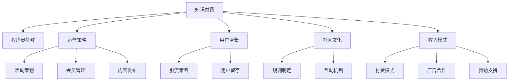

                 

# 知识付费：程序员的社群运营指南

> 关键词：知识付费, 程序员社群, 运营指南, 用户增长, 社区文化, 收入模式

## 1. 背景介绍

### 1.1 问题由来
随着互联网的普及和数字经济的兴起，知识付费成为了一种新兴的商业模式。特别是在程序员社区，掌握前沿技术、学习高效工作方法、拓展职业发展路径的需求日益增长。这促使程序员社群开始探索更加系统化和专业化的知识付费模式。

### 1.2 问题核心关键点
本文聚焦于程序员社群的知识付费模式，通过深入分析其核心概念和内在联系，探讨如何通过有效的运营策略，构建一个具有强大吸引力和高粘性的程序员社群。

## 2. 核心概念与联系

### 2.1 核心概念概述

为更好地理解程序员社群的知识付费模式，本节将介绍几个密切相关的核心概念：

- **知识付费**：指用户为获取特定知识或服务而支付费用的商业行为，包括在线课程、咨询服务、技术文章等。
- **程序员社群**：指由一群拥有共同兴趣、技能和职业发展目标的程序员组成的线上或线下社区。
- **运营策略**：指社群管理者通过合理的资源配置和活动设计，促进用户增长和社群活跃度的策略。
- **用户增长**：指通过有效手段吸引新用户加入社群，并促使现有用户持续活跃的过程。
- **社区文化**：指社群成员共同遵守的行为规范、价值观念和互动方式。
- **收入模式**：指社群通过知识付费、广告、赞助等手段实现盈利的途径。

这些核心概念之间的逻辑关系可以通过以下Mermaid流程图来展示：



这个流程图展示了的核心概念及其之间的关系：

1. **知识付费**：是促进**程序员社群**发展的动力，通过高质量的**运营策略**和**社区文化**建设，吸引和留住用户。
2. **运营策略**：包括活动策划、会员管理、内容发布等，是实现**用户增长**和**社区文化**建设的关键。
3. **用户增长**：通过引流策略和用户留存机制，提升社群活跃度。
4. **社区文化**：通过规则制定和互动机制，构建良好的社群氛围。
5. **收入模式**：通过付费模式、广告合作、赞助支持等方式实现商业化运营。

这些概念共同构成了程序员社群知识付费模式的基础框架，为其持续发展和商业化提供了指导。

## 3. 核心算法原理 & 具体操作步骤
### 3.1 算法原理概述

程序员社群的知识付费模式，本质上是一个用户增长和社群运营优化的过程。其核心思想是：通过有效的运营策略，吸引新用户加入，同时促使现有用户持续活跃，从而最大化社群价值。

形式化地，假设社群总数为 $N$，新用户加入速率为 $\lambda$，用户流失速率为 $\mu$，新用户在社群中的活跃度为 $P$，每个用户每年付费次数为 $X$，每次付费金额为 $Y$，则社群每年总收入为：

$$
\text{收入} = N \cdot \lambda \cdot P \cdot X \cdot Y - N \cdot \mu \cdot P \cdot X \cdot Y
$$

优化目标是最小化用户流失率 $\mu$，同时最大化用户活跃度和付费次数 $P$ 和 $X$，以提升社群收入。

### 3.2 算法步骤详解

程序员社群的知识付费模式实施一般包括以下几个关键步骤：

**Step 1: 确定目标用户群体**
- 分析现有用户数据，确定目标用户群体的特征，如技术栈、职业阶段、学习需求等。
- 设计用户画像，明确社群服务的主要用户群体，制定相应的运营策略。

**Step 2: 设计用户增长策略**
- 利用SEO、社交媒体、KOL推广等手段，提高社群知名度，吸引新用户加入。
- 设计优质的免费试用期、免费资源等，降低用户加入门槛，提升转化率。
- 建立用户反馈机制，及时响应用户需求，提高用户体验。

**Step 3: 内容发布与质量控制**
- 发布高质量的技术文章、在线课程、实战案例等，满足用户的学习需求。
- 设立严格的审核机制，保证内容的专业性和实用性。
- 定期更新内容，保持社群知识的新鲜度。

**Step 4: 社区文化建设**
- 制定社群规则，确保成员行为的规范性。
- 鼓励积极互动，如技术讨论、代码协作、知识分享等，构建健康的社区氛围。
- 组织线上线下活动，促进成员之间的交流和协作。

**Step 5: 收入模式探索**
- 采用多种收入模式，如订阅制、按需付费、会员制等，满足不同用户的需求。
- 与知名技术公司、软件厂商等合作，引入广告和赞助。
- 开发社群专属产品和服务，提升用户粘性和付费意愿。

**Step 6: 用户留存与忠诚度管理**
- 定期发送社区资讯、技术文章、活动预告等，保持用户活跃度。
- 设立积分系统、认证机制等，提升用户的归属感和忠诚度。
- 进行用户满意度调查，持续优化社群运营策略。

### 3.3 算法优缺点

程序员社群的知识付费模式具有以下优点：
1. **精准定位**：通过明确的目标用户群体分析，可以制定更精准的运营策略，提升用户转化率。
2. **高质量内容**：高质量的知识产出，满足用户的学习需求，增强用户粘性。
3. **多样化收入**：采用多种收入模式，降低对单一收入来源的依赖，提升社群的盈利能力。
4. **社区互动**：通过积极互动和丰富的活动，构建健康的社区文化，提高用户满意度。

同时，该模式也存在一定的局限性：
1. **高运营成本**：高质量的内容产出和社区文化建设需要投入大量时间和资源。
2. **用户流失**：社群运营的复杂性和多样性，可能导致用户流失率较高。
3. **收入波动**：收入模式的多样性可能带来收入的不稳定性。
4. **内容质量风险**：如果内容质量无法保证，可能会损害社群品牌和用户信任。

尽管存在这些局限性，但就目前而言，基于知识付费的程序员社群模式仍具有强大的吸引力和发展潜力。未来相关研究的重点在于如何进一步降低运营成本，提升用户留存率，同时优化内容质量和收入模式。

### 3.4 算法应用领域

程序员社群的知识付费模式已经广泛应用于多个领域，例如：

- **在线教育平台**：如极客时间、CSDN学院等，提供高质量的技术课程和实战案例，满足程序员的学习需求。
- **技术博客和社区**：如博客园、Stack Overflow等，发布技术文章、问答讨论，促进技术交流和知识共享。
- **软件开发工具**：如GitHub、码云等，提供开发工具、代码管理、社区讨论等服务，增强开发效率和协作。
- **技术会议和活动**：如全球软件开发者大会、全球开发者大会等，通过线下活动和线上直播，提供技术分享和交流机会。

除了上述这些经典领域外，程序员社群的知识付费模式还被创新性地应用到更多场景中，如技术开源项目、技术培训、企业技术内训等，为程序员技术提升和职业发展提供了新的路径。

## 4. 数学模型和公式 & 详细讲解 & 举例说明

### 4.1 数学模型构建

本节将使用数学语言对程序员社群的知识付费模式进行更加严格的刻画。

假设社群总数为 $N$，新用户加入速率为 $\lambda$，用户流失速率为 $\mu$，新用户在社群中的活跃度为 $P$，每个用户每年付费次数为 $X$，每次付费金额为 $Y$。

设社群每年总收入为 $I$，则有：

$$
I = N \cdot \lambda \cdot P \cdot X \cdot Y - N \cdot \mu \cdot P \cdot X \cdot Y
$$

设社群的用户增长速率为 $G$，则有：

$$
G = \lambda - \mu
$$

设社群的净收入为 $R$，则有：

$$
R = I - N \cdot G \cdot P \cdot X \cdot Y
$$

优化目标是最小化用户流失率 $\mu$，同时最大化用户活跃度和付费次数 $P$ 和 $X$，以提升社群收入。

### 4.2 公式推导过程

以下我们以一个简单的程序员社群为例，推导知识付费模式下的收入公式。

假设社群初始用户数为 $N_0$，新用户加入速率为 $\lambda$，用户流失速率为 $\mu$，每个用户在社群中的活跃度为 $P$，每个用户每年付费次数为 $X$，每次付费金额为 $Y$。社群的总用户数随时间变化的公式为：

$$
N(t) = N_0 \cdot e^{G(t)}
$$

其中 $G(t) = (\lambda - \mu) \cdot t$ 为时间 $t$ 内的用户增长量。

社群的总收入为：

$$
I(t) = N(t) \cdot P \cdot X \cdot Y
$$

社群的净收入为：

$$
R(t) = I(t) - N(t) \cdot G(t) \cdot P \cdot X \cdot Y
$$

将 $G(t)$ 和 $I(t)$ 代入 $R(t)$，得：

$$
R(t) = N_0 \cdot P \cdot X \cdot Y \cdot (e^{G(t)} - 1) - N_0 \cdot (\lambda - \mu) \cdot P \cdot X \cdot Y \cdot t
$$

简化得：

$$
R(t) = N_0 \cdot P \cdot X \cdot Y \cdot (\lambda - \mu) \cdot t
$$

为了最大化净收入 $R(t)$，需要最小化用户流失率 $\mu$，同时最大化用户活跃度 $P$ 和付费次数 $X$。

### 4.3 案例分析与讲解

假设某程序员社群初始用户数为 $N_0 = 1000$，新用户加入速率为 $\lambda = 0.02$，用户流失速率为 $\mu = 0.01$，每个用户在社群中的活跃度为 $P = 0.8$，每个用户每年付费次数为 $X = 3$，每次付费金额为 $Y = 100$。则社群的净收入公式为：

$$
R(t) = 1000 \cdot 0.8 \cdot 3 \cdot 100 \cdot (0.02 - 0.01) \cdot t
$$

简化得：

$$
R(t) = 57600 \cdot (0.01) \cdot t
$$

这意味着，社群每年通过知识付费产生的净收入为57600元，且净收入随时间呈线性增长。为了最大化净收入，社群管理者需要不断优化运营策略，提升用户活跃度和付费次数，同时控制用户流失率。

## 5. 项目实践：代码实例和详细解释说明

### 5.1 开发环境搭建

在进行知识付费模式的项目实践前，我们需要准备好开发环境。以下是使用Python进行Flask框架开发的环境配置流程：

1. 安装Python：从官网下载并安装Python，确保版本为3.7或更高版本。
2. 安装Flask：通过pip安装Flask框架，即 `pip install Flask`。
3. 创建虚拟环境：使用virtualenv创建虚拟环境，即 `python -m venv myenv`，进入虚拟环境 `source myenv/bin/activate`。
4. 安装依赖包：安装Flask及其扩展模块，如Flask-SQLAlchemy、Flask-WTF、Flask-Login等，即 `pip install Flask-SQLAlchemy Flask-WTF Flask-Login`。
5. 配置数据库：使用SQLite或MySQL等数据库，通过Flask-SQLAlchemy配置数据库连接。
6. 配置Flask-WTF：用于表单验证和CSRF防护，通过`app.config['SECRET_KEY'] = 'your_secret_key'`配置。

完成上述步骤后，即可在虚拟环境中开始知识付费模式的开发实践。

### 5.2 源代码详细实现

下面我们以一个简单的在线课程平台为例，给出使用Flask框架实现知识付费的PyTorch代码实现。

首先，定义课程和用户模型：

```python
from flask_sqlalchemy import SQLAlchemy
from flask_login import UserMixin, LoginManager, login_user, login_required, logout_user

app = Flask(__name__)
app.config['SECRET_KEY'] = 'your_secret_key'
app.config['SQLALCHEMY_DATABASE_URI'] = 'sqlite:///course.db'
db = SQLAlchemy(app)
login_manager = LoginManager(app)

class User(UserMixin, db.Model):
    id = db.Column(db.Integer, primary_key=True)
    username = db.Column(db.String(30), unique=True, nullable=False)
    password = db.Column(db.String(60), nullable=False)

class Course(db.Model):
    id = db.Column(db.Integer, primary_key=True)
    title = db.Column(db.String(100), nullable=False)
    content = db.Column(db.Text, nullable=False)
    price = db.Column(db.Float, nullable=False)
```

然后，定义用户登录和课程订阅逻辑：

```python
from flask_wtf import FlaskForm
from wtforms import StringField, PasswordField, SubmitField, FloatField
from wtforms.validators import DataRequired, Length, Email, EqualTo

class LoginForm(FlaskForm):
    username = StringField('Username', validators=[DataRequired(), Length(min=2, max=20)])
    password = PasswordField('Password', validators=[DataRequired(), Length(min=8, max=80)])
    submit = SubmitField('Log In')

class CourseForm(FlaskForm):
    title = StringField('Title', validators=[DataRequired()])
    content = TextAreaField('Content', validators=[DataRequired()])
    price = FloatField('Price', validators=[DataRequired()])
    submit = SubmitField('Publish')

@login_manager.user_loader
def load_user(user_id):
    return User.query.get(int(user_id))

@app.route('/')
@login_required
def index():
    courses = Course.query.all()
    return render_template('index.html', courses=courses)

@app.route('/login', methods=['GET', 'POST'])
def login():
    form = LoginForm()
    if form.validate_on_submit():
        user = User.query.filter_by(username=form.username.data).first()
        if user and user.password == form.password.data:
            login_user(user)
            return redirect('/')
        else:
            flash('Invalid username or password')
    return render_template('login.html', form=form)

@app.route('/logout')
@login_required
def logout():
    logout_user()
    return redirect('/')

@app.route('/course/new', methods=['GET', 'POST'])
@login_required
def new_course():
    form = CourseForm()
    if form.validate_on_submit():
        course = Course(title=form.title.data, content=form.content.data, price=form.price.data)
        db.session.add(course)
        db.session.commit()
        flash('Course created successfully')
        return redirect('/')
    return render_template('new_course.html', form=form)
```

最后，定义用户订阅课程的视图：

```python
@app.route('/course/<int:id>/subscribe', methods=['GET', 'POST'])
@login_required
def subscribe_course(id):
    course = Course.query.get(id)
    if course:
        if current_user.is_authenticated:
            user = User.query.get(current_user.id)
            if course not in user.subscribed_courses:
                user.subscribed_courses.append(course)
                db.session.commit()
                flash('Course subscribed successfully')
            else:
                flash('Already subscribed')
        else:
            flash('Please log in to subscribe')
    return redirect('/')
```

以上就是使用Flask框架实现知识付费的完整代码实现。可以看到，通过Flask-SQLAlchemy和Flask-WTF等扩展模块，我们可以便捷地实现用户登录、课程发布和课程订阅等功能。

### 5.3 代码解读与分析

让我们再详细解读一下关键代码的实现细节：

**User模型**：
- 定义了用户的基本信息，包括用户名和密码。
- 使用Flask-SQLAlchemy进行数据库表的映射。

**Course模型**：
- 定义了课程的基本信息，包括标题、内容和价格。
- 同样使用Flask-SQLAlchemy进行数据库表的映射。

**LoginForm和CourseForm**：
- 使用Flask-WTF创建表单类，用于处理用户登录和课程发布时的表单提交。
- 利用WTForms的字段验证器，确保用户输入的数据符合要求。

**index视图**：
- 获取所有课程信息，并返回给前端页面。
- 使用@login_required装饰器确保只有登录用户才能访问。

**login视图**：
- 处理用户登录请求，验证用户名和密码是否匹配。
- 利用Flask-Login提供的@login_manager.user_loader装饰器，自动加载已登录的用户。

**logout视图**：
- 处理用户登出请求，销毁用户会话。

**new_course视图**：
- 处理新课程发布请求，将课程信息存入数据库。
- 使用@login_required装饰器确保只有管理员才能发布课程。

**subscribe_course视图**：
- 处理课程订阅请求，将用户订阅的课程信息存入数据库。
- 使用@login_required装饰器确保只有登录用户才能订阅课程。

这些视图和表单类共同构成了知识付费平台的完整功能，能够满足用户的基本需求，支持课程发布和订阅等功能。

## 6. 实际应用场景

### 6.1 在线教育平台

在线教育平台是知识付费模式的重要应用场景。通过构建高质量的课程资源和互动平台，在线教育平台可以为程序员提供系统的学习路径，帮助他们掌握前沿技术，提升职业竞争力。

在技术实现上，平台可以通过订阅制、按需付费等方式，灵活设计付费模型，满足不同用户的需求。同时，平台还应提供丰富的学习资源、互动问答、实时答疑等功能，增强用户的学习体验和粘性。

### 6.2 技术博客和社区

技术博客和社区是程序员社群知识付费的另一种形式。通过发布高质量的技术文章和开源项目，博客和社区能够汇聚大量技术爱好者，形成良好的知识共享和互动氛围。

在技术实现上，博客和社区可以采用免费的会员模式，通过文章打赏、开源项目赞助等方式，实现知识付费。同时，平台应建立严格的审核机制，确保内容的专业性和实用性，提升用户信任和粘性。

### 6.3 软件开发工具

软件开发工具是程序员社群知识付费的创新应用。通过集成知识付费功能，工具类应用能够为程序员提供一站式的技术支持和服务，提高开发效率和协作效果。

在技术实现上，工具类应用可以结合社区和内容推荐系统，为用户提供个性化的学习资源和工具推荐。同时，平台应支持多语言、跨平台的功能，方便用户在不同环境下的使用。

### 6.4 未来应用展望

随着知识付费模式的不断成熟，程序员社群的知识付费应用将拓展到更多领域，为程序员提供更加全面和高效的服务。

在智慧医疗领域，知识付费模式可以帮助医护人员快速掌握新技术，提升医疗服务质量。

在智能制造领域，知识付费模式可以为工程师提供系统的学习资源，推动工业4.0的发展。

在智慧农业领域，知识付费模式可以帮助农民掌握先进的种植技术，提升农业生产效率。

## 7. 工具和资源推荐

### 7.1 学习资源推荐

为了帮助开发者系统掌握知识付费模式，这里推荐一些优质的学习资源：

1. **《知识付费模式分析与设计》系列博文**：由知识付费领域专家撰写，深入浅出地介绍了知识付费的原理、运营策略和用户增长方法。
2. **《程序员社群运营手册》书籍**：详细讲解了程序员社群的运营策略、用户增长、社区文化建设等核心内容，提供了丰富的实战案例。
3. **Coursera《数字营销与社群运营》课程**：由知名大学开设，涵盖数字营销、社群运营等基础知识和实战技巧，适合入门学习。
4. **《社区运营管理》课程**：由知名社区运营专家授课，提供社区管理的系统性知识，涵盖用户增长、内容运营、社区文化建设等多个方面。
5. **《知识付费营销策略》线上课程**：由知识付费领域的实战专家授课，详细讲解了知识付费的营销策略和效果评估方法。

通过对这些资源的学习实践，相信你一定能够全面掌握知识付费模式的精髓，并用于解决实际的程序员社群运营问题。

### 7.2 开发工具推荐

高效的开发离不开优秀的工具支持。以下是几款用于知识付费模式开发的常用工具：

1. **Flask框架**：轻量级的Python Web框架，灵活易用，适合快速开发知识付费平台。
2. **SQLAlchemy**：Python的ORM框架，支持多种数据库，方便进行数据管理和操作。
3. **Flask-WTF**：WTForms表单库的Flask扩展，方便处理表单验证和用户输入。
4. **Flask-Login**：用户认证和会话管理的Flask扩展，方便实现用户登录、注销等功能。
5. **Flask-SQLAlchemy**：Flask与SQLAlchemy的集成，方便进行数据库连接和操作。
6. **Jupyter Notebook**：开源的交互式笔记本工具，方便进行数据探索和分析。
7. **PyCharm**：功能强大的Python IDE，支持调试、代码高亮等功能，提高开发效率。

合理利用这些工具，可以显著提升知识付费模式的开发效率，加快创新迭代的步伐。

### 7.3 相关论文推荐

知识付费模式的深入研究源于学界的持续研究。以下是几篇奠基性的相关论文，推荐阅读：

1. **《知识付费模式的研究与实践》**：系统分析了知识付费的原理、运营策略和用户增长方法，提供了丰富的实战案例。
2. **《社区运营的理论与实践》**：详细探讨了社区运营的理论基础和实践方法，适合运营管理人员学习。
3. **《知识付费与用户行为分析》**：通过数据分析方法，揭示了知识付费对用户行为的影响，为运营策略提供了数据支持。
4. **《知识付费平台的创新与挑战》**：分析了知识付费平台的发展现状和未来趋势，提出了新的运营方向和挑战。
5. **《知识付费的商业模式与可持续发展》**：探讨了知识付费的商业模式和可持续发展策略，为知识付费平台的商业化运营提供了理论基础。

这些论文代表了大语言模型微调技术的发展脉络。通过学习这些前沿成果，可以帮助研究者把握学科前进方向，激发更多的创新灵感。

## 8. 总结：未来发展趋势与挑战

### 8.1 总结

本文对程序员社群的知识付费模式进行了全面系统的介绍。首先阐述了知识付费模式的研究背景和意义，明确了知识付费在程序员社群中的独特价值。其次，从原理到实践，详细讲解了知识付费的数学模型和核心算法，给出了知识付费平台的完整代码实例。同时，本文还广泛探讨了知识付费模式在在线教育、技术博客、软件开发工具等领域的实际应用前景，展示了知识付费模式的巨大潜力。

通过本文的系统梳理，可以看到，知识付费模式在程序员社群中的应用前景广阔，通过高质量的内容产出和运营策略的优化，可以显著提升用户粘性和社群价值。未来，伴随知识付费模式的不断成熟，将为程序员社群带来更多的创新和变革。

### 8.2 未来发展趋势

展望未来，程序员社群的知识付费模式将呈现以下几个发展趋势：

1. **技术融合与创新**：知识付费模式将与其他技术领域进行更深入的融合，如区块链、AI技术等，提升内容真实性和用户信任度。
2. **内容多样化**：除了视频、文章等传统内容形式，还将拓展到代码段、实验项目、实战案例等多种形式，满足用户多样化的学习需求。
3. **国际化扩展**：通过本地化适配和跨文化沟通，知识付费平台将在全球范围内扩展，吸引更多的国际用户。
4. **个性化推荐**：利用推荐算法，为用户推荐个性化的学习资源，提高用户的学习效果和粘性。
5. **社交化互动**：构建社区内部的互动机制，增强用户之间的交流和协作，形成良好的社区氛围。
6. **跨平台整合**：通过跨平台的功能整合，提升用户体验，方便用户在不同环境下的学习。

以上趋势凸显了知识付费模式的广阔前景。这些方向的探索发展，必将进一步提升程序员社群的知识付费水平，为程序员技术提升和职业发展提供更全面的支持。

### 8.3 面临的挑战

尽管知识付费模式已经取得了显著的成效，但在迈向更加智能化、普适化应用的过程中，它仍面临着诸多挑战：

1. **内容质量风险**：如果内容质量无法保证，可能会损害社群品牌和用户信任。
2. **用户留存率**：社群运营的复杂性和多样性，可能导致用户流失率较高。
3. **技术更新快**：知识付费内容需要不断更新，以保持与技术前沿的同步，这增加了内容维护的难度。
4. **商业化压力**：知识付费平台需要找到平衡点，既满足用户需求，又实现盈利。
5. **数据安全**：用户数据的隐私保护和安全性，成为知识付费平台必须重视的问题。

尽管存在这些挑战，但通过不断的技术创新和运营优化，知识付费模式仍具有强大的生命力和发展潜力。

### 8.4 研究展望

面向未来，知识付费模式的研究需要在以下几个方面寻求新的突破：

1. **数据驱动的运营**：通过数据分析方法，深入了解用户行为和需求，优化运营策略，提升用户满意度。
2. **技术融合与创新**：结合区块链、AI等前沿技术，提升内容真实性和用户信任度。
3. **内容生态建设**：构建开放的内容生态，吸引更多的创作者和贡献者，提升内容的多样性和质量。
4. **社区文化建设**：通过积极的社区互动和交流，构建健康的社区文化，增强用户粘性和社区凝聚力。
5. **国际化扩展**：通过本地化适配和跨文化沟通，拓展知识付费平台在全球范围内的应用。
6. **个性化推荐**：利用推荐算法，提供个性化的学习资源，提高用户的学习效果和粘性。

这些研究方向将为程序员社群的知识付费模式带来新的突破，推动其不断向更高的层次发展。

## 9. 附录：常见问题与解答

**Q1：如何确保知识付费平台的内容质量？**

A: 确保知识付费平台的内容质量，需要从多个方面进行综合管理：
1. **内容审核**：设立严格的内容审核机制，确保所有发布内容符合平台标准。
2. **用户反馈**：建立用户反馈系统，及时收集用户对内容的评价和建议，优化内容质量。
3. **专家评审**：邀请行业专家进行评审，提升内容的专业性和权威性。
4. **质量监控**：利用数据分析工具，监控内容的质量和用户反馈，及时调整和改进。

**Q2：如何提升知识付费平台的用户留存率？**

A: 提升知识付费平台的用户留存率，可以从以下几个方面进行优化：
1. **内容更新**：定期发布新内容，保持内容的新鲜度，吸引用户持续关注。
2. **互动机制**：建立用户互动机制，如评论、讨论、问答等，增强用户的参与感。
3. **社区文化**：构建良好的社区文化，形成用户之间的信任和协作，提升用户粘性。
4. **个性化推荐**：利用推荐算法，为用户推荐个性化的学习资源，提高用户的学习效果和粘性。
5. **用户激励**：设立积分系统、认证机制等，激励用户积极参与和贡献内容。

**Q3：知识付费模式有哪些潜在的商业模式？**

A: 知识付费模式的潜在商业模式包括：
1. **订阅制**：用户定期订阅，享受内容更新和特定权益。
2. **按需付费**：用户按需购买课程或文章，获得相应的知识和资源。
3. **会员制**：用户成为会员，享受全平台的高质量内容和专属服务。
4. **广告合作**：引入品牌广告，通过用户曝光实现商业化收入。
5. **赞助支持**：与企业和技术公司合作，引入赞助资金，提升平台价值。

**Q4：如何构建程序员社群的知识付费平台？**

A: 构建程序员社群的知识付费平台，需要从以下几个方面进行系统规划：
1. **平台定位**：明确平台的目标用户群体、服务内容和价值主张。
2. **技术选型**：选择合适的技术栈和开发工具，确保平台的稳定性和可扩展性。
3. **内容建设**：引入高质量的内容创作者，发布实用的学习资源和实战案例。
4. **运营策略**：制定科学合理的运营策略，提升用户转化率和留存率。
5. **社区文化**：构建积极的社区文化，促进用户之间的互动和交流。

这些关键步骤共同构成了知识付费平台的构建框架，有助于平台在程序员社群中实现可持续发展。

**Q5：知识付费模式在实际应用中面临哪些挑战？**

A: 知识付费模式在实际应用中面临的挑战包括：
1. **内容质量风险**：如果内容质量无法保证，可能会损害社群品牌和用户信任。
2. **用户留存率**：社群运营的复杂性和多样性，可能导致用户流失率较高。
3. **技术更新快**：知识付费内容需要不断更新，以保持与技术前沿的同步，这增加了内容维护的难度。
4. **商业化压力**：知识付费平台需要找到平衡点，既满足用户需求，又实现盈利。
5. **数据安全**：用户数据的隐私保护和安全性，成为知识付费平台必须重视的问题。

这些挑战需要在技术、运营、管理等多个层面进行综合应对，才能实现知识付费模式的长期稳定发展。

---

作者：禅与计算机程序设计艺术 / Zen and the Art of Computer Programming

