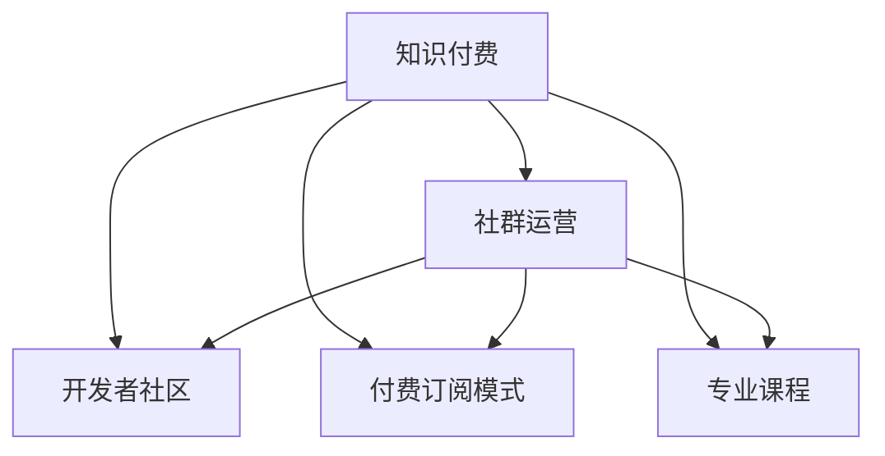

                 

# 知识付费：程序员的社群运营攻略

在数字化时代，知识的获取和传播方式正在经历翻天覆地的变化。面对海量信息，人们越来越倾向于通过付费订阅的方式获取权威、深入的知识。这一趋势不仅在出版物领域显现，也逐渐渗透到各个行业，程序员群体也不例外。社群运营作为知识付费模式的有效实践，如何利用这一新兴方式来提升程序员的技能水平和职业素养，已成为一项重要的任务。本文旨在探讨程序员社群运营的攻略，帮助开发者更好地利用这一模式，推动技术的学习和交流。

## 1. 背景介绍

### 1.1 知识付费的兴起
在知识爆炸的今天，获取知识的渠道越来越多，从传统的书籍、期刊到在线课程、博客、社交媒体等，让人目不暇接。然而，信息过载也带来了选择困难和知识浅薄的问题。这时，知识付费模式应运而生，通过付费机制筛选优质内容，提供高质量的知识服务。

### 1.2 程序员社群的必要性
程序员作为一个技术密集型群体，时刻面临技术更新、问题解决等挑战。与传统行业不同，编程领域的知识和技能更新快速，旧知识迅速过时，新技术层出不穷。因此，社群运营成为了程序员知识获取和技能提升的重要渠道。它不仅提供最新的技术资讯和解决方案，还能促进成员之间的交流和协作，提升整个群体的技术水平和协作能力。

## 2. 核心概念与联系

### 2.1 核心概念概述
在探讨程序员社群运营时，我们涉及以下几个关键概念：

- **知识付费**：通过付费方式获取高质量的知识内容，从而避免信息过载和知识浅薄的问题。
- **社群运营**：通过构建线上或线下的交流平台，促进知识分享、交流和协作，提升社群成员的技术水平和职业素养。
- **开发者社区**：程序员通过在线平台进行技术交流、问题讨论、项目协作的社群。
- **付费订阅模式**：用户定期支付费用，以获得持续的知识更新和优质内容的访问权限。
- **专业课程**：针对特定技术领域，由专家提供系统的课程培训。

这些概念之间的逻辑关系可以通过以下Mermaid流程图来展示：



### 2.2 核心概念原理和架构的 Mermaid 流程图


这个流程图展示了知识付费模式与社群运营、开发者社区、付费订阅模式和专业课程之间的联系和依赖关系。社群运营和知识付费是知识传播的核心，开发者社区和付费订阅模式提供了知识传播的渠道和方式，专业课程则提供了具体知识的载体。

## 3. 核心算法原理 & 具体操作步骤

### 3.1 算法原理概述
程序员社群运营的算法原理主要基于用户行为分析和内容推荐机制。通过对用户行为数据的分析，了解用户的需求和兴趣，从而推荐相关内容，提升用户满意度和参与度。同时，利用深度学习技术，构建个性化推荐模型，实现内容的精准推送。

### 3.2 算法步骤详解

#### 3.2.1 用户行为数据分析
- **用户注册与认证**：用户注册并完成身份认证后，可以开始使用社群平台。
- **行为数据采集**：通过记录用户在平台上的浏览、评论、提问、回答、项目贡献等行为，收集用户的行为数据。
- **数据预处理**：对采集到的数据进行清洗和处理，去除噪音和异常数据。
- **特征提取**：提取用户行为特征，如活跃度、兴趣领域、知识水平等，用于后续分析和推荐。

#### 3.2.2 内容推荐模型构建
- **模型选择**：根据社群平台的特点和需求，选择合适的推荐模型，如协同过滤、基于内容的推荐、深度学习推荐等。
- **数据准备**：将用户行为数据和内容数据进行处理，得到可用于训练的特征矩阵和标签向量。
- **模型训练**：利用用户行为数据和内容数据，训练推荐模型，得到模型参数。
- **效果评估**：使用验证集对训练好的模型进行效果评估，调整模型参数，直到达到满意的效果。

#### 3.2.3 推荐结果呈现
- **个性化推荐**：根据用户的行为特征和兴趣，生成个性化推荐结果，推荐系统将结果呈现给用户。
- **推荐算法优化**：根据用户反馈和互动数据，不断优化推荐算法，提升推荐效果。
- **交互反馈**：收集用户对推荐结果的反馈，如点击、评价等，进一步优化推荐模型。

### 3.3 算法优缺点

#### 3.3.1 算法优点
- **精准推荐**：通过深度学习推荐模型，能够根据用户行为特征，精准推送个性化内容，提升用户体验。
- **高效运营**：利用用户行为数据分析，优化社群运营策略，提高平台活跃度和用户满意度。
- **动态更新**：推荐模型可以根据用户反馈和行为数据动态调整，适应用户需求的变化。

#### 3.3.2 算法缺点
- **冷启动问题**：新用户由于行为数据不足，可能无法得到准确的推荐结果。
- **数据隐私**：用户行为数据的采集和处理需要保护用户隐私，避免数据泄露。
- **模型复杂度**：深度学习推荐模型需要大量的数据和计算资源，模型复杂度较高。

### 3.4 算法应用领域

#### 3.4.1 线上社群平台
- **技术交流与讨论**：用户可以在平台上分享技术心得、解决技术问题、讨论技术趋势。
- **课程与学习**：平台提供高质量的专业课程，用户可以系统学习新技术和新知识。
- **项目协作与分享**：用户可以参与开源项目，贡献代码，分享项目经验，提升协作能力。

#### 3.4.2 线下活动
- **技术研讨会**：定期组织线下技术研讨会，邀请技术专家分享最新技术趋势和实践经验。
- **黑客松**：组织黑客松活动，鼓励开发者解决实际问题，提升技术水平。
- **技术沙龙**：举办技术沙龙，探讨行业热点话题，促进技术交流。

## 4. 数学模型和公式 & 详细讲解 & 举例说明

### 4.1 数学模型构建
在本节中，我们将介绍一个简单的协同过滤推荐模型，用于程序员社群的内容推荐。

假设用户集合为 $U$，物品集合为 $I$，用户对物品的评分矩阵为 $R$，协同过滤模型的目标是预测用户对未评物品的评分。设用户 $u$ 对物品 $i$ 的评分 $R_{ui}$ 为 $r_{ui}$，协同过滤模型的数学模型如下：

$$
\hat{R}_{ui} = \sum_{j \in N(u)} \frac{R_{uj} \cdot R_{ji}}{\sqrt{c_u + 1} \sqrt{c_j + 1}}
$$

其中 $N(u)$ 为与用户 $u$ 交互过的物品集合，$c_u$ 和 $c_j$ 分别为用户 $u$ 和物品 $j$ 的评分数，$\sqrt{\cdot}$ 表示对分母加 $1$ 后开方，以避免分母为 $0$ 的情况。

### 4.2 公式推导过程
协同过滤模型的推导基于以下假设：用户对物品的评分可以通过其他用户和物品的评分来预测。具体推导如下：

1. 用户 $u$ 对物品 $i$ 的评分可以表示为：

   $$
   \hat{R}_{ui} = \sum_{j \in N(u)} \frac{R_{uj} \cdot R_{ji}}{\sqrt{c_u + 1} \sqrt{c_j + 1}}
   $$

2. 其中 $N(u)$ 为用户 $u$ 的邻居集合，$c_u$ 和 $c_j$ 分别表示用户 $u$ 和物品 $j$ 的评分数。
3. 使用上述公式计算用户 $u$ 对物品 $i$ 的预测评分，并将结果与实际评分进行比较，可以得到预测误差的平方和：

   $$
   E = \sum_{ui \in I} (\hat{R}_{ui} - R_{ui})^2
   $$

4. 最小化预测误差的平方和，可以得到协同过滤模型的优化目标：

   $$
   \min_{R} E = \sum_{ui \in I} (\hat{R}_{ui} - R_{ui})^2
   $$

5. 对上式进行求解，可以得到协同过滤模型的参数更新公式：

   $$
   \frac{\partial E}{\partial R_{ui}} = 2(\hat{R}_{ui} - R_{ui}) \cdot \frac{1}{\sqrt{c_u + 1} \sqrt{c_j + 1}}
   $$

   上式表示对物品 $i$ 的评分 $R_{ui}$ 进行更新，以减小预测误差。

### 4.3 案例分析与讲解

**案例一：开发者社区的内容推荐**
开发者社区通常提供大量的技术文章、教程、项目案例等内容。通过协同过滤模型，可以为每个用户推荐最相关的文章和教程。

假设有一个开发者社区，用户 $u_1$ 浏览了文章 $i_1$ 和 $i_2$，并且对它们分别打分 $r_{u_1i_1} = 4$ 和 $r_{u_1i_2} = 3$。平台上有 $c_u = 3$ 个物品 $i_1, i_2, i_3$，用户 $u_1$ 的邻居为 $N(u_1) = \{i_1, i_2\}$。

根据协同过滤模型，可以计算用户 $u_1$ 对物品 $i_3$ 的预测评分：

$$
\hat{R}_{u_1i_3} = \frac{R_{u_1i_1} \cdot R_{i_1i_3}}{\sqrt{c_{u_1} + 1} \sqrt{c_{i_1} + 1}} + \frac{R_{u_1i_2} \cdot R_{i_2i_3}}{\sqrt{c_{u_1} + 1} \sqrt{c_{i_2} + 1}}
$$

代入已知值计算得到：

$$
\hat{R}_{u_1i_3} = \frac{4 \cdot 5}{\sqrt{3 + 1} \sqrt{3 + 1}} + \frac{3 \cdot 2}{\sqrt{3 + 1} \sqrt{2 + 1}} = 3.5
$$

因此，推荐系统可以预测用户 $u_1$ 对物品 $i_3$ 的评分，并提供给用户 $u_1$ 推荐该物品。

**案例二：线上编程练习平台**
编程练习平台提供各种编程练习题目和测试用例，用户可以在平台上完成练习，并获得相应的分数和反馈。通过协同过滤模型，可以为用户推荐最合适的练习题目。

假设用户 $u$ 完成了编程练习 $i$，并获得了 $r_{ui} = 80$ 分。平台上共有 $c_u = 5$ 个练习 $i, i_1, i_2, i_3, i_4$，用户 $u$ 的邻居为 $N(u) = \{i_1, i_2\}$。

根据协同过滤模型，可以计算用户 $u$ 对练习 $i_3$ 的预测评分：

$$
\hat{R}_{ui_3} = \frac{R_{ui_1} \cdot R_{i_1i_3}}{\sqrt{c_u + 1} \sqrt{c_{i_1} + 1}} + \frac{R_{ui_2} \cdot R_{i_2i_3}}{\sqrt{c_u + 1} \sqrt{c_{i_2} + 1}}
$$

代入已知值计算得到：

$$
\hat{R}_{ui_3} = \frac{80 \cdot 85}{\sqrt{5 + 1} \sqrt{5 + 1}} + \frac{80 \cdot 90}{\sqrt{5 + 1} \sqrt{4 + 1}} = 84.5
$$

因此，推荐系统可以预测用户 $u$ 对练习 $i_3$ 的评分，并提供给用户 $u$ 推荐该练习。

## 5. 项目实践：代码实例和详细解释说明

### 5.1 开发环境搭建

#### 5.1.1 环境准备
- **Python环境**：建议使用Python 3.7或以上版本，确保库兼容性。
- **依赖库安装**：需要安装必要的库，如Numpy、Pandas、Scikit-learn、TensorFlow等。

#### 5.1.2 搭建虚拟环境
- **创建虚拟环境**：
  ```bash
  conda create --name dev_env python=3.7
  conda activate dev_env
  ```
- **安装依赖库**：
  ```bash
  pip install numpy pandas scikit-learn tensorflow
  ```

### 5.2 源代码详细实现

#### 5.2.1 用户行为数据处理
```python
import pandas as pd
from sklearn.model_selection import train_test_split

# 读取用户行为数据
df = pd.read_csv('user_behavior_data.csv')

# 数据清洗和处理
df = df.dropna()  # 删除缺失值
df = df.drop_duplicates()  # 删除重复行

# 特征提取
user_features = df[['user_id', 'item_id', 'score', 'timestamp']]
item_features = df[['item_id', 'category', 'difficulty']]

# 分割训练集和测试集
train_data, test_data = train_test_split(user_features, test_size=0.2, random_state=42)
```

#### 5.2.2 协同过滤推荐模型训练
```python
from tensorflow.keras.layers import Input, Dense, Embedding, Dot, Add
from tensorflow.keras.models import Model

# 定义模型输入
user_input = Input(shape=(n_users,), name='user')
item_input = Input(shape=(n_items,), name='item')
score_input = Input(shape=(n_items,), name='score')

# 定义用户和物品的嵌入层
user_embeddings = Embedding(n_users, embedding_dim, name='user_embeddings')(user_input)
item_embeddings = Embedding(n_items, embedding_dim, name='item_embeddings')(item_input)

# 定义用户和物品的交互层
dot_product = Dot(axes=1, normalize=True)([user_embeddings, item_embeddings])
bias = Add(name='bias')([dot_product, score_input])

# 定义模型输出
output = Dense(1, activation='sigmoid')(bias)

# 定义模型
model = Model(inputs=[user_input, item_input, score_input], outputs=output)
model.compile(optimizer='adam', loss='binary_crossentropy', metrics=['accuracy'])

# 训练模型
model.fit([train_data['user_id'], train_data['item_id'], train_data['score']], train_data['score'], epochs=10, batch_size=64, validation_data=([test_data['user_id'], test_data['item_id'], test_data['score']], test_data['score']))
```

#### 5.2.3 推荐结果生成
```python
# 加载测试集数据
test_user_ids = test_data['user_id'].values
test_item_ids = test_data['item_id'].values

# 生成推荐结果
scores = model.predict([test_user_ids, test_item_ids, test_data['score']])
scores = scores[:, 0]

# 输出推荐结果
for user_id, item_id, score in zip(test_user_ids, test_item_ids, scores):
    print(f"User: {user_id}, Item: {item_id}, Score: {score}")
```

### 5.3 代码解读与分析

#### 5.3.1 用户行为数据处理
- **数据清洗和处理**：通过删除缺失值和重复行，清洗数据，去除噪音和异常值。
- **特征提取**：将用户行为数据和物品属性数据进行特征提取，得到可用于训练的特征矩阵和标签向量。

#### 5.3.2 协同过滤推荐模型训练
- **模型定义**：定义用户和物品的嵌入层、交互层和输出层，构建协同过滤模型。
- **模型编译**：设置优化器和损失函数，并编译模型。
- **模型训练**：使用训练集数据训练模型，并在测试集上验证模型效果。

#### 5.3.3 推荐结果生成
- **数据加载**：加载测试集数据，准备生成推荐结果。
- **模型预测**：使用训练好的模型对测试集数据进行预测，生成推荐结果。
- **结果输出**：输出每个用户的推荐结果，包括用户ID、物品ID和推荐评分。

## 6. 实际应用场景

### 6.1 开发者社区
开发者社区通常包含大量的技术文章、教程、项目案例等内容。通过协同过滤推荐模型，可以为每个用户推荐最相关的文章和教程。例如，开发者社区可以收集用户在平台上浏览、评论、提问、回答等行为数据，构建协同过滤推荐模型，向用户推荐最相关的文章和教程。

### 6.2 线上编程练习平台
编程练习平台提供各种编程练习题目和测试用例，用户可以在平台上完成练习，并获得相应的分数和反馈。通过协同过滤推荐模型，可以为用户推荐最合适的练习题目。例如，编程练习平台可以收集用户完成的练习题目和得分数据，构建协同过滤推荐模型，向用户推荐最合适的练习题目。

### 6.3 技术培训平台
技术培训平台提供各种课程和培训内容，用户可以选择感兴趣的课程进行学习。通过协同过滤推荐模型，可以为用户推荐最合适的课程。例如，技术培训平台可以收集用户在平台上学习的课程和得分数据，构建协同过滤推荐模型，向用户推荐最合适的课程。

## 7. 工具和资源推荐

### 7.1 学习资源推荐

1. **《Python编程：从入门到实践》**：一本介绍Python编程语言的入门书籍，适合初学者学习。
2. **《机器学习实战》**：一本介绍机器学习算法和实现的书，适合对机器学习感兴趣的读者。
3. **Kaggle平台**：一个数据科学竞赛平台，提供大量数据集和案例，适合学习数据分析和机器学习。

### 7.2 开发工具推荐

1. **Jupyter Notebook**：一个交互式编程环境，适合进行数据处理和模型开发。
2. **TensorBoard**：一个可视化工具，可以实时监测模型训练状态，并提供丰富的图表呈现方式。
3. **GitHub**：一个代码托管平台，适合进行代码管理和版本控制。

### 7.3 相关论文推荐

1. **《协同过滤推荐系统：一种基于用户和物品相似度的推荐方法》**：介绍协同过滤推荐系统的基本原理和实现方法。
2. **《深度学习推荐系统：一种基于神经网络的推荐方法》**：介绍深度学习推荐系统的基本原理和实现方法。
3. **《Python数据科学手册》**：一本介绍Python数据科学工具和库的书籍，适合学习数据科学和机器学习。

## 8. 总结：未来发展趋势与挑战

### 8.1 未来发展趋势
未来的程序员社群运营将呈现以下几个发展趋势：

1. **AI和大数据技术的普及**：利用AI和大数据技术，可以更好地分析和处理用户行为数据，实现更加精准的内容推荐。
2. **社区自动化运营**：通过自动化工具，实现内容自动审核、推荐结果优化、用户反馈处理等，提升运营效率。
3. **跨平台协作**：将社区运营扩展到更多平台，如社交媒体、知识问答平台等，实现跨平台协作和用户交流。
4. **个性化服务**：根据用户行为数据和偏好，提供个性化的学习路径和推荐内容，提升用户满意度和参与度。
5. **知识付费模式的创新**：探索更多创新的知识付费模式，如按需付费、订阅+奖励等，吸引用户付费。

### 8.2 面临的挑战

尽管程序员社群运营有诸多优势，但在实际应用中仍然面临以下挑战：

1. **用户隐私保护**：用户行为数据的采集和处理需要保护用户隐私，避免数据泄露。
2. **内容质量控制**：如何保证社区内容的真实性和权威性，避免低质量内容的泛滥。
3. **运营成本控制**：社区运营需要投入大量资源，如何控制成本，提升运营效率。
4. **用户参与度提升**：如何提升用户参与度，增强社区活跃度和用户粘性。

### 8.3 研究展望
未来的研究可以在以下几个方面进一步探索：

1. **AI和大数据技术的应用**：利用AI和大数据技术，提升社区运营的智能化水平，实现更加精准的内容推荐。
2. **用户行为分析**：深入研究用户行为数据，挖掘用户需求和兴趣，提供更加个性化的推荐和服务。
3. **社区互动机制**：设计更加有效的社区互动机制，增强用户交流和协作，提升社区价值。
4. **跨平台协作**：探索跨平台协作和知识共享的机制，扩大社区的影响力和覆盖面。

## 9. 附录：常见问题与解答

**Q1：程序员社群运营和知识付费有什么区别？**

A: 程序员社群运营和知识付费都是知识传播的创新模式，但侧重点不同。知识付费主要关注内容的付费获取，而程序员社群运营更强调内容的免费分享和用户间的交流协作。社群运营通过构建线上或线下的交流平台，促进知识分享、交流和协作，提升社群成员的技术水平和职业素养。

**Q2：如何选择合适的推荐算法？**

A: 选择合适的推荐算法需要考虑数据特性、算法复杂度、推荐效果等因素。协同过滤算法适用于数据稀疏的情况，而基于内容的推荐算法适用于数据丰富的情况。深度学习推荐算法则适合处理大规模数据和高维度特征的情况。选择算法时，可以先进行小规模实验，评估效果后再进行大规模部署。

**Q3：如何保护用户隐私？**

A: 用户隐私保护是社群运营的重要任务。在数据采集和处理过程中，需要遵循隐私保护的相关法规和标准，如GDPR、CCPA等。同时，需要对用户数据进行加密处理，避免数据泄露。

**Q4：如何提高用户参与度？**

A: 提高用户参与度需要综合考虑多个因素。可以通过设计有吸引力的内容和活动，如技术研讨会、黑客松、技术沙龙等，吸引用户参与。同时，可以建立奖励机制，如积分、证书、荣誉称号等，激励用户积极贡献和参与。

**Q5：如何评估推荐效果？**

A: 推荐效果的评估可以从多个指标入手，如准确率、召回率、F1分数等。可以使用交叉验证、A/B测试等方法，评估推荐模型的效果，并不断优化模型参数和算法，提升推荐效果。

---

作者：禅与计算机程序设计艺术 / Zen and the Art of Computer Programming

