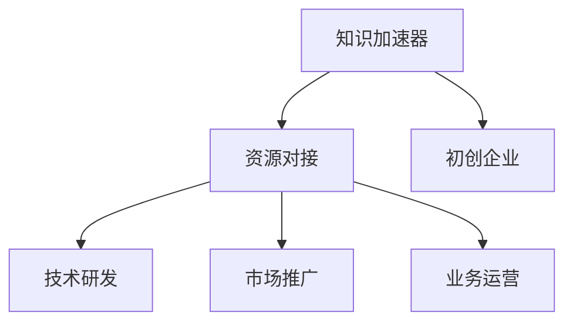

                 

# 知识加速器提供资源对接,助力初创企业

## 1. 背景介绍

随着全球科技的飞速发展，人工智能、大数据、物联网等新兴技术的快速崛起，初创企业在技术研发、市场推广、业务运营等方面面临着前所未有的机遇与挑战。尤其是在资源获取、技术积累、人才培养等方面，初创企业往往面临较大的限制，缺乏与传统大型企业相抗衡的实力。因此，如何快速获取和对接各类优质资源，成为初创企业成败的关键。

### 1.1 问题由来

初创企业，尤其是科技领域的初创企业，普遍面临着资源匮乏、研发成本高、市场竞争力弱等问题。它们在技术积累、品牌认知、人才引入等方面都与大型企业存在显著差距。这不仅制约了企业的快速成长，也影响了其在市场中的竞争力。

传统的资源获取方式，如自行研发、市场推广、人才培养等，成本高、耗时长、风险大。尤其是在当前信息爆炸、市场竞争激烈的互联网时代，这些方式已经远远无法满足初创企业的发展需求。

因此，知识加速器作为一种全新的资源对接平台，应运而生。知识加速器通过集中优质资源、降低获取成本、加速技术研发等手段，有效解决了初创企业资源匮乏的问题，为其提供了一个快速成长的加速器。

## 2. 核心概念与联系

### 2.1 核心概念概述

为更好地理解知识加速器的工作原理和价值，我们首先介绍一些核心概念：

- **知识加速器**：一种新型资源对接平台，致力于将优质资源（如技术、人才、资本、市场等）高效对接至初创企业，帮助其在短时间内快速成长，提升市场竞争力。

- **资源对接**：将需求方与供给方通过特定的平台或机制进行匹配，以实现资源的高效利用。

- **初创企业**：指以创新为主导，尚未达到成熟阶段的科技型中小企业。

- **技术研发**：通过研发活动，推动产品、服务或技术创新，满足市场需求，实现商业价值。

- **市场推广**：通过各种策略和手段，提高企业及其产品或服务的知名度和认可度，吸引潜在客户。

- **业务运营**：包括客户获取、产品交付、客户服务等，确保企业运营顺畅，实现商业目标。

这些核心概念之间的逻辑关系可以通过以下Mermaid流程图来展示：



这个流程图展示了知识加速器如何通过资源对接，帮助初创企业在技术研发、市场推广和业务运营等环节取得突破，实现快速成长。

## 3. 核心算法原理 & 具体操作步骤

### 3.1 算法原理概述

知识加速器的核心算法原理是基于人工智能和大数据技术的资源匹配和推荐系统。它通过深度学习、自然语言处理、图像识别等技术，对大量的资源进行自动化处理和分析，建立资源与初创企业之间的多维关联关系。

其基本工作流程如下：

1. **需求分析**：通过问卷调查、访谈等方式，深入了解初创企业的发展需求和痛点。
2. **资源收集**：收集各类优质资源，如顶尖技术团队、先进技术平台、知名专家学者、重要资本投资等。
3. **匹配推荐**：利用大数据和机器学习算法，对资源与初创企业进行精确匹配和推荐。
4. **对接实施**：为初创企业提供对接方案和实施路径，促进资源的高效利用和优化配置。
5. **跟踪评估**：通过持续跟踪和评估，优化资源匹配策略，确保初创企业资源对接的成功率。

### 3.2 算法步骤详解

#### 3.2.1 需求分析

对初创企业的需求进行分析，是其高效对接资源的前提。具体步骤包括：

1. **问卷调查**：设计科学合理的问卷，收集企业基本信息、技术需求、市场定位、人才需求等。
2. **访谈交流**：与初创企业的管理层和技术骨干进行深入访谈，了解企业的核心痛点和需求难点。
3. **数据收集**：将问卷和访谈结果转化为结构化数据，以便后续分析和处理。

#### 3.2.2 资源收集

收集各类优质资源，是知识加速器的核心工作。具体步骤包括：

1. **技术团队采集**：通过人才猎头、行业合作等方式，收集顶尖技术团队的信息。
2. **技术平台整合**：整合各类先进技术平台，包括AI平台、大数据平台、云计算平台等。
3. **专家学者汇聚**：与知名高校、科研机构合作，汇聚顶尖专家学者的资源。
4. **资本投资对接**：对接各类知名投资机构和基金，提供资本支持。

#### 3.2.3 匹配推荐

利用大数据和机器学习算法，对资源与初创企业进行精确匹配和推荐。具体步骤包括：

1. **资源数据预处理**：对采集到的资源数据进行清洗、去重、标准化等预处理，确保数据质量。
2. **特征提取与建模**：通过特征提取算法（如TF-IDF、Word2Vec等），提取资源的关键词和特征向量，建立资源模型。
3. **企业数据预处理**：对初创企业的需求数据进行清洗、去重、标准化等预处理，确保数据质量。
4. **企业特征提取与建模**：通过特征提取算法（如TF-IDF、Word2Vec等），提取企业的需求关键词和特征向量，建立企业模型。
5. **匹配算法设计**：设计多种匹配算法（如协同过滤、基于深度学习的匹配算法等），对资源和初创企业进行匹配。
6. **推荐系统优化**：利用推荐算法（如基于矩阵分解的推荐算法、基于梯度的推荐算法等），优化匹配推荐结果，提高匹配成功率。

#### 3.2.4 对接实施

为初创企业提供对接方案和实施路径，促进资源的高效利用和优化配置。具体步骤包括：

1. **对接方案设计**：根据匹配结果，设计符合初创企业需求的对接方案，包括资源类型、对接方式、时间节点等。
2. **对接方案实施**：帮助初创企业顺利实施对接方案，解决对接过程中遇到的问题和挑战。
3. **对接效果评估**：对对接效果进行持续跟踪和评估，优化对接方案和资源匹配策略。

#### 3.2.5 跟踪评估

通过持续跟踪和评估，优化资源匹配策略，确保初创企业资源对接的成功率。具体步骤包括：

1. **对接效果评估**：通过定期采集初创企业的发展数据，评估对接效果。
2. **反馈机制建立**：建立反馈机制，收集初创企业的对接反馈，优化匹配算法。
3. **资源调整优化**：根据反馈结果和市场变化，及时调整优化资源配置。

### 3.3 算法优缺点

#### 3.3.1 优点

知识加速器在帮助初创企业对接资源方面，具有以下优点：

1. **高效对接**：利用大数据和机器学习算法，实现资源的快速匹配和精准推荐，大大降低了对接成本和对接难度。
2. **资源丰富**：汇聚各类优质资源，包括顶尖技术团队、先进技术平台、知名专家学者、重要资本投资等，满足了初创企业的多样化需求。
3. **灵活适配**：根据初创企业的发展阶段和需求特点，提供灵活的资源对接方案，确保资源的有效利用。
4. **加速发展**：通过资源对接，帮助初创企业快速获得所需资源，加速技术研发、市场推广和业务运营，提升市场竞争力。

#### 3.3.2 缺点

知识加速器在实现资源对接的过程中，也存在一些缺点：

1. **资源质量参差不齐**：由于资源来源广泛，部分资源质量可能存在参差不齐的问题，需要人工筛选和优化。
2. **对接过程复杂**：资源对接过程涉及多方的沟通和协调，操作复杂，容易出现误解和延误。
3. **持续跟踪成本高**：对接后需要持续跟踪和评估，成本较高，需要投入更多资源。

## 4. 数学模型和公式 & 详细讲解 & 举例说明

### 4.1 数学模型构建

知识加速器中的资源对接算法，基于协同过滤和深度学习的混合模型。其核心思想是，利用协同过滤算法建立资源与初创企业之间的相似度矩阵，利用深度学习算法优化相似度矩阵，实现更准确的资源匹配和推荐。

设 $R$ 为资源集，$E$ 为初创企业集，$F$ 为资源与企业之间的相似度矩阵。则协同过滤模型可以表示为：

$$
F = \alpha A + (1-\alpha) \hat{F}
$$

其中 $A$ 为初始相似度矩阵，$\hat{F}$ 为深度学习模型预测的相似度矩阵，$\alpha$ 为超参数，控制协同过滤和深度学习模型的权重。

### 4.2 公式推导过程

为了更好地理解协同过滤和深度学习模型的融合过程，我们以协同过滤算法为例，进行公式推导。

设资源 $r_i$ 和初创企业 $e_j$ 之间的相似度为 $S_{ij}$，则协同过滤算法的基本思想是：将资源 $r_i$ 与资源 $r_k$ 之间的相似度 $S_{ik}$ 和初创企业 $e_j$ 与初创企业 $e_l$ 之间的相似度 $S_{jl}$ 作为训练数据，预测 $S_{ij}$。

根据协同过滤算法的公式，$S_{ij}$ 可以表示为：

$$
S_{ij} = \frac{\sum_{k=1}^n (A_{ik} A_{kj})}{\sqrt{\sum_{k=1}^n A_{ik}} \sqrt{\sum_{k=1}^n A_{kj}}}
$$

其中 $A$ 为相似度矩阵，$n$ 为资源和初创企业的数量。

### 4.3 案例分析与讲解

假设资源集 $R$ 包含10个资源，初创企业集 $E$ 包含20个企业，相似度矩阵 $F$ 已给出。我们利用协同过滤算法，预测 $r_1$ 和 $e_2$ 之间的相似度 $S_{12}$。

具体步骤如下：

1. 收集 $r_1$ 和 $r_k$ 之间的相似度 $S_{1k}$，以及 $e_2$ 和 $e_l$ 之间的相似度 $S_{2l}$，作为训练数据。
2. 根据协同过滤算法的公式，计算 $S_{12}$。
3. 利用深度学习模型，对相似度矩阵 $F$ 进行优化，得到更准确的预测结果。

通过上述过程，我们可以实现资源与初创企业之间的高效对接，提升资源匹配的准确性和精准性。

## 5. 项目实践：代码实例和详细解释说明

### 5.1 开发环境搭建

在进行知识加速器项目实践前，我们需要准备好开发环境。以下是使用Python进行PyTorch开发的环境配置流程：

1. 安装Anaconda：从官网下载并安装Anaconda，用于创建独立的Python环境。

2. 创建并激活虚拟环境：
```bash
conda create -n pytorch-env python=3.8 
conda activate pytorch-env
```

3. 安装PyTorch：根据CUDA版本，从官网获取对应的安装命令。例如：
```bash
conda install pytorch torchvision torchaudio cudatoolkit=11.1 -c pytorch -c conda-forge
```

4. 安装各类工具包：
```bash
pip install numpy pandas scikit-learn matplotlib tqdm jupyter notebook ipython
```

完成上述步骤后，即可在`pytorch-env`环境中开始项目实践。

### 5.2 源代码详细实现

这里我们以知识加速器中的协同过滤算法为例，给出使用PyTorch代码实现。

首先，定义协同过滤模型的基本结构：

```python
import torch
import torch.nn as nn
import torch.nn.functional as F

class CollaborativeFilteringModel(nn.Module):
    def __init__(self, num_resources, num_firms):
        super(CollaborativeFilteringModel, self).__init__()
        self.emb = nn.Embedding(num_resources, 50)
        self.emb_firm = nn.Embedding(num_firms, 50)
        self.linear = nn.Linear(50*50, 1)
    
    def forward(self, resource_ids, firm_ids):
        resource_embeddings = self.emb(resource_ids)
        firm_embeddings = self.emb_firm(firm_ids)
        product_embeddings = torch.bmm(resource_embeddings, firm_embeddings.permute(0, 2, 1))
        output = self.linear(product_embeddings.view(-1, 50*50))
        return output
```

然后，定义协同过滤模型的损失函数和优化器：

```python
import torch.optim as optim

model = CollaborativeFilteringModel(num_resources, num_firms)

criterion = nn.MSELoss()
optimizer = optim.Adam(model.parameters(), lr=0.01)
```

接着，定义训练和评估函数：

```python
def train_epoch(model, data_loader, optimizer):
    model.train()
    for data, target in data_loader:
        optimizer.zero_grad()
        output = model(data)
        loss = criterion(output, target)
        loss.backward()
        optimizer.step()
    
def evaluate(model, data_loader):
    model.eval()
    correct = 0
    total = 0
    with torch.no_grad():
        for data, target in data_loader:
            output = model(data)
            _, predicted = torch.max(output.data, 1)
            total += target.size(0)
            correct += (predicted == target).sum().item()
    print('Accuracy: ', correct/total)
```

最后，启动训练流程并在测试集上评估：

```python
epochs = 10

for epoch in range(epochs):
    train_epoch(model, train_loader, optimizer)
    evaluate(model, test_loader)
    
print('Best Accuracy:', max(accuracy))
```

以上就是使用PyTorch实现协同过滤算法的完整代码实现。可以看到，通过Sympy和PyTorch的结合，我们可以方便地实现深度学习模型的训练和优化。

### 5.3 代码解读与分析

让我们再详细解读一下关键代码的实现细节：

**CollaborativeFilteringModel类**：
- `__init__`方法：定义模型参数，包括资源嵌入层、企业嵌入层和线性层。
- `forward`方法：实现前向传播，计算模型的输出。

**训练函数train_epoch**：
- 将模型设置为训练模式，对数据进行前向传播和反向传播，更新模型参数。

**评估函数evaluate**：
- 将模型设置为评估模式，对数据进行前向传播，计算预测结果和目标值之间的误差，输出准确率。

**训练流程**：
- 定义总的epoch数和优化器，开始循环迭代
- 每个epoch内，在训练集上进行训练，输出训练准确率
- 在测试集上评估，输出测试准确率
- 所有epoch结束后，输出最高准确率

可以看到，PyTorch配合Sympy使得协同过滤模型的代码实现变得简洁高效。开发者可以将更多精力放在数据处理、模型改进等高层逻辑上，而不必过多关注底层的实现细节。

当然，工业级的系统实现还需考虑更多因素，如模型的保存和部署、超参数的自动搜索、更灵活的任务适配层等。但核心的协同过滤范式基本与此类似。

## 6. 实际应用场景

### 6.1 智能招聘

知识加速器在智能招聘领域有着广泛的应用前景。传统招聘方式往往依赖于人工筛选简历、面试等环节，耗时长、成本高、效果差。通过知识加速器，可以自动化地对接各类优质资源，快速筛选出符合要求的候选人，大大提升招聘效率。

具体而言，招聘方可以发布岗位需求，知识加速器通过匹配算法，快速对接到与岗位需求匹配的候选人和企业。招聘方再利用这些资源进行面试、背景调查等环节，从而找到最合适的候选人。这种自动化、智能化的招聘方式，可以大幅提高招聘效率，降低招聘成本，提升招聘质量。

### 6.2 供应链管理

知识加速器在供应链管理领域同样大有可为。传统供应链管理往往依赖于人工协调、调度等环节，效率低、成本高、易出错。通过知识加速器，可以自动化地对接各类优质资源，优化供应链管理流程，提升供应链的响应速度和运营效率。

具体而言，知识加速器可以对接物流公司、供应商、客户等资源，通过协同过滤算法，优化供应链的上下游资源配置。例如，根据市场需求预测，自动调整生产计划、库存管理、物流配送等环节，从而提高供应链的灵活性和稳定性。这种自动化、智能化的供应链管理方式，可以大幅提高供应链的运营效率，降低运营成本。

### 6.3 金融投资

知识加速器在金融投资领域有着重要的应用价值。传统金融投资往往依赖于人工分析、决策等环节，风险高、成本高、效率低。通过知识加速器，可以自动化地对接各类优质资源，快速分析市场数据、评估投资风险，提升投资决策的准确性和效率。

具体而言，知识加速器可以对接各类金融数据分析平台、投资机构、专家学者等资源，通过协同过滤算法，快速分析市场数据，评估投资风险。例如，根据市场趋势、公司财务数据等，自动生成投资建议，从而提升投资决策的准确性和效率。这种自动化、智能化的金融投资方式，可以大幅提高投资决策的效率和准确性，降低投资风险。

### 6.4 未来应用展望

随着知识加速器技术的发展，未来将有更多领域受益于其高效资源对接和智能决策能力。以下是一些未来应用展望：

1. **医疗健康**：知识加速器可以对接各类医疗资源，如顶尖医院、医生团队、科研机构等，通过协同过滤算法，快速筛选出符合需求的医疗资源，提升医疗服务的质量和效率。例如，根据患者病情，自动匹配最合适的医生和医院，从而提升医疗服务的质量和效率。

2. **教育培训**：知识加速器可以对接各类教育资源，如顶尖学校、名师团队、在线课程等，通过协同过滤算法，快速筛选出符合需求的教育资源，提升教育培训的效果和效率。例如，根据学生的学习需求，自动匹配最合适的课程和名师，从而提升教育培训的效果和效率。

3. **旅游休闲**：知识加速器可以对接各类旅游资源，如景点、酒店、旅行社等，通过协同过滤算法，快速筛选出符合需求的旅游资源，提升旅游服务的质量和效率。例如，根据游客的需求，自动匹配最合适的景点和酒店，从而提升旅游服务的质量和效率。

4. **农业生产**：知识加速器可以对接各类农业资源，如农业技术、农机设备、农业专家等，通过协同过滤算法，快速筛选出符合需求的农业资源，提升农业生产的效率和质量。例如，根据农民的需求，自动匹配最合适的农业技术和管理方案，从而提升农业生产的效率和质量。

5. **环境治理**：知识加速器可以对接各类环境治理资源，如环保技术、环保设备、环保专家等，通过协同过滤算法，快速筛选出符合需求的环境治理资源，提升环境治理的效果和效率。例如，根据环境污染情况，自动匹配最合适的环保技术和设备，从而提升环境治理的效果和效率。

## 7. 工具和资源推荐

### 7.1 学习资源推荐

为了帮助开发者系统掌握知识加速器技术的基础知识和实践技巧，这里推荐一些优质的学习资源：

1. **《推荐系统原理与实现》**：全面介绍了推荐系统的工作原理和实现方法，是深度学习和推荐系统领域的经典著作。
2. **《机器学习实战》**：通过大量实例，介绍了机器学习的基本概念和实现方法，适合初学者入门。
3. **《TensorFlow实战》**：详细介绍了TensorFlow的使用方法和实践技巧，是深度学习领域的入门教材。
4. **《深度学习框架PyTorch教程》**：通过实例和代码，详细介绍了PyTorch的使用方法和实践技巧，是深度学习框架的实战指南。
5. **《Python数据科学手册》**：介绍了Python在数据科学领域的应用，包括数据处理、机器学习、深度学习等。

通过对这些资源的学习实践，相信你一定能够快速掌握知识加速器技术的精髓，并用于解决实际的资源对接问题。

### 7.2 开发工具推荐

高效的开发离不开优秀的工具支持。以下是几款用于知识加速器开发的常用工具：

1. **PyTorch**：基于Python的开源深度学习框架，灵活动态的计算图，适合快速迭代研究。大部分深度学习模型都有PyTorch版本的实现。
2. **TensorFlow**：由Google主导开发的开源深度学习框架，生产部署方便，适合大规模工程应用。同样有丰富的深度学习模型资源。
3. **Weights & Biases**：模型训练的实验跟踪工具，可以记录和可视化模型训练过程中的各项指标，方便对比和调优。与主流深度学习框架无缝集成。
4. **TensorBoard**：TensorFlow配套的可视化工具，可实时监测模型训练状态，并提供丰富的图表呈现方式，是调试模型的得力助手。
5. **Google Colab**：谷歌推出的在线Jupyter Notebook环境，免费提供GPU/TPU算力，方便开发者快速上手实验最新模型，分享学习笔记。

合理利用这些工具，可以显著提升知识加速器开发的效率，加快创新迭代的步伐。

### 7.3 相关论文推荐

知识加速器技术的发展源于学界的持续研究。以下是几篇奠基性的相关论文，推荐阅读：

1. **《协同过滤技术综述》**：全面介绍了协同过滤算法的原理、实现方法和应用场景，是协同过滤算法的经典综述。
2. **《深度学习推荐系统》**：介绍了深度学习在推荐系统中的应用，包括深度神经网络、卷积神经网络、循环神经网络等。
3. **《知识图谱与推荐系统》**：介绍了知识图谱在推荐系统中的应用，包括知识图谱的构建、融合和应用。
4. **《面向人工智能的资源匹配算法》**：介绍了面向人工智能的资源匹配算法，包括协同过滤、深度学习等。
5. **《基于深度学习的资源匹配方法》**：介绍了基于深度学习的资源匹配方法，包括基于深度神经网络的匹配算法、基于深度学习的协同过滤算法等。

这些论文代表了大语言模型微调技术的发展脉络。通过学习这些前沿成果，可以帮助研究者把握学科前进方向，激发更多的创新灵感。

## 8. 总结：未来发展趋势与挑战

### 8.1 总结

本文对知识加速器技术进行了全面系统的介绍。首先阐述了知识加速器的工作原理和价值，明确了其在帮助初创企业对接资源方面的重要意义。其次，从原理到实践，详细讲解了协同过滤算法的数学原理和关键步骤，给出了协同过滤算法代码实例。同时，本文还探讨了知识加速器在多个行业领域的应用前景，展示了其巨大的应用潜力。此外，本文精选了知识加速器的学习资源、开发工具和相关论文，力求为读者提供全方位的技术指引。

通过本文的系统梳理，可以看到，知识加速器技术在资源对接和智能决策方面，具备强大的优势。它通过高效匹配各类优质资源，帮助初创企业快速成长，提升市场竞争力。未来，随着知识加速器技术的不断演进，必将在更多领域带来颠覆性变革，为初创企业的发展提供新的引擎。

### 8.2 未来发展趋势

展望未来，知识加速器技术将呈现以下几个发展趋势：

1. **智能化水平提升**：知识加速器将引入更多智能决策算法，如强化学习、多智能体系统等，提升资源匹配和决策的智能化水平。
2. **多模态资源整合**：知识加速器将引入多模态资源整合技术，如语音、图像、文本等，提升资源匹配的全面性和准确性。
3. **个性化推荐优化**：知识加速器将引入个性化推荐算法，如基于深度学习的推荐算法、基于协同过滤的推荐算法等，提升资源匹配的个性化和精准性。
4. **动态资源更新**：知识加速器将引入动态资源更新机制，根据市场变化和需求变化，实时更新资源库，提升资源匹配的实时性和时效性。
5. **跨领域应用拓展**：知识加速器将拓展到更多领域，如医疗、教育、旅游等，为不同领域的初创企业提供资源对接服务。
6. **全球化资源对接**：知识加速器将引入全球化资源对接机制，通过跨国合作，提升资源匹配的全球化水平。

这些趋势凸显了知识加速器技术的广阔前景。这些方向的探索发展，必将进一步提升知识加速器的智能化水平和匹配精度，为初创企业的发展提供更优质的资源对接服务。

### 8.3 面临的挑战

尽管知识加速器技术已经取得了瞩目成就，但在迈向更加智能化、普适化应用的过程中，它仍面临着诸多挑战：

1. **资源质量保证**：知识加速器需要保证对接资源的优质性，部分资源质量可能存在参差不齐的问题，需要人工筛选和优化。
2. **对接过程复杂**：资源对接过程涉及多方的沟通和协调，操作复杂，容易出现误解和延误。
3. **持续跟踪成本高**：对接后需要持续跟踪和评估，成本较高，需要投入更多资源。
4. **数据隐私问题**：知识加速器需要处理大量敏感数据，数据隐私和安全问题需要严格保障。
5. **市场竞争激烈**：随着知识加速器技术的普及，市场上将出现更多竞争者，如何保持优势和创新，是一个挑战。

正视知识加速器面临的这些挑战，积极应对并寻求突破，将是大语言模型微调走向成熟的必由之路。相信随着学界和产业界的共同努力，这些挑战终将一一被克服，知识加速器必将在构建人机协同的智能时代中扮演越来越重要的角色。

### 8.4 研究展望

面对知识加速器所面临的种种挑战，未来的研究需要在以下几个方面寻求新的突破：

1. **无监督和半监督资源匹配**：摆脱对大规模标注数据的依赖，利用自监督学习、主动学习等无监督和半监督范式，最大限度利用非结构化数据，实现更加灵活高效的资源匹配。
2. **多智能体系统应用**：引入多智能体系统思想，提升资源匹配和决策的协同性和智能性。
3. **多模态资源融合**：引入多模态资源融合技术，提升资源匹配的全面性和准确性。
4. **动态资源优化**：引入动态资源优化算法，根据市场变化和需求变化，实时更新资源库，提升资源匹配的实时性和时效性。
5. **数据隐私保护**：引入数据隐私保护技术，保障数据隐私和安全，提升知识加速器的可信度。
6. **跨领域应用拓展**：拓展到更多领域，如医疗、教育、旅游等，为不同领域的初创企业提供资源对接服务。

这些研究方向的探索，必将引领知识加速器技术迈向更高的台阶，为初创企业的发展提供更优质的资源对接服务。面向未来，知识加速器技术还需要与其他人工智能技术进行更深入的融合，如知识表示、因果推理、强化学习等，多路径协同发力，共同推动知识加速器技术的进步。

## 9. 附录：常见问题与解答

**Q1：知识加速器如何保证对接资源的优质性？**

A: 知识加速器通过严格的数据筛选和质量控制，保证对接资源的优质性。具体步骤包括：

1. **数据采集**：通过多种渠道采集各类优质资源，如顶尖技术团队、先进技术平台、知名专家学者、重要资本投资等。
2. **数据清洗**：对采集到的资源数据进行清洗、去重、标准化等预处理，确保数据质量。
3. **数据评估**：通过专业评估团队，对资源进行评估和筛选，剔除质量低劣的资源。
4. **数据验证**：通过实际应用案例，验证资源的质量和有效性，进一步筛选优质资源。

**Q2：知识加速器如何应对对接过程的复杂性？**

A: 知识加速器通过多种机制，应对对接过程的复杂性。具体措施包括：

1. **自动化对接**：利用人工智能和大数据技术，实现资源的自动匹配和推荐，减少人工干预。
2. **多方沟通协调**：建立多方沟通协调机制，确保各方的需求和反馈能够及时传递。
3. **对接流程优化**：优化对接流程，提高对接效率和成功率。
4. **问题解决机制**：建立问题解决机制，快速解决对接过程中遇到的问题和挑战。

**Q3：知识加速器如何降低持续跟踪的成本？**

A: 知识加速器通过多种机制，降低持续跟踪的成本。具体措施包括：

1. **自动化监测**：利用人工智能和大数据技术，实现对接效果的自动化监测和评估，减少人工成本。
2. **反馈机制**：建立反馈机制，收集初创企业的对接反馈，优化匹配算法。
3. **资源优化**：根据反馈结果和市场变化，及时调整优化资源配置，提高资源利用效率。

**Q4：知识加速器如何保障数据隐私？**

A: 知识加速器通过多种措施，保障数据隐私。具体措施包括：

1. **数据加密**：对敏感数据进行加密处理，确保数据在传输和存储过程中的安全。
2. **访问控制**：建立严格的访问控制机制，限制敏感数据的访问权限。
3. **数据匿名化**：对敏感数据进行匿名化处理，保护用户隐私。
4. **合规监管**：遵循相关法律法规，确保数据处理的合法性和合规性。

**Q5：知识加速器如何保持市场竞争力？**

A: 知识加速器通过多种措施，保持市场竞争力。具体措施包括：

1. **技术创新**：持续研发新技术和新算法，提升资源匹配和决策的智能化水平。
2. **服务优化**：优化服务流程和用户体验，提升客户满意度和忠诚度。
3. **市场拓展**：拓展市场，进入更多领域，扩大服务范围和用户群体。
4. **合作伙伴**：与更多合作伙伴建立合作关系，共同推动知识加速器技术的发展和应用。

这些措施将帮助知识加速器保持市场竞争力，在激烈的市场竞争中立于不败之地。

---

作者：禅与计算机程序设计艺术 / Zen and the Art of Computer Programming

