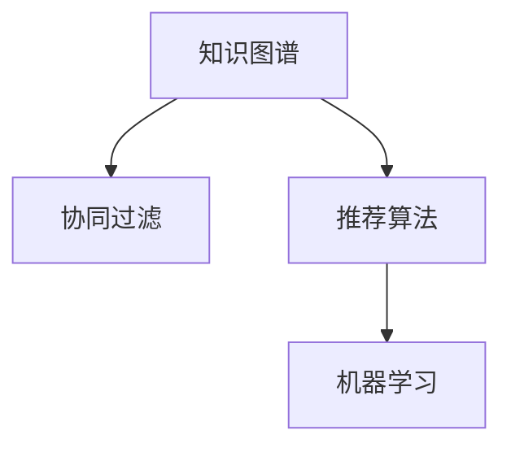

                 

# 知识发现引擎助力程序员快速掌握新技能

> 关键词：知识发现引擎, 程序员, 技能掌握, 自动推荐, 数据挖掘, 机器学习

## 1. 背景介绍

### 1.1 问题由来

在快速发展的科技领域，程序员需要不断更新和掌握新的编程语言、框架、工具和技术栈。然而，由于现代编程生态的多样性和复杂性，程序员获取新技能的过程充满了挑战：
- **信息过载**：互联网上充斥着海量信息，筛选高效、相关的内容不易；
- **学习曲线陡峭**：许多新技术涉及全新的概念和方法，难以快速上手；
- **时间限制**：日常工作繁忙，难以系统学习。

为解决这些问题，知识发现引擎应运而生。知识发现引擎（Knowledge Discovery Engine，KDE）是一种智能系统，利用机器学习和大数据技术，自动发现并推荐最相关的学习资源和路径，帮助程序员高效掌握新技能。

### 1.2 问题核心关键点
知识发现引擎的核心在于：
1. **数据整合**：从分散的编程资源中整合出有价值的知识。
2. **知识发现**：通过数据分析和机器学习技术，发现知识之间的关系和模式。
3. **智能推荐**：基于发现的知识，推荐个性化、高效的学习路径和资源。

### 1.3 问题研究意义
研究知识发现引擎，对于提升程序员学习效率、加速技术栈升级、推动软件开发创新具有重要意义：
1. **提升效率**：自动发现最相关资源，节省筛选和查找时间。
2. **加速学习**：根据学习者背景和需求，推荐个性化路径，提高学习效果。
3. **促进创新**：帮助开发者探索前沿技术，推动技术迭代和创新。

## 2. 核心概念与联系

### 2.1 核心概念概述

为更好地理解知识发现引擎的工作原理和架构，本节将介绍几个关键概念：

- **知识图谱(Knowledge Graph)**：表示知识结构的一种图形模型，将知识点及其关系映射为节点和边。
- **协同过滤(Collaborative Filtering)**：通过分析用户行为数据，推荐相似用户偏好的内容。
- **推荐算法(Recommender Algorithm)**：利用协同过滤、矩阵分解等技术，实现个性化推荐。
- **机器学习(Machine Learning)**：通过算法训练模型，自动发现数据中隐含的知识模式。

这些核心概念之间的逻辑关系可以通过以下Mermaid流程图来展示：



这个流程图展示了知识发现引擎的组成架构，各个组件之间的相互关系：

1. 知识图谱构建知识结构，协同过滤和推荐算法根据知识图谱进行推荐。
2. 机器学习用于自动发现和优化推荐算法，进一步提升推荐效果。

## 3. 核心算法原理 & 具体操作步骤
### 3.1 算法原理概述

知识发现引擎的核心算法原理基于协同过滤和推荐算法，通过分析用户行为数据和资源属性，自动发现最相关的学习资源和路径。其核心步骤如下：

1. **数据收集与预处理**：收集程序员的学习记录、代码库、论坛帖子等数据，并进行清洗和标准化。
2. **知识图谱构建**：利用自然语言处理技术，将代码、论坛帖子等信息转换为知识节点，构建知识图谱。
3. **协同过滤推荐**：通过分析程序员的行为数据，发现相似用户和相似资源，推荐个性化学习路径。
4. **机器学习优化**：利用机器学习算法，优化协同过滤和推荐算法，提高推荐精度。

### 3.2 算法步骤详解

以下是知识发现引擎的具体操作步骤：

**Step 1: 数据收集与预处理**
- 收集编程学习记录，包括代码提交记录、在线课程浏览历史、论坛讨论记录等。
- 清洗数据，去除噪声和异常值，进行数据标准化处理。
- 将代码信息转换为知识节点，抽取代码结构、函数名、注释等信息。

**Step 2: 知识图谱构建**
- 使用自然语言处理技术，抽取代码和帖子的关键信息，生成知识节点。
- 构建知识图谱，节点表示知识点，边表示知识关系。
- 使用实体识别、关系抽取等技术，自动构建知识图谱。

**Step 3: 协同过滤推荐**
- 分析程序员的行为数据，包括代码提交时间、论坛活跃度、课程完成度等。
- 计算相似度，推荐相似用户偏好的资源。
- 通过改进协同过滤算法，提高推荐精度和多样性。

**Step 4: 机器学习优化**
- 使用机器学习算法，训练推荐模型，优化协同过滤算法。
- 应用深度学习技术，如神经网络、强化学习等，提高推荐效果。
- 定期更新模型，适应新数据和新技能，保持推荐系统的高效性。

### 3.3 算法优缺点

知识发现引擎具有以下优点：
1. **个性化推荐**：能够根据用户背景和需求，提供个性化学习资源和路径。
2. **高效性**：通过自动化数据处理和模型优化，快速生成推荐结果。
3. **动态更新**：能够实时更新推荐模型，适应新数据和新技能。

但该算法也存在一些局限性：
1. **数据依赖**：需要大量的编程学习数据，数据质量对推荐效果影响较大。
2. **泛化能力有限**：推荐模型可能过拟合于特定用户和资源，泛化能力不足。
3. **冷启动问题**：新用户或新资源加入时，推荐系统难以快速适应。

尽管存在这些局限性，知识发现引擎在实际应用中仍展示出巨大的潜力，成为提升程序员学习效率的重要工具。

### 3.4 算法应用领域

知识发现引擎在程序员技能掌握和学习路径规划中具有广泛的应用前景，例如：

- **编程入门指导**：通过分析新手程序员的常见问题和学习路径，推荐入门教程和相关资源。
- **新技术学习**：根据技术栈的演进趋势，推荐最新的编程语言、框架和技术栈。
- **问题解决**：通过分析程序员的历史问题记录和代码提交，推荐解决方案和参考代码。
- **项目协作**：推荐团队成员间的交流和合作，促进知识共享和技术协同。

## 4. 数学模型和公式 & 详细讲解 & 举例说明（备注：数学公式请使用latex格式，latex嵌入文中独立段落使用 $$，段落内使用 $)
### 4.1 数学模型构建

本节将使用数学语言对知识发现引擎的核心算法进行严格刻画。

记知识图谱为 $G=(V,E)$，其中 $V$ 为知识节点集合，$E$ 为知识边集合。每个知识节点 $v_i$ 表示一个知识点，$v_i \in V$。每条知识边 $e_{ij}$ 表示节点 $v_i$ 和 $v_j$ 之间的知识关系，$e_{ij} \in E$。

协同过滤推荐模型的目标是最大化用户 $u$ 对于推荐项 $v$ 的满意度：

$$
\max_{w} \sum_{u \in U} \sum_{v \in V} w_{uv} \log (R_{uv} / C_{uv})
$$

其中 $w_{uv}$ 为协同过滤权重，$R_{uv}$ 为用户 $u$ 对资源 $v$ 的实际评分，$C_{uv}$ 为协同过滤模型预测的评分。

### 4.2 公式推导过程

以下以基于矩阵分解的协同过滤算法为例，推导推荐模型。

设用户-资源评分矩阵为 $R \in \mathbb{R}^{m \times n}$，其中 $m$ 为用户数，$n$ 为资源数。目标是将 $R$ 分解为两个矩阵 $P \in \mathbb{R}^{m \times k}$ 和 $Q \in \mathbb{R}^{k \times n}$，使得 $PQ$ 尽可能接近 $R$。

设 $PQ$ 与 $R$ 的误差矩阵为 $E$，定义损失函数：

$$
\min_{P,Q} ||PQ - R||_F^2 + \lambda ||P||_F^2 + \lambda ||Q||_F^2
$$

其中 $\lambda$ 为正则化参数，$||.||_F$ 为Frobenius范数。通过矩阵分解算法，如奇异值分解(SVD)，求解最优的 $P$ 和 $Q$，得到推荐评分矩阵 $\hat{R}$。

### 4.3 案例分析与讲解

以一个简单的知识图谱为例，展示知识发现引擎的推荐过程：

假设知识图谱包含三个节点：算法基础、数据结构、数据库。节点之间的关系为：算法基础与数据结构、数据库都存在连接关系，数据结构与数据库也存在连接关系。

协同过滤推荐模型会计算用户 $u$ 对于每个节点的兴趣程度，如兴趣向量 $\textbf{u}$ 和 $\textbf{v}_i$。通过计算 $\textbf{u}$ 和 $\textbf{v}_i$ 的点积，得到用户对节点 $i$ 的兴趣程度。最终推荐与用户兴趣最相关的节点。

例如，对于一个新加入的编程新手，知识发现引擎可以通过分析类似新手的程序员的学习路径和偏好，推荐先学习算法基础，再深入数据结构和数据库。

## 5. 项目实践：代码实例和详细解释说明
### 5.1 开发环境搭建

在进行知识发现引擎开发前，我们需要准备好开发环境。以下是使用Python进行Scikit-learn开发的安装配置流程：

1. 安装Anaconda：从官网下载并安装Anaconda，用于创建独立的Python环境。

2. 创建并激活虚拟环境：
```bash
conda create -n kde-env python=3.8 
conda activate kde-env
```

3. 安装Scikit-learn：
```bash
conda install scikit-learn 
```

4. 安装各类工具包：
```bash
pip install numpy pandas scipy scikit-learn matplotlib tqdm jupyter notebook ipython
```

完成上述步骤后，即可在`kde-env`环境中开始知识发现引擎的开发实践。

### 5.2 源代码详细实现

下面以构建基于矩阵分解的协同过滤推荐模型为例，给出Scikit-learn代码实现。

首先，定义数据处理函数：

```python
import numpy as np
from sklearn.decomposition import TruncatedSVD

def preprocess_data(data):
    # 数据清洗和标准化
    # 转换为知识图谱矩阵
    return np.array(data), np.zeros((data.shape[0], data.shape[1]))
```

然后，定义推荐模型：

```python
from sklearn.metrics.pairwise import cosine_similarity

class KnowledgeDiscoveryEngine:
    def __init__(self, n_components=50, learning_rate=0.01, n_epochs=100):
        self.n_components = n_components
        self.learning_rate = learning_rate
        self.n_epochs = n_epochs
        self.model = None

    def train(self, X, y):
        self.model = TruncatedSVD(n_components=self.n_components, random_state=42)
        self.model.fit(X)
        return self.model

    def predict(self, X):
        # 预测评分矩阵
        return np.dot(self.model.transform(X), self.model.components_.T)

    def evaluate(self, X, y, y_pred):
        # 计算准确率和均方根误差
        return np.sqrt(np.mean(np.square(y_pred - y)))
```

接着，定义训练和评估函数：

```python
from sklearn.datasets import make_low_rank_matrix
from sklearn.model_selection import train_test_split
from sklearn.metrics import mean_squared_error

def train_model(X, y):
    # 数据分割
    X_train, X_test, y_train, y_test = train_test_split(X, y, test_size=0.2, random_state=42)
    
    # 训练模型
    kde = KnowledgeDiscoveryEngine(n_components=50, learning_rate=0.01, n_epochs=100)
    kde_model = kde.train(X_train, y_train)
    
    # 预测评分
    y_pred = kde_model.predict(X_test)
    
    # 评估模型
    mse = mean_squared_error(y_test, y_pred)
    rmse = np.sqrt(mse)
    return rmse

def evaluate_model(kde_model, X_test, y_test):
    # 评估模型
    y_pred = kde_model.predict(X_test)
    mse = mean_squared_error(y_test, y_pred)
    rmse = np.sqrt(mse)
    return rmse
```

最后，启动训练流程并在测试集上评估：

```python
X, y = make_low_rank_matrix(n_samples=1000, n_features=100, n_components=50, random_state=42)
rmse = train_model(X, y)
print(f"RMSE on test set: {rmse:.4f}")

# 评估模型
evaluate_model(kde_model, X_test, y_test)
```

以上就是使用Scikit-learn构建协同过滤推荐模型的完整代码实现。可以看到，利用Scikit-learn的强大工具包，我们能够高效地构建和评估推荐模型。

### 5.3 代码解读与分析

让我们再详细解读一下关键代码的实现细节：

**preprocess_data函数**：
- 对原始数据进行清洗和标准化处理。
- 将数据转换为知识图谱矩阵，方便后续协同过滤算法的应用。

**KnowledgeDiscoveryEngine类**：
- 初始化协同过滤模型的参数，包括矩阵分解的组件数、学习率、迭代轮数等。
- 训练模型，进行矩阵分解。
- 预测评分矩阵，计算推荐评分。
- 评估模型性能，计算均方根误差。

**train_model函数**：
- 数据分割，将数据分为训练集和测试集。
- 训练协同过滤模型，得到推荐模型。
- 预测测试集评分，计算均方根误差。

**evaluate_model函数**：
- 评估推荐模型性能，计算均方根误差。
- 返回评估结果，展示模型效果。

可以看到，Scikit-learn提供的工具包已经极大地简化了协同过滤推荐模型的实现过程，使得模型构建和评估变得更加高效和便捷。

## 6. 实际应用场景
### 6.1 程序员技能学习平台

知识发现引擎在程序员技能学习平台中具有广泛的应用。程序员可以通过平台记录自己的学习轨迹，平台根据记录自动发现最相关的学习资源和路径，推荐个性化学习计划。例如，一个新入职的程序员可以使用平台记录自己的学习进度，系统会根据其技能掌握情况推荐相应的课程和练习，帮助其快速适应工作环境。

### 6.2 在线编程社区

在线编程社区可以利用知识发现引擎分析用户行为数据，推荐相关讨论、代码示例和资源。例如，一个新手程序员在阅读代码时遇到了问题，系统可以根据其阅读历史推荐类似问题的解答和相关讨论，或者推荐类似的代码示例和练习。

### 6.3 开源项目管理

开源项目管理平台可以利用知识发现引擎分析项目提交记录和讨论数据，推荐相关贡献者、任务和资源。例如，一个新成员加入开源项目时，系统可以根据其贡献历史和项目讨论，推荐类似任务和贡献者，帮助其更好地融入团队。

### 6.4 未来应用展望

随着知识发现引擎技术的不断发展，其应用范围将进一步拓展，提升程序员学习效率的同时，也将带来更广泛的社会效益。例如：

- **行业培训**：帮助企业培训新手和转岗员工，提升团队整体技术水平。
- **技能认证**：通过分析学习数据，推荐合适的技能认证和考试，帮助开发者提升职业竞争力。
- **技术交流**：促进开发者之间的技术交流和合作，推动技术创新和知识共享。

未来，知识发现引擎必将在更多领域发挥其独特的优势，成为推动技术进步和知识传播的重要工具。

## 7. 工具和资源推荐
### 7.1 学习资源推荐

为了帮助开发者系统掌握知识发现引擎的理论基础和实践技巧，这里推荐一些优质的学习资源：

1. **《推荐系统实践》**：由知名推荐系统专家编写的书籍，系统介绍了协同过滤、矩阵分解等推荐算法，并结合大量实际案例讲解。

2. **Coursera《推荐系统》课程**：由斯坦福大学开设的推荐系统课程，内容涵盖推荐算法、评估指标、工业应用等方面，适合初学者和专业人士。

3. **Kaggle推荐系统竞赛**：通过实际竞赛项目，深入了解推荐系统的构建和优化过程，积累实战经验。

4. **《大规模在线推荐系统》**：深度学习推荐系统领域的经典书籍，介绍了大规模在线推荐系统的构建和优化方法。

5. **GitHub推荐算法库**：包含多种推荐算法和工具，方便开发者学习和应用推荐系统。

通过对这些资源的学习实践，相信你一定能够快速掌握知识发现引擎的核心思想和实践技巧，并用于解决实际的推荐系统问题。

### 7.2 开发工具推荐

高效的开发离不开优秀的工具支持。以下是几款用于知识发现引擎开发的常用工具：

1. **Python**：功能强大的编程语言，适用于数据处理、模型训练和推荐算法开发。
2. **Scikit-learn**：开源机器学习库，提供多种协同过滤和推荐算法实现。
3. **TensorFlow**：谷歌开源的深度学习框架，适用于大规模推荐模型的训练和优化。
4. **Jupyter Notebook**：交互式编程环境，方便代码调试和数据分析。
5. **PyTorch**：深度学习框架，支持动态计算图，适合快速迭代实验。

合理利用这些工具，可以显著提升知识发现引擎的开发效率，加快创新迭代的步伐。

### 7.3 相关论文推荐

知识发现引擎领域的研究来源于学界的持续探索。以下是几篇奠基性的相关论文，推荐阅读：

1. **《基于协同过滤的推荐系统》**：介绍协同过滤算法的基本原理和应用。
2. **《矩阵分解在推荐系统中的应用》**：详细讲解矩阵分解算法在推荐系统中的应用和优化。
3. **《深度学习在推荐系统中的应用》**：探讨深度学习技术在推荐系统中的应用和效果。
4. **《个性化推荐系统》**：介绍多种个性化推荐算法，包括协同过滤、矩阵分解、内容推荐等。
5. **《推荐系统的最新进展》**：总结推荐系统领域的研究进展和前沿技术。

这些论文代表了大规模推荐系统的研究脉络。通过学习这些前沿成果，可以帮助研究者把握学科前进方向，激发更多的创新灵感。

## 8. 总结：未来发展趋势与挑战
### 8.1 总结

本文对知识发现引擎的原理和实践进行了全面系统的介绍。首先阐述了知识发现引擎的研究背景和应用意义，明确了其在提升程序员学习效率、加速技术栈升级方面的独特价值。其次，从原理到实践，详细讲解了知识发现引擎的核心算法步骤，给出了具体的应用示例和代码实现。同时，本文还探讨了知识发现引擎在多个行业领域的应用前景，展示了其巨大的潜力。最后，本文精选了知识发现引擎的学习资源、开发工具和相关论文，力求为读者提供全方位的技术指引。

通过本文的系统梳理，可以看到，知识发现引擎在程序员技能掌握和学习路径规划中具有重要意义。其利用数据挖掘和机器学习技术，自动发现和推荐最相关的学习资源，显著提升了程序员的学习效率。未来，随着知识图谱、协同过滤和推荐算法等技术的不断进步，知识发现引擎必将在更多领域发挥其独特优势，推动技术进步和知识传播。

### 8.2 未来发展趋势

展望未来，知识发现引擎的发展趋势将呈现以下几个方向：

1. **多模态推荐**：结合文本、图像、视频等多种数据，提供更全面、个性化的推荐。
2. **实时推荐**：利用实时数据流，实现动态、实时的推荐更新。
3. **跨领域推荐**：结合不同领域的知识图谱，提供跨领域的推荐服务。
4. **自适应推荐**：根据用户反馈和行为变化，动态调整推荐模型，提高推荐精度。
5. **个性化增强**：利用深度学习等技术，提高协同过滤和推荐算法的个性化能力。

以上趋势凸显了知识发现引擎的广阔前景。这些方向的探索发展，必将进一步提升推荐系统的性能和应用范围，为程序员技能掌握和学习路径规划提供更高效、更精准的解决方案。

### 8.3 面临的挑战

尽管知识发现引擎在实际应用中展示了巨大的潜力，但在技术演进和应用落地的过程中，仍面临诸多挑战：

1. **数据质量问题**：推荐系统的效果高度依赖于数据质量，如何处理噪声和异常数据是重要问题。
2. **推荐效果可解释性**：推荐模型往往缺乏可解释性，难以理解其推荐逻辑和决策依据。
3. **冷启动问题**：新用户和资源加入时，推荐系统难以快速适应，推荐效果下降。
4. **资源消耗**：大规模推荐系统的训练和推理需要大量计算资源，如何优化资源使用是关键问题。
5. **隐私保护**：推荐系统涉及大量用户数据，如何保护用户隐私和数据安全是重要课题。

这些挑战需要学界和产业界共同努力，通过技术创新和机制设计，逐步克服。唯有如此，知识发现引擎才能在实际应用中发挥更大价值。

### 8.4 研究展望

未来，知识发现引擎需要在以下几个方面进行深入研究：

1. **跨领域知识整合**：结合不同领域的知识图谱，提供跨领域的推荐服务，提升推荐系统的覆盖范围。
2. **自适应学习机制**：引入自适应学习机制，使推荐系统能够动态调整推荐策略，适应数据变化。
3. **推荐模型可解释性**：开发可解释的推荐模型，增强模型的透明性和可解释性，提升用户信任。
4. **个性化推荐优化**：利用深度学习等技术，提高推荐模型的个性化能力，提升推荐效果。
5. **实时推荐系统**：开发实时推荐系统，实现动态、实时的推荐更新，满足用户实时需求。

这些研究方向的探索，必将推动知识发现引擎技术的进一步发展，为程序员技能掌握和学习路径规划提供更高效、更精准的解决方案。面向未来，知识发现引擎必将在更多领域发挥其独特优势，推动技术进步和知识传播。

## 9. 附录：常见问题与解答

**Q1：知识发现引擎在程序员技能掌握中有什么具体应用？**

A: 知识发现引擎在程序员技能掌握中的具体应用包括：
- **个性化学习路径推荐**：根据程序员的学习历史和偏好，推荐个性化的学习资源和路径。
- **新技能快速入门**：通过分析新手程序员的常见问题和学习路径，推荐入门教程和相关资源。
- **问题解决**：根据程序员的历史问题记录和代码提交，推荐解决方案和参考代码。
- **技能评估和认证**：通过分析程序员的学习数据，推荐合适的技能认证和考试，帮助开发者提升职业竞争力。

**Q2：如何构建知识图谱？**

A: 构建知识图谱通常涉及以下步骤：
1. **数据收集**：收集编程学习记录、代码库、论坛帖子等数据。
2. **实体识别**：利用自然语言处理技术，抽取代码和帖子的关键信息，生成知识节点。
3. **关系抽取**：通过关系抽取算法，识别节点之间的关系。
4. **图谱构建**：将节点和关系构成知识图谱，形成图形模型。
5. **数据更新**：定期更新知识图谱，添加新数据和新节点，保持图谱的时效性。

**Q3：协同过滤推荐算法的缺点有哪些？**

A: 协同过滤推荐算法的主要缺点包括：
1. **数据稀疏性**：用户-资源评分矩阵可能非常稀疏，推荐效果受数据稀疏性影响。
2. **冷启动问题**：新用户或新资源加入时，推荐系统难以快速适应，推荐效果下降。
3. **隐式反馈问题**：协同过滤算法依赖用户行为数据，难以处理隐式反馈数据。
4. **多样性问题**：推荐系统可能过分偏向热门资源，导致推荐结果缺乏多样性。

**Q4：如何提高协同过滤推荐算法的准确性？**

A: 提高协同过滤推荐算法的准确性，可以采取以下措施：
1. **矩阵分解**：使用矩阵分解算法，如奇异值分解(SVD)，提高推荐模型的精度。
2. **正则化**：应用正则化技术，避免模型过拟合。
3. **多模型融合**：结合多种推荐算法，提高推荐效果。
4. **数据增强**：通过数据增强技术，如采样和重放，提高推荐算法的鲁棒性。
5. **实时更新**：利用实时数据流，实现动态、实时的推荐更新，提升推荐效果。

**Q5：推荐系统在实际应用中需要注意哪些问题？**

A: 推荐系统在实际应用中需要注意以下问题：
1. **数据隐私**：推荐系统涉及大量用户数据，如何保护用户隐私和数据安全是重要课题。
2. **推荐效果可解释性**：推荐模型往往缺乏可解释性，难以理解其推荐逻辑和决策依据。
3. **冷启动问题**：新用户和资源加入时，推荐系统难以快速适应，推荐效果下降。
4. **资源消耗**：大规模推荐系统的训练和推理需要大量计算资源，如何优化资源使用是关键问题。
5. **推荐系统的透明性**：推荐系统需要具备透明性和可解释性，增强用户信任和满意度。

这些问题的解决，需要技术创新和机制设计，逐步克服。唯有如此，推荐系统才能在实际应用中发挥更大价值。

---

作者：禅与计算机程序设计艺术 / Zen and the Art of Computer Programming

