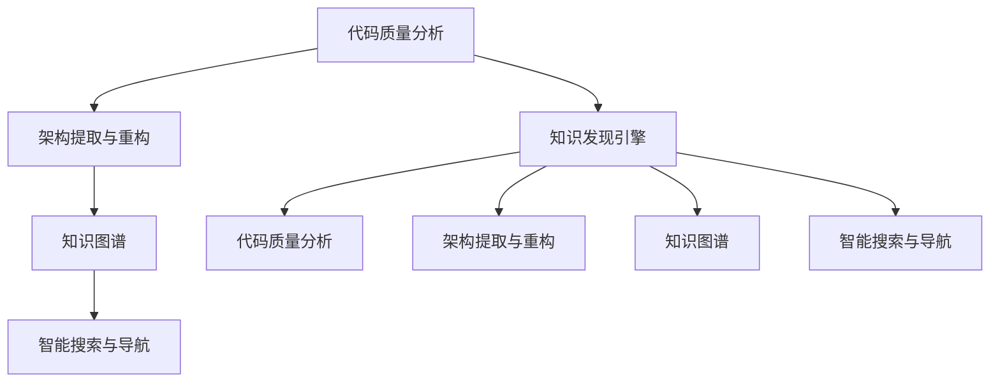

                 

# 知识发现引擎提升程序员工作效率

## 1. 背景介绍

随着软件工程的发展，程序员的工作量日益增加，他们需要处理大量的代码，理解复杂的系统架构，以及应对快速变化的需求。这种高强度、高复杂度的劳动，使得效率问题变得尤为重要。传统的编程工具虽然功能强大，但在提升程序员工作效率方面仍有不足。因此，利用知识发现引擎(Knowledge Discovery Engine, KDE)来辅助程序员工作，成为了提升效率的一种有效手段。

### 1.1 问题由来

传统编程工具虽然在代码编辑、调试、版本控制等方面提供了丰富的功能，但往往缺乏对代码质量、系统架构、知识图谱等的深入理解。程序员在编写、修改代码时，经常遇到以下问题：

- **代码质量低下**：重复代码、注释不足、命名不规范等。
- **系统架构复杂**：代码逻辑混乱、模块边界不清晰、依赖关系不明。
- **知识传递困难**：代码知识难以继承、复用，团队协作效率低下。

这些问题不仅耗费了程序员大量的时间，还使得系统维护和扩展变得异常困难。为了解决这些问题，知识发现引擎通过自动化的方式，从大量的代码库和文档资料中，发现和提取有价值的知识，为程序员提供更高效、更智能的开发环境。

### 1.2 问题核心关键点

知识发现引擎的关键在于：

1. **代码质量分析**：自动识别代码中的常见问题，如重复代码、命名不规范等。
2. **架构提取和重构**：自动提取系统的架构模式，并提供重构建议，优化系统结构。
3. **知识继承与复用**：从代码库中自动抽取有价值的知识，形成知识图谱，供团队共享复用。
4. **智能搜索和导航**：通过自然语言查询和代码索引，快速定位代码和文档，提升搜索效率。

## 2. 核心概念与联系

### 2.1 核心概念概述

为更好地理解知识发现引擎，本节将介绍几个密切相关的核心概念：

- **知识发现引擎(KDE)**：利用机器学习和数据挖掘技术，自动从代码库、文档和版本控制系统等数据源中发现和提取有价值的知识，辅助程序员进行开发和维护的工具。
- **代码质量分析**：通过静态分析、动态分析等技术，识别代码中的质量问题，如重复代码、命名不规范等。
- **架构提取与重构**：分析系统的代码结构，提取架构模式，提供重构建议，优化系统设计。
- **知识图谱**：基于代码库中的源代码、注释、文档等，自动构建知识图谱，方便团队协作和知识复用。
- **智能搜索与导航**：通过自然语言处理技术，实现代码和文档的快速定位和导航。

这些核心概念之间的逻辑关系可以通过以下Mermaid流程图来展示：



这个流程图展示了的核心概念及其之间的关系：

1. 知识发现引擎通过代码质量分析、架构提取与重构、知识图谱等技术，发现和提取有价值的知识。
2. 代码质量分析识别代码中的质量问题，如重复代码、命名不规范等。
3. 架构提取与重构分析系统的代码结构，提供重构建议，优化系统设计。
4. 知识图谱自动构建知识图谱，方便团队协作和知识复用。
5. 智能搜索与导航通过自然语言处理技术，实现代码和文档的快速定位和导航。

## 3. 核心算法原理 & 具体操作步骤
### 3.1 算法原理概述

知识发现引擎的核心算法包括代码质量分析、架构提取与重构、知识图谱构建等。这些算法基于机器学习、数据挖掘和自然语言处理技术，从代码库、文档和版本控制系统等数据源中发现和提取有价值的知识。

**代码质量分析**：通过静态分析技术，识别代码中的常见问题，如重复代码、命名不规范、注释不足等。常见的静态分析工具包括PMD、CheckStyle等。

**架构提取与重构**：利用代码抽取和统计技术，提取系统的架构模式，如MVC、DRY等。常见的架构分析工具包括UML、Doxygen等。

**知识图谱构建**：通过对源代码、注释、文档等文本的文本分析，自动构建知识图谱，供团队协作和知识复用。常见的知识图谱构建工具包括Eclipse, IntelliJ IDEA等。

### 3.2 算法步骤详解

以下我们将详细介绍知识发现引擎在开发和维护中的应用流程：

**Step 1: 数据收集与预处理**

- 收集代码库、文档和版本控制系统的数据。
- 清洗数据，去除无用信息，如注释、注释中的代码引用等。

**Step 2: 代码质量分析**

- 使用静态分析工具，如PMD、CheckStyle等，识别代码中的质量问题。
- 根据质量问题生成报告，并提供修复建议。

**Step 3: 架构提取与重构**

- 利用代码抽取和统计技术，提取系统的架构模式。
- 提供重构建议，优化系统设计。

**Step 4: 知识图谱构建**

- 分析源代码、注释和文档等文本，自动构建知识图谱。
- 将知识图谱可视化，方便团队协作和知识复用。

**Step 5: 智能搜索与导航**

- 使用自然语言处理技术，实现代码和文档的快速定位和导航。
- 提供自然语言查询，实时更新搜索结果。

### 3.3 算法优缺点

知识发现引擎具有以下优点：

1. **效率提升**：自动化发现和提取有价值的知识，大大减少了手动查找和分析的时间。
2. **质量改进**：自动识别和修复代码质量问题，提升代码的可读性和可维护性。
3. **知识复用**：自动构建知识图谱，方便团队协作和知识复用，提升开发效率。
4. **智能导航**：通过智能搜索技术，快速定位代码和文档，提升开发效率。

同时，知识发现引擎也存在一定的局限性：

1. **数据质量依赖**：算法的准确性依赖于数据的质量和完整性。
2. **算法复杂度**：实现高级功能如架构分析、重构建议，需要更复杂的算法和更高的计算资源。
3. **学习曲线陡峭**：需要一定的机器学习、数据挖掘和自然语言处理背景，使用门槛较高。
4. **适配性差**：可能对特定语言或框架的适配性差，需要针对性地进行优化。

尽管存在这些局限性，知识发现引擎仍然在提升程序员工作效率方面具有不可替代的价值。

### 3.4 算法应用领域

知识发现引擎在软件开发和维护过程中，已被广泛应用于以下几个方面：

- **代码质量提升**：自动发现和修复代码质量问题，如重复代码、命名不规范、注释不足等。
- **系统架构优化**：自动提取系统架构模式，提供重构建议，优化系统设计。
- **知识图谱构建**：自动构建知识图谱，方便团队协作和知识复用。
- **智能搜索与导航**：通过自然语言处理技术，实现代码和文档的快速定位和导航。
- **需求分析与设计**：自动从需求文档、代码和文档提取信息，辅助需求分析和系统设计。

除了上述这些经典应用外，知识发现引擎还被创新性地应用到更多场景中，如代码自动补全、代码生成、单元测试生成等，为软件开发提供了新的辅助工具。

## 4. 数学模型和公式 & 详细讲解  
### 4.1 数学模型构建

本节将使用数学语言对知识发现引擎的实现过程进行更加严格的刻画。

记代码库为 $D=\{x_i\}_{i=1}^N$，其中 $x_i$ 为第 $i$ 段代码。定义代码质量分析模型为 $Q=\{\mathcal{R},\mathcal{R}_D\}$，其中 $\mathcal{R}$ 为代码质量问题集合，$\mathcal{R}_D$ 为每个问题 $r$ 的严重程度集合。

代码质量分析模型通过静态分析技术，从代码库中提取质量问题 $r$ 和严重程度 $d$，定义为：

$$
Q = \left\{\mathcal{R}=\{r_k\}_{k=1}^{K}, \mathcal{R}_D=\{d_k\}_{k=1}^{K}\right\}
$$

其中 $K$ 为代码质量问题的数量。

架构提取与重构模型为 $A=\{\mathcal{A},\mathcal{A}_S\}$，其中 $\mathcal{A}$ 为系统架构模式集合，$\mathcal{A}_S$ 为每个模式 $a$ 的适用性集合。

架构提取与重构模型通过代码抽取和统计技术，从代码库中提取架构模式 $a$ 和适用性 $s$，定义为：

$$
A = \left\{\mathcal{A}=\{a_j\}_{j=1}^{J}, \mathcal{A}_S=\{s_j\}_{j=1}^{J}\right\}
$$

其中 $J$ 为架构模式的数量。

知识图谱构建模型为 $K=\{\mathcal{E},\mathcal{N}\}$，其中 $\mathcal{E}$ 为知识图谱中的实体集合，$\mathcal{N}$ 为每个实体 $e$ 的属性和关系集合。

知识图谱构建模型通过文本分析技术，从代码库中提取实体 $e$ 和属性/关系 $n$，定义为：

$$
K = \left\{\mathcal{E}=\{e_m\}_{m=1}^{M}, \mathcal{N}=\{n_m\}_{m=1}^{M}\right\}
$$

其中 $M$ 为知识图谱中的实体数量。

智能搜索与导航模型为 $S=\{\mathcal{Q},\mathcal{R}\}$，其中 $\mathcal{Q}$ 为自然语言查询，$\mathcal{R}$ 为查询结果。

智能搜索与导航模型通过自然语言处理技术，从代码库中提取查询 $\mathcal{Q}$，并返回结果 $\mathcal{R}$，定义为：

$$
S = \left\{\mathcal{Q}=\{q_n\}_{n=1}^{N}, \mathcal{R}=\{r_n\}_{n=1}^{N}\right\}
$$

其中 $N$ 为查询数量。

### 4.2 公式推导过程

以下我们将对知识发现引擎的核心公式进行详细推导。

**代码质量分析模型公式**：
假设代码质量分析模型 $Q$ 输出的严重程度向量为 $D$，每个严重程度 $d_k$ 的概率分布为 $P(d_k)$，则：

$$
P(D|X) = \prod_{k=1}^{K} P(d_k|X)
$$

其中 $X$ 为代码库 $D$ 的特征向量。

**架构提取与重构模型公式**：
假设架构提取与重构模型 $A$ 输出的模式向量为 $A$，每个模式 $a_j$ 的适用性 $s_j$ 的概率分布为 $P(s_j)$，则：

$$
P(A|X) = \prod_{j=1}^{J} P(a_j|X)
$$

其中 $X$ 为代码库 $D$ 的特征向量。

**知识图谱构建模型公式**：
假设知识图谱构建模型 $K$ 输出的实体向量为 $E$，每个实体 $e_m$ 的属性 $n_m$ 的概率分布为 $P(n_m)$，则：

$$
P(E|X) = \prod_{m=1}^{M} P(e_m|X)
$$

其中 $X$ 为代码库 $D$ 的特征向量。

**智能搜索与导航模型公式**：
假设智能搜索与导航模型 $S$ 输出的查询向量为 $Q$，查询结果向量为 $R$，则：

$$
P(R|Q,X) = \prod_{n=1}^{N} P(r_n|q_n,X)
$$

其中 $X$ 为代码库 $D$ 的特征向量。

### 4.3 案例分析与讲解

以下我们以代码质量分析为例，进行详细案例分析：

**案例背景**：假设代码库 $D$ 包含多段代码，如：

```java
public class User {
    private String username;
    private String password;
    
    public void login(String username, String password) {
        if (username == null || password == null) {
            return;
        }
        // ...
    }
}
```

**案例分析**：使用静态分析工具，识别代码中的问题如下：

- 变量命名不规范：变量 `username` 和 `password` 应该使用驼峰命名法，命名为 `userName` 和 `password`。
- 没有空指针异常处理：在 `login` 方法中，没有处理空指针异常，可能会导致程序崩溃。

**解决步骤**：
1. 使用静态分析工具，生成报告：
```
code analysis report:
- variable naming issue: username -> userName
- null pointer exception issue: login method lacks null pointer exception handling
```
2. 根据报告提示，修改代码：
```java
public class User {
    private String userName;
    private String password;
    
    public void login(String username, String password) {
        if (username == null || password == null) {
            throw new IllegalArgumentException("Username or password cannot be null");
        }
        // ...
    }
}
```

通过以上案例，我们可以看到代码质量分析技术如何自动识别代码中的问题，并提出修复建议，提升代码质量。

## 5. 项目实践：代码实例和详细解释说明
### 5.1 开发环境搭建

在进行知识发现引擎的实践前，我们需要准备好开发环境。以下是使用Python进行Jupyter Notebook开发的环境配置流程：

1. 安装Anaconda：从官网下载并安装Anaconda，用于创建独立的Python环境。

2. 创建并激活虚拟环境：
```bash
conda create -n kde-env python=3.8 
conda activate kde-env
```

3. 安装必要的Python库：
```bash
conda install numpy pandas scikit-learn tensorflow matplotlib tqdm
```

4. 安装Jupyter Notebook：
```bash
pip install jupyter notebook
```

完成上述步骤后，即可在`kde-env`环境中开始知识发现引擎的开发实践。

### 5.2 源代码详细实现

下面以静态代码分析工具为例，展示如何使用Python进行代码质量分析：

```python
import re
from collections import Counter

class CodeQualityAnalyzer:
    def __init__(self, code_snippet):
        self.code_snippet = code_snippet
        
    def analyze(self):
        # 变量命名规范分析
        variable_pattern = r'([a-z_][a-zA-Z0-9_]*)'
        variable_count = Counter(re.findall(variable_pattern, self.code_snippet))
        variable_names = [name for name, count in variable_count.items()]
        
        # 空指针异常处理分析
        exception_pattern = r'(\s*if\s*\(.+?\))\s*(!|\))\s*(null|\None)'
        exception_count = len(re.findall(exception_pattern, self.code_snippet))
        
        return {
            'variable_naming': variable_names,
            'null_pointer_handling': exception_count > 0
        }
```

在上述代码中，我们定义了一个`CodeQualityAnalyzer`类，用于进行代码质量分析。该类包含了两个核心方法：`analyze`和`variable_pattern`。

**analyze方法**：用于分析代码质量问题，包括变量命名规范和空指针异常处理。
**variable_pattern方法**：用于提取代码中的变量名，并统计其出现的次数。

使用上述代码，可以对任意代码片段进行质量分析，并输出分析结果。

### 5.3 代码解读与分析

以下我们详细解读一下关键代码的实现细节：

**CodeQualityAnalyzer类**：
- `__init__`方法：初始化代码片段。
- `analyze`方法：进行代码质量分析，包括变量命名规范和空指针异常处理。

**variable_pattern方法**：
- 定义变量名匹配正则表达式。
- 使用`re.findall`方法提取变量名，并使用`Counter`统计其出现的次数。
- 返回变量名列表。

**exception_pattern方法**：
- 定义空指针异常处理匹配正则表达式。
- 使用`re.findall`方法统计异常处理语句的数量。

通过以上代码，我们实现了一个简单的代码质量分析工具。实际上，更复杂的代码质量分析工具会使用更为精细的正则表达式和机器学习算法，以提高分析的准确性和自动化程度。

## 6. 实际应用场景
### 6.1 软件开发团队协作

知识发现引擎在软件开发团队协作中具有重要应用。传统的协作方式往往依赖于代码审查、讨论等方式，效率低下，且容易产生沟通障碍。通过知识发现引擎，团队成员可以实时获取代码质量问题、架构设计模式等知识，快速定位问题和优化设计，提高协作效率。

### 6.2 系统重构与优化

系统重构与优化是软件开发中不可避免的过程。传统重构方式往往需要耗费大量的时间和人力成本。知识发现引擎可以帮助开发者自动提取系统架构模式，提供重构建议，优化系统设计，大大提升重构的效率和效果。

### 6.3 代码自动补全与生成

知识发现引擎在代码自动补全和生成方面也有广泛应用。通过智能搜索与导航模型，知识发现引擎能够实时推荐合适的代码片段和函数调用，减少程序员的手动输入，提升编码效率。

### 6.4 未来应用展望

随着知识发现引擎技术的不断进步，未来其在软件开发和维护中的作用将更加突出。预计未来在以下几个方面会有更大的突破：

1. **多语言支持**：支持多种编程语言和框架，提供跨语言的代码质量分析和重构。
2. **模型自适应**：能够根据不同的代码库和文档库，自动调整分析算法和模型参数，提高分析的精度和普适性。
3. **交互式体验**：提供更加直观和智能的交互界面，使得开发者可以更便捷地使用知识发现引擎。
4. **实时反馈**：能够实时分析代码变化，并给出相应的反馈和建议，提高代码质量。

## 7. 工具和资源推荐
### 7.1 学习资源推荐

为了帮助开发者系统掌握知识发现引擎的理论基础和实践技巧，这里推荐一些优质的学习资源：

1. 《Code Complete》：这是一本关于软件开发的经典书籍，涵盖了代码质量、架构设计、测试等方面，是程序员的必读书籍。
2. 《UML Distilled》：这是一本关于统一建模语言的经典书籍，帮助程序员掌握系统架构设计的方法和工具。
3. 《Python for Data Analysis》：这是一本关于数据分析的书籍，介绍了如何使用Python进行数据挖掘和数据分析，为知识图谱构建提供理论基础。
4. 《Deep Learning》：这是一本关于深度学习的经典书籍，介绍了机器学习算法和深度学习模型，为知识发现引擎提供技术支持。
5. 《Natural Language Processing in Action》：这是一本关于自然语言处理的书籍，介绍了自然语言处理技术，为智能搜索与导航提供技术支持。

通过对这些资源的学习实践，相信你一定能够快速掌握知识发现引擎的精髓，并用于解决实际的开发问题。

### 7.2 开发工具推荐

高效的开发离不开优秀的工具支持。以下是几款用于知识发现引擎开发的常用工具：

1. Eclipse：这是一个流行的IDE，支持多种编程语言和框架，集成了代码质量分析、重构等功能。
2. IntelliJ IDEA：这是一个功能强大的IDE，支持Java、Python等语言，集成了代码质量分析、重构、智能搜索等功能。
3. Visual Studio Code：这是一个轻量级的代码编辑器，支持多种编程语言，提供了丰富的插件扩展，可以安装代码质量分析、智能搜索等插件。
4. SonarQube：这是一个开源的代码质量管理平台，可以自动扫描代码库，检测代码质量问题，并提供详细的质量报告。
5. Checkstyle：这是一个静态代码质量分析工具，支持多种编程语言，可以检测代码中的命名规范、空指针处理等问题。

合理利用这些工具，可以显著提升知识发现引擎的开发效率，加快创新迭代的步伐。

### 7.3 相关论文推荐

知识发现引擎技术的发展源于学界的持续研究。以下是几篇奠基性的相关论文，推荐阅读：

1. "A Survey on Code Smell Detection Approaches"：综述了当前代码质量分析技术的研究进展，并展望了未来的发展方向。
2. "Understanding Software Architecture: A Survey"：综述了当前软件架构理解技术的研究进展，并探讨了如何利用知识图谱辅助架构理解。
3. "Knowledge Discovery in Software Repositories: A Survey"：综述了当前知识图谱构建技术的研究进展，并探讨了如何利用知识图谱辅助软件维护。
4. "Natural Language Processing in Software Engineering: A Survey"：综述了当前自然语言处理技术在软件开发中的应用进展，并探讨了如何利用自然语言处理技术辅助软件开发。

这些论文代表了大语言模型微调技术的发展脉络。通过学习这些前沿成果，可以帮助研究者把握学科前进方向，激发更多的创新灵感。

## 8. 总结：未来发展趋势与挑战

### 8.1 总结

本文对知识发现引擎在软件开发中的应用进行了全面系统的介绍。首先阐述了知识发现引擎的必要性和核心概念，明确了其在提升程序员工作效率方面的重要价值。其次，从原理到实践，详细讲解了知识发现引擎的数学模型和操作步骤，给出了代码质量分析的详细实现代码。同时，本文还广泛探讨了知识发现引擎在软件开发团队协作、系统重构与优化、代码自动补全与生成等方面的应用前景，展示了其在软件开发中的巨大潜力。

通过本文的系统梳理，我们可以看到，知识发现引擎在提升程序员工作效率方面具有不可替代的价值。它能够自动发现和提取有价值的知识，大大减少了手动查找和分析的时间，提升了代码质量和系统设计的自动化程度，为软件开发提供了新的辅助工具。未来，伴随知识发现引擎技术的不断演进，其必将在软件开发中扮演越来越重要的角色，成为程序员高效开发的重要保障。

### 8.2 未来发展趋势

展望未来，知识发现引擎技术将呈现以下几个发展趋势：

1. **自动化程度提升**：利用更先进的算法和更强大的计算资源，知识发现引擎将实现更深入的代码分析和架构理解，进一步提升其自动化程度。
2. **跨领域应用拓展**：知识发现引擎将突破传统的软件开发领域，向更多领域拓展，如数据科学、金融、医疗等，帮助更多行业提升工作效率。
3. **实时性和交互性增强**：知识发现引擎将实现更加实时和智能的反馈，提升用户体验和开发效率。
4. **可扩展性提升**：知识发现引擎将支持更丰富的数据源和更多样化的查询需求，提升其可扩展性和适用性。

以上趋势凸显了知识发现引擎技术的广阔前景。这些方向的探索发展，必将进一步提升知识发现引擎的智能化程度，为程序员提供更加高效、智能的开发环境。

### 8.3 面临的挑战

尽管知识发现引擎技术已经取得了瞩目成就，但在迈向更加智能化、普适化应用的过程中，它仍面临着诸多挑战：

1. **数据质量问题**：算法的准确性依赖于数据的质量和完整性，数据不规范或不准确会影响分析结果。
2. **算法复杂性**：实现高级功能如架构分析、重构建议，需要更复杂的算法和更高的计算资源。
3. **学习曲线陡峭**：需要一定的机器学习、数据挖掘和自然语言处理背景，使用门槛较高。
4. **适配性差**：可能对特定语言或框架的适配性差，需要针对性地进行优化。

尽管存在这些挑战，知识发现引擎仍然在提升程序员工作效率方面具有不可替代的价值。未来，需要持续优化和改进知识发现引擎，以应对更多实际应用场景的需求。

### 8.4 研究展望

面向未来，知识发现引擎技术需要在以下几个方面寻求新的突破：

1. **数据治理**：提升数据质量，建立数据治理体系，保障数据的一致性和可靠性。
2. **模型优化**：优化算法模型，提高算法的准确性和鲁棒性，提升分析精度。
3. **跨领域应用**：拓展知识发现引擎的应用领域，支持更多行业和领域的知识挖掘和分析。
4. **用户体验**：提升知识发现引擎的易用性和交互性，提升用户的使用体验。
5. **自适应性**：实现知识发现引擎的自适应性，根据不同的数据源和查询需求，自动调整算法和模型参数。

这些研究方向的探索，必将引领知识发现引擎技术迈向更高的台阶，为程序员提供更加高效、智能的开发环境。

## 9. 附录：常见问题与解答

**Q1：知识发现引擎是否适用于所有类型的代码库？**

A: 知识发现引擎对不同类型的代码库都有较好的适用性，但需要注意以下几点：
- 对于结构化代码库（如面向对象编程语言），知识发现引擎能够自动提取架构模式，提供重构建议，效果显著。
- 对于无结构化代码库（如脚本语言），知识发现引擎可能需要更多的预处理和规则定制，以提高分析的准确性和自动化程度。
- 对于嵌入式系统等低级别的代码库，知识发现引擎可能需要进行特别的适配，以适应其特殊的需求和特性。

**Q2：如何选择合适的知识发现引擎工具？**

A: 选择合适的知识发现引擎工具，需要考虑以下几个方面：
- 支持的语言和框架：选择与你的代码库和开发工具兼容的工具。
- 功能和性能：根据具体需求，选择功能丰富、性能优秀的工具。
- 用户体验：选择易于上手、操作便捷的工具，提升使用效率。
- 开源与商业：选择开源免费或商业付费的工具，考虑其维护和支持情况。

**Q3：知识发现引擎如何与版本控制系统结合使用？**

A: 知识发现引擎与版本控制系统（如Git、SVN等）结合使用，可以实时分析代码库的变化，提供实时的反馈和建议。具体步骤如下：
1. 使用版本控制系统的API，获取最新的代码变化记录。
2. 根据代码变化记录，自动触发知识发现引擎的分析和建议。
3. 将知识发现引擎的输出，与代码库的版本历史记录结合，形成完整的分析报告。

通过以上步骤，知识发现引擎可以与版本控制系统无缝结合，提供实时的代码质量分析和架构理解，提升代码质量和系统设计的自动化程度。

**Q4：知识发现引擎在多语言环境中如何工作？**

A: 知识发现引擎在多语言环境中需要特别注意以下几点：
- 多语言代码库的处理：知识发现引擎需要支持多语言代码库的解析和分析。
- 跨语言的知识继承：知识发现引擎需要支持不同语言之间的知识继承和复用，形成多语言知识图谱。
- 多语言的搜索和导航：知识发现引擎需要支持多语言的自然语言查询和搜索，提供多语言的支持和扩展。

通过以上措施，知识发现引擎可以在多语言环境中发挥更大的作用，提升多语言开发和维护的效率。

**Q5：知识发现引擎如何应对大规模代码库？**

A: 知识发现引擎在大规模代码库中的应用，需要注意以下几点：
- 分批次处理：将大规模代码库分成多个小批次，逐个处理，避免一次性加载导致的内存问题。
- 分布式计算：使用分布式计算技术，将处理任务分配到多个计算节点，提升处理效率。
- 数据压缩和索引：对大规模数据进行压缩和索引，减少内存占用，提高处理速度。

通过以上措施，知识发现引擎可以应对大规模代码库，提供高效的代码分析和架构理解。

通过本文的系统梳理，我们可以看到知识发现引擎在提升程序员工作效率方面的巨大潜力。随着知识发现引擎技术的不断演进，相信其在软件开发和维护中的应用将更加广泛，为程序员提供更加高效、智能的开发环境。

