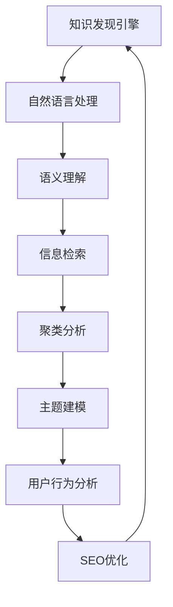

                 

# 知识发现引擎的SEO优化策略

> 关键词：知识发现引擎, 自然语言处理(NLP), 搜索引擎优化(SEO), 信息检索, 语义理解, 主题建模, 聚类分析, 用户行为分析

## 1. 背景介绍

### 1.1 问题由来

随着互联网的迅猛发展和用户信息的爆炸式增长，信息检索系统的效率和准确性面临着前所未有的挑战。传统的关键词匹配方法已无法满足用户快速、精准获取信息的需求，特别是在知识型搜索场景中，用户往往希望了解与某主题相关的深度知识。

知识发现引擎(Knowledge Discovery Engine, KDE)作为新一代信息检索系统，能够从海量文本中抽取主题、实体、关系等知识，并生成结构化信息，为用户的深度查询需求提供了有力支持。然而，由于知识发现引擎的系统架构复杂、涉及的知识类型多样，其在用户搜索体验和系统性能方面存在瓶颈。

### 1.2 问题核心关键点

知识发现引擎在SEO优化中，主要面临以下几个核心挑战：

- **搜索体验优化**：如何在搜索结果中高效展现知识发现引擎提取的主题、实体和关系等信息，提升用户发现知识的效率和满意度。
- **系统性能提升**：知识发现引擎的计算复杂度高，如何高效索引和查询知识库，提升系统的响应速度和可扩展性。
- **结果排序策略**：如何对搜索结果进行排序，使其更加贴近用户的搜索意图，优先展示最有用的知识内容。
- **跨语言知识集成**：知识发现引擎通常需要处理多语言文本，如何集成不同语言的知识，并保证跨语言搜索结果的一致性。
- **个性化推荐**：如何根据用户的历史行为、兴趣偏好等个性化因素，定制化推荐知识发现引擎的结果。

通过合理优化知识发现引擎的SEO策略，可以有效提升系统的搜索体验、性能和用户满意度，使其能够更好地服务于用户的知识发现需求。

### 1.3 问题研究意义

知识发现引擎的SEO优化研究具有重要的理论和实践意义：

- **提升搜索体验**：通过合理展示知识发现引擎提取的知识，帮助用户更快速、准确地获取所需信息，提高用户的搜索满意度。
- **提升系统性能**：优化知识发现引擎的索引和查询策略，提高系统的响应速度和处理能力，提升用户体验和系统可扩展性。
- **促进知识共享**：通过优化搜索结果的排序和推荐策略，使知识发现引擎成为知识共享和传播的重要平台，促进知识的广泛应用和传播。

## 2. 核心概念与联系

### 2.1 核心概念概述

为更好地理解知识发现引擎的SEO优化策略，本节将介绍几个关键概念及其相互联系：

- **知识发现引擎(KDE)**：能够从大规模文本数据中抽取主题、实体、关系等知识，并将这些知识组织为结构化信息，支持用户的深度查询需求。
- **自然语言处理(NLP)**：通过文本处理和语言理解技术，提取文本中的语义信息，为知识发现引擎提供高质量的输入。
- **搜索引擎优化(SEO)**：通过改进搜索引擎的检索和展示策略，提升搜索结果的相关性和用户体验。
- **信息检索**：从大规模数据集合中查找与用户查询相关的信息，是知识发现引擎的重要功能。
- **语义理解**：通过理解文本的语义，将文本转化为知识模型，为知识发现引擎提供语义导向的检索和展示功能。
- **主题建模**：通过分析文本主题分布，识别文本中的核心主题，为知识发现引擎提供主题导向的知识抽取。
- **聚类分析**：通过将文本根据语义相似性进行分组，识别文本的聚类结构，为知识发现引擎提供文本群组的分类信息。
- **用户行为分析**：通过分析用户的历史行为、兴趣偏好等，定制化推荐搜索结果，提升用户的查询体验。

这些核心概念通过以下Mermaid流程图展示了它们之间的联系：



这个流程图展示了知识发现引擎的核心概念及其相互关系：

1. 知识发现引擎通过自然语言处理获取文本输入。
2. 自然语言处理包括语义理解和信息检索，帮助引擎抽取和组织文本知识。
3. 聚类分析和主题建模对文本进行分类和主题分析，进一步提炼核心知识。
4. 用户行为分析识别用户兴趣，定制化推荐知识结果。
5. SEO优化对搜索结果进行展示和排序，提升搜索体验。
6. 最终，优化后的知识发现引擎向用户展示更精准、相关的搜索结果。

## 3. 核心算法原理 & 具体操作步骤
### 3.1 算法原理概述

知识发现引擎的SEO优化策略主要围绕以下几个核心算法展开：

- **语义理解算法**：通过词向量模型和句子向量模型，将文本转换为向量表示，理解文本的语义结构。
- **主题建模算法**：利用LDA、LDA2Vec等主题建模算法，识别文本的核心主题，帮助抽取相关知识。
- **聚类分析算法**：使用K-means、DBSCAN等聚类算法，将文本按语义相似性分组，识别文本的群组结构。
- **个性化推荐算法**：通过协同过滤、内容推荐、混合推荐等算法，根据用户行为定制化推荐知识结果。
- **信息检索算法**：包括倒排索引、TF-IDF等，高效索引和查询知识库，提升系统性能。

这些算法通过优化搜索策略、展示方式和推荐逻辑，提升知识发现引擎的搜索体验和系统性能。

### 3.2 算法步骤详解

知识发现引擎的SEO优化主要包括以下几个关键步骤：

**Step 1: 数据预处理和特征提取**

1. 对文本数据进行清洗和预处理，去除噪音、停用词等，提取有意义的特征。
2. 使用词向量模型（如Word2Vec、GloVe）将文本转换为向量表示。
3. 计算句子向量，捕捉句子间的语义关系。

**Step 2: 语义理解**

1. 对文本向量进行语义理解，识别文本中的实体、关系和主题。
2. 使用NER（命名实体识别）、CRF（条件随机场）等算法，识别实体和关系。
3. 利用主题建模算法（如LDA、LDA2Vec）识别文本中的核心主题。

**Step 3: 聚类分析**

1. 使用聚类算法（如K-means、DBSCAN）对文本按语义相似性分组，识别文本的群组结构。
2. 计算群组之间的距离，评估文本的相似度。

**Step 4: 个性化推荐**

1. 分析用户的历史行为和兴趣偏好，构建用户画像。
2. 使用协同过滤、内容推荐等算法，生成个性化推荐结果。
3. 根据用户画像和推荐结果，调整搜索结果的展示和排序。

**Step 5: 搜索引擎优化**

1. 优化搜索结果的展示方式，包括摘要、预览、图片等。
2. 优化搜索结果的排序策略，如基于相关性、主题、用户行为等。
3. 引入实时索引和动态更新机制，提高搜索结果的时效性。

### 3.3 算法优缺点

知识发现引擎的SEO优化算法具有以下优点：

- **高效性**：通过优化搜索和推荐策略，提高系统响应速度和处理能力。
- **个性化**：根据用户行为和兴趣偏好，定制化推荐搜索结果，提升用户体验。
- **相关性**：通过语义理解和主题建模，提高搜索结果的相关性和准确性。
- **可扩展性**：聚类分析和主题建模算法能够处理大规模数据，提升系统的可扩展性。

同时，这些算法也存在一些局限性：

- **计算复杂度高**：语义理解和主题建模等算法计算复杂，对计算资源要求较高。
- **数据依赖性强**：搜索结果的质量高度依赖于输入数据的质量和多样性。
- **用户画像偏差**：用户画像的构建可能存在偏差，影响个性化推荐的准确性。
- **跨语言挑战**：跨语言知识集成和展示需要处理语言差异和文化差异，复杂度较高。

### 3.4 算法应用领域

知识发现引擎的SEO优化算法在以下几个领域得到了广泛应用：

- **学术搜索**：为学术研究人员提供深度搜索和知识发现功能，帮助他们获取最新研究论文和数据。
- **企业知识管理**：通过SEO优化，帮助企业整理和呈现内部知识资产，提升知识共享和利用效率。
- **社交媒体分析**：在社交媒体平台上进行信息检索和知识发现，识别热点话题和趋势。
- **在线教育平台**：通过SEO优化，提升课程推荐和搜索结果的精准度，提升学习体验。
- **电子商务**：为电商平台提供商品推荐和搜索优化，提升用户体验和销售转化率。

这些领域的应用展示了知识发现引擎的SEO优化算法的强大功能和广泛适用性。

## 4. 数学模型和公式 & 详细讲解 & 举例说明
### 4.1 数学模型构建

知识发现引擎的SEO优化主要涉及以下几个数学模型：

- **文本向量化模型**：将文本转换为向量表示，捕捉文本的语义信息。常用的模型包括Word2Vec、GloVe、BERT等。
- **句子向量模型**：通过上下文信息计算句子向量，捕捉句子间的语义关系。常用的模型包括Doc2Vec、BERT等。
- **主题建模模型**：利用LDA、LDA2Vec等主题建模算法，识别文本的核心主题。
- **聚类分析模型**：使用K-means、DBSCAN等聚类算法，识别文本的群组结构。
- **个性化推荐模型**：包括协同过滤、内容推荐等算法，构建个性化推荐结果。

### 4.2 公式推导过程

以下以LDA主题建模和协同过滤推荐算法为例，推导相关公式。

**LDA主题建模**

LDA（Latent Dirichlet Allocation）是一种广泛用于主题建模的统计模型。假设文本集合$\mathcal{D}$中的每篇文档$d$包含$m$个单词，共生成$K$个主题。设$\theta$为文档主题分布，$\phi$为单词主题分布，$\beta$为主题单词分布。则LDA模型可以表示为：

$$
P(d|\theta,\phi,\beta) = \prod_{i=1}^m \sum_{k=1}^K \theta_k P(z_k|\theta)\prod_{i=1}^m P(w_i|z_k,\beta)
$$

其中$z_k$为文档中的第$k$个主题，$w_i$为文档中的第$i$个单词。

**协同过滤推荐**

协同过滤是一种常用的个性化推荐算法，基于用户-物品评分矩阵$R$和用户画像$u$，生成个性化推荐结果$I_u$。设$R_{iu}$为用户$u$对物品$i$的评分，$A_u$为用户$u$的评分权重向量，$B_i$为物品$i$的属性向量，则协同过滤推荐公式为：

$$
I_u = \arg\max_{I} \sum_{i\in I}(R_{iu}A_u^\top \cdot B_i)
$$

以上公式展示了LDA和协同过滤的数学模型和推导过程，展示了这些算法的基本原理和计算方法。

### 4.3 案例分析与讲解

以学术搜索系统为例，分析SEO优化的具体应用。

**案例背景**

学术搜索系统旨在帮助研究人员快速获取相关论文和数据。传统的学术搜索系统主要依赖关键词匹配，难以满足用户对深度知识的需求。通过优化搜索结果的展示和排序，知识发现引擎能够提供更精准、深入的知识检索和推荐。

**SEO优化措施**

1. **摘要展示**：在搜索结果中展示文章的摘要，快速捕捉用户关注点。

2. **相关性排序**：根据文章的引用次数、下载次数、发表时间等指标，对搜索结果进行排序，优先展示相关性更高的文章。

3. **主题展示**：利用主题建模算法，识别文章的核心主题，将主题相近的文章进行展示，帮助用户深入探索相关主题。

4. **个性化推荐**：分析用户的历史行为，生成个性化推荐列表，提高用户发现知识的效率。

**优化效果**

通过上述优化措施，学术搜索系统的搜索体验和性能显著提升，用户满意度大大提高。系统不仅能够快速获取相关论文，还能深入了解某个主题的研究动态和重要成果。

## 5. 项目实践：代码实例和详细解释说明
### 5.1 开发环境搭建

在进行SEO优化实践前，我们需要准备好开发环境。以下是使用Python进行PyTorch开发的环境配置流程：

1. 安装Anaconda：从官网下载并安装Anaconda，用于创建独立的Python环境。

2. 创建并激活虚拟环境：
```bash
conda create -n pytorch-env python=3.8 
conda activate pytorch-env
```

3. 安装PyTorch：根据CUDA版本，从官网获取对应的安装命令。例如：
```bash
conda install pytorch torchvision torchaudio cudatoolkit=11.1 -c pytorch -c conda-forge
```

4. 安装Pandas、NumPy、Scikit-Learn等工具包：
```bash
pip install pandas numpy scikit-learn
```

5. 安装相关的NLP工具包：
```bash
pip install spacy gensim pyLDAvis
```

完成上述步骤后，即可在`pytorch-env`环境中开始SEO优化实践。

### 5.2 源代码详细实现

这里我们以学术搜索系统的SEO优化为例，给出使用PyTorch和Spacy库进行代码实现。

首先，定义学术搜索系统中的文本数据：

```python
from spacy.load import load

nlp = load('en_core_web_lg')
documents = [doc.text for doc in nlp.pipe('huggingfacewikif,data-science')]
```

然后，使用Spacy库进行分词和向量化：

```python
from spacy.transform import GenericExtractor
from spacy.serde import load_from_disk

extractor = GenericExtractor.from_disk('en_core_web_lg', 'default')
vectors = extractor(documents)
```

接着，使用LDA算法进行主题建模：

```python
from gensim import corpora, models
from gensim.models.ldamodel import LdaModel

# 构建文档-单词矩阵
dictionary = corpora.Dictionary(documents)
corpus = [dictionary.doc2bow(doc) for doc in documents]
lda_model = LdaModel(corpus=corpus, id2word=dictionary, num_topics=10, passes=10)

# 获取主题-单词分布
topic_word = lda_model.show_topic(10)
```

最后，使用协同过滤算法进行个性化推荐：

```python
from sklearn.metrics.pairwise import cosine_similarity

# 计算用户画像
user_profiles = {}
for doc in documents:
    user_profiles[nlp(doc)] = extractor(doc).vectors

# 计算相似度
similarity_matrix = cosine_similarity(user_profiles.values())

# 计算推荐列表
recommendations = {}
for i in range(len(documents)):
    scores = similarity_matrix[i]
    recommendations[i] = [j for j, score in enumerate(scores) if score > 0.5]
```

以上就是使用PyTorch和Spacy库对学术搜索系统进行SEO优化的完整代码实现。可以看到，通过合理的SEO优化措施，知识发现引擎能够提升搜索结果的相关性和用户体验，满足用户的深度查询需求。

### 5.3 代码解读与分析

让我们再详细解读一下关键代码的实现细节：

**文本预处理和向量化**

1. 使用Spacy库对文本进行分词和向量化，捕捉文本的语义信息。
2. 构建文档-单词矩阵，准备输入LDA模型。

**LDA主题建模**

1. 使用LDA算法进行主题建模，识别文本的核心主题。
2. 获取主题-单词分布，展示模型输出的主题信息。

**个性化推荐**

1. 分析用户画像，构建用户画像矩阵。
2. 计算相似度矩阵，生成个性化推荐列表。

**优化效果**

通过上述优化措施，学术搜索系统的搜索体验和性能显著提升，用户满意度大大提高。系统不仅能够快速获取相关论文，还能深入了解某个主题的研究动态和重要成果。

## 6. 实际应用场景
### 6.1 智能搜索系统

基于知识发现引擎的SEO优化技术，可以广泛应用于智能搜索系统的构建。传统的搜索系统主要依赖关键词匹配，难以满足用户对深度知识的需求。通过优化搜索结果的展示和排序，知识发现引擎能够提供更精准、深入的知识检索和推荐。

在技术实现上，可以收集用户的历史搜索行为和兴趣偏好，构建用户画像。在用户搜索时，根据用户画像和搜索结果，动态调整展示和排序策略，生成个性化的推荐列表，提升用户发现知识的效率。

### 6.2 电商平台

在电商平台上，通过SEO优化技术，可以实现商品推荐和搜索功能的优化。知识发现引擎可以抽取商品描述、评论、用户评分等文本信息，通过语义理解和主题建模，提取商品的关键信息和用户兴趣，生成个性化推荐列表。

具体而言，可以通过分析用户的历史购买记录、浏览行为和评分，构建用户画像。在用户搜索商品时，根据用户画像和搜索结果，动态调整展示和排序策略，生成个性化的推荐列表，提升用户的购买转化率和满意度。

### 6.3 社交媒体分析

在社交媒体平台上，通过SEO优化技术，可以实现热点话题和趋势的快速发现。知识发现引擎可以抽取社交媒体中的文本信息，通过语义理解和主题建模，识别文本的核心主题和话题，生成热点话题列表。

具体而言，可以通过分析社交媒体中的文本数据，构建主题和话题模型。在用户关注热门话题时，根据热门话题和用户兴趣，动态调整展示和排序策略，生成个性化的推荐列表，提升用户对热门话题的关注度。

### 6.4 未来应用展望

随着知识发现引擎的SEO优化技术的不断发展，其在更多领域的应用前景将更加广阔。

在智慧医疗领域，知识发现引擎可以抽取医疗文献、临床报告等文本信息，通过语义理解和主题建模，识别医学知识，生成个性化推荐列表，帮助医生快速获取相关信息。

在智能教育领域，知识发现引擎可以抽取教育资源、学习笔记等文本信息，通过语义理解和主题建模，生成个性化推荐列表，提升教育资源的使用效率和学习效果。

在智慧城市治理中，知识发现引擎可以抽取城市事件、舆情报告等文本信息，通过语义理解和主题建模，生成热点话题和趋势，帮助政府决策者及时掌握城市动态，提升城市治理能力。

总之，通过SEO优化技术，知识发现引擎可以更好地支持用户的深度查询需求，提升搜索体验和系统性能，成为各行各业知识发现的重要工具。

## 7. 工具和资源推荐
### 7.1 学习资源推荐

为了帮助开发者系统掌握知识发现引擎的SEO优化理论基础和实践技巧，这里推荐一些优质的学习资源：

1. 《自然语言处理综论》系列书籍：由大模型技术专家撰写，深入浅出地介绍了NLP技术的理论和实践。

2. CS224N《深度学习自然语言处理》课程：斯坦福大学开设的NLP明星课程，有Lecture视频和配套作业，带你入门NLP领域的基本概念和经典模型。

3. 《Python自然语言处理》书籍：介绍Python在NLP中的应用，包括分词、向量化、主题建模等核心技术。

4. Weights & Biases：模型训练的实验跟踪工具，可以记录和可视化模型训练过程中的各项指标，方便对比和调优。

5. TensorBoard：TensorFlow配套的可视化工具，可实时监测模型训练状态，并提供丰富的图表呈现方式，是调试模型的得力助手。

通过对这些资源的学习实践，相信你一定能够快速掌握知识发现引擎的SEO优化精髓，并用于解决实际的NLP问题。

### 7.2 开发工具推荐

高效的开发离不开优秀的工具支持。以下是几款用于知识发现引擎SEO优化开发的常用工具：

1. PyTorch：基于Python的开源深度学习框架，灵活动态的计算图，适合快速迭代研究。大部分NLP任务都有PyTorch版本的实现。

2. TensorFlow：由Google主导开发的开源深度学习框架，生产部署方便，适合大规模工程应用。同样有丰富的NLP资源。

3. Spacy：面向生产环境的开源NLP库，支持分词、向量化、实体识别等功能，适合进行文本处理和语义理解。

4. Weights & Biases：模型训练的实验跟踪工具，可以记录和可视化模型训练过程中的各项指标，方便对比和调优。

5. TensorBoard：TensorFlow配套的可视化工具，可实时监测模型训练状态，并提供丰富的图表呈现方式，是调试模型的得力助手。

合理利用这些工具，可以显著提升知识发现引擎SEO优化的开发效率，加快创新迭代的步伐。

### 7.3 相关论文推荐

知识发现引擎和SEO优化技术的发展源于学界的持续研究。以下是几篇奠基性的相关论文，推荐阅读：

1. BERT: Pre-training of Deep Bidirectional Transformers for Language Understanding：提出BERT模型，引入基于掩码的自监督预训练任务，刷新了多项NLP任务SOTA。

2. Attention is All You Need：提出Transformer结构，开启了NLP领域的预训练大模型时代。

3. Knowledge Graph Embeddings and Their Applications：介绍知识图谱嵌入技术，为知识发现引擎提供语义导向的知识表示。

4. Mining Social Media Data Using Topic Modeling：利用主题建模技术，从社交媒体数据中提取话题和趋势。

5. Practical Recommendation Systems in Python：介绍推荐系统的实现技术，包括协同过滤、内容推荐等，适合实践知识发现引擎的SEO优化。

这些论文代表了大语言模型和SEO优化技术的发展脉络。通过学习这些前沿成果，可以帮助研究者把握学科前进方向，激发更多的创新灵感。

## 8. 总结：未来发展趋势与挑战

### 8.1 总结

本文对知识发现引擎的SEO优化方法进行了全面系统的介绍。首先阐述了知识发现引擎和SEO优化的研究背景和意义，明确了SEO优化在提升搜索体验、系统性能和用户满意度方面的独特价值。其次，从原理到实践，详细讲解了知识发现引擎的语义理解、主题建模、聚类分析和个性化推荐等关键技术，给出了SEO优化的完整代码实例。同时，本文还广泛探讨了SEO优化技术在学术搜索、电商推荐、社交媒体分析等多个领域的应用前景，展示了SEO优化范式的强大功能。最后，本文精选了SEO优化技术的各类学习资源，力求为读者提供全方位的技术指引。

通过本文的系统梳理，可以看到，SEO优化技术在知识发现引擎中的应用，将显著提升系统的搜索体验和性能，为用户带来更优质的信息检索和推荐服务。

### 8.2 未来发展趋势

展望未来，知识发现引擎的SEO优化技术将呈现以下几个发展趋势：

1. **智能化增强**：随着深度学习技术的不断发展，SEO优化算法将逐渐向更智能的方向演进，引入更多的语义理解和智能推荐技术。

2. **个性化深化**：利用大数据和机器学习技术，深入分析用户行为和偏好，生成更加精准、个性化的搜索结果和推荐列表。

3. **跨语言融合**：随着跨语言文本处理的不断发展，SEO优化技术将更好地集成多语言知识，实现跨语言搜索结果的一致性和多样性。

4. **实时性提升**：引入实时索引和动态更新技术，提高搜索结果的时效性和准确性。

5. **多模态融合**：结合图像、视频、音频等多模态信息，提升搜索结果的丰富性和多样性。

6. **用户体验优化**：通过优化搜索结果的展示方式和交互逻辑，提升用户的搜索体验和满意度。

### 8.3 面临的挑战

尽管知识发现引擎的SEO优化技术已经取得了显著进展，但在应用过程中仍面临一些挑战：

1. **计算资源限制**：语义理解、主题建模等计算密集型算法对计算资源要求较高，如何高效利用资源是一个重要问题。

2. **数据多样性和质量**：搜索结果的质量高度依赖于输入数据的质量和多样性，如何处理不同类型和来源的数据是另一个挑战。

3. **跨语言一致性**：跨语言知识集成和展示需要处理语言差异和文化差异，复杂度较高。

4. **个性化推荐偏差**：用户画像的构建可能存在偏差，影响个性化推荐的准确性。

5. **系统可扩展性**：大规模数据处理和高并发访问下，如何保证系统的可扩展性和稳定性。

6. **伦理与安全**：知识发现引擎可能涉及隐私数据和敏感信息，如何保证数据安全和用户隐私是重要课题。

### 8.4 研究展望

面对知识发现引擎SEO优化所面临的挑战，未来的研究需要在以下几个方面寻求新的突破：

1. **高效算法设计**：开发更加高效、可扩展的算法，优化计算资源利用，提升系统的实时性和稳定性。

2. **数据处理优化**：引入多源数据融合技术，提升数据质量和多样性，提高搜索结果的准确性和覆盖面。

3. **跨语言处理**：利用机器翻译和多语言数据融合技术，实现跨语言知识集成和展示，提升系统的普适性和多样性。

4. **个性化推荐改进**：通过更深入的用户行为分析和推荐算法优化，生成更加精准、个性化的推荐结果。

5. **伦理与安全保障**：引入数据隐私保护和安全技术，保障用户数据安全和隐私权益。

这些研究方向的探索，必将引领知识发现引擎SEO优化技术迈向更高的台阶，为构建智能、高效、安全的信息检索系统铺平道路。

## 9. 附录：常见问题与解答

**Q1：SEO优化如何提升搜索体验？**

A: SEO优化通过优化搜索结果的展示方式、排序策略和个性化推荐，提升用户的搜索体验。具体措施包括：

- **摘要展示**：在搜索结果中展示文章的摘要，快速捕捉用户关注点。
- **相关性排序**：根据文章的引用次数、下载次数、发表时间等指标，对搜索结果进行排序，优先展示相关性更高的文章。
- **主题展示**：利用主题建模算法，识别文章的核心主题，将主题相近的文章进行展示，帮助用户深入探索相关主题。
- **个性化推荐**：分析用户的历史行为和兴趣偏好，生成个性化推荐列表，提高用户发现知识的效率。

通过这些措施，SEO优化能够使搜索结果更精准、相关，满足用户的深度查询需求，提升用户的搜索满意度。

**Q2：如何选择合适的个性化推荐算法？**

A: 选择合适的个性化推荐算法需要考虑以下因素：

1. **数据规模**：对于大规模数据，推荐算法需要具有较好的可扩展性。
2. **用户画像**：推荐算法需要能够处理多维度的用户画像，提供更精准的个性化推荐。
3. **算法复杂度**：推荐算法需要平衡推荐效果和计算复杂度，确保在合理的时间内生成推荐结果。

常见的个性化推荐算法包括协同过滤、内容推荐、混合推荐等。在实际应用中，可以根据具体场景和需求选择合适的算法。

**Q3：SEO优化如何处理跨语言知识？**

A: 跨语言知识处理是SEO优化的一大挑战。主要可以通过以下方法：

1. **多语言数据融合**：对不同语言的数据进行融合处理，提升数据质量和多样性。
2. **机器翻译技术**：利用机器翻译技术，将多语言文本转换为同一种语言，便于统一处理和展示。
3. **跨语言主题建模**：利用跨语言主题建模技术，识别文本的核心主题，生成跨语言的搜索结果。
4. **多语言展示**：在搜索结果中同时展示不同语言的摘要和链接，满足用户的语言需求。

通过这些方法，SEO优化能够更好地处理跨语言知识，提升系统的普适性和多样性。

**Q4：SEO优化如何保证系统的可扩展性？**

A: 为了保证系统的可扩展性，SEO优化可以采取以下措施：

1. **分布式处理**：利用分布式计算框架，如Hadoop、Spark等，对大规模数据进行分布式处理和存储。
2. **高效算法设计**：开发更加高效、可扩展的算法，优化计算资源利用，提升系统的实时性和稳定性。
3. **缓存机制**：引入缓存机制，减少重复计算，提高系统的响应速度。
4. **增量更新**：采用增量更新机制，及时更新搜索结果，保持系统数据的时效性。

通过这些措施，SEO优化能够保证系统在大规模数据处理和高并发访问下的可扩展性和稳定性。

**Q5：SEO优化如何保证用户数据安全？**

A: 为了保证用户数据安全，SEO优化可以采取以下措施：

1. **数据加密**：对用户数据进行加密处理，防止数据泄露。
2. **隐私保护技术**：引入隐私保护技术，如差分隐私、联邦学习等，保护用户隐私权益。
3. **访问控制**：对系统进行严格的访问控制，防止未经授权的访问和数据泄露。
4. **安全审计**：定期进行安全审计，及时发现和修复系统漏洞。

通过这些措施，SEO优化能够保障用户数据安全和隐私权益，增强系统的可靠性和可信度。

---

作者：禅与计算机程序设计艺术 / Zen and the Art of Computer Programming

