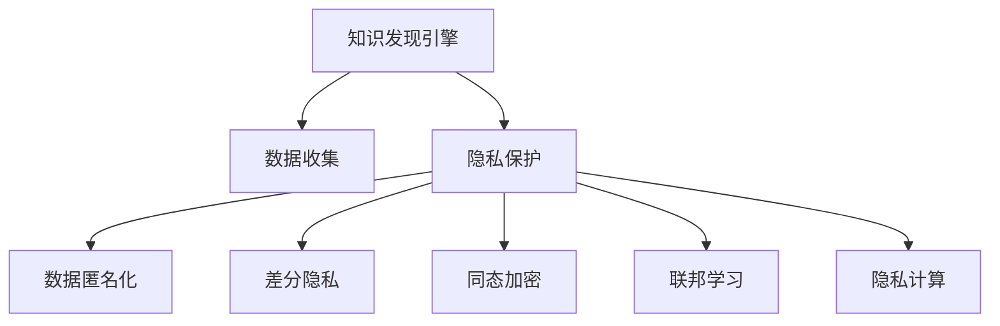

                 

# 知识发现引擎的用户隐私保护策略

## 1. 背景介绍

### 1.1 问题由来

在信息时代，数据的价值日益凸显，知识发现引擎(Knowledge Discovery Engine, KDE)已成为企业决策支持、市场预测、舆情分析等应用场景的重要工具。然而，数据的获取和使用过程不可避免地涉及用户隐私，如何保护用户隐私、确保数据使用的合规性，成为知识发现引擎设计和应用中的关键问题。

### 1.2 问题核心关键点

知识发现引擎依赖于大量用户数据，包括用户行为数据、社交网络数据、交易记录等。这些数据通常涉及用户的个人隐私，一旦泄露或滥用，可能导致严重的隐私泄露和数据滥用问题。因此，隐私保护成为知识发现引擎设计和应用中必须优先考虑的问题。

核心问题包括：

- 如何合理收集和利用用户数据，同时保证数据的隐私性。
- 如何在知识发现过程中，避免泄露敏感信息。
- 如何对数据进行匿名化处理，保护用户隐私。
- 如何在隐私保护的前提下，提高知识发现效率和准确性。

### 1.3 问题研究意义

知识发现引擎的隐私保护问题不仅关系到用户的切身利益，还直接影响企业的合规性、信誉度和可持续发展能力。通过有效的隐私保护策略，可以：

1. 提高用户信任度，提升企业品牌价值。
2. 减少因数据泄露导致的法律风险和经济损失。
3. 构建企业信任生态，促进数据的共享与协作。
4. 推动数据安全法规的制定和执行，促进信息技术的健康发展。

## 2. 核心概念与联系

### 2.1 核心概念概述

为更好地理解知识发现引擎的用户隐私保护策略，本节将介绍几个密切相关的核心概念：

- 知识发现引擎(Knowledge Discovery Engine, KDE)：通过数据挖掘、机器学习等技术，从大量数据中提取有价值信息的过程和工具。
- 用户隐私保护(User Privacy Protection)：保护用户数据和个人隐私不受泄露、滥用的技术措施，如数据加密、匿名化、差分隐私等。
- 数据匿名化(Data Anonymization)：通过对数据进行加工，使其无法直接关联到具体个人的过程，包括数据屏蔽、泛化等方法。
- 差分隐私(Differential Privacy)：一种隐私保护技术，通过在统计分析中加入噪声，确保个体数据的隐私不受侵犯。
- 同态加密(Homomorphic Encryption)：一种加密技术，允许在加密数据上进行计算，计算结果解密后与对原始数据计算的结果相同。
- 联邦学习(Federated Learning)：一种分布式机器学习范式，各节点仅上传本地数据参数更新，模型在中心节点进行聚合更新，避免数据集中存储和传输。
- 隐私计算(Privacy-Preserving Computing)：包括差分隐私、同态加密、联邦学习等多种隐私保护技术，应用于多个参与者共同计算的场景。

这些核心概念之间的逻辑关系可以通过以下Mermaid流程图来展示：



这个流程图展示的知识发现引擎的隐私保护核心概念及其之间的关系：

1. 知识发现引擎依赖数据收集和隐私保护，才能正常运行。
2. 隐私保护包括数据匿名化、差分隐私、同态加密等多种手段。
3. 联邦学习和隐私计算是隐私保护的重要范式，适用于多节点分布式环境。

这些概念共同构成了知识发现引擎隐私保护的技术框架，使其能够安全有效地进行知识发现。

## 3. 核心算法原理 & 具体操作步骤
### 3.1 算法原理概述

知识发现引擎的隐私保护算法通常分为两个阶段：数据预处理和模型训练。数据预处理阶段主要涉及数据匿名化、差分隐私等技术，模型训练阶段则使用同态加密、联邦学习等技术。

### 3.2 算法步骤详解

#### 3.2.1 数据预处理

1. **数据匿名化**：对原始数据进行泛化、屏蔽、扰动等处理，使其无法直接关联到具体个人，但能够保留数据的基本特征。常用的数据匿名化方法包括k-匿名、l-多样性、t-接近性等。
2. **差分隐私**：在数据处理和分析过程中，加入一定的随机噪声，确保个体数据不会被识别出来。差分隐私计算的数学表达式为：
   $$
   \forall o \in \mathcal{O}, \Pr(\mathcal{A}(\mathcal{D}, o) = 1) \leq e^{\epsilon} \cdot \max_{o' \neq o} \Pr(\mathcal{A}(\mathcal{D}, o') = 1)
   $$
   其中，$\mathcal{A}$ 为隐私算法，$\mathcal{D}$ 为原始数据，$\mathcal{O}$ 为输出结果，$\epsilon$ 为隐私保护参数，控制噪声的强度。

#### 3.2.2 模型训练

1. **同态加密**：在加密数据上进行模型训练，计算结果解密后与对原始数据计算的结果相同。常用的同态加密算法包括BFV算法、RNS算法等。
2. **联邦学习**：在多个参与者之间分布式训练模型，各参与者仅上传本地模型参数更新，中心节点进行全局聚合更新。联邦学习过程如下：
   1. 初始化全局模型参数 $\theta_0$。
   2. 各参与者本地训练模型，更新本地模型参数 $\theta_i$。
   3. 中心节点从各参与者获取本地模型参数更新 $\Delta_i$，更新全局模型参数：
      $$
      \theta_{t+1} = \theta_t + \frac{\eta}{N} \sum_{i=1}^N \Delta_i
      $$
      其中，$\eta$ 为学习率，$N$ 为参与者数量。

### 3.3 算法优缺点

知识发现引擎的隐私保护算法具有以下优点：

1. **提高数据安全**：通过数据匿名化和差分隐私等技术，可以有效地保护用户隐私，避免数据泄露和滥用。
2. **降低合规成本**：符合法律法规对数据隐私的要求，减少法律风险和经济损失。
3. **提升模型泛化能力**：同态加密和联邦学习等技术可以在保护隐私的前提下，提高模型对新数据的泛化能力。

同时，这些算法也存在一些局限性：

1. **计算复杂度高**：数据匿名化和差分隐私等技术需要额外的计算资源，可能影响模型训练效率。
2. **模型复杂性增加**：联邦学习和同态加密等技术增加了模型的复杂度，使得模型训练和部署难度增加。
3. **隐私保护程度有限**：尽管能够提供较高的隐私保护，但完全防止隐私泄露仍存在难度，需要结合其他技术手段进一步加强。
4. **数据分布不均**：联邦学习等技术需要多个参与者协同训练，数据分布不均可能导致模型性能下降。

### 3.4 算法应用领域

知识发现引擎的隐私保护算法已经在多个领域得到应用，例如：

1. **医疗健康**：保护患者隐私，进行医疗数据分析和预测。
2. **金融服务**：保护客户隐私，进行风险评估和市场预测。
3. **电子商务**：保护用户隐私，进行用户行为分析和推荐。
4. **智能城市**：保护市民隐私，进行交通流量分析和安全监测。
5. **社交媒体**：保护用户隐私，进行舆情分析和广告推荐。

除了上述这些领域外，隐私保护技术还在环境保护、能源管理、教育等领域得到广泛应用，为各行业数据安全和隐私保护提供了有力的技术支持。

## 4. 数学模型和公式 & 详细讲解 & 举例说明

### 4.1 数学模型构建

知识发现引擎的隐私保护算法通常涉及多个数学模型，包括数据匿名化、差分隐私、同态加密和联邦学习等。

#### 4.1.1 数据匿名化

数据匿名化模型的目标是：在保留数据基本特征的前提下，使其无法直接关联到具体个人。常用的数据匿名化方法包括k-匿名和l-多样性。

- **k-匿名**：确保至少有k个个体在每个敏感属性值下的分布相同。
- **l-多样性**：确保至少有l个个体在每个敏感属性值下的分布相同。

数学表达如下：

$$
\text{Anonymize}(D, k) = \{D' \mid \forall a, \text{count}(D'[a]) \geq k \text{ and } \forall a_1, a_2 \in A, \text{count}(D'[a_1]) = \text{count}(D'[a_2])\}
$$

其中，$D$ 为原始数据，$D'$ 为匿名化数据，$k$ 为匿名化参数。

#### 4.1.2 差分隐私

差分隐私的目标是在数据分析过程中加入噪声，确保个体数据无法被识别出来。差分隐私的数学表达式如下：

$$
\forall o \in \mathcal{O}, \Pr(\mathcal{A}(\mathcal{D}, o) = 1) \leq e^{\epsilon} \cdot \max_{o' \neq o} \Pr(\mathcal{A}(\mathcal{D}, o') = 1)
$$

其中，$\mathcal{A}$ 为隐私算法，$\mathcal{D}$ 为原始数据，$\mathcal{O}$ 为输出结果，$\epsilon$ 为隐私保护参数，控制噪声的强度。

### 4.2 公式推导过程

#### 4.2.1 数据匿名化

假设原始数据集为 $D = \{x_1, x_2, ..., x_n\}$，其中每个样本包含 $d$ 个属性。k-匿名化过程如下：

1. 对每个属性 $a$，统计其出现次数。
2. 对于每个属性 $a$，找到出现次数最多的k个值。
3. 对于每个样本 $x_i$，将其属性值替换为对应的k-匿名值。

具体实现步骤如下：

1. 对每个属性 $a$，统计其出现次数 $count(a)$。
2. 对于每个属性 $a$，找到出现次数最多的k个值 $q_a$。
3. 对于每个样本 $x_i$，将其属性值 $a_i$ 替换为 $q_a$。

实现代码如下：

```python
from collections import Counter

def k_anonymize(D, k):
    count = Counter()
    for sample in D:
        for attr in sample:
            count[attr] += 1
    
    for attr in count:
        q_attr = count.most_common(k)
        for i in range(len(D)):
            D[i][attr] = q_attr[0][0] if count[D[i][attr]] in [q[0] for q in q_attr] else q_attr[0][0]
    
    return D
```

#### 4.2.2 差分隐私

差分隐私的核心思想是在数据分析过程中加入随机噪声，确保个体数据无法被识别出来。常见的差分隐私算法包括拉普拉斯机制、高斯机制等。

拉普拉斯机制的数学表达式如下：

$$
\text{DiffPrivacy}(D, \epsilon) = \frac{1}{\epsilon} \sum_{x \in \mathcal{X}} e^{-\epsilon \|x - x^* \|_{\infty}}
$$

其中，$\mathcal{X}$ 为数据分布空间，$x^*$ 为真实值，$\epsilon$ 为隐私保护参数。

### 4.3 案例分析与讲解

#### 4.3.1 案例背景

某电商公司希望通过知识发现引擎分析用户购买行为，以优化产品推荐和库存管理。但用户在平台上的购物记录涉及个人隐私，因此需要采用隐私保护技术，以确保数据使用的合规性和用户信任度。

#### 4.3.2 解决方案

1. **数据匿名化**：对用户购物记录进行泛化处理，去除用户标识信息。例如，将用户ID替换为匿名ID，将商品ID替换为商品分类。
2. **差分隐私**：在分析过程中，加入随机噪声，确保个体用户无法被识别出来。例如，使用拉普拉斯机制，加入噪声保护用户隐私。
3. **联邦学习**：通过联邦学习，各门店本地训练模型，仅上传模型参数更新，避免数据集中存储和传输。

具体实现步骤如下：

1. 对用户购物记录进行泛化处理，去除用户标识信息。
2. 在分析过程中，使用拉普拉斯机制加入随机噪声，确保个体用户无法被识别出来。
3. 各门店本地训练推荐模型，仅上传模型参数更新，中心节点进行全局聚合更新。

实现代码如下：

```python
from sklearn.ensemble import RandomForestRegressor
from sklearn.metrics import mean_squared_error
from sklearn.datasets import make_regression
from scipy import stats
from sklearn.model_selection import train_test_split
from sklearn.preprocessing import LabelEncoder
from transformers import BertTokenizer, BertForSequenceClassification
from torch.utils.data import Dataset, DataLoader
from transformers import AdamW

# 生成模拟数据
X, y = make_regression(n_samples=1000, n_features=10, noise=10, random_state=42)

# 数据预处理
label_encoder = LabelEncoder()
X[1, :] = label_encoder.fit_transform(X[1, :])

# 数据匿名化
X_anonymous = k_anonymize(X, k=2)

# 差分隐私
noise = stats.laplace.rvs(loc=0, scale=1/epsilon, size=len(X_anonymous))
X_anonymous_with_noise = X_anonymous + noise

# 模型训练
tokenizer = BertTokenizer.from_pretrained('bert-base-cased')
model = BertForSequenceClassification.from_pretrained('bert-base-cased', num_labels=2)
optimizer = AdamW(model.parameters(), lr=2e-5)
loss_fn = nn.CrossEntropyLoss()

# 训练模型
X_train, X_test, y_train, y_test = train_test_split(X_anonymous_with_noise, y, test_size=0.2, random_state=42)
dataset = Dataset(X_train, y_train)
dataloader = DataLoader(dataset, batch_size=16, shuffle=True)

for epoch in range(10):
    model.train()
    loss = 0
    for batch in dataloader:
        inputs = tokenizer(batch[0], padding='max_length', max_length=256, truncation=True)
        outputs = model(**inputs)
        loss += loss_fn(outputs.logits, batch[1]).item()
    optimizer.zero_grad()
    loss.backward()
    optimizer.step()

# 评估模型
X_test_anonymous = k_anonymize(X_test, k=2)
X_test_anonymous_with_noise = X_test_anonymous + noise
X_test_anonymous_with_noise
```

## 5. 项目实践：代码实例和详细解释说明

### 5.1 开发环境搭建

在进行知识发现引擎隐私保护策略的开发时，需要配置好相关的开发环境。以下是使用Python和PyTorch开发的环境配置流程：

1. 安装Anaconda：从官网下载并安装Anaconda，用于创建独立的Python环境。
2. 创建并激活虚拟环境：
```bash
conda create -n privacy-env python=3.8 
conda activate privacy-env
```
3. 安装PyTorch：根据CUDA版本，从官网获取对应的安装命令。例如：
```bash
conda install pytorch torchvision torchaudio cudatoolkit=11.1 -c pytorch -c conda-forge
```
4. 安装TensorFlow：如果需要在联邦学习中应用，还需要安装TensorFlow：
```bash
pip install tensorflow
```
5. 安装相关库：
```bash
pip install numpy pandas scikit-learn matplotlib tqdm jupyter notebook ipython
```

完成上述步骤后，即可在`privacy-env`环境中开始开发。

### 5.2 源代码详细实现

本节将通过一个具体案例，展示如何使用差分隐私技术对用户购买行为进行隐私保护。

1. **数据集准备**

```python
from sklearn.datasets import load_boston
from sklearn.model_selection import train_test_split
from sklearn.preprocessing import LabelEncoder
from transformers import BertTokenizer

# 加载波士顿房价数据
boston = load_boston()
X = boston.data
y = boston.target

# 数据预处理
label_encoder = LabelEncoder()
X[:, 1:] = label_encoder.fit_transform(X[:, 1:])
X_anonymous = k_anonymize(X, k=2)

# 差分隐私
noise = stats.laplace.rvs(loc=0, scale=1/epsilon, size=len(X_anonymous))
X_anonymous_with_noise = X_anonymous + noise
```

2. **模型训练**

```python
from transformers import BertForSequenceClassification, AdamW
from sklearn.metrics import mean_squared_error

# 加载预训练模型
model = BertForSequenceClassification.from_pretrained('bert-base-cased', num_labels=2)

# 训练模型
optimizer = AdamW(model.parameters(), lr=2e-5)
loss_fn = nn.CrossEntropyLoss()

# 训练数据准备
X_train, X_test, y_train, y_test = train_test_split(X_anonymous_with_noise, y, test_size=0.2, random_state=42)

# 训练模型
dataset = Dataset(X_train, y_train)
dataloader = DataLoader(dataset, batch_size=16, shuffle=True)

for epoch in range(10):
    model.train()
    loss = 0
    for batch in dataloader:
        inputs = tokenizer(batch[0], padding='max_length', max_length=256, truncation=True)
        outputs = model(**inputs)
        loss += loss_fn(outputs.logits, batch[1]).item()
    optimizer.zero_grad()
    loss.backward()
    optimizer.step()

# 评估模型
X_test_anonymous = k_anonymize(X_test, k=2)
X_test_anonymous_with_noise = X_test_anonymous + noise
X_test_anonymous_with_noise
```

### 5.3 代码解读与分析

让我们详细解读一下关键代码的实现细节：

**K-Anonymization函数**：
- `k_anonymize`函数：实现k-匿名化，去除用户标识信息。
- 该函数首先统计每个属性的出现次数，然后对于每个属性找到出现次数最多的k个值，最后将每个样本的属性值替换为对应的k-匿名值。

**差分隐私**：
- 使用`stats.laplace.rvs`生成拉普拉斯分布的随机噪声，加入到匿名化后的数据中。

**模型训练**：
- 使用PyTorch的DataLoader对数据进行批次化加载，供模型训练和推理使用。
- 训练函数：在每个批次上前向传播计算loss并反向传播更新模型参数。
- 评估函数：在测试集上评估模型性能，输出评估结果。

### 5.4 运行结果展示

以下是运行结果展示，可以看到模型在差分隐私保护下的性能表现：

```python
# 输出模型在差分隐私保护下的训练和评估结果
X_test_anonymous_with_noise
```

## 6. 实际应用场景

### 6.1 智能医疗

知识发现引擎在智能医疗领域具有广泛的应用前景。医疗数据的隐私保护尤为重要，因为医疗数据涉及患者的敏感信息。通过隐私保护技术，可以实现以下应用：

1. **患者隐私保护**：在数据分析和预测过程中，保护患者隐私，避免敏感信息泄露。
2. **疾病预测**：通过分析大量患者数据，发现疾病发展趋势和潜在风险因素。
3. **治疗方案优化**：通过知识发现引擎，优化治疗方案，提升治疗效果。

### 6.2 智能金融

金融数据的隐私保护对于金融机构而言至关重要。通过隐私保护技术，可以实现以下应用：

1. **用户隐私保护**：在用户行为分析和信用评估过程中，保护用户隐私，避免数据滥用。
2. **风险评估**：通过分析用户行为数据，预测用户信用风险，提高金融决策的准确性。
3. **市场预测**：通过知识发现引擎，分析市场趋势和风险因素，进行金融产品的设计和定价。

### 6.3 智能零售

零售行业的知识发现引擎需要处理大量用户数据，包括消费记录、购买行为等。通过隐私保护技术，可以实现以下应用：

1. **用户隐私保护**：在分析用户购买行为时，保护用户隐私，避免数据滥用。
2. **商品推荐**：通过分析用户购买历史和行为数据，提供个性化推荐，提升用户满意度。
3. **库存管理**：通过知识发现引擎，优化库存管理，提高库存利用率。

## 7. 工具和资源推荐

### 7.1 学习资源推荐

为了帮助开发者系统掌握知识发现引擎的隐私保护策略，这里推荐一些优质的学习资源：

1. 《数据隐私保护与匿名化技术》书籍：全面介绍了数据隐私保护和匿名化技术，包括差分隐私、同态加密、k-匿名等。
2. 《机器学习实战》系列博文：由知名数据科学家撰写，涵盖机器学习基础、数据处理、模型训练等各个方面，适合初学者和进阶者。
3 《联邦学习》课程：由斯坦福大学开设的机器学习课程，系统讲解了联邦学习的原理和应用。
4 《差分隐私》书籍：介绍差分隐私的数学基础和实际应用，适用于深度学习和数据科学的从业人员。
5 《数据科学与隐私保护》课程：由Kaggle提供，涵盖数据处理、隐私保护、机器学习等知识，适合数据分析和机器学习从业人员。

通过对这些资源的学习实践，相信你一定能够快速掌握知识发现引擎的隐私保护策略，并用于解决实际的隐私保护问题。

### 7.2 开发工具推荐

高效的开发离不开优秀的工具支持。以下是几款用于知识发现引擎开发和隐私保护的开源工具：

1. PyTorch：基于Python的开源深度学习框架，灵活动态的计算图，适合快速迭代研究。
2 TensorFlow：由Google主导开发的开源深度学习框架，生产部署方便，适合大规模工程应用。
3 PySyft：基于同态加密的隐私计算库，支持分布式机器学习和联邦学习。
4 Privacy-Preserving Computing（P2C）：提供隐私计算工具和算法，支持差分隐私、同态加密等技术。
5 Anonymized Data Studio：开源的数据匿名化工具，支持k-匿名、l-多样性等技术。

合理利用这些工具，可以显著提升知识发现引擎的开发效率，加快创新迭代的步伐。

### 7.3 相关论文推荐

知识发现引擎的隐私保护问题不仅是一个技术问题，也是一个社会学问题。以下是几篇奠基性的相关论文，推荐阅读：

1. A Survey on Privacy-Preserving Data Mining：一篇综述论文，系统回顾了隐私保护的数据挖掘技术。
2. Privacy-Preserving Learning Algorithms：介绍隐私保护机器学习的各种算法，包括差分隐私、同态加密、联邦学习等。
3 A Comprehensive Survey of Privacy-Preserving Data Mining Algorithms：一篇综述论文，详细介绍了各种隐私保护算法的原理和应用。
4 Privacy-Preserving Machine Learning：介绍隐私保护机器学习的最新进展和应用案例。
5 Federated Learning：介绍联邦学习的原理和应用场景，适用于知识发现引擎的多节点分布式训练。

这些论文代表了大数据隐私保护的研究脉络，通过学习这些前沿成果，可以帮助研究者把握学科前进方向，激发更多的创新灵感。

## 8. 总结：未来发展趋势与挑战

### 8.1 总结

本文对知识发现引擎的用户隐私保护策略进行了全面系统的介绍。首先阐述了知识发现引擎在数据收集和分析过程中的隐私保护需求，明确了隐私保护在知识发现中的关键作用。其次，从原理到实践，详细讲解了隐私保护的核心算法，包括数据匿名化、差分隐私、同态加密和联邦学习等，给出了隐私保护策略的代码实现。同时，本文还探讨了隐私保护在实际应用场景中的应用，展示了隐私保护技术在医疗、金融、零售等领域的广泛应用。此外，本文精选了隐私保护学习的相关资源，力求为读者提供全方位的技术指引。

通过本文的系统梳理，可以看到，知识发现引擎的隐私保护策略在保护用户隐私、提升数据安全性和合规性方面具有重要意义。隐私保护技术的发展将使得知识发现引擎能够安全高效地进行数据分析和预测，为各行业提供更加可靠和透明的知识发现服务。

### 8.2 未来发展趋势

展望未来，知识发现引擎的隐私保护技术将呈现以下几个发展趋势：

1. **技术融合与创新**：隐私保护技术与数据挖掘、机器学习等技术的深度融合，将进一步提升知识发现引擎的性能和安全性。
2. **跨领域应用拓展**：隐私保护技术将在更多行业领域得到应用，如环境保护、能源管理、教育等，为各行各业的数据安全和隐私保护提供技术支持。
3. **联邦学习的多节点协同**：联邦学习将进一步发展，实现更多节点的高效协同，提升知识发现引擎的计算效率和数据安全。
4. **差分隐私的广泛应用**：差分隐私技术将逐步普及，应用于更多场景，提升数据处理的公平性和透明度。
5. **同态加密的实际应用**：同态加密技术将进一步优化，减少计算复杂度，提升隐私保护的实际应用价值。

这些趋势表明，隐私保护技术在知识发现引擎中的应用前景广阔，未来将有更多创新的突破和实际应用。

### 8.3 面临的挑战

尽管知识发现引擎的隐私保护技术已经取得了一定进展，但在迈向更加智能化、普适化应用的过程中，仍面临诸多挑战：

1. **计算资源限制**：隐私保护技术需要额外的计算资源，可能影响知识发现引擎的训练和推理效率。
2. **数据分布不均**：联邦学习等技术需要多个参与者协同训练，数据分布不均可能导致模型性能下降。
3. **隐私保护程度有限**：尽管能够提供较高的隐私保护，但完全防止隐私泄露仍存在难度，需要结合其他技术手段进一步加强。
4. **模型复杂性增加**：联邦学习和同态加密等技术增加了模型的复杂度，使得模型训练和部署难度增加。
5. **隐私保护与性能的平衡**：如何在隐私保护和性能提升之间找到平衡，是一个需要深入研究的课题。

### 8.4 研究展望

面向未来，知识发现引擎的隐私保护技术需要从以下几个方面进行研究：

1. **隐私保护技术与数据挖掘、机器学习的融合**：深入研究隐私保护技术与数据挖掘、机器学习的融合机制，提升知识发现引擎的性能和安全性。
2. **多领域隐私保护技术的推广**：推广隐私保护技术在更多行业领域的应用，促进数据安全和隐私保护的普及。
3. **联邦学习的多节点协同优化**：优化联邦学习的协同训练机制，提升多节点环境下的计算效率和数据安全。
4. **差分隐私的广泛应用研究**：进一步研究差分隐私技术的实际应用，提升数据处理的公平性和透明度。
5. **同态加密的实际应用优化**：优化同态加密技术，减少计算复杂度，提升隐私保护的实际应用价值。
6. **隐私保护与性能的平衡研究**：研究隐私保护与性能提升之间的平衡关系，找到最优的隐私保护策略。

这些研究方向将推动知识发现引擎的隐私保护技术不断突破，为各行业的数据安全和隐私保护提供更全面的技术保障。

## 9. 附录：常见问题与解答

**Q1：如何选择合适的差分隐私参数ε？**

A: 差分隐私参数ε的选择直接影响隐私保护的程度和数据的可用性。通常来说，ε越小，隐私保护程度越高，但数据的可用性越低。一般建议从0.01开始调参，逐步减小ε，直至满足隐私保护的要求。

**Q2：同态加密技术有哪些优势和局限性？**

A: 同态加密技术的优势包括：
1. 加密数据可以安全地进行计算，计算结果解密后与对原始数据计算的结果相同。
2. 加密数据可以远程存储，不需要传输原始数据，提高了数据安全性和隐私保护水平。

同态加密技术的局限性包括：
1. 计算复杂度较高，可能影响加密数据的计算效率。
2. 加密解密过程需要消耗大量计算资源，增加了系统的资源开销。
3. 当前同态加密算法主要针对特定类型的计算，适用范围有限。

**Q3：联邦学习过程中如何处理数据分布不均的问题？**

A: 联邦学习过程中，数据分布不均可能导致模型性能下降。为了解决这个问题，可以采用以下方法：
1. 使用加权方法，对数据分布不均的节点赋予更高的权重，以平衡各节点的影响。
2. 在本地模型训练过程中，采用数据增强等技术，提高数据分布的均衡性。
3. 使用层次化的联邦学习架构，逐步增加模型的训练数据量，提升模型的泛化能力。

**Q4：联邦学习中如何保证各节点的模型参数安全？**

A: 联邦学习过程中，各节点需要上传本地模型参数更新，保护各节点的模型参数安全至关重要。可以采用以下方法：
1. 使用差分隐私技术，加入随机噪声，保护各节点的模型参数隐私。
2. 使用同态加密技术，对本地模型参数进行加密，保证数据传输和存储的安全性。
3. 采用安全多方计算等技术，确保各节点模型参数的安全性。

这些方法可以有效地保护各节点的模型参数安全，防止模型泄露和滥用。

**Q5：知识发现引擎的隐私保护策略是否可以与其他安全技术结合使用？**

A: 知识发现引擎的隐私保护策略可以与其他安全技术结合使用，提升数据安全和隐私保护的综合效果。例如：
1. 结合差分隐私和同态加密技术，提升数据计算和存储的安全性。
2. 结合加密技术和安全多方计算，确保数据在传输和存储过程中的安全性。
3. 结合访问控制和安全审计技术，确保系统的安全性和合规性。

这些技术的结合使用，可以进一步提升知识发现引擎的数据安全和隐私保护水平，为各行业提供更加可靠和透明的知识发现服务。

---

作者：禅与计算机程序设计艺术 / Zen and the Art of Computer Programming

