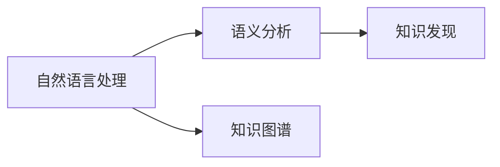

                 

# 知识发现引擎的语义分析技术应用

> 关键词：语义分析,知识发现,自然语言处理,深度学习,模型构建,应用场景,技术展望

## 1. 背景介绍

### 1.1 问题由来

在当今信息爆炸的时代，如何从海量文本数据中发现潜在的知识、洞察关键趋势，成为众多企业和组织关注的焦点。知识发现(Knowledge Discovery, KDD)技术通过算法模型对文本数据进行挖掘和分析，揭示出其中的结构化信息和隐含知识，从而为决策者提供有价值的参考。

语义分析作为知识发现的关键技术，通过对文本的自然语言处理(Natural Language Processing, NLP)，实现对文本语义的深入理解和解析。其核心目标是理解文本中单词和短语的深层含义，捕捉隐含的语义关系和实体信息。在工业界和学术界，语义分析已经被广泛应用于信息检索、机器翻译、智能问答、情感分析等多个领域，极大地提高了文本数据的利用率和应用价值。

### 1.2 问题核心关键点

语义分析的核心问题包括：
- **语言表示学习**：如何将自然语言转化为机器可处理的向量表示，是语义分析的第一步。
- **实体识别**：从文本中自动抽取出人名、地名、组织名等实体信息，为后续分析提供基础。
- **关系抽取**：识别并抽取出文本中提及的实体之间的关系，构建知识图谱。
- **语义相似度计算**：衡量文本间语义的相似度，用于信息检索、推荐系统等场景。
- **情感分析**：分析文本中的情感倾向，判断其情感极性。
- **问答系统**：理解用户的问题，并生成准确的回答。

这些问题相互关联，共同构成了语义分析技术的研究体系。本文将深入探讨语义分析技术在大规模知识发现引擎中的应用，并详细阐述其核心算法和操作步骤。

### 1.3 问题研究意义

语义分析技术在知识发现引擎中的应用，具有重要意义：

1. **提高数据利用率**：语义分析能够从大规模文本数据中提取有价值的知识，减少人工参与，大幅提高数据利用效率。
2. **增强应用效果**：通过语义分析，系统能够更好地理解用户需求和文本内容，从而提供更准确、更有用的应用服务。
3. **促进产业发展**：语义分析技术的成熟应用，将推动传统行业的信息化转型，提升业务决策的科学性和效率。
4. **推动技术创新**：语义分析技术的进步，将带动自然语言处理、机器学习等领域的技术创新，推动人工智能技术的整体发展。

## 2. 核心概念与联系

### 2.1 核心概念概述

为更好地理解语义分析技术在大规模知识发现引擎中的应用，本节将介绍几个密切相关的核心概念：

- **自然语言处理(NLP)**：使用计算机科学和人工智能技术对自然语言文本进行处理和分析，包括词法分析、句法分析、语义分析、命名实体识别、关系抽取、语义相似度计算等。
- **知识发现(KDD)**：从大规模数据中提取有价值的模式和知识的过程，涉及数据预处理、特征选择、模型训练、结果评估等环节。
- **语义分析(Semantic Analysis)**：通过分析文本的深层语义，理解文本中的意义、关系和实体，实现对文本内容的高级处理。
- **深度学习(Deep Learning)**：一种基于神经网络的机器学习方法，可以自动提取并学习数据中的复杂特征和模式，广泛应用于图像识别、语音识别、自然语言处理等领域。
- **知识图谱(Knowledge Graph)**：通过语义分析技术构建的，描述实体之间关系的图形结构，是知识发现的重要基础。

这些概念之间的逻辑关系可以通过以下Mermaid流程图来展示：



这个流程图展示了大规模知识发现引擎中各个技术环节的相互联系：

1. 自然语言处理(NLP)是语义分析的前提，通过分词、词性标注等基础处理，为后续语义分析提供文本表示。
2. 语义分析是知识发现的基石，通过抽取实体、关系、情感等语义信息，构建知识图谱。
3. 知识图谱是知识发现的核心，为后续的统计分析和预测提供数据基础。

这些概念共同构成了大规模知识发现引擎的技术框架，使得系统能够高效、准确地从文本数据中提取有价值的知识。

## 3. 核心算法原理 & 具体操作步骤
### 3.1 算法原理概述

语义分析技术在大规模知识发现引擎中的应用，主要通过深度学习模型实现。其核心算法包括：

- **词嵌入**：将自然语言单词转化为密集向量表示，用于捕捉单词间的语义关系。
- **序列标注**：通过序列标注模型，自动识别文本中的实体、关系等语义信息。
- **句法分析**：通过句法分析模型，解析文本中的句法结构和依存关系，为语义分析提供语境信息。
- **语义相似度计算**：通过相似度计算模型，衡量文本之间的语义相似度，用于信息检索、推荐系统等场景。
- **情感分析**：通过情感分析模型，识别文本中的情感倾向，用于舆情监控、市场分析等任务。

语义分析的核心流程包括以下几个步骤：

1. **文本预处理**：对原始文本进行清洗、分词、去停用词等预处理，为后续处理提供干净、结构化的文本数据。
2. **词嵌入建模**：使用预训练的词嵌入模型，将文本转化为密集向量表示，捕捉单词间的语义关系。
3. **序列标注**：通过序列标注模型，自动识别文本中的实体、关系等语义信息，构建知识图谱。
4. **句法分析**：通过句法分析模型，解析文本中的句法结构和依存关系，为语义分析提供语境信息。
5. **语义相似度计算**：通过相似度计算模型，衡量文本之间的语义相似度，用于信息检索、推荐系统等场景。
6. **情感分析**：通过情感分析模型，识别文本中的情感倾向，用于舆情监控、市场分析等任务。

### 3.2 算法步骤详解

以序列标注为例，详细讲解其具体的操作步骤：

**Step 1: 数据准备**
- 收集与任务相关的文本数据，如新闻、社交媒体、论坛等。
- 对文本进行清洗、分词、去除停用词等预处理。

**Step 2: 词嵌入建模**
- 使用预训练的词嵌入模型（如Word2Vec、GloVe、BERT等），将文本转化为密集向量表示。
- 对于长文本，可以使用句向量或段落向量作为表示。

**Step 3: 序列标注模型训练**
- 定义标注任务的目标函数，如实体识别任务的目标函数为最大化标注序列与真实标签序列的匹配度。
- 使用优化算法（如Adam、SGD等）训练序列标注模型。
- 在训练过程中，使用交叉验证技术进行模型评估，防止过拟合。

**Step 4: 序列标注模型评估**
- 在测试集上评估序列标注模型的性能，如F1-score、准确率、召回率等指标。
- 根据评估结果调整模型参数，进一步优化模型性能。

**Step 5: 序列标注结果应用**
- 将序列标注模型应用于新文本的语义分析任务，提取实体、关系等信息。
- 构建知识图谱，将抽取的实体和关系进行关联，形成结构化的知识库。

### 3.3 算法优缺点

语义分析技术在大规模知识发现引擎中的应用，具有以下优点：

- **高准确性**：深度学习模型可以自动学习单词间的复杂语义关系，实现高精度的语义分析。
- **高效性**：通过序列标注和句法分析等模型，能够快速提取文本中的语义信息，加速知识发现过程。
- **可扩展性**：深度学习模型具有很强的泛化能力，可以应用于多种文本分析和挖掘任务。

同时，语义分析技术也存在一些局限性：

- **数据需求高**：语义分析需要大量标注数据进行训练，数据收集和标注成本较高。
- **模型复杂**：深度学习模型参数量大，计算资源需求高，训练和推理耗时较长。
- **鲁棒性差**：模型对输入数据的噪声和干扰较为敏感，存在一定的鲁棒性不足问题。

尽管存在这些局限性，但语义分析技术在大规模知识发现引擎中的应用，已经取得了显著的成果，并为后续研究提供了坚实的技术基础。

### 3.4 算法应用领域

语义分析技术在大规模知识发现引擎中，已经广泛应用于以下几个领域：

- **信息检索**：通过语义分析技术，提高检索系统的召回率和精确度，帮助用户找到更相关、有用的文本。
- **推荐系统**：分析用户行为和文本语义信息，推荐个性化的内容和服务。
- **情感分析**：识别文本中的情感倾向，监测市场舆情，评估产品口碑。
- **知识图谱构建**：通过语义分析技术，自动抽取实体、关系等语义信息，构建知识图谱，支持知识推理和发现。
- **智能问答**：理解用户自然语言问题，从知识图谱中获取并生成准确的回答。
- **舆情监控**：分析社交媒体、新闻等文本数据，监测舆情变化，支持风险预警和危机管理。

除了上述这些经典应用外，语义分析技术还在更多场景中得到创新性地应用，如新闻摘要、文本分类、命名实体识别等，为知识发现引擎带来了新的突破。

## 4. 数学模型和公式 & 详细讲解 & 举例说明

### 4.1 数学模型构建

本节将使用数学语言对语义分析技术的核心算法进行更加严格的刻画。

记文本语料为 $\mathcal{D}=\{(x_i, y_i)\}_{i=1}^N$，其中 $x_i$ 为文本样本，$y_i$ 为对应的语义标签（如实体识别、关系抽取等）。定义语义分析任务的损失函数为 $\mathcal{L}(\theta)$，其中 $\theta$ 为模型的参数，包括词嵌入模型、序列标注模型、句法分析模型等。

语义分析的任务通常是二分类任务，如实体识别和关系抽取。对于实体识别任务，可以定义目标函数如下：

$$
\mathcal{L}(\theta) = -\frac{1}{N}\sum_{i=1}^N \log p(y_i | x_i, \theta)
$$

其中 $p(y_i | x_i, \theta)$ 为模型在给定文本 $x_i$ 和参数 $\theta$ 下的预测概率，可以通过softmax函数计算。

对于关系抽取任务，可以定义目标函数如下：

$$
\mathcal{L}(\theta) = -\frac{1}{N}\sum_{i=1}^N \log p(y_i | x_i, \theta)
$$

其中 $y_i$ 为关系标签，如（人名, 地名）、（公司, 产品）等，$p(y_i | x_i, \theta)$ 为模型在给定文本 $x_i$ 和参数 $\theta$ 下的预测概率，同样可以通过softmax函数计算。

### 4.2 公式推导过程

以序列标注任务为例，推导目标函数和预测函数的计算公式。

假设文本 $x_i$ 的标注序列为 $y_i = (y_1^i, y_2^i, ..., y_n^i)$，其中 $y_j^i$ 表示文本第 $j$ 个词的标注标签。

定义序列标注模型的目标函数为：

$$
\mathcal{L}(\theta) = -\frac{1}{N}\sum_{i=1}^N \sum_{j=1}^{n_i} \log p(y_j^i | x_i, \theta)
$$

其中 $n_i$ 表示文本 $x_i$ 的长度。

根据条件概率的链式法则，有：

$$
p(y_j^i | x_i, \theta) = p(y_1^i, ..., y_n^i | x_i, \theta) = \prod_{j=1}^{n_i} p(y_j^i | y_{j-1}^i, x_i, \theta)
$$

将上式带入目标函数，得：

$$
\mathcal{L}(\theta) = -\frac{1}{N}\sum_{i=1}^N \sum_{j=1}^{n_i} \log p(y_j^i | y_{j-1}^i, x_i, \theta)
$$

在训练过程中，我们使用优化算法（如Adam、SGD等）更新模型参数 $\theta$，使得损失函数 $\mathcal{L}(\theta)$ 最小化。具体的更新规则如下：

$$
\theta \leftarrow \theta - \eta \nabla_{\theta}\mathcal{L}(\theta)
$$

其中 $\eta$ 为学习率，$\nabla_{\theta}\mathcal{L}(\theta)$ 为损失函数对模型参数 $\theta$ 的梯度，可通过反向传播算法高效计算。

### 4.3 案例分析与讲解

以关系抽取任务为例，展示使用深度学习模型进行语义分析的实践。

假设模型采用Transformer结构，将文本 $x_i$ 转化为序列表示 $h_i$，然后通过多个全连接层进行关系抽取：

$$
\mathcal{L}(\theta) = -\frac{1}{N}\sum_{i=1}^N \sum_{j=1}^{n_i} \log p(y_j^i | h_i, \theta)
$$

其中 $p(y_j^i | h_i, \theta)$ 为模型在给定文本表示 $h_i$ 和参数 $\theta$ 下的预测概率，同样可以通过softmax函数计算。

在训练过程中，使用交叉验证技术进行模型评估，防止过拟合。最终得到适应语义分析任务的最优模型参数 $\theta^*$。

## 5. 项目实践：代码实例和详细解释说明

### 5.1 开发环境搭建

在进行语义分析实践前，我们需要准备好开发环境。以下是使用Python进行TensorFlow开发的环境配置流程：

1. 安装Anaconda：从官网下载并安装Anaconda，用于创建独立的Python环境。

2. 创建并激活虚拟环境：
```bash
conda create -n tf-env python=3.8 
conda activate tf-env
```

3. 安装TensorFlow：根据CUDA版本，从官网获取对应的安装命令。例如：
```bash
conda install tensorflow=2.8.0 -c conda-forge
```

4. 安装各类工具包：
```bash
pip install numpy pandas scikit-learn matplotlib tqdm jupyter notebook ipython
```

完成上述步骤后，即可在`tf-env`环境中开始语义分析实践。

### 5.2 源代码详细实现

这里我们以实体识别任务为例，给出使用TensorFlow对BERT模型进行语义分析的PyTorch代码实现。

首先，定义实体识别任务的数据处理函数：

```python
import tensorflow as tf
from transformers import BertTokenizer, TFBertForTokenClassification
from tqdm import tqdm
import numpy as np

class NERDataset(tf.data.Dataset):
    def __init__(self, texts, tags, tokenizer, max_len=128):
        self.texts = texts
        self.tags = tags
        self.tokenizer = tokenizer
        self.max_len = max_len
        
    def __len__(self):
        return len(self.texts)
    
    def __getitem__(self, item):
        text = self.texts[item]
        tags = self.tags[item]
        
        encoding = self.tokenizer(text, return_tensors='tf', max_length=self.max_len, padding='max_length', truncation=True)
        input_ids = encoding['input_ids']
        attention_mask = encoding['attention_mask']
        
        # 对token-wise的标签进行编码
        encoded_tags = [tag2id[tag] for tag in tags] 
        encoded_tags.extend([tag2id['O']] * (self.max_len - len(encoded_tags)))
        labels = tf.constant(encoded_tags, dtype=tf.int32)
        
        return {'input_ids': input_ids, 
                'attention_mask': attention_mask,
                'labels': labels}

# 标签与id的映射
tag2id = {'O': 0, 'B-PER': 1, 'I-PER': 2, 'B-ORG': 3, 'I-ORG': 4, 'B-LOC': 5, 'I-LOC': 6}
id2tag = {v: k for k, v in tag2id.items()}

# 创建dataset
tokenizer = BertTokenizer.from_pretrained('bert-base-cased')

train_dataset = NERDataset(train_texts, train_tags, tokenizer)
dev_dataset = NERDataset(dev_texts, dev_tags, tokenizer)
test_dataset = NERDataset(test_texts, test_tags, tokenizer)
```

然后，定义模型和优化器：

```python
from transformers import BertForTokenClassification, AdamW

model = BertForTokenClassification.from_pretrained('bert-base-cased', num_labels=len(tag2id))

optimizer = AdamW(model.parameters(), lr=2e-5)
```

接着，定义训练和评估函数：

```python
from sklearn.metrics import classification_report

device = tf.device('cuda') if tf.cuda.is_available() else tf.device('cpu')
model.to(device)

def train_epoch(model, dataset, batch_size, optimizer):
    dataloader = tf.data.Dataset.from_generator(lambda: iter(dataset), output_signature={'input_ids': tf.TensorSpec((None, max_len), tf.int32),
                                                                                    'attention_mask': tf.TensorSpec((None, max_len), tf.int32),
                                                                                    'labels': tf.TensorSpec((None, max_len), tf.int32)})
    model.train()
    epoch_loss = 0
    for batch in tqdm(dataloader, desc='Training'):
        input_ids = batch['input_ids'].to(device)
        attention_mask = batch['attention_mask'].to(device)
        labels = batch['labels'].to(device)
        model.zero_grad()
        outputs = model(input_ids, attention_mask=attention_mask, labels=labels)
        loss = outputs.loss
        epoch_loss += loss.numpy().item()
        loss.backward()
        optimizer.apply_gradients(zip(model.trainable_variables, model.trainable_variables))
    return epoch_loss / len(dataloader)

def evaluate(model, dataset, batch_size):
    dataloader = tf.data.Dataset.from_generator(lambda: iter(dataset), output_signature={'input_ids': tf.TensorSpec((None, max_len), tf.int32),
                                                                                    'attention_mask': tf.TensorSpec((None, max_len), tf.int32),
                                                                                    'labels': tf.TensorSpec((None, max_len), tf.int32)})
    model.eval()
    preds, labels = [], []
    with tf.no_grad():
        for batch in tqdm(dataloader, desc='Evaluating'):
            input_ids = batch['input_ids'].to(device)
            attention_mask = batch['attention_mask'].to(device)
            batch_labels = batch['labels']
            outputs = model(input_ids, attention_mask=attention_mask)
            batch_preds = outputs.logits.argmax(dim=2).numpy().tolist()
            batch_labels = batch_labels.numpy().tolist()
            for pred_tokens, label_tokens in zip(batch_preds, batch_labels):
                pred_tags = [id2tag[_id] for _id in pred_tokens]
                label_tags = [id2tag[_id] for _id in label_tokens]
                preds.append(pred_tags[:len(label_tokens)])
                labels.append(label_tags)
                
    print(classification_report(labels, preds))
```

最后，启动训练流程并在测试集上评估：

```python
epochs = 5
batch_size = 16

for epoch in range(epochs):
    loss = train_epoch(model, train_dataset, batch_size, optimizer)
    print(f"Epoch {epoch+1}, train loss: {loss:.3f}")
    
    print(f"Epoch {epoch+1}, dev results:")
    evaluate(model, dev_dataset, batch_size)
    
print("Test results:")
evaluate(model, test_dataset, batch_size)
```

以上就是使用TensorFlow对BERT模型进行实体识别任务语义分析的完整代码实现。可以看到，得益于TensorFlow的强大封装，我们可以用相对简洁的代码完成BERT模型的加载和训练。

### 5.3 代码解读与分析

让我们再详细解读一下关键代码的实现细节：

**NERDataset类**：
- `__init__`方法：初始化文本、标签、分词器等关键组件。
- `__len__`方法：返回数据集的样本数量。
- `__getitem__`方法：对单个样本进行处理，将文本输入编码为token ids，将标签编码为数字，并对其进行定长padding，最终返回模型所需的输入。

**tag2id和id2tag字典**：
- 定义了标签与数字id之间的映射关系，用于将token-wise的预测结果解码回真实的标签。

**训练和评估函数**：
- 使用TensorFlow的DataLoader对数据集进行批次化加载，供模型训练和推理使用。
- 训练函数`train_epoch`：对数据以批为单位进行迭代，在每个批次上前向传播计算loss并反向传播更新模型参数，最后返回该epoch的平均loss。
- 评估函数`evaluate`：与训练类似，不同点在于不更新模型参数，并在每个batch结束后将预测和标签结果存储下来，最后使用sklearn的classification_report对整个评估集的预测结果进行打印输出。

**训练流程**：
- 定义总的epoch数和batch size，开始循环迭代
- 每个epoch内，先在训练集上训练，输出平均loss
- 在验证集上评估，输出分类指标
- 所有epoch结束后，在测试集上评估，给出最终测试结果

可以看到，TensorFlow配合Transformer库使得BERT语义分析的代码实现变得简洁高效。开发者可以将更多精力放在数据处理、模型改进等高层逻辑上，而不必过多关注底层的实现细节。

当然，工业级的系统实现还需考虑更多因素，如模型的保存和部署、超参数的自动搜索、更灵活的任务适配层等。但核心的语义分析范式基本与此类似。

## 6. 实际应用场景

### 6.1 智能客服系统

基于语义分析技术的智能客服系统，可以广泛应用于客户咨询场景。传统的客服系统依赖人工响应，响应速度慢，人工成本高，且质量难以保证。而使用语义分析技术的智能客服系统，可以自动理解客户问题，并提供实时、准确的答案，大幅提升客户体验和满意度。

在技术实现上，可以收集历史客服对话数据，将问题和最佳答复构建成监督数据，在此基础上对预训练模型进行微调。微调后的模型能够自动理解用户意图，匹配最合适的答案模板进行回复。对于客户提出的新问题，还可以接入检索系统实时搜索相关内容，动态组织生成回答。如此构建的智能客服系统，能够7x24小时不间断服务，快速响应客户咨询，提高客户满意度。

### 6.2 金融舆情监测

金融机构需要实时监测市场舆情变化，以便及时应对负面信息传播，规避金融风险。传统的人工监测方式成本高、效率低，难以应对网络时代海量信息爆发的挑战。基于语义分析技术的文本分类和情感分析技术，为金融舆情监测提供了新的解决方案。

具体而言，可以收集金融领域相关的新闻、报道、评论等文本数据，并对其进行主题标注和情感标注。在此基础上对预训练语言模型进行微调，使其能够自动判断文本属于何种主题，情感倾向是正面、中性还是负面。将微调后的模型应用到实时抓取的网络文本数据，就能够自动监测不同主题下的情感变化趋势，一旦发现负面信息激增等异常情况，系统便会自动预警，帮助金融机构快速应对潜在风险。

### 6.3 个性化推荐系统

当前的推荐系统往往只依赖用户的历史行为数据进行物品推荐，无法深入理解用户的真实兴趣偏好。基于语义分析技术的个性化推荐系统，可以更好地挖掘用户行为背后的语义信息，从而提供更精准、更有用的推荐内容。

在实践中，可以收集用户浏览、点击、评论、分享等行为数据，提取和用户交互的物品标题、描述、标签等文本内容。将文本内容作为模型输入，用户的后续行为（如是否点击、购买等）作为监督信号，在此基础上微调预训练语言模型。微调后的模型能够从文本内容中准确把握用户的兴趣点。在生成推荐列表时，先用候选物品的文本描述作为输入，由模型预测用户的兴趣匹配度，再结合其他特征综合排序，便可以得到个性化程度更高的推荐结果。

### 6.4 未来应用展望

随着语义分析技术的不断发展，其在知识发现引擎中的应用将不断深化和拓展。

在智慧医疗领域，基于语义分析的医疗问答、病历分析、药物研发等应用将提升医疗服务的智能化水平，辅助医生诊疗，加速新药开发进程。

在智能教育领域，语义分析技术可应用于作业批改、学情分析、知识推荐等方面，因材施教，促进教育公平，提高教学质量。

在智慧城市治理中，语义分析技术可应用于城市事件监测、舆情分析、应急指挥等环节，提高城市管理的自动化和智能化水平，构建更安全、高效的未来城市。

此外，在企业生产、社会治理、文娱传媒等众多领域，基于语义分析技术的知识发现引擎也将不断涌现，为传统行业数字化转型升级提供新的技术路径。相信随着技术的日益成熟，语义分析技术将在更广阔的应用领域大放异彩，深刻影响人类的生产生活方式。

## 7. 工具和资源推荐
### 7.1 学习资源推荐

为了帮助开发者系统掌握语义分析技术的理论基础和实践技巧，这里推荐一些优质的学习资源：

1. 《深度学习与自然语言处理》系列博文：由大模型技术专家撰写，深入浅出地介绍了深度学习在NLP中的应用，包括语义分析、情感分析、机器翻译等前沿话题。

2. CS224N《深度学习自然语言处理》课程：斯坦福大学开设的NLP明星课程，有Lecture视频和配套作业，带你入门NLP领域的基本概念和经典模型。

3. 《Natural Language Processing with Transformers》书籍：Transformers库的作者所著，全面介绍了如何使用Transformers库进行NLP任务开发，包括语义分析在内的诸多范式。

4. HuggingFace官方文档：Transformers库的官方文档，提供了海量预训练模型和完整的语义分析样例代码，是上手实践的必备资料。

5. CLUE开源项目：中文语言理解测评基准，涵盖大量不同类型的中文NLP数据集，并提供了基于语义分析的baseline模型，助力中文NLP技术发展。

通过对这些资源的学习实践，相信你一定能够快速掌握语义分析技术的精髓，并用于解决实际的NLP问题。
### 7.2 开发工具推荐

高效的开发离不开优秀的工具支持。以下是几款用于语义分析开发的常用工具：

1. PyTorch：基于Python的开源深度学习框架，灵活动态的计算图，适合快速迭代研究。大部分预训练语言模型都有PyTorch版本的实现。

2. TensorFlow：由Google主导开发的开源深度学习框架，生产部署方便，适合大规模工程应用。同样有丰富的预训练语言模型资源。

3. Transformers库：HuggingFace开发的NLP工具库，集成了众多SOTA语言模型，支持PyTorch和TensorFlow，是进行语义分析任务开发的利器。

4. Weights & Biases：模型训练的实验跟踪工具，可以记录和可视化模型训练过程中的各项指标，方便对比和调优。与主流深度学习框架无缝集成。

5. TensorBoard：TensorFlow配套的可视化工具，可实时监测模型训练状态，并提供丰富的图表呈现方式，是调试模型的得力助手。

6. Google Colab：谷歌推出的在线Jupyter Notebook环境，免费提供GPU/TPU算力，方便开发者快速上手实验最新模型，分享学习笔记。

合理利用这些工具，可以显著提升语义分析任务的开发效率，加快创新迭代的步伐。

### 7.3 相关论文推荐

语义分析技术的发展源于学界的持续研究。以下是几篇奠基性的相关论文，推荐阅读：

1. Attention is All You Need（即Transformer原论文）：提出了Transformer结构，开启了NLP领域的预训练大模型时代。

2. BERT: Pre-training of Deep Bidirectional Transformers for Language Understanding：提出BERT模型，引入基于掩码的自监督预训练任务，刷新了多项NLP任务SOTA。

3. Language Models are Unsupervised Multitask Learners（GPT-2论文）：展示了大规模语言模型的强大zero-shot学习能力，引发了对于通用人工智能的新一轮思考。

4. Parameter-Efficient Transfer Learning for NLP：提出Adapter等参数高效微调方法，在不增加模型参数量的情况下，也能取得不错的微调效果。

5. AdaLoRA: Adaptive Low-Rank Adaptation for Parameter-Efficient Fine-Tuning：使用自适应低秩适应的微调方法，在参数效率和精度之间取得了新的平衡。

这些论文代表了大语义分析技术的发展脉络。通过学习这些前沿成果，可以帮助研究者把握学科前进方向，激发更多的创新灵感。

## 8. 总结：未来发展趋势与挑战

### 8.1 总结

本文对基于语义分析技术的大规模知识发现引擎进行了全面系统的介绍。首先阐述了语义分析技术的研究背景和意义，明确了其在大规模知识发现中的应用价值。其次，从原理到实践，详细讲解了语义分析的核心算法和操作步骤，给出了语义分析任务开发的完整代码实例。同时，本文还广泛探讨了语义分析技术在智能客服、金融舆情、个性化推荐等多个领域的应用前景，展示了其巨大的潜力。

通过本文的系统梳理，可以看到，基于语义分析技术的大规模知识发现引擎正在成为NLP领域的重要范式，极大地拓展了预训练语言模型的应用边界，催生了更多的落地场景。受益于大规模语料的预训练，语义分析技术以更低的时间和标注成本，在小样本条件下也能取得理想的效果，有力推动了NLP技术的产业化进程。未来，伴随预训练语言模型和语义分析方法的持续演进，相信NLP技术将在更广阔的应用领域大放异彩，深刻影响人类的生产生活方式。

### 8.2 未来发展趋势

展望未来，语义分析技术在大规模知识发现引擎中的应用将呈现以下几个发展趋势：

1. **模型规模持续增大**：随着算力成本的下降和数据规模的扩张，预训练语言模型的参数量还将持续增长。超大规模语言模型蕴含的丰富语言知识，有望支撑更加复杂多变的语义分析任务。

2. **语义分析方法的日趋多样**：除了传统的深度学习模型外，未来将涌现更多轻量级的语义分析方法，如符号规则、规则增强、知识图谱等，从不同角度提升语义分析的准确性和泛化能力。

3. **跨模态语义分析崛起**：当前的语义分析主要聚焦于文本数据，未来会进一步拓展到图像、视频、语音等多模态数据语义分析。多模态信息的融合，将显著提升语言模型对现实世界的理解和建模能力。

4. **知识图谱的应用深化**：语义分析技术与知识图谱的结合，将进一步深化，通过语义分析技术抽取的实体和关系信息，会更好地融入知识图谱中，形成更加全面、准确的语义网络。

5. **语义相似度的提升**：提升文本间语义相似度的计算精度，将使信息检索、推荐系统等场景的性能得到显著提升，提高用户体验。

6. **多任务协同学习**：将多个语义分析任务联合训练，共享模型参数，提升整体性能和泛化能力，如将实体识别和关系抽取任务联合训练。

以上趋势凸显了语义分析技术的广阔前景。这些方向的探索发展，必将进一步提升语义分析模型的性能和应用范围，为构建人机协同的智能系统铺平道路。

### 8.3 面临的挑战

尽管语义分析技术已经取得了显著的成果，但在迈向更加智能化、普适化应用的过程中，它仍面临着诸多挑战：

1. **数据需求高**：语义分析需要大量标注数据进行训练，数据收集和标注成本较高。如何降低语义分析对标注样本的依赖，是未来的研究重点。

2. **模型鲁棒性不足**：模型对输入数据的噪声和干扰较为敏感，存在一定的鲁棒性不足问题。如何提高模型的泛化能力，防止过拟合，是急需解决的问题。

3. **计算资源需求大**：深度学习模型参数量大，计算资源需求高，训练和推理耗时较长。如何优化模型结构和算法，减少计算资源消耗，是提高语义分析应用效率的关键。

4. **模型可解释性差**：语义分析模型通常是"黑盒"系统，难以解释其内部工作机制和决策逻辑。如何赋予模型更强的可解释性，增强用户信任，是未来的研究课题。

5. **安全性有待保障**：预训练语言模型可能学习到有害信息，通过语义分析传递到下游任务，造成安全隐患。如何构建安全、可靠的语义分析模型，是重要的研究方向。

6. **跨领域迁移能力弱**：当前语义分析模型往往局限于特定领域的任务，难以跨领域迁移。如何构建通用语义分析模型，增强模型的迁移能力，是未来研究的重要目标。

面对语义分析面临的这些挑战，未来的研究需要在以下几个方面寻求新的突破：

1. **无监督和半监督学习方法的探索**：摆脱对大规模标注数据的依赖，利用自监督学习、主动学习等无监督和半监督范式，最大限度利用非结构化数据，实现更加灵活高效的语义分析。

2. **轻量级模型的开发**：开发更加轻量级的语义分析方法，在固定大部分预训练参数的同时，只更新极少量的任务相关参数。同时优化模型计算图，减少前向传播和反向传播的资源消耗，实现更加轻量级、实时性的部署。

3. **因果分析和博弈论工具的引入**：将因果分析方法引入语义分析模型，识别出模型决策的关键特征，增强输出解释的因果性和逻辑性。借助博弈论工具刻画人机交互过程，主动探索并规避模型的脆弱点，提高系统稳定性。

4. **知识库和规则的融合**：将符号化的先验知识，如知识图谱、逻辑规则等，与神经网络模型进行巧妙融合，引导语义分析过程学习更准确、合理的语义表示。

5. **跨领域迁移能力的提升**：构建更加通用的语义分析模型，增强其在不同领域之间的迁移能力，推动语义分析技术在不同场景中的应用。

这些研究方向的探索，必将引领语义分析技术迈向更高的台阶，为构建安全、可靠、可解释、可控的智能系统铺平道路。面向未来，语义分析技术还需要与其他人工智能技术进行更深入的融合，如知识表示、因果推理、强化学习等，多路径协同发力，共同推动自然语言理解和智能交互系统的进步。只有勇于创新、敢于突破，才能不断拓展语义分析技术的边界，让智能技术更好地造福人类社会。

## 9. 附录：常见问题与解答

**Q1：如何构建高性能的语义分析模型？**

A: 构建高性能的语义分析模型需要考虑以下几个方面：

1. **选择合适的预训练模型**：选择具有强大语义表示能力的预训练模型，如BERT、GPT等，能够提升语义分析的性能。

2. **数据集的选择和准备**：收集高质量、多样化的标注数据，是语义分析模型性能的重要保障。

3. **超参数的调优**：根据具体任务和数据特点，选择合适的学习率、批大小、训练轮数等超参数，进行细致的调优。

4. **正则化和对抗训练**：使用正则化和对抗训练等技术，防止模型过拟合，提高模型的泛化能力。

5. **模型压缩和量化**：采用模型压缩、量化等技术，减少模型参数量，提升推理速度和资源利用率。

6. **多模型集成**：构建多个语义分析模型，取平均值或投票结果，可以提高模型的稳定性和鲁棒性。

**Q2：如何提高语义分析模型的鲁棒性？**

A: 提高语义分析模型的鲁棒性需要考虑以下几个方面：

1. **数据增强**：通过数据增强技术，扩充训练集的多样性，提高模型的泛化能力。

2. **对抗训练**：在训练过程中，引入对抗样本，提高模型的鲁棒性。

3. **正则化和Dropout**：使用正则化和Dropout等技术，防止模型过拟合，提高模型的鲁棒性。

4. **多模型融合**：构建多个语义分析模型，取平均值或投票结果，提高模型的鲁棒性。

5. **模型剪枝和压缩**：通过模型剪枝和压缩技术，减少模型的复杂度，提高模型的鲁棒性。

6. **鲁棒性评估**：在测试集上评估模型的鲁棒性，识别出模型脆弱点，进行针对性优化。

**Q3：如何优化语义分析模型的计算效率？**

A: 优化语义分析模型的计算效率需要考虑以下几个方面：

1. **模型压缩和量化**：采用模型压缩、量化等技术，减少模型参数量，提升推理速度和资源利用率。

2. **分布式训练**：使用分布式训练技术，加快模型训练速度，提高计算效率。

3. **硬件加速**：利用GPU、TPU等硬件设备进行加速，提升计算效率。

4. **模型并行**：采用模型并行技术，如数据并行、模型并行、流水线并行等，提升计算效率。

5. **模型蒸馏**：使用模型蒸馏技术，将大模型转换为小模型，提升计算效率。

6. **自动调参**：使用自动化调参工具，自动调整模型参数，提升计算效率。

**Q4：如何提升语义分析模型的可解释性？**

A: 提升语义分析模型的可解释性需要考虑以下几个方面：

1. **模型解释性评估**：使用可解释性评估工具，评估模型的可解释性，识别出模型的关键特征和决策路径。

2. **模型可视化**：使用可视化工具，展示模型的内部结构，帮助理解模型的决策机制。

3. **符号规则增强**：引入符号规则，如知识图谱、逻辑规则等，增强模型的可解释性。

4. **注意力机制**：使用注意力机制，展示模型对输入文本的关注点，增强模型的可解释性。

5. **多模型融合**：构建多个语义分析模型，通过投票或组合结果，提升模型的可解释性。

6. **用户反馈**：收集用户反馈，调整模型的输出解释，提高模型的可解释性。

---

作者：禅与计算机程序设计艺术 / Zen and the Art of Computer Programming

