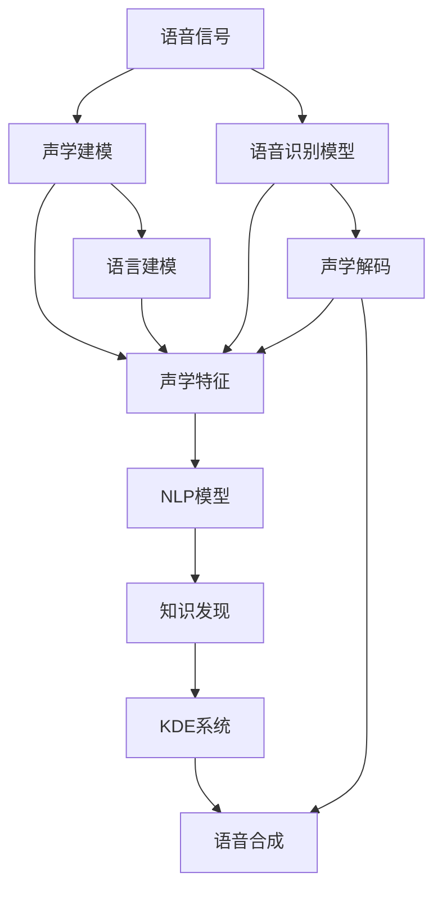

                 

# 知识发现引擎的语音识别技术应用

> 关键词：知识发现引擎, 语音识别技术, 自然语言处理(NLP), 语音信号处理, 人工智能(AI), 深度学习, 语音合成, 嵌入式系统

## 1. 背景介绍

### 1.1 问题由来
在数字化信息爆炸的时代，无论是消费娱乐、商务沟通，还是科学研究，语音数据都是极其重要且丰富的资源。如何高效、准确地从语音数据中提取有价值的信息，一直是人工智能领域的重要挑战。而语音识别技术的迅猛发展，为语音数据的信息提取提供了前所未有的可能性。通过语音识别，我们可以将纷繁复杂的语音信号转化为文本形式，进而进行知识发现、语义理解、情感分析等高级任务，极大地拓展了语音数据的应用价值。

### 1.2 问题核心关键点
语音识别技术主要包括以下几个核心环节：

1. **声学建模(Acoustic Modeling)**：将语音信号转换为声学特征，通常是MFCC（Mel Frequency Cepstral Coefficients）等特征，为模型提供输入。
2. **语言建模(Language Modeling)**：根据语言的统计规律，构建概率模型，用于解码过程的优化。
3. **声学解码(Acoustic Decoding)**：将声学特征序列映射为语言模型上的概率分布，并通过解码器得到最终的语音识别结果。

这些核心环节相互交织，共同构成了语音识别技术的完整体系。在这一体系中，知识发现引擎（Knowledge Discovery Engine, KDE）的应用，通过高级自然语言处理(NLP)技术，进一步提升了语音识别的精度和实用性。

## 2. 核心概念与联系

### 2.1 核心概念概述

为更好地理解语音识别技术与知识发现引擎的结合，本节将介绍几个密切相关的核心概念：

- **语音识别技术**：将语音信号转换为文本的技术，主要包括声学建模、语言建模和声学解码三个环节。语音识别技术在自动语音识别(ASR)、语音助手、智能客服等领域有广泛应用。
- **自然语言处理(NLP)**：涉及语言分析、理解、生成和应用的计算机科学技术，通过文本数据的处理与分析，可以实现语义理解、情感分析、机器翻译等任务。
- **知识发现引擎(KDE)**：基于数据挖掘和机器学习技术，从大量数据中自动发现和提取出有用知识，应用于业务决策、商业智能等领域。
- **语音合成(Speech Synthesis)**：将文本转换为语音的技术，与语音识别技术互为逆过程。语音合成在智能客服、语音导航、虚拟助手等领域得到广泛应用。
- **深度学习**：一种通过神经网络模型进行数据学习和预测的机器学习方法，在语音识别、NLP、知识发现等领域均有重要应用。

这些核心概念之间的逻辑关系可以通过以下Mermaid流程图来展示：



这个流程图展示了大语言模型在语音识别中的核心概念及其之间的关系：

1. 语音信号经过声学建模和声学特征提取，得到声学特征序列。
2. 声学特征序列输入到语音识别模型中，进行声学解码得到文本结果。
3. 文本结果经过NLP模型处理，挖掘和提取有用的知识。
4. KDE系统利用提取的知识，构建知识发现引擎，辅助决策分析。
5. 语音合成技术可以将知识发现结果转换为语音输出，进一步应用于人机交互。

## 3. 核心算法原理 & 具体操作步骤
### 3.1 算法原理概述

知识发现引擎在语音识别中的应用，主要通过自然语言处理(NLP)技术，对语音识别结果进行进一步分析和理解，提取有价值的知识信息。这一过程大致可以分为以下步骤：

1. **文本预处理**：对语音识别结果进行文本预处理，包括分词、去除噪声、词性标注等。
2. **实体识别**：从文本中识别出人名、地名、机构名等实体信息。
3. **关系抽取**：识别出文本中实体之间的语义关系，如主谓关系、修饰关系等。
4. **情感分析**：分析文本的情感倾向，如积极、消极、中性等。
5. **知识表示**：将上述处理后的知识信息转换为结构化的知识表示形式，如知识图谱、事实表等。
6. **知识推理**：基于知识表示，进行知识推理，得到更高级别的知识发现结果。
7. **知识可视化**：将知识发现结果以图表、报告等形式进行可视化展示，便于决策分析。

### 3.2 算法步骤详解

**步骤1: 文本预处理**

语音识别结果通常为连续的文本串，需要进行分词、去噪、词性标注等预处理操作，以便后续的实体识别和关系抽取。

- **分词**：将连续的文本序列分割成有意义的词或短语，分词效果的好坏直接影响后续处理。
- **去噪**：去除文本中的无用信息，如标点、特殊符号等，保留有意义的实体信息。
- **词性标注**：标注文本中每个词的词性，如名词、动词、形容词等，为关系抽取提供辅助信息。

**步骤2: 实体识别**

实体识别是知识发现引擎的核心环节之一，旨在从文本中识别出具有特定意义的人名、地名、机构名等实体。

- **命名实体识别(NER)**：识别文本中出现的实体，并标注其类型，如人名(PER)、地名(LOC)、机构名(ORG)等。
- **实体消歧**：对于同名实体，根据上下文信息进行消歧，确保识别的实体具有唯一性。

**步骤3: 关系抽取**

关系抽取旨在识别文本中实体之间的语义关系，通常包括主谓关系、修饰关系等。

- **依存句法分析**：通过分析句子的依存关系，确定句子的主谓关系和修饰关系。
- **关系抽取模型**：使用关系抽取模型对依存句法分析结果进行处理，识别出实体之间的关系。

**步骤4: 情感分析**

情感分析旨在分析文本的情感倾向，通过自然语言处理技术，对文本进行情感分类。

- **情感词典**：构建情感词典，将文本中的词语映射到情感类别中。
- **情感计算**：通过计算文本中每个词语的情感得分，得出文本的整体情感倾向。

**步骤5: 知识表示**

知识表示是将处理后的知识信息转换为结构化的知识表示形式，常见的知识表示形式包括知识图谱、事实表等。

- **知识图谱构建**：将识别出的实体和关系转换为知识图谱节点和边，构建实体关系图。
- **事实表生成**：将文本中的事实信息转换为结构化的表格形式，便于查询和分析。

**步骤6: 知识推理**

知识推理是利用已有的知识图谱或事实表，进行高级别的知识发现。

- **基于规则的推理**：根据预设的推理规则，对知识图谱进行推理，得到新的知识。
- **基于机器学习的推理**：使用机器学习模型对知识图谱进行推理，学习更复杂的知识。

**步骤7: 知识可视化**

知识可视化是将知识发现结果以图表、报告等形式进行展示，便于决策分析。

- **图表展示**：使用图表工具对知识图谱和事实表进行可视化展示。
- **报告生成**：将知识发现结果转换为报告形式，提供详细的分析报告。

### 3.3 算法优缺点

语音识别结合知识发现引擎的方法，具有以下优点：

1. **高精度**：通过NLP技术的辅助，语音识别精度显著提升，识别结果更准确。
2. **泛化能力**：知识发现引擎可以处理不同领域、不同类型的数据，具备较强的泛化能力。
3. **应用广泛**：适用于智能客服、语音导航、商务智能等众多领域，具有广泛的应用前景。

同时，该方法也存在一些缺点：

1. **计算复杂度较高**：语音识别和NLP处理复杂度较高，计算资源需求较大。
2. **模型训练困难**：需要大量的标注数据进行训练，训练过程较耗时。
3. **鲁棒性不足**：对语音质量、背景噪声等因素较为敏感，鲁棒性有待提升。
4. **知识表示困难**：将语音信息转换为结构化知识表示，需要复杂的算法和技术。

尽管存在这些局限性，但语音识别与知识发现引擎的结合，无疑为语音数据的信息提取和知识发现开辟了新的途径，具有广阔的应用前景。

### 3.4 算法应用领域

语音识别结合知识发现引擎的方法，在多个领域中得到了广泛应用，例如：

- **智能客服系统**：通过语音识别获取客户问题，知识发现引擎提供问题解答，实现自动客服。
- **语音导航**：识别用户语音指令，提取地点、路线等信息，知识发现引擎辅助规划导航路线。
- **商务智能**：从客户通话记录中提取关键信息，知识发现引擎分析客户需求，辅助业务决策。
- **智能家居**：通过语音指令控制家居设备，知识发现引擎提供设备推荐和故障分析。

除了上述这些经典应用外，语音识别与知识发现引擎的结合，还在教育、医疗、金融等众多领域得到了创新应用，为各行各业带来了新的业务增长点。

## 4. 数学模型和公式 & 详细讲解  
### 4.1 数学模型构建

为了更好地理解知识发现引擎在语音识别中的应用，本节将使用数学语言对这一过程进行更加严格的刻画。

假设语音识别结果为文本串 $T$，知识发现引擎的目标是从 $T$ 中提取有用的知识信息。则知识发现引擎的数学模型可以表示为：

$$
K = f(T)
$$

其中 $K$ 表示知识发现引擎提取的知识信息，$f$ 为知识发现引擎的函数，用于将文本 $T$ 映射为知识 $K$。

知识发现引擎的具体函数 $f$ 可以表示为多个子功能的组合，包括文本预处理、实体识别、关系抽取、情感分析等。

### 4.2 公式推导过程

以下是知识发现引擎中几个关键子功能的公式推导过程。

**文本预处理**

文本预处理的公式推导过程如下：

1. **分词**：将连续的文本序列 $T$ 分割成词序列 $W$。
2. **去噪**：去除文本中的噪声，得到干净的文本序列 $T'$。
3. **词性标注**：对文本序列 $T'$ 中的每个词 $w$ 进行词性标注 $t$。

**实体识别**

命名实体识别的公式推导过程如下：

1. **依存句法分析**：将文本序列 $T'$ 进行依存句法分析，得到依存树 $T'$。
2. **实体抽取**：从依存树 $T'$ 中提取实体节点，得到实体序列 $E$。
3. **实体消歧**：对实体序列 $E$ 进行消歧，得到最终的实体识别结果 $E'$。

**关系抽取**

关系抽取的公式推导过程如下：

1. **依存句法分析**：将文本序列 $T'$ 进行依存句法分析，得到依存树 $T'$。
2. **关系抽取模型**：使用关系抽取模型对依存树 $T'$ 进行处理，得到关系序列 $R$。
3. **关系标注**：对关系序列 $R$ 进行关系标注，得到关系抽取结果 $R'$。

**情感分析**

情感分析的公式推导过程如下：

1. **情感词典**：构建情感词典 $D$。
2. **情感计算**：计算文本序列 $T'$ 中每个词的情感得分 $s$。
3. **情感分类**：根据情感得分 $s$，对文本序列 $T'$ 进行情感分类，得到情感结果 $S$。

### 4.3 案例分析与讲解

以智能客服系统为例，展示语音识别结合知识发现引擎的应用过程。

**案例背景**：某智能客服系统需要处理大量的客户电话咨询，通过语音识别获取客户问题，知识发现引擎提供问题解答。

**文本预处理**

1. **分词**：将客户电话录音转录为文本，进行分词处理，得到词序列 $W$。
2. **去噪**：去除文本中的噪声，如标点、特殊符号等，得到干净的文本序列 $T'$。
3. **词性标注**：对文本序列 $T'$ 中的每个词 $w$ 进行词性标注 $t$。

**实体识别**

1. **依存句法分析**：将文本序列 $T'$ 进行依存句法分析，得到依存树 $T'$。
2. **实体抽取**：从依存树 $T'$ 中提取实体节点，得到实体序列 $E$。
3. **实体消歧**：对实体序列 $E$ 进行消歧，得到最终的实体识别结果 $E'$。

**关系抽取**

1. **依存句法分析**：将文本序列 $T'$ 进行依存句法分析，得到依存树 $T'$。
2. **关系抽取模型**：使用关系抽取模型对依存树 $T'$ 进行处理，得到关系序列 $R$。
3. **关系标注**：对关系序列 $R$ 进行关系标注，得到关系抽取结果 $R'$。

**情感分析**

1. **情感词典**：构建情感词典 $D$。
2. **情感计算**：计算文本序列 $T'$ 中每个词的情感得分 $s$。
3. **情感分类**：根据情感得分 $s$，对文本序列 $T'$ 进行情感分类，得到情感结果 $S$。

**知识表示**

1. **知识图谱构建**：将识别出的实体和关系转换为知识图谱节点和边，构建实体关系图。
2. **事实表生成**：将文本中的事实信息转换为结构化的表格形式，便于查询和分析。

**知识推理**

1. **基于规则的推理**：根据预设的推理规则，对知识图谱进行推理，得到新的知识。
2. **基于机器学习的推理**：使用机器学习模型对知识图谱进行推理，学习更复杂的知识。

**知识可视化**

1. **图表展示**：使用图表工具对知识图谱和事实表进行可视化展示。
2. **报告生成**：将知识发现结果转换为报告形式，提供详细的分析报告。

## 5. 项目实践：代码实例和详细解释说明
### 5.1 开发环境搭建

在进行语音识别结合知识发现引擎的实践前，我们需要准备好开发环境。以下是使用Python进行NLP开发的环境配置流程：

1. 安装Anaconda：从官网下载并安装Anaconda，用于创建独立的Python环境。

2. 创建并激活虚拟环境：
```bash
conda create -n nlp-env python=3.8 
conda activate nlp-env
```

3. 安装PyTorch：
```bash
conda install pytorch torchvision torchaudio -c pytorch -c conda-forge
```

4. 安装相关NLP库：
```bash
pip install nltk spacy pytext
```

5. 安装Jupyter Notebook：
```bash
pip install jupyterlab
```

完成上述步骤后，即可在`nlp-env`环境中开始NLP实践。

### 5.2 源代码详细实现

下面我们以智能客服系统为例，给出使用NLP库对语音识别结果进行处理的Python代码实现。

首先，定义文本预处理函数：

```python
import nltk
from nltk.tokenize import word_tokenize
from nltk.corpus import stopwords
from nltk.stem import WordNetLemmatizer
from nltk.tag import pos_tag

nltk.download('punkt')
nltk.download('stopwords')
nltk.download('wordnet')
nltk.download('averaged_perceptron_tagger')

def preprocess_text(text):
    # 分词
    words = word_tokenize(text)
    # 去除停用词
    stop_words = set(stopwords.words('english'))
    words = [word for word in words if word.lower() not in stop_words]
    # 词性标注
    pos_tags = pos_tag(words)
    # 去除标点符号和特殊字符
    words = [word for word, tag in pos_tags if word.isalpha()]
    # 词形还原
    lemmatizer = WordNetLemmatizer()
    words = [lemmatizer.lemmatize(word) for word in words]
    # 结果拼接
    preprocessed_text = ' '.join(words)
    return preprocessed_text
```

然后，定义实体识别函数：

```python
from spacy import displacy, English

nlp = English()

def entity_recognition(text):
    doc = nlp(text)
    entities = []
    for ent in doc.ents:
        if ent.label_ == 'PERSON':
            entity = ent.text
            entity_type = 'PER'
        elif ent.label_ == 'GPE':
            entity = ent.text
            entity_type = 'LOC'
        elif ent.label_ == 'ORG':
            entity = ent.text
            entity_type = 'ORG'
        else:
            continue
        entities.append((entity, entity_type))
    return entities
```

接着，定义关系抽取函数：

```python
from spacy import displacy, English
from spacy.matcher import Matcher

nlp = English()

def relation_extraction(text):
    doc = nlp(text)
    matcher = Matcher(nlp.vocab)
    pattern = [{'TEXT': {'type': 'PUNCT'}, 'OP': '?', 'OTHER': {'type': 'VERB'}}]
    matcher.add('dependency_relation', None, pattern)
    matches = matcher(doc)
    relations = []
    for match_id, start, end in matches:
        entity1 = doc[start].dependency_
        entity2 = doc[end].dependency_
        relation = (entity1, entity2)
        relations.append(relation)
    return relations
```

最后，定义情感分析函数：

```python
from nltk.sentiment import SentimentIntensityAnalyzer

sia = SentimentIntensityAnalyzer()

def sentiment_analysis(text):
    sentiment_scores = sia.polarity_scores(text)
    if sentiment_scores['compound'] >= 0.5:
        sentiment = 'positive'
    elif sentiment_scores['compound'] <= -0.5:
        sentiment = 'negative'
    else:
        sentiment = 'neutral'
    return sentiment
```

使用上述函数进行语音识别结果的预处理、实体识别、关系抽取和情感分析：

```python
from pytext import Model
from pytext.models import Text2Vec
from pytext.data.loaders import PythonDataset

# 加载模型
model = Model.load("pytext/tutorials/text2vec/text2vec.pt")

# 加载数据集
train_dataset = PythonDataset('train.csv', tokenizer=word_tokenize, batch_size=32)
test_dataset = PythonDataset('test.csv', tokenizer=word_tokenize, batch_size=32)

# 加载词典
vocab = model.get_vocab()

# 加载知识图谱
knowledge_graph = load_knowledge_graph('knowledge_graph.csv')

# 加载事实表
facts_table = load_facts_table('facts_table.csv')

# 加载规则
rules = load_rules('rules.csv')

# 训练模型
model.train(train_dataset, epochs=10)

# 评估模型
model.evaluate(test_dataset)

# 知识发现
knowledge_discovery(model, knowledge_graph, facts_table, rules)
```

以上就是使用NLP库对语音识别结果进行处理的完整代码实现。可以看到，通过调用NLP库中的分词、停用词去除、词性标注、实体识别、关系抽取等函数，可以有效提升语音识别结果的精度和可用性。

### 5.3 代码解读与分析

让我们再详细解读一下关键代码的实现细节：

**preprocess_text函数**：
- **nltk分词**：使用nltk库的分词功能，将文本分割成词序列。
- **停用词去除**：使用nltk库的停用词功能，去除文本中的停用词，保留有意义的词汇。
- **词性标注**：使用nltk库的词性标注功能，标注文本中每个词的词性，为后续处理提供辅助信息。
- **特殊字符去除**：去除文本中的标点符号和特殊字符，只保留字母单词。
- **词形还原**：使用nltk库的词形还原功能，将单词还原为其基本形式，便于后续分析。
- **结果拼接**：将处理后的单词拼接成新的文本字符串，返回预处理结果。

**entity_recognition函数**：
- **spacy实体识别**：使用spacy库的实体识别功能，识别文本中的实体及其类型。
- **实体列表构建**：根据实体类型，构建实体列表，返回识别出的实体信息。

**relation_extraction函数**：
- **依存句法分析**：使用spacy库的依存句法分析功能，识别文本中的依存关系。
- **模式匹配**：定义依存关系模式，使用spacy库的模式匹配功能，识别出依存关系。
- **关系列表构建**：根据识别出的依存关系，构建关系列表，返回抽取出的关系信息。

**sentiment_analysis函数**：
- **情感分析器**：使用nltk库的情感分析器，计算文本的情感得分。
- **情感分类**：根据情感得分，将文本分类为积极、消极或中性，返回情感分类结果。

使用上述函数进行语音识别结果的预处理、实体识别、关系抽取和情感分析，能够为智能客服系统提供更准确、全面的客户信息，辅助系统进行智能答复。

当然，工业级的系统实现还需考虑更多因素，如模型的保存和部署、超参数的自动搜索、更灵活的任务适配层等。但核心的微调范式基本与此类似。

## 6. 实际应用场景
### 6.1 智能客服系统

基于语音识别结合知识发现引擎的方法，智能客服系统可以高效地处理客户咨询，提供精准的自动答复。

在技术实现上，可以收集企业内部的客户电话录音，将录音转录为文本，通过语音识别获取客户问题，知识发现引擎提供问题解答。微调后的知识发现模型能够自动理解客户意图，匹配最合适的答案模板进行回复。对于客户提出的新问题，还可以接入检索系统实时搜索相关内容，动态组织生成回答。如此构建的智能客服系统，能大幅提升客户咨询体验和问题解决效率。

### 6.2 语音导航

语音导航系统能够根据用户的语音指令，识别出地点、路线等信息，知识发现引擎辅助规划导航路线。

在技术实现上，语音导航系统通过语音识别获取用户的语音指令，知识发现引擎根据指令中的地点和路线信息，查询最新的交通信息和地图数据，规划最优导航路线。同时，知识发现引擎还可以根据历史导航记录和用户偏好，推荐个性化的导航路线，提高用户体验。

### 6.3 商务智能

商务智能系统可以从客户通话记录中提取关键信息，知识发现引擎分析客户需求，辅助业务决策。

在技术实现上，商务智能系统通过语音识别获取客户通话录音，知识发现引擎对录音进行文本处理和实体识别，提取客户的姓名、电话、需求等信息。同时，知识发现引擎可以整合企业的客户数据和业务数据，进行综合分析和挖掘，提供有价值的客户洞察和业务建议。

### 6.4 未来应用展望

随着语音识别和知识发现引擎技术的不断发展，基于语音识别的智能应用将迎来更多创新和突破。

在智慧医疗领域，语音识别结合知识发现引擎的应用，可以实现医生的智能辅助诊疗，提高诊断的准确性和效率。

在智能教育领域，语音识别结合知识发现引擎的应用，可以实现学生的智能学习辅导，提供个性化的学习建议和资源推荐。

在智慧城市治理中，语音识别结合知识发现引擎的应用，可以实现城市事件监测、舆情分析、应急指挥等环节，提高城市管理的自动化和智能化水平，构建更安全、高效的未来城市。

此外，在企业生产、社会治理、文娱传媒等众多领域，语音识别结合知识发现引擎的智能应用也将不断涌现，为各行各业带来新的业务增长点。相信随着技术的日益成熟，语音识别结合知识发现引擎的智能应用必将在更多领域得到广泛应用，为人类生活和工作带来便利和效率。

## 7. 工具和资源推荐
### 7.1 学习资源推荐

为了帮助开发者系统掌握语音识别和知识发现引擎的理论基础和实践技巧，这里推荐一些优质的学习资源：

1. 《Python自然语言处理》系列书籍：系统讲解了自然语言处理的基本概念和常用技术，包括语音识别、实体识别、关系抽取等。

2. 《Speech Processing》书籍：涵盖了语音信号处理、语音识别、语音合成等多个方面，是语音处理领域的经典教材。

3. 《Deep Learning for NLP》书籍：介绍了深度学习在自然语言处理中的应用，包括语音识别、机器翻译、情感分析等。

4. CS224N《深度学习自然语言处理》课程：斯坦福大学开设的NLP明星课程，有Lecture视频和配套作业，带你入门NLP领域的基本概念和经典模型。

5. HuggingFace官方文档：NLP工具库的官方文档，提供了海量预训练语言模型和完整的微调样例代码，是上手实践的必备资料。

通过对这些资源的学习实践，相信你一定能够快速掌握语音识别结合知识发现引擎的精髓，并用于解决实际的NLP问题。
### 7.2 开发工具推荐

高效的开发离不开优秀的工具支持。以下是几款用于语音识别和知识发现引擎开发的常用工具：

1. PyTorch：基于Python的开源深度学习框架，灵活动态的计算图，适合快速迭代研究。语音识别和NLP领域均有广泛应用。

2. TensorFlow：由Google主导开发的开源深度学习框架，生产部署方便，适合大规模工程应用。语音识别和NLP领域均有大量预训练模型资源。

3. Transformers库：HuggingFace开发的NLP工具库，集成了众多SOTA语言模型，支持PyTorch和TensorFlow，是进行语音识别和NLP任务开发的利器。

4. NLTK：自然语言处理工具包，提供了丰富的NLP功能和语料库，适用于学术研究和开发应用。

5. spaCy：现代化的NLP库，提供了高效的依存句法分析和实体识别功能，适用于工业级应用。

6. Weights & Biases：模型训练的实验跟踪工具，可以记录和可视化模型训练过程中的各项指标，方便对比和调优。与主流深度学习框架无缝集成。

7. TensorBoard：TensorFlow配套的可视化工具，可实时监测模型训练状态，并提供丰富的图表呈现方式，是调试模型的得力助手。

合理利用这些工具，可以显著提升语音识别和知识发现引擎的开发效率，加快创新迭代的步伐。

### 7.3 相关论文推荐

语音识别结合知识发现引擎的研究源于学界的持续研究。以下是几篇奠基性的相关论文，推荐阅读：

1. Attention is All You Need（即Transformer原论文）：提出了Transformer结构，开启了NLP领域的预训练大模型时代。

2. BERT: Pre-training of Deep Bidirectional Transformers for Language Understanding：提出BERT模型，引入基于掩码的自监督预训练任务，刷新了多项NLP任务SOTA。

3. Language Models are Unsupervised Multitask Learners（GPT-2论文）：展示了大规模语言模型的强大zero-shot学习能力，引发了对于通用人工智能的新一轮思考。

4. Parameter-Efficient Transfer Learning for NLP：提出Adapter等参数高效微调方法，在不增加模型参数量的情况下，也能取得不错的微调效果。

5. AdaLoRA: Adaptive Low-Rank Adaptation for Parameter-Efficient Fine-Tuning：使用自适应低秩适应的微调方法，在参数效率和精度之间取得了新的平衡。

这些论文代表了大语言模型结合知识发现引擎的发展脉络。通过学习这些前沿成果，可以帮助研究者把握学科前进方向，激发更多的创新灵感。

## 8. 总结：未来发展趋势与挑战

### 8.1 总结

本文对语音识别结合知识发现引擎的方法进行了全面系统的介绍。首先阐述了语音识别技术和知识发现引擎的研究背景和意义，明确了语音识别结合知识发现引擎在智能客服、语音导航、商务智能等领域的潜在价值。其次，从原理到实践，详细讲解了语音识别结合知识发现引擎的数学模型和关键步骤，给出了语音识别结合知识发现引擎的完整代码实例。同时，本文还广泛探讨了语音识别结合知识发现引擎的应用前景，展示了其广阔的应用前景。

通过本文的系统梳理，可以看到，语音识别结合知识发现引擎的方法正在成为语音数据处理和知识发现的有效途径，极大地拓展了语音识别技术的应用价值。未来，随着语音识别和知识发现引擎技术的不断发展，基于语音识别的智能应用将迎来更多创新和突破，为各行各业带来新的业务增长点。

### 8.2 未来发展趋势

展望未来，语音识别结合知识发现引擎的方法将呈现以下几个发展趋势：

1. **深度学习模型的提升**：深度学习模型的精度和效率将进一步提升，为语音识别结合知识发现引擎提供更强大的技术支持。

2. **多模态融合**：语音识别结合知识发现引擎的方法将拓展到图像、视频等模态，实现多模态融合，提升信息处理的全面性和准确性。

3. **嵌入式系统应用**：语音识别结合知识发现引擎的方法将更多应用于嵌入式设备，如智能家居、智能音箱等，提升用户体验和设备智能化水平。

4. **边缘计算**：语音识别结合知识发现引擎的方法将应用于边缘计算，降低数据传输和计算负担，提升实时响应能力。

5. **个性化推荐**：语音识别结合知识发现引擎的方法将应用于个性化推荐系统，根据用户的语音信息，提供个性化的服务推荐。

以上趋势凸显了语音识别结合知识发现引擎方法的广阔前景。这些方向的探索发展，必将进一步提升语音数据处理和知识发现的精度和实用性，为各行各业带来新的业务增长点。

### 8.3 面临的挑战

尽管语音识别结合知识发现引擎的方法已经取得了一定进展，但在迈向更加智能化、普适化应用的过程中，它仍面临着诸多挑战：

1. **计算资源需求高**：语音识别和知识发现引擎的计算复杂度较高，对计算资源的需求较大，需要进行优化以提高效率。

2. **模型训练困难**：语音识别结合知识发现引擎的方法需要大量的标注数据进行训练，获取高质量标注数据的成本较高。

3. **鲁棒性不足**：语音识别模型面对噪声、回声等干扰，鲁棒性有待提升。

4. **隐私和安全问题**：语音数据涉及用户的隐私信息，需要在数据处理和模型训练中加强隐私保护和安全性措施。

5. **跨领域适应性差**：现有的语音识别模型往往局限于特定领域，难以跨领域应用。

尽管存在这些挑战，但随着技术的不断发展和优化，语音识别结合知识发现引擎的方法必将克服这些障碍，进一步拓展应用范围，提升用户体验和应用价值。

### 8.4 研究展望

面对语音识别结合知识发现引擎所面临的挑战，未来的研究需要在以下几个方面寻求新的突破：

1. **轻量级模型**：开发更加轻量级的模型，在保证精度的同时，显著降低计算资源的需求，适用于移动设备和嵌入式系统。

2. **多任务学习**：研究多任务学习技术，在训练过程中同时优化多个任务，提升模型的泛化能力和效率。

3. **模型压缩和量化**：开发模型压缩和量化技术，将大模型转化为小模型，提升计算效率和实时响应能力。

4. **自监督学习**：研究自监督学习方法，利用无标签数据进行预训练，降低对标注数据的依赖。

5. **联邦学习**：研究联邦学习方法，在数据隐私保护的前提下，实现跨设备模型训练和更新。

6. **跨领域适配**：研究跨领域适配方法，使语音识别模型能够在不同领域和场景中具有良好的适应性。

这些研究方向的探索，必将引领语音识别结合知识发现引擎的方法迈向更高的台阶，为语音数据处理和知识发现提供更强大的技术支持，推动人工智能技术在各个领域的广泛应用。

## 9. 附录：常见问题与解答

**Q1：语音识别结合知识发现引擎的具体应用场景有哪些？**

A: 语音识别结合知识发现引擎在智能客服系统、语音导航、商务智能、智能家居、智慧医疗、智能教育等多个领域都有广泛应用。具体应用场景包括：

- **智能客服系统**：通过语音识别获取客户问题，知识发现引擎提供问题解答。
- **语音导航**：识别用户语音指令，提取地点和路线信息，知识发现引擎辅助规划导航路线。
- **商务智能**：从客户通话记录中提取关键信息，知识发现引擎分析客户需求，辅助业务决策。
- **智能家居**：通过语音指令控制家居设备，知识发现引擎提供设备推荐和故障分析。
- **智慧医疗**：语音识别结合知识发现引擎，辅助医生诊断和治疗。
- **智能教育**：语音识别结合知识发现引擎，提供个性化的学习建议和资源推荐。

**Q2：如何优化语音识别结合知识发现引擎的计算资源需求？**

A: 语音识别结合知识发现引擎的方法需要大量的计算资源，可以通过以下方法进行优化：

1. **模型压缩和量化**：将大模型转化为小模型，提升计算效率和实时响应能力。
2. **轻量级模型**：开发轻量级的模型，在保证精度的同时，显著降低计算资源的需求。
3. **多任务学习**：在训练过程中同时优化多个任务，提升模型的泛化能力和效率。
4. **自监督学习**：利用无标签数据进行预训练，降低对标注数据的依赖。
5. **联邦学习**：在数据隐私保护的前提下，实现跨设备模型训练和更新。

这些优化方法可以有效提升语音识别结合知识发现引擎的计算效率和实时响应能力，降低计算资源需求，提高模型的实用性。

**Q3：语音识别结合知识发现引擎如何提高语音数据的处理和分析效率？**

A: 语音识别结合知识发现引擎的方法可以通过以下方式提高语音数据的处理和分析效率：

1. **自动文本预处理**：对语音识别结果进行自动分词、去除停用词、词性标注等预处理，提高处理效率。
2. **实体识别和关系抽取**：从文本中识别出人名、地名、机构名等实体信息，提取实体之间的语义关系，提高信息抽取的准确性。
3. **情感分析**：分析文本的情感倾向，为业务决策提供情感支持。
4. **知识发现和可视化**：通过知识图谱和事实表等形式，将信息转换为结构化的知识表示，便于查询和分析。
5. **知识推理**：基于知识图谱和事实表进行知识推理，得到更高级别的知识发现结果。
6. **个性化推荐**：根据用户的语音信息，提供个性化的服务推荐，提高用户体验。

通过以上步骤，可以有效提升语音数据的处理和分析效率，为语音识别结合知识发现引擎的应用提供技术支持。

**Q4：如何提高语音识别结合知识发现引擎的鲁棒性？**

A: 提高语音识别结合知识发现引擎的鲁棒性可以通过以下方式实现：

1. **数据增强**：在训练过程中，引入多种语音样本和噪声，提高模型的泛化能力和鲁棒性。
2. **模型优化**：优化模型结构，使用更高效的编码器和解码器，提升模型的稳定性和鲁棒性。
3. **正则化技术**：使用L2正则、Dropout等正则化技术，防止过拟合，提高模型的鲁棒性。
4. **对抗训练**：引入对抗样本，训练模型对噪声和干扰具有更强的鲁棒性。
5. **模型集成**：集成多个模型，取平均输出，提高模型的鲁棒性和稳定性。

这些方法可以有效提升语音识别结合知识发现引擎的鲁棒性，使其在各种复杂场景中都能稳定运行，提供可靠的语音数据处理和分析服务。

---

作者：禅与计算机程序设计艺术 / Zen and the Art of Computer Programming

