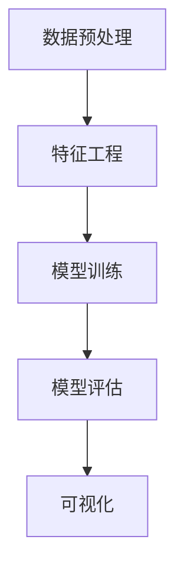

                 

# 知识发现引擎：开启知识应用新时代

## 1. 背景介绍

### 1.1 问题由来

在信息爆炸的时代，数据的重要性愈发凸显。各类企业、机构都在积累大量的数据资源，如何有效挖掘数据价值，驱动业务创新，成为亟待解决的问题。传统的统计学和机器学习方法在数据挖掘方面虽然有其优势，但在面对复杂多变的数据结构、稀疏数据和高维数据时，显得力不从心。

大数据技术的兴起，为解决这些问题提供了新的工具和方法。数据挖掘、数据分析和数据可视化等技术，极大地提升了数据价值挖掘的效率和准确性。然而，这些技术通常需要领域专家参与设计，对数据预处理、算法选择和模型训练等环节的要求较高。这不仅增加了数据挖掘的成本，也限制了其普及应用。

知识发现引擎(Knowledge Discovery Engine, KDE)的提出，正是为了解决这一问题。它以数据为中心，通过对数据进行智能化处理，自动抽取、分析、总结其中的知识，并将其转化为可用的业务洞察。

### 1.2 问题核心关键点

知识发现引擎的本质是一种基于数据挖掘技术的智能系统，通过自动化的方式从海量数据中提取有价值的信息。它具备以下几个核心特点：

- **自动化**：知识发现引擎能够自动处理数据，从数据预处理、特征工程到模型训练等环节，无需人工干预，大大降低了数据挖掘的复杂度。
- **智能化**：系统通过机器学习算法，自动学习数据中隐含的规律和模式，并能够根据业务需求进行灵活调整。
- **实时化**：知识发现引擎具备实时分析能力，能够在数据产生的同时进行快速处理和反馈，满足动态业务需求。
- **可视化**：系统能够以图表、报表等形式直观展示分析结果，帮助用户快速理解数据背后的业务价值。

这些特点使得知识发现引擎在商业决策支持、风险评估、客户关系管理等领域有着广泛的应用前景。

## 2. 核心概念与联系

### 2.1 核心概念概述

为了更好地理解知识发现引擎的工作原理，本节将介绍几个关键的概念：

- **数据挖掘(Data Mining)**：通过算法从原始数据中自动抽取有用信息的过程，包括分类、聚类、关联规则挖掘等任务。
- **知识发现(Knowledge Discovery)**：利用数据挖掘技术，从数据中提取出能够被理解、解释和应用的显性或隐性知识。
- **数据预处理(Data Preprocessing)**：对原始数据进行清洗、归一化、特征提取等处理，以保证数据的质量和可用性。
- **特征工程(Feature Engineering)**：根据数据特征，设计合适的特征集，以提升数据挖掘的效果。
- **机器学习(Machine Learning)**：利用算法训练模型，自动学习数据中的规律和模式，从而实现数据预测和分类。
- **模型评估(Model Evaluation)**：通过评估指标，如准确率、召回率、F1分数等，对模型的性能进行客观评估。
- **可视化(Visualization)**：将数据挖掘结果以图表、报表等形式展示，便于用户理解和应用。

这些概念之间相互关联，共同构成了知识发现引擎的工作流程。数据预处理、特征工程和模型训练是数据挖掘的核心环节，而模型评估和可视化则是对挖掘结果的解释和应用。

### 2.2 核心概念原理和架构的 Mermaid 流程图



这个流程图展示了知识发现引擎的基本工作流程。从原始数据入手，通过预处理和特征工程，构造出可供模型训练的数据集。模型训练完成后，通过评估指标对模型性能进行评估，并最终将结果以可视化的形式展示出来。

## 3. 核心算法原理 & 具体操作步骤

### 3.1 算法原理概述

知识发现引擎的核心算法包括数据预处理、特征工程、模型训练和模型评估。本节将详细介绍这些算法的工作原理。

### 3.2 算法步骤详解

#### 数据预处理

数据预处理是对原始数据进行清洗、归一化、特征提取等处理，以保证数据的质量和可用性。以下是常见的数据预处理步骤：

1. **缺失值处理**：填充或删除缺失值，保证数据完整性。
2. **去重处理**：去除数据中的重复记录，避免信息冗余。
3. **归一化处理**：将数据进行归一化，使得不同特征具有相同的量纲，便于后续处理。
4. **特征提取**：根据业务需求，选择合适的特征进行提取，如文本特征、时间特征等。

#### 特征工程

特征工程是在数据预处理的基础上，进一步构造出更加适合模型训练的特征集。常见的特征工程方法包括：

1. **特征选择**：从原始特征中筛选出对目标变量有较强预测能力的特征，减少冗余特征。
2. **特征构造**：通过组合、变换等方式构造新的特征，增强模型的表达能力。
3. **降维处理**：将高维特征空间映射到低维空间，减少计算量和存储空间。

#### 模型训练

模型训练是利用已构造好的特征集，通过机器学习算法训练出适合特定问题的模型。常见的模型训练方法包括：

1. **监督学习**：使用有标签的数据集训练模型，预测新数据的标签。
2. **无监督学习**：使用无标签的数据集训练模型，发现数据中的隐含模式。
3. **半监督学习**：结合有标签和无标签数据，提高模型的泛化能力。

#### 模型评估

模型评估是对训练好的模型进行性能评估，以判断其在新数据上的表现。常见的模型评估方法包括：

1. **准确率**：预测结果与真实结果一致的比例。
2. **召回率**：真实结果被正确预测的比例。
3. **F1分数**：综合考虑准确率和召回率，反映模型的综合性能。
4. **ROC曲线**：绘制不同阈值下的真正率与假正率曲线，评估模型的分类性能。

### 3.3 算法优缺点

知识发现引擎在数据挖掘和知识发现方面具有显著优势，但也存在一些局限性：

#### 优点

1. **自动化**：自动化的数据处理流程大大降低了数据挖掘的复杂度和成本。
2. **智能化**：利用机器学习算法，自动学习数据中的规律和模式，减少了人工干预的需要。
3. **实时化**：具备实时分析能力，能够满足动态业务需求。
4. **可视化**：通过图表、报表等形式直观展示分析结果，便于用户理解和应用。

#### 缺点

1. **数据质量依赖**：知识发现引擎的效果很大程度上依赖于原始数据的质量，数据缺失、噪声和异常值等都会影响结果。
2. **模型选择困难**：面对复杂多变的数据结构，选择合适的模型和算法仍然是挑战。
3. **可解释性不足**：一些机器学习模型（如深度学习）通常难以解释其内部工作机制，增加了用户理解和使用难度。
4. **计算资源要求高**：数据挖掘和机器学习算法通常计算量较大，需要高性能计算资源支持。

## 4. 数学模型和公式 & 详细讲解 & 举例说明

### 4.1 数学模型构建

本节将使用数学语言对知识发现引擎的基本流程进行严格刻画。

假设有一组数据集 $D=\{(x_i,y_i)\}_{i=1}^N$，其中 $x_i$ 为输入特征，$y_i$ 为标签。

定义数据预处理函数 $preprocess(x_i)$，用于对原始数据进行清洗、归一化和特征提取等处理。

定义特征工程函数 $feature_engineering(x_i)$，用于构造新的特征，如时间特征、文本特征等。

定义机器学习模型 $M_{\theta}$，其中 $\theta$ 为模型参数，用于对特征集进行训练。

定义模型评估函数 $evaluate(M_{\theta},D)$，用于计算模型的评估指标，如准确率、召回率等。

定义可视化函数 $visualize(M_{\theta},D)$，用于将模型结果以图表、报表等形式展示。

### 4.2 公式推导过程

以下我们以分类任务为例，推导准确率的计算公式及其梯度计算。

假设模型 $M_{\theta}$ 在输入 $x_i$ 上的预测输出为 $\hat{y}=M_{\theta}(x_i)$。

根据准确率的定义，第 $i$ 个样本的预测结果与真实结果一致的比例为：

$$
a_i=\begin{cases}
1 & y_i=\hat{y}_i \\
0 & y_i \neq \hat{y}_i 
\end{cases}
$$

则整体准确率为：

$$
\text{accuracy}=\frac{1}{N}\sum_{i=1}^N a_i
$$

将 $a_i$ 带入准确率公式，得：

$$
\text{accuracy}=\frac{1}{N}\sum_{i=1}^N y_i\hat{y}_i
$$

在得到准确率的表达式后，我们可以通过梯度下降等优化算法对模型 $M_{\theta}$ 进行训练，最小化损失函数：

$$
\min_{\theta} \mathcal{L}(M_{\theta},D)
$$

其中 $\mathcal{L}$ 为交叉熵损失函数，用于衡量预测结果与真实标签之间的差异。

### 4.3 案例分析与讲解

以一个简单的电商推荐系统为例，展示知识发现引擎的实际应用。

假设有一组用户行为数据 $D=\{(x_i,y_i)\}_{i=1}^N$，其中 $x_i$ 为用户的历史浏览记录，$y_i$ 为用户后续是否购买了该商品。

首先，对原始数据进行预处理，去除缺失值、重复记录，并对用户浏览记录进行归一化处理。

然后，进行特征工程，构造出时间间隔、浏览次数等特征，以增强模型的表达能力。

接着，使用随机森林等机器学习算法训练模型，预测用户是否购买商品。

最后，计算模型的准确率、召回率等评估指标，并利用可视化工具展示推荐结果。

## 5. 项目实践：代码实例和详细解释说明

### 5.1 开发环境搭建

在进行知识发现引擎的开发前，我们需要准备好开发环境。以下是使用Python进行Pandas、Scikit-learn、Matplotlib等工具库的开发环境配置流程：

1. 安装Anaconda：从官网下载并安装Anaconda，用于创建独立的Python环境。

2. 创建并激活虚拟环境：
```bash
conda create -n kde-env python=3.8 
conda activate kde-env
```

3. 安装Pandas：
```bash
conda install pandas
```

4. 安装Scikit-learn：
```bash
conda install scikit-learn
```

5. 安装Matplotlib：
```bash
conda install matplotlib
```

6. 安装Jupyter Notebook：
```bash
conda install jupyter notebook
```

完成上述步骤后，即可在`kde-env`环境中开始知识发现引擎的开发。

### 5.2 源代码详细实现

这里我们以一个简单的用户推荐系统为例，给出使用Pandas、Scikit-learn等工具库进行知识发现引擎开发的Python代码实现。

首先，定义数据预处理函数：

```python
import pandas as pd
import numpy as np

def preprocess_data(df):
    # 去除缺失值
    df = df.dropna()
    # 去重处理
    df = df.drop_duplicates()
    # 归一化处理
    df = (df - df.mean()) / df.std()
    return df
```

然后，定义特征工程函数：

```python
from sklearn.preprocessing import OneHotEncoder, StandardScaler

def feature_engineering(df):
    # 时间特征构造
    time_features = pd.to_datetime(df['timestamp']).dt.hour
    time_features = time_features.map(lambda x: int(x))
    df['hour'] = time_features
    # 文本特征提取
    text_features = df['description'].apply(lambda x: x.lower().split())
    text_features = pd.DataFrame(text_features, columns=['words'])
    # 向量化处理
    encoder = OneHotEncoder(sparse=False)
    encoded_text = encoder.fit_transform(text_features)
    df = pd.concat([df, encoded_text], axis=1)
    # 归一化处理
    df = pd.DataFrame(df, columns=[col for col in df.columns if col != 'id'])
    scaler = StandardScaler()
    df[df.columns] = scaler.fit_transform(df[df.columns])
    return df
```

接着，定义模型训练函数：

```python
from sklearn.ensemble import RandomForestClassifier

def train_model(df, target):
    X = df.drop(target, axis=1)
    y = df[target]
    clf = RandomForestClassifier()
    clf.fit(X, y)
    return clf
```

最后，定义模型评估和可视化函数：

```python
import matplotlib.pyplot as plt
import seaborn as sns

def evaluate_model(clf, df, target):
    y_pred = clf.predict(df)
    accuracy = np.mean(y_pred == df[target])
    print(f'Accuracy: {accuracy:.2f}')
    
    # 绘制混淆矩阵
    cm = confusion_matrix(df[target], y_pred)
    sns.heatmap(cm, annot=True, fmt='d', cmap='Blues')
    plt.title('Confusion Matrix')
    plt.show()
    
def visualize_model(clf, df, target):
    y_pred = clf.predict(df)
    plt.scatter(df[target], y_pred)
    plt.xlabel('Actual')
    plt.ylabel('Predicted')
    plt.title('Prediction vs Actual')
    plt.show()
```

完成上述步骤后，即可在Jupyter Notebook中构建知识发现引擎的框架。

### 5.3 代码解读与分析

让我们再详细解读一下关键代码的实现细节：

**数据预处理函数preprocess_data**：
- 去除缺失值、重复记录，并进行归一化处理。

**特征工程函数feature_engineering**：
- 构造时间特征和文本特征，并进行向量化处理。

**模型训练函数train_model**：
- 使用随机森林算法对特征集进行训练，返回训练好的模型。

**模型评估函数evaluate_model**：
- 计算准确率，并绘制混淆矩阵，展示模型性能。

**可视化函数visualize_model**：
- 绘制预测值与实际值的散点图，直观展示模型效果。

## 6. 实际应用场景

### 6.1 金融风控

在金融领域，欺诈检测是防范金融风险的重要手段。传统的规则引擎通常难以覆盖所有欺诈行为，且容易受到新欺诈手段的欺骗。而利用知识发现引擎，可以通过对历史交易数据的智能化处理，自动学习并发现隐含的欺诈模式，从而提高欺诈检测的准确性和效率。

具体而言，可以收集金融交易的各类数据，如交易金额、时间、地点、交易类型等，输入到知识发现引擎中。通过对数据进行清洗和特征工程，构造出适合机器学习算法的特征集。利用随机森林等模型训练欺诈检测模型，并结合实时交易数据进行动态评估。一旦发现异常交易行为，系统即可发出预警，帮助金融机构及时采取措施，防范金融风险。

### 6.2 智能医疗

智能医疗是知识发现引擎的重要应用领域之一。通过智能化的数据挖掘，可以有效提升诊疗效率和诊断准确率，改善医疗服务质量。

在智能医疗中，知识发现引擎可以应用于疾病预测、病历分析、药物研发等方面。例如，可以通过对电子病历数据进行挖掘，自动发现患者的病情变化趋势，预测可能的疾病风险。或者通过分析药物的临床试验数据，发现不同药物间的相互作用和疗效差异，指导医生合理用药。

### 6.3 电商推荐

电商推荐系统是知识发现引擎的典型应用之一。通过智能化处理用户行为数据，系统能够精准推荐用户可能感兴趣的商品，提高用户满意度，提升销售额。

在电商推荐系统中，知识发现引擎可以应用于商品推荐、广告投放、用户画像构建等方面。例如，通过对用户的浏览、购买行为进行数据挖掘，自动发现用户的兴趣偏好，推荐相关的商品。或者通过分析广告点击率数据，动态调整广告投放策略，提高广告效果。

## 7. 工具和资源推荐

### 7.1 学习资源推荐

为了帮助开发者系统掌握知识发现引擎的理论基础和实践技巧，这里推荐一些优质的学习资源：

1. 《数据挖掘导论》：由斯坦福大学Jeffrey Heer教授所写，是数据挖掘领域的经典教材，系统讲解了数据挖掘的基本概念和方法。

2. 《Python数据科学手册》：由Jake VanderPlas教授所写，介绍了Python在数据科学中的应用，包括数据清洗、特征工程、模型训练等环节。

3. Coursera的《数据科学与机器学习》课程：由斯坦福大学的Andrew Ng教授所讲授，覆盖了数据科学和机器学习的核心内容，适合初学者入门。

4. Kaggle平台：全球最大的数据科学竞赛平台，提供了丰富的数据集和实战项目，有助于提升数据挖掘能力。

5. Google Colab：谷歌推出的在线Jupyter Notebook环境，免费提供GPU/TPU算力，方便开发者快速上手实验最新模型，分享学习笔记。

通过对这些资源的学习实践，相信你一定能够快速掌握知识发现引擎的精髓，并用于解决实际的业务问题。

### 7.2 开发工具推荐

高效的开发离不开优秀的工具支持。以下是几款用于知识发现引擎开发的常用工具：

1. Pandas：用于数据处理和分析的Python库，支持数据清洗、特征工程等环节。

2. Scikit-learn：Python机器学习库，提供了丰富的机器学习算法和评估工具。

3. Matplotlib：用于数据可视化的Python库，支持绘制图表、报表等展示形式。

4. Jupyter Notebook：交互式编程环境，方便开发者进行代码编写和实时调试。

5. Google Colab：谷歌推出的在线Jupyter Notebook环境，免费提供GPU/TPU算力，适合大规模数据处理和模型训练。

6. Dask：用于大规模数据处理和计算的Python库，支持分布式计算和并行处理。

合理利用这些工具，可以显著提升知识发现引擎的开发效率，加快创新迭代的步伐。

### 7.3 相关论文推荐

知识发现引擎的研究源于学界的持续探索。以下是几篇奠基性的相关论文，推荐阅读：

1. Jaccard 1897年提出的集合相似性度量方法，奠定了后续数据挖掘算法的基础。

2. SVM算法（支持向量机），通过构造最优超平面，实现分类和回归任务。

3. K-Means算法（K均值聚类），通过划分数据点，实现数据聚类和分组。

4. Apriori算法（关联规则挖掘），通过频繁项集挖掘，发现数据中的隐含关联关系。

5. PageRank算法（网页排名），通过计算网页权重，实现网页排序和推荐。

这些论文代表了大数据挖掘技术的发展脉络。通过学习这些前沿成果，可以帮助研究者把握学科前进方向，激发更多的创新灵感。

## 8. 总结：未来发展趋势与挑战

### 8.1 总结

本文对知识发现引擎的工作原理和实际应用进行了全面系统的介绍。首先阐述了知识发现引擎在数据挖掘和业务洞察方面的优势，明确了其在金融风控、智能医疗、电商推荐等多个领域的应用潜力。其次，从原理到实践，详细讲解了知识发现引擎的数学模型和操作步骤，给出了知识发现引擎开发的完整代码实例。最后，本文还广泛探讨了知识发现引擎的最新发展趋势和面临的挑战，提供了系统性的学习资源和工具推荐。

通过本文的系统梳理，可以看到，知识发现引擎在商业决策支持、风险评估、客户关系管理等领域有着广泛的应用前景。未来，伴随大数据技术的不断发展，知识发现引擎将进一步拓展其应用边界，为各行各业带来更多创新机遇。

### 8.2 未来发展趋势

展望未来，知识发现引擎的发展将呈现以下几个趋势：

1. **自动化程度提升**：随着机器学习算法的不断成熟，知识发现引擎的自动化程度将进一步提升，减少人工干预，提高数据挖掘效率。

2. **模型可解释性增强**：面对越来越多的业务需求，知识发现引擎需要具备更强的可解释性，以便用户理解和信任其输出结果。

3. **实时分析能力增强**：实时数据处理和分析将成为知识发现引擎的核心需求，系统需要具备更强的实时分析和响应能力。

4. **跨领域应用拓展**：知识发现引擎将更多地应用于跨领域数据分析，实现数据的多维度整合和挖掘。

5. **边缘计算支持**：随着物联网技术的发展，知识发现引擎将在边缘计算设备上得到广泛应用，提高数据处理的效率和安全性。

6. **联邦学习推广**：通过联邦学习等分布式计算技术，知识发现引擎可以在不共享数据的情况下进行模型训练，保护数据隐私。

以上趋势将推动知识发现引擎向更加智能化、自动化、安全化的方向发展，为各行业提供更高效、可靠的决策支持。

### 8.3 面临的挑战

尽管知识发现引擎在数据挖掘和业务洞察方面取得了显著成果，但在其发展和应用过程中，仍面临一些挑战：

1. **数据隐私和安全**：知识发现引擎通常需要处理大量敏感数据，如何保护数据隐私和安全，防止数据泄露和滥用，仍是一个重要问题。

2. **数据质量和多样性**：知识发现引擎的效果很大程度上依赖于数据的质量和多样性。如何确保数据的完整性和一致性，处理缺失值和噪声数据，是关键挑战。

3. **模型复杂性和计算资源**：知识发现引擎的复杂性和计算需求较高，如何优化模型结构和算法，降低计算资源消耗，提高数据处理效率，是一个重要的研究方向。

4. **可解释性和透明性**：一些机器学习模型（如深度学习）通常难以解释其内部工作机制，增加了用户理解和使用难度。如何赋予模型更强的可解释性，是亟待解决的问题。

5. **跨领域知识整合**：知识发现引擎在跨领域数据分析中面临数据异构、结构复杂等问题，如何整合不同领域的数据，实现多源数据的协同分析，是未来的研究重点。

6. **人工智能伦理**：随着知识发现引擎在业务决策中的作用增强，如何确保其输出的透明性和公正性，避免偏见和歧视，也是一个重要的伦理问题。

以上挑战需要多方协作，共同推进知识发现引擎的进一步发展和应用。

### 8.4 研究展望

面向未来，知识发现引擎的研究将在以下几个方向寻求新的突破：

1. **自动化数据处理**：开发更加智能化的数据预处理和特征工程方法，减少人工干预，提高数据挖掘效率。

2. **多源数据融合**：探索跨领域数据的整合和协同分析方法，实现数据的多维度挖掘。

3. **弱监督学习和自监督学习**：利用弱监督和自监督学习技术，提高模型在数据量不足情况下的泛化能力。

4. **联邦学习与分布式计算**：结合联邦学习和分布式计算技术，实现跨机构、跨设备的数据处理和模型训练。

5. **深度学习与强化学习**：探索深度学习和强化学习在知识发现中的应用，提升模型的复杂表达能力和决策能力。

6. **解释性与透明性**：研究可解释性强的机器学习模型，增强模型的透明性和用户信任度。

7. **知识图谱与语义网络**：结合知识图谱和语义网络技术，实现对实体关系和知识结构的挖掘和分析。

8. **人机协同**：探索人机协同的知识发现方法，提升系统对用户反馈的响应能力和用户参与度。

9. **隐私保护与伦理约束**：研究数据隐私保护和伦理约束的方法，确保知识发现引擎的公平性和公正性。

这些研究方向将推动知识发现引擎技术的不断进步，为各行各业带来更多创新机遇。

## 9. 附录：常见问题与解答

**Q1：知识发现引擎是否适用于所有业务场景？**

A: 知识发现引擎在数据挖掘和业务洞察方面具有广泛的应用前景，但并非适用于所有业务场景。面对一些高度定制化、业务复杂度较高的场景，如航天、军事等领域，知识发现引擎可能需要结合专业知识进行定制化开发。

**Q2：知识发现引擎的自动化程度如何？**

A: 知识发现引擎的自动化程度在不断提高。通过机器学习算法和自动化工具的不断优化，系统能够自动完成数据预处理、特征工程和模型训练等环节，显著降低了人工干预的需要。然而，对于复杂多变的数据结构和任务需求，仍需人工参与进行任务设计和模型评估。

**Q3：知识发现引擎的计算资源需求如何？**

A: 知识发现引擎通常需要大量的计算资源，特别是在处理大规模数据和高复杂度模型时。如何优化算法和模型结构，降低计算资源消耗，提高数据处理效率，是一个重要的研究方向。

**Q4：知识发现引擎的可解释性如何？**

A: 部分机器学习模型（如线性模型、决策树等）具有较好的可解释性，能够清晰地解释模型的内部工作机制和决策逻辑。然而，深度学习等复杂模型通常难以解释其内部工作机制，增加了用户理解和使用难度。

**Q5：知识发现引擎的未来发展方向是什么？**

A: 知识发现引擎的未来发展方向包括自动化数据处理、多源数据融合、弱监督学习、联邦学习、深度学习、解释性模型、知识图谱、人机协同、隐私保护和伦理约束等。这些方向的探索将推动知识发现引擎技术的不断进步，为各行各业带来更多创新机遇。

---

作者：禅与计算机程序设计艺术 / Zen and the Art of Computer Programming

