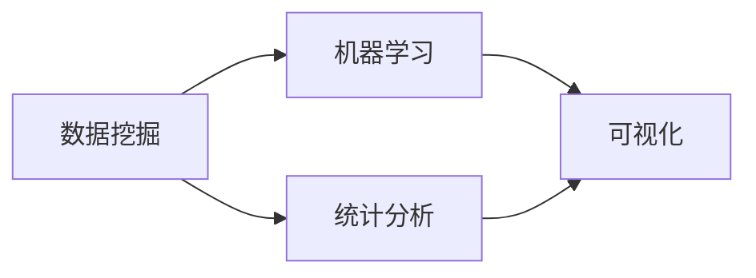

                 

# 知识发现引擎：打造企业竞争优势的秘密武器

## 1. 背景介绍

在当今信息爆炸的时代，知识已经成为企业竞争中不可或缺的战略资源。随着大数据技术的发展，企业拥有了前所未有的数据资源。但如何从海量数据中提取有价值的知识，利用数据驱动决策，成为了企业面临的重大挑战。

知识发现引擎（Knowledge Discovery Engine, KDE）正是在这样的背景下应运而生，它利用数据挖掘、机器学习等技术，帮助企业从数据中挖掘出有价值的知识，辅助决策，提升竞争力。本文将系统介绍知识发现引擎的核心概念、算法原理与应用实践，探讨其在企业中的应用前景，并提出未来发展趋势与挑战。

## 2. 核心概念与联系

### 2.1 核心概念概述

知识发现引擎是一种通过数据挖掘和机器学习技术，从海量数据中自动发现、提取、抽象、组织和呈现知识的软件系统。它的主要目标是从原始数据中挖掘出有价值的知识，辅助企业决策，提升业务性能。

知识发现引擎涉及到的核心概念包括：

- **数据挖掘(Data Mining)**：从原始数据中提取有用信息和模式的过程。
- **机器学习(Machine Learning)**：通过学习数据规律，构建预测模型，用于数据分析和决策。
- **统计分析(Statistical Analysis)**：利用统计学方法，揭示数据的内在规律和趋势。
- **可视化(Visualization)**：将数据转换为直观的图形，帮助用户理解数据和知识。

这些概念之间相互关联，形成一个完整的知识发现流程：首先通过数据挖掘从数据中提取潜在知识，然后利用机器学习和统计分析技术对知识进行模式识别和规律挖掘，最终通过可视化手段呈现结果，辅助用户决策。

### 2.2 核心概念原理和架构的 Mermaid 流程图



### 2.3 概念联系与交互关系

在知识发现引擎中，数据挖掘、机器学习、统计分析和可视化四者之间存在紧密的交互关系：

- **数据挖掘**：从数据集中提取潜在的模式和规律。
- **机器学习**：通过学习挖掘到的模式和规律，构建预测模型。
- **统计分析**：对机器学习模型进行统计评估，确保模型的可靠性和准确性。
- **可视化**：将模型分析结果转换为直观的图形，帮助用户理解和应用。

这种交互关系使得知识发现引擎能够全面、准确地从数据中提取有价值的知识，辅助企业决策，提升业务性能。

## 3. 核心算法原理 & 具体操作步骤

### 3.1 算法原理概述

知识发现引擎的核心算法包括数据挖掘、机器学习和统计分析等技术。以下详细介绍这些算法的原理及其在知识发现中的应用。

- **数据挖掘算法**：如关联规则挖掘、分类算法、聚类算法等，用于从数据中提取模式和规律。
- **机器学习算法**：如决策树、随机森林、神经网络等，用于构建预测模型，对数据进行分类、回归等操作。
- **统计分析算法**：如假设检验、回归分析、因子分析等，用于评估模型性能和数据可靠性。

### 3.2 算法步骤详解

#### 数据预处理

数据预处理是知识发现的首要步骤，主要包括以下几个环节：

1. **数据清洗**：去除重复、缺失、噪声等无用数据，保证数据质量。
2. **数据转换**：将数据转换为适合算法处理的格式，如归一化、标准化等。
3. **数据集成**：将多个数据源的数据进行合并和统一，构建完整的数据集。

#### 特征工程

特征工程是知识发现中不可或缺的一环，主要包括以下几个步骤：

1. **特征选择**：从原始数据中筛选出最具代表性的特征，去除冗余信息。
2. **特征提取**：通过降维、编码等方法，将高维特征转换为低维特征。
3. **特征转换**：利用数学变换、编码技术，提升特征的可解释性和可预测性。

#### 模型训练

模型训练是知识发现的核心步骤，主要包括以下几个环节：

1. **模型选择**：根据问题类型选择合适的机器学习算法，如分类、回归、聚类等。
2. **模型训练**：利用训练集数据训练模型，调整模型参数，优化模型性能。
3. **模型评估**：利用验证集数据评估模型性能，确保模型具有良好的泛化能力。

#### 知识呈现

知识呈现是知识发现最后一步，主要包括以下几个步骤：

1. **数据可视化**：将模型分析结果转换为图形、图表等可视化形式，帮助用户理解。
2. **知识抽取**：从模型分析结果中提取有价值的信息，辅助决策。
3. **报告生成**：将知识呈现结果生成报告，便于用户参考。

### 3.3 算法优缺点

知识发现引擎具有以下优点：

1. **高效性**：通过自动化流程，能够快速从数据中提取有用知识，提升决策效率。
2. **准确性**：利用数据挖掘和机器学习技术，能够准确挖掘数据中的模式和规律。
3. **可扩展性**：能够处理大规模数据集，满足企业对大数据处理的需求。

同时，知识发现引擎也存在以下缺点：

1. **数据依赖性**：依赖数据质量，数据不完整或不准确会影响结果。
2. **模型复杂性**：构建的模型可能过于复杂，难以解释和维护。
3. **技术门槛**：需要较高的技术水平和专业知识，操作门槛较高。

### 3.4 算法应用领域

知识发现引擎在多个领域得到了广泛应用，包括：

- **金融**：用于信用风险评估、客户细分、投资组合优化等。
- **零售**：用于客户行为分析、产品推荐、库存管理等。
- **医疗**：用于疾病预测、药物发现、患者分类等。
- **制造**：用于质量控制、设备故障预测、供应链优化等。
- **能源**：用于能源需求预测、设备运行监测、能效优化等。

以上领域只是冰山一角，知识发现引擎的应用领域还在不断扩展，其应用前景十分广阔。

## 4. 数学模型和公式 & 详细讲解 & 举例说明

### 4.1 数学模型构建

知识发现引擎的数学模型构建主要包括以下几个步骤：

1. **数据表示**：将原始数据转换为模型可处理的格式。
2. **特征选择**：从数据中选择最具代表性的特征。
3. **模型训练**：构建预测模型，训练模型参数。
4. **模型评估**：评估模型性能，确保模型具有良好的泛化能力。
5. **结果呈现**：将模型分析结果转换为可视化形式，辅助决策。

### 4.2 公式推导过程

以分类问题为例，展示知识发现引擎的数学模型构建过程。

1. **数据表示**：将原始数据 $x$ 表示为向量形式 $\mathbf{x} \in \mathbb{R}^n$。
2. **特征选择**：从 $n$ 个特征中选择 $m$ 个最具代表性的特征，记为 $\mathbf{x}_m$。
3. **模型训练**：利用训练集 $\mathcal{D} = \{(\mathbf{x}_i, y_i)\}_{i=1}^N$ 训练分类模型 $h(\mathbf{x})$，其中 $y_i \in \{0, 1\}$ 表示分类标签。
4. **模型评估**：利用验证集 $\mathcal{V}$ 评估模型性能，计算准确率、召回率等指标。
5. **结果呈现**：将模型分析结果可视化，生成分类结果报告。

### 4.3 案例分析与讲解

以信用风险评估为例，展示知识发现引擎的应用过程。

1. **数据预处理**：清洗数据，去除重复、缺失数据，标准化数据格式。
2. **特征工程**：选择影响信用风险的关键特征，如年龄、收入、信用历史等。
3. **模型训练**：利用逻辑回归、决策树等算法训练信用风险预测模型。
4. **模型评估**：利用验证集评估模型性能，确保模型具有良好的泛化能力。
5. **知识呈现**：将模型分析结果转换为图形、图表等可视化形式，生成信用风险评估报告。

## 5. 项目实践：代码实例和详细解释说明

### 5.1 开发环境搭建

#### 环境要求

- **硬件要求**：多核CPU、4GB以上内存、2GB以上显存（推荐使用NVIDIA GPU）。
- **软件要求**：Python 3.7及以上版本，推荐使用Anaconda虚拟环境。

#### 环境搭建步骤

1. 安装Anaconda，创建虚拟环境，激活虚拟环境。
2. 安装必要的Python包，如pandas、numpy、scikit-learn、matplotlib等。
3. 安装机器学习框架，如TensorFlow、PyTorch等。
4. 下载并解压所需的数据集，进行数据预处理。

### 5.2 源代码详细实现

以逻辑回归模型为例，展示知识发现引擎的代码实现。

```python
import pandas as pd
from sklearn.model_selection import train_test_split
from sklearn.linear_model import LogisticRegression
from sklearn.metrics import accuracy_score
import matplotlib.pyplot as plt

# 读取数据集
data = pd.read_csv('credit_data.csv')

# 数据预处理
data = data.dropna()
X = data[['age', 'income', 'credit_history']]
y = data['default']

# 划分训练集和验证集
X_train, X_valid, y_train, y_valid = train_test_split(X, y, test_size=0.2, random_state=42)

# 模型训练
model = LogisticRegression()
model.fit(X_train, y_train)

# 模型评估
y_pred = model.predict(X_valid)
accuracy = accuracy_score(y_valid, y_pred)
print('Accuracy:', accuracy)

# 结果可视化
plt.bar(X_valid['age'], y_valid, label='Actual')
plt.bar(X_valid['age'], y_pred, color='red', label='Predicted')
plt.xlabel('Age')
plt.ylabel('Default')
plt.legend()
plt.show()
```

### 5.3 代码解读与分析

代码实现主要包括以下几个步骤：

1. **数据读取**：使用pandas库读取CSV格式的数据集。
2. **数据预处理**：清洗数据，去除重复、缺失数据，标准化数据格式。
3. **特征选择**：选择影响信用风险的关键特征，如年龄、收入、信用历史等。
4. **模型训练**：利用逻辑回归算法训练信用风险预测模型。
5. **模型评估**：利用验证集评估模型性能，计算准确率。
6. **结果可视化**：将模型分析结果转换为图形，生成信用风险评估报告。

## 6. 实际应用场景

### 6.1 金融风险管理

知识发现引擎在金融风险管理中的应用非常广泛，主要包括以下几个方面：

1. **信用风险评估**：通过分析客户历史行为和信用记录，评估其信用风险，辅助贷款审批。
2. **欺诈检测**：利用异常检测算法，识别可疑交易，防止金融欺诈。
3. **投资组合优化**：通过分析历史数据，预测市场趋势，优化投资组合，提高投资收益。

### 6.2 零售客户行为分析

在零售领域，知识发现引擎可以用于以下方面：

1. **客户细分**：利用聚类算法，将客户分为不同的细分市场，实现精准营销。
2. **产品推荐**：通过分析客户行为，推荐相关产品，提高客户满意度。
3. **库存管理**：利用预测算法，预测产品需求，优化库存管理，降低成本。

### 6.3 医疗疾病预测

在医疗领域，知识发现引擎可以用于以下方面：

1. **疾病预测**：通过分析患者历史病历，预测其可能患有的疾病，辅助医生诊断。
2. **药物发现**：利用分类算法，识别具有潜在疗效的化合物，加速药物研发。
3. **患者分类**：通过聚类算法，将患者分为不同的群体，制定个性化治疗方案。

### 6.4 未来应用展望

未来，知识发现引擎将会在更多领域得到广泛应用，成为企业数字化转型中的重要工具。以下是几个可能的未来应用方向：

1. **智能制造**：通过分析设备运行数据，预测设备故障，优化生产计划，提高生产效率。
2. **智慧城市**：利用城市交通、环境等数据，优化城市管理，提高生活质量。
3. **农业生产**：通过分析气象、土壤等数据，预测农作物产量，优化种植方案，提高农业生产效益。
4. **智慧物流**：利用货物运输数据，优化配送路线，提高物流效率。

## 7. 工具和资源推荐

### 7.1 学习资源推荐

1. **《数据挖掘导论》**：郭晓军等著，全面介绍数据挖掘的基本概念和算法。
2. **《机器学习实战》**：Peter Harrington著，实战型机器学习入门读物。
3. **《Python数据科学手册》**：Jake VanderPlas著，介绍数据科学中的Python技术栈。
4. **Kaggle竞赛**：Kaggle平台提供了大量数据挖掘和机器学习竞赛，可供学习参考。
5. **Coursera课程**：Coursera平台提供了大量数据挖掘和机器学习课程，由斯坦福、MIT等知名高校提供。

### 7.2 开发工具推荐

1. **Jupyter Notebook**：用于编写和分享Python代码，支持代码块和输出结果的展示。
2. **PyCharm**：Python开发工具，支持代码自动补全、调试、版本控制等功能。
3. **TensorFlow**：Google开发的机器学习框架，支持深度学习模型的构建和训练。
4. **PyTorch**：Facebook开发的深度学习框架，支持动态图模型构建和训练。
5. **Tableau**：数据可视化工具，支持复杂图表和报表的生成。

### 7.3 相关论文推荐

1. **《数据挖掘导论》**：D. J. Heckerman等著，介绍数据挖掘的基本概念和算法。
2. **《机器学习实战》**：Peter Harrington著，实战型机器学习入门读物。
3. **《Python数据科学手册》**：Jake VanderPlas著，介绍数据科学中的Python技术栈。
4. **Kaggle竞赛**：Kaggle平台提供了大量数据挖掘和机器学习竞赛，可供学习参考。
5. **Coursera课程**：Coursera平台提供了大量数据挖掘和机器学习课程，由斯坦福、MIT等知名高校提供。

## 8. 总结：未来发展趋势与挑战

### 8.1 研究成果总结

知识发现引擎在过去几年中取得了显著进展，主要表现在以下几个方面：

1. **算法多样化**：从单一的分类算法发展到集成学习、神经网络等多样化算法。
2. **技术平台化**：从单机部署发展到分布式计算，能够处理大规模数据集。
3. **应用普及化**：从金融、零售等传统领域扩展到医疗、智能制造等多个领域。

### 8.2 未来发展趋势

未来的知识发现引擎将呈现以下几个发展趋势：

1. **算法智能化**：通过深度学习、强化学习等技术，提升算法的智能化水平，提高预测准确性。
2. **模型可解释化**：通过可解释性技术，提升模型的可解释性，帮助用户理解和应用。
3. **数据实时化**：通过实时计算技术，实现数据的实时处理和分析，满足企业的实时需求。
4. **应用场景化**：根据不同行业特点，开发定制化的知识发现引擎，提升应用效果。
5. **跨领域融合**：结合不同领域知识，开发跨领域知识发现引擎，实现知识融合。

### 8.3 面临的挑战

知识发现引擎在应用过程中也面临着诸多挑战：

1. **数据质量问题**：数据不完整、不准确、噪声过多等问题，影响结果的可靠性。
2. **算法复杂性**：算法过于复杂，难以解释和维护，增加开发和运营成本。
3. **技术门槛高**：需要较高的技术水平和专业知识，操作门槛较高。
4. **隐私和安全问题**：数据敏感信息泄露、数据篡改等安全问题，需要严格的隐私保护措施。

### 8.4 研究展望

为了解决上述挑战，未来的研究需要在以下几个方面寻求突破：

1. **数据预处理技术**：研究高效的数据清洗和预处理方法，提高数据质量。
2. **算法可解释性技术**：研究可解释性技术，提升算法的可解释性，帮助用户理解和应用。
3. **实时计算技术**：研究实时计算技术，提升数据处理速度和分析效率。
4. **跨领域融合技术**：研究跨领域知识发现技术，实现不同领域知识的融合应用。
5. **隐私保护技术**：研究隐私保护技术，确保数据安全性和隐私保护。

总之，知识发现引擎作为打造企业竞争优势的秘密武器，具有广阔的应用前景和深远的影响力。未来的研究需要在技术、应用、隐私保护等多个方面不断突破，才能更好地满足企业的需求，推动企业数字化转型。

## 9. 附录：常见问题与解答

### Q1：什么是知识发现引擎？

A：知识发现引擎（KDE）是一种通过数据挖掘和机器学习技术，从海量数据中自动发现、提取、抽象、组织和呈现知识的软件系统。它的主要目标是从原始数据中挖掘出有价值的知识，辅助企业决策，提升业务性能。

### Q2：知识发现引擎的核心算法有哪些？

A：知识发现引擎的核心算法包括数据挖掘算法、机器学习算法和统计分析算法。具体包括：

- 数据挖掘算法：如关联规则挖掘、分类算法、聚类算法等，用于从数据中提取模式和规律。
- 机器学习算法：如决策树、随机森林、神经网络等，用于构建预测模型，对数据进行分类、回归等操作。
- 统计分析算法：如假设检验、回归分析、因子分析等，用于评估模型性能和数据可靠性。

### Q3：知识发现引擎的应用场景有哪些？

A：知识发现引擎在多个领域得到了广泛应用，包括：

- 金融：用于信用风险评估、客户细分、投资组合优化等。
- 零售：用于客户行为分析、产品推荐、库存管理等。
- 医疗：用于疾病预测、药物发现、患者分类等。
- 制造：用于质量控制、设备故障预测、供应链优化等。
- 能源：用于能源需求预测、设备运行监测、能效优化等。

### Q4：知识发现引擎的实现过程包括哪些步骤？

A：知识发现引擎的实现过程主要包括以下几个步骤：

1. 数据预处理：清洗数据，去除重复、缺失数据，标准化数据格式。
2. 特征工程：选择影响目标的关键特征，如年龄、收入、信用历史等。
3. 模型训练：利用训练集数据训练模型，调整模型参数，优化模型性能。
4. 模型评估：利用验证集评估模型性能，确保模型具有良好的泛化能力。
5. 结果呈现：将模型分析结果转换为可视化形式，生成决策报告。

### Q5：知识发现引擎的优缺点有哪些？

A：知识发现引擎具有以下优点：

1. 高效性：通过自动化流程，能够快速从数据中提取有用知识，提升决策效率。
2. 准确性：利用数据挖掘和机器学习技术，能够准确挖掘数据中的模式和规律。
3. 可扩展性：能够处理大规模数据集，满足企业对大数据处理的需求。

同时，知识发现引擎也存在以下缺点：

1. 数据依赖性：依赖数据质量，数据不完整或不准确会影响结果。
2. 模型复杂性：构建的模型可能过于复杂，难以解释和维护。
3. 技术门槛：需要较高的技术水平和专业知识，操作门槛较高。

---

作者：禅与计算机程序设计艺术 / Zen and the Art of Computer Programming

