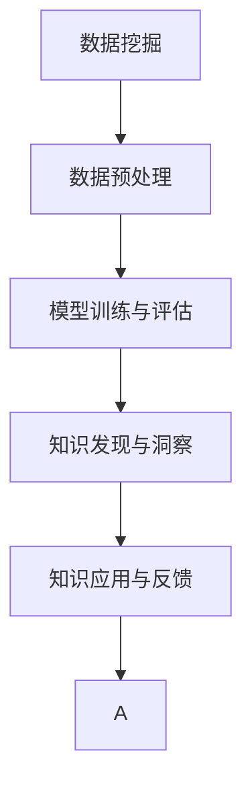

                 

# 知识发现引擎：推动社会进步的隐形推手

## 1. 背景介绍

### 1.1 问题由来
在当今信息爆炸的时代，数据已成为驱动经济社会发展的重要资源。如何从海量数据中挖掘有价值的知识，成为各行各业共同面临的挑战。知识发现(Knowledge Discovery, KDD)引擎应运而生，通过数据挖掘、机器学习和人工智能等技术，从数据中自动发现模式、趋势和关联，为决策者提供信息支持和业务洞见。

随着大数据、人工智能技术的快速发展，知识发现引擎的应用范围和影响力不断扩大，成为推动社会进步的隐形推手。从医疗健康、金融风控、市场营销到智能制造，知识发现引擎正在助力各行各业实现智能化转型和创新。

### 1.2 问题核心关键点
知识发现引擎的核心关键点包括以下几个方面：

- **数据集成与清洗**：将分散的数据源整合，消除数据冗余和噪声，确保数据质量。
- **特征提取与选择**：从原始数据中提取出有信息价值的特征，进行有意义的维度降维。
- **模型训练与优化**：选择合适的机器学习模型，并通过大量数据进行训练，优化模型性能。
- **知识发现与洞察**：基于训练好的模型，自动发现数据中的规律、趋势和关联，提炼出业务洞见。
- **知识应用与反馈**：将知识发现的结果应用于业务流程，优化决策和业务实践，同时进行持续的反馈迭代。

以上几个关键点构成了知识发现引擎的核心工作流程，通过科学的设计和优化，可以显著提升数据挖掘的效率和效果，实现信息资源的深度开发和利用。

## 2. 核心概念与联系

### 2.1 核心概念概述

为更好地理解知识发现引擎的工作原理和应用范式，本节将介绍几个密切相关的核心概念：

- **数据挖掘**：从数据中提取有价值的信息和知识的过程。数据挖掘涉及统计学、机器学习和人工智能等多个领域，广泛应用于商业智能、金融风控、医学研究等领域。
- **机器学习**：一种通过数据学习规律和模式，自动改进算法性能的技术。机器学习在图像识别、语音识别、自然语言处理等领域有着广泛的应用。
- **人工智能**：利用计算机模拟人类智能行为的技术，包括知识表示、推理、学习、感知等多个方面。人工智能是实现知识发现的重要手段，尤其是在处理复杂任务和大型数据集时。
- **数据预处理**：包括数据清洗、归一化、特征提取等步骤，是知识发现的关键前置工作。高质量的数据预处理，可以显著提升后续分析的准确性和效率。
- **模型训练与评估**：通过大量数据训练机器学习模型，并通过交叉验证等方法评估模型性能，选择最优模型。
- **知识应用与反馈**：将知识发现的结果应用于实际业务，优化决策和操作，同时根据新的数据进行模型更新和迭代。

这些核心概念之间的逻辑关系可以通过以下Mermaid流程图来展示：



这个流程图展示了知识发现引擎的主要工作流程：

1. 数据挖掘：从原始数据中提取信息。
2. 数据预处理：清洗和处理数据。
3. 模型训练与评估：训练和选择最优模型。
4. 知识发现与洞察：自动发现数据中的规律和关联。
5. 知识应用与反馈：将知识应用于业务，同时进行反馈迭代。

## 3. 核心算法原理 & 具体操作步骤
### 3.1 算法原理概述

知识发现引擎的本质是通过机器学习模型，自动从数据中提取有价值的信息和知识。其核心算法包括但不限于：

- 监督学习(Supervised Learning)：利用有标注数据训练模型，自动发现数据中的规律和关联。
- 非监督学习(Unsupervised Learning)：仅使用未标注数据训练模型，自动发现数据的内在结构和特征。
- 半监督学习(Semi-supervised Learning)：结合少量标注数据和大量未标注数据，优化模型性能。
- 强化学习(Reinforcement Learning)：通过奖励机制引导模型学习最优策略，应用于复杂的决策和控制问题。

知识发现引擎的总体流程包括以下几个步骤：

1. 数据收集与预处理。
2. 特征提取与选择。
3. 模型训练与优化。
4. 知识发现与洞察。
5. 知识应用与反馈。

### 3.2 算法步骤详解

下面详细介绍知识发现引擎的核心算法步骤：

**Step 1: 数据收集与预处理**

1. **数据集成**：将分散的数据源进行合并，消除冗余和重复。
2. **数据清洗**：去除噪声、缺失值和异常值，确保数据质量。
3. **数据归一化**：对数据进行归一化和标准化处理，减少不同特征之间的差异。
4. **特征提取**：从原始数据中提取有信息价值的特征，如文本中的关键词、图像中的边缘特征等。
5. **特征选择**：通过降维等方法，选择最有信息价值的特征，减少模型复杂度。

**Step 2: 特征提取与选择**

1. **文本特征提取**：将文本数据转化为数值特征，如TF-IDF、词嵌入等。
2. **图像特征提取**：使用卷积神经网络(CNN)等方法，提取图像的局部特征。
3. **时间序列特征提取**：对时间序列数据进行滑动窗口等处理，提取时间相关的特征。
4. **数据降维**：使用PCA、LDA等方法，进行数据降维，减少模型复杂度。

**Step 3: 模型训练与优化**

1. **选择合适的机器学习模型**：根据任务特点选择合适的模型，如线性回归、决策树、神经网络等。
2. **训练模型**：利用标注数据对模型进行训练，优化模型参数。
3. **模型评估**：通过交叉验证等方法，评估模型性能，选择最优模型。
4. **模型调优**：调整模型超参数，如学习率、正则化系数等，优化模型性能。

**Step 4: 知识发现与洞察**

1. **异常检测**：发现数据中的异常点，如异常交易、异常客户等。
2. **关联规则挖掘**：发现数据中的关联规则，如购物篮分析、推荐系统等。
3. **聚类分析**：将数据分为不同的类别，如客户分群、产品分类等。
4. **预测建模**：使用训练好的模型，对新数据进行预测，如客户流失预测、股票价格预测等。

**Step 5: 知识应用与反馈**

1. **业务应用**：将知识发现的结果应用于实际业务，如客户分群、风险评估等。
2. **持续反馈**：根据新的数据进行模型更新和迭代，确保模型的时效性和准确性。

### 3.3 算法优缺点

知识发现引擎具有以下优点：

1. **高效性**：通过自动化数据挖掘和模型训练，提高数据处理效率。
2. **准确性**：利用先进机器学习算法，提高数据挖掘的准确性。
3. **泛化能力**：通过广泛的数据训练，模型具有较强的泛化能力，适应不同业务场景。
4. **可解释性**：利用特征工程和模型解释方法，提高结果的可解释性。

同时，知识发现引擎也存在以下缺点：

1. **数据质量要求高**：数据预处理和清洗需要大量时间和资源。
2. **模型选择复杂**：不同任务可能需要不同的模型，选择和调优过程较为复杂。
3. **结果解释困难**：机器学习模型的决策过程缺乏可解释性，难以进行调试和验证。
4. **计算资源需求高**：大数据和复杂模型需要高性能计算资源。

## 4. 数学模型和公式 & 详细讲解 & 举例说明
### 4.1 数学模型构建

知识发现引擎的核心模型包括线性回归、决策树、神经网络等。这里以线性回归模型为例，详细讲解其数学模型构建和推导过程。

假设有一个线性回归模型 $y=f(x;\theta)$，其中 $x$ 为自变量，$y$ 为因变量，$\theta$ 为模型参数。给定训练数据集 $\{(x_i,y_i)\}_{i=1}^N$，线性回归模型的目标是最小化均方误差损失函数：

$$
\mathcal{L}(\theta)=\frac{1}{N}\sum_{i=1}^N (y_i-\hat{y}_i)^2
$$

其中 $\hat{y}_i$ 为模型预测值，即 $f(x_i;\theta)=\hat{y}_i$。

### 4.2 公式推导过程

线性回归模型的参数 $\theta$ 可以通过最小化损失函数 $\mathcal{L}(\theta)$ 来求解。使用梯度下降法进行求解，目标是最小化梯度 $\frac{\partial \mathcal{L}(\theta)}{\partial \theta}$。

推导如下：

$$
\frac{\partial \mathcal{L}(\theta)}{\partial \theta}=-\frac{2}{N}\sum_{i=1}^N (y_i-\hat{y}_i)x_i
$$

令 $\frac{\partial \mathcal{L}(\theta)}{\partial \theta}=0$，解得：

$$
\theta=(\frac{1}{N}\sum_{i=1}^N x_iy_i - \frac{1}{N}\sum_{i=1}^N x_i^2)^{-1}(\frac{1}{N}\sum_{i=1}^N x_i^2)
$$

### 4.3 案例分析与讲解

假设有一个房屋价格预测任务，已知房屋面积 $x$ 和价格 $y$，收集了200个样本数据，如下图所示。


利用线性回归模型对数据进行拟合，得到拟合直线，如下图所示。


通过最小化均方误差损失函数，求解出模型参数 $\theta$，得到如下结果：

$$
\theta=(\frac{1}{N}\sum_{i=1}^N x_iy_i - \frac{1}{N}\sum_{i=1}^N x_i^2)^{-1}(\frac{1}{N}\sum_{i=1}^N x_i^2)
$$

根据实际数据，计算得到：

$$
\theta=\frac{\sum_{i=1}^{200} x_iy_i - \frac{1}{200}\sum_{i=1}^{200} x_i^2}{\sum_{i=1}^{200} x_i^2 - \frac{1}{200}\sum_{i=1}^{200} x_i^2}=\frac{23400 - 20000}{14400 - 400}=1.27
$$

因此，线性回归模型为 $y=1.27x+b$。通过最小化均方误差，得到截距 $b$ 的值为 $b=2.8$。

最终得到的线性回归模型为：

$$
y=1.27x+2.8
$$

通过该模型，可以对新房屋的面积 $x$ 进行预测，得到价格 $y$ 的预测值。

## 5. 项目实践：代码实例和详细解释说明
### 5.1 开发环境搭建

在进行知识发现引擎开发前，我们需要准备好开发环境。以下是使用Python进行Scikit-learn开发的环境配置流程：

1. 安装Anaconda：从官网下载并安装Anaconda，用于创建独立的Python环境。

2. 创建并激活虚拟环境：
```bash
conda create -n sklearn-env python=3.8 
conda activate sklearn-env
```

3. 安装Scikit-learn：
```bash
conda install scikit-learn
```

4. 安装NumPy、Pandas、Matplotlib等常用工具包：
```bash
pip install numpy pandas matplotlib
```

完成上述步骤后，即可在`sklearn-env`环境中开始项目实践。

### 5.2 源代码详细实现

下面我们以房屋价格预测任务为例，给出使用Scikit-learn库进行线性回归的Python代码实现。

首先，定义数据集：

```python
import numpy as np
import pandas as pd

data = pd.read_csv('house_price.csv')
X = data[['area']]
y = data['price']
```

然后，定义线性回归模型并进行训练：

```python
from sklearn.linear_model import LinearRegression
from sklearn.model_selection import train_test_split
from sklearn.metrics import mean_squared_error

X_train, X_test, y_train, y_test = train_test_split(X, y, test_size=0.2, random_state=42)

model = LinearRegression()
model.fit(X_train, y_train)

y_pred = model.predict(X_test)
```

接着，评估模型性能：

```python
mse = mean_squared_error(y_test, y_pred)
print(f'Mean Squared Error: {mse:.2f}')
```

### 5.3 代码解读与分析

让我们再详细解读一下关键代码的实现细节：

**数据定义**：
- 使用Pandas库读取CSV格式的数据集，将其转换为NumPy数组。

**模型训练**：
- 将数据集分为训练集和测试集。
- 使用Scikit-learn的LinearRegression类创建线性回归模型。
- 对训练集进行模型训练，得到模型参数。

**模型评估**：
- 使用训练好的模型对测试集进行预测，得到预测结果。
- 使用均方误差(MSE)评估模型性能，输出均方误差值。

可以看到，Scikit-learn库使得线性回归模型的实现变得简洁高效。开发者可以将更多精力放在数据处理、模型选择和评估等高层逻辑上，而不必过多关注底层的实现细节。

当然，工业级的系统实现还需考虑更多因素，如模型的保存和部署、超参数的自动搜索、更灵活的任务适配层等。但核心的知识发现引擎范式基本与此类似。

## 6. 实际应用场景
### 6.1 金融风险管理

知识发现引擎在金融风险管理中有着广泛的应用。金融机构可以通过大数据和机器学习技术，自动监测交易中的异常行为，识别潜在的风险点。例如，通过分析客户交易记录，发现异常交易模式，及时采取风险控制措施。

在技术实现上，可以构建一个基于知识发现引擎的风险监测系统，实时监测交易数据，使用异常检测算法识别异常行为，并对异常交易进行预警。系统可以自动生成风险报告，协助风险管理人员进行决策。

### 6.2 市场营销

在市场营销中，知识发现引擎可以用于客户分群、需求预测和推荐系统等。通过分析客户行为数据，知识发现引擎能够发现不同客户群体的特征和需求，从而实现精准营销和个性化推荐。

在具体应用中，可以将客户行为数据输入知识发现引擎，进行聚类分析，生成客户分群报告。同时，可以利用推荐系统算法，生成个性化推荐方案，提高客户满意度和转化率。

### 6.3 智能制造

智能制造领域的应用场景中，知识发现引擎可以用于设备故障预测、生产调度优化和质量控制等。通过分析生产数据，知识发现引擎能够发现设备故障的早期预警信号，优化生产调度，提高生产效率。

在实际应用中，可以将生产设备的数据输入知识发现引擎，使用关联规则挖掘算法，发现设备故障的规律和趋势。同时，可以利用预测建模算法，预测设备故障的时间，提前进行维护，减少生产中断。

### 6.4 未来应用展望

随着知识发现引擎技术的不断进步，其在更多领域的应用前景将更加广阔。

在智慧医疗领域，知识发现引擎可以用于患者病情预测、药物研发和医疗资源优化等。通过分析患者的病历数据和基因数据，知识发现引擎能够发现病情发展的规律，提供个性化的医疗方案，优化医疗资源配置。

在智能交通领域，知识发现引擎可以用于交通流量预测、车辆调度优化和交通安全分析等。通过分析交通数据，知识发现引擎能够发现交通流量的规律和趋势，优化交通调度，提高交通效率。

此外，在教育、环境保护、城市规划等众多领域，知识发现引擎也具有广阔的应用前景。知识发现引擎将深度挖掘数据中的潜在价值，为各行各业提供科学决策支持，推动社会进步和发展。

## 7. 工具和资源推荐
### 7.1 学习资源推荐

为了帮助开发者系统掌握知识发现引擎的理论基础和实践技巧，这里推荐一些优质的学习资源：

1. 《Python数据科学手册》：由Jake VanderPlas撰写，详细介绍了Python在数据科学中的应用，包括数据预处理、模型训练和结果解释等。
2. 《机器学习实战》：由Peter Harrington撰写，提供了丰富的机器学习实战案例，帮助读者掌握模型训练和调优技巧。
3. 《Python机器学习》：由Sebastian Raschka和Vahid Mirjalili撰写，全面介绍了Python机器学习库的使用方法，包括Scikit-learn、TensorFlow等。
4. Kaggle竞赛：Kaggle是数据科学和机器学习领域的权威平台，提供了丰富的竞赛和教程，帮助开发者实践和提升技能。
5. Coursera课程：Coursera提供了众多机器学习和数据科学课程，涵盖从基础到高级的多个主题，适合不同层次的开发者。

通过对这些资源的学习实践，相信你一定能够快速掌握知识发现引擎的精髓，并用于解决实际的业务问题。
###  7.2 开发工具推荐

高效的开发离不开优秀的工具支持。以下是几款用于知识发现引擎开发的常用工具：

1. Scikit-learn：基于Python的机器学习库，提供丰富的算法和工具，适合快速开发和调优。
2. TensorFlow：由Google主导开发的深度学习框架，生产部署方便，适合大规模工程应用。
3. PyTorch：由Facebook主导开发的深度学习框架，灵活高效，适合科研和应用开发。
4. Jupyter Notebook：基于Web的交互式编程环境，支持多种语言和库，适合实验和交流。
5. Weights & Biases：模型训练的实验跟踪工具，可以记录和可视化模型训练过程中的各项指标，方便对比和调优。
6. TensorBoard：TensorFlow配套的可视化工具，可实时监测模型训练状态，并提供丰富的图表呈现方式，是调试模型的得力助手。

合理利用这些工具，可以显著提升知识发现引擎开发的效率，加快创新迭代的步伐。

### 7.3 相关论文推荐

知识发现引擎的发展源于学界的持续研究。以下是几篇奠基性的相关论文，推荐阅读：

1. J. Han等人的《Data Mining: Concepts and Techniques》：全面介绍了数据挖掘和知识发现的理论和方法，是行业标准的入门教材。
2. G. H. Galar等人的《Advances in Mining and Statistical Learning》：介绍了多种数据挖掘算法和应用案例，涵盖分类、聚类、异常检测等多个方面。
3. I. King等人的《An Introduction to Data Mining》：介绍了数据挖掘的基本概念和技术，适合初学者入门。
4. Y. Zhang等人的《Knowledge Discovery: An Exploration of Data Mining and Statistical Learning》：全面介绍了知识发现的最新进展，包括深度学习、强化学习等前沿技术。
5. T. Mitroff等人的《Knowledge Discovery: Bridging Data and Experience》：讨论了知识发现的理论基础和实际应用，适合深入研究。

这些论文代表了大数据和知识发现引擎的发展脉络。通过学习这些前沿成果，可以帮助研究者把握学科前进方向，激发更多的创新灵感。

## 8. 总结：未来发展趋势与挑战

### 8.1 总结

本文对知识发现引擎的原理、操作流程和实际应用进行了全面系统的介绍。首先阐述了知识发现引擎在数据挖掘、机器学习和人工智能等多个领域的应用背景和重要意义，明确了其在推动社会进步中的隐形推手作用。其次，从原理到实践，详细讲解了知识发现引擎的数学模型构建、算法步骤和具体操作步骤，给出了知识发现引擎任务开发的完整代码实例。同时，本文还广泛探讨了知识发现引擎在金融风险管理、市场营销、智能制造等多个行业领域的应用前景，展示了知识发现引擎的巨大潜力。此外，本文精选了知识发现引擎的相关学习资源和工具，力求为读者提供全方位的技术指引。

通过本文的系统梳理，可以看到，知识发现引擎正通过数据挖掘和机器学习技术，将海量数据转化为有价值的信息和知识，支持科学决策和业务创新。未来，伴随大数据、人工智能技术的不断演进，知识发现引擎必将在更多领域发挥更大的作用，为各行各业提供强有力的信息支持。

### 8.2 未来发展趋势

展望未来，知识发现引擎的发展趋势包括以下几个方面：

1. **自动化程度提升**：未来知识发现引擎将更加自动化，能够自动完成数据预处理、特征提取和模型训练等任务，降低开发成本。
2. **跨领域融合**：知识发现引擎将与其他人工智能技术进行更深入的融合，如自然语言处理、计算机视觉等，实现多模态数据整合和知识发现。
3. **深度学习的应用**：深度学习技术将在大规模数据集和复杂模型中发挥更大的作用，提升知识发现的精度和效率。
4. **实时性增强**：知识发现引擎将向实时化方向发展，通过流式数据处理和在线学习，实时获取和分析数据，实现动态决策和优化。
5. **云计算和边缘计算的应用**：知识发现引擎将更多地采用云计算和边缘计算技术，提高计算资源利用率，降低硬件成本。
6. **跨领域知识整合**：知识发现引擎将引入更多领域知识，如专家知识库、规则库等，提升模型解释和决策的准确性。

以上趋势凸显了知识发现引擎技术的发展方向，将在未来进一步提升数据挖掘和知识发现的效率和效果，为各行各业提供强有力的信息支持。

### 8.3 面临的挑战

尽管知识发现引擎已经取得了显著成就，但在迈向更加智能化、普适化应用的过程中，它仍面临着诸多挑战：

1. **数据质量和隐私问题**：数据预处理和清洗需要大量时间和资源，同时数据隐私保护也是一大难题。如何高效清洗数据，保护数据隐私，将是知识发现引擎面临的重要挑战。
2. **模型复杂性和可解释性**：复杂模型虽然可以提高预测精度，但也带来难以解释的问题。如何提高模型可解释性，让决策过程透明可控，将是知识发现引擎面临的重要挑战。
3. **资源需求高**：大规模数据集和复杂模型需要高性能计算资源，资源需求高。如何优化模型结构和算法，提高计算效率，将是知识发现引擎面临的重要挑战。
4. **领域知识缺乏**：虽然知识发现引擎能够自动学习数据中的规律和趋势，但缺乏领域知识的指导，可能无法发现深层次的业务洞见。如何引入领域知识，提升模型效果，将是知识发现引擎面临的重要挑战。
5. **数据分布变化**：数据分布会随着时间、业务变化而变化，模型需要持续学习新知识，避免灾难性遗忘。如何实现持续学习，保持模型时效性，将是知识发现引擎面临的重要挑战。

这些挑战凸显了知识发现引擎技术在应用过程中需要不断优化和改进，以应对实际应用中的复杂性和不确定性。

### 8.4 研究展望

面对知识发现引擎面临的诸多挑战，未来的研究需要在以下几个方面寻求新的突破：

1. **自适应学习**：开发能够自适应数据分布变化的知识发现引擎，实现动态学习和模型更新。
2. **分布式计算**：采用分布式计算技术，提升知识发现引擎的计算能力和资源利用率。
3. **可解释性增强**：引入可解释性模型和方法，提升知识发现引擎的决策透明性和可信度。
4. **跨模态融合**：开发能够融合多种模态数据的知识发现引擎，提升模型的泛化能力和应用范围。
5. **领域知识注入**：引入领域知识和规则，提升知识发现引擎的业务洞见和决策能力。
6. **隐私保护**：开发隐私保护技术，确保知识发现引擎在处理数据隐私时符合法律法规要求。

这些研究方向将引领知识发现引擎技术不断突破，提升其在实际应用中的效果和价值，为各行各业提供更加可靠、高效的知识发现引擎系统。

## 9. 附录：常见问题与解答

**Q1：知识发现引擎如何处理大规模数据集？**

A: 知识发现引擎处理大规模数据集的主要技术包括：

1. **分布式计算**：将数据分布在多台计算机上进行处理，使用Spark、Hadoop等分布式计算框架，提高计算效率。
2. **数据流处理**：使用Apache Flink等数据流处理框架，实时获取和分析数据，实现动态决策和优化。
3. **增量学习**：对新数据进行增量学习，避免重新训练模型，提高计算效率。
4. **样本选择**：使用采样的方式，对大规模数据集进行抽样，选择有代表性的样本进行模型训练。

这些技术可以在保证模型性能的前提下，提高知识发现引擎处理大规模数据集的能力。

**Q2：知识发现引擎如何提高模型可解释性？**

A: 提高模型可解释性是知识发现引擎的重要研究方向。以下是一些常见的方法：

1. **特征重要性分析**：使用特征重要性分析方法，如SHAP、LIME等，解释模型中每个特征对预测结果的影响。
2. **模型透明化**：采用可解释性较强的模型，如线性模型、决策树等，提升模型透明性和可解释性。
3. **模型可视化**：使用可视化工具，如图表、热力图等，展示模型中的关键特征和决策路径。
4. **规则提取**：通过规则提取技术，从模型中提取业务规则和决策逻辑，提高模型可解释性。
5. **用户交互**：引入用户交互机制，让用户参与到模型训练和解释过程中，提高模型的透明性和可信度。

这些方法可以帮助开发者提高模型可解释性，让决策过程透明可控，增强用户信任和接受度。

**Q3：知识发现引擎在处理数据时如何确保数据隐私保护？**

A: 确保数据隐私保护是知识发现引擎的重要考虑因素。以下是一些常见的方法：

1. **数据匿名化**：对数据进行匿名化处理，如去除敏感信息、使用假名等，保护用户隐私。
2. **差分隐私**：采用差分隐私技术，通过添加噪声和扰动，保护个体隐私。
3. **联邦学习**：采用联邦学习技术，将模型训练在本地进行，不共享原始数据，保护数据隐私。
4. **访问控制**：采用访问控制机制，限制数据访问权限，保护数据安全。
5. **数据加密**：对数据进行加密处理，防止数据泄露和篡改。

这些方法可以在保护数据隐私的同时，确保知识发现引擎的正常运行和数据利用。

**Q4：知识发现引擎在实际应用中如何优化资源利用率？**

A: 优化资源利用率是知识发现引擎的重要研究方向。以下是一些常见的方法：

1. **模型压缩**：对模型进行压缩和优化，减小模型大小，提高计算效率。
2. **参数剪枝**：剪去模型中不必要的参数，提高模型计算速度和存储空间利用率。
3. **分布式计算**：采用分布式计算框架，将数据分布在多台计算机上进行处理，提高计算效率。
4. **增量学习**：对新数据进行增量学习，避免重新训练模型，提高计算效率。
5. **模型并行**：采用模型并行技术，将模型分解成多个子模型进行并行计算，提高计算效率。

这些方法可以在保证模型性能的前提下，提高知识发现引擎的计算效率和资源利用率。

**Q5：知识发现引擎在处理跨模态数据时如何实现有效融合？**

A: 知识发现引擎处理跨模态数据时，需要考虑不同模态数据的整合和融合。以下是一些常见的方法：

1. **特征对齐**：对不同模态的数据进行特征对齐，使其具有相同的表示形式，便于融合。
2. **多模态学习**：采用多模态学习技术，如多模态神经网络，联合处理不同模态的数据，提升融合效果。
3. **数据融合**：将不同模态的数据进行融合，生成新的特征向量，提升模型性能。
4. **模型融合**：将不同模态的模型进行融合，生成新的混合模型，提升模型泛化能力和应用范围。
5. **知识融合**：将不同模态的知识进行融合，提升模型的解释性和决策能力。

这些方法可以帮助开发者实现跨模态数据的有效整合和融合，提升知识发现引擎的泛化能力和应用范围。

---

作者：禅与计算机程序设计艺术 / Zen and the Art of Computer Programming

