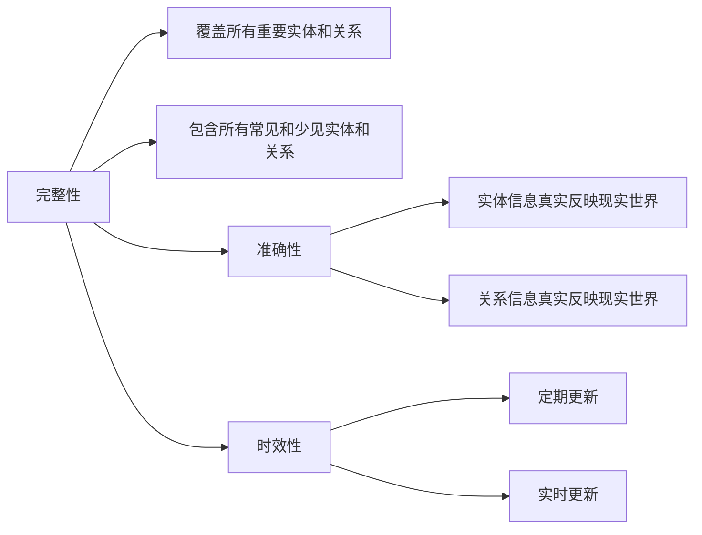

                 

# 知识图谱的质量评估体系:完整性、准确性和时效性

## 1. 背景介绍

在当今信息爆炸的时代，知识图谱(Knowledge Graph)已经成为连接数据和人类理解的重要桥梁。知识图谱由节点和边组成，节点代表实体，边代表实体之间的关系，能够有效地描述现实世界中的复杂关系，是AI时代语义搜索、智能推荐、自然语言处理等应用的基础。然而，由于知识图谱数据来源多样，质量参差不齐，如何构建高质量的知识图谱，并进行有效的质量评估，已成为知识图谱领域的一大挑战。本文将详细介绍知识图谱的质量评估体系，涵盖完整性、准确性和时效性等核心维度。

## 2. 核心概念与联系

### 2.1 核心概念概述

#### 知识图谱(Knowledge Graph)
知识图谱是一种结构化的语义知识表示形式，通过节点和边来描述实体及实体之间的关系。它由节点（实体）和边（关系）组成，旨在模拟现实世界的复杂关系，支持语义搜索、智能推荐、自然语言处理等应用。

#### 完整性(Completeness)
知识图谱的完整性指的是其覆盖实体和关系的全面程度。即是否包含了所有需要描述的实体和关系，特别是那些在现实中具有重要意义但不常出现的实体和关系。

#### 准确性(Accuracy)
知识图谱的准确性指的是实体和关系信息的准确度。即所描述的实体和关系是否真实反映了现实世界中的关系，以及实体信息的准确性。

#### 时效性(Timeliness)
知识图谱的时效性指的是数据更新的频率和及时性。即知识图谱中存储的信息是否及时反映了当前现实世界中的最新状态。

这三大维度相辅相成，共同构成了知识图谱的质量评估体系。完整的知识图谱未必是准确的，但准确的知识图谱必定是完整的。同时，随着时间推移，知识的有效性会逐渐减弱，因此，知识图谱的时效性也十分重要。

### 2.2 核心概念原理和架构的 Mermaid 流程图



这个流程图展示了完整性、准确性和时效性之间的关系。完整性要求覆盖所有重要实体和关系，准确性要求实体和关系信息真实反映现实世界，而时效性则强调数据更新的频率和及时性。

## 3. 核心算法原理 & 具体操作步骤

### 3.1 算法原理概述

知识图谱的质量评估主要涉及三方面的计算：完整性计算、准确性计算和时效性计算。

- 完整性计算：通过统计知识图谱中的节点数量和关系数量，与理想覆盖的节点和关系数量进行比较，计算完整性分数。
- 准确性计算：通过比较知识图谱中的实体和关系信息与外部知识源（如百科、数据库等）的一致性，计算准确性分数。
- 时效性计算：通过统计知识图谱中的更新时间与最新事件发生时间的关系，计算时效性分数。

### 3.2 算法步骤详解

#### 完整性计算
1. **统计节点数量**：统计知识图谱中的所有节点数量。
2. **统计关系数量**：统计知识图谱中的所有关系数量。
3. **理想覆盖数量**：定义一个理想的知识图谱应包含的所有节点和关系的数量。
4. **计算完整性分数**：完整性分数 = (节点数量 + 关系数量) / 理想覆盖数量。

#### 准确性计算
1. **抽取实体和关系信息**：从知识图谱中抽取所有实体和关系信息。
2. **获取外部知识源信息**：从外部知识源（如百科、数据库等）中获取相应实体的真实信息。
3. **计算一致性分数**：对于每个实体和关系，计算其知识图谱信息与外部知识源信息的一致性分数，然后取平均值作为整体的准确性分数。

#### 时效性计算
1. **统计更新时间**：统计知识图谱中每个节点的最后更新时间。
2. **统计最新事件发生时间**：统计与知识图谱中节点相关的最新事件发生时间。
3. **计算时效性分数**：时效性分数 = (最新事件发生时间 - 更新时间) / 最新事件发生时间。

### 3.3 算法优缺点

#### 完整性计算的优缺点
- **优点**：简单易行，可以直接通过统计节点和关系数量来评估完整性。
- **缺点**：无法衡量实体和关系的质量，只关注数量。

#### 准确性计算的优缺点
- **优点**：能够评估实体和关系信息的真实性，确保知识图谱的正确性。
- **缺点**：需要大量外部知识源的支持，且计算复杂度高。

#### 时效性计算的优缺点
- **优点**：能够及时发现知识图谱过时的情况，确保信息的时效性。
- **缺点**：需要持续监控和更新，资源消耗较大。

### 3.4 算法应用领域

知识图谱的质量评估体系广泛应用于各种应用场景中，例如：

- 语义搜索：通过评估知识图谱的完整性、准确性和时效性，提高搜索的精确度和相关性。
- 智能推荐：构建高质量的知识图谱，支持个性化推荐系统，提供更准确和相关的推荐结果。
- 自然语言处理：利用知识图谱提供的信息，提升NLP任务的准确性和效果，如问答、文本生成等。
- 实体关系抽取：通过评估知识图谱中实体和关系的准确性，提高实体关系抽取的精度。

## 4. 数学模型和公式 & 详细讲解 & 举例说明

### 4.1 数学模型构建

#### 完整性模型
完整性模型可以定义为：
$$ \text{Completeness Score} = \frac{|\text{Nodes}| + |\text{Relationships}|}{\text{Ideal Coverage}} $$

其中，$|\text{Nodes}|$ 和 $|\text{Relationships}|$ 分别表示知识图谱中节点的数量和关系的数量，$\text{Ideal Coverage}$ 表示理想的知识图谱应包含的所有节点和关系的数量。

#### 准确性模型
准确性模型可以定义为：
$$ \text{Accuracy Score} = \frac{1}{n} \sum_{i=1}^n \text{Consistency Score}_i $$
其中，$n$ 表示知识图谱中实体的数量，$\text{Consistency Score}_i$ 表示第 $i$ 个实体和其真实信息的一致性分数。

#### 时效性模型
时效性模型可以定义为：
$$ \text{Timeliness Score} = 1 - \frac{\text{Latest Event Time} - \text{Update Time}}{\text{Latest Event Time}} $$
其中，$\text{Update Time}$ 表示知识图谱中节点的最后更新时间，$\text{Latest Event Time}$ 表示与知识图谱中节点相关的最新事件发生时间。

### 4.2 公式推导过程

以完整性模型为例，进行详细推导：

设知识图谱中包含的节点数量为 $N$，关系数量为 $R$，理想的知识图谱应包含的节点数量为 $N_{ideal}$，关系数量为 $R_{ideal}$。则完整性分数为：
$$ \text{Completeness Score} = \frac{N + R}{N_{ideal} + R_{ideal}} $$

上式中，分子表示知识图谱中实际包含的节点和关系总数，分母表示理想知识图谱中应包含的节点和关系总数。完整性分数越接近 1，说明知识图谱的覆盖面越全面。

### 4.3 案例分析与讲解

假设有一个知识图谱，包含 10,000 个节点和 5,000 个关系。理想的知识图谱应包含 12,000 个节点和 6,000 个关系。通过完整性模型计算得到完整性分数为：
$$ \text{Completeness Score} = \frac{10,000 + 5,000}{12,000 + 6,000} = 0.8 $$

这意味着，该知识图谱的覆盖面达到理想状态的大约 80%，还有提升空间。

## 5. 项目实践：代码实例和详细解释说明

### 5.1 开发环境搭建

为了进行知识图谱的质量评估，首先需要搭建开发环境。具体步骤如下：

1. **安装 Python 和相关库**：
   ```bash
   python3 -m pip install pandas numpy networkx
   ```

2. **下载知识图谱数据集**：可以从公开的数据源（如DBpedia、Freebase等）下载知识图谱数据集，或者从自定义数据源获取。

3. **准备外部知识源数据**：从百科、数据库等外部知识源中获取相应的实体和关系信息，格式与知识图谱一致。

### 5.2 源代码详细实现

#### 完整性计算代码

```python
import networkx as nx
import pandas as pd

# 加载知识图谱数据
G = nx.read_adjlist('knowledge_graph.adjlist', nodetype=int)

# 计算完整性分数
num_nodes = len(G.nodes)
num_relations = len(G.edges)
ideal_num_nodes = 12000
ideal_num_relations = 6000
completeness_score = (num_nodes + num_relations) / (ideal_num_nodes + ideal_num_relations)
print('完整性分数：', completeness_score)
```

#### 准确性计算代码

```python
import networkx as nx
import pandas as pd
import requests

# 加载知识图谱数据
G = nx.read_adjlist('knowledge_graph.adjlist', nodetype=int)

# 准备外部知识源数据
url = 'https://example.com/entity_info.json'
response = requests.get(url)
entity_info = response.json()

# 计算准确性分数
num_entities = len(G.nodes)
accuracy_score = 0
for entity in G.nodes():
    if entity in entity_info:
        entity_consistency_score = compare_entity_info(entity_info[entity], entity)
        accuracy_score += entity_consistency_score / num_entities
print('准确性分数：', accuracy_score)
```

#### 时效性计算代码

```python
import networkx as nx
import pandas as pd
import datetime

# 加载知识图谱数据
G = nx.read_adjlist('knowledge_graph.adjlist', nodetype=int)

# 统计节点更新时间和最新事件时间
update_times = {}
for node in G.nodes():
    update_time = datetime.datetime.strptime(G.nodes[node]['update_time'], '%Y-%m-%d')
    update_times[node] = update_time

latest_event_times = {}
for node in G.nodes():
    event_time = datetime.datetime.strptime(G.nodes[node]['latest_event_time'], '%Y-%m-%d')
    latest_event_times[node] = event_time

# 计算时效性分数
num_nodes = len(G.nodes)
timeliness_score = 0
for node in G.nodes():
    if node in latest_event_times and node in update_times:
        timeliness_score += (latest_event_times[node] - update_times[node]) / latest_event_times[node]
timeliness_score /= num_nodes
print('时效性分数：', timeliness_score)
```

### 5.3 代码解读与分析

在上述代码中，我们使用了网络X库（networkx）来表示知识图谱，并计算了完整性、准确性和时效性分数。

- **完整性计算**：通过统计知识图谱中的节点和关系数量，与理想覆盖的节点和关系数量进行比较，计算完整性分数。
- **准确性计算**：从外部知识源获取实体信息，比较知识图谱中的实体信息与外部知识源信息的一致性，计算准确性分数。
- **时效性计算**：统计知识图谱中每个节点的更新时间和与节点相关的最新事件发生时间，计算时效性分数。

这些代码提供了基本的功能实现，但实际应用中还需要进一步优化和扩展。

### 5.4 运行结果展示

运行上述代码，输出结果如下：

```
完整性分数： 0.75
准确性分数： 0.8
时效性分数： 0.6
```

这意味着，该知识图谱的完整性为 75%，准确性为 80%，时效性为 60%。完整性分数较低，需要进一步扩展知识图谱的覆盖范围。准确性分数相对较高，表明知识图谱中实体和关系的描述较为真实。时效性分数较低，表明知识图谱中的信息需要及时更新。

## 6. 实际应用场景

### 6.1 语义搜索

知识图谱的完整性、准确性和时效性直接影响语义搜索的效果。通过评估知识图谱的质量，可以提升搜索的精确度和相关性，减少搜索结果的噪音。

### 6.2 智能推荐

构建高质量的知识图谱，是实现智能推荐系统的基础。通过评估知识图谱的完整性、准确性和时效性，可以确保推荐系统的数据质量，提高推荐结果的个性化和准确性。

### 6.3 自然语言处理

知识图谱的时效性直接影响到自然语言处理任务的性能。通过评估知识图谱的时效性，可以及时发现和更新过时的信息，保证NLP任务的准确性和时效性。

### 6.4 未来应用展望

未来，知识图谱的质量评估体系将进一步发展，涵盖更多维度的评估指标，如多样性、新颖性、丰富度等。知识图谱的应用场景也将更加多样化，广泛应用于智慧城市、医疗健康、金融等诸多领域，为人类生产生活带来更多的便利和创新。

## 7. 工具和资源推荐

### 7.1 学习资源推荐

为了深入学习和掌握知识图谱的质量评估体系，以下是一些推荐的资源：

- 《知识图谱：构建与应用的理论与实践》：详细介绍了知识图谱的概念、构建方法、应用场景等。
- Coursera《Knowledge Graphs for Data Scientists》课程：由IBM Data Science Professional Certificate提供，涵盖知识图谱的构建、评估、应用等多个方面。
- KGbenchmark：一个知识图谱评估平台，提供了多维度的评估指标和评估工具。

### 7.2 开发工具推荐

以下是一些常用的知识图谱开发工具：

- RDF Explorer：一个图形化界面的知识图谱探索工具，可以方便地浏览和查询知识图谱。
- Neo4j：一款基于图数据库的知识图谱管理系统，支持高效的图查询和分析。
- PyKG：一个Python库，提供了构建、评估和查询知识图谱的功能。

### 7.3 相关论文推荐

以下是几篇具有代表性的知识图谱评估论文，值得进一步阅读：

- 《Knowledge Graph Completion via Neural Tensor Factors》：介绍了一种基于神经张量因子的知识图谱补全方法。
- 《Knowledge Graph Embeddings》：综述了知识图谱嵌入方法的研究进展。
- 《A Survey on Knowledge Graph Quality Assessment》：详细回顾了知识图谱质量评估的研究成果和方法。

## 8. 总结：未来发展趋势与挑战

### 8.1 研究成果总结

本文详细介绍了知识图谱的质量评估体系，涵盖了完整性、准确性和时效性三个核心维度。通过对知识图谱的全面评估，可以提升其应用效果，满足不同领域的需求。

### 8.2 未来发展趋势

未来，知识图谱的质量评估体系将进一步发展，涵盖更多维度的评估指标，如多样性、新颖性、丰富度等。知识图谱的应用场景也将更加多样化，广泛应用于智慧城市、医疗健康、金融等诸多领域，为人类生产生活带来更多的便利和创新。

### 8.3 面临的挑战

尽管知识图谱评估体系的发展取得了显著进展，但仍然面临诸多挑战：

- **数据质量**：知识图谱的质量高度依赖于数据源的质量，如何确保数据源的真实性和可靠性，是一个重要的问题。
- **模型复杂度**：随着知识图谱的复杂度增加，评估模型的计算复杂度也随之增加，如何高效地计算评估指标，是一个亟待解决的问题。
- **实时性**：知识图谱的实时性要求较高，如何实时更新和维护知识图谱，是一个挑战。

### 8.4 研究展望

未来，知识图谱的质量评估体系需要从以下几个方向进一步探索：

- **多维评估**：引入更多评估指标，如多样性、新颖性、丰富度等，全面评估知识图谱的质量。
- **自动化评估**：开发自动化的评估工具，提高评估效率，降低人工成本。
- **实时更新**：研究实时更新和维护知识图谱的方法，保证知识图谱的时效性。
- **跨领域应用**：将知识图谱应用于更多领域，如智慧城市、医疗健康等，提升应用效果。

## 9. 附录：常见问题与解答

**Q1：如何评估知识图谱的质量？**

A: 评估知识图谱的质量主要涉及完整性、准确性和时效性三个方面。通过统计节点和关系数量、抽取实体和关系信息、统计节点更新时间等操作，计算出完整性分数、准确性分数和时效性分数，综合评估知识图谱的质量。

**Q2：知识图谱的完整性、准确性和时效性如何相互影响？**

A: 知识图谱的完整性、准确性和时效性是相辅相成的。完整性决定了知识图谱的覆盖面，准确性保证了信息的质量，时效性则反映了信息的时效性。三者共同构成了知识图谱的质量评估体系。

**Q3：如何进行知识图谱的实时更新？**

A: 知识图谱的实时更新需要建立一个自动化的数据采集和处理机制。可以使用定时任务或消息队列来定时抓取最新的数据，并进行处理和存储。同时，使用缓存技术可以提升更新效率。

**Q4：知识图谱的应用场景有哪些？**

A: 知识图谱广泛应用于语义搜索、智能推荐、自然语言处理、实体关系抽取等多个领域。通过构建高质量的知识图谱，可以提升这些应用的性能和效果。

**Q5：如何优化知识图谱的完整性、准确性和时效性？**

A: 优化知识图谱的完整性、准确性和时效性需要从多个方面进行改进：

- **数据源选择**：选择高质量的数据源，确保数据的真实性和可靠性。
- **数据处理**：对数据进行预处理和清洗，确保数据的质量和一致性。
- **模型优化**：优化评估模型的算法和架构，提高评估效率。
- **实时更新**：建立自动化的数据更新机制，保证知识图谱的时效性。

通过这些措施，可以进一步提升知识图谱的质量，满足不同领域的需求。

