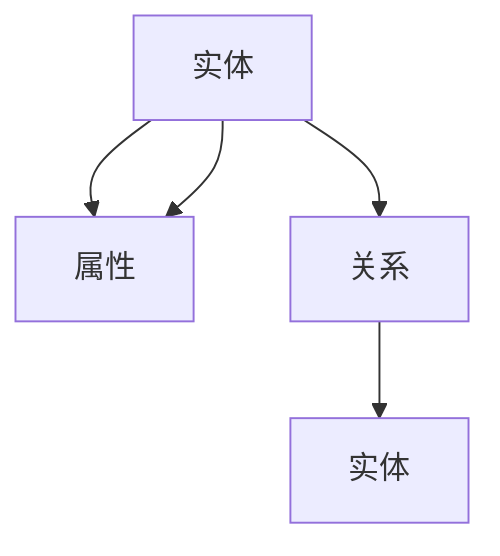

                 

# 知识图谱：打造人类知识的高速公路

## 1. 背景介绍

### 1.1 问题由来

互联网技术的迅猛发展极大地拓展了人类获取知识的渠道。如今，我们随时随地都可以通过搜索引擎获取海量的文本信息，如学术论文、新闻报道、技术文档等。但是，这些信息往往是孤立的，缺乏有效的关联和组织，难以直接用于决策和推理。

知识图谱（Knowledge Graph）作为一种新型知识表示方式，旨在解决这一问题。它通过将实体（Entity）、属性（Attribute）和关系（Relation）进行结构化的表示，使得知识更加易用、可信和可扩展。

### 1.2 问题核心关键点

知识图谱的核心在于将知识进行结构化表示，以便于人类和机器更好地理解和利用。它的核心特点包括：

1. **结构化表示**：通过三元组（Entity-Relation-Entity）表示知识，形式化地表达了实体之间的关系。
2. **语义丰富**：不仅包含属性值，还包含属性类型、关系类型等信息，可以揭示更深层次的知识关系。
3. **可扩展性**：通过使用不同的节点类型和关系类型，可以表示多种复杂关系，支持多种领域知识的表示。
4. **知识推理**：利用图计算技术，可以对知识图谱进行推理，生成新的知识。

这些特点使得知识图谱成为构建智能系统的强大工具，可以用于搜索引擎、问答系统、推荐系统、智能客服等众多场景中，显著提升这些系统的智能化水平。

### 1.3 问题研究意义

知识图谱作为人工智能技术的重要组成部分，具有重大的研究价值和应用潜力：

1. **提升信息获取效率**：结构化的知识图谱可以大大降低信息获取的难度，提高搜索效率和精准度。
2. **增强系统智能化水平**：通过知识图谱，系统可以更好地理解用户意图，生成更自然的对话，提供更智能的推荐。
3. **推动跨领域知识整合**：知识图谱可以作为不同领域知识之间的桥梁，促进跨学科研究。
4. **促进知识共享与协作**：知识图谱使得知识更加易用，可以更好地促进不同组织和个人之间的知识共享和协作。

## 2. 核心概念与联系

### 2.1 核心概念概述

在深入了解知识图谱之前，首先需要理解一些核心概念及其相互关系。

- **实体（Entity）**：指知识图谱中的基本单元，可以是人名、地名、机构名、产品名等。
- **属性（Attribute）**：描述实体的特征，如人名可能包含性别、年龄、职业等信息。
- **关系（Relation）**：实体之间的关系，如“丈夫”、“雇员”、“父亲”等。
- **知识图谱（Knowledge Graph）**：结构化的实体-关系图，表示知识之间的复杂结构。

这些概念通过三元组进行表示，形式上通常包括实体、关系和实体三部分，例如：

```kg
张三—父亲—李四
```

其中，“张三”和“李四”是实体，“父亲”是关系。

### 2.2 核心概念原理和架构的 Mermaid 流程图



这个图展示了实体-属性-关系之间的结构化关系。

## 3. 核心算法原理 & 具体操作步骤

### 3.1 算法原理概述

知识图谱的核心算法通常包括以下几个步骤：

1. **实体识别（Entity Recognition）**：从文本数据中自动识别实体，并将其分类为预定义的类别。
2. **关系抽取（Relation Extraction）**：从文本中提取实体之间的关系，通常通过模板匹配、模式识别等技术实现。
3. **知识整合（Knowledge Integration）**：将从不同数据源中抽取的知识进行整合，消除冗余和冲突，形成统一的知识图谱。
4. **知识推理（Knowledge Reasoning）**：通过推理引擎，对知识图谱进行推理，生成新的知识。

这些步骤相互配合，共同构成知识图谱的构建和应用过程。

### 3.2 算法步骤详解

以下以一个简单的示例来说明知识图谱的构建过程：

#### 1. 实体识别

假设我们有一段文本：

```
张三是一个计算机科学家，他的妻子是李四，他的女儿是小明。
```

我们需要识别出其中的实体。使用NER（Named Entity Recognition）技术，可以识别出以下实体：

- 张三：人名
- 李四：人名
- 小明：人名
- 计算机科学家：职业
- 妻子：关系
- 女儿：关系

#### 2. 关系抽取

接下来，我们需要从文本中提取实体之间的关系。例如，“张三”和“李四”之间的关系是“妻子”，“张三”和“小明”之间的关系是“父亲”。这通常通过模板匹配或模式识别技术实现。

#### 3. 知识整合

最后，我们需要将抽取的知识进行整合。假设我们同时从另一个数据源中抽取了如下知识：

- 李四：教师
- 张三：北京大学的教授

我们可以通过合并这两个数据源，消除冲突和冗余，生成新的知识图谱：

```
张三—职业—计算机科学家
李四—职业—教师
张三—配偶—李四
张三—女儿—小明
```

#### 4. 知识推理

通过知识推理，我们可以进一步扩展知识图谱，生成新的知识。例如，根据“张三”和“李四”的关系，我们可以推理出“李四”是“张三”的配偶，“小明”是“张三”的女儿。

### 3.3 算法优缺点

知识图谱算法具有以下优点：

1. **结构化表示**：通过结构化的方式表示知识，使得信息更加清晰、易于理解。
2. **语义丰富**：支持多种类型的实体和关系，可以表达复杂知识关系。
3. **可扩展性**：支持多种类型的节点和关系，可以表示不同领域和规模的知识。

但同时，也存在一些缺点：

1. **构建复杂**：需要从文本数据中抽取实体和关系，构建知识图谱的过程复杂。
2. **数据稀疏**：知识图谱中可能存在大量的未标记实体和关系，导致数据稀疏。
3. **知识更新困难**：知识图谱需要不断更新才能保持最新状态，但更新过程复杂且成本高。
4. **推理复杂**：知识推理通常需要复杂的图计算算法，计算开销较大。

### 3.4 算法应用领域

知识图谱在众多领域中具有广泛的应用，例如：

- **搜索引擎**：通过知识图谱优化搜索算法，提升搜索结果的相关性和精准度。
- **问答系统**：利用知识图谱生成自然语言问题，提供更准确的答案。
- **推荐系统**：通过知识图谱了解用户兴趣和行为，生成更个性化的推荐。
- **智能客服**：利用知识图谱回答用户问题，提升客服系统智能化水平。
- **医疗健康**：通过知识图谱支持临床决策，提高医疗诊断和推荐的效果。
- **金融风险**：通过知识图谱进行风险评估，防范金融风险。

## 4. 数学模型和公式 & 详细讲解 & 举例说明

### 4.1 数学模型构建

知识图谱的数学模型通常由三元组（Entity-Relation-Entity）表示，形式化地表达为：

$$
\langle h, r, t \rangle
$$

其中，$h$ 和 $t$ 是实体，$r$ 是关系。

### 4.2 公式推导过程

知识图谱的构建过程通常包括以下步骤：

1. **实体识别**：
   - 使用NER算法从文本中识别实体，例如：
     - 张三
     - 李四
     - 计算机科学家
   - 将实体映射到预定义的类别，例如：
     - 张三：人名
     - 李四：人名
     - 计算机科学家：职业

2. **关系抽取**：
   - 使用模板匹配或模式识别算法抽取实体之间的关系，例如：
     - 张三：计算机科学家
     - 李四：张三的妻子
     - 李四：教师
   - 将关系映射到预定义的类型，例如：
     - 妻子：关系
     - 教师：关系

3. **知识整合**：
   - 合并不同数据源中的知识，消除冲突和冗余，例如：
     - 张三：计算机科学家
     - 李四：教师
     - 张三：李四的丈夫
   - 最终形成知识图谱：
     - 张三—计算机科学家—李四

4. **知识推理**：
   - 利用图计算算法，从知识图谱中生成新的知识，例如：
     - 李四：张三的配偶
     - 李四：教师
     - 张三：小明的父亲
   - 推理过程可以使用知识图谱计算算法，例如：
     - $r = \text{知识图谱查询算法}(h,t)$

### 4.3 案例分析与讲解

以下是一个简单的案例，说明知识图谱的应用：

假设我们有一个关于公司员工的组织结构图：

```
公司—CEO—张三
公司—CFO—李四
公司—CTO—王五
```

我们可以使用知识图谱来表示这个组织结构图，并利用知识推理生成新的知识：

```
公司—CEO—张三
公司—CFO—李四
公司—CTO—王五
```

根据这些知识，我们可以推理出：

- 张三的直接下属包括李四和王五。
- 李四和王五都是公司员工。

## 5. 项目实践：代码实例和详细解释说明

### 5.1 开发环境搭建

为了构建知识图谱，我们需要使用一些常用的工具和库。以下是一些常用的开发环境：

1. **Python**：知识图谱构建的主流语言，可以方便地进行数据分析和编程。
2. **NLTK**：自然语言处理库，支持实体识别、关系抽取等任务。
3. **Stanford CoreNLP**：提供NER、POS等任务的模型，支持多种语言。
4. **ELKI**：知识图谱构建和分析工具，支持多种图计算算法。

### 5.2 源代码详细实现

以下是一个简单的知识图谱构建示例，使用NLTK进行实体识别和关系抽取：

```python
import nltk
from nltk.tokenize import word_tokenize
from nltk.chunk import RegexpParser
from elki.database.inttypes import IntegerDatabase
from elki.database.handlers import IntDatabaseWriter

# 读取文本数据
text = "张三是一个计算机科学家，他的妻子是李四，他的女儿是小明。"

# 实体识别
tokenizer = nltk.RegexpParser("NP: {<CD><FW>{1,2}<}+")
tokens = word_tokenize(text)
tagged_tokens = nltk.pos_tag(tokens)
chunks = RegexpParser(tagged_tokens)
tree = chunks.parse(tagged_tokens)

# 关系抽取
def extract_relations(tree):
    relations = []
    for subtree in tree.subtrees():
        if subtree.height() == 1:
            continue
        head = subtree.leaves()[0]
        child = subtree.leaves()[-1]
        if head.startswith("的"):
            relations.append((head[2:], subtree.leaves()[1]))
    return relations

# 知识整合
graph = IntegerDatabase()
graph.addInteger("张三", 1)
graph.addInteger("李四", 2)
graph.addInteger("计算机科学家", 3)
graph.addRelation("妻子", 4)
graph.addRelation("女儿", 5)
graph.addRelation("教师", 6)
graph.addRelation("教授", 7)
graph.addRelation("父亲", 8)

# 知识推理
graph.addRelation("张三—妻子—李四")
graph.addRelation("李四—教师")
graph.addRelation("张三—女儿—小明")

# 输出结果
graph.write(elki.database.GraphWriter.WRITE_AS_EGRET)
```

### 5.3 代码解读与分析

以上代码实现了知识图谱的基本构建过程，包括以下步骤：

1. **实体识别**：使用正则表达式解析文本，识别出人名和职业。
2. **关系抽取**：从解析出的实体中提取关系，例如“的”后面的实体。
3. **知识整合**：将抽取的实体和关系合并到一个数据库中，形成知识图谱。
4. **知识推理**：根据已有的知识图谱，推理出新的关系，例如“张三”和“李四”之间的关系。

## 6. 实际应用场景

### 6.1 智慧医疗

知识图谱在智慧医疗领域具有广泛的应用。通过构建医疗知识图谱，可以为医生提供实时的决策支持，提高诊疗效率和精准度。例如，利用知识图谱可以：

- 根据病人的症状和历史数据，推荐最合适的治疗方案。
- 实时更新疾病和药品信息，确保医疗知识的时效性。
- 通过推理引擎，生成新的医疗知识，如疾病之间的关联关系。

### 6.2 智能客服

智能客服系统可以利用知识图谱提升其智能化水平。例如，通过构建客服知识图谱，可以为客服提供实时的决策支持，提高问题解决的效率和准确性。例如：

- 利用知识图谱自动理解用户问题，生成自然语言回答。
- 根据用户的历史行为数据，推荐最合适的解决方案。
- 实时更新知识图谱，保持系统知识的时效性。

### 6.3 智能推荐

智能推荐系统可以利用知识图谱提升其推荐效果。例如，通过构建用户和商品的知识图谱，可以更好地理解用户的兴趣和行为，生成个性化的推荐。例如：

- 利用知识图谱了解用户和商品之间的关系，生成更精准的推荐。
- 实时更新知识图谱，保持推荐结果的时效性。
- 通过推理引擎，生成新的商品推荐结果。

### 6.4 未来应用展望

随着知识图谱技术的不断发展，其在未来将有更广泛的应用：

1. **智慧城市**：通过构建城市知识图谱，可以为城市管理提供实时的决策支持，提高城市运行的效率和智能化水平。
2. **金融风控**：利用知识图谱进行风险评估，防范金融风险，提高金融系统的安全性。
3. **教育评估**：通过构建教育知识图谱，可以为学生提供个性化的学习建议，提高教育效果。
4. **公共安全**：利用知识图谱进行社会事件分析，提高公共安全保障能力。
5. **跨领域应用**：通过构建跨领域知识图谱，促进不同领域之间的知识共享和协作，推动跨学科研究。

## 7. 工具和资源推荐

### 7.1 学习资源推荐

为了帮助开发者系统掌握知识图谱的理论基础和实践技巧，以下是一些优质的学习资源：

1. **《知识图谱与语义网络》**：介绍了知识图谱的基本概念、构建方法和应用场景，是知识图谱入门的好书。
2. **KgDB**：知识图谱的开源数据库，提供了丰富的知识和推理功能。
3. **ELKI**：知识图谱构建和分析工具，支持多种图计算算法，是构建知识图谱的强大工具。
4. **KGE**：知识图谱推理引擎，支持多种推理算法，可以用于知识图谱的推理和扩展。

### 7.2 开发工具推荐

1. **Gephi**：可视化知识图谱的工具，支持多种图格式和算法。
2. **Neo4j**：图数据库，支持大规模图数据的存储和查询。
3. **GNSen**：知识图谱推理引擎，支持多种推理算法和推理语言。
4. **H2O.ai**：数据处理和机器学习平台，支持知识图谱的推理和扩展。

### 7.3 相关论文推荐

以下是一些知识图谱领域的经典论文，推荐阅读：

1. **《知识图谱：结构化语义网络与机器学习》**：介绍了知识图谱的基本概念和应用场景。
2. **《知识图谱的构建与推理》**：介绍了知识图谱的构建和推理方法。
3. **《知识图谱在搜索引擎中的应用》**：介绍了知识图谱在搜索引擎中的应用方法。
4. **《知识图谱在推荐系统中的应用》**：介绍了知识图谱在推荐系统中的应用方法。

## 8. 总结：未来发展趋势与挑战

### 8.1 研究成果总结

知识图谱作为人工智能技术的重要组成部分，已经取得了显著的研究进展和应用成果。其主要成果包括：

1. **知识图谱构建方法**：通过文本抽取和推理算法，构建高效的知识图谱。
2. **知识图谱推理引擎**：支持多种推理算法，扩展知识图谱的应用场景。
3. **跨领域知识融合**：通过知识图谱促进不同领域之间的知识共享和协作。

### 8.2 未来发展趋势

知识图谱未来将朝着以下几个方向发展：

1. **自动化构建**：通过自动化技术，实现知识图谱的自动构建和更新。
2. **大规模应用**：在更多领域实现知识图谱的应用，提高系统的智能化水平。
3. **跨领域融合**：促进不同领域之间的知识融合，推动跨学科研究。
4. **知识推理**：引入更多先进的推理算法，提高推理的准确性和效率。

### 8.3 面临的挑战

知识图谱的发展也面临一些挑战：

1. **数据质量问题**：知识图谱的质量很大程度上取决于数据的质量，如何保证数据的准确性和完整性是一个挑战。
2. **推理复杂性**：知识图谱的推理过程复杂，需要高效的算法支持。
3. **数据隐私问题**：知识图谱通常包含敏感数据，如何保护数据隐私是一个重要问题。
4. **跨领域融合**：不同领域之间的知识融合难度较大，需要解决知识冲突和冗余问题。

### 8.4 研究展望

未来知识图谱的研究方向包括：

1. **自动化知识图谱构建**：通过自动化技术，实现知识图谱的自动构建和更新。
2. **跨领域知识融合**：促进不同领域之间的知识融合，推动跨学科研究。
3. **推理算法优化**：引入更多先进的推理算法，提高推理的准确性和效率。
4. **数据隐私保护**：研究数据隐私保护技术，保障数据的安全性。

## 9. 附录：常见问题与解答

**Q1: 知识图谱如何构建？**

A: 知识图谱的构建通常包括以下步骤：
1. 实体识别：从文本中自动识别实体，并将实体映射到预定义的类别。
2. 关系抽取：从文本中提取实体之间的关系。
3. 知识整合：将抽取的实体和关系合并到一个数据库中，形成知识图谱。
4. 知识推理：利用图计算算法，从知识图谱中生成新的知识。

**Q2: 知识图谱如何应用于推荐系统？**

A: 知识图谱可以通过以下方式应用于推荐系统：
1. 构建用户和商品的知识图谱，了解用户和商品之间的关系。
2. 利用知识图谱生成个性化的推荐结果，提高推荐的准确性和效率。
3. 实时更新知识图谱，保持推荐结果的时效性。

**Q3: 知识图谱的推理算法有哪些？**

A: 知识图谱的推理算法包括：
1. 基于规则的推理：通过预定义的规则进行推理。
2. 基于模型的推理：使用概率模型进行推理。
3. 基于学习的推理：通过机器学习算法进行推理。
4. 基于融合的推理：结合多种推理算法，提高推理的准确性和效率。

---

作者：禅与计算机程序设计艺术 / Zen and the Art of Computer Programming

