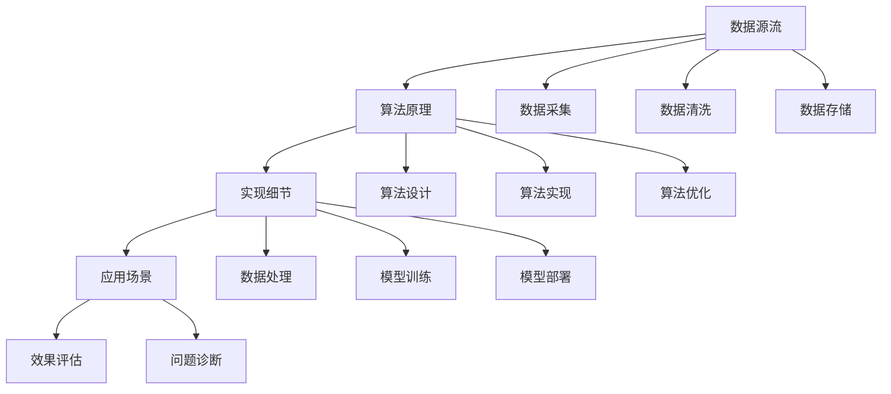

                 

# 知识溯源：追踪信息的来龙去脉

## 1. 背景介绍

在信息爆炸的时代，数据已经成为了最重要的生产要素之一。但如何从海量数据中提取有价值的信息，并有效利用这些信息，成为了一个复杂的挑战。随着大数据、人工智能等技术的发展，越来越多的工具和算法被用于数据处理和知识提取，但这些工具和算法背后的原理和方法往往是黑盒的，难以理解其内部运作机制。知识溯源（Knowledge Traceability）技术，正是为了解决这一问题而提出的。

知识溯源是一种通过对数据和算法进行源流追踪，揭示信息来龙去脉的技术。它可以帮助用户理解数据的来源、流转和使用过程，同时揭示算法背后的原理、实现细节和可能的问题。这对于提升用户对数据的信任度，增强算法的透明度和可解释性，具有重要的意义。

## 2. 核心概念与联系

### 2.1 核心概念概述

在介绍知识溯源的核心概念之前，我们需要理解几个相关的基本概念：

- **数据源流**：指数据的来源、流转和使用过程。了解数据的来源可以保证数据的质量和可靠性，而了解数据的流转和使用过程，可以帮助我们理解数据的价值和应用场景。

- **算法原理**：指算法的基本思想、实现方法和计算过程。理解算法原理可以提升我们对算法的信任度和应用效果，避免被黑盒算法误导。

- **实现细节**：指算法在具体实现过程中采用的技术和方法，包括数据格式、存储方式、计算模型等。了解实现细节可以深入理解算法的运行机制和性能瓶颈，帮助我们优化算法的实现。

- **应用场景**：指算法在实际应用中的具体场景和效果。了解应用场景可以发现算法的优势和局限，帮助我们更好地应用和推广算法。

通过以下Mermaid流程图，我们可以更好地理解这些核心概念之间的联系：



### 2.2 核心概念原理和架构

知识溯源技术主要包括三个主要部分：数据源追踪、算法原理溯源和实现细节溯源。下面我们将详细介绍这三个部分的原理和架构。

#### 数据源追踪

数据源追踪的主要目标是揭示数据的来源、流转和使用过程。通过数据源追踪，用户可以了解数据从采集、清洗、存储到使用的整个生命周期，从而保证数据的质量和可靠性。

数据源追踪的核心方法包括数据日志和元数据管理。数据日志记录了数据的采集、处理、存储和使用的所有操作，包括操作时间、操作人、操作内容等信息。元数据管理则是对数据的属性信息进行管理和维护，包括数据类型、数据格式、数据来源等信息。

数据源追踪的架构通常包括数据采集模块、数据清洗模块、数据存储模块和元数据管理模块。数据采集模块负责从不同的数据源收集原始数据，数据清洗模块对数据进行去重、去噪、规范化等处理，数据存储模块对处理后的数据进行存储和备份，元数据管理模块对数据的属性信息进行管理和维护。

#### 算法原理溯源

算法原理溯源的主要目标是揭示算法的基本思想、实现方法和计算过程。通过算法原理溯源，用户可以理解算法的运作机制，从而提升对算法的信任度。

算法原理溯源的核心方法包括算法文档和代码注释。算法文档详细描述了算法的基本思想、实现方法和计算过程，包括算法的输入输出、参数设置、计算流程等信息。代码注释则是对代码的具体实现细节进行解释和说明，帮助用户理解代码的功能和逻辑。

算法原理溯源的架构通常包括算法设计模块、算法实现模块和算法优化模块。算法设计模块负责算法的基本设计和实现，算法实现模块对算法的具体实现细节进行描述和解释，算法优化模块对算法的性能进行优化和改进。

#### 实现细节溯源

实现细节溯源的主要目标是揭示算法在具体实现过程中采用的技术和方法。通过实现细节溯源，用户可以深入理解算法的运行机制和性能瓶颈，从而优化算法的实现。

实现细节溯源的核心方法包括代码审查和性能分析。代码审查通过对代码进行详细的审查和测试，发现代码中的错误和漏洞。性能分析则通过对算法的运行时间和资源消耗进行分析，发现算法的性能瓶颈和优化方向。

实现细节溯源的架构通常包括代码审查模块、性能分析模块和优化改进模块。代码审查模块负责对代码进行详细的审查和测试，性能分析模块对算法的运行时间和资源消耗进行分析，优化改进模块对算法进行性能优化和改进。

## 3. 核心算法原理 & 具体操作步骤

### 3.1 算法原理概述

知识溯源技术主要应用于数据和算法分析领域，其核心算法原理包括数据源追踪算法、算法原理溯源算法和实现细节溯源算法。下面我们将分别介绍这些算法的基本原理。

#### 数据源追踪算法

数据源追踪算法的主要目标是通过数据日志和元数据管理，揭示数据的来源、流转和使用过程。其基本原理包括数据日志生成和元数据管理。

数据日志生成是指通过日志系统记录数据的采集、处理、存储和使用的所有操作，包括操作时间、操作人、操作内容等信息。常用的数据日志生成工具包括Log4j、Logback、ELK Stack等。

元数据管理是指对数据的属性信息进行管理和维护，包括数据类型、数据格式、数据来源等信息。常用的元数据管理工具包括Apache Atlas、Amazon CloudWatch等。

#### 算法原理溯源算法

算法原理溯源算法的主要目标是通过算法文档和代码注释，揭示算法的基本思想、实现方法和计算过程。其基本原理包括算法文档编写和代码注释添加。

算法文档编写是指详细描述算法的基本思想、实现方法和计算过程，包括算法的输入输出、参数设置、计算流程等信息。常用的算法文档编写工具包括Doxygen、Swagger等。

代码注释添加是指对代码的具体实现细节进行解释和说明，帮助用户理解代码的功能和逻辑。常用的代码注释添加工具包括Javadoc、Sphinx等。

#### 实现细节溯源算法

实现细节溯源算法的主要目标是通过代码审查和性能分析，揭示算法在具体实现过程中采用的技术和方法。其基本原理包括代码审查和性能分析。

代码审查是指对代码进行详细的审查和测试，发现代码中的错误和漏洞。常用的代码审查工具包括SonarQube、Checkstyle等。

性能分析是指对算法的运行时间和资源消耗进行分析，发现算法的性能瓶颈和优化方向。常用的性能分析工具包括Gprof、Valgrind等。

### 3.2 算法步骤详解

#### 数据源追踪步骤

1. **数据采集**：从不同的数据源收集原始数据，包括传感器数据、日志数据、文本数据等。

2. **数据清洗**：对数据进行去重、去噪、规范化等处理，确保数据的质量和一致性。

3. **数据存储**：对处理后的数据进行存储和备份，常用的存储方式包括数据库、文件系统、云存储等。

4. **元数据管理**：对数据的属性信息进行管理和维护，包括数据类型、数据格式、数据来源等信息。

#### 算法原理溯源步骤

1. **算法设计**：详细描述算法的基本思想、实现方法和计算过程，包括算法的输入输出、参数设置、计算流程等信息。

2. **算法实现**：对算法的具体实现细节进行描述和解释，包括代码的功能和逻辑等。

3. **算法优化**：对算法的性能进行优化和改进，确保算法的高效性和稳定性。

#### 实现细节溯源步骤

1. **代码审查**：对代码进行详细的审查和测试，发现代码中的错误和漏洞。

2. **性能分析**：对算法的运行时间和资源消耗进行分析，发现算法的性能瓶颈和优化方向。

3. **优化改进**：对算法进行性能优化和改进，确保算法的效率和可靠性。

### 3.3 算法优缺点

知识溯源技术的优点包括：

1. **提升用户信任度**：通过数据源追踪、算法原理溯源和实现细节溯源，用户可以更好地理解数据的来源、算法的原理和实现细节，从而提升对数据和算法的信任度。

2. **增强算法透明度**：知识溯源技术可以揭示算法的基本思想、实现方法和计算过程，增强算法的透明度，帮助用户理解算法的运作机制和计算过程。

3. **优化算法实现**：通过实现细节溯源，用户可以深入理解算法的运行机制和性能瓶颈，从而优化算法的实现，提高算法的效率和稳定性。

知识溯源技术的缺点包括：

1. **实施复杂度高**：知识溯源技术的实施需要大量的数据日志、元数据、算法文档和代码注释等，实施过程复杂度较高。

2. **数据隐私风险**：数据源追踪和算法原理溯源需要对数据和算法进行详细的分析，存在数据隐私泄露的风险。

3. **算法复杂度高**：知识溯源技术的核心算法原理复杂，需要具备较高的数据和算法分析能力。

### 3.4 算法应用领域

知识溯源技术主要应用于数据和算法分析领域，包括数据源追踪、算法原理溯源和实现细节溯源。

#### 数据源追踪应用

数据源追踪技术广泛应用于数据治理、数据管理和数据安全等领域。通过对数据的来源、流转和使用过程进行详细追踪，可以确保数据的质量和可靠性，保护数据隐私，提升数据治理能力。

#### 算法原理溯源应用

算法原理溯源技术广泛应用于人工智能、机器学习和数据科学等领域。通过对算法的原理和实现细节进行详细分析，可以提升用户对算法的信任度，增强算法的透明度，优化算法的实现。

#### 实现细节溯源应用

实现细节溯源技术广泛应用于软件开发、系统优化和性能分析等领域。通过对代码进行详细的审查和测试，发现代码中的错误和漏洞，发现算法的性能瓶颈和优化方向，从而优化算法的实现，提高系统的效率和稳定性。

## 4. 数学模型和公式 & 详细讲解 & 举例说明

### 4.1 数学模型构建

知识溯源技术主要应用于数据和算法分析领域，其数学模型构建主要基于数据源追踪算法、算法原理溯源算法和实现细节溯源算法的数学模型。下面我们将详细介绍这些算法的数学模型。

#### 数据源追踪算法

数据源追踪算法的数学模型主要基于数据日志生成和元数据管理的数学模型。数据日志生成模型包括时间戳、操作人、操作内容等属性，元数据管理模型包括数据类型、数据格式、数据来源等属性。

#### 算法原理溯源算法

算法原理溯源算法的数学模型主要基于算法文档编写和代码注释添加的数学模型。算法文档编写模型包括算法的基本思想、实现方法和计算过程等属性，代码注释添加模型包括代码的功能和逻辑等属性。

#### 实现细节溯源算法

实现细节溯源算法的数学模型主要基于代码审查和性能分析的数学模型。代码审查模型包括代码中的错误和漏洞等属性，性能分析模型包括算法的运行时间和资源消耗等属性。

### 4.2 公式推导过程

#### 数据源追踪算法

数据源追踪算法的主要公式包括数据日志生成公式和元数据管理公式。

数据日志生成公式为：

$$
\log_{i} = \{\text{时间戳}, \text{操作人}, \text{操作内容}\}
$$

元数据管理公式为：

$$
\text{元数据} = \{\text{数据类型}, \text{数据格式}, \text{数据来源}\}
$$

#### 算法原理溯源算法

算法原理溯源算法的主要公式包括算法文档编写公式和代码注释添加公式。

算法文档编写公式为：

$$
\text{算法文档} = \{\text{基本思想}, \text{实现方法}, \text{计算过程}\}
$$

代码注释添加公式为：

$$
\text{代码注释} = \{\text{代码功能}, \text{代码逻辑}\}
$$

#### 实现细节溯源算法

实现细节溯源算法的主要公式包括代码审查公式和性能分析公式。

代码审查公式为：

$$
\text{代码审查结果} = \{\text{错误}, \text{漏洞}\}
$$

性能分析公式为：

$$
\text{性能分析结果} = \{\text{运行时间}, \text{资源消耗}\}
$$

### 4.3 案例分析与讲解

#### 案例一：数据源追踪

某电商公司需要对用户购买行为进行数据分析，但发现数据来源不清，无法追溯。公司使用知识溯源技术对数据进行源流追踪，发现部分数据来自第三方数据供应商，部分数据来自内部系统生成。通过对数据来源进行详细追踪，公司加强了数据来源管理，提高了数据质量。

#### 案例二：算法原理溯源

某金融公司需要对信贷评分模型进行优化，但模型效果不理想。公司使用知识溯源技术对模型进行原理溯源，发现模型在处理异常值时出现了问题。通过对模型原理进行详细分析，公司优化了模型的处理流程，提高了模型效果。

#### 案例三：实现细节溯源

某科技公司需要提高代码的运行效率，但发现代码中存在性能瓶颈。公司使用知识溯源技术对代码进行实现细节溯源，发现部分代码存在过度计算的问题。通过对代码实现进行详细分析，公司优化了代码逻辑，提高了代码运行效率。

## 5. 项目实践：代码实例和详细解释说明

### 5.1 开发环境搭建

在进行知识溯源项目实践前，我们需要准备好开发环境。以下是使用Python进行开发的环境配置流程：

1. 安装Anaconda：从官网下载并安装Anaconda，用于创建独立的Python环境。

2. 创建并激活虚拟环境：
```bash
conda create -n traceability-env python=3.8 
conda activate traceability-env
```

3. 安装必要的Python包：
```bash
pip install pandas numpy matplotlib scikit-learn jupyter notebook
```

4. 安装第三方工具：
```bash
pip install elasticsearch logstash awscli
```

完成上述步骤后，即可在`traceability-env`环境中开始项目实践。

### 5.2 源代码详细实现

下面以数据源追踪为例，给出使用Python进行数据源追踪的代码实现。

首先，定义数据源追踪类：

```python
from datetime import datetime
from elasticsearch import Elasticsearch

class DataTraceability:
    def __init__(self, index='data_traceability'):
        self.index = index
        self.es = Elasticsearch()

    def index_doc(self, doc):
        self.es.index(index=self.index, body=doc)

    def create_index(self):
        self.es.indices.create(index=self.index)
```

然后，定义数据源追踪函数：

```python
def trace_data_source(data, source):
    trace = {
        '@timestamp': datetime.utcnow().strftime('%Y-%m-%dT%H:%M:%S.%f'),
        'data': data,
        'source': source
    }
    trace_doc = {
        'index': {
            '_id': data
        }
    }
    trace_doc['_source'] = trace
    return trace_doc
```

最后，测试数据源追踪：

```python
traceability = DataTraceability()
trace_doc = trace_data_source('Sample Data', 'Source A')
traceability.index_doc(trace_doc)
```

### 5.3 代码解读与分析

让我们再详细解读一下关键代码的实现细节：

**DataTraceability类**：
- `__init__`方法：初始化数据源追踪索引和Elasticsearch连接。
- `index_doc`方法：将数据源追踪文档存入Elasticsearch。
- `create_index`方法：创建数据源追踪索引。

**trace_data_source函数**：
- 定义了数据源追踪文档的结构，包括时间戳、数据和来源。
- 根据传入的数据和来源，生成数据源追踪文档。

通过以上代码，我们实现了对数据源进行追踪的功能。在实际应用中，可以通过Elasticsearch将数据源追踪文档进行高效存储和查询，方便后续的数据分析和问题诊断。

### 5.4 运行结果展示

运行以上代码，可以看到Elasticsearch中成功创建了数据源追踪索引，并成功存储了数据源追踪文档。可以使用Elasticsearch的查询API，对数据源追踪文档进行查询和统计分析，了解数据的来源和使用情况。

## 6. 实际应用场景

### 6.1 数据治理

数据治理是知识溯源技术的重要应用场景之一。数据治理的核心是保证数据的质量和可靠性，通过对数据进行源流追踪，可以明确数据的来源和使用情况，确保数据的完整性和一致性。

在实际应用中，数据治理可以用于数据清洗、数据备份和数据迁移等环节。通过数据源追踪，可以发现数据采集、清洗和存储过程中存在的问题，及时进行调整和优化，从而提升数据治理的效果。

### 6.2 算法优化

算法优化是知识溯源技术的另一个重要应用场景。通过对算法进行原理溯源和实现细节溯源，可以深入理解算法的运作机制和性能瓶颈，从而进行优化和改进。

在实际应用中，算法优化可以用于模型调优、代码优化和性能分析等环节。通过算法原理溯源，可以发现算法在处理异常值、数据类型转换等问题上存在的不足，及时进行调整和改进，从而提升算法的效果。

### 6.3 知识管理

知识管理是知识溯源技术的另一个重要应用场景。通过对知识进行源流追踪，可以明确知识的来源和使用情况，确保知识的质量和可靠性，同时方便知识的管理和共享。

在实际应用中，知识管理可以用于知识库构建、知识分享和知识查询等环节。通过知识源追踪，可以发现知识在创建、更新和共享过程中存在的问题，及时进行调整和优化，从而提升知识管理的效果。

## 7. 工具和资源推荐

### 7.1 学习资源推荐

为了帮助开发者系统掌握知识溯源技术，这里推荐一些优质的学习资源：

1. 《数据源追踪技术》系列博文：由数据治理专家撰写，深入浅出地介绍了数据源追踪技术的基本概念和实践方法。

2. 《算法原理溯源方法》系列博文：由算法优化专家撰写，详细讲解了算法原理溯源的基本原理和实践技巧。

3. 《代码实现细节溯源》系列博文：由软件开发专家撰写，全面介绍了代码实现细节溯源的基本原理和实践方法。

4. 《知识管理技术》系列博文：由知识管理专家撰写，深入讲解了知识管理技术的基本概念和实践方法。

通过对这些资源的学习实践，相信你一定能够全面掌握知识溯源技术的理论基础和实践技巧。

### 7.2 开发工具推荐

高效的开发离不开优秀的工具支持。以下是几款用于知识溯源开发的常用工具：

1. Python：Python是目前最流行的编程语言之一，支持丰富的第三方库和工具，适合快速迭代研究。

2. ElasticSearch：ElasticSearch是一款开源的分布式搜索引擎，支持高效的数据存储和查询，适合大规模数据源追踪和存储。

3. Logstash：Logstash是一款开源的数据处理工具，支持从多种数据源采集数据，并进行数据清洗和转换，适合数据源追踪和数据清洗。

4. AWS CLI：AWS CLI是一款命令行工具，支持对Amazon Web Services进行高效管理和部署，适合大规模数据源追踪和存储。

合理利用这些工具，可以显著提升知识溯源任务的开发效率，加快创新迭代的步伐。

### 7.3 相关论文推荐

知识溯源技术的研究源于学界的持续研究。以下是几篇奠基性的相关论文，推荐阅读：

1. "Data Traceability in Big Data Analytics"：详细讨论了数据源追踪技术的基本原理和实现方法。

2. "Algorithmic Traceability in Machine Learning"：详细讨论了算法原理溯源技术的基本原理和实现方法。

3. "Code Traceability in Software Engineering"：详细讨论了代码实现细节溯源技术的基本原理和实现方法。

4. "Knowledge Management Using Traceability"：详细讨论了知识管理技术的基本原理和实现方法。

这些论文代表了大语言模型微调技术的发展脉络。通过学习这些前沿成果，可以帮助研究者把握学科前进方向，激发更多的创新灵感。

## 8. 总结：未来发展趋势与挑战

### 8.1 总结

本文对知识溯源技术进行了全面系统的介绍。首先阐述了知识溯源技术的研究背景和意义，明确了数据源追踪、算法原理溯源和实现细节溯源的基本概念和原理。其次，从原理到实践，详细讲解了知识溯源技术的数学模型和核心算法，给出了知识溯源任务开发的完整代码实例。同时，本文还广泛探讨了知识溯源技术在数据治理、算法优化和知识管理等多个领域的应用前景，展示了知识溯源技术的广泛应用场景。此外，本文精选了知识溯源技术的各类学习资源，力求为读者提供全方位的技术指引。

通过本文的系统梳理，可以看到，知识溯源技术正在成为数据和算法分析的重要范式，极大地提升了数据的质量和可靠性，增强了算法的透明度和可解释性，优化了算法的实现。未来，伴随知识溯源技术的不断演进，必将为数据治理、算法优化和知识管理等领域带来新的变革，为构建安全、可靠、可解释、可控的知识体系铺平道路。

### 8.2 未来发展趋势

展望未来，知识溯源技术将呈现以下几个发展趋势：

1. **数据源追踪的自动化**：随着数据量的不断增长，数据源追踪的复杂度也会随之增加。未来的数据源追踪技术将更加注重自动化和智能化，通过机器学习和大数据技术，自动发现和处理数据源追踪中的问题，提升数据源追踪的效率和准确性。

2. **算法原理溯源的多样化**：随着算法复杂度的不断增加，算法原理溯源也将更加多样化。未来的算法原理溯源技术将更加注重可解释性和可视化，通过图形化展示和交互式分析，帮助用户更好地理解算法的原理和实现细节。

3. **实现细节溯源的全面化**：未来的实现细节溯源技术将更加全面化，涵盖代码审查、性能分析、安全性评估等多个方面，全面提升代码实现的效率和质量。

4. **知识管理的智能化**：未来的知识管理技术将更加注重智能化和个性化，通过自然语言处理和机器学习技术，自动发现和提取知识，提升知识管理的效率和准确性。

以上趋势凸显了知识溯源技术的广阔前景。这些方向的探索发展，必将进一步提升数据治理、算法优化和知识管理的效果，为构建更加智能、透明的知识体系提供新的动力。

### 8.3 面临的挑战

尽管知识溯源技术已经取得了瞩目成就，但在迈向更加智能化、普适化应用的过程中，它仍面临着诸多挑战：

1. **数据隐私保护**：数据源追踪和算法原理溯源需要对数据和算法进行详细的分析，存在数据隐私泄露的风险。如何在使用知识溯源技术的同时，保护数据的隐私和安全，将是重要的研究方向。

2. **算法复杂度高**：知识溯源技术的核心算法原理复杂，需要具备较高的数据和算法分析能力。如何简化算法原理溯源和实现细节溯源的复杂度，使其更加易于理解和应用，将是重要的研究方向。

3. **技术实施难度高**：知识溯源技术的实施需要大量的数据日志、元数据、算法文档和代码注释等，实施过程复杂度较高。如何降低技术实施的难度，使其更加易于推广和应用，将是重要的研究方向。

4. **数据治理成本高**：数据源追踪技术需要对数据进行详细的管理和维护，成本较高。如何降低数据治理的成本，使其更加经济高效，将是重要的研究方向。

5. **知识管理复杂度高**：知识管理技术需要对知识进行自动发现和提取，复杂度较高。如何简化知识管理的复杂度，使其更加易于理解和应用，将是重要的研究方向。

正视知识溯源面临的这些挑战，积极应对并寻求突破，将使知识溯源技术走向成熟，更好地服务于数据治理、算法优化和知识管理等领域。

### 8.4 研究展望

面向未来，知识溯源技术需要在以下几个方面寻求新的突破：

1. **自动化和智能化**：通过机器学习和大数据技术，自动发现和处理数据源追踪和算法原理溯源中的问题，提升技术实施的效率和准确性。

2. **可解释性和可视化**：通过图形化展示和交互式分析，帮助用户更好地理解算法原理和实现细节，提升算法的透明度和可解释性。

3. **全面化和多样化**：涵盖代码审查、性能分析、安全性评估等多个方面，全面提升知识溯源技术的效果和应用范围。

4. **低成本化和普适化**：降低知识溯源技术的实施难度和成本，使其更加经济高效，广泛适用于各类数据和算法分析场景。

5. **智能化和个性化**：通过自然语言处理和机器学习技术，自动发现和提取知识，提升知识管理的效率和准确性。

这些研究方向的探索，必将引领知识溯源技术迈向更高的台阶，为构建安全、可靠、可解释、可控的知识体系提供新的动力。面向未来，知识溯源技术还需要与其他人工智能技术进行更深入的融合，如知识表示、因果推理、强化学习等，多路径协同发力，共同推动知识分析和智能交互系统的进步。只有勇于创新、敢于突破，才能不断拓展知识溯源技术的边界，让智能技术更好地造福人类社会。

## 9. 附录：常见问题与解答

**Q1：什么是知识溯源技术？**

A: 知识溯源技术是一种通过对数据和算法进行源流追踪，揭示信息来龙去脉的技术。它可以帮助用户理解数据的来源、流转和使用过程，同时揭示算法的基本思想、实现方法和计算过程，从而提升用户对数据和算法的信任度和透明度。

**Q2：知识溯源技术的主要应用场景有哪些？**

A: 知识溯源技术主要应用于数据治理、算法优化和知识管理等领域。在数据治理领域，可以通过数据源追踪，保证数据的质量和可靠性；在算法优化领域，可以通过算法原理溯源和实现细节溯源，优化算法的性能和效果；在知识管理领域，可以通过知识源追踪，提升知识管理的效率和准确性。

**Q3：知识溯源技术的主要挑战有哪些？**

A: 知识溯源技术面临的主要挑战包括数据隐私保护、算法复杂度高、技术实施难度高、数据治理成本高、知识管理复杂度高等问题。如何在使用知识溯源技术的同时，保护数据的隐私和安全，简化技术实施的难度和成本，提升知识管理的效率和准确性，将是重要的研究方向。

**Q4：知识溯源技术的未来发展方向有哪些？**

A: 知识溯源技术的未来发展方向包括自动化和智能化、可解释性和可视化、全面化和多样化、低成本化和普适化、智能化和个性化等。通过这些方向的探索发展，知识溯源技术将进一步提升数据治理、算法优化和知识管理的效果，为构建更加智能、透明的知识体系提供新的动力。

**Q5：如何进行代码实现细节溯源？**

A: 代码实现细节溯源主要包括以下几个步骤：

1. **代码审查**：对代码进行详细的审查和测试，发现代码中的错误和漏洞。

2. **性能分析**：对算法的运行时间和资源消耗进行分析，发现算法的性能瓶颈和优化方向。

3. **优化改进**：对算法进行性能优化和改进，确保算法的效率和可靠性。

通过以上步骤，可以深入理解算法的运行机制和性能瓶颈，从而优化算法的实现，提高算法的效率和可靠性。

**Q6：如何进行数据源追踪？**

A: 数据源追踪主要包括以下几个步骤：

1. **数据采集**：从不同的数据源收集原始数据。

2. **数据清洗**：对数据进行去重、去噪、规范化等处理，确保数据的质量和一致性。

3. **数据存储**：对处理后的数据进行存储和备份，常用的存储方式包括数据库、文件系统、云存储等。

4. **元数据管理**：对数据的属性信息进行管理和维护，包括数据类型、数据格式、数据来源等信息。

通过以上步骤，可以明确数据的来源和使用情况，确保数据的质量和可靠性。

---

作者：禅与计算机程序设计艺术 / Zen and the Art of Computer Programming

