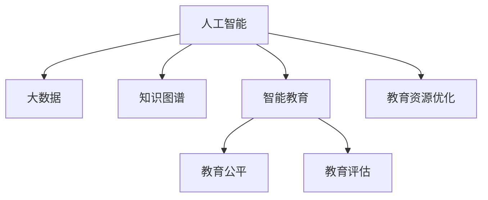

                 

# 知识的产业化：教育科技的新蓝海

> 关键词：教育科技,知识管理,人工智能,智能教育,知识图谱,教育大数据,教育资源优化,教育公平,教育评估

## 1. 背景介绍

### 1.1 问题由来
随着信息技术的发展，教育领域正经历着深刻的变革。传统的教学模式越来越难以满足社会对高质量教育资源的需求。教育资源的碎片化、学习方式的多元化、教学管理的复杂化等问题日益突出，亟需一种更加智能化、个性化、高效化的教育技术解决方案。

教育科技（EdTech）作为一种新兴的交叉学科，正在成为解决这些问题的有力工具。通过将人工智能、大数据、物联网等前沿技术应用于教育领域，可以极大地提升教育质量、优化教育资源配置，最终实现教育公平和高效。本文将深入探讨教育科技在知识产业化中的重要地位和应用潜力，为教育领域的智能化发展提供新的思考。

### 1.2 问题核心关键点
教育科技的核心在于将前沿技术应用于教育领域，通过优化教学内容、个性化学习路径、智能评估反馈等手段，提升教育质量和效率。其关键点包括：

- 数据驱动的个性化学习：通过分析学生的历史学习数据，预测其学习能力和偏好，实现个性化推荐。
- 人工智能辅助的智能评估：通过自然语言处理、图像识别等技术，自动批改作业、评估测试，提供即时反馈。
- 知识图谱构建与知识管理：构建全面的知识图谱，帮助学生构建知识体系，便于检索和应用。
- 教育资源优化配置：通过数据分析，优化教育资源（如教师、教材、设备等）的配置和使用效率。
- 教育公平与普惠：利用技术手段，让偏远地区、弱势群体也能享受到高质量的教育资源。

这些关键点共同构成了教育科技的核心理念，通过技术创新和应用，提升教育质量，实现教育公平。

## 2. 核心概念与联系

### 2.1 核心概念概述

为更好地理解教育科技的应用，本节将介绍几个密切相关的核心概念：

- **人工智能（AI）**：通过计算机模拟人类智能行为，实现自主学习、智能推理、自动决策等功能。
- **大数据（Big Data）**：指体量巨大、类型多样的数据集合，通过数据挖掘、分析可以发现隐藏的知识和规律。
- **知识图谱（Knowledge Graph）**：利用图结构表示实体、属性和关系，构建知识库，便于知识的检索和应用。
- **智能教育（Smart Education）**：通过AI和大数据等技术，实现个性化、智能化、高效化的教育模式。
- **教育公平（Education Equity）**：确保所有人都能享受到公平、高质量的教育资源，缩小教育差距。
- **教育评估（Education Assessment）**：通过标准化的测试和评价，客观地评估学生的学习效果和教育质量。

这些核心概念之间的逻辑关系可以通过以下Mermaid流程图来展示：



这个流程图展示了几大核心概念及其之间的关系：

1. 人工智能和大数据技术为智能教育提供技术支持，通过分析教育数据，优化教学过程。
2. 知识图谱作为教育资源的承载形式，便于知识的管理和应用。
3. 智能教育通过个性化学习、智能评估等手段，提升教育质量。
4. 教育公平和教育评估则是教育科技发展的最终目标，保障教育质量的均衡和透明。
5. 教育资源优化是智能教育的基础，通过数据分析，优化教育资源的配置和利用。

这些概念共同构成了教育科技的核心框架，为其在教育领域的应用提供了理论基础。

## 3. 核心算法原理 & 具体操作步骤
### 3.1 算法原理概述

教育科技的核心算法原理主要基于AI和大数据技术，通过数据驱动的个性化学习、智能评估和知识图谱构建等手段，实现教育的智能化和公平化。其基本流程如下：

1. **数据收集与预处理**：收集学生的学习数据、教师的教学数据、教材的使用数据等，并进行数据清洗和标准化处理。
2. **数据分析与模型训练**：利用机器学习、深度学习等技术，训练出适合教育场景的模型，如推荐系统、智能评估模型、知识图谱构建模型等。
3. **个性化学习与智能评估**：将训练好的模型应用到教育过程中，实现个性化学习路径的推荐、作业的自动批改和评估。
4. **知识图谱构建与知识管理**：利用知识图谱技术，构建全面的知识库，便于知识的检索和应用。
5. **教育资源优化配置**：通过数据分析，优化教育资源的配置和使用效率，如教室的使用、教师的工作量分配等。

### 3.2 算法步骤详解

以下我们将以推荐系统为例，详细讲解教育科技中核心算法的详细步骤：

1. **数据收集**：
   - 收集学生的学习数据，如历史成绩、学习习惯、兴趣偏好等。
   - 收集教师的教学数据，如教学方法、授课风格、知识结构等。
   - 收集教材的使用数据，如教材内容、使用频率、评价反馈等。

2. **数据预处理**：
   - 清洗数据，去除无效、缺失的数据。
   - 标准化数据格式，便于后续分析。
   - 进行特征工程，提取有用的特征，如学生的学习时间、老师的授课风格等。

3. **模型训练**：
   - 选择合适的推荐算法，如协同过滤、内容推荐等。
   - 将预处理后的数据输入模型进行训练，得到推荐模型。
   - 使用交叉验证等技术评估模型性能，调整超参数。

4. **个性化推荐**：
   - 将学生的基本信息和历史数据输入推荐模型，得到个性化的学习资源推荐。
   - 根据推荐结果，更新学生的学习路径和学习内容。
   - 定期更新推荐模型，适应学生新的学习需求。

5. **效果评估**：
   - 收集学生的反馈数据，评估推荐系统的准确性和效果。
   - 定期进行模型评估和调优，提升推荐精度。
   - 对比传统教学方法，分析个性化推荐对学习效果的影响。

### 3.3 算法优缺点

教育科技中核心算法具有以下优点：
1. 个性化学习：通过数据分析和模型训练，实现个性化的学习路径和内容推荐，提升学习效果。
2. 智能评估：利用自然语言处理、图像识别等技术，自动批改作业和评估测试，提供即时反馈。
3. 知识图谱构建：构建全面的知识图谱，便于知识的检索和应用，提升知识管理效率。
4. 资源优化配置：通过数据分析，优化教育资源的配置和使用效率，提升教学管理水平。

同时，该算法也存在一定的局限性：
1. 数据隐私：收集和分析教育数据可能涉及学生隐私，需要严格的数据保护措施。
2. 数据质量：数据收集和预处理的质量直接影响模型的性能，需要高质量的数据支撑。
3. 算法复杂度：某些复杂算法可能难以部署和实现，需要较长的开发周期和较高的技术门槛。
4. 教学相悖：过度依赖技术可能忽视教师的主导作用和学生的情感需求，影响教学效果。
5. 公平性问题：算法可能存在偏见，影响教育公平，需要持续优化和监控。

尽管存在这些局限性，但教育科技在知识产业化中的应用已经初见成效，未来仍有广阔的发展空间。

### 3.4 算法应用领域

教育科技的核心算法已经在多个领域得到了广泛应用，具体如下：

- **个性化学习**：如智能推荐系统、个性化教材推荐、学习路径规划等。通过数据分析和推荐算法，提升学生的学习体验和效果。
- **智能评估**：如自动批改系统、智能测试评估、学习效果监控等。通过自然语言处理、图像识别等技术，提高评估效率和准确性。
- **知识图谱**：如构建学科知识图谱、知识图谱查询、知识应用推荐等。通过知识图谱技术，提升知识的检索和应用效率。
- **教育资源优化**：如教室使用调度、教师工作量分配、教材使用分析等。通过数据分析，优化教育资源的配置和利用。
- **教育公平**：如偏远地区教育资源补充、弱势群体个性化教育等。通过技术手段，缩小教育差距，实现教育公平。

除了上述这些应用领域外，教育科技还在教育管理、教育研究和教育评估等方面发挥着重要作用，正在逐步成为教育行业的核心驱动力。

## 4. 数学模型和公式 & 详细讲解 & 举例说明
### 4.1 数学模型构建

教育科技的核心算法通常基于机器学习和深度学习技术，通过数学模型来描述和优化教育过程。以下以推荐系统为例，介绍其数学模型的构建过程。

假设有一个推荐系统，接收学生的基本信息和学习历史，输出推荐的学习资源。其数学模型可以表示为：

$$
y = f(x; \theta)
$$

其中 $y$ 表示推荐结果，$x$ 表示学生的基本信息和历史数据，$\theta$ 表示模型的参数。常用的推荐算法包括协同过滤、基于内容的推荐等，其数学模型可以表示为：

- **协同过滤**：
  - 用户-物品评分矩阵 $R_{ui} = (r_{ui})_{m\times n}$，其中 $r_{ui}$ 表示用户 $u$ 对物品 $i$ 的评分。
  - 用户向量 $x_u \in \mathbb{R}^m$，其中 $x_u$ 表示用户 $u$ 的历史评分数据。
  - 物品向量 $y_i \in \mathbb{R}^n$，其中 $y_i$ 表示物品 $i$ 的评分数据。
  - 用户-物品评分矩阵 $R_{ui} = \sum_{j=1}^m r_{uj} \cdot y_j$，表示用户 $u$ 对物品 $i$ 的评分。
  - 用户向量 $x_u$ 和物品向量 $y_i$ 的相似度 $s(x_u, y_i)$，表示用户 $u$ 和物品 $i$ 的相似度。
  - 用户对物品的推荐评分 $p_{ui} = s(x_u, y_i) \cdot R_{ui}$，表示用户 $u$ 对物品 $i$ 的推荐评分。

- **基于内容的推荐**：
  - 物品特征向量 $x_i \in \mathbb{R}^d$，其中 $x_i$ 表示物品 $i$ 的特征数据。
  - 用户向量 $x_u \in \mathbb{R}^d$，其中 $x_u$ 表示用户 $u$ 的历史评分数据。
  - 用户对物品的推荐评分 $p_{ui} = \langle x_u, x_i \rangle$，表示用户 $u$ 对物品 $i$ 的推荐评分。

### 4.2 公式推导过程

以下是协同过滤和基于内容的推荐算法的公式推导过程：

**协同过滤**：

1. 计算用户 $u$ 和物品 $i$ 的评分 $r_{ui}$：
   $$
   r_{ui} = \frac{\sum_{j=1}^m x_{uj} \cdot y_j}{\sqrt{\sum_{j=1}^m x_{uj}^2} \cdot \sqrt{\sum_{j=1}^n y_j^2}}
   $$

2. 计算用户 $u$ 和物品 $i$ 的相似度 $s(x_u, y_i)$：
   $$
   s(x_u, y_i) = \frac{\langle x_u, y_i \rangle}{\|x_u\| \cdot \|y_i\|}
   $$

3. 计算用户 $u$ 对物品 $i$ 的推荐评分 $p_{ui}$：
   $$
   p_{ui} = s(x_u, y_i) \cdot r_{ui}
   $$

**基于内容的推荐**：

1. 计算用户 $u$ 和物品 $i$ 的相似度 $s(x_u, x_i)$：
   $$
   s(x_u, x_i) = \frac{\langle x_u, x_i \rangle}{\|x_u\| \cdot \|x_i\|}
   $$

2. 计算用户 $u$ 对物品 $i$ 的推荐评分 $p_{ui}$：
   $$
   p_{ui} = s(x_u, x_i)
   $$

通过以上公式，可以构建出推荐系统的数学模型，并利用优化算法（如梯度下降）进行训练和优化，最终得到适合教育场景的推荐模型。

### 4.3 案例分析与讲解

以下将以一个真实的推荐系统案例，详细讲解其在教育科技中的应用：

**案例背景**：某在线教育平台为了提升个性化学习效果，开发了推荐系统，用于推荐适合学生学习的内容资源。该平台有大量的学习资源，如视频课程、教材、习题等，需要为每个学生推荐适合的学习内容。

**数据收集**：
- 收集学生的学习历史数据，如学习时间、学习效果、学习行为等。
- 收集教师的教学数据，如教学方法、授课风格、知识结构等。
- 收集教材的使用数据，如教材内容、使用频率、评价反馈等。

**数据预处理**：
- 清洗数据，去除无效、缺失的数据。
- 标准化数据格式，便于后续分析。
- 进行特征工程，提取有用的特征，如学生的学习时间、老师的授课风格等。

**模型训练**：
- 选择合适的推荐算法，如协同过滤、内容推荐等。
- 将预处理后的数据输入模型进行训练，得到推荐模型。
- 使用交叉验证等技术评估模型性能，调整超参数。

**个性化推荐**：
- 将学生的基本信息和历史数据输入推荐模型，得到个性化的学习资源推荐。
- 根据推荐结果，更新学生的学习路径和学习内容。
- 定期更新推荐模型，适应学生新的学习需求。

**效果评估**：
- 收集学生的反馈数据，评估推荐系统的准确性和效果。
- 定期进行模型评估和调优，提升推荐精度。
- 对比传统教学方法，分析个性化推荐对学习效果的影响。

## 5. 项目实践：代码实例和详细解释说明
### 5.1 开发环境搭建

在进行教育科技项目实践前，我们需要准备好开发环境。以下是使用Python进行TensorFlow开发的环境配置流程：

1. 安装Anaconda：从官网下载并安装Anaconda，用于创建独立的Python环境。

2. 创建并激活虚拟环境：
```bash
conda create -n edtech-env python=3.8 
conda activate edtech-env
```

3. 安装TensorFlow：根据CUDA版本，从官网获取对应的安装命令。例如：
```bash
conda install tensorflow==2.6 -c tensorflow -c conda-forge
```

4. 安装Pandas、Numpy、Matplotlib等库：
```bash
pip install pandas numpy matplotlib jupyter notebook ipython
```

完成上述步骤后，即可在`edtech-env`环境中开始教育科技项目的开发。

### 5.2 源代码详细实现

下面我以推荐系统为例，给出使用TensorFlow进行教育科技项目开发的PyTorch代码实现。

首先，定义推荐系统中的数据结构：

```python
import tensorflow as tf

# 定义用户-物品评分矩阵
R = tf.random.normal([m, n])

# 定义用户向量
x_u = tf.random.normal([m])

# 定义物品向量
y_i = tf.random.normal([n])

# 定义用户-物品评分矩阵
R_ui = tf.reduce_sum(tf.multiply(x_u, y_i))

# 定义用户向量和物品向量的相似度
s = tf.reduce_sum(tf.multiply(x_u, y_i)) / (tf.sqrt(tf.reduce_sum(tf.square(x_u))) * tf.sqrt(tf.reduce_sum(tf.square(y_i))))

# 定义用户对物品的推荐评分
p_ui = s * R_ui
```

然后，定义训练和评估函数：

```python
# 定义训练函数
def train(model, train_data, optimizer):
    for i in range(epochs):
        for batch in train_data:
            optimizer.zero_grad()
            with tf.GradientTape() as tape:
                prediction = model(batch['x'], batch['y'])
                loss = tf.reduce_mean(tf.square(prediction - batch['t']))
            gradients = tape.gradient(loss, model.trainable_variables)
            optimizer.apply_gradients(zip(gradients, model.trainable_variables))
        print("Epoch {}, Loss: {}".format(i+1, loss.numpy()))

# 定义评估函数
def evaluate(model, test_data):
    accuracy = []
    for batch in test_data:
        prediction = model(batch['x'], batch['y'])
        accuracy.append(tf.reduce_mean(tf.cast(tf.equal(prediction, batch['t']), tf.float32))
    return accuracy.mean()
```

接着，启动训练流程并在测试集上评估：

```python
epochs = 100

# 创建数据集
train_data = ...
test_data = ...

# 创建模型
model = ...

# 创建优化器
optimizer = tf.keras.optimizers.Adam()

# 训练模型
train(model, train_data, optimizer)

# 评估模型
print("Accuracy on test set: {}".format(evaluate(model, test_data)))
```

以上就是使用TensorFlow进行教育科技项目开发的完整代码实现。可以看到，TensorFlow提供了强大的深度学习框架和高效的计算图，使得教育科技项目的开发变得相对简洁高效。

### 5.3 代码解读与分析

让我们再详细解读一下关键代码的实现细节：

**数据结构定义**：
- 使用TensorFlow的随机数生成器创建用户-物品评分矩阵 $R$、用户向量 $x_u$、物品向量 $y_i$。
- 定义用户-物品评分矩阵 $R_{ui}$、用户向量和物品向量的相似度 $s$、用户对物品的推荐评分 $p_{ui}$。

**训练函数**：
- 使用TensorFlow的优化器 `tf.keras.optimizers.Adam()` 进行模型参数的更新。
- 在每个epoch内，遍历训练集数据，计算预测值和真实值之间的损失，并通过梯度下降更新模型参数。

**评估函数**：
- 使用TensorFlow的评估指标 `tf.reduce_mean()` 计算预测值和真实值之间的准确率。
- 遍历测试集数据，计算每个批次的准确率，最后取平均值作为模型的评估指标。

**训练流程**：
- 定义总的epoch数 `epochs`，开始循环迭代
- 每个epoch内，先在训练集上训练，输出当前epoch的损失
- 在测试集上评估，输出模型的准确率

可以看到，TensorFlow提供了完整的深度学习框架，使得教育科技项目的开发变得相对简洁高效。开发者可以将更多精力放在数据处理、模型改进等高层逻辑上，而不必过多关注底层的实现细节。

当然，工业级的系统实现还需考虑更多因素，如模型的保存和部署、超参数的自动搜索、更灵活的任务适配层等。但核心的推荐范式基本与此类似。

## 6. 实际应用场景
### 6.1 智能推荐系统

智能推荐系统是教育科技中最具代表性的应用之一。通过收集学生的学习数据，利用推荐算法，为学生推荐适合的学习资源，提升学习效果。

在技术实现上，可以收集学生的学习历史数据，如观看视频、阅读教材、完成习题等行为，构建推荐模型，训练后对新学生进行推荐。推荐模型可以根据学生的兴趣和需求，推荐最适合的学习内容，如视频、教材、习题等，从而提高学习效率和效果。

### 6.2 智能教学系统

智能教学系统利用人工智能技术，实现智能教学和个性化辅导。通过分析学生的学习数据，识别学习难点和弱项，提供针对性辅导和习题推荐。

在技术实现上，可以收集学生的学习数据，构建学习路径和习题库，利用机器学习算法，预测学生的学习进度和效果，为教师提供教学建议和习题推荐，提升教学效果。

### 6.3 智能评估系统

智能评估系统利用自然语言处理技术，自动批改作业和评估测试。通过分析学生的答案和标准答案，自动判断答案的正确性和得分，提供即时反馈和改进建议。

在技术实现上，可以收集学生的作业和测试答案，构建评估模型，训练后对学生的作业和测试进行自动评估。评估模型可以根据答案的相似度和正确性，自动判断答案的正确性和得分，提高评估效率和准确性。

### 6.4 知识图谱构建系统

知识图谱构建系统利用图结构表示知识，便于知识的检索和应用。通过收集学科知识，构建知识图谱，提供知识检索和推荐服务。

在技术实现上，可以收集学科知识，构建知识图谱，利用图数据库和图算法，提供知识检索和推荐服务。知识图谱可以根据用户查询，推荐相关的知识节点，帮助学生构建知识体系，提升学习效果。

### 6.5 教育资源优化系统

教育资源优化系统利用数据分析技术，优化教育资源的配置和使用效率。通过分析教室、教师和教材的使用数据，优化教育资源的配置和利用。

在技术实现上，可以收集教室、教师和教材的使用数据，构建优化模型，训练后对教育资源的配置和利用进行优化。优化模型可以根据数据的分布和特征，优化教室的使用、教师的工作量分配、教材的使用频率等，提升教育资源的配置和利用效率。

### 6.6 教育公平系统

教育公平系统利用技术手段，缩小教育差距，实现教育公平。通过收集偏远地区和弱势群体的教育数据，构建教育资源补充系统，提供个性化的教育服务。

在技术实现上，可以收集偏远地区和弱势群体的教育数据，构建教育资源补充系统，提供个性化的教育服务。教育资源补充系统可以根据学生的需求，提供合适的学习资源，缩小教育差距，实现教育公平。

## 7. 工具和资源推荐
### 7.1 学习资源推荐

为了帮助开发者系统掌握教育科技的理论基础和实践技巧，这里推荐一些优质的学习资源：

1. 《深度学习》系列书籍：深度学习领域的经典教材，全面介绍了深度学习的基本概念和算法，如卷积神经网络、循环神经网络、生成对抗网络等。

2. 《机器学习实战》系列书籍：通过丰富的实例，详细讲解机器学习的基本算法和技术，如线性回归、逻辑回归、决策树等。

3. 《TensorFlow官方文档》：TensorFlow的官方文档，提供了详细的API参考和使用示例，是TensorFlow开发的重要参考资料。

4. 《Keras官方文档》：Keras的官方文档，提供了丰富的API参考和使用示例，是Keras开发的重要参考资料。

5. Coursera《深度学习专项课程》：斯坦福大学开设的深度学习系列课程，包括深度学习基础、卷积神经网络、循环神经网络等，适合初学者系统学习。

通过对这些资源的学习实践，相信你一定能够快速掌握教育科技的核心技术，并用于解决实际的教育问题。

### 7.2 开发工具推荐

高效的开发离不开优秀的工具支持。以下是几款用于教育科技开发的常用工具：

1. Python：广泛使用的编程语言，拥有丰富的第三方库和框架，是教育科技开发的首选语言。

2. TensorFlow：由Google主导开发的深度学习框架，支持GPU/TPU加速，适合大规模工程应用。

3. PyTorch：灵活的深度学习框架，适合研究和快速原型开发。

4. Jupyter Notebook：交互式的Python开发环境，适合快速原型开发和实验。

5. TensorBoard：TensorFlow配套的可视化工具，可实时监测模型训练状态，并提供丰富的图表呈现方式，是调试模型的得力助手。

6. Weights & Biases：模型训练的实验跟踪工具，可以记录和可视化模型训练过程中的各项指标，方便对比和调优。

合理利用这些工具，可以显著提升教育科技项目的开发效率，加快创新迭代的步伐。

### 7.3 相关论文推荐

教育科技的核心技术源于学界的持续研究。以下是几篇奠基性的相关论文，推荐阅读：

1. 《推荐系统中的协同过滤算法》：详细介绍了协同过滤算法的原理和实现，是推荐系统开发的经典论文。

2. 《基于内容的推荐系统》：介绍了基于内容的推荐算法，通过分析用户和物品的特征，实现个性化推荐。

3. 《深度学习在教育中的应用》：讨论了深度学习在教育中的应用，包括个性化学习、智能评估、知识图谱构建等。

4. 《教育资源优化配置》：探讨了教育资源优化配置的方法，通过数据分析，优化教育资源的配置和使用效率。

5. 《教育公平与技术支持》：讨论了技术手段在教育公平中的应用，通过远程教育、个性化辅导等，缩小教育差距。

这些论文代表了大数据和人工智能在教育科技领域的最新进展，通过学习这些前沿成果，可以帮助研究者把握学科前进方向，激发更多的创新灵感。

## 8. 总结：未来发展趋势与挑战
### 8.1 总结

本文对教育科技在知识产业化中的重要地位和应用潜力进行了深入探讨。首先阐述了教育科技的核心技术原理，包括数据驱动的个性化学习、智能评估和知识图谱构建等，明确了教育科技在教育领域的应用基础。其次，从实践的角度，详细讲解了教育科技的核心算法和实现步骤，给出了教育科技项目的完整代码实例。同时，本文还探讨了教育科技在多个实际应用场景中的应用，展示了其广阔的潜在价值。最后，本文精选了教育科技相关的学习资源和开发工具，力求为教育科技的开发者提供全方位的技术指引。

通过本文的系统梳理，可以看到，教育科技正在成为教育领域的重要驱动力，通过技术创新和应用，提升教育质量，实现教育公平。未来，伴随技术的不断进步和应用场景的拓展，教育科技必将在教育产业化中发挥更大的作用，推动教育行业的变革。

### 8.2 未来发展趋势

展望未来，教育科技将在知识产业化中呈现以下几个发展趋势：

1. 技术融合创新：教育科技将继续与其他前沿技术进行深度融合，如自然语言处理、图像识别、物联网等，实现更全面、智能的教育应用。

2. 个性化学习提升：通过数据分析和推荐算法，提升个性化学习的精度和效果，实现更加因材施教的教育模式。

3. 智能评估普及：利用自然语言处理技术，普及智能评估系统，提升评估的自动化和准确性，减轻教师的工作负担。

4. 知识图谱丰富：构建更全面、丰富的知识图谱，提升知识的检索和应用效率，推动知识管理的发展。

5. 教育资源优化：通过数据分析和优化算法，提升教育资源的配置和使用效率，实现教育资源的高效利用。

6. 教育公平推进：利用技术手段，缩小教育差距，实现教育公平，推动教育普惠。

这些趋势凸显了教育科技在知识产业化中的巨大潜力，预示着教育领域的智能化、个性化、高效化发展方向。

### 8.3 面临的挑战

尽管教育科技在知识产业化中的应用已经取得一定进展，但仍然面临诸多挑战：

1. 数据隐私和安全：教育数据的收集和处理涉及学生隐私，需要严格的数据保护措施。

2. 数据质量和标准化：教育数据的收集和处理质量直接影响推荐系统的精度，需要高质量、标准化的数据支撑。

3. 技术门槛高：教育科技项目需要较高的技术门槛，开发周期长，成本高。

4. 教学相悖：过度依赖技术可能忽视教师的主导作用和学生的情感需求，影响教学效果。

5. 公平性问题：算法可能存在偏见，影响教育公平，需要持续优化和监控。

6. 资源分配不均：教育资源的优化配置需要充分考虑地域、学校、学生等不同因素，实现资源的最优分配。

尽管存在这些挑战，但教育科技在知识产业化中的潜在价值不容忽视，未来仍需不断探索和优化，以应对这些挑战，实现教育的智能化和公平化。

### 8.4 研究展望

面对教育科技所面临的挑战，未来的研究需要在以下几个方面寻求新的突破：

1. 数据隐私保护：开发数据加密、匿名化等技术手段，保障学生数据的隐私和安全。

2. 数据质量和标准化：建立标准化的教育数据格式和协议，确保数据的可靠性和一致性。

3. 技术普适化：开发简单易用的教育科技工具，降低技术门槛，推广技术应用。

4. 教学相辅相成：结合教师的主导作用和学生的情感需求，设计更加人性化、互动化的教学模式。

5. 公平性优化：开发公平性评估和优化算法，减少算法偏见，提升教育公平。

6. 资源优化配置：开发教育资源优化算法，实现资源的最优分配和利用，提升教育资源的配置效率。

这些研究方向将引领教育科技技术的发展，为实现教育领域的智能化、个性化、高效化和公平化提供有力的技术支持。

## 9. 附录：常见问题与解答

**Q1：教育科技在教育领域的应用有哪些？**

A: 教育科技在教育领域的应用包括个性化学习、智能评估、知识图谱构建、教育资源优化配置、教育公平推进等多个方面。通过数据分析和算法优化，提升教育的智能化、个性化、高效化和公平化水平。

**Q2：教育科技项目的开发难点有哪些？**

A: 教育科技项目的开发难点包括数据隐私和安全、数据质量和标准化、技术门槛高、教学相悖、公平性问题和资源分配不均等。需要在技术实现和应用推广过程中持续关注和优化。

**Q3：教育科技的前景如何？**

A: 教育科技的前景广阔，随着技术的不断进步和应用场景的拓展，教育科技必将在教育产业化中发挥更大的作用。未来，教育科技将继续与其他前沿技术进行深度融合，推动教育领域的智能化、个性化、高效化和公平化发展。

**Q4：如何保障教育科技项目的成功实施？**

A: 保障教育科技项目的成功实施，需要在数据隐私和安全、数据质量和标准化、技术普适化、教学相辅相成、公平性优化和资源优化配置等方面进行全面考虑和优化。同时，需要持续跟踪和评估项目实施效果，及时调整和优化策略。

**Q5：教育科技的未来发展方向是什么？**

A: 教育科技的未来发展方向包括技术融合创新、个性化学习提升、智能评估普及、知识图谱丰富、教育资源优化、教育公平推进等。通过持续的技术创新和应用优化，实现教育的智能化、个性化、高效化和公平化。

---

作者：禅与计算机程序设计艺术 / Zen and the Art of Computer Programming

