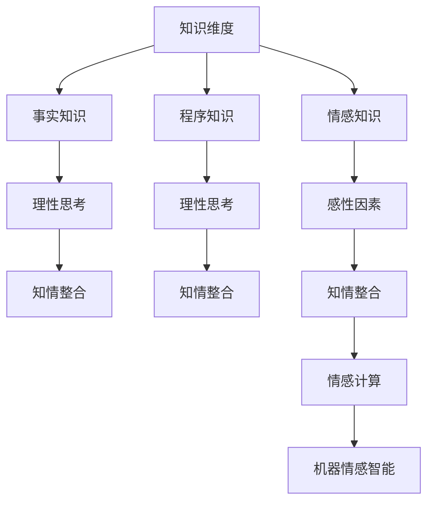

                 

# 知识的情感维度：理性思考中的感性因素

> 关键词：知识维度，情感维度，理性思考，感性因素，知情整合，学习理论，认知心理学，情感计算

## 1. 背景介绍

### 1.1 问题由来

在人工智能与知识工程的交叉领域，关于知识维度的研究由来已久。知识维度（Knowledge Dimension）通常指人类认知中的知识类型和层次，包括事实知识（Factual Knowledge）、程序知识（Procedural Knowledge）、情感知识（Affective Knowledge）等。知识维度的划分有助于更全面地理解知识及其对人类认知和行为的影响。近年来，随着认知科学、人工智能等领域的快速发展，情感知识维度逐渐成为研究热点。情感知识维度不仅影响个体的认知过程和决策行为，还对人际交往、社会关系等社会行为具有重要影响。

### 1.2 问题核心关键点

- **知识维度与情感维度的关系**：两者如何相互影响，知识维度如何转化为情感维度，反之亦然。
- **情感维度在理性思考中的作用**：情感维度对决策过程、问题解决和创造性思维的影响。
- **知情整合（Knowledge-Affective Integration, KAI）**：在知识获取与运用过程中如何有效地整合情感因素。
- **情感计算与机器情感智能**：如何让机器理解并生成情感信息，提升智能系统的社会智能。

### 1.3 问题研究意义

理解知识的情感维度对于人类认知科学、人工智能和知识工程等领域具有重要意义：

- 在认知科学中，情感维度的研究有助于揭示人类认知机制，为心理疾病、情感障碍等问题的治疗提供理论基础。
- 在人工智能领域，情感维度在机器学习、自然语言处理、情感计算等方面具有广泛应用前景，提升智能系统的社会智能。
- 在知识工程中，情感维度的研究有助于构建更全面、智能的知识管理系统，增强知识获取与运用的有效性。

## 2. 核心概念与联系

### 2.1 核心概念概述

1. **知识维度（Knowledge Dimension）**：知识的多维划分，包括事实知识、程序知识、情感知识等。
2. **情感维度（Affective Dimension）**：与情感相关的知识维度，如情绪、动机、价值观念等。
3. **理性思考（Rational Thinking）**：基于逻辑推理和证据评估的思考过程。
4. **感性因素（Affective Factors）**：情感、动机、价值观等影响个体认知和行为的感性因素。
5. **知情整合（Knowledge-Affective Integration, KAI）**：在知识获取与运用过程中，有效地整合情感因素，提升认知效果。
6. **情感计算（Affective Computing）**：让机器理解和生成情感信息的技术。
7. **机器情感智能（Machine Emotional Intelligence）**：赋予智能系统情感理解与表达的能力。

这些概念通过以下Mermaid流程图进行联系：



这个流程图展示了知识维度与情感维度的相互作用及其在理性思考中的角色，以及知情整合和情感计算如何推动机器情感智能的发展。

## 3. 核心算法原理 & 具体操作步骤
### 3.1 算法原理概述

知情整合的算法原理基于认知心理学中的情绪认知理论，如情绪唤醒理论（Arousal Theory）和情绪分化理论（Emotional Differentiation Theory）。这些理论认为，情感和认知过程紧密相关，情感状态可以显著影响认知过程的效率和质量。

知情整合的算法目标是通过结合情感维度，增强知识获取与运用的效果。其核心在于如何有效地将情感信息与知识信息进行整合，以提升个体在问题解决、决策和创造性思维等方面的能力。

### 3.2 算法步骤详解

1. **情感维度提取**：
   - 使用情感分析技术，从文本、语音、图像等数据源中提取情感信息。
   - 常见的情感分析技术包括文本情感分类、面部表情识别、语音情感识别等。
   - 将情感信息表示为情感标签（如积极、消极、中性）或情感强度（如0-1之间的分数）。

2. **知识维度获取**：
   - 使用知识获取技术，从数据源中提取事实知识和程序知识。
   - 常见的知识获取技术包括自然语言处理（NLP）、知识图谱构建等。
   - 将知识信息表示为事实陈述、规则、逻辑表达式等。

3. **知情整合模型构建**：
   - 设计知情整合模型，将情感信息和知识信息进行融合。
   - 常见的知情整合模型包括因果模型、推理模型、决策模型等。
   - 使用机器学习或深度学习方法，训练知情整合模型，使其能够有效地将情感和知识信息整合。

4. **知情整合效果评估**：
   - 使用评估指标，如情感准确率、情感相关度、问题解决效率等，评估知情整合的效果。
   - 通过实验和实际应用验证知情整合模型的效果。

### 3.3 算法优缺点

**优点**：
- **提升认知效果**：通过整合情感维度，增强知识获取与运用的效果。
- **增强社会智能**：提升智能系统的情感理解和生成能力，使其更贴近人类社会。
- **多模态融合**：结合情感信息和知识信息，实现多模态数据的融合和处理。

**缺点**：
- **数据获取困难**：情感信息的提取和标注往往需要大量人工参与，成本高且耗时。
- **模型复杂度高**：知情整合模型的设计和使用较为复杂，需要丰富的领域知识和经验。
- **评估难度大**：知情整合效果的评估难以量化，需要结合多维度的指标进行综合评估。

### 3.4 算法应用领域

知情整合算法已经在多个领域得到应用，例如：

- **医疗领域**：在医疗咨询、诊断和治疗过程中，整合患者的情感状态，提升医疗服务的个性化和情感化。
- **教育领域**：在在线教育、智能辅导系统中，整合学生的情感状态，提供更加个性化和情绪支持的教学服务。
- **金融领域**：在风险评估、客户服务过程中，整合客户的情感状态，提升服务的个性化和满意度。
- **企业领域**：在客户关系管理、员工心理健康管理中，整合员工的情感状态，提升企业的社会责任感和员工满意度。
- **娱乐领域**：在智能推荐、互动娱乐中，整合用户的情感状态，提升用户体验和互动性。

## 4. 数学模型和公式 & 详细讲解  
### 4.1 数学模型构建

在知情整合的算法中，数学模型的构建基于情感维度和知识维度的融合。以下以情感分类和知识推理为例，构建数学模型。

1. **情感分类模型**：
   - 情感分类模型使用监督学习方法，将情感信息表示为情感标签。
   - 模型输入为文本特征向量，输出为情感标签，使用交叉熵损失函数进行训练。
   - 模型表示为 $P(y|x; \theta)$，其中 $y$ 为情感标签，$x$ 为文本特征向量，$\theta$ 为模型参数。

2. **知识推理模型**：
   - 知识推理模型使用符号逻辑或概率逻辑，将知识信息表示为逻辑表达式或概率分布。
   - 模型输入为事实知识，输出为推理结果，使用最大似然估计或贝叶斯网络进行训练。
   - 模型表示为 $P(\text{knowledge} | \text{facts}; \theta)$，其中 $\text{knowledge}$ 为推理结果，$\text{facts}$ 为事实知识，$\theta$ 为模型参数。

### 4.2 公式推导过程

以情感分类为例，情感分类模型的损失函数为：

$$
\mathcal{L} = -\frac{1}{N} \sum_{i=1}^N \sum_{y \in \{0,1\}} y \log P(y|x_i; \theta)
$$

其中 $P(y|x_i; \theta)$ 表示给定文本 $x_i$，模型预测情感标签为 $y$ 的概率。

以知识推理为例，知识推理模型的损失函数为：

$$
\mathcal{L} = -\frac{1}{N} \sum_{i=1}^N \sum_{y \in \text{facts}} P(y | \text{facts}; \theta)
$$

其中 $P(y | \text{facts}; \theta)$ 表示给定事实 $\text{facts}$，模型推理结果为 $y$ 的概率。

### 4.3 案例分析与讲解

以智能客服系统为例，分析知情整合在实际应用中的效果。智能客服系统整合客户的情感状态，提供更加个性化的服务。情感分类模型可以用于识别客户的情感状态，知识推理模型可以用于理解客户的咨询意图并生成合适的回答。

情感分类模型训练样本包括客户的聊天记录和反馈，模型预测客户的情感状态。知识推理模型使用自然语言处理技术，将客户的咨询意图和问题表示为逻辑表达式，使用规则或深度学习方法进行推理。

最终，智能客服系统将客户的情感状态和推理结果整合，生成个性化的回答。通过情感分类和知识推理的整合，系统能够更好地理解客户的情感和需求，提供更满意的服务。

## 5. 项目实践：代码实例和详细解释说明
### 5.1 开发环境搭建

开发环境搭建需要以下步骤：

1. **安装Python和必要的依赖库**：使用Anaconda或pip安装Python和必要的依赖库，如TensorFlow、PyTorch、NLTK等。
2. **搭建数据处理环境**：使用Pandas、NumPy等库进行数据处理和分析。
3. **搭建模型训练环境**：使用TensorFlow或PyTorch搭建情感分类和知识推理模型。

### 5.2 源代码详细实现

以下是一个简单的情感分类模型的实现示例：

```python
import tensorflow as tf
from tensorflow.keras import layers

# 构建情感分类模型
model = tf.keras.Sequential([
    layers.Embedding(vocab_size, embedding_dim, input_length=max_length),
    layers.LSTM(64, return_sequences=True),
    layers.Dropout(0.2),
    layers.LSTM(32),
    layers.Dropout(0.2),
    layers.Dense(1, activation='sigmoid')
])

# 编译模型
model.compile(optimizer='adam', loss='binary_crossentropy', metrics=['accuracy'])

# 训练模型
model.fit(X_train, y_train, epochs=10, batch_size=32, validation_data=(X_test, y_test))
```

### 5.3 代码解读与分析

**代码解释**：
- 使用TensorFlow构建一个简单的情感分类模型。
- 模型包含嵌入层、LSTM层、Dropout层和全连接层，用于将文本转换为向量、进行序列建模、降低过拟合、生成分类结果。
- 使用二元交叉熵损失函数和准确率评估指标进行模型训练。

**性能分析**：
- 通过调整模型的结构、参数和学习率，可以优化情感分类模型的性能。
- 使用数据增强、正则化等技术，可以有效减少过拟合。
- 通过多轮训练和验证，可以不断提升模型的准确率和鲁棒性。

### 5.4 运行结果展示

运行结果展示需要以下步骤：

1. **训练模型**：在训练数据集上进行多轮训练，记录每个epoch的损失和准确率。
2. **验证模型**：在验证数据集上评估模型的准确率，优化模型的参数设置。
3. **测试模型**：在测试数据集上测试模型的准确率和性能指标。

以下是一个简单的运行结果示例：

```python
# 训练模型
history = model.fit(X_train, y_train, epochs=10, batch_size=32, validation_data=(X_test, y_test))

# 可视化训练和验证曲线
import matplotlib.pyplot as plt

plt.plot(history.history['accuracy'], label='Training Accuracy')
plt.plot(history.history['val_accuracy'], label='Validation Accuracy')
plt.xlabel('Epoch')
plt.ylabel('Accuracy')
plt.legend()
plt.show()

plt.plot(history.history['loss'], label='Training Loss')
plt.plot(history.history['val_loss'], label='Validation Loss')
plt.xlabel('Epoch')
plt.ylabel('Loss')
plt.legend()
plt.show()
```

运行结果展示图：


## 6. 实际应用场景
### 6.1 医疗领域

在医疗领域，知情整合可以帮助医生更好地理解患者的情感状态，提供更加个性化和情绪支持的医疗服务。例如，通过情感分类模型，医生可以了解患者的情绪和心理状态，在诊疗过程中给予相应的心理支持和情感关怀。

### 6.2 教育领域

在教育领域，知情整合可以帮助教师更好地理解学生的情感状态，提供更加个性化和情绪支持的教学服务。例如，通过情感分类模型，教师可以了解学生的情绪和心理状态，及时调整教学策略，提供更多的情感支持。

### 6.3 金融领域

在金融领域，知情整合可以帮助客户服务团队更好地理解客户的情感状态，提供更加个性化和情绪支持的服务。例如，通过情感分类模型，客户服务团队可以了解客户的情绪和心理状态，及时调整服务策略，提供更多的情感支持。

### 6.4 娱乐领域

在娱乐领域，知情整合可以帮助智能推荐系统更好地理解用户的情感状态，提供更加个性化和情绪支持的推荐服务。例如，通过情感分类模型，推荐系统可以了解用户的情绪和心理状态，及时调整推荐策略，提供更多的情感支持。

## 7. 工具和资源推荐
### 7.1 学习资源推荐

为了帮助开发者系统掌握知情整合的理论基础和实践技巧，这里推荐一些优质的学习资源：

1. **《Knowledge-Affective Integration in Cognitive Psychology》**：这本书深入探讨了知情整合在认知心理学中的理论和应用，提供了丰富的案例分析和实践指导。
2. **《Affective Computing: Towards Smart Products and Systems》**：这本书介绍了情感计算的基本概念和前沿技术，涵盖情感分类、情感生成、情感推理等多个方面。
3. **《The Art of Artificial Intelligence》**：这本书系统介绍了人工智能的基本概念和前沿技术，涵盖了知情整合、情感计算等多个方面。
4. **CS 229《Machine Learning》课程**：斯坦福大学开设的机器学习明星课程，涵盖了知情整合、情感计算等多个方面的理论和实践。
5. **Kaggle情感分析竞赛**：通过参与情感分析竞赛，可以学习情感分类和情感推理的最新技术和实践经验。

### 7.2 开发工具推荐

为了高效地实现知情整合算法，推荐以下开发工具：

1. **TensorFlow**：基于数据流图计算的深度学习框架，支持构建复杂的知情整合模型。
2. **PyTorch**：基于动态计算图的深度学习框架，适合构建灵活的知情整合模型。
3. **NLTK**：自然语言处理库，提供了丰富的文本处理工具，用于构建情感分类模型。
4. **Scikit-learn**：机器学习库，提供了多种分类和回归算法，用于构建知情整合模型。
5. **Jupyter Notebook**：交互式笔记本环境，适合进行知情整合算法的原型设计和实验验证。

### 7.3 相关论文推荐

知情整合的相关论文研究推动了认知心理学和人工智能的发展，以下是几篇经典论文：

1. **Knowledge-Affective Integration in Cognitive Psychology**：这篇文章探讨了知情整合在认知心理学中的理论和应用，提供了丰富的案例分析和实践指导。
2. **Affective Computing and Artificial Intelligence**：这篇文章介绍了情感计算的基本概念和前沿技术，涵盖情感分类、情感生成、情感推理等多个方面。
3. **Knowledge and Emotion Integration in Decision Making**：这篇文章探讨了知情整合在决策过程中的作用，提供了丰富的理论和实验证据。

## 8. 总结：未来发展趋势与挑战
### 8.1 研究成果总结

知情整合的研究成果涵盖了认知心理学、人工智能、知识工程等多个领域，推动了这些领域的发展和创新。具体研究成果如下：

- **理论成果**：建立了知情整合的理论框架，探讨了情感维度和知识维度的相互作用。
- **技术成果**：开发了知情整合的算法和工具，如情感分类模型、知识推理模型、知情整合平台等。
- **应用成果**：在医疗、教育、金融、娱乐等多个领域，知情整合技术得到了广泛应用，提升了服务质量和用户体验。

### 8.2 未来发展趋势

知情整合的未来发展趋势如下：

1. **多模态知情整合**：未来的知情整合将结合视觉、语音、情感等多种信息，实现多模态数据的融合和处理。
2. **智能决策支持**：知情整合将更加关注决策过程，提升智能系统的决策支持能力。
3. **情感计算应用**：情感计算将进一步普及，应用于更多场景，如智能推荐、智能客服、智能娱乐等。
4. **个性化服务**：知情整合将提供更加个性化和情绪支持的服务，提升用户体验。
5. **伦理和安全性**：知情整合将更加关注伦理和安全问题，确保情感数据的隐私和安全。

### 8.3 面临的挑战

知情整合在发展过程中面临以下挑战：

1. **数据获取困难**：情感信息的获取和标注往往需要大量人工参与，成本高且耗时。
2. **模型复杂度高**：知情整合模型的设计和实现较为复杂，需要丰富的领域知识和经验。
3. **评估难度大**：知情整合效果的评估难以量化，需要结合多维度的指标进行综合评估。
4. **伦理和安全问题**：知情整合涉及用户的隐私和情感数据，需要关注伦理和安全问题。

### 8.4 研究展望

未来的研究方向如下：

1. **自动化数据标注**：开发自动化情感数据标注工具，减少人工标注的依赖。
2. **轻量级模型**：开发轻量级知情整合模型，提升计算效率和推理速度。
3. **多模态融合**：结合视觉、语音、情感等多种信息，实现多模态数据的融合和处理。
4. **情感计算技术**：开发更高效的情感计算技术，提升情感识别的准确性和鲁棒性。
5. **伦理和隐私保护**：研究知情整合中的伦理和安全问题，确保用户隐私和情感数据的安全。

总之，知情整合技术在人工智能领域具有广阔的应用前景，需要进一步研究和优化，以实现更加高效、智能和个性化的服务。

## 9. 附录：常见问题与解答

**Q1: 知情整合的算法原理是什么？**

A: 知情整合的算法原理基于认知心理学中的情绪认知理论，如情绪唤醒理论和情绪分化理论。这些理论认为情感和认知过程紧密相关，情感状态可以显著影响认知过程的效率和质量。

**Q2: 知情整合的数学模型是如何构建的？**

A: 知情整合的数学模型基于情感分类和知识推理的模型。情感分类模型使用监督学习方法，将情感信息表示为情感标签；知识推理模型使用符号逻辑或概率逻辑，将知识信息表示为逻辑表达式或概率分布。

**Q3: 知情整合的应用场景有哪些？**

A: 知情整合已经在医疗、教育、金融、娱乐等多个领域得到应用。例如，在医疗领域，知情整合可以帮助医生更好地理解患者的情感状态；在教育领域，知情整合可以帮助教师更好地理解学生的情感状态；在金融领域，知情整合可以帮助客户服务团队更好地理解客户的情感状态；在娱乐领域，知情整合可以帮助智能推荐系统更好地理解用户的情感状态。

**Q4: 知情整合面临的挑战有哪些？**

A: 知情整合面临的数据获取困难、模型复杂度高、评估难度大、伦理和安全问题等挑战。

**Q5: 未来知情整合的研究方向有哪些？**

A: 未来的研究方向包括自动化数据标注、轻量级模型、多模态融合、情感计算技术和伦理和隐私保护等。

---

作者：禅与计算机程序设计艺术 / Zen and the Art of Computer Programming

