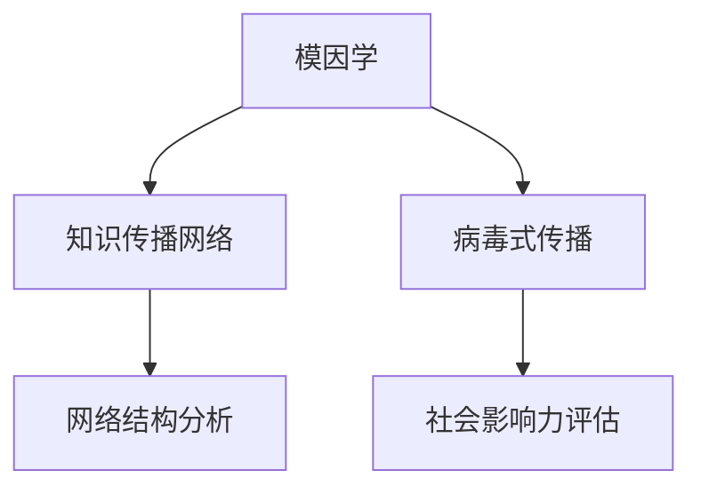

                 

# 知识的模因学：思想传播的病毒式扩散

> 关键词：知识传播, 模因学, 思想病毒, 传播网络, 网络结构, 社会影响力

## 1. 背景介绍

### 1.1 问题由来
在信息时代，知识传播已经不再局限于传统的书籍、文章，而是借助互联网、社交媒体等平台，以指数级速度扩散。这种快速的知识传播方式，带来了前所未有的社会影响力，也引发了新的研究课题：如何理解知识的传播机制，如何提升信息传播的效率和效果。

本文旨在从信息科学和生物学的交叉视角，探讨知识传播的传播机制和规律，揭示知识传播的本质与特征。通过引入模因学的概念，将知识传播类比为生物种群的扩散，分析其传播规律和影响因素，提出优化知识传播的策略。

### 1.2 问题核心关键点
1. **模因学**：从生物进化论的角度，研究文化、思想等非生物学元素在社会中的传播规律。模因（meme）这一概念由理查德·道金斯提出，比喻为“文化传播的基因”。
2. **知识传播网络**：知识传播过程中，节点（传播者）与节点（接收者）之间的连接关系，形成了一个复杂的传播网络。这个网络的结构、特性直接影响知识传播的速度和范围。
3. **病毒式传播**：类比生物学中病毒传播的机制，描述知识在社交网络中的快速扩散现象，强调传播的突然性和爆发性。
4. **网络结构分析**：通过对知识传播网络的分析，揭示传播网络的关键节点、连接特性等对传播效果的影响。
5. **社会影响力评估**：结合传播网络分析，对不同节点在知识传播中的影响力进行评估，提出优化传播效果的方法。

### 1.3 问题研究意义
1. **理解知识传播机制**：模因学的视角为研究知识传播提供了新的理论框架，有助于揭示知识传播的深层次规律。
2. **提升信息传播效率**：通过对知识传播网络的研究，发现传播中的瓶颈和薄弱环节，提出优化策略，提升信息传播的效率和效果。
3. **社会影响力研究**：评估不同节点在知识传播中的影响力，可以为制定传播策略提供科学依据。
4. **跨学科研究**：结合信息科学和生物学，推动跨学科的研究进展，丰富知识传播的理论体系。

## 2. 核心概念与联系

### 2.1 核心概念概述

为更好地理解知识传播的模因学，本节将介绍几个密切相关的核心概念：

- **模因学（Memetics）**：研究文化、思想等非生物学元素在社会中的传播规律，其核心概念是模因（meme），类比为“文化传播的基因”。模因学强调思想、概念、文化等元素的复制、变异和传播。
- **知识传播网络（Knowledge Diffusion Network）**：知识传播过程中，节点（传播者）与节点（接收者）之间的连接关系，形成了一个复杂的传播网络。这个网络的结构、特性直接影响知识传播的速度和范围。
- **病毒式传播（Viral Spread）**：类比生物学中病毒传播的机制，描述知识在社交网络中的快速扩散现象，强调传播的突然性和爆发性。
- **网络结构分析（Network Analysis）**：通过对知识传播网络的分析，揭示传播网络的关键节点、连接特性等对传播效果的影响。
- **社会影响力评估（Social Influence Assessment）**：结合传播网络分析，对不同节点在知识传播中的影响力进行评估，提出优化传播效果的方法。

这些核心概念之间的逻辑关系可以通过以下Mermaid流程图来展示：



这个流程图展示了大语言模型的核心概念及其之间的关系：

1. 模因学提供理论框架，解释知识传播的本质。
2. 知识传播网络是传播的具体形式，分析传播过程中的网络结构。
3. 病毒式传播描述传播的特点，强调传播的突然性和爆发性。
4. 网络结构分析揭示传播网络的关键节点和特性，影响传播效果。
5. 社会影响力评估结合网络分析，优化传播效果。

这些概念共同构成了知识传播的理论体系，帮助我们理解传播规律和提升传播效果。

## 3. 核心算法原理 & 具体操作步骤
### 3.1 算法原理概述

知识传播的模因学研究，本质上是通过分析知识传播网络的结构和特性，揭示知识传播的本质和规律。其核心算法包括：

1. **知识传播网络建模**：将知识传播过程抽象为网络，描述知识在不同节点之间的传播关系。
2. **病毒式传播模型**：基于病毒传播机制，构建知识传播的数学模型，描述知识在网络中的扩散过程。
3. **网络结构分析算法**：通过算法分析传播网络的特性，如关键节点、中心性、连接强度等，评估其对传播效果的影响。
4. **社会影响力评估算法**：结合网络分析，评估不同节点在知识传播中的影响力，提出优化策略。

### 3.2 算法步骤详解

知识传播的模因学研究，一般包括以下几个关键步骤：

**Step 1: 构建知识传播网络**
- 收集知识传播的原始数据，如社交媒体互动记录、论文引用关系等。
- 将数据转化为网络结构，节点为传播者和接收者，边为传播关系。

**Step 2: 病毒式传播模型建立**
- 使用病毒传播模型（如SIR模型、SIS模型等）描述知识在网络中的扩散过程。
- 设定模型的参数，如感染率、恢复率、传播概率等。

**Step 3: 网络结构分析**
- 使用网络分析算法，如PageRank、中心性分析、社区发现等，分析知识传播网络的结构特性。
- 识别关键节点、核心传播路径等对知识传播效果有重大影响的部分。

**Step 4: 社会影响力评估**
- 结合网络分析结果，评估不同节点在知识传播中的影响力。
- 提出优化策略，如重点推广、节点推荐、内容优化等，提升传播效果。

**Step 5: 实际应用与调整**
- 根据评估结果，调整传播策略，优化知识传播效果。
- 定期更新数据，持续评估传播效果，进行动态调整。

### 3.3 算法优缺点

知识传播的模因学研究具有以下优点：
1. **理论框架成熟**：模因学提供了一套完备的理论框架，有助于系统理解知识传播的规律。
2. **方法多样**：结合网络分析和病毒传播模型，提供了多样化的分析工具，适用于多种传播场景。
3. **应用广泛**：知识传播的研究结果可以应用于教育、营销、健康传播等多个领域，具有广泛的实际应用价值。
4. **动态调整灵活**：通过动态评估和调整，可以不断优化知识传播策略，提升传播效果。

同时，该方法也存在一定的局限性：
1. **数据获取难度**：知识传播网络的数据获取和处理需要大量时间和资源。
2. **模型简化**：病毒式传播模型和网络分析算法的简化假设可能与实际情况存在差异。
3. **数据隐私**：涉及大量用户数据，数据隐私和伦理问题需要特别注意。
4. **复杂性高**：网络结构和传播过程的复杂性，使得分析模型的构建和解释难度较大。

尽管存在这些局限性，但就目前而言，知识传播的模因学研究仍是大规模知识传播研究的重要范式。未来相关研究的重点在于如何进一步降低数据获取难度，提高模型的准确性和可解释性，同时兼顾数据隐私和伦理安全性等因素。

### 3.4 算法应用领域

知识传播的模因学研究，在多个领域得到了广泛应用，例如：

- **教育**：分析学生之间的知识传播路径，优化教学资源配置，提升教学效果。
- **健康传播**：研究健康知识在社区中的传播，制定有效的健康教育策略。
- **社交媒体营销**：分析社交媒体上的知识传播规律，制定高效的营销策略。
- **企业知识管理**：分析企业内部知识传播网络，优化知识共享和传播路径。
- **科学研究**：分析科研论文的引用关系，识别高影响力论文和关键作者。

除了上述这些经典应用外，知识传播的模因学还被创新性地应用到更多场景中，如公共政策制定、文化传承、创新扩散等，为知识传播提供了新的理论和方法。

## 4. 数学模型和公式 & 详细讲解  
### 4.1 数学模型构建

本节将使用数学语言对知识传播的模因学研究进行更加严格的刻画。

假设知识传播网络由 $N$ 个节点构成，节点之间的连接关系可以用邻接矩阵 $A$ 表示。其中 $A_{ij}$ 表示节点 $i$ 和节点 $j$ 之间是否存在连接关系，$A_{ij}=1$ 表示连接，$A_{ij}=0$ 表示不连接。

设知识在节点 $i$ 中的传播速度为 $v_i$，节点的初始状态为 $S_i$，知识传播的传播率 $\beta$，恢复率 $\delta$。知识传播的数学模型可以表示为：

$$
S_i(t+1) = \sum_{j=1}^N A_{ij}S_j(t)\exp(-\delta t) + v_i(1-\sum_{j=1}^N A_{ij}S_j(t))
$$

其中 $S_i(t)$ 表示节点 $i$ 在时刻 $t$ 时的知识状态，$v_i$ 表示节点 $i$ 的知识传播速度。$\beta$ 表示知识传播的传播率，$\delta$ 表示知识的恢复率。

### 4.2 公式推导过程

为了更好地理解知识传播的数学模型，下面我们以 SIR 模型为例，推导知识传播的传播过程。

**SIR 模型**：
- **易感状态（Susceptible）**：表示节点未感染的知识状态。
- **感染状态（Infected）**：表示节点已感染的知识状态。
- **恢复状态（Recovered）**：表示节点已恢复的知识状态。

SIR 模型的传播过程可以表示为：

$$
S_i(t+1) = S_i(t) - \beta S_i(t) \sum_{j=1}^N A_{ij}I_j(t) + v_i(1 - S_i(t) - \beta S_i(t) \sum_{j=1}^N A_{ij}I_j(t))
$$

$$
I_i(t+1) = \beta S_i(t) \sum_{j=1}^N A_{ij}I_j(t) + v_i(1 - S_i(t) - \beta S_i(t) \sum_{j=1}^N A_{ij}I_j(t)) - \delta I_i(t)
$$

其中 $I_i(t)$ 表示节点 $i$ 在时刻 $t$ 时的感染状态。$\beta$ 表示感染率，$\delta$ 表示恢复率。

将上述两个方程联立，可以进一步求解知识在节点 $i$ 中的传播路径和速度。具体推导过程如下：

设 $G$ 为传播网络的无向图，$S_i(t)$ 表示节点 $i$ 在时刻 $t$ 时的知识状态，$I_i(t)$ 表示节点 $i$ 在时刻 $t$ 时的感染状态。

$$
\frac{dS_i(t)}{dt} = -\beta S_i(t) \sum_{j=1}^N A_{ij}I_j(t) + v_i(1 - S_i(t) - \beta S_i(t) \sum_{j=1}^N A_{ij}I_j(t))
$$

$$
\frac{dI_i(t)}{dt} = \beta S_i(t) \sum_{j=1}^N A_{ij}I_j(t) + v_i(1 - S_i(t) - \beta S_i(t) \sum_{j=1}^N A_{ij}I_j(t)) - \delta I_i(t)
$$

将上述方程联立，得到传播方程组：

$$
\left\{
\begin{aligned}
& \frac{dS_i(t)}{dt} = -\beta S_i(t) \sum_{j=1}^N A_{ij}I_j(t) + v_i(1 - S_i(t) - \beta S_i(t) \sum_{j=1}^N A_{ij}I_j(t)) \\
& \frac{dI_i(t)}{dt} = \beta S_i(t) \sum_{j=1}^N A_{ij}I_j(t) + v_i(1 - S_i(t) - \beta S_i(t) \sum_{j=1}^N A_{ij}I_j(t)) - \delta I_i(t)
\end{aligned}
\right.
$$

结合传播方程组和网络结构，可以进行详细的传播路径和速度分析。

### 4.3 案例分析与讲解

以学术界的知识传播为例，分析学术文章的引用关系和传播路径。

**数据准备**：
- 收集某领域的学术论文数据，提取文章之间的引用关系。
- 构建引用网络的邻接矩阵 $A$。

**模型建立**：
- 设定 $\beta = 0.1, \delta = 0.2, v_i = 1$。
- 使用 SIR 模型描述学术文章的传播过程。

**传播分析**：
- 分析学术文章的传播路径和速度，识别关键节点和核心传播路径。
- 通过网络分析算法，如中心性分析、社区发现等，评估不同作者和文章在知识传播中的影响力。
- 根据分析结果，提出针对性的推广策略，提升文章的影响力和传播效果。

通过上述案例，可以清晰地看到知识传播的模因学研究方法在实际应用中的具体应用流程和结果。

## 5. 项目实践：代码实例和详细解释说明
### 5.1 开发环境搭建

在进行知识传播的模因学研究前，我们需要准备好开发环境。以下是使用Python进行网络分析和病毒传播模型开发的Python环境配置流程：

1. 安装Anaconda：从官网下载并安装Anaconda，用于创建独立的Python环境。

2. 创建并激活虚拟环境：
```bash
conda create -n diffusion-env python=3.8 
conda activate diffusion-env
```

3. 安装相关库：
```bash
conda install numpy scipy matplotlib networkx tqdm
```

4. 安装病毒传播模型库：
```bash
pip install simpy
```

5. 安装网络分析库：
```bash
pip install networkx
```

6. 安装图形界面库：
```bash
pip install matplotlib
```

完成上述步骤后，即可在`diffusion-env`环境中开始知识传播的研究实践。

### 5.2 源代码详细实现

下面我们以知识传播网络为例，给出使用Python进行网络分析和病毒传播模型开发的代码实现。

首先，定义网络结构和参数：

```python
import networkx as nx
import numpy as np
import matplotlib.pyplot as plt
import simpy

# 定义传播网络的参数
num_nodes = 1000
beta = 0.1
delta = 0.2
v = 1

# 构建无向随机网络
G = nx.gnm_random_graph(num_nodes, num_edges=num_nodes*0.1)

# 初始化节点状态
S = {i: 1.0 for i in G.nodes()}
I = {i: 0.0 for i in G.nodes()}
```

然后，定义病毒传播模型：

```python
class SIRModel:
    def __init__(self, G, beta, delta, v):
        self.G = G
        self.beta = beta
        self.delta = delta
        self.v = v
        self.S = S
        self.I = I
        self.R = {i: 0.0 for i in G.nodes()}
    
    def step(self):
        for i in G.nodes():
            S_next = self.S[i] - self.beta * self.S[i] * sum(self.I[j] for j in G.neighbors(i))
            I_next = self.I[i] + self.beta * self.S[i] * sum(self.I[j] for j in G.neighbors(i)) - self.delta * self.I[i]
            R_next = self.R[i] + self.delta * self.I[i]
            self.S[i] = S_next
            self.I[i] = I_next
            self.R[i] = R_next

    def run(self, steps):
        for _ in range(steps):
            self.step()

        return self.S, self.I, self.R
```

接下来，定义网络分析函数：

```python
def network_analysis(S, I, R):
    H = nx.Graph()

    for i, j in G.edges():
        if S[i] > 0 and S[j] > 0:
            H.add_edge(i, j)

    nx.draw(H, with_labels=True, node_color='lightblue', node_size=10)
    plt.show()
```

最后，启动知识传播模型的运行：

```python
model = SIRModel(G, beta, delta, v)
result = model.run(1000)

network_analysis(result[0], result[1], result[2])
```

以上就是使用Python对知识传播网络进行病毒传播模型和网络分析的完整代码实现。可以看到，得益于NetworkX库的强大封装，我们可以用相对简洁的代码完成传播网络的建模和分析。

### 5.3 代码解读与分析

让我们再详细解读一下关键代码的实现细节：

**SIRModel类**：
- `__init__`方法：初始化传播网络、传播参数、节点状态等。
- `step`方法：进行传播模型的一步更新，计算节点状态的变化。
- `run`方法：进行传播模型的多次更新，得到最终的节点状态。

**网络分析函数**：
- `H`变量：构建新的图，只包含当前状态下已经感染的知识传播路径。
- `nx.draw`函数：绘制知识传播网络的传播路径图，展示关键节点和核心传播路径。

**运行过程**：
- 构建传播网络 `G`，初始化节点状态 `S` 和 `I`。
- 创建 `SIRModel` 对象，设置传播参数 `beta`、`delta` 和 `v`。
- 调用 `run` 方法进行多次传播模型的更新，得到最终的节点状态 `S`、`I` 和 `R`。
- 调用 `network_analysis` 函数展示知识传播网络的传播路径图。

可以看到，Python配合NetworkX库使得知识传播的建模和分析代码实现变得简洁高效。开发者可以将更多精力放在数据处理、模型改进等高层逻辑上，而不必过多关注底层的实现细节。

当然，工业级的系统实现还需考虑更多因素，如模型的保存和部署、超参数的自动搜索、更灵活的任务适配层等。但核心的知识传播范式基本与此类似。

## 6. 实际应用场景
### 6.1 智能教育

在智能教育领域，基于知识传播的模因学研究，可以构建更高效、个性化的教育体系。传统的教育方式往往采用一刀切的教学方法，难以满足不同学生的学习需求。而通过分析学生之间的知识传播路径，可以更好地了解学生的学习情况，制定个性化的学习计划和推荐策略。

在技术实现上，可以收集学生在学习平台上的互动记录，如讨论、答疑等，构建学生的知识传播网络。通过分析网络结构和传播路径，发现学生的学习特点和知识漏洞，制定有针对性的教学策略。例如，对在特定主题上有困惑的学生，提供针对性的学习资源和答疑服务，帮助其提升学习效果。

### 6.2 健康传播

在健康传播领域，模因学的视角可以帮助我们理解健康知识的传播规律，制定有效的健康教育策略。传统的健康教育往往依赖于单向的宣传和讲座，难以覆盖到广泛的受众。而通过分析健康知识在社区中的传播路径，可以识别出关键节点和传播渠道，进行重点推广和干预。

在技术实现上，可以收集社区的健康教育活动记录，如健康讲座、宣传材料等，构建社区的知识传播网络。通过分析网络结构和传播路径，识别出关键节点和核心传播渠道，进行针对性的健康教育推广。例如，针对社区中对某疾病有高风险的人群，进行针对性的健康教育活动，提升其健康意识和防护能力。

### 6.3 社交媒体营销

在社交媒体营销领域，基于知识传播的模因学研究，可以帮助企业更高效地进行品牌推广和用户互动。传统的社交媒体营销往往依赖于大规模的广告投放，难以精准触达目标用户。而通过分析用户的知识传播网络，可以识别出关键用户和影响力节点，进行针对性的推广和互动。

在技术实现上，可以收集社交媒体上的互动记录，如评论、点赞等，构建用户的知识传播网络。通过分析网络结构和传播路径，识别出关键用户和影响力节点，进行针对性的品牌推广和用户互动。例如，针对有高影响力的社交媒体用户，进行品牌推广活动，提升品牌的曝光度和用户互动率。

### 6.4 未来应用展望

随着知识传播的模因学研究不断深入，其应用场景将进一步拓展，为社会带来更深远的影响。

在智慧城市治理中，模因学的视角可以帮助我们更好地理解公众意见的传播规律，制定有效的公共政策。通过对公众意见的传播网络进行分析，识别出关键节点和核心传播路径，进行针对性的政策推广和干预，提升政策的效果和公众的参与度。

在科学研究中，模因学的视角可以帮助我们更好地理解科学知识的传播规律，制定有效的科学普及策略。通过对科学论文的引用关系进行分析，识别出高影响力的研究者和论文，进行针对性的推广和宣传，提升科学研究的传播效果和影响力。

此外，在电子商务、金融投资、环境保护等众多领域，模因学的研究也将不断涌现，为知识传播提供新的理论和方法。相信随着技术的日益成熟，模因学的研究必将成为知识传播的重要范式，推动知识传播向更广阔的领域加速渗透。

## 7. 工具和资源推荐
### 7.1 学习资源推荐

为了帮助开发者系统掌握知识传播的模因学理论基础和实践技巧，这里推荐一些优质的学习资源：

1. **《传染病的数学建模》**：详细介绍了传染病传播的数学模型，适用于了解病毒传播的原理和规律。
2. **《复杂网络：结构、演化与动力学》**：介绍了复杂网络的理论基础和实际应用，适用于理解知识传播网络的结构和特性。
3. **Coursera的《Network Science》课程**：斯坦福大学开设的复杂网络课程，全面介绍了网络分析的工具和方法。
4. **GitHub上的NetworkX库文档**：提供了大量网络分析的示例代码和使用方法，适用于实践学习。
5. **Khan Academy的《传染病与传染病模型》视频课程**：以生动的动画和案例，讲解传染病的传播机制和数学模型。

通过对这些资源的学习实践，相信你一定能够快速掌握知识传播的模因学研究精髓，并用于解决实际的传播问题。

### 7.2 开发工具推荐

高效的开发离不开优秀的工具支持。以下是几款用于知识传播模因学研究开发的常用工具：

1. **Python**：开源的编程语言，支持网络分析和病毒传播模型开发。
2. **NetworkX库**：用于网络分析的Python库，支持构建和分析复杂网络结构。
3. **SimPy**：用于模拟和仿真的Python库，适用于病毒传播模型的实现和分析。
4. **Matplotlib**：用于数据可视化的Python库，适用于绘制传播路径图等图表。
5. **Jupyter Notebook**：交互式编程环境，适用于展示代码实现和分析结果。

合理利用这些工具，可以显著提升知识传播模因学研究任务的开发效率，加快创新迭代的步伐。

### 7.3 相关论文推荐

知识传播的模因学研究源于学界的持续研究。以下是几篇奠基性的相关论文，推荐阅读：

1. **Richard Dawkins的《自私的基因》**：经典模因学著作，详细介绍了模因学的理论框架和应用案例。
2. **Albert-László Barabási的《复杂网络》**：介绍了复杂网络的基本概念和实际应用，适用于理解知识传播网络的结构。
3. **Stephen M. Shamos的《传染病传播模型》**：详细介绍了传染病传播的数学模型，适用于理解病毒传播的原理和规律。
4. **Valentino DPub gauge的《科学传播的数学模型》**：介绍了科学传播的数学模型和实际应用，适用于理解科学知识的传播规律。
5. **David C. Easley的《网络动态与交换》**：介绍了网络动态的基本概念和实际应用，适用于理解知识传播的网络特性。

这些论文代表了大语言模型微调技术的发展脉络。通过学习这些前沿成果，可以帮助研究者把握学科前进方向，激发更多的创新灵感。

## 8. 总结：未来发展趋势与挑战

### 8.1 研究成果总结

本文对知识传播的模因学研究进行了全面系统的介绍。首先阐述了知识传播的传播机制和传播规律，明确了模因学提供理论框架，解释知识传播的本质。其次，从原理到实践，详细讲解了知识传播的数学模型和关键步骤，给出了知识传播任务开发的完整代码实例。同时，本文还广泛探讨了知识传播在教育、健康、营销等多个领域的应用前景，展示了模因学研究的重要价值。

通过本文的系统梳理，可以看到，知识传播的模因学研究在理论、方法和应用上都取得了显著进展，为信息时代的知识传播提供了新的视角和方法。

### 8.2 未来发展趋势

展望未来，知识传播的模因学研究将呈现以下几个发展趋势：

1. **跨学科融合**：知识传播的研究将进一步融合生物学、信息科学、社会学等多个学科，拓展知识传播的理论和应用空间。
2. **数据驱动**：随着大数据和人工智能技术的发展，知识传播的研究将更多依赖于数据驱动的方法，提升模型的准确性和可解释性。
3. **应用广泛**：知识传播的研究成果将广泛应用于教育、健康、营销、科学研究等多个领域，推动社会各行业的进步。
4. **动态调整**：随着知识传播网络的变化，研究将更多关注动态调整和优化，提升传播效果和效率。
5. **多模态融合**：知识传播的研究将更多关注多模态数据的整合，提升传播内容的丰富性和多样性。

以上趋势凸显了知识传播模因学研究的广阔前景。这些方向的探索发展，必将进一步提升知识传播的效率和效果，推动信息传播技术的不断进步。

### 8.3 面临的挑战

尽管知识传播的模因学研究已经取得了瞩目成就，但在迈向更加智能化、普适化应用的过程中，它仍面临着诸多挑战：

1. **数据获取难度**：知识传播网络的数据获取和处理需要大量时间和资源。
2. **模型简化**：病毒传播模型和网络分析算法的简化假设可能与实际情况存在差异。
3. **数据隐私**：涉及大量用户数据，数据隐私和伦理问题需要特别注意。
4. **复杂性高**：知识传播网络和传播过程的复杂性，使得分析模型的构建和解释难度较大。

尽管存在这些挑战，但通过不断改进数据获取方法、提升模型准确性、保护数据隐私和伦理，以及增强模型可解释性，未来知识传播的模因学研究必将不断进步，推动知识传播技术的广泛应用。

### 8.4 研究展望

面对知识传播模因学研究所面临的挑战，未来的研究需要在以下几个方面寻求新的突破：

1. **大规模数据获取**：开发更高效的数据获取方法，减少时间成本，提高数据质量。
2. **模型优化**：提升病毒传播模型的准确性，结合实际应用场景进行优化，提高模型的可解释性。
3. **隐私保护**：开发数据隐私保护技术，确保用户数据的安全性和匿名性。
4. **多模态融合**：结合文本、图像、视频等多模态数据，提升传播内容的丰富性和多样性。
5. **动态调整**：开发动态调整算法，适应知识传播网络的变化，提升传播效果和效率。

这些研究方向的探索，必将引领知识传播模因学研究迈向更高的台阶，为构建更加智能、高效的知识传播系统铺平道路。面向未来，知识传播的研究还需要与其他人工智能技术进行更深入的融合，如知识表示、因果推理、强化学习等，多路径协同发力，共同推动知识传播技术的不断进步。只有勇于创新、敢于突破，才能不断拓展知识传播的边界，让知识传播技术更好地服务于社会。

## 9. 附录：常见问题与解答

**Q1：知识传播的网络结构如何影响传播效果？**

A: 知识传播的网络结构是影响传播效果的关键因素之一。中心性分析、社区发现等网络分析算法可以揭示网络中的关键节点和核心传播路径，识别出对传播效果有重大影响的部分。例如，网络中中心度高的节点通常具有较高的传播影响力，而关键传播路径可以指导传播策略的设计和优化。

**Q2：知识传播的病毒式传播模型有哪些参数？**

A: 知识传播的病毒式传播模型主要包括传播率 $\beta$、恢复率 $\delta$ 和知识传播速度 $v$ 等参数。这些参数通过模型实验和优化算法进行调整，以达到最佳的传播效果。例如，较大的传播率 $\beta$ 可以加速知识传播，但过度传播可能导致网络崩溃，需要根据实际情况进行调整。

**Q3：知识传播的模因学研究有哪些应用场景？**

A: 知识传播的模因学研究广泛应用于教育、健康、营销、科学研究等多个领域。例如，在教育领域，通过分析学生之间的知识传播路径，可以制定个性化的学习计划和推荐策略；在健康领域，通过分析健康知识在社区中的传播路径，可以识别出关键节点和核心传播渠道，进行针对性的健康教育推广。

**Q4：如何优化知识传播的传播策略？**

A: 优化知识传播的传播策略，可以通过以下几种方式：
1. 重点推广：识别出中心度高的节点和核心传播路径，进行针对性的推广和干预。
2. 节点推荐：利用网络分析结果，推荐关键用户和影响力节点，进行重点推广。
3. 内容优化：分析传播路径和知识传播路径，优化传播内容，提升传播效果。

**Q5：知识传播的模因学研究面临哪些挑战？**

A: 知识传播的模因学研究面临以下挑战：
1. 数据获取难度：知识传播网络的数据获取和处理需要大量时间和资源。
2. 模型简化：病毒传播模型和网络分析算法的简化假设可能与实际情况存在差异。
3. 数据隐私：涉及大量用户数据，数据隐私和伦理问题需要特别注意。
4. 复杂性高：知识传播网络和传播过程的复杂性，使得分析模型的构建和解释难度较大。

这些挑战需要通过不断改进数据获取方法、提升模型准确性、保护数据隐私和伦理，以及增强模型可解释性，才能逐步克服。

通过本文的系统梳理，可以看到，知识传播的模因学研究在理论、方法和应用上都取得了显著进展，为信息时代的知识传播提供了新的视角和方法。相信随着技术的日益成熟，知识传播模因学研究必将成为知识传播的重要范式，推动知识传播技术的广泛应用。未来，知识传播的模因学研究将继续拓展应用领域，为社会带来更深远的影响。

---

作者：禅与计算机程序设计艺术 / Zen and the Art of Computer Programming

