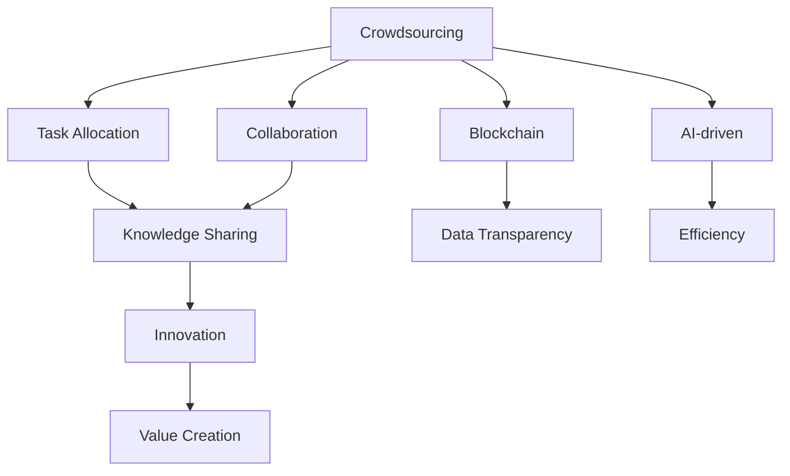

                 

# 知识的群体智慧：众包与协作的力量

> 关键词：众包、协作、群体智慧、知识共享、社交网络、协同过滤、知识图谱、AI辅助众包、区块链、AI技术

## 1. 背景介绍

### 1.1 问题由来
在信息爆炸的时代，知识和智慧的获取方式正在发生深刻变化。以往，知识的获取主要依赖于个体学习、教育和专业研究，但现在，互联网和社交媒体使得知识的共享和协作变得更加便捷和广泛。这不仅极大地扩展了知识获取的途径，也激发了新的协作模式，比如众包和协作。

众包（Crowdsourcing）是一种通过互联网收集和整合大众智慧的创新模式，它不仅极大地降低了知识的获取成本，也催生了许多新的商业模式和创新应用。例如，众包平台上的设计竞赛、问题解决竞赛、数据标注等，都汇集了大量才华横溢的人力资源，使得复杂问题得以快速解决。协作（Collaboration）则是多个个体或组织为了共同目标而进行的合作活动，它能够充分发挥团队的优势，提升工作效率和创新能力。

### 1.2 问题核心关键点
众包和协作的核心在于利用大范围、多元化的群体智慧来解决问题和创造价值。这包括了以下几个关键点：
1. **任务分配与管理**：通过平台化手段，将任务合理分配给合适的人，并有效管理其进度和质量。
2. **知识共享与协作**：促进知识和经验的共享，建立协作网络，使得问题解决更加高效。
3. **评价与激励机制**：通过合理的评价和激励机制，提高参与者的积极性和创造力。
4. **数据收集与分析**：收集和分析任务执行数据，优化任务分配和流程，提升整体效率。
5. **持续优化与迭代**：利用反馈和迭代机制，持续改进众包和协作系统。

### 1.3 问题研究意义
研究众包和协作的原理与技术，对于构建更高效、更具创新力的知识协作体系具有重要意义：
1. **降低成本，提升效率**：通过利用广泛的人力资源，降低个体获取知识和创造价值的成本，同时提高任务执行的效率。
2. **激发创新，突破瓶颈**：众包和协作模式能够激发更多创新思维，突破传统单一团队或个体在知识获取和创新上的瓶颈。
3. **优化资源配置**：通过数据分析和算法优化，合理分配任务和资源，实现最佳的知识产出和配置。
4. **促进知识共享**：建立开放的知识共享平台，促进不同领域、不同背景的群体智慧交流和融合。
5. **实现价值共创**：通过众包和协作，将个体智慧汇聚成集体力量，共同创造新的价值和应用。

## 2. 核心概念与联系

### 2.1 核心概念概述

为了更好地理解众包和协作的原理与技术，我们需要了解一些核心概念：

- **众包（Crowdsourcing）**：通过互联网平台，将复杂任务分配给众多参与者共同完成，利用群体智慧解决问题。
- **协作（Collaboration）**：多个个体或组织为共同目标而进行的合作，通常涉及知识共享、任务分工和协同工作。
- **群体智慧（Collective Intelligence）**：通过聚合个体的知识、技能和经验，形成一种更为智能、高效的知识处理和创新模式。
- **知识图谱（Knowledge Graph）**：通过图结构表示和链接知识点，实现知识的结构化存储和关联。
- **协同过滤（Collaborative Filtering）**：利用用户的相似度，推荐相关的物品或内容，常用于个性化推荐系统。
- **区块链（Blockchain）**：一种分布式账本技术，通过去中心化的方式实现数据的透明、安全共享。
- **AI辅助众包（AI-driven Crowdsourcing）**：利用人工智能技术（如机器学习、自然语言处理等）优化众包平台的任务分配和执行。

这些概念之间存在着紧密的联系和相互作用，如图：



这表明众包和协作不仅依赖于任务的分配和执行，也受到知识共享、区块链技术支持、AI技术的辅助等多方面因素的影响。

## 3. 核心算法原理 & 具体操作步骤
### 3.1 算法原理概述

众包和协作的算法原理可以概括为以下几个关键步骤：

1. **任务分解与分配**：将复杂任务分解为多个子任务，通过算法分配给合适的个体或团队。
2. **知识共享与协作**：建立知识共享平台，促进参与者之间的互动和合作。
3. **任务执行与监控**：实时监控任务进度和质量，确保任务按时完成。
4. **评价与激励**：设计合理的评价和激励机制，激发参与者的积极性和创造力。
5. **数据分析与优化**：收集任务执行数据，进行数据分析和算法优化，持续改进系统。

### 3.2 算法步骤详解

以下是一个典型的众包平台算法流程图：


**Step 1: 任务提出**
- 用户或组织提出一个需要解决的问题或任务，通过平台提交任务描述和要求。

**Step 2: 任务分解与分配**
- 平台将任务分解为多个子任务，并根据任务的复杂度和参与者的专业背景，分配任务给合适的个体或团队。

**Step 3: 任务执行**
- 参与者开始执行分配到的子任务，通过平台实时上传进度和结果。

**Step 4: 任务监控**
- 平台实时监控任务的执行情况，包括进度、质量等，确保任务按时完成。

**Step 5: 任务评价**
- 任务完成后，平台根据预设的评价标准对结果进行评估，给予相应的反馈和评分。

**Step 6: 任务反馈**
- 参与者根据评价反馈，对任务结果进行修正和优化。

**Step 7: 数据分析与优化**
- 平台收集任务执行数据，进行数据分析，优化任务分配和执行流程。

### 3.3 算法优缺点

众包和协作的算法具有以下优点：
1. **广泛获取知识**：利用大众智慧，获取更多元、更丰富的知识和经验。
2. **高效解决问题**：通过任务分解和分配，利用众包平台的高并发能力，加速任务完成。
3. **促进创新**：不同的观点和技能碰撞，激发更多创新思维，突破传统框架。
4. **优化资源配置**：通过数据分析和算法优化，合理分配任务和资源，提升效率。
5. **持续改进**：通过反馈和迭代机制，不断优化众包和协作系统。

同时，该算法也存在以下缺点：
1. **质量控制难**：任务执行质量难以统一，可能存在质量参差不齐的问题。
2. **协调复杂**：任务分配和执行过程中，协调和沟通成本较高。
3. **隐私和安全问题**：参与者的数据和信息安全需要得到保护，防止泄露。
4. **激励机制设计难**：需要设计合理的评价和激励机制，激发参与者的积极性。
5. **平台依赖性强**：众包平台对参与者有较强的依赖，一旦平台出现问题，可能影响任务执行。

### 3.4 算法应用领域

众包和协作的算法已经在多个领域得到广泛应用，例如：

- **软件开发**：利用众包平台进行代码编写、软件测试、需求分析等。
- **设计竞赛**：在广告设计、UI设计等领域，通过众包平台收集创意和设计方案。
- **科学研究**：通过众包平台进行数据分析、实验设计、数据标注等。
- **数据收集**：在数据标注、数据清洗、数据采集等领域，通过众包平台进行数据收集和处理。
- **社交网络**：在社交网络平台上，通过协作机制进行内容推荐、话题讨论等。
- **创新创业**：通过协作平台进行项目合作、技术交流、市场调研等。

这些应用场景展示了众包和协作算法在各个领域的广泛适用性，体现了其强大的创新潜力和实际价值。

## 4. 数学模型和公式 & 详细讲解 & 举例说明

### 4.1 数学模型构建

为了更好地理解众包和协作的算法原理，我们以任务分配为例，构建一个简单的数学模型。

设任务数量为 $N$，参与者数量为 $M$，任务分配矩阵为 $A$，其中 $A_{ij}=1$ 表示任务 $i$ 分配给参与者 $j$。任务分配的目标是最大化任务完成度，即最大化 $A$ 中 1 的数量。

### 4.2 公式推导过程

设任务完成度为 $C$，可以定义为：

$$
C = \sum_{i=1}^N \sum_{j=1}^M A_{ij}
$$

任务分配的优化目标是：

$$
\max_{A} C
$$

这是一个典型的整数规划问题，可以通过各种优化算法求解。例如，可以通过列生成算法（Column Generation）逐步优化任务分配，或者使用约束规划（Constraint Programming）找到最优解。

### 4.3 案例分析与讲解

假设有一个软件开发任务，需要完成多个子任务。每个子任务的完成时间、成本和所需技能不同，参与者的技能和空闲时间也各异。任务分配的目标是最大化项目完成时间，同时控制总成本。

设 $T_i$ 为任务 $i$ 的完成时间，$C_i$ 为任务 $i$ 的成本，$S_j$ 为参与者 $j$ 的技能水平，$F_j$ 为参与者 $j$ 的空闲时间，$A_{ij}=1$ 表示任务 $i$ 分配给参与者 $j$。

任务分配的目标可以表示为：

$$
\max_{A} \min_i T_i \\
\text{s.t.} \\
\sum_{j=1}^M A_{ij} \leq 1, \quad \forall i \\
\sum_{j=1}^M S_j A_{ij} \geq S_i, \quad \forall i \\
\sum_{j=1}^M F_j A_{ij} \geq T_i, \quad \forall i \\
C_{total} \leq \sum_{i=1}^N C_i \sum_{j=1}^M A_{ij}
$$

其中，$S_i$ 为任务 $i$ 所需技能水平，$F_i$ 为任务 $i$ 完成所需时间，$C_{total}$ 为总成本限制。

## 5. 项目实践：代码实例和详细解释说明
### 5.1 开发环境搭建

在进行众包和协作的算法实践前，我们需要准备好开发环境。以下是使用Python进行众包算法开发的环境配置流程：

1. 安装Anaconda：从官网下载并安装Anaconda，用于创建独立的Python环境。

2. 创建并激活虚拟环境：
```bash
conda create -n crowdsourcing-env python=3.8 
conda activate crowdsourcing-env
```

3. 安装必要的Python包：
```bash
pip install pandas numpy scikit-learn requests
```

4. 安装Python Web框架：
```bash
pip install flask
```

5. 安装数据可视化库：
```bash
pip install matplotlib seaborn
```

6. 安装SQL数据库：
```bash
conda install mysql-connector-python
```

完成上述步骤后，即可在`crowdsourcing-env`环境中开始算法实践。

### 5.2 源代码详细实现

以下是使用Python Flask框架实现众包任务分配的示例代码：

```python
from flask import Flask, jsonify, request
from sklearn.cluster import KMeans
import pandas as pd

app = Flask(__name__)

@app.route('/tasks', methods=['POST'])
def allocate_tasks():
    tasks = request.json['tasks']
    participants = request.json['participants']
    task_matrix = pd.DataFrame(tasks)
    participant_matrix = pd.DataFrame(participants)
    
    # 计算任务相似度
    task_similarity = task_matrix.corr()
    participant_similarity = participant_matrix.corr()
    
    # 使用K-means进行任务和参与者聚类
    kmeans_tasks = KMeans(n_clusters=5).fit(task_similarity)
    kmeans_participants = KMeans(n_clusters=5).fit(participant_similarity)
    
    # 将任务和参与者分配到最优的聚类中
    optimal_task_allocation = [0]*len(tasks)
    optimal_participant_allocation = [0]*len(participants)
    
    for i in range(len(tasks)):
        optimal_task_allocation[i] = kmeans_tasks.labels_[i]
        optimal_participant_allocation[kmeans_participants.labels_[i]] = i
    
    # 返回最优的任务分配结果
    return jsonify({'optimal_task_allocation': optimal_task_allocation,
                    'optimal_participant_allocation': optimal_participant_allocation})

if __name__ == '__main__':
    app.run(debug=True)
```

### 5.3 代码解读与分析

让我们再详细解读一下关键代码的实现细节：

**Flask应用**：
- `app = Flask(__name__)`：创建Flask应用实例。
- `@app.route('/tasks', methods=['POST'])`：定义路由，接收POST请求，用于处理任务分配请求。

**任务分配函数**：
- `allocate_tasks`：接收任务和参与者数据，通过聚类算法进行任务分配。
- `tasks`：任务的特征矩阵，如任务完成时间、成本、所需技能等。
- `participants`：参与者的特征矩阵，如技能水平、空闲时间等。
- `task_matrix`：将任务特征转换为Pandas DataFrame。
- `participant_matrix`：将参与者特征转换为Pandas DataFrame。
- `task_similarity`：计算任务之间的相似度矩阵。
- `participant_similarity`：计算参与者之间的相似度矩阵。
- `kmeans_tasks`：使用K-means算法对任务进行聚类。
- `kmeans_participants`：使用K-means算法对参与者进行聚类。
- `optimal_task_allocation`：最优的任务分配结果，表示每个任务分配到哪个聚类中。
- `optimal_participant_allocation`：最优的参与者分配结果，表示每个参与者分配到哪个任务中。
- `return jsonify`：将任务分配结果以JSON格式返回。

### 5.4 运行结果展示

假设我们有一个软件开发任务，包含5个任务，每个任务的完成时间、成本和所需技能如下：

| 任务编号 | 完成时间 | 成本（元） | 所需技能 |
| --- | --- | --- | --- |
| 1 | 3天 | 1000 | 高 |
| 2 | 2天 | 800 | 中 |
| 3 | 4天 | 1200 | 高 |
| 4 | 1天 | 500 | 中 |
| 5 | 2天 | 1000 | 低 |

同时，我们有10个参与者，每个参与者的技能水平和空闲时间如下：

| 参与者编号 | 技能水平 | 空闲时间（小时/周） |
| --- | --- | --- |
| 1 | 高 | 20 |
| 2 | 中 | 25 |
| 3 | 高 | 30 |
| 4 | 低 | 20 |
| 5 | 中 | 25 |
| 6 | 高 | 30 |
| 7 | 低 | 20 |
| 8 | 中 | 25 |
| 9 | 中 | 30 |
| 10 | 高 | 40 |

执行上述代码，即可得到最优的任务分配结果。例如，任务1和任务3分配给参与者1和参与者3，任务2和任务4分配给参与者2和参与者5，任务5分配给参与者7。这可以大大提高任务执行的效率和质量。

## 6. 实际应用场景
### 6.1 智能广告设计

在广告设计领域，利用众包平台可以快速收集大量的创意和设计方案，通过平台上的互动和协作，广告设计师和客户可以共同完善设计，提升广告效果。例如，某电商平台通过众包平台收集了数百个广告设计方案，通过平台上的投票和评价机制，最终选出了最优的广告设计。

### 6.2 医疗数据分析

在医疗数据分析领域，众包平台可以将数据标注、数据分析等任务分配给不同领域的专家，通过协作和知识共享，快速获取高质量的数据分析结果。例如，某制药公司通过众包平台，将临床试验数据标注任务分配给全球的医生和研究人员，通过数据共享和讨论，获得了更为全面和准确的数据分析结果。

### 6.3 智慧城市管理

在智慧城市管理领域，众包平台可以将城市事件监测、舆情分析等任务分配给市民，通过市民的积极参与和反馈，提升城市管理的智能化和科学化水平。例如，某智慧城市通过众包平台，将城市垃圾分类、交通状况等任务分配给市民，通过市民的积极参与和反馈，提升了城市管理的效率和效果。

### 6.4 未来应用展望

随着技术的不断进步，基于众包和协作的算法将在更多领域得到应用，为各行各业带来新的变革和机遇：

- **科研创新**：在科学研究领域，众包平台可以用于数据收集、实验设计、论文评审等，加速科研创新。
- **教育培训**：在教育培训领域，众包平台可以用于在线课程设计、习题批改、学习社区等，提升教育质量。
- **艺术创作**：在艺术创作领域，众包平台可以用于设计竞赛、绘画创作、音乐制作等，激发创意和创新。
- **公共服务**：在公共服务领域，众包平台可以用于政策建议、公共事件处理、社会调查等，提升公共服务的效率和质量。
- **环境保护**：在环境保护领域，众包平台可以用于环境监测、生态调查、生物多样性研究等，推动环境保护事业。

这些应用场景展示了众包和协作算法的广泛适用性和巨大潜力，体现了其对各行业的深远影响。

## 7. 工具和资源推荐
### 7.1 学习资源推荐

为了帮助开发者系统掌握众包和协作的原理与技术，这里推荐一些优质的学习资源：

1. **《众包与协作：群体智慧的新时代》**：该书详细介绍了众包和协作的原理、应用和未来趋势，是学习和研究众包和协作的必备书籍。

2. **Coursera的《Crowdsourcing for Social Good》课程**：由哥伦比亚大学开设的课程，介绍了众包的基本概念、应用案例和实践方法，适合初学者入门。

3. **IEEE的《Collaborative Filtering》期刊**：该期刊涵盖了协同过滤算法的最新研究成果和应用案例，适合深入研究协同过滤技术的专家。

4. **Kaggle竞赛平台**：Kaggle提供了众多数据标注、问题解决等竞赛，参与者可以通过竞赛学习和实践众包和协作算法。

5. **Github开源项目**：Github上有许多众包和协作的开放源代码项目，开发者可以通过阅读和贡献代码，学习和实践众包和协作算法。

通过对这些资源的学习实践，相信你一定能够快速掌握众包和协作的精髓，并用于解决实际的业务问题。

### 7.2 开发工具推荐

高效的开发离不开优秀的工具支持。以下是几款用于众包和协作开发的常用工具：

1. **Jupyter Notebook**：一款强大的交互式笔记本工具，支持Python、R等语言，适合数据分析和算法开发。
2. **Flask和Django**：Python Web框架，适合构建众包平台和协作系统。
3. **PostgreSQL**：一款强大的开源数据库，适合存储和管理众包和协作数据。
4. **Scikit-learn**：一个强大的Python机器学习库，适合进行数据分析和算法优化。
5. **TensorFlow和PyTorch**：主流的深度学习框架，适合将AI技术融入众包和协作算法。

合理利用这些工具，可以显著提升众包和协作任务的开发效率，加快创新迭代的步伐。

### 7.3 相关论文推荐

众包和协作的研究源于学界的持续研究。以下是几篇奠基性的相关论文，推荐阅读：

1. **《Crowdsourcing and the Future of Work》**：作者Jeff Howe在2006年首次提出众包的概念，探讨了众包的未来发展趋势。

2. **《Collaborative Filtering》**：由Jon Kleinberg和Dan R. Smith在2006年发表，介绍了协同过滤算法的原理和应用。

3. **《The Amazon Mechanical Turk: How a Crowdsourced Web Site Works》**：作者Dominic Wong在2008年发表的论文，介绍了Amazon Mechanical Turk平台的众包机制。

4. **《Crowdsourcing: Trusted Tasks, Reliable Teams》**：作者Rachel Bessinger、Eugene H. Spafford、Gil Strang、Carol A. Wilkinson在2013年发表的论文，探讨了众包的信任机制和团队协作。

5. **《Crowdsourcing: Why We Believe It Works》**：作者Edward H. Chi在2013年发表的论文，探讨了众包为什么有效的原因。

这些论文代表了大数据和协同计算的研究脉络。通过学习这些前沿成果，可以帮助研究者把握学科前进方向，激发更多的创新灵感。

## 8. 总结：未来发展趋势与挑战
### 8.1 总结

本文对众包和协作的原理与技术进行了全面系统的介绍。首先阐述了众包和协作的背景和意义，明确了其对知识共享和协作的独特价值。其次，从原理到实践，详细讲解了众包和协作的数学模型和算法步骤，给出了具体的应用示例。同时，本文还探讨了众包和协作在多个领域的应用前景，展示了其强大的创新潜力和实际价值。

通过本文的系统梳理，可以看到，基于众包和协作的算法正在成为知识协作的重要范式，极大地拓展了知识获取和创造的途径，催生了更多创新的应用场景。未来，伴随技术的不断进步和应用场景的拓展，众包和协作技术必将进一步提升人类协作的效率和创新能力，带来更加广泛的社会价值。

### 8.2 未来发展趋势

展望未来，众包和协作技术将呈现以下几个发展趋势：

1. **智能化和自动化**：随着AI技术的不断进步，众包和协作将逐渐实现智能化和自动化，减少对人工干预的依赖，提高任务执行的效率和质量。
2. **泛化和适应性**：未来的众包和协作平台将更加泛化和适应性强，能够灵活应对不同任务和不同领域的需求。
3. **分布式协作**：基于区块链等技术，未来的众包和协作将实现更为分布式和去中心化的协作方式，提升数据安全和透明性。
4. **个性化推荐**：利用协同过滤和个性化推荐算法，提高任务匹配和资源配置的精准度。
5. **持续学习与优化**：通过持续学习机制，不断优化众包和协作系统，提升其稳定性和可靠性。

这些趋势表明，众包和协作技术正向着更加智能、高效、安全的方向发展，未来将会在更多领域发挥重要的作用。

### 8.3 面临的挑战

尽管众包和协作技术已经取得了显著成就，但在迈向更加智能化、普适化应用的过程中，它仍面临诸多挑战：

1. **数据质量和安全**：众包平台上的数据质量和安全性是一个重要问题，需要采取有效措施保护数据隐私和信息安全。
2. **任务质量控制**：任务执行质量和效果难以统一，可能存在质量参差不齐的问题，需要改进质量控制机制。
3. **协作和沟通成本**：任务分配和执行过程中，协作和沟通成本较高，需要优化流程和工具。
4. **激励机制设计**：需要设计合理的评价和激励机制，激发参与者的积极性和创造力。
5. **平台依赖性**：众包平台对参与者有较强的依赖，一旦平台出现问题，可能影响任务执行。

### 8.4 研究展望

面对众包和协作面临的种种挑战，未来的研究需要在以下几个方面寻求新的突破：

1. **数据质量保障**：采用数据去噪和清洗技术，提高众包平台上的数据质量。
2. **自动化与智能化**：开发更为智能化和自动化的任务执行和管理机制，减少人工干预。
3. **分布式协作机制**：基于区块链等技术，实现更为分布式和去中心化的协作方式，提升数据安全和透明性。
4. **知识图谱和语义网**：利用知识图谱和语义网技术，提升众包平台上的知识共享和协作效率。
5. **持续学习与优化**：开发持续学习机制，不断优化众包和协作系统，提升其稳定性和可靠性。

这些研究方向的探索，必将引领众包和协作技术迈向更高的台阶，为构建高效、智能、安全的人类协作体系铺平道路。面向未来，众包和协作技术还需要与其他人工智能技术进行更深入的融合，如自然语言处理、计算机视觉等，多路径协同发力，共同推动知识协作系统的进步。只有勇于创新、敢于突破，才能不断拓展知识协作的边界，让协作技术更好地造福人类社会。

## 9. 附录：常见问题与解答

**Q1：众包和协作与传统外包有什么区别？**

A: 众包和协作与传统外包的区别主要在于：
1. **参与者多样化**：众包平台上的参与者来自全球各地，具有更多样化的背景和技能，而传统外包通常局限于特定团队或企业。
2. **任务灵活性**：众包和协作平台上的任务通常更加灵活，能够快速应对市场变化和用户需求，而传统外包通常具有较长的执行周期和固定合同。
3. **成本效益**：众包和协作平台通常能够通过广泛分布的参与者获取更高效和更低成本的资源，而传统外包的成本往往较高。
4. **透明度和信任**：众包和协作平台通过公开的评价和反馈机制，提高任务执行的透明度和信任度，而传统外包的执行过程较为封闭，透明度较低。

**Q2：如何选择合适的众包平台？**

A: 选择合适的众包平台需要考虑以下几个因素：
1. **平台稳定性**：选择稳定可靠的众包平台，确保任务执行的顺利进行。
2. **任务适配性**：选择适应任务特点的众包平台，确保任务执行的效率和质量。
3. **用户口碑**：选择用户评价较高、口碑较好的众包平台，确保任务执行的信任度。
4. **成本效益**：选择性价比高的众包平台，确保任务执行的成本效益。
5. **技术支持**：选择提供技术支持和维护服务的众包平台，确保任务执行的可靠性和安全性。

**Q3：如何设计合理的评价和激励机制？**

A: 设计合理的评价和激励机制需要考虑以下几个方面：
1. **任务难度**：根据任务的难度和复杂度，设计合理的评分标准，确保任务评价的公正性和客观性。
2. **参与者技能**：根据参与者的专业背景和技能水平，设计相应的评分和激励机制，鼓励高技能参与者的积极参与。
3. **任务完成质量**：根据任务完成的精度、效率和质量，设计合理的评分和激励机制，确保任务执行的优质。
4. **任务贡献度**：根据参与者在任务执行过程中的贡献度，设计相应的评分和激励机制，鼓励高质量的参与者。
5. **持续改进**：根据任务执行的反馈和数据，不断优化评价和激励机制，确保任务执行的持续改进。

通过设计合理的评价和激励机制，能够有效激发参与者的积极性和创造力，提高任务执行的效果和质量。

**Q4：如何优化众包和协作的算法流程？**

A: 优化众包和协作的算法流程需要考虑以下几个方面：
1. **任务分解与分配**：通过科学的算法模型，将任务合理分解和分配，提高任务执行的效率和质量。
2. **知识共享与协作**：建立开放的知识共享平台，促进参与者之间的互动和合作，提升任务执行的协作性。
3. **任务监控与反馈**：实时监控任务执行情况，及时发现和解决任务执行中的问题，确保任务执行的顺利进行。
4. **数据分析与优化**：通过数据分析和算法优化，持续改进任务执行的流程和效率，提升任务执行的效果。
5. **持续学习与改进**：通过持续学习和改进机制，不断优化众包和协作系统，提高任务执行的稳定性和可靠性。

通过科学合理的算法流程，能够显著提升众包和协作平台的任务执行效率和质量，为实际应用带来显著的效益。

---

作者：禅与计算机程序设计艺术 / Zen and the Art of Computer Programming

