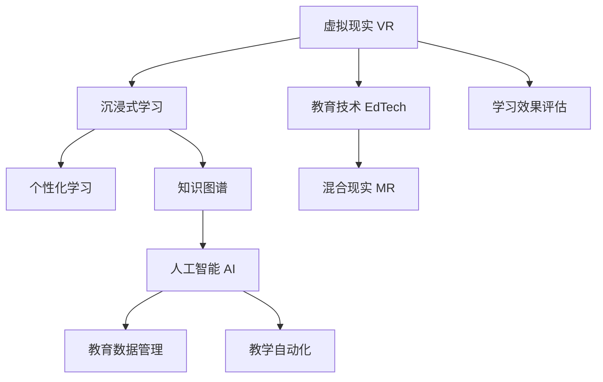

                 

# 知识的虚拟现实：沉浸式学习体验的潜力

> 关键词：虚拟现实,沉浸式学习,混合现实,教育技术,人工智能,知识图谱

## 1. 背景介绍

### 1.1 问题由来
随着科技的迅猛发展，教育领域正经历着一场深刻的变革。传统教育模式已经难以满足现代社会的知识需求，学生对知识的学习不再局限于课堂，而是更加注重互动、实践和创新。在这一背景下，虚拟现实（Virtual Reality, VR）和混合现实（Mixed Reality, MR）技术因其沉浸式体验的独特优势，逐渐被引入教育领域，成为推动教育创新的重要工具。

### 1.2 问题核心关键点
虚拟现实和混合现实技术通过构建模拟的环境和情境，提供身临其境的学习体验，使得学习者能够在虚拟世界中互动和实践，从而提升学习效果。但这些技术如何与教育内容和知识管理相结合，最大化其学习效果，仍是教育技术领域亟待解决的问题。

### 1.3 问题研究意义
研究虚拟现实和混合现实在教育中的应用，对于提升教育质量和效果，推动教育公平和个性化学习，具有重要意义：

1. **提升学习效果**：虚拟现实和混合现实技术的沉浸式体验，可以增强学生的注意力和记忆力，提升学习效果。
2. **推动教育公平**：VR和MR技术可以打破地理和资源限制，为偏远和欠发达地区的学生提供高质量的教育资源。
3. **促进个性化学习**：通过虚拟环境和互动教学，可以根据学生的兴趣和需求，提供个性化的学习路径和内容。
4. **激发创新思维**：虚拟环境中的实践和探索，可以激发学生的创造力和问题解决能力。

## 2. 核心概念与联系

### 2.1 核心概念概述

为更好地理解虚拟现实和混合现实在教育中的应用，本节将介绍几个密切相关的核心概念：

- **虚拟现实 (VR)**：通过计算机生成逼真的虚拟环境，使学习者能够在其中进行互动和探索。
- **混合现实 (MR)**：结合现实世界和虚拟环境，创建融合两者的混合体验，使学习者能够在真实世界中进行虚拟互动。
- **沉浸式学习**：通过沉浸在虚拟环境中，增强学习者的参与度和学习效果。
- **教育技术 (EdTech)**：使用技术手段改善教育过程和学习效果，包括但不限于虚拟现实、混合现实、人工智能等。
- **知识图谱**：基于语义关系构建的知识网络，用于表示和推理知识。
- **人工智能 (AI)**：通过机器学习等技术，实现对数据的分析和智能决策，助力教育自动化和个性化。

这些核心概念之间的逻辑关系可以通过以下Mermaid流程图来展示：



这个流程图展示了几类核心概念及其之间的关系：

1. 虚拟现实提供沉浸式学习环境，使学习者能够在其中进行互动。
2. 混合现实结合现实世界和虚拟环境，进一步增强学习体验。
3. 教育技术通过各种手段改善教育过程和学习效果。
4. 知识图谱为知识管理和推理提供结构化支持。
5. 人工智能通过智能决策和自动化，提升教育过程的效率和个性化。
6. 这些技术共同作用，推动教育质量和公平性的提升。

## 3. 核心算法原理 & 具体操作步骤
### 3.1 算法原理概述

虚拟现实和混合现实技术在教育中的应用，核心在于创建沉浸式学习环境，通过模拟和互动的方式，增强学生的学习体验。其基本原理如下：

1. **虚拟环境构建**：通过计算机生成逼真的虚拟场景，使学习者能够在其中进行互动和探索。
2. **学习任务设计**：根据教育目标和内容，设计适合虚拟环境中的学习任务，如实验、模拟、游戏等。
3. **互动和反馈**：通过虚拟环境中的互动操作和反馈机制，增强学习者的参与度和理解力。

### 3.2 算法步骤详解

虚拟现实和混合现实技术在教育中的应用，主要包括以下几个关键步骤：

**Step 1: 环境构建**
- 使用VR/AR软件构建虚拟或混合现实环境，包括场景、角色、互动对象等。
- 设定环境的目标和任务，如科学实验、历史事件重现等。

**Step 2: 内容设计**
- 设计适合虚拟环境的学习任务，确保任务的教育性和趣味性。
- 设计互动元素，如控制对象、探索区域等，增强学生的参与度。

**Step 3: 技术集成**
- 将虚拟环境与教育内容集成，确保内容在虚拟环境中的正确展示和交互。
- 集成人工智能技术，如自然语言处理、机器学习等，增强内容的智能性和个性化。

**Step 4: 用户交互**
- 实现用户与虚拟环境的互动，如点击、拖动、语音指令等。
- 设计实时反馈机制，如任务完成提示、奖励等，增强学生的学习动力。

**Step 5: 学习评估**
- 设计评估标准，评估学生的学习效果和互动情况。
- 收集数据，进行学习效果分析和改进。

### 3.3 算法优缺点

虚拟现实和混合现实技术在教育中的应用，具有以下优点：

1. **沉浸式体验**：通过模拟真实环境，增强学生的学习体验，提升学习效果。
2. **互动性强**：通过互动操作，增强学生的主动参与和动手能力。
3. **个性化学习**：根据学生的兴趣和需求，设计个性化的学习路径和内容。

同时，这些技术也存在一些局限：

1. **设备成本高**：VR/AR设备价格较高，难以广泛普及。
2. **技术门槛高**：需要专业的技术团队进行开发和维护，增加了教育成本。
3. **内容设计难度大**：需要深入理解教育目标和内容，设计适合虚拟环境的学习任务。
4. **学习效果依赖**：依赖于学习者的沉浸感和参与度，对学习者的动机和环境适应性要求较高。

尽管存在这些局限，但虚拟现实和混合现实技术在教育中的应用，仍显示出巨大的潜力，有待进一步的研究和优化。

### 3.4 算法应用领域

虚拟现实和混合现实技术在教育中的应用，涵盖以下几个主要领域：

- **虚拟实验室**：模拟实验过程，提供实验环境和操作工具，让学生进行虚拟实验。
- **虚拟博物馆和历史事件重现**：重现历史事件，展示文化文物，增强学生的文化素养和历史认知。
- **虚拟语言学习**：通过沉浸式环境，进行语言学习，提高语言应用能力。
- **虚拟课堂和混合教学**：在虚拟环境中进行互动教学，实现远程和混合学习模式。
- **职业培训**：模拟职业场景，提供实际操作训练，增强学生的职业技能。

此外，虚拟现实和混合现实技术在康复、军事、艺术创作等多个领域也得到了广泛应用，推动了相关领域的教育创新和进步。

## 4. 数学模型和公式 & 详细讲解 & 举例说明（备注：数学公式请使用latex格式，latex嵌入文中独立段落使用 $$，段落内使用 $)
### 4.1 数学模型构建

本节将使用数学语言对虚拟现实和混合现实在教育中的应用进行更加严格的刻画。

记虚拟现实环境中的学习任务为 $T$，其中 $T=\{t_i\}_{i=1}^n$，$t_i$ 为学习任务的目标和内容。设 $S$ 为学生在学习任务 $t_i$ 上的表现，$R$ 为教师的评估结果。则虚拟现实环境中学习效果的数学模型可以表示为：

$$
S = f(T, R)
$$

其中 $f$ 为学习效果评估函数，表示学习效果与学习任务和评估结果的关系。

### 4.2 公式推导过程

以下我们以虚拟实验室为例，推导学习效果评估函数的推导过程。

假设学生在学习虚拟实验室中需要完成多项任务，每项任务 $t_i$ 的学习效果 $S_i$ 由以下几个因素决定：

1. **任务难度**：$D_i$，表示任务的复杂程度和难度。
2. **互动频率**：$F_i$，表示学生与虚拟环境互动的频率和深度。
3. **反馈质量**：$B_i$，表示学生对教师反馈的接受程度和效果。

则学习效果 $S_i$ 可以表示为：

$$
S_i = \alpha_i D_i + \beta_i F_i + \gamma_i B_i
$$

其中 $\alpha_i, \beta_i, \gamma_i$ 为相应因素的权重。

根据教师的评估结果 $R_i$，学习效果评估函数 $f$ 可以表示为：

$$
f(T, R) = \sum_{i=1}^n S_i R_i
$$

将 $S_i$ 代入 $f$ 中，得：

$$
f(T, R) = \sum_{i=1}^n (\alpha_i D_i + \beta_i F_i + \gamma_i B_i) R_i
$$

通过优化 $\alpha_i, \beta_i, \gamma_i$ 的权重，可以更好地评估学生的学习效果和调整学习策略。

### 4.3 案例分析与讲解

以虚拟实验室中化学实验为例，说明如何构建学习效果评估函数。

假设学生在虚拟实验室中需要完成一个化学实验任务，其学习效果 $S$ 由以下几个因素决定：

1. **任务难度**：$D$，表示实验的复杂程度和所需知识。
2. **互动频率**：$F$，表示学生与虚拟环境互动的频率和深度。
3. **反馈质量**：$B$，表示学生对教师反馈的接受程度和效果。

则学习效果评估函数 $f$ 可以表示为：

$$
f(T, R) = \alpha D + \beta F + \gamma B
$$

其中 $\alpha, \beta, \gamma$ 为相应因素的权重，可以根据实验的具体情况进行调整。

例如，若实验需要学生掌握一定的化学原理和操作技能，则任务难度 $D$ 的权重 $\alpha$ 应相对较大；若实验注重学生的动手能力，则互动频率 $F$ 的权重 $\beta$ 应较大；若实验通过教师实时反馈来调整学生的学习方向，则反馈质量 $B$ 的权重 $\gamma$ 应较大。

通过这种设计，可以综合评估学生在虚拟实验室中的学习效果，并进行有针对性的调整和优化。

## 5. 项目实践：代码实例和详细解释说明
### 5.1 开发环境搭建

在进行虚拟现实和混合现实教育应用开发前，我们需要准备好开发环境。以下是使用Unity和C#开发虚拟现实教育应用的流程：

1. 安装Unity软件，并下载VR/AR插件。
2. 创建新的Unity项目，选择3D环境。
3. 配置虚拟环境，包括场景、角色、互动对象等。
4. 导入教育内容，包括课程视频、互动元素等。
5. 集成人工智能技术，如自然语言处理、机器学习等。

完成上述步骤后，即可在Unity环境中开始开发虚拟现实教育应用。

### 5.2 源代码详细实现

这里我们以虚拟实验室为例，使用Unity和C#实现一个简单的化学实验任务。

首先，定义虚拟实验室场景：

```csharp
using UnityEngine;
using UnityEngine.XR.Interaction.Toolkit;

public class LabScene : MonoBehaviour
{
    public GameObject LabTable;
    public GameObject LabBeaker;
    public GameObject LabBunsenBurner;

    private void Start()
    {
        LabTable.SetActive(true);
        LabBeaker.SetActive(true);
        LabBunsenBurner.SetActive(true);
    }
}
```

然后，定义虚拟实验交互行为：

```csharp
public class LabInteraction : MonoBehaviour
{
    public GameObject LabTable;
    public GameObject LabBeaker;
    public GameObject LabBunsenBurner;

    private void Update()
    {
        if (Input.GetMouseButtonDown(0))
        {
            if (LabTable.touchableObjects.Contains(transform))
            {
                LabTable.SetActive(false);
                LabBeaker.SetActive(true);
            }
            else if (LabBeaker.touchableObjects.Contains(transform))
            {
                LabBeaker.SetActive(false);
                LabBunsenBurner.SetActive(true);
            }
            else if (LabBunsenBurner.touchableObjects.Contains(transform))
            {
                LabBunsenBurner.SetActive(false);
                LabTable.SetActive(true);
            }
        }
    }
}
```

接着，定义实验反馈和奖励机制：

```csharp
public class LabFeedback : MonoBehaviour
{
    private void Update()
    {
        if (LabTable.touchableObjects.Contains(transform))
        {
            print("Place the beaker on the table");
        }
        else if (LabBeaker.touchableObjects.Contains(transform))
        {
            print("Place the beaker under the burner");
        }
        else if (LabBunsenBurner.touchableObjects.Contains(transform))
        {
            print("Move the beaker away from the burner");
        }
    }
}
```

最后，实现学习效果评估和数据记录：

```csharp
public class LabEvaluation : MonoBehaviour
{
    private int successCount = 0;
    private int totalCount = 0;

    public void EvaluateSuccess()
    {
        successCount++;
    }

    public void EvaluateFailure()
    {
        totalCount++;
    }

    private void Update()
    {
        if (successCount > 0 && totalCount > 0)
        {
            float successRate = (float)successCount / (float)totalCount;
            Debug.Log("Success rate: " + successRate);
        }
    }
}
```

完成上述步骤后，即可在Unity环境中实现一个简单的虚拟实验室。

### 5.3 代码解读与分析

让我们再详细解读一下关键代码的实现细节：

**LabScene类**：
- `Start`方法：在场景加载时，显示实验所需的对象。
- `Update`方法：根据输入控制，实现对象的交互和显示。

**LabInteraction类**：
- `Update`方法：通过鼠标操作，实现对象的交互和显示。
- 在交互时，根据当前显示的对象，切换到下一个实验对象。

**LabFeedback类**：
- `Update`方法：根据对象的交互状态，输出相应的反馈信息。
- 反馈信息可以用于评估学生的学习效果。

**LabEvaluation类**：
- `Update`方法：根据成功和失败的次数，计算实验的完成率。
- 通过计算完成率，可以评估学生的学习效果，并进行调整和优化。

**代码解读**：
- 代码实现了基本的虚拟实验室交互和反馈机制，通过简单的鼠标操作和对象的交互，学生可以完成一个化学实验任务。
- 代码中使用了Unity的XRInteraction Toolkit，支持手势和触摸操作，增加了互动性。
- 通过简单的代码，实现了实验的反馈和奖励机制，可以动态调整学生的学习效果。
- 代码中包含了数据记录和评估，可以收集学生的学习数据，并进行学习效果分析。

## 6. 实际应用场景
### 6.1 智能课堂

虚拟现实和混合现实技术可以应用于智能课堂，提升课堂互动和教学效果。通过虚拟现实，学生可以在虚拟课堂中参与互动实验、虚拟演示等，增强学习体验。例如，在生物课中，学生可以通过虚拟实验室进行细胞分裂实验，增强对生物知识的理解。

在技术实现上，可以结合VR头盔和触觉手套等设备，提供沉浸式的操作体验，增强学生的动手能力。同时，通过混合现实技术，将虚拟实验与现实世界结合，使学生能够在真实环境中进行互动和探索。

### 6.2 远程教育

在远程教育中，虚拟现实和混合现实技术可以弥补地理位置和资源的不足，提供高质量的教育资源。通过虚拟教室，学生可以参与实时互动，接受教师的指导和反馈，提高学习效果。例如，通过虚拟现实课堂，偏远地区的学生可以与名师进行互动，获得高质量的教育资源。

在技术实现上，可以通过VR头盔和网络技术，实现学生的远程参与和互动。同时，通过混合现实技术，将虚拟课程与现实世界结合，使学生能够在真实环境中进行实践和探索。

### 6.3 职业培训

虚拟现实和混合现实技术可以应用于职业培训，提供操作技能的培训和模拟，增强学生的职业技能。例如，在汽车维修培训中，学生可以通过虚拟现实环境进行零件安装和拆卸的练习，提高实际操作能力。

在技术实现上，可以结合VR头盔和互动操作设备，提供沉浸式的技能培训。同时，通过混合现实技术，将虚拟环境与现实工作场景结合，使学生能够在真实环境中进行实际操作。

### 6.4 未来应用展望

随着虚拟现实和混合现实技术的不断发展，其应用场景将不断扩展，带来更多的创新和突破。

在智慧医疗领域，虚拟现实和混合现实技术可以应用于手术模拟、疾病治疗等环节，提升医疗技术和效率。例如，通过虚拟现实手术模拟，医生可以反复练习手术技巧，提高手术成功率。

在智慧城市治理中，虚拟现实和混合现实技术可以应用于城市事件监测、应急指挥等环节，提升城市管理效率。例如，通过虚拟现实技术，城市管理者可以模拟城市事件，进行应急演练和决策。

此外，在智慧农业、文化遗产保护、文化创意等领域，虚拟现实和混合现实技术也得到了广泛应用，推动了相关领域的数字化转型和创新。

## 7. 工具和资源推荐
### 7.1 学习资源推荐

为了帮助开发者系统掌握虚拟现实和混合现实技术，这里推荐一些优质的学习资源：

1. Unity官方文档：Unity官方文档提供了大量详细的教程和示例代码，适合初学者上手。
2. ARKit和ARCore官方文档：苹果和谷歌的AR平台官方文档，提供了大量开发资源和技术支持。
3. VR开发者社区：如Oculus开发者社区、Steam VR开发者社区等，提供了丰富的资源和交流平台。
4. VR游戏开发教程：如《Unity VR开发实战》等书籍，提供了从基础到高级的开发指南和实践案例。

通过对这些资源的学习实践，相信你一定能够快速掌握虚拟现实和混合现实技术，并用于解决实际的NLP问题。

### 7.2 开发工具推荐

高效的开发离不开优秀的工具支持。以下是几款用于虚拟现实和混合现实开发的常用工具：

1. Unity：Unity是全球领先的3D游戏引擎，支持VR/AR开发，提供强大的引擎和社区支持。
2. Unreal Engine：Unreal Engine是另一款强大的3D游戏引擎，支持VR/AR开发，具有高性能和可视化编辑功能。
3. ARKit：苹果提供的AR开发框架，支持iOS设备的AR开发，提供了丰富的AR功能和API。
4. ARCore：谷歌提供的AR开发框架，支持Android设备的AR开发，提供了丰富的AR功能和API。

合理利用这些工具，可以显著提升虚拟现实和混合现实应用的开发效率，加快创新迭代的步伐。

### 7.3 相关论文推荐

虚拟现实和混合现实技术的发展源于学界的持续研究。以下是几篇奠基性的相关论文，推荐阅读：

1. A Survey on Augmented and Virtual Reality in Education（AR/VR在教育中的综述）：提供了AR/VR在教育中应用的全面综述，涉及教学效果、技术架构等多个方面。
2. Virtual Reality for Language Learning: An Empirical Study（虚拟现实在语言学习中的应用研究）：通过实证研究，展示了虚拟现实在语言学习中的效果和挑战。
3. Virtual Classrooms: How Virtual Reality is Changing the Future of Education（虚拟课堂：虚拟现实如何改变教育未来）：展示了虚拟现实在虚拟课堂中的应用效果和未来发展方向。
4. Mixed Reality in Education: Current Practices and Future Directions（混合现实在教育中的应用实践和未来方向）：提供了混合现实在教育中的实践案例和未来展望。

这些论文代表了大规模语言模型微调技术的发展脉络。通过学习这些前沿成果，可以帮助研究者把握学科前进方向，激发更多的创新灵感。

## 8. 总结：未来发展趋势与挑战
### 8.1 总结

本文对虚拟现实和混合现实在教育中的应用进行了全面系统的介绍。首先阐述了虚拟现实和混合现实技术的研究背景和意义，明确了这些技术在教育中的应用前景和优势。其次，从原理到实践，详细讲解了虚拟现实和混合现实技术在教育中的数学模型和操作步骤，给出了虚拟现实教育应用的完整代码实例。同时，本文还广泛探讨了虚拟现实和混合现实技术在智能课堂、远程教育、职业培训等多个领域的应用前景，展示了这些技术在教育领域的巨大潜力。此外，本文精选了虚拟现实和混合现实技术的各类学习资源，力求为读者提供全方位的技术指引。

通过本文的系统梳理，可以看到，虚拟现实和混合现实技术在教育中的应用，不仅能够提升学习效果，还能够推动教育公平和个性化，具有广阔的发展前景。未来，随着技术的不断发展和优化，虚拟现实和混合现实技术必将在教育领域得到更广泛的应用，推动教育创新和进步。

### 8.2 未来发展趋势

展望未来，虚拟现实和混合现实技术在教育中的应用，将呈现以下几个发展趋势：

1. **沉浸式体验增强**：通过更高质量、更逼真的虚拟环境，增强学生的沉浸式体验，提升学习效果。
2. **互动性和实践性提升**：通过更加丰富的互动元素和实践环节，增强学生的动手能力和应用能力。
3. **个性化学习深化**：通过数据驱动的个性化推荐，实现更加个性化的学习路径和内容。
4. **技术融合创新**：与其他技术如人工智能、物联网等进行更深层次的融合，提供更全面、智能的学习环境。
5. **跨平台和跨设备普及**：通过跨平台和跨设备支持，实现虚拟现实和混合现实应用的广泛普及。
6. **多学科融合应用**：与其他学科的知识和技术进行深度融合，实现更广泛的教育应用场景。

这些趋势将进一步拓展虚拟现实和混合现实技术在教育中的应用范围，推动教育技术的发展和进步。

### 8.3 面临的挑战

尽管虚拟现实和混合现实技术在教育中展现出了巨大的潜力，但在实际应用中，仍面临诸多挑战：

1. **设备和成本高**：VR/AR设备价格较高，难以广泛普及，增加了教育成本。
2. **技术门槛高**：需要专业的技术团队进行开发和维护，增加了教育成本。
3. **内容设计难度大**：需要深入理解教育目标和内容，设计适合虚拟环境的学习任务。
4. **学习效果依赖**：依赖于学习者的沉浸感和参与度，对学习者的动机和环境适应性要求较高。
5. **数据隐私和安全**：在虚拟环境中，学生的数据隐私和安全需要特别关注，需采取措施保护。

尽管存在这些挑战，但虚拟现实和混合现实技术在教育中的应用，仍展现出巨大的潜力和价值，有待进一步的研究和优化。

### 8.4 研究展望

面对虚拟现实和混合现实技术在教育中面临的挑战，未来的研究需要在以下几个方面寻求新的突破：

1. **开发低成本设备**：研发更轻便、低成本的VR/AR设备，降低教育成本，推动普及应用。
2. **简化内容设计**：开发内容生成工具和模板，降低内容设计难度，提高教育内容的可访问性和可重用性。
3. **增强学习动机**：设计更加互动、有趣的内容和任务，增强学生的学习动机和参与度。
4. **数据隐私保护**：设计隐私保护机制，保护学生的数据隐私和安全。
5. **多学科融合应用**：与其他学科的知识和技术进行深度融合，实现更广泛的教育应用场景。

这些研究方向将进一步推动虚拟现实和混合现实技术在教育领域的发展，推动教育创新和进步。

## 9. 附录：常见问题与解答

**Q1：虚拟现实和混合现实技术在教育中的优势和劣势是什么？**

A: 虚拟现实和混合现实技术在教育中的优势包括：
- 提供沉浸式体验，增强学生的学习动机和参与度。
- 提供丰富的互动和实践环节，增强学生的动手能力和应用能力。
- 提供个性化学习路径和内容，满足不同学生的需求。

劣势包括：
- 设备和成本较高，难以广泛普及。
- 技术门槛较高，需要专业的技术团队进行开发和维护。
- 内容设计难度较大，需要深入理解教育目标和内容。
- 学习效果依赖于学习者的沉浸感和参与度。

**Q2：如何选择合适的虚拟现实和混合现实设备？**

A: 选择合适的虚拟现实和混合现实设备，需要考虑以下几个因素：
- 设备的价格和性能。选择性价比高的设备，降低教育成本。
- 设备的舒适度和便携性。选择舒适、便携的设备，提高使用体验。
- 设备的功能和兼容性。选择功能全面、兼容性好的设备，确保与其他设备和软件的兼容。

**Q3：虚拟现实和混合现实技术在教育中的应用前景如何？**

A: 虚拟现实和混合现实技术在教育中的应用前景广阔，未来将有以下几个方向：
- 沉浸式学习和互动：通过虚拟环境增强学生的学习体验和互动性。
- 个性化学习：根据学生的兴趣和需求，提供个性化的学习路径和内容。
- 跨学科融合：与其他学科的知识和技术进行深度融合，实现更广泛的教育应用场景。
- 跨平台和跨设备普及：通过跨平台和跨设备支持，实现虚拟现实和混合现实应用的广泛普及。

总之，虚拟现实和混合现实技术在教育中的应用前景非常广阔，未来将带来更多的创新和突破。

**Q4：虚拟现实和混合现实技术在教育中如何设计互动环节？**

A: 设计互动环节是虚拟现实和混合现实技术在教育中的关键。以下是一些设计原则：
- 设计具有引导性的互动元素，引导学生完成任务。
- 设计具有反馈机制的互动环节，及时反馈学生的学习效果。
- 设计具有互动性的任务，增强学生的参与度和动手能力。
- 设计具有挑战性的任务，激发学生的兴趣和动力。

通过这些设计原则，可以设计出更加互动、有趣、具有教育意义的学习任务。

**Q5：虚拟现实和混合现实技术在教育中的应用难点有哪些？**

A: 虚拟现实和混合现实技术在教育中的应用难点包括：
- 设备和成本高，难以广泛普及。
- 技术门槛高，需要专业的技术团队进行开发和维护。
- 内容设计难度大，需要深入理解教育目标和内容。
- 学习效果依赖于学习者的沉浸感和参与度。
- 数据隐私和安全问题，需采取措施保护学生的数据隐私和安全。

尽管存在这些挑战，但虚拟现实和混合现实技术在教育中的应用，仍展现出巨大的潜力和价值，有待进一步的研究和优化。

**Q6：虚拟现实和混合现实技术在教育中的具体应用案例有哪些？**

A: 虚拟现实和混合现实技术在教育中的具体应用案例包括：
- 虚拟实验室：提供虚拟实验环境，增强学生的动手能力和实验技能。
- 虚拟教室：提供虚拟课堂环境，增强学生的互动和参与。
- 虚拟博物馆和历史事件重现：展示历史文化知识，增强学生的文化素养和历史认知。
- 职业培训：提供虚拟职业场景，增强学生的职业技能。
- 远程教育：弥补地理位置和资源的不足，提供高质量的教育资源。

这些应用案例展示了虚拟现实和混合现实技术在教育中的广泛应用，具有广阔的发展前景。

---

作者：禅与计算机程序设计艺术 / Zen and the Art of Computer Programming

