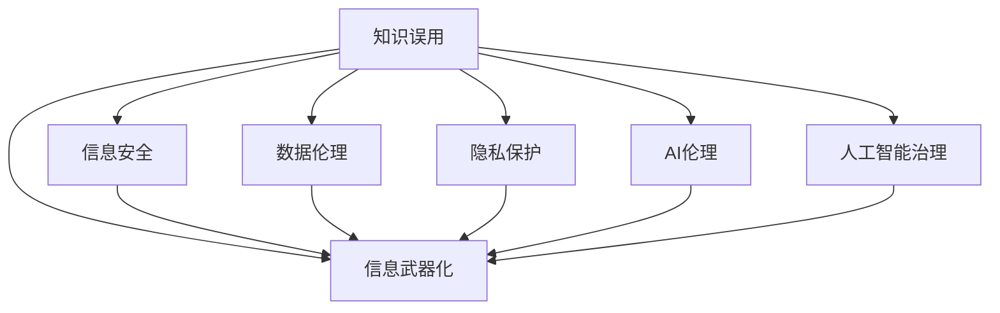

                 

# 知识的误用：防范信息武器化的策略

> 关键词：知识误用,信息武器化,信息安全,数据伦理,隐私保护,AI伦理,人工智能治理

## 1. 背景介绍

在信息化高度发展的今天，知识作为一种重要的资源，不仅对经济社会发展起着举足轻重的作用，同时也引发了诸多新的问题，尤其是知识误用的风险日益凸显。知识误用，即对知识的有意或无意滥用，可能导致信息武器化、隐私侵犯、伦理冲突等一系列社会问题，严重威胁到个人隐私、社会安全和国家安全。本文将围绕知识误用与信息武器化的防范策略，从理论基础、技术手段和治理机制三个层面展开探讨，旨在构建一个更加安全、透明和可控的知识应用环境。

## 2. 核心概念与联系

### 2.1 核心概念概述

1. **知识误用**：指在有意或无意的情况下，利用知识进行不正当、有害或不道德的活动。知识误用的形式多种多样，包括但不限于虚假信息的传播、对他人隐私的侵犯、误导性广告的发布等。

2. **信息武器化**：指利用信息技术手段，将知识或信息转化为攻击或破坏的工具，用于影响他人思想、行为或社会秩序。信息武器化在网络空间、军事领域、商业竞争等领域均有应用。

3. **信息安全**：指保护信息免受未授权访问、使用、泄露或破坏的措施，确保信息的机密性、完整性和可用性。

4. **数据伦理**：涉及在数据收集、存储、使用、共享和处理过程中所涉及的伦理问题，包括隐私保护、知情同意、数据匿名化等。

5. **隐私保护**：指通过法律、技术和政策手段，保护个人隐私不被侵犯的措施，包括但不限于数据加密、匿名化处理、隐私政策制定等。

6. **AI伦理**：涉及人工智能在开发、应用过程中所涉及的伦理问题，包括但不限于算法透明性、公平性、责任归属等。

7. **人工智能治理**：指通过法律、政策和技术手段，确保人工智能的安全、透明和可控，防范AI技术带来的风险。

### 2.2 核心概念原理和架构的 Mermaid 流程图



此图表展示了知识误用与信息武器化之间的联系，以及它们与信息安全、数据伦理、隐私保护、AI伦理和人工智能治理等概念的相互作用。核心概念之间通过箭头表示逻辑关联，表明各概念的相互影响和依赖关系。

## 3. 核心算法原理 & 具体操作步骤

### 3.1 算法原理概述

防范知识误用和信息武器化的策略主要分为三个层次：技术手段、法律政策和社会治理。本文将重点介绍基于机器学习和数据挖掘的技术手段，涵盖数据匿名化、异常检测、可信证据生成等技术，旨在从技术层面提升信息安全防护能力。

### 3.2 算法步骤详解

#### 3.2.1 数据匿名化

数据匿名化是保护隐私的重要手段之一。通过将数据中的个人身份信息替换为通用标识符，可以在保证数据可用性的同时，减少隐私泄露的风险。数据匿名化一般分为两个步骤：

1. **去标识化**：将数据中的敏感信息（如姓名、身份证号等）替换为无法识别个人身份的标识符。
2. **泛化**：对数据进行泛化处理，进一步减少信息泄露的风险。

数据匿名化的核心在于设计合适的匿名化算法，既要保留数据的可用性，又要保证数据的安全性。

#### 3.2.2 异常检测

异常检测是指通过数据分析技术，识别出数据集中的异常或异常行为。在信息安全领域，异常检测可以用于检测网络攻击、恶意软件等异常行为。异常检测算法主要分为统计学方法和机器学习方法两类。

1. **统计学方法**：基于统计学原理，通过计算数据的均值、方差等指标，判断数据是否异常。
2. **机器学习方法**：使用分类、聚类、深度学习等技术，构建异常检测模型。

#### 3.2.3 可信证据生成

可信证据生成是指通过多源数据的综合分析，生成可信度较高的证据。在信息武器化防范中，可信证据生成可以帮助辨别虚假信息和谣言，增强信息传播的可靠性。

可信证据生成通常需要融合多源异构数据，使用数据融合技术，对数据进行归一化、融合和分析，生成可信度高的证据。

### 3.3 算法优缺点

#### 3.3.1 优点

1. **提升信息安全防护能力**：通过数据匿名化、异常检测等技术手段，可以有效提升信息安全防护能力，减少隐私泄露和信息武器化的风险。
2. **增强信息传播的可靠性**：可信证据生成技术可以帮助识别虚假信息，增强信息传播的可靠性和可信度。
3. **提高决策的准确性**：基于多源异构数据的融合分析，可以提高决策的准确性和有效性。

#### 3.3.2 缺点

1. **技术复杂度高**：数据匿名化、异常检测、可信证据生成等技术手段，涉及复杂的数据处理和分析，对技术要求较高。
2. **数据隐私泄露风险**：在数据处理和分析过程中，存在数据隐私泄露的风险，需要设计合适的隐私保护措施。
3. **技术成本高**：技术手段的实现和维护需要投入大量的人力和物力资源。

### 3.4 算法应用领域

防范知识误用和信息武器化的技术手段，在多个领域有广泛的应用：

1. **网络安全**：通过异常检测技术，防范网络攻击、恶意软件等威胁。
2. **信息传播**：通过可信证据生成技术，识别和防止虚假信息传播。
3. **商业智能**：通过数据分析技术，提高商业决策的准确性和效率。
4. **医疗健康**：通过数据匿名化技术，保护患者隐私，提高医疗数据的可用性。

## 4. 数学模型和公式 & 详细讲解 & 举例说明

### 4.1 数学模型构建

防范信息武器化的数学模型构建主要围绕以下几个方面展开：

1. **数据匿名化模型**：基于数学模型设计匿名化算法，如k-匿名化、l-多样性等。
2. **异常检测模型**：设计异常检测算法，如基于统计学的Z-score法，基于机器学习的孤立森林、SVM等。
3. **可信证据生成模型**：设计多源数据融合模型，如基于加权平均、集成学习等方法。

### 4.2 公式推导过程

#### 4.2.1 数据匿名化

以k-匿名化为例，其核心公式为：

$$
T' = T - k + \text{random}(0, k-1)
$$

其中，$T$为原始数据，$T'$为匿名化后的数据，$k$为匿名化标识符数量，$\text{random}(0, k-1)$为随机生成一个$[0,k-1]$内的整数。

#### 4.2.2 异常检测

以孤立森林为例，其核心公式为：

$$
P(x_i \text{为异常}) = 1 - \frac{\log_2 D}{\log_2 N}
$$

其中，$x_i$为数据样本，$D$为数据集深度，$N$为数据集节点数量。

#### 4.2.3 可信证据生成

以加权平均为例，其核心公式为：

$$
\text{证据} = \frac{\sum_{i=1}^n w_i \cdot \text{数据}_i}{\sum_{i=1}^n w_i}
$$

其中，$w_i$为数据$i$的权重，$n$为数据总数。

### 4.3 案例分析与讲解

#### 案例1：网络安全中的异常检测

某网络安全公司使用孤立森林算法进行异常检测。在训练阶段，算法通过构建孤立森林模型，对正常流量和异常流量进行分类。在测试阶段，对于每个新流量，算法计算其深度，并根据公式计算异常概率。

#### 案例2：信息传播中的可信证据生成

某社交媒体平台使用多源数据融合技术生成可信证据。在生成可信证据的过程中，算法综合考虑用户点赞数、评论数、分享数等指标，对新闻文章的可信度进行评估。

## 5. 项目实践：代码实例和详细解释说明

### 5.1 开发环境搭建

在项目实践之前，需要搭建相应的开发环境。以下以Python环境为例，介绍开发环境的搭建步骤：

1. **安装Python**：从官网下载安装Python最新版本，确保环境稳定。
2. **安装必要的库**：安装NumPy、Pandas、scikit-learn、TensorFlow等必要的库。
3. **配置环境**：使用虚拟环境管理工具，如virtualenv或conda，创建虚拟环境，避免不同项目之间的库冲突。

### 5.2 源代码详细实现

以下以数据匿名化为例，给出Python代码实现：

```python
import numpy as np
import pandas as pd

# 定义匿名化函数
def k_anonymize(data, k):
    # 计算统计信息
    stats = data.describe()
    
    # 随机生成匿名化标识符
    anonyms = np.random.randint(0, k, size=len(data))
    
    # 替换敏感信息
    anonymized_data = data.replace({'sensitive_info': anonyms})
    
    return anonymized_data

# 读取数据
data = pd.read_csv('sensitive_data.csv')

# 进行k-匿名化
k_anonymized_data = k_anonymize(data, 10)

# 输出匿名化结果
print(k_anonymized_data.head())
```

### 5.3 代码解读与分析

#### 代码解析

1. **数据读取**：使用Pandas库读取数据集。
2. **k-匿名化函数实现**：定义k-匿名化函数，通过计算统计信息和随机生成匿名化标识符，实现数据匿名化。
3. **数据匿名化**：对原始数据进行k-匿名化处理，生成匿名化数据集。
4. **输出结果**：输出匿名化数据集的前几行，以验证匿名化效果。

#### 性能分析

数据匿名化是保护隐私的重要手段，但可能影响数据的可用性。需要权衡隐私保护和数据可用性之间的关系，选择合适的匿名化参数。

## 6. 实际应用场景

### 6.1 网络安全

网络安全领域是信息武器化的重要战场。通过异常检测技术，可以及时发现和防范网络攻击，保护网络系统的安全。例如，银行系统通过异常检测技术，可以识别出异常交易行为，避免金融诈骗。

### 6.2 信息传播

信息传播领域是信息武器化的常见应用场景。通过可信证据生成技术，可以识别和防止虚假信息的传播，维护信息传播的公平性和可靠性。例如，新闻媒体通过可信证据生成技术，可以评估新闻文章的可信度，提高信息的透明度和可信度。

### 6.3 商业智能

商业智能领域需要大量数据的支持。通过数据匿名化和异常检测技术，可以提高商业决策的准确性和有效性。例如，电商公司通过异常检测技术，可以识别出异常交易行为，防范欺诈行为，保护公司利益。

### 6.4 医疗健康

医疗健康领域涉及大量敏感数据。通过数据匿名化和隐私保护技术，可以提高数据的安全性和可用性。例如，医院通过数据匿名化技术，保护患者隐私，同时提供高质量的医疗数据支持。

## 7. 工具和资源推荐

### 7.1 学习资源推荐

1. **《数据科学基础》**：介绍数据科学的基础知识和实践技能，适合初学者入门。
2. **《Python数据科学手册》**：详细介绍Python在数据科学中的应用，涵盖数据预处理、统计分析、机器学习等。
3. **《机器学习实战》**：通过实际案例，讲解机器学习算法的实现和应用，适合动手实践。
4. **《深度学习》**：介绍深度学习的基本原理和实现技术，适合进阶学习。
5. **《数据隐私与伦理》**：介绍数据隐私保护和伦理问题，适合深入学习。

### 7.2 开发工具推荐

1. **Jupyter Notebook**：免费的交互式编程环境，支持多种编程语言和数据分析工具。
2. **TensorFlow**：开源深度学习框架，支持GPU加速，适合大规模数据处理和深度学习任务。
3. **Scikit-learn**：开源机器学习库，支持多种机器学习算法和数据处理工具。
4. **Pandas**：开源数据处理库，支持数据读取、处理和分析。
5. **Matplotlib**：开源数据可视化库，支持多种图表类型和数据展示方式。

### 7.3 相关论文推荐

1. **《数据匿名化的隐私保护技术》**：详细介绍了数据匿名化的隐私保护技术，适合隐私保护研究者。
2. **《异常检测方法综述》**：全面介绍了异常检测的多种方法，适合异常检测研究者。
3. **《可信证据生成技术研究》**：介绍了可信证据生成技术的基本原理和应用场景，适合信息武器化防范研究者。

## 8. 总结：未来发展趋势与挑战

### 8.1 研究成果总结

防范信息武器化的研究主要集中在数据安全、隐私保护和可信证据生成等方面。通过数据匿名化、异常检测和可信证据生成等技术手段，可以有效提升信息安全防护能力，减少隐私泄露和信息武器化的风险。

### 8.2 未来发展趋势

1. **技术手段的多样化**：未来将出现更多先进的技术手段，如联邦学习、区块链技术等，用于提升信息安全防护能力。
2. **隐私保护和数据伦理**：随着数据应用场景的不断扩展，隐私保护和数据伦理问题将更加凸显，需要更多的政策和技术手段加以保障。
3. **人工智能治理**：人工智能技术的广泛应用，将带来更多的伦理和安全挑战，需要制定更加全面和严格的人工智能治理框架。

### 8.3 面临的挑战

1. **技术复杂度高**：信息武器化防范技术涉及复杂的数据处理和分析，对技术要求较高。
2. **隐私泄露风险**：在数据处理和分析过程中，存在数据隐私泄露的风险。
3. **技术成本高**：技术手段的实现和维护需要投入大量的人力和物力资源。

### 8.4 研究展望

1. **技术融合创新**：将多种技术手段进行融合创新，提升信息安全防护能力。
2. **跨领域应用推广**：将信息武器化防范技术推广到更多领域，如金融、医疗、交通等。
3. **政策法规完善**：制定更加全面和严格的政策法规，保障信息安全和个人隐私。

## 9. 附录：常见问题与解答

**Q1：什么是数据匿名化？**

A: 数据匿名化是指在数据处理过程中，将个人身份信息替换为无法识别个人身份的标识符，以保护个人隐私。常见的数据匿名化方法包括k-匿名化、l-多样性、泛化等。

**Q2：数据匿名化对数据可用性有何影响？**

A: 数据匿名化可能会影响数据的可用性，因为匿名化处理会使数据失去一些原始特征。需要在隐私保护和数据可用性之间进行权衡，选择合适的匿名化参数和方法。

**Q3：异常检测在信息安全中的应用有哪些？**

A: 异常检测在信息安全中的应用包括识别网络攻击、检测恶意软件、防范欺诈行为等。通过异常检测，可以及时发现和防范信息武器化的风险。

**Q4：可信证据生成的核心思想是什么？**

A: 可信证据生成的核心思想是通过多源数据的综合分析，生成可信度较高的证据。可信证据生成可以帮助辨别虚假信息，增强信息传播的可靠性和可信度。

**Q5：人工智能治理面临哪些挑战？**

A: 人工智能治理面临的挑战包括技术复杂度高、隐私泄露风险大、技术成本高等。需要在技术创新、隐私保护和成本控制之间进行平衡。

---

作者：禅与计算机程序设计艺术 / Zen and the Art of Computer Programming

