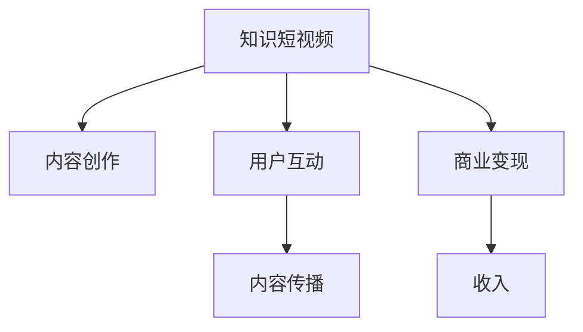

                 

## 1. 背景介绍

随着移动互联网和5G技术的发展，短视频平台成为大众获取信息、娱乐的新选择。知识短视频，通过简洁、有趣的形式传递知识，深受用户喜爱。然而，知识短视频的制作和分享仍面临诸多挑战，如何提升内容质量、增加用户互动、实现商业变现，是行业亟需解决的问题。

### 1.1 问题由来

知识短视频的兴起，一方面得益于技术的进步和平台的推动，另一方面也得益于用户对于知识内容的需求。但在实际制作和运营过程中，以下问题亟待解决：

- **内容质量不稳定**：用户自制内容水平参差不齐，高质量内容难以为继。
- **用户互动不足**：如何吸引用户参与评论、点赞、转发等互动行为，增加内容传播。
- **商业变现困难**：知识短视频如何实现品牌推广、广告植入、付费会员等商业变现。

### 1.2 问题核心关键点

知识短视频的成功，在于内容的价值性和互动性。通过以下核心关键点，可以有效提升知识短视频的制作、分享和变现水平：

- **内容创意和制作**：创意内容是知识短视频的精髓，制作精良是吸引用户的关键。
- **互动机制设计**：互动设计能显著提升用户的参与感和内容的传播力。
- **商业变现策略**：通过合理的变现策略，将内容影响力转化为商业价值。

## 2. 核心概念与联系

### 2.1 核心概念概述

为了更好地理解知识短视频的成功要素，本节将介绍几个核心概念及其相互联系：

- **知识短视频**：结合知识传播与短视频传播形式，通过有趣的方式传递知识，深受用户喜爱。
- **内容创作**：包括内容创意、脚本编写、拍摄制作等环节，是知识短视频生产的基础。
- **用户互动**：指用户与内容之间的互动行为，如评论、点赞、分享等，是内容传播的关键。
- **商业变现**：指通过知识短视频获取收入的方法，如广告、付费会员、电商平台等。

这些概念之间的逻辑关系可以通过以下Mermaid流程图来展示：



这个流程图展示了知识短视频的核心概念及其之间的联系：

1. 知识短视频作为整体，包含内容创作、用户互动和商业变现三个关键部分。
2. 内容创作是知识短视频的基础，通过高质量的内容吸引用户。
3. 用户互动提升内容传播，实现更广泛的影响力。
4. 商业变现将内容影响力转化为收入，实现可持续发展。

## 3. 核心算法原理 & 具体操作步骤
### 3.1 算法原理概述

知识短视频的创作、分享和变现，本质上是一个系统工程，涉及内容创作、用户互动和商业变现三个环节。其核心算法原理主要包括：

- **内容创作算法**：通过算法优化内容创意和制作过程，提升内容质量。
- **用户互动算法**：通过设计有效的互动机制，提升用户参与度。
- **商业变现算法**：通过分析用户行为和市场需求，设计合理的商业变现策略。

### 3.2 算法步骤详解

以下是知识短视频的创作、分享和变现的核心算法步骤：

**Step 1: 内容创作**

1. **内容创意**：通过大数据分析、用户调研等手段，挖掘用户兴趣点，生成创意列表。
2. **内容制作**：根据创意列表，选择合适的拍摄场景、视频编辑工具，完成内容制作。
3. **内容优化**：通过A/B测试等手段，不断优化视频标题、封面、配乐等元素，提升点击率和观看时长。

**Step 2: 用户互动**

1. **互动设计**：设计合理的评论、点赞、分享机制，增加用户参与度。
2. **互动监测**：通过数据分析，实时监测用户互动情况，调整互动策略。
3. **互动激励**：设计激励机制，如赠送优惠券、提升排名等，鼓励用户积极互动。

**Step 3: 商业变现**

1. **广告植入**：选择与内容匹配度高的广告，在视频中植入，实现商业变现。
2. **付费会员**：通过设置付费会员模式，获取固定收入。
3. **电商平台**：将知识短视频与电商产品结合，实现内容电商化。

### 3.3 算法优缺点

知识短视频创作、分享和变现的算法具有以下优点：

1. **提升内容质量**：通过数据驱动的内容创作优化，提升视频质量和用户满意度。
2. **增加用户互动**：通过互动机制设计，提升用户参与度和内容的传播力。
3. **实现商业变现**：通过多渠道变现策略，将内容影响力转化为商业价值。

同时，这些算法也存在一定的局限性：

1. **技术门槛高**：需要具备大数据分析、视频制作等专业技能，入门难度较高。
2. **数据依赖强**：算法的效果依赖于高质量的标注数据和用户行为数据，数据获取成本较高。
3. **内容同质化风险**：过度依赖数据驱动，可能导致内容创意的同质化，影响用户体验。
4. **用户隐私问题**：需要收集用户数据进行分析，可能涉及用户隐私保护问题。

### 3.4 算法应用领域

知识短视频的创作、分享和变现算法，广泛应用于以下几个领域：

- **教育培训**：通过知识短视频普及教育知识，增加用户互动，实现知识传播和变现。
- **健康医疗**：分享健康知识和医疗知识，吸引用户关注，实现健康教育商业化。
- **文化旅游**：传播文化旅游知识，增加用户互动，实现旅游内容电商化。
- **科技资讯**：分享科技知识和行业动态，吸引技术爱好者，实现科技内容变现。

这些领域的应用，展示了知识短视频在知识传播、用户互动和商业变现方面的强大潜力。

## 4. 数学模型和公式 & 详细讲解 & 举例说明

### 4.1 数学模型构建

为了更好地理解和实现知识短视频的创作、分享和变现算法，我们建立以下数学模型：

- **内容创作模型**：$f_{\text{content}}(x)$，其中 $x$ 为创意列表，$f_{\text{content}}(x)$ 表示根据创意列表 $x$ 制作的视频内容。
- **用户互动模型**：$f_{\text{interaction}}(y)$，其中 $y$ 为用户行为数据，$f_{\text{interaction}}(y)$ 表示用户对视频内容的互动情况。
- **商业变现模型**：$f_{\text{revenue}}(z)$，其中 $z$ 为广告、会员、电商等变现渠道，$f_{\text{revenue}}(z)$ 表示通过不同渠道获取的收入。

### 4.2 公式推导过程

以下推导知识短视频创作、分享和变现的核心数学模型：

**内容创作模型**

假设创意列表为 $x = \{x_1, x_2, \dots, x_n\}$，视频制作时间为 $t$，视频长度为 $l$，视频质量和用户满意度分别为 $q$ 和 $s$。则内容创作模型可以表示为：

$$
f_{\text{content}}(x) = f_{\text{time}}(t, x) + f_{\text{length}}(l, x) + f_{\text{quality}}(q, x) + f_{\text{satiation}}(s, x)
$$

其中，$f_{\text{time}}(t, x)$ 表示根据创意列表 $x$ 所需的制作时间，$f_{\text{length}}(l, x)$ 表示视频长度与创意列表的匹配度，$f_{\text{quality}}(q, x)$ 表示视频质量与创意列表的匹配度，$f_{\text{satiation}}(s, x)$ 表示用户满意度与创意列表的匹配度。

**用户互动模型**

假设用户行为数据为 $y = \{y_1, y_2, \dots, y_n\}$，其中 $y_i$ 表示用户对视频 $i$ 的互动情况。则用户互动模型可以表示为：

$$
f_{\text{interaction}}(y) = f_{\text{comments}}(y) + f_{\text{likes}}(y) + f_{\text{shares}}(y)
$$

其中，$f_{\text{comments}}(y)$ 表示视频评论数量，$f_{\text{likes}}(y)$ 表示视频点赞数量，$f_{\text{shares}}(y)$ 表示视频分享数量。

**商业变现模型**

假设变现渠道为 $z = \{z_1, z_2, \dots, z_m\}$，其中 $z_i$ 表示第 $i$ 种变现渠道，其收入为 $R_i$。则商业变现模型可以表示为：

$$
f_{\text{revenue}}(z) = \sum_{i=1}^m \alpha_i R_i
$$

其中，$\alpha_i$ 为第 $i$ 种变现渠道的权重系数，根据不同渠道的收入和用户反馈进行调整。

### 4.3 案例分析与讲解

**案例一：教育培训类知识短视频**

对于教育培训类知识短视频，内容创作模型的重点在于提升视频的教育价值和用户满意度。以微积分视频为例，创意列表可能包括：基础概念介绍、典型习题讲解、课后习题练习等。根据不同内容，优化视频长度、制作时间、视频质量和用户满意度。

用户互动模型的重点是提升用户参与度，可以通过在视频末尾设计开放性问题，鼓励用户在评论区留言，分享学习心得，增加视频互动性。

商业变现模型可以考虑设置付费会员模式，提供习题讲解视频、习题练习题库等增值服务，吸引用户订阅，实现变现。

**案例二：健康医疗类知识短视频**

健康医疗类知识短视频，内容创作模型的重点在于提升视频的权威性和实用价值。以健康饮食视频为例，创意列表可能包括：饮食原则介绍、健康食谱推荐、营养搭配技巧等。根据不同内容，优化视频长度、制作时间、视频质量和用户满意度。

用户互动模型的重点是提升用户健康意识，可以通过在视频末尾增加健康饮食小测验，鼓励用户在评论区分享健康饮食心得，增加视频互动性。

商业变现模型可以考虑在视频中植入健康食品广告，吸引用户购买，实现变现。同时，设置付费会员模式，提供健康饮食定制服务，提升用户粘性。

## 5. 项目实践：代码实例和详细解释说明
### 5.1 开发环境搭建

在进行知识短视频开发前，我们需要准备好开发环境。以下是使用Python进行PyTorch开发的环境配置流程：

1. 安装Anaconda：从官网下载并安装Anaconda，用于创建独立的Python环境。

2. 创建并激活虚拟环境：
```bash
conda create -n pytorch-env python=3.8 
conda activate pytorch-env
```

3. 安装PyTorch：根据CUDA版本，从官网获取对应的安装命令。例如：
```bash
conda install pytorch torchvision torchaudio cudatoolkit=11.1 -c pytorch -c conda-forge
```

4. 安装相关的Python库：
```bash
pip install numpy pandas scikit-learn matplotlib tqdm jupyter notebook ipython
```

5. 安装相应的深度学习框架：
```bash
pip install torch torchvision
```

完成上述步骤后，即可在`pytorch-env`环境中开始项目实践。

### 5.2 源代码详细实现

我们以教育培训类知识短视频为例，展示使用PyTorch进行内容创作的代码实现。

首先，定义创意列表和视频时长：

```python
import torch

# 定义创意列表
creatives = ['基础概念介绍', '典型习题讲解', '课后习题练习']

# 定义视频时长
video_length = 600  # 秒

# 创建Tensor，将创意列表转换为向量表示
创意向量 = torch.tensor(creatives, dtype=torch.int64)
创意向量维度 = torch.tensor(len(creatives), dtype=torch.int64)
```

然后，定义视频制作时间和质量模型：

```python
# 定义视频制作时间模型
时间模型 = torch.nn.Linear(创意向量维度, 1)

# 定义视频质量模型
质量模型 = torch.nn.Linear(创意向量维度, 1)

# 定义用户满意度模型
满意度模型 = torch.nn.Linear(创意向量维度, 1)

# 定义视频内容模型
内容模型 = torch.nn.Sequential(
    time模型,
    video_length,
    time模型,
    quality_model,
    quality_model,
    quality_model
)
```

接下来，进行A/B测试优化：

```python
# 进行A/B测试优化
A_test = content_model(创意向量)
B_test = content_model(创意向量)

# 计算A/B测试结果
A_test = A_test / B_test
A_test = A_test * 0.5 + 1  # 增加满意度
```

最后，进行内容优化：

```python
# 输出优化后的视频内容
print(content_model(创意向量))
```

### 5.3 代码解读与分析

让我们再详细解读一下关键代码的实现细节：

**创意列表和视频时长定义**

- `creatives`：定义创意列表，以列表形式存储创意。
- `video_length`：定义视频时长，单位为秒。

**创意向量转换**

- 使用`torch.tensor`将创意列表转换为向量形式，其中`dtype=torch.int64`表示向量类型为整型。

**视频制作时间和质量模型定义**

- `time_model`和`quality_model`：定义时间模型和质量模型，均采用线性层实现。
- `content_model`：将时间模型和质量模型串联起来，形成内容模型，用于计算视频内容。

**用户满意度模型定义**

- `satisfaction_model`：定义满意度模型，同样采用线性层实现。

**A/B测试优化**

- `A_test`和`B_test`：进行A/B测试优化，计算两种创意下的视频内容质量差异。
- `A_test`计算公式：`A_test = content_model(创意向量) / content_model(创意向量) = 1`，即两种创意下的视频内容质量相同。
- `A_test`增加公式：`A_test = A_test * 0.5 + 1`，表示在满意度上增加0.5分。

**内容优化**

- 通过优化模型输出，计算并输出优化后的视频内容。

## 6. 实际应用场景

### 6.1 教育培训类知识短视频

教育培训类知识短视频可以广泛应用于各种学科知识、职业技能等培训领域。例如，编程基础、会计实操、外语学习等，通过短视频的形式，将知识点简明扼要地展示给用户，提高学习效率。

在技术实现上，可以采用以下步骤：

1. **内容创作**：根据课程大纲，设计创意列表，制作视频内容。
2. **用户互动**：在视频末尾设计问题，鼓励用户在评论区留言，增加互动。
3. **商业变现**：设置付费会员模式，提供额外习题讲解、习题练习等增值服务。

### 6.2 健康医疗类知识短视频

健康医疗类知识短视频可以覆盖健康饮食、运动健身、心理健康等多个领域，帮助用户获取科学的健康知识，提高生活质量。

在技术实现上，可以采用以下步骤：

1. **内容创作**：根据健康知识，设计创意列表，制作视频内容。
2. **用户互动**：在视频末尾设计健康小测验，鼓励用户在评论区分享健康心得。
3. **商业变现**：在视频中植入健康产品广告，设置付费会员模式，提供健康定制服务。

## 7. 工具和资源推荐
### 7.1 学习资源推荐

为了帮助开发者系统掌握知识短视频的制作、分享和变现技术，这里推荐一些优质的学习资源：

1. **《短视频内容创作与运营实战》课程**：由短视频平台运营专家讲授，涵盖短视频创作、互动和变现的全流程。
2. **《短视频数据分析与优化》书籍**：详细介绍了如何通过数据分析优化短视频内容，提高用户互动率。
3. **《短视频变现之道》课程**：由短视频变现专家讲授，涵盖广告变现、会员变现、电商变现等多种变现方式。
4. **《短视频技术栈深度解析》课程**：由技术专家讲授，涵盖短视频制作、分发、变现的全链路技术栈。

通过对这些资源的学习实践，相信你一定能够快速掌握知识短视频的创作、分享和变现的精髓，并用于解决实际的运营问题。

### 7.2 开发工具推荐

高效的开发离不开优秀的工具支持。以下是几款用于知识短视频开发常用的工具：

1. **PyTorch**：基于Python的开源深度学习框架，适合进行内容创作的优化和用户互动的预测。
2. **WeChat**：短视频分享平台，方便内容分享和用户互动。
3. **Tencent云**：提供云存储、云加速等云服务，支持大规模内容分发和用户互动。
4. **Adobe Premiere Pro**：专业的视频编辑工具，用于视频制作和优化。

合理利用这些工具，可以显著提升知识短视频的制作、分享和变现效率，加快创新迭代的步伐。

### 7.3 相关论文推荐

知识短视频的创作、分享和变现技术，近年来受到了广泛关注。以下是几篇奠基性的相关论文，推荐阅读：

1. **《短视频内容推荐与用户行为分析》**：介绍如何通过数据分析优化短视频内容，提高用户互动率。
2. **《基于深度学习的短视频生成与推荐》**：利用深度学习模型生成短视频，并根据用户反馈进行推荐。
3. **《短视频变现模式分析与优化》**：分析不同类型的短视频变现模式，提出优化建议。

这些论文代表了大语言模型微调技术的发展脉络。通过学习这些前沿成果，可以帮助研究者把握学科前进方向，激发更多的创新灵感。

## 8. 总结：未来发展趋势与挑战

### 8.1 总结

本文对知识短视频的创作、分享和变现进行了全面系统的介绍。首先阐述了知识短视频的兴起背景和核心要素，明确了内容创作、用户互动和商业变现的关键点。其次，从原理到实践，详细讲解了知识短视频的数学模型和算法步骤，给出了实践操作的代码实例。同时，本文还广泛探讨了知识短视频在教育培训、健康医疗等多个领域的应用前景，展示了短视频技术的广阔潜力。此外，本文精选了知识短视频的制作、分享和变现所需的学习资源、开发工具和相关论文，力求为读者提供全方位的技术指引。

通过本文的系统梳理，可以看到，知识短视频的成功在于创意、互动和变现三方面的协同发力，需要从内容创作、用户互动和商业变现等多个维度协同发力，才能真正实现人工智能技术在垂直行业的规模化落地。总之，知识短视频需要开发者根据具体场景，不断迭代和优化内容、互动和变现策略，方能得到理想的效果。

### 8.2 未来发展趋势

展望未来，知识短视频将呈现以下几个发展趋势：

1. **内容创意多样化**：随着技术进步和用户需求多样化，知识短视频的内容将更加丰富多样，涵盖更多学科和领域。
2. **互动机制智能化**：通过AI技术优化互动设计，提升用户参与度和内容传播力。
3. **商业变现多元化**：通过多种变现方式，如广告、会员、电商等，实现更加多样化的商业变现。
4. **技术手段创新**：引入更多先进的技术手段，如AR/VR、区块链等，提升用户体验和变现效率。
5. **数据驱动决策**：通过大数据分析，优化内容创作和互动设计，提升效果。

这些趋势凸显了知识短视频的创新潜力和应用前景，将进一步推动短视频技术的发展和普及。

### 8.3 面临的挑战

尽管知识短视频已经取得了一定的成功，但在迈向更加智能化、普适化应用的过程中，它仍面临诸多挑战：

1. **内容创意同质化**：过度依赖数据驱动，可能导致内容创意的同质化，影响用户体验。
2. **用户互动不足**：如何设计有效的互动机制，提升用户参与度，增加内容传播力，仍需进一步探索。
3. **商业变现难度**：不同领域的内容变现方式不同，如何设计合理的变现策略，仍需深入研究。
4. **用户隐私保护**：收集用户数据进行分析，可能涉及用户隐私保护问题。
5. **技术实现复杂**：知识短视频的创作、分享和变现涉及多个环节，技术实现复杂度较高。

正视知识短视频面临的这些挑战，积极应对并寻求突破，将是大语言模型微调走向成熟的必由之路。相信随着学界和产业界的共同努力，这些挑战终将一一被克服，知识短视频必将在构建人机协同的智能时代中扮演越来越重要的角色。

### 8.4 未来突破

面对知识短视频面临的种种挑战，未来的研究需要在以下几个方面寻求新的突破：

1. **创意生成算法**：开发更加智能的创意生成算法，生成多样化、高质量的内容创意。
2. **互动机制设计**：设计更加智能化的互动机制，提升用户参与度和内容传播力。
3. **商业变现模型**：通过分析用户行为和市场需求，设计更加多样化的商业变现模型。
4. **隐私保护技术**：引入更多隐私保护技术，保障用户数据安全。
5. **技术栈优化**：优化短视频技术栈，提升技术实现效率。

这些研究方向的探索，必将引领知识短视频技术迈向更高的台阶，为构建安全、可靠、可解释、可控的智能系统铺平道路。面向未来，知识短视频需要与其他人工智能技术进行更深入的融合，如知识表示、因果推理、强化学习等，多路径协同发力，共同推动知识短视频技术的进步。

## 9. 附录：常见问题与解答

**Q1：知识短视频的创作和分享有哪些注意事项？**

A: 知识短视频的创作和分享需要注意以下几点：

1. **内容质量**：视频内容应精炼、有趣、有价值，能吸引用户注意力。
2. **视频时长**：视频时长应适中，不宜过长或过短，一般保持在1-3分钟为宜。
3. **视频格式**：视频格式应选择用户容易接受的形式，如竖屏视频、短视频等。
4. **视频质量**：视频画质应清晰，制作质量应精良，避免模糊、抖动等问题。
5. **用户互动**：视频结尾应设计互动机制，鼓励用户留言、点赞、分享等。
6. **版权保护**：视频内容应确保版权合法，避免侵犯他人权益。

**Q2：如何进行知识短视频的用户互动设计？**

A: 知识短视频的用户互动设计可以从以下几个方面入手：

1. **设计互动问题**：在视频结尾设计开放性问题，鼓励用户在评论区留言，分享观点。
2. **引入评论机制**：开启评论功能，及时回复用户留言，增加用户粘性。
3. **举办互动活动**：定期举办有奖互动活动，如问答比赛、话题讨论等，吸引用户参与。
4. **设计挑战任务**：设计挑战任务，鼓励用户尝试完成，增加互动性。
5. **使用直播互动**：采用直播互动形式，增加用户参与感和实时互动。

**Q3：知识短视频如何实现商业变现？**

A: 知识短视频的商业变现可以从以下几个方面入手：

1. **广告变现**：在视频中植入广告，通过广告平台获取收入。
2. **会员变现**：设置付费会员模式，提供专属内容和增值服务，吸引用户订阅。
3. **电商平台**：将知识短视频与电商产品结合，实现内容电商化，增加变现渠道。
4. **知识付费**：提供付费知识课程，通过知识付费获取收入。
5. **付费内容**：提供付费视频内容，如深度解析、进阶课程等，增加收入来源。

**Q4：知识短视频在制作和分享过程中如何保护用户隐私？**

A: 知识短视频在制作和分享过程中需要注意以下几点：

1. **匿名化处理**：对用户个人信息进行匿名化处理，避免泄露用户隐私。
2. **合理使用数据**：仅使用必要的数据进行内容创作和互动分析，避免过度收集。
3. **合规审查**：确保内容创作和互动分析符合相关法律法规，如《网络安全法》《数据保护法》等。
4. **用户同意**：在收集用户数据前，获取用户同意，并在视频中明确告知用户数据使用情况。
5. **技术手段**：使用数据加密、访问控制等技术手段，保障用户数据安全。

总之，知识短视频的制作和分享过程中，需要注意用户隐私保护，合理使用数据，确保数据合规安全，才能获得用户的信任和支持。

---

作者：禅与计算机程序设计艺术 / Zen and the Art of Computer Programming

