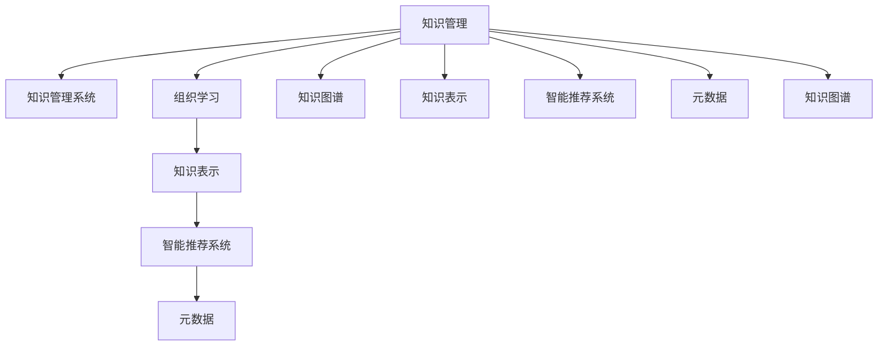

                 

# 知识管理与组织学习：企业发展的动力

在当今复杂多变的商业环境中，知识管理和组织学习成为了企业持续竞争力的核心驱动因素。本文旨在深入探讨知识管理与组织学习的原理、操作步骤、核心算法及其应用领域，通过系统阐述其在企业发展中的重要性，以及提供详尽的实践案例和未来展望，希望能为企业管理者和IT专业人士提供深刻的见解和指导。

## 1. 背景介绍

### 1.1 问题由来

随着信息时代的到来，企业的运营模式和竞争方式发生了深刻变化。海量的数据和信息不断涌现，企业在快速适应环境变化的同时，也面临着巨大的知识管理挑战。如何高效地整合、利用这些知识资源，成为影响企业发展速度和质量的关键因素。而组织学习，即企业内部成员通过交流、合作等方式不断积累和提升知识水平的过程，是实现知识资源转化为企业竞争优势的重要途径。

### 1.2 问题核心关键点

知识管理和组织学习的核心在于如何有效地获取、存储、共享和应用知识，以驱动企业发展和创新。这包括：
- 构建有效的知识管理系统(Knowledge Management System, KMS)，以支持知识的创建、存储、检索和共享。
- 建立组织学习的文化氛围，鼓励员工主动学习和分享经验。
- 运用智能推荐算法、搜索技术等技术手段，提高知识检索和应用的效率。
- 在实际业务场景中实施组织学习机制，如知识分享会议、学习小组等，推动知识在组织内部的流通和应用。

### 1.3 问题研究意义

企业通过有效的知识管理和组织学习，可以显著提高决策效率、降低运营成本、增强创新能力，从而提升市场竞争力和持续发展能力。研究知识管理与组织学习的意义如下：
- 优化资源配置：通过科学的知识管理策略，企业能够更有效地利用其知识资源，避免重复劳动和信息孤岛。
- 加速创新周期：组织学习促进了新知识的生成和传播，加速了技术创新和产品迭代。
- 提升员工满意度：知识分享和团队合作能够增强员工参与感和归属感，提升工作满意度和忠诚度。
- 增强企业灵活性：灵活的知识管理和组织学习机制，使得企业能够快速适应市场变化和新兴趋势。

## 2. 核心概念与联系

### 2.1 核心概念概述

为更好地理解知识管理和组织学习在企业中的应用，本节将介绍几个关键概念：

- **知识管理(Knowledge Management)**：指系统地管理、共享和利用知识资源的过程，旨在提升组织的信息利用率和知识创新能力。
- **组织学习(Organizational Learning)**：指企业内部成员通过交流、合作等方式，不断积累和提升知识水平的过程。
- **知识管理系统(KMS)**：用于支持知识创建、存储、检索和共享的系统工具。
- **知识表示(Knowledge Representation)**：指将知识结构化存储和表示的过程，以便更好地检索和应用。
- **智能推荐系统(Intelligent Recommendation System)**：通过算法推荐，提高知识检索和应用的效率。
- **元数据(Metadata)**：描述和定位知识资源的相关信息，如创建者、创建时间、修改记录等。
- **知识图谱(Knowledge Graph)**：基于图结构的知识表示方法，用于构建知识网络，促进知识关系的理解。

这些核心概念之间的逻辑关系可以通过以下Mermaid流程图来展示：



这个流程图展示了这个领域的核心概念及其之间的关系：

1. 知识管理通过知识管理系统（KMS）进行实施，系统化地管理知识的创建、存储、检索和共享。
2. 组织学习通过知识表示、智能推荐系统等手段，促进知识的内部流动和应用。
3. 知识表示和智能推荐系统是知识管理的两大核心技术，用于提高知识检索和应用的效率。
4. 元数据和知识图谱用于描述和定位知识资源，支持知识表示和智能推荐系统。

## 3. 核心算法原理 & 具体操作步骤

### 3.1 算法原理概述

知识管理和组织学习的核心算法主要涉及以下几个方面：

- **知识表示算法**：将知识结构化存储和表示，以便更好地检索和应用。如使用本体论、语义网等技术，对知识进行结构化建模。
- **智能推荐算法**：基于机器学习和数据挖掘技术，对用户行为进行分析和建模，实现个性化推荐。如协同过滤、内容推荐等方法。
- **搜索和匹配算法**：用于提高知识检索的效率。如倒排索引、布尔查询等技术。
- **情感分析算法**：用于分析用户反馈和评价，识别知识的价值和影响力。

这些算法相互配合，构成了一个高效的知识管理和组织学习系统。

### 3.2 算法步骤详解

知识管理和组织学习的一般步骤如下：

**Step 1: 知识收集与清洗**
- 收集内部文档、报告、邮件、博客等结构化或半结构化数据。
- 对数据进行清洗，去除重复、无关、错误等无用信息。

**Step 2: 知识存储与组织**
- 利用KMS存储和管理知识资源。
- 根据知识的类型和结构，将其组织成合适的形式，如文档、数据库、知识图谱等。

**Step 3: 知识检索与推荐**
- 使用搜索算法快速定位知识资源。
- 利用推荐算法，根据用户需求和行为，提供个性化的知识推荐。

**Step 4: 知识分享与协作**
- 搭建内部知识共享平台，支持文档上传、评论、点赞等互动功能。
- 通过知识社区、讨论组等形式，促进员工之间的知识交流和协作。

**Step 5: 知识应用与创新**
- 在业务决策、产品研发等实际应用中，利用知识资源推动创新和改进。
- 定期评估知识管理系统的效果，根据反馈进行调整和优化。

### 3.3 算法优缺点

知识管理和组织学习算法具有以下优点：
1. 提高了知识检索和应用效率。通过智能化推荐和搜索技术，员工能够快速找到所需知识，提升工作效率。
2. 促进了知识共享和团队协作。知识共享平台和社区机制，鼓励员工主动分享和交流，增强团队凝聚力。
3. 支持了企业创新和决策优化。通过系统化的知识管理，企业能够更科学地进行技术研发和业务决策。

同时，这些算法也存在一定的局限性：
1. 算法复杂度较高。特别是基于机器学习的推荐系统，需要大量的数据和计算资源。
2. 数据质量影响效果。知识管理系统的效率很大程度上依赖于数据的质量和完整性。
3. 用户习惯培养。员工需要适应新系统的使用习惯，才能充分发挥其作用。
4. 系统维护成本高。知识管理系统的搭建和维护需要技术团队的支持。

尽管如此，知识管理和组织学习算法仍是当前企业知识管理的主要手段，其带来的效率提升和创新效益不可忽视。

### 3.4 算法应用领域

知识管理和组织学习在各个行业领域都有广泛的应用，以下是几个典型的例子：

- **医疗行业**：医院通过知识管理系统，共享病历、诊断指南和最新研究文献，提升医疗服务的质量和效率。
- **金融行业**：银行利用智能推荐系统，为员工提供市场分析、风险评估等知识，支持投资决策和风险控制。
- **制造业**：企业通过知识图谱和搜索技术，优化产品设计、工艺流程，提升生产效率和产品质量。
- **教育行业**：学校搭建知识共享平台，促进教师之间知识交流和教学资源共享，提升教育质量。
- **零售行业**：电商利用推荐系统，分析用户行为，个性化推荐商品，提升用户体验和销售转化率。

这些行业应用展示了知识管理和组织学习在实际业务场景中的强大价值，为企业的发展提供了有力支持。

## 4. 数学模型和公式 & 详细讲解 & 举例说明

### 4.1 数学模型构建

知识管理和组织学习的数学模型构建主要涉及以下几个方面：

- **知识表示模型**：如本体论、知识图谱等，用于构建知识网络，支持知识的检索和应用。
- **推荐算法模型**：如协同过滤、矩阵分解等，用于分析用户行为，实现个性化推荐。
- **搜索算法模型**：如倒排索引、布尔查询等，用于提高知识检索的效率。

### 4.2 公式推导过程

以协同过滤推荐算法为例，假设用户对物品的评分矩阵为 $R$，用户集为 $U$，物品集为 $I$，协同过滤的目标是预测用户未评分物品的评分。协同过滤模型可以用矩阵分解的形式表示为：

$$
R \approx UA
$$

其中 $U$ 和 $A$ 分别表示用户向量和物品向量，$R$ 表示用户-物品评分矩阵。协同过滤的目标是最大化 $UA$ 与 $R$ 的相似度，可以通过求解下列优化问题实现：

$$
\min_{A} \|UA - R\|_F^2
$$

其中 $\|\cdot\|_F$ 表示矩阵的Frobenius范数。求解上述问题后，可以得到用户对未评分物品的预测评分。

### 4.3 案例分析与讲解

以亚马逊的推荐系统为例，其基于协同过滤算法实现了对用户行为的深度分析，并通过个性化推荐系统，向用户推荐商品。亚马逊的推荐系统具有以下几个特点：

1. **多维度数据融合**：融合了用户的浏览记录、购买记录、搜索记录等多维度数据，进行综合分析。
2. **实时更新推荐结果**：根据用户的即时行为，实时更新推荐结果，提升用户体验。
3. **个性化推荐**：根据用户的兴趣和历史行为，提供个性化的商品推荐，提高销售转化率。
4. **用户反馈机制**：引入用户反馈机制，对推荐结果进行评估和优化。

亚马逊的推荐系统通过协同过滤算法，实现了高效的个性化推荐，显著提升了销售额和用户满意度。

## 5. 项目实践：代码实例和详细解释说明

### 5.1 开发环境搭建

在进行知识管理和组织学习项目实践前，我们需要准备好开发环境。以下是使用Python进行知识管理系统开发的常见环境配置流程：

1. 安装Anaconda：从官网下载并安装Anaconda，用于创建独立的Python环境。

2. 创建并激活虚拟环境：
```bash
conda create -n knowledge-env python=3.8 
conda activate knowledge-env
```

3. 安装相关的Python库和工具：
```bash
pip install pandas numpy scikit-learn elasticsearch django
```

4. 搭建知识管理系统：
```bash
python manage.py runserver
```

5. 部署到云平台：如AWS、Google Cloud等，提供高可用性服务。

完成上述步骤后，即可在`knowledge-env`环境中开始知识管理系统的开发实践。

### 5.2 源代码详细实现

下面我们以一个简单的知识管理系统为例，展示其基本功能和实现方式。

**1. 数据库搭建**

首先需要搭建一个数据库，用于存储知识资源。这里以MySQL为例，通过以下SQL语句创建知识库：

```sql
CREATE DATABASE knowledge_base;
USE knowledge_base;
CREATE TABLE knowledge_doc (
    id INT PRIMARY KEY AUTO_INCREMENT,
    title VARCHAR(255) NOT NULL,
    content TEXT NOT NULL,
    author VARCHAR(255) NOT NULL,
    create_time TIMESTAMP NOT NULL DEFAULT CURRENT_TIMESTAMP
);
```

**2. 知识管理系统的API设计**

根据需求，设计API接口用于实现知识管理系统的核心功能，如文档上传、检索、推荐等。以下是一个简单的API设计：

```python
from django.http import JsonResponse
from django.views.decorators.csrf import csrf_exempt
from .models import KnowledgeDoc

@csrf_exempt
def upload_doc(request):
    if request.method == 'POST':
        title = request.POST['title']
        content = request.POST['content']
        author = request.POST['author']
        doc = KnowledgeDoc(title=title, content=content, author=author)
        doc.save()
        return JsonResponse({'message': '文档上传成功'})

@csrf_exempt
def search_doc(request):
    if request.method == 'GET':
        query = request.GET.get('q')
        docs = KnowledgeDoc.objects.filter(title__icontains=query)
        docs = [{"title": doc.title, "author": doc.author, "create_time": doc.create_time} for doc in docs]
        return JsonResponse(docs)

@csrf_exempt
def recommend_doc(request):
    if request.method == 'GET':
        user_id = request.GET.get('user_id')
        docs = KnowledgeDoc.objects.filter(author=user_id)
        docs = [{"title": doc.title, "author": doc.author, "create_time": doc.create_time} for doc in docs]
        return JsonResponse(docs)
```

**3. 知识管理系统的前端展示**

通过以下HTML和JavaScript代码，实现知识管理系统的前端展示：

```html
<!DOCTYPE html>
<html>
<head>
    <title>知识管理系统</title>
</head>
<body>
    <h1>上传文档</h1>
    <form method="POST" enctype="multipart/form-data">
        <input type="file" name="file">
        <input type="text" name="title">
        <input type="text" name="author">
        <input type="submit" value="上传">
    </form>
    <h1>搜索文档</h1>
    <form method="GET" action="/search_doc">
        <input type="text" name="q" placeholder="搜索关键词">
        <input type="submit" value="搜索">
    </form>
    <h1>推荐文档</h1>
    <form method="GET" action="/recommend_doc">
        <input type="text" name="user_id" placeholder="用户ID">
        <input type="submit" value="推荐">
    </form>
    <h2>文档列表</h2>
    <ul id="doc_list"></ul>
    <script>
        function renderDocList(docs) {
            const docList = document.getElementById('doc_list');
            docs.forEach(doc => {
                const li = document.createElement('li');
                li.innerHTML = `
                    <h3>${doc.title}</h3>
                    <p>作者：${doc.author}</p>
                    <p>创建时间：${doc.create_time}</p>
                `;
                docList.appendChild(li);
            });
        }
        fetch('/search_doc', {
            method: 'GET',
            headers: {
                'Content-Type': 'application/json'
            },
            body: JSON.stringify({q: '机器学习'})
        })
        .then(response => response.json())
        .then(data => renderDocList(data))
        .catch(error => console.error(error));
    </script>
</body>
</html>
```

### 5.3 代码解读与分析

这里我们重点解读知识管理系统的API设计和前端展示代码：

**API设计**

- `upload_doc` 方法：用于上传文档。请求方法为POST，接收文档的标题、内容和作者，并将其保存到数据库中。
- `search_doc` 方法：用于搜索文档。请求方法为GET，接收搜索关键词，返回包含该关键词的文档列表。
- `recommend_doc` 方法：用于推荐文档。请求方法为GET，接收用户ID，返回该用户创建的文档列表。

**前端展示**

- HTML部分：包含上传文档、搜索文档、推荐文档的表单和展示文档列表的ul元素。
- JavaScript部分：通过`fetch`方法向API发送请求，获取搜索结果或推荐文档列表，并使用DOM操作展示到页面上。

通过以上代码，我们展示了一个简单的知识管理系统，虽然功能有限，但足以支撑基本的知识管理和检索需求。

## 6. 实际应用场景

### 6.1 智慧医疗

智慧医疗是知识管理和组织学习的重要应用场景之一。医院通过知识管理系统，可以存储、检索和共享病历、诊断指南、最新研究文献等知识资源，提升医疗服务的质量和效率。

具体应用包括：
- 病历存储与共享：医院可以利用KMS存储和管理患者病历，方便医生查询和参考。
- 知识推荐系统：医院可以基于协同过滤算法，为医生推荐最新的研究文献和诊断指南，提升医疗决策的科学性和精确性。
- 健康管理：医院可以利用知识管理系统，向患者提供健康知识，提升患者对疾病的认知和预防能力。

### 6.2 企业知识管理

企业知识管理是知识管理和组织学习的重要应用场景之一。通过知识管理系统，企业可以存储、检索和共享各类知识资源，提升决策效率和创新能力。

具体应用包括：
- 内部文档管理：企业可以利用KMS存储和管理内部文档、报告、技术手册等知识资源，方便员工查找和分享。
- 知识搜索与推荐：企业可以基于智能推荐系统，为员工推荐相关的知识资源，提升工作效率和知识水平。
- 团队协作：企业可以利用知识共享平台，促进团队成员之间的知识交流和协作，增强团队凝聚力。

### 6.3 教育行业

教育行业是知识管理和组织学习的另一个重要应用场景。通过知识管理系统，学校可以存储、检索和共享各类教育资源，提升教育质量和学生学习效果。

具体应用包括：
- 在线学习平台：学校可以利用KMS搭建在线学习平台，存储和共享各类教学资源，方便学生和教师访问。
- 知识推荐系统：学校可以基于协同过滤算法，为学生推荐相关的学习资源，提升学习效果。
- 教师专业发展：学校可以利用知识管理系统，为教师提供最新的教育研究成果和教学经验，促进教师专业发展。

## 7. 工具和资源推荐

### 7.1 学习资源推荐

为了帮助开发者系统掌握知识管理和组织学习的理论基础和实践技巧，这里推荐一些优质的学习资源：

1. **《知识管理：实践指南》**：详细介绍了知识管理的理论基础和实践方法，涵盖知识管理系统的设计、实施和维护。
2. **Coursera《知识管理与组织学习》课程**：斯坦福大学开设的在线课程，涵盖知识管理的各个方面，适合初学者入门。
3. **《组织学习：理论、模型和方法》**：介绍了组织学习的理论基础、模型和方法，帮助理解组织学习的本质和应用。
4. **KM World网站**：知识管理领域的权威网站，提供丰富的知识管理实践案例和工具资源。
5. **Google Scholar**：搜索相关的知识管理和组织学习的学术论文，获取最新的研究成果和技术进展。

通过对这些资源的学习实践，相信你一定能够快速掌握知识管理和组织学习的精髓，并用于解决实际的业务问题。

### 7.2 开发工具推荐

高效的开发离不开优秀的工具支持。以下是几款用于知识管理系统开发的常用工具：

1. **MySQL**：经典的关系型数据库，用于存储知识管理系统中的文档、用户信息等数据。
2. **Elasticsearch**：高性能的搜索引擎，用于快速检索和查询知识资源。
3. **Django**：Python的Web框架，用于构建知识管理系统的API和前端展示。
4. **JIRA**：项目管理工具，用于知识管理系统中的任务管理和进度跟踪。
5. **Confluence**：知识协作工具，用于知识共享和文档协作。
6. **Zendesk**：客户支持系统，用于知识管理系统中的用户反馈和问题解决。

合理利用这些工具，可以显著提升知识管理系统开发效率，加快创新迭代的步伐。

### 7.3 相关论文推荐

知识管理和组织学习的研究源于学界的持续研究。以下是几篇奠基性的相关论文，推荐阅读：

1. **《组织学习的社会基础》**：主要研究组织学习的社会结构和机制，探讨了组织学习在企业中的作用。
2. **《知识管理：构建组织竞争优势的工具》**：介绍了知识管理的定义、策略和应用，帮助理解知识管理的基本概念。
3. **《基于语义网的知识管理》**：探讨了语义网技术在知识管理中的应用，用于构建知识网络和提高知识检索的效率。
4. **《协同过滤推荐算法》**：介绍了协同过滤算法的原理和应用，用于构建个性化推荐系统。
5. **《知识图谱在信息检索中的应用》**：探讨了知识图谱技术在信息检索中的应用，用于提高知识检索的准确性和效率。

这些论文代表了大数据领域的研究进展，通过学习这些前沿成果，可以帮助研究者把握学科前进方向，激发更多的创新灵感。

## 8. 总结：未来发展趋势与挑战

### 8.1 总结

本文对知识管理和组织学习的原理、操作步骤、核心算法及其应用领域进行了全面系统的介绍。首先阐述了知识管理和组织学习在企业发展中的重要性，明确了其在优化资源配置、加速创新周期、提升员工满意度等方面的关键作用。其次，从原理到实践，详细讲解了知识管理和组织学习的数学模型和操作步骤，给出了实际应用中的代码实例和详细解释说明。同时，本文还探讨了知识管理和组织学习在智慧医疗、企业知识管理、教育行业等多个领域的应用前景，展示了其广阔的应用潜力。

通过本文的系统梳理，可以看到，知识管理和组织学习在实际业务场景中的强大价值，能够帮助企业高效地利用知识资源，提升竞争力和发展速度。

### 8.2 未来发展趋势

展望未来，知识管理和组织学习将呈现以下几个发展趋势：

1. **智能化的知识管理**：随着人工智能技术的发展，知识管理系统将越来越多地引入机器学习、自然语言处理等技术，实现更加智能化的知识检索和推荐。
2. **跨领域的应用拓展**：知识管理和组织学习将更多地应用于跨领域的知识融合和协作，如跨行业知识共享、跨文化知识管理等。
3. **数据驱动的知识管理**：大数据技术将使得知识管理更加数据驱动，通过数据分析和挖掘，提升知识管理的效率和效果。
4. **个性化推荐系统**：个性化推荐技术将成为知识管理系统的核心功能，提高用户满意度和知识利用率。
5. **知识共享和协作平台**：知识共享和协作平台将更加普及和智能化，促进组织内部的知识流动和创新。

这些趋势凸显了知识管理和组织学习技术的发展方向，有助于企业在未来的市场竞争中占据先机。

### 8.3 面临的挑战

尽管知识管理和组织学习技术已经取得了显著进展，但在其应用和发展过程中，仍面临着诸多挑战：

1. **数据质量问题**：知识管理的有效性依赖于高质量的数据，数据收集和清洗成本高，且数据质量难以保证。
2. **用户接受度**：知识管理系统的使用需要改变员工的工作习惯，用户接受度低将影响系统效果的发挥。
3. **技术复杂度**：知识管理系统涉及多种技术，如数据库、搜索引擎、推荐系统等，技术复杂度高。
4. **隐私和安全问题**：知识管理系统需要处理大量敏感数据，隐私和安全问题不容忽视。
5. **成本高昂**：知识管理系统的建设、维护和升级需要大量资金投入，成本较高。

尽管存在这些挑战，但知识管理和组织学习技术的潜力不容小觑，其带来的业务效益和技术创新值得投入和探索。

### 8.4 研究展望

面对知识管理和组织学习技术面临的挑战，未来的研究需要在以下几个方面寻求新的突破：

1. **高效的数据处理技术**：开发高效的数据清洗和处理技术，降低数据收集和清洗的成本。
2. **用户体验优化**：通过用户行为分析和个性化推荐，提升知识管理系统的用户体验，促进用户接受和应用。
3. **多模态知识管理**：引入多媒体数据，如图片、视频、语音等，构建多模态知识管理系统。
4. **隐私保护技术**：开发隐私保护技术，确保知识管理系统中的数据安全和隐私保护。
5. **成本效益评估**：通过评估知识管理系统的成本效益，优化系统的设计和实施，降低企业投入。

这些研究方向的探索，必将引领知识管理和组织学习技术迈向更高的台阶，为企业的知识管理和组织学习提供更为全面和高效的支持。

## 9. 附录：常见问题与解答

**Q1：知识管理系统如何提高企业竞争力？**

A: 知识管理系统通过优化企业知识资源的管理和利用，能够显著提高企业的决策效率、创新能力和竞争力。具体表现在以下几个方面：
1. **提升决策质量**：知识管理系统能够提供全面的知识资源，帮助企业做出更加科学和精准的决策。
2. **加速产品迭代**：通过知识共享和协作，企业能够快速获取新知识，加速产品研发和迭代。
3. **增强团队协作**：知识管理系统提供了知识共享平台和协作工具，促进团队成员之间的知识交流和合作，提升团队凝聚力。

**Q2：如何选择合适的知识管理系统？**

A: 选择合适的知识管理系统需要考虑以下几个方面：
1. **功能需求**：根据企业知识管理的实际需求，选择具有相关功能的知识管理系统。
2. **技术支持**：选择支持当前技术栈的知识管理系统，方便系统集成和扩展。
3. **易用性**：选择易用性高的知识管理系统，降低员工使用成本。
4. **可扩展性**：选择可扩展的知识管理系统，方便未来的升级和扩展。
5. **成本效益**：综合考虑系统的成本和预期效益，选择性价比高的知识管理系统。

**Q3：知识管理系统如何有效实施？**

A: 知识管理系统的有效实施需要考虑以下几个关键点：
1. **高层支持**：高层管理者的支持和推动是知识管理系统成功的关键。
2. **培训和宣传**：通过培训和宣传，提升员工对知识管理系统的接受度和使用率。
3. **数据质量管理**：建立数据质量管理机制，确保知识管理系统的数据准确性和完整性。
4. **持续优化**：根据系统运行情况和用户反馈，不断优化知识管理系统，提升其功能和效果。

**Q4：知识管理系统如何与业务系统集成？**

A: 知识管理系统与业务系统的集成需要考虑以下几个步骤：
1. **需求分析**：分析知识管理系统与业务系统之间的交互需求。
2. **接口设计**：设计合适的接口和数据格式，实现知识管理系统与业务系统的数据交换。
3. **数据同步**：通过定时任务或API接口，实现知识管理系统与业务系统的数据同步。
4. **测试验证**：在集成过程中进行全面的测试和验证，确保系统稳定性和可靠性。
5. **持续优化**：根据业务系统的变化，不断优化知识管理系统的接口和数据同步策略。

通过以上步骤，可以实现知识管理系统与业务系统的无缝集成，提升系统的实用性和效果。

**Q5：如何评估知识管理系统的效果？**

A: 评估知识管理系统的效果需要考虑以下几个指标：
1. **用户满意度**：通过用户满意度调查，评估员工对知识管理系统的使用体验和效果。
2. **知识利用率**：通过统计知识管理系统中的文档浏览、下载和评论次数，评估知识利用率。
3. **决策支持效果**：通过评估知识管理系统在决策支持中的效果，如提高决策效率和质量。
4. **知识共享效果**：通过统计知识共享平台上的文档上传、评论和协作次数，评估知识共享效果。
5. **业务效益**：通过评估知识管理系统在业务应用中的效益，如提高工作效率、加速产品迭代等。

通过以上指标的评估，可以全面了解知识管理系统的实施效果，指导系统的持续优化和改进。

---

作者：禅与计算机程序设计艺术 / Zen and the Art of Computer Programming

