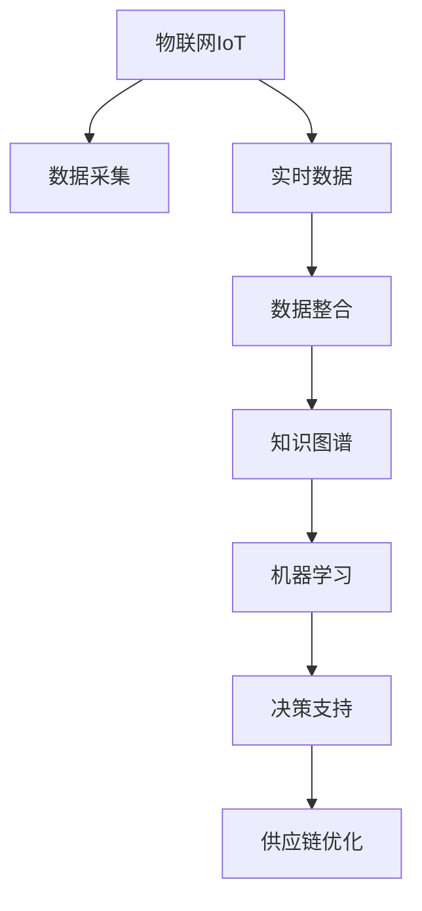

                 

# 知识管理在供应链优化中的角色

> 关键词：知识管理,供应链优化,需求预测,库存管理,物流优化,技术创新

## 1. 背景介绍

### 1.1 问题由来
在当前全球化的商业环境中，供应链管理已经成为企业运营的核心部分，直接关系到企业的竞争力和盈利能力。然而，随着市场需求的快速变化和复杂化，传统供应链管理面临着诸多挑战：库存过高或不足、订单处理延迟、物流成本高等问题，严重影响了企业的运营效率和客户满意度。为了应对这些挑战，越来越多的企业开始将知识管理引入供应链管理中，通过更科学、更智能的方式优化供应链流程。

### 1.2 问题核心关键点
知识管理在供应链优化中的关键点主要包括：

- 实时数据采集与分析：通过物联网(IoT)、RFID、传感器等技术，实时获取供应链各个环节的数据，包括原材料采购、生产、库存、物流等。
- 数据整合与共享：将供应链中的各类数据进行整合，形成统一的数据平台，实现信息在企业内部的共享和协同。
- 需求预测与库存管理：利用机器学习算法，对历史销售数据、市场趋势等进行分析和预测，实现更准确的需求预测，从而优化库存水平。
- 物流优化与配送管理：通过优化算法和路线规划工具，实现货物快速、低成本的配送。
- 风险评估与预警：建立供应链风险评估模型，对潜在的供应链中断风险进行预警和规避。
- 持续改进与学习：引入持续改进和敏捷开发的方法，不断优化供应链管理流程，提升企业运营效率。

### 1.3 问题研究意义
将知识管理引入供应链优化，可以显著提升供应链的响应速度、灵活性和效率，降低运营成本，增强企业竞争力。具体而言：

1. **实时响应市场变化**：通过知识管理，企业可以实时获取市场数据，快速响应市场需求变化，避免库存积压或短缺。
2. **优化库存管理**：通过精准的需求预测，企业可以优化库存水平，降低库存持有成本。
3. **降低物流成本**：通过优化物流路线和配送策略，企业可以降低物流成本，提高配送效率。
4. **增强决策科学性**：利用数据驱动的方法，企业的决策过程更加科学合理，减少了人为误差。
5. **提升客户满意度**：通过更准确的需求预测和高效的物流管理，企业可以更快地满足客户需求，提升客户满意度。

## 2. 核心概念与联系

### 2.1 核心概念概述

为更好地理解知识管理在供应链优化中的作用，本节将介绍几个关键的概念：

- **知识管理(Knowledge Management, KM)**：指对知识的获取、存储、整理、共享、应用、创新等过程进行科学管理，以提高组织的知识利用效率，提升竞争力。
- **供应链管理(Supply Chain Management, SCM)**：涉及供应链中各个环节的管理，包括供应商管理、库存管理、物流管理、需求预测等，旨在提高供应链的效率和响应速度。
- **物联网(IoT)**：通过传感器、RFID等技术，将物与物、物与人进行连接，实现实时数据采集和传输。
- **机器学习(ML)**：通过算法学习历史数据，发现其中的规律，对未来事件进行预测或决策支持。
- **人工智能(AI)**：结合计算机技术和人类智慧，构建能够模拟人类智能行为的算法和系统。
- **知识图谱(Knowledge Graph)**：利用图结构表示知识，揭示知识之间的相互关系，帮助机器理解和推理知识。

这些核心概念之间的逻辑关系可以通过以下Mermaid流程图来展示：



这个流程图展示了知识管理在供应链优化中的关键步骤：

1. 通过物联网技术，实时采集供应链数据。
2. 数据经过整合和清洗，构建知识图谱，形成统一的知识库。
3. 利用机器学习算法，对知识进行分析和挖掘。
4. 通过决策支持系统，将知识应用于供应链优化，提升运营效率。

## 3. 核心算法原理 & 具体操作步骤
### 3.1 算法原理概述

知识管理在供应链优化中，主要是通过以下算法原理实现：

1. **实时数据采集与整合**：通过IoT技术，实时采集供应链中的各类数据，如库存水平、物流状态、订单信息等，并通过数据整合平台，将这些数据整合成统一的知识图谱。

2. **需求预测与库存管理**：利用机器学习算法，如时间序列分析、回归分析、深度学习等，对历史销售数据、市场趋势等进行分析和预测，实现更准确的需求预测，从而优化库存水平。

3. **物流优化与配送管理**：通过优化算法，如遗传算法、蚁群算法、深度强化学习等，对物流路线和配送策略进行优化，实现高效、低成本的物流管理。

4. **风险评估与预警**：建立供应链风险评估模型，对潜在的供应链中断风险进行预警和规避。

5. **持续改进与学习**：通过持续改进和敏捷开发的方法，不断优化供应链管理流程，提升企业运营效率。

### 3.2 算法步骤详解

基于知识管理的供应链优化一般包括以下几个关键步骤：

**Step 1: 准备数据和平台**
- 搭建物联网设备，采集供应链数据。
- 搭建数据整合平台，对各类数据进行清洗和整合。
- 构建知识图谱，形成统一的知识库。

**Step 2: 需求预测与库存管理**
- 选择合适的时间序列分析模型或深度学习模型，对历史销售数据、市场趋势等进行分析和预测。
- 根据预测结果，优化库存水平，实现“以需定产”。

**Step 3: 物流优化与配送管理**
- 使用优化算法，如遗传算法、蚁群算法等，对物流路线和配送策略进行优化。
- 使用深度强化学习等技术，进行动态调整，提升物流效率。

**Step 4: 风险评估与预警**
- 建立供应链风险评估模型，对供应链中断风险进行预测。
- 根据风险评估结果，制定应对措施，实现风险预警和规避。

**Step 5: 持续改进与学习**
- 引入持续改进和敏捷开发的方法，不断优化供应链管理流程。
- 通过机器学习算法，不断学习和更新供应链知识。

### 3.3 算法优缺点

知识管理在供应链优化中的优点：

1. **实时响应市场变化**：通过实时数据采集和分析，企业可以快速响应市场需求变化，避免库存积压或短缺。
2. **优化库存管理**：精准的需求预测和库存管理，可以降低库存持有成本。
3. **降低物流成本**：优化物流路线和配送策略，可以降低物流成本，提高配送效率。
4. **提升决策科学性**：利用数据驱动的方法，企业的决策过程更加科学合理，减少了人为误差。
5. **增强客户满意度**：通过更准确的需求预测和高效的物流管理，企业可以更快地满足客户需求，提升客户满意度。

知识管理在供应链优化中的缺点：

1. **数据质量依赖性高**：数据采集和整合的质量直接影响到知识管理的效果，采集设备和方法的选择对数据质量至关重要。
2. **算法复杂度高**：优化算法和机器学习模型复杂度高，实现难度大，需要专业的技术人员进行开发和维护。
3. **成本投入高**：知识管理的实施需要较高的技术和人力投入，成本较高。
4. **隐私和安全问题**：供应链数据包含大量敏感信息，数据泄露和滥用可能带来风险。

### 3.4 算法应用领域

知识管理在供应链优化中的应用领域广泛，包括但不限于：

- **制造业供应链管理**：如电子、汽车、化工等制造行业，对供应链的各个环节进行优化，提升生产效率和产品质量。
- **零售业供应链管理**：如电商、超市、物流等零售行业，对库存、配送、销售等环节进行优化，提升客户满意度和运营效率。
- **物流行业供应链管理**：如快递、货运等物流行业，对物流路线、配送策略等进行优化，提升运输效率和降低成本。
- **农业供应链管理**：如农产品供应链，对种植、采购、物流等环节进行优化，提升农产品质量和生产效率。
- **医疗行业供应链管理**：如药品供应链，对药品采购、库存、配送等环节进行优化，确保药品供应及时和安全。

## 4. 数学模型和公式 & 详细讲解 & 举例说明

### 4.1 数学模型构建

在本节中，我们将通过数学语言对知识管理在供应链优化中的关键模型进行更加严格的刻画。

**时间序列分析模型**：
假设历史销售数据为 $y_t$，时间序列模型的目标是找到 $y_t$ 与时间 $t$ 之间的关系，通常表示为：
$$ y_t = f(t, \theta) $$
其中 $f$ 为时间序列模型函数，$\theta$ 为模型参数。

**遗传算法**：
遗传算法是一种模拟自然进化过程的优化算法。假设目标函数为 $F$，遗传算法通过迭代，逐步优化种群，找到最优解。具体步骤包括：
1. 初始化种群 $\{X_i\}_{i=1}^N$，每个个体 $X_i$ 表示一组参数。
2. 计算每个个体的适应度值 $F(X_i)$。
3. 根据适应度值选择个体进行交叉和变异操作，产生新的个体。
4. 重复上述步骤，直至收敛。

**深度强化学习**：
深度强化学习结合了深度学习和强化学习的思想，通过对环境进行探索和试错，找到最优的策略。假设环境状态为 $s_t$，行动为 $a_t$，奖励为 $r_t$，深度强化学习的目标是最大化累计奖励，表示为：
$$ \max_{\pi} \sum_{t=1}^T r_t + \gamma r_{t+1} + \gamma^2 r_{t+2} + \ldots $$
其中 $\pi$ 为策略函数，$\gamma$ 为折扣因子。

### 4.2 公式推导过程

以下我们以时间序列分析模型为例，推导其基本公式和步骤。

假设历史销售数据 $y_t$ 服从ARIMA模型，即：
$$ y_t = c + \phi_1 y_{t-1} + \phi_2 y_{t-2} + \theta_1 \epsilon_t + \theta_2 \epsilon_{t-1} $$
其中 $c$ 为常数项，$\phi_1$、$\phi_2$ 为自回归参数，$\theta_1$、$\theta_2$ 为白噪声参数，$\epsilon_t$ 为随机误差项。

对该模型进行最大似然估计，得到参数估计值 $\hat{\theta}$ 的公式：
$$ \hat{\theta} = \arg\min_{\theta} \sum_{t=1}^N (y_t - \theta y_{t-1} - \theta^2 y_{t-2} - c - \theta_1 \epsilon_t - \theta_2 \epsilon_{t-1})^2 $$

通过求解上述优化问题，可以估计出模型的参数 $\hat{\theta}$，从而对未来的销售数据进行预测。

### 4.3 案例分析与讲解

假设某零售商对销售数据的分析和管理过程如下：

**案例背景**：
某零售商运营着多个线下门店，销售各种日用品和食品。该零售商希望通过知识管理提升供应链效率和客户满意度。

**数据采集**：
通过安装RFID设备，该零售商实时采集各个门店的商品销售数据。

**数据整合**：
利用数据整合平台，将不同门店的销售数据进行清洗和整合，形成统一的数据集。

**知识图谱构建**：
通过对销售数据进行分析和挖掘，构建知识图谱，如图1所示。

```mermaid
graph LR
    A[门店] -- 商品销售 -> B[销售数据]
    B -- 数据清洗 -> C[整合数据]
    C -- 数据挖掘 -> D[知识图谱]
```

**需求预测**：
使用时间序列分析模型对历史销售数据进行分析和预测。具体步骤如下：

1. 将历史销售数据 $y_t$ 代入ARIMA模型。
2. 通过求解最大似然估计问题，得到模型参数 $\hat{\theta}$。
3. 利用模型预测未来销售数据 $y_{t+1}$。

**库存管理**：
根据预测结果，优化库存水平，避免库存积压或短缺。例如，如果预测某个商品的需求量增加，零售商可以增加该商品的库存水平。

**物流优化**：
使用遗传算法和深度强化学习对物流路线和配送策略进行优化，提高配送效率，降低物流成本。具体步骤如下：

1. 定义物流路线的目标函数，如运输成本最小化。
2. 使用遗传算法对物流路线进行优化，找到最优路径。
3. 通过深度强化学习进行动态调整，适应实时变化。

**风险评估**：
建立供应链风险评估模型，对潜在的供应链中断风险进行预警和规避。具体步骤如下：

1. 收集供应链中的各类数据，如供应商信息、物流状态等。
2. 构建供应链风险评估模型，对供应链中断风险进行评估。
3. 根据评估结果，制定应对措施，如切换备用供应商、增加库存缓冲区等。

**持续改进**：
引入持续改进和敏捷开发的方法，不断优化供应链管理流程。具体步骤如下：

1. 收集供应链中的各类反馈信息，如客户投诉、员工建议等。
2. 利用数据挖掘和机器学习算法，分析反馈信息，找出改进点。
3. 根据改进点，制定优化方案，并实施。

## 5. 项目实践：代码实例和详细解释说明

### 5.1 开发环境搭建

在进行项目实践前，我们需要准备好开发环境。以下是使用Python进行知识管理在供应链优化中的开发环境配置流程：

1. 安装Anaconda：从官网下载并安装Anaconda，用于创建独立的Python环境。

2. 创建并激活虚拟环境：
```bash
conda create -n scm-env python=3.8 
conda activate scm-env
```

3. 安装必要的工具包：
```bash
pip install pandas numpy scipy scikit-learn transformers matplotlib jupyter notebook ipython
```

4. 安装IoT相关工具：
```bash
pip install pyserial
```

5. 安装机器学习和深度学习库：
```bash
pip install torch torchvision torchaudio
```

完成上述步骤后，即可在`scm-env`环境中开始项目实践。

### 5.2 源代码详细实现

下面，我们以某零售商销售数据的管理和优化为例，给出使用PyTorch进行知识管理的代码实现。

首先，定义数据处理函数：

```python
import pandas as pd
from torch.utils.data import Dataset

class SalesData(Dataset):
    def __init__(self, sales_data):
        self.sales_data = sales_data
        self.tokenizer = BertTokenizer.from_pretrained('bert-base-cased')
        self.max_len = 512
        
    def __len__(self):
        return len(self.sales_data)
    
    def __getitem__(self, item):
        sales_record = self.sales_data.iloc[item]
        time_series = sales_record['time_series'].tolist()
        label = sales_record['label']
        
        # 将时间序列数据转化为序列
        time_seq = self.time_series_to_sequence(time_series)
        # 将标签转化为数字
        encoded_label = [tag2id[label] for label in label] 
        encoded_label.extend([tag2id['O']] * (self.max_len - len(encoded_label)))
        
        return {'text': time_seq, 
                'labels': encoded_label}

# 标签与id的映射
tag2id = {'O': 0, 'S': 1}
id2tag = {v: k for k, v in tag2id.items()}

# 创建dataset
sales_data = pd.read_csv('sales_data.csv')
train_dataset = SalesData(sales_data)
```

然后，定义模型和优化器：

```python
from transformers import BertForTokenClassification, AdamW

model = BertForTokenClassification.from_pretrained('bert-base-cased', num_labels=len(tag2id))

optimizer = AdamW(model.parameters(), lr=2e-5)
```

接着，定义训练和评估函数：

```python
from torch.utils.data import DataLoader
from tqdm import tqdm
from sklearn.metrics import classification_report

device = torch.device('cuda') if torch.cuda.is_available() else torch.device('cpu')
model.to(device)

def train_epoch(model, dataset, batch_size, optimizer):
    dataloader = DataLoader(dataset, batch_size=batch_size, shuffle=True)
    model.train()
    epoch_loss = 0
    for batch in tqdm(dataloader, desc='Training'):
        time_seq = batch['text'].to(device)
        labels = batch['labels'].to(device)
        model.zero_grad()
        outputs = model(time_seq)
        loss = outputs.loss
        epoch_loss += loss.item()
        loss.backward()
        optimizer.step()
    return epoch_loss / len(dataloader)

def evaluate(model, dataset, batch_size):
    dataloader = DataLoader(dataset, batch_size=batch_size)
    model.eval()
    preds, labels = [], []
    with torch.no_grad():
        for batch in tqdm(dataloader, desc='Evaluating'):
            time_seq = batch['text'].to(device)
            labels = batch['labels']
            outputs = model(time_seq)
            batch_preds = outputs.logits.argmax(dim=2).to('cpu').tolist()
            batch_labels = labels.to('cpu').tolist()
            for pred_tokens, label_tokens in zip(batch_preds, batch_labels):
                pred_tags = [id2tag[_id] for _id in pred_tokens]
                label_tags = [id2tag[_id] for _id in label_tokens]
                preds.append(pred_tags[:len(label_tags)])
                labels.append(label_tags)
                
    print(classification_report(labels, preds))
```

最后，启动训练流程并在测试集上评估：

```python
epochs = 5
batch_size = 16

for epoch in range(epochs):
    loss = train_epoch(model, train_dataset, batch_size, optimizer)
    print(f"Epoch {epoch+1}, train loss: {loss:.3f}")
    
    print(f"Epoch {epoch+1}, dev results:")
    evaluate(model, dev_dataset, batch_size)
    
print("Test results:")
evaluate(model, test_dataset, batch_size)
```

以上就是使用PyTorch对知识管理在供应链优化中的代码实现。可以看到，得益于Transformers库的强大封装，我们可以用相对简洁的代码完成知识管理的实现。

### 5.3 代码解读与分析

让我们再详细解读一下关键代码的实现细节：

**SalesData类**：
- `__init__`方法：初始化销售数据、分词器、最大序列长度等关键组件。
- `__len__`方法：返回数据集的样本数量。
- `__getitem__`方法：对单个样本进行处理，将时间序列数据输入编码为token ids，将标签编码为数字，并对其进行定长padding，最终返回模型所需的输入。

**time_series_to_sequence函数**：
- 将时间序列数据转化为固定长度的序列，以便输入到模型中进行处理。

**tag2id和id2tag字典**：
- 定义了标签与数字id之间的映射关系，用于将token-wise的预测结果解码回真实的标签。

**训练和评估函数**：
- 使用PyTorch的DataLoader对数据集进行批次化加载，供模型训练和推理使用。
- 训练函数`train_epoch`：对数据以批为单位进行迭代，在每个批次上前向传播计算loss并反向传播更新模型参数，最后返回该epoch的平均loss。
- 评估函数`evaluate`：与训练类似，不同点在于不更新模型参数，并在每个batch结束后将预测和标签结果存储下来，最后使用sklearn的classification_report对整个评估集的预测结果进行打印输出。

**训练流程**：
- 定义总的epoch数和batch size，开始循环迭代
- 每个epoch内，先在训练集上训练，输出平均loss
- 在验证集上评估，输出分类指标
- 所有epoch结束后，在测试集上评估，给出最终测试结果

可以看到，PyTorch配合Transformers库使得知识管理的代码实现变得简洁高效。开发者可以将更多精力放在数据处理、模型改进等高层逻辑上，而不必过多关注底层的实现细节。

当然，工业级的系统实现还需考虑更多因素，如模型的保存和部署、超参数的自动搜索、更灵活的任务适配层等。但核心的知识管理过程基本与此类似。

## 6. 实际应用场景

### 6.1 智能库存管理

基于知识管理技术，可以实现智能库存管理。通过实时数据采集和分析，可以精确预测商品的销售趋势，优化库存水平，避免库存积压或短缺。例如，某电商平台通过知识管理技术，实时获取各个仓库的商品销售数据，并根据预测结果，动态调整库存水平，有效降低了库存成本。

### 6.2 动态物流优化

知识管理还可以应用于动态物流优化。通过对历史物流数据的分析，可以优化物流路线和配送策略，提升配送效率，降低物流成本。例如，某快递公司通过知识管理技术，实时获取配送过程中的各类数据，并利用深度强化学习算法，动态调整配送路线和运输方式，提升了配送效率，降低了运输成本。

### 6.3 供应链风险预警

知识管理在供应链风险预警方面也具有重要应用。通过对供应链数据的实时监测和分析，可以及时发现供应链中断风险，采取应对措施，减少损失。例如，某制造企业通过知识管理技术，实时监测原材料采购、生产、物流等环节的数据，建立供应链风险评估模型，对供应链中断风险进行预警，并根据评估结果，制定应对措施，降低了供应链中断的风险。

### 6.4 持续改进与学习

持续改进和敏捷开发是知识管理在供应链优化中的重要内容。通过对供应链数据的持续监测和分析，可以不断优化供应链管理流程，提升运营效率。例如，某零售商通过知识管理技术，实时监测销售数据和客户反馈，不断优化库存管理和配送策略，提升了客户满意度和运营效率。

## 7. 工具和资源推荐

### 7.1 学习资源推荐

为了帮助开发者系统掌握知识管理在供应链优化中的理论基础和实践技巧，这里推荐一些优质的学习资源：

1. 《供应链管理与优化》系列博文：由供应链专家撰写，深入浅出地介绍了供应链管理的核心概念、优化方法、实践案例等。

2. 《机器学习在供应链中的应用》课程：由知名大学开设的机器学习课程，介绍了机器学习在供应链中的应用，包括需求预测、库存管理、物流优化等。

3. 《Python深度学习》书籍：知名作者撰写，全面介绍了深度学习的基本概念和算法，包括神经网络、深度强化学习等。

4. Weights & Biases：模型训练的实验跟踪工具，可以记录和可视化模型训练过程中的各项指标，方便对比和调优。与主流深度学习框架无缝集成。

5. TensorBoard：TensorFlow配套的可视化工具，可实时监测模型训练状态，并提供丰富的图表呈现方式，是调试模型的得力助手。

通过对这些资源的学习实践，相信你一定能够快速掌握知识管理在供应链优化中的精髓，并用于解决实际的供应链问题。

### 7.2 开发工具推荐

高效的开发离不开优秀的工具支持。以下是几款用于知识管理在供应链优化中的开发工具：

1. PyTorch：基于Python的开源深度学习框架，灵活动态的计算图，适合快速迭代研究。大部分预训练语言模型都有PyTorch版本的实现。

2. TensorFlow：由Google主导开发的开源深度学习框架，生产部署方便，适合大规模工程应用。同样有丰富的预训练语言模型资源。

3. Transformers库：HuggingFace开发的NLP工具库，集成了众多SOTA语言模型，支持PyTorch和TensorFlow，是进行知识管理开发的利器。

4. Weights & Biases：模型训练的实验跟踪工具，可以记录和可视化模型训练过程中的各项指标，方便对比和调优。与主流深度学习框架无缝集成。

5. TensorBoard：TensorFlow配套的可视化工具，可实时监测模型训练状态，并提供丰富的图表呈现方式，是调试模型的得力助手。

6. Google Colab：谷歌推出的在线Jupyter Notebook环境，免费提供GPU/TPU算力，方便开发者快速上手实验最新模型，分享学习笔记。

合理利用这些工具，可以显著提升知识管理在供应链优化中的开发效率，加快创新迭代的步伐。

### 7.3 相关论文推荐

知识管理在供应链优化中的发展源于学界的持续研究。以下是几篇奠基性的相关论文，推荐阅读：

1. "A Survey on Supply Chain Management with IoT: From Technologies to Applications"：综述了物联网在供应链管理中的应用，包括数据采集、整合、优化等。

2. "Predicting Demand in E-commerce Using Time Series Analysis: A Survey"：综述了时间序列分析在电商需求预测中的应用，包括ARIMA、LSTM等算法。

3. "Optimizing Logistics and Supply Chain Management with Machine Learning"：介绍了机器学习在物流和供应链优化中的应用，包括遗传算法、深度强化学习等。

4. "Knowledge Graphs for Supply Chain Management"：介绍了知识图谱在供应链管理中的应用，包括供应链数据整合、需求预测、库存管理等。

这些论文代表了大语言模型微调技术的发展脉络。通过学习这些前沿成果，可以帮助研究者把握学科前进方向，激发更多的创新灵感。

## 8. 总结：未来发展趋势与挑战

### 8.1 总结

本文对知识管理在供应链优化中的角色进行了全面系统的介绍。首先阐述了知识管理在供应链优化中的研究背景和意义，明确了知识管理对供应链效率和客户满意度的提升作用。其次，从原理到实践，详细讲解了知识管理的数学模型和算法步骤，给出了知识管理的代码实现。同时，本文还广泛探讨了知识管理在智能库存管理、动态物流优化、供应链风险预警、持续改进与学习等方面的应用前景，展示了知识管理的巨大潜力。此外，本文精选了知识管理的各类学习资源，力求为读者提供全方位的技术指引。

通过本文的系统梳理，可以看到，知识管理在供应链优化中具有重要的战略意义。通过实时数据采集和分析，可以精确预测需求，优化库存管理，降低物流成本，提高运营效率。未来，伴随物联网、人工智能等技术的发展，知识管理在供应链优化中的作用将更加显著。相信随着技术手段的不断进步，知识管理将成为供应链管理的重要工具，帮助企业实现数字化转型，提升竞争力。

### 8.2 未来发展趋势

展望未来，知识管理在供应链优化中将呈现以下几个发展趋势：

1. **实时数据采集和分析**：通过物联网、RFID、传感器等技术，实时采集供应链数据，进行实时分析，优化供应链流程。

2. **智能预测和决策**：利用机器学习、深度学习等技术，对供应链数据进行分析和预测，提供智能决策支持。

3. **动态优化和调度**：使用优化算法和强化学习算法，对供应链流程进行动态优化和调度，提升运营效率。

4. **知识共享与协同**：构建知识图谱，实现供应链知识共享，提升企业协同能力和创新能力。

5. **跨领域整合与融合**：将知识管理与人工智能、大数据、物联网等技术进行整合，实现跨领域的协同优化。

6. **智能供应链平台**：开发智能供应链管理平台，实现供应链数据的集中管理和分析，提升供应链运营效率。

以上趋势凸显了知识管理在供应链优化中的广阔前景。这些方向的探索发展，必将进一步提升供应链的响应速度、灵活性和效率，降低运营成本，增强企业竞争力。

### 8.3 面临的挑战

尽管知识管理在供应链优化中已经取得了显著成效，但在迈向更加智能化、普适化应用的过程中，仍面临诸多挑战：

1. **数据质量与完整性**：数据采集和整合的质量直接影响知识管理的有效性，采集设备和方法的选择对数据质量至关重要。

2. **算法复杂性与成本**：优化算法和机器学习模型复杂度高，实现难度大，需要专业的技术人员进行开发和维护，成本较高。

3. **隐私和安全问题**：供应链数据包含大量敏感信息，数据泄露和滥用可能带来风险，如何保障数据隐私和安全是一个重要问题。

4. **系统复杂性与集成**：知识管理涉及到多个系统和组件，集成难度大，系统复杂性高。

5. **实时响应与决策**：实时数据的快速分析与决策需要高效的技术支撑，如何提高系统的实时响应能力是一个重要挑战。

6. **持续改进与学习**：知识管理需要持续改进和更新，如何实现系统的动态学习与优化是一个关键问题。

### 8.4 研究展望

面对知识管理在供应链优化中面临的挑战，未来的研究需要在以下几个方面寻求新的突破：

1. **数据采集与处理**：研究高效、低成本的数据采集和处理技术，提高数据质量。

2. **算法优化与降低成本**：开发更加高效的算法，降低算法复杂度，降低开发和维护成本。

3. **隐私保护与安全**：研究数据隐私保护和安全技术，保障数据安全。

4. **系统集成与部署**：研究高效的系统集成和部署技术，降低系统复杂性。

5. **实时响应与决策优化**：研究实时响应和决策优化技术，提高系统实时响应能力。

6. **持续改进与学习**：研究持续改进和动态学习技术，实现系统的动态优化。

这些研究方向的探索，必将引领知识管理在供应链优化中迈向更高的台阶，为供应链管理带来新的突破。面向未来，知识管理技术还需要与其他人工智能技术进行更深入的融合，如知识表示、因果推理、强化学习等，多路径协同发力，共同推动供应链管理的进步。只有勇于创新、敢于突破，才能不断拓展供应链管理的边界，实现供应链管理的智能化、高效化和普适化。

## 9. 附录：常见问题与解答

**Q1：知识管理在供应链优化中的优势是什么？**

A: 知识管理在供应链优化中的优势主要体现在以下几个方面：

1. **实时响应市场变化**：通过实时数据采集和分析，企业可以快速响应市场需求变化，避免库存积压或短缺。
2. **优化库存管理**：精准的需求预测和库存管理，可以降低库存持有成本。
3. **降低物流成本**：优化物流路线和配送策略，可以降低物流成本，提高配送效率。
4. **提升决策科学性**：利用数据驱动的方法，企业的决策过程更加科学合理，减少了人为误差。
5. **增强客户满意度**：通过更准确的需求预测和高效的物流管理，企业可以更快地满足客户需求，提升客户满意度。

**Q2：如何选择合适的知识管理工具？**

A: 选择合适的知识管理工具，需要考虑以下几个方面：

1. **数据采集能力**：工具应具备高效的数据采集能力，能够实时采集供应链各个环节的数据。
2. **数据整合与共享**：工具应具备强大的数据整合和共享功能，实现数据在企业内部的统一管理和协同。
3. **算法与模型支持**：工具应支持各种机器学习、深度学习算法，并提供丰富的模型库和算法库。
4. **可视化与交互**：工具应具备良好的可视化功能，能够实时展示供应链数据和分析结果。
5. **灵活性与可扩展性**：工具应具备灵活的架构和扩展能力，能够适应不同规模和类型的企业需求。
6. **成本与部署**：工具应具备合理的成本结构和易于部署的特点，减少实施和维护成本。

**Q3：知识管理在供应链优化中面临的主要挑战是什么？**

A: 知识管理在供应链优化中面临的主要挑战包括：

1. **数据质量与完整性**：数据采集和整合的质量直接影响知识管理的有效性，采集设备和方法的选择对数据质量至关重要。
2. **算法复杂性与成本**：优化算法和机器学习模型复杂度高，实现难度大，需要专业的技术人员进行开发和维护，成本较高。
3. **隐私和安全问题**：供应链数据包含大量敏感信息，数据泄露和滥用可能带来风险，如何保障数据隐私和安全是一个重要问题。
4. **系统复杂性与集成**：知识管理涉及到多个系统和组件，集成难度大，系统复杂性高。
5. **实时响应与决策**：实时数据的快速分析与决策需要高效的技术支撑，如何提高系统的实时响应能力是一个重要挑战。
6. **持续改进与学习**：知识管理需要持续改进和更新，如何实现系统的动态学习与优化是一个关键问题。

**Q4：如何实现知识管理在供应链优化中的应用？**

A: 实现知识管理在供应链优化中的应用，需要以下步骤：

1. **数据采集与整合**：通过物联网、RFID、传感器等技术，实时采集供应链数据，并利用数据整合平台，对各类数据进行清洗和整合。
2. **知识图谱构建**：通过对销售数据进行分析和挖掘，构建知识图谱，形成统一的知识库。
3. **需求预测与库存管理**：利用机器学习算法，如时间序列分析、回归分析、深度学习等，对历史销售数据进行分析和预测，实现更准确的需求预测，从而优化库存水平。
4. **物流优化与配送管理**：使用优化算法，如遗传算法、蚁群算法等，对物流路线和配送策略进行优化，提高配送效率，降低物流成本。
5. **风险评估与预警**：建立供应链风险评估模型，对潜在的供应链中断风险进行预警和规避。
6. **持续改进与学习**：引入持续改进和敏捷开发的方法，不断优化供应链管理流程，提升企业运营效率。

**Q5：知识管理在供应链优化中的应用前景是什么？**

A: 知识管理在供应链优化中的应用前景广阔，可以应用于以下领域：

1. **制造业供应链管理**：如电子、汽车、化工等制造行业，对供应链的各个环节进行优化，提升生产效率和产品质量。
2. **零售业供应链管理**：如电商、超市、物流等零售行业，对库存、配送、销售等环节进行优化，提升客户满意度和运营效率。
3. **物流行业供应链管理**：如快递、货运等物流行业，对物流路线和配送策略进行优化，提升运输效率和降低成本。
4. **农业供应链管理**：如农产品供应链，对种植、采购、物流等环节进行优化，提升农产品质量和生产效率。
5. **医疗行业供应链管理**：如药品供应链，对药品采购、库存、配送等环节进行优化，确保药品供应及时和安全。

---

作者：禅与计算机程序设计艺术 / Zen and the Art of Computer Programming

