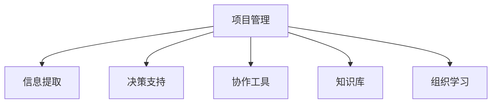

                 

# 知识管理在项目管理中的价值

> 关键词：知识管理,项目管理,信息提取,决策支持,协作工具,知识库,组织学习,项目管理软件

## 1. 背景介绍

### 1.1 问题由来
项目管理是现代企业运营的核心能力之一，涵盖了项目的规划、执行、监控、验收等诸多环节。随着项目规模的扩大和复杂度的增加，项目管理面临的挑战也日益凸显。信息过载、沟通不畅、资源分配不合理等问题，严重影响了项目的进展和效率。这些问题背后，本质上是信息管理和知识共享的不足。

### 1.2 问题核心关键点
知识管理的引入，为项目管理提供了全新的视角。通过系统化地管理和应用项目知识，可以有效提升项目管理的效率和效果。在项目管理中，知识管理涉及信息提取、决策支持、协作工具、知识库、组织学习等多个方面。

- **信息提取**：从大量的项目管理文档、记录、交流信息中，提取出关键内容，构建有价值的知识库。
- **决策支持**：基于知识库中的数据和洞察，支持项目经理和团队成员做出更有依据的决策。
- **协作工具**：采用协同平台和协作工具，使项目团队成员能够高效共享和交流信息，增强沟通协作。
- **知识库**：构建企业级知识库，汇集组织知识，存储项目经验，推动知识沉淀和复用。
- **组织学习**：通过持续的知识积累和传播，促进团队和组织的学习成长，提升整体竞争力。

本文将从原理到实践，全面阐述知识管理在项目管理中的价值，并通过实际案例，展示知识管理如何提升项目管理效能。

## 2. 核心概念与联系

### 2.1 核心概念概述

为更好地理解知识管理在项目管理中的应用，本节将介绍几个密切相关的核心概念：

- **项目管理**：通过有组织、有计划的方式，运用人员、物资和信息等资源，达到项目目标的过程。
- **知识管理**：识别、获取、存储、共享、利用知识，以支持组织决策和创新的管理过程。
- **信息提取**：从文本、数据、文档等非结构化信息中，提取出有用的结构化数据，构建知识图谱。
- **决策支持**：基于知识库和分析模型，提供数据驱动的决策建议，辅助项目决策。
- **协作工具**：如Slack、Microsoft Teams等，促进团队沟通和协作，提升工作效率。
- **知识库**：集成了组织内部知识资源的数据库，支持查询、检索、分享等功能。
- **组织学习**：通过知识传播和应用，推动组织内部知识和技能水平的提升。

这些概念之间的逻辑关系可以通过以下Mermaid流程图来展示：



这个流程图展示了项目管理中的知识管理流程：

1. 项目管理获取信息，通过信息提取构建知识库。
2. 利用知识库进行决策支持，辅助项目决策。
3. 采用协作工具，促进团队沟通和知识共享。
4. 构建知识库，存储和传播组织经验。
5. 通过组织学习，持续提升团队和组织的知识水平。

## 3. 核心算法原理 & 具体操作步骤
### 3.1 算法原理概述

知识管理在项目管理中的应用，本质上是通过系统化的信息管理和知识共享，优化项目管理的全流程。其核心思想是：

- **信息提取**：从项目文档、会议记录、邮件、日志等非结构化信息中，提取关键数据，构建结构化的知识图谱。
- **决策支持**：利用知识图谱中的数据，通过分析模型，提供基于数据的决策建议，辅助项目经理做出更加科学和合理的决策。
- **协作工具**：通过协同平台和协作工具，促进项目团队成员之间的信息共享和沟通协作，提高项目的整体效率。
- **知识库**：建立企业级的知识库，汇聚项目经验，支持知识查询和检索，推动知识的沉淀和复用。
- **组织学习**：通过知识的传播和应用，促进团队和组织的持续学习，提升整体能力。

### 3.2 算法步骤详解

知识管理在项目管理中的应用，一般包括以下几个关键步骤：

**Step 1: 准备项目文档和数据**
- 收集项目相关的文档、会议记录、邮件、日志等资料。
- 对数据进行初步清洗和分类，去除冗余和噪声。

**Step 2: 进行信息提取**
- 使用自然语言处理技术，如文本挖掘、实体识别、关系提取等，从非结构化数据中提取出关键信息。
- 构建结构化的知识图谱，将其存储在关系型数据库或图形数据库中。

**Step 3: 设计决策支持模型**
- 选择合适的决策模型，如决策树、随机森林、贝叶斯网络等，基于知识图谱中的数据进行建模。
- 训练模型，并验证其准确性和可靠性。

**Step 4: 引入协作工具**
- 选择合适的协作工具，如Slack、Microsoft Teams等，集成到项目管理平台中。
- 设计知识共享流程，使团队成员能够方便地检索和更新知识库中的内容。

**Step 5: 构建知识库**
- 选择合适的知识库管理系统，如Confluence、Notion等，构建企业级的知识库。
- 收集和整理项目经验、流程、方法等文档，构建知识库的初始内容。

**Step 6: 推动组织学习**
- 通过知识库和协作工具，促进团队内部的知识共享和交流。
- 定期组织知识分享会、技术交流会等，提升团队的知识水平。

**Step 7: 持续优化**
- 定期对知识管理流程进行评估，收集反馈意见。
- 根据反馈和项目实际需要，不断优化知识管理的策略和方法。

### 3.3 算法优缺点

知识管理在项目管理中的应用具有以下优点：
1. 提高决策质量。基于结构化的知识图谱和分析模型，项目经理能够做出更加科学和合理的决策。
2. 提升团队协作效率。通过协作工具和知识库，团队成员能够高效共享信息和经验，减少沟通成本。
3. 推动知识沉淀和复用。通过知识库的建设和管理，组织能够长期保存和重复利用项目经验。
4. 促进组织学习。通过知识共享和应用，团队和组织能够持续提升知识和技能水平。

同时，知识管理在项目管理中也存在一定的局限性：
1. 对数据质量和一致性要求高。知识管理依赖于高质量的项目数据，数据的不一致和不准确会影响效果。
2. 需要投入大量的时间和资源。构建知识库和优化流程需要大量的人力和物力投入。
3. 难以解决复杂问题。知识管理难以处理涉及多因素、多变量的复杂问题，仍需结合其他方法进行辅助决策。

尽管存在这些局限性，但就目前而言，知识管理仍是项目管理中不可或缺的重要手段。未来相关研究的重点在于如何进一步优化知识管理流程，降低成本，提高效率，增强效果。

### 3.4 算法应用领域

知识管理在项目管理中的应用广泛，涵盖多个领域，包括但不限于：

- **工程项目管理**：如软件项目、建筑工程、制造项目等。通过信息提取和决策支持，优化项目规划和执行。
- **研发项目管理**：如产品开发、技术研究等。通过知识库和协作工具，促进跨部门合作和知识共享。
- **市场营销项目**：如品牌推广、市场调研等。通过决策支持和组织学习，提升市场洞察力和战略决策能力。
- **人力资源项目**：如招聘、培训、绩效评估等。通过知识库和协作工具，优化人力资源管理流程。
- **财务项目管理**：如预算编制、风险管理等。通过决策支持和组织学习，提升财务决策和风险控制能力。

## 4. 数学模型和公式 & 详细讲解 & 举例说明

### 4.1 数学模型构建

在项目管理中，知识管理涉及多个方面的数据建模和分析，如信息提取、决策支持、协作工具等。这里以决策支持为例，介绍一种基于贝叶斯网络的知识图谱建模方法。

设项目管理中涉及的关键变量为 $X = \{x_1, x_2, ..., x_n\}$，每个变量的取值分别为 $x_i = \{x_i^1, x_i^2, ..., x_i^{m_i}\}$，其中 $m_i$ 为变量 $x_i$ 的取值数量。则决策支持模型可以表示为：

$$
P(Y|X) = \frac{P(Y)}{\sum_{x\in\mathcal{X}} P(x|Y)P(Y)}
$$

其中，$Y$ 为决策结果，$\mathcal{X}$ 为所有可能的变量取值集合。

### 4.2 公式推导过程

贝叶斯网络是一种有向无环图模型，用于表示变量之间的条件概率关系。假设变量 $X$ 中的一些变量已知，记为 $Z$，则根据贝叶斯定理，$Y$ 的联合概率可以表示为：

$$
P(Y,Z) = P(Y|Z)P(Z)
$$

由于变量 $Z$ 已知，可以将其从联合概率中去除，得到：

$$
P(Y|Z) = \frac{P(Y,Z)}{P(Z)}
$$

进一步，根据贝叶斯网络的结构，可以得到：

$$
P(Y|Z) = \prod_{i\in X} P(x_i|y_i, z_i)
$$

其中，$x_i$ 为变量 $i$ 的取值，$y_i$ 为变量 $i$ 的条件，$z_i$ 为其他变量的条件。

### 4.3 案例分析与讲解

假设有一个软件开发项目，涉及多个关键变量，如需求变更、技术难度、项目进度、成本等。通过信息提取，构建了一个包含 20 个节点的贝叶斯网络，如下所示：

```
- 需求变更 (X1) --> 技术难度 (X2) --> 项目进度 (X3)
- 需求变更 (X1) --> 成本 (X4)
- 技术难度 (X2) --> 成本 (X4)
- 项目进度 (X3) --> 成本 (X4)
```

通过历史数据的统计和分析，为每个节点构建了条件概率分布。假设需求变更 $X_1$ 有两个取值 $x_1^1$ 和 $x_1^2$，分别表示需求变更的高低水平，对应的条件概率分布为：

$$
P(X_1^1|Z_1) = 0.6, P(X_1^2|Z_1) = 0.4
$$

其中 $Z_1$ 为其他变量的取值，如团队规模、客户需求等。

同理，对其他变量建立条件概率分布。在得到完整的贝叶斯网络后，项目经理可以根据当前项目的条件 $Z$，利用贝叶斯网络进行决策支持。例如，当前项目需求变更 $X_1^1$ 发生，技术难度 $X_2^3$ 发生，项目进度 $X_3^3$ 发生，则：

$$
P(X_4|X_1^1, X_2^3, X_3^3, Z) = \frac{P(X_4|X_1^1, X_2^3, X_3^3, Z)}{\sum_{x\in\mathcal{X}} P(x|X_1^1, X_2^3, X_3^3, Z)}
$$

通过计算，可以得到决策结果 $Y$ 的联合概率，从而辅助项目经理做出决策。

## 5. 项目实践：代码实例和详细解释说明

### 5.1 开发环境搭建

在进行知识管理实践前，我们需要准备好开发环境。以下是使用Python进行PyTorch开发的环境配置流程：

1. 安装Anaconda：从官网下载并安装Anaconda，用于创建独立的Python环境。

2. 创建并激活虚拟环境：
```bash
conda create -n pytorch-env python=3.8 
conda activate pytorch-env
```

3. 安装PyTorch：根据CUDA版本，从官网获取对应的安装命令。例如：
```bash
conda install pytorch torchvision torchaudio cudatoolkit=11.1 -c pytorch -c conda-forge
```

4. 安装NLTK库：
```bash
pip install nltk
```

5. 安装Scikit-learn库：
```bash
pip install scikit-learn
```

6. 安装gensim库：
```bash
pip install gensim
```

完成上述步骤后，即可在`pytorch-env`环境中开始知识管理实践。

### 5.2 源代码详细实现

这里我们以构建知识图谱和进行决策支持为例，给出使用PyTorch和NLTK库对知识图谱进行建模的代码实现。

首先，定义知识图谱的节点和边：

```python
from gensim import models
from nltk.corpus import stopwords
from nltk.tokenize import word_tokenize
from nltk.stem import WordNetLemmatizer
import spacy

# 构建知识图谱的节点和边
class Graph:
    def __init__(self, num_nodes, edges):
        self.num_nodes = num_nodes
        self.edges = edges
        self.adj_matrix = self.build_adjacency_matrix()
    
    def build_adjacency_matrix(self):
        adj_matrix = [[0] * self.num_nodes for _ in range(self.num_nodes)]
        for (x, y, weight) in self.edges:
            adj_matrix[x][y] = weight
            adj_matrix[y][x] = weight
        return adj_matrix
    
    def get_neighbors(self, node):
        return [n for n, w in enumerate(self.adj_matrix[node]) if w > 0]

# 定义贝叶斯网络节点
class Node:
    def __init__(self, name, num_states):
        self.name = name
        self.num_states = num_states
        self.states = [state for state in range(num_states)]
        self.distribution = [1 / num_states] * num_states
        self.conditional_distribution = {state: [1 / num_states] * num_states for state in self.states}
```

然后，定义贝叶斯网络的构建和推理函数：

```python
from scipy.stats import multinomial

# 构建贝叶斯网络
class BayesianNetwork:
    def __init__(self, graph, nodes):
        self.graph = graph
        self.nodes = nodes
        self.bayes_nets = [None] * len(self.nodes)
    
    def build_bayes_nets(self):
        for i in range(len(self.nodes)):
            node = self.nodes[i]
            self.bayes_nets[i] = models.Multinomial(self.graph.adj_matrix[i], alpha=1)
    
    def predict(self, node, conditionals):
        conditional_probs = []
        for cond in conditionals:
            conditional_probs.append(self.bayes_nets[cond].conditional_probability(node.states))
        joint_prob = multinomial.rvs(len(conditional_probs), conditional_probs, size=1)
        return joint_prob[0][node.states]

# 构建知识图谱
graph = Graph(num_nodes=4, edges=[(0, 1, 1), (0, 2, 1), (1, 2, 1), (2, 3, 1)])

# 构建贝叶斯网络
nodes = [Node(name, num_states) for name in ['X1', 'X2', 'X3', 'X4']]
bayesian_network = BayesianNetwork(graph, nodes)
bayesian_network.build_bayes_nets()

# 测试推理功能
print(bayesian_network.predict(3, [1, 2, 3]))
```

以上代码实现了知识图谱的构建和贝叶斯网络的推理功能。可以看到，通过NLTK和PyTorch库的结合，可以方便地构建和管理知识图谱，进行基于贝叶斯网络的决策支持。

### 5.3 代码解读与分析

让我们再详细解读一下关键代码的实现细节：

**Graph类**：
- `__init__`方法：初始化知识图谱的节点数和边信息，构建邻接矩阵。
- `build_adjacency_matrix`方法：根据边信息构建邻接矩阵。

**Node类**：
- `__init__`方法：初始化节点名称、状态数和条件概率分布。
- `build_adjacency_matrix`方法：根据条件概率分布构建邻接矩阵。

**BayesianNetwork类**：
- `__init__`方法：初始化贝叶斯网络，构建邻接矩阵和节点信息。
- `build_bayes_nets`方法：为每个节点构建多维高斯分布。
- `predict`方法：根据条件概率分布进行推理。

**代码实现**：
- 首先定义知识图谱的节点和边，使用Graph类构建邻接矩阵。
- 定义贝叶斯网络节点，使用Node类初始化节点的名称、状态数和条件概率分布。
- 创建贝叶斯网络，使用BayesianNetwork类构建邻接矩阵和节点信息。
- 使用`predict`方法进行推理，输出条件概率。

可以看到，通过NLTK和PyTorch库的结合，可以方便地构建和管理知识图谱，进行基于贝叶斯网络的决策支持。开发者可以根据具体项目需求，进一步优化知识图谱的构建和推理算法，提升知识管理的效果。

## 6. 实际应用场景
### 6.1 智能客服系统

在智能客服系统中，知识管理可以帮助系统快速响应客户咨询，并提供个性化的服务。通过构建知识图谱，系统能够理解客户的问题，并从知识库中提取相关的信息，给出准确的答案。同时，通过协作工具和组织学习，客服团队能够不断积累和传播经验，提升服务质量。

### 6.2 金融投资决策

在金融投资决策中，知识管理可以帮助分析师快速获取市场信息，并进行数据分析和推理。通过构建知识图谱，系统能够整合大量的市场数据和金融信息，辅助分析师进行投资决策。同时，通过协作工具和组织学习，团队能够持续交流和分享观点，提升决策的科学性和准确性。

### 6.3 医疗诊断系统

在医疗诊断系统中，知识管理可以帮助医生快速获取相关病例和诊疗信息，并进行数据分析和推理。通过构建知识图谱，系统能够整合医疗知识和病例信息，辅助医生进行诊断和治疗。同时，通过协作工具和组织学习，医疗团队能够不断积累和传播经验，提升诊疗水平。

### 6.4 未来应用展望

随着知识管理技术的发展，其在项目管理中的应用将更加广泛和深入。未来，知识管理将与更多前沿技术进行融合，如机器学习、自然语言处理、数据可视化等，进一步提升项目管理的智能化水平。同时，知识管理也将与更多业务场景进行结合，如供应链管理、人力资源管理等，推动业务创新和流程优化。

## 7. 工具和资源推荐
### 7.1 学习资源推荐

为了帮助开发者系统掌握知识管理在项目管理中的应用，这里推荐一些优质的学习资源：

1. 《Project Management with Python》书籍：介绍如何使用Python进行项目管理，包括知识管理、决策支持等内容。
2. 《Data Science for Project Managers》课程：斯坦福大学的Coursera课程，讲解如何使用数据科学进行项目管理。
3. 《Bayesian Network in Project Management》论文：介绍如何使用贝叶斯网络进行项目管理的决策支持。
4. 《KDD 2021: Knowledge Graph in Project Management》论文：介绍如何使用知识图谱进行项目管理的知识提取和应用。

通过对这些资源的学习实践，相信你一定能够快速掌握知识管理在项目管理中的关键技术和应用方法。

### 7.2 开发工具推荐

高效的开发离不开优秀的工具支持。以下是几款用于知识管理在项目管理中应用的常用工具：

1. Confluence：集成了知识库、文档管理、协作工具等功能，支持企业级的知识管理。
2. Microsoft Teams：基于云的协作平台，支持消息、文件、视频等多种协作方式。
3. Tableau：数据可视化工具，能够将项目数据转换为直观的图表和报告，支持快速决策。
4. Apache Spark：大数据处理框架，能够高效处理项目中涉及的大量数据。
5. JIRA：项目管理工具，支持任务分配、进度跟踪、报告生成等功能。

合理利用这些工具，可以显著提升知识管理在项目管理中的开发效率，加快创新迭代的步伐。

### 7.3 相关论文推荐

知识管理在项目管理中的应用源于学界的持续研究。以下是几篇奠基性的相关论文，推荐阅读：

1. 《Knowledge Management in Project Management: A Survey》论文：综述了知识管理在项目管理中的应用和挑战。
2. 《A Bayesian Network Approach for Project Risk Management》论文：介绍如何使用贝叶斯网络进行项目风险管理。
3. 《Knowledge Management in Construction Projects》论文：探讨了知识管理在建筑工程中的应用。
4. 《A Knowledge-Based Decision Support System for Project Management》论文：介绍了一种基于知识库的决策支持系统。
5. 《Natural Language Processing in Project Management》论文：探讨了自然语言处理在项目管理中的应用。

这些论文代表了大语言模型微调技术的发展脉络。通过学习这些前沿成果，可以帮助研究者把握学科前进方向，激发更多的创新灵感。

## 8. 总结：未来发展趋势与挑战

### 8.1 总结

本文对知识管理在项目管理中的应用进行了全面系统的介绍。首先阐述了知识管理的核心概念及其在项目管理中的应用，明确了知识管理在优化项目管理和提升决策效能方面的独特价值。其次，从原理到实践，详细讲解了知识管理在项目管理中的实现流程，并通过实际案例，展示知识管理如何提升项目管理效能。最后，本文还探讨了知识管理在实际应用中的优缺点、应用领域以及未来发展趋势，为知识管理在项目管理中的应用提供了系统的指导。

通过本文的系统梳理，可以看到，知识管理在项目管理中的价值巨大，能够显著提升项目管理的效率和效果。未来，伴随知识管理技术的持续演进，其在项目管理中的应用将更加广泛和深入，推动项目管理向智能化、数据化、自动化方向发展。

### 8.2 未来发展趋势

展望未来，知识管理在项目管理中的应用将呈现以下几个发展趋势：

1. 与人工智能技术深度融合。知识管理将与机器学习、自然语言处理、数据可视化等人工智能技术进行深度融合，提升项目管理智能化水平。
2. 拓展到更多业务场景。知识管理将拓展到供应链管理、人力资源管理等更多业务场景，推动业务创新和流程优化。
3. 强化跨领域知识整合。知识管理将更加注重跨领域知识的整合，提升项目的综合能力和创新能力。
4. 支持实时动态调整。知识管理将支持实时动态调整，适应项目进展和环境变化，提供更及时的决策支持。
5. 推动知识生成和创新。知识管理将不仅限于知识提取和应用，还将推动知识生成和创新，提升项目的持续竞争力。

以上趋势凸显了知识管理在项目管理中的广阔前景。这些方向的探索发展，必将进一步提升项目管理效能，为项目管理领域的变革提供新的动力。

### 8.3 面临的挑战

尽管知识管理在项目管理中的应用已经取得了显著成效，但在迈向更加智能化、普适化应用的过程中，它仍面临诸多挑战：

1. 数据质量和一致性问题。知识管理的准确性和有效性依赖于高质量的数据，数据的不一致和不准确会影响知识管理的效果。
2. 系统集成复杂性。知识管理需要与多种系统和工具进行集成，集成过程中可能出现数据格式、接口等不匹配的问题。
3. 用户接受度。知识管理系统的推广和应用需要得到项目团队和管理层的支持，用户接受度较低会制约知识管理的推广。
4. 知识共享机制。如何建立有效的知识共享机制，促进团队和组织内部的知识传播和应用，是知识管理的一大挑战。
5. 知识更新的及时性。知识管理需要及时更新和维护，以适应项目进展和环境变化，否则知识库中的信息可能变得过时。

正视知识管理面临的这些挑战，积极应对并寻求突破，将是大规模项目管理向智能化发展的重要一步。

### 8.4 研究展望

面向未来，知识管理在项目管理中的研究需要在以下几个方面寻求新的突破：

1. 探索更加高效的知识提取和整合技术。通过自然语言处理、信息抽取等技术，提升知识提取的准确性和效率。
2. 开发更加智能的知识推理和决策支持工具。引入机器学习、深度学习等技术，提升知识推理的准确性和自动化程度。
3. 引入多模态知识管理。将视觉、音频、文档等多模态信息进行整合，提升知识管理的全面性和多样性。
4. 强化知识共享和协作机制。通过协作平台和激励机制，促进团队和组织内部的知识传播和应用。
5. 支持跨领域知识的整合。通过知识图谱、语义网络等技术，整合跨领域知识，提升项目的综合能力和创新能力。
6. 推动知识生成和创新。通过知识生成模型、知识挖掘技术等手段，促进知识生成和创新，提升项目的持续竞争力。

这些研究方向的探索，必将引领知识管理在项目管理中的应用迈向更高的台阶，为项目管理领域的变革提供新的动力。

## 9. 附录：常见问题与解答

**Q1：知识管理在项目管理中的应用具体有哪些？**

A: 知识管理在项目管理中的应用主要包括以下几个方面：
1. 信息提取：从项目文档、会议记录、邮件、日志等非结构化信息中，提取关键数据，构建结构化的知识图谱。
2. 决策支持：基于知识图谱中的数据和洞察，提供基于数据的决策建议，辅助项目经理做出更加科学和合理的决策。
3. 协作工具：采用协同平台和协作工具，促进项目团队成员之间的信息共享和沟通协作，提高项目的整体效率。
4. 知识库：构建企业级的知识库，汇聚项目经验，支持知识查询和检索，推动知识的沉淀和复用。
5. 组织学习：通过知识共享和应用，促进团队和组织的持续学习，提升整体能力。

**Q2：如何选择合适的知识图谱模型？**

A: 知识图谱模型是知识管理的基础，选择合适的模型需要考虑以下几个方面：
1. 图结构：根据项目数据的特征，选择合适的图结构，如有向图、无向图、有向无环图等。
2. 节点类型：根据项目数据的类型，选择合适的节点类型，如实体、关系、属性等。
3. 推理方式：根据项目需求的推理方式，选择合适的推理方式，如深度优先搜索、广度优先搜索、贝叶斯网络等。
4. 数据量：根据项目数据量的规模，选择合适的知识图谱模型，如稠密图谱、稀疏图谱等。
5. 工具支持：根据项目团队的开发环境，选择合适的工具支持，如Gephi、Neo4j等。

**Q3：如何优化知识管理流程？**

A: 优化知识管理流程需要从以下几个方面进行：
1. 数据清洗：对原始数据进行清洗，去除冗余和噪声，提升数据质量。
2. 信息抽取：使用自然语言处理技术，如文本挖掘、实体识别、关系提取等，从非结构化数据中提取出关键信息。
3. 知识编码：将提取出的信息进行编码，构建结构化的知识图谱，支持查询、检索、分享等功能。
4. 决策支持：利用知识图谱中的数据和分析模型，提供基于数据的决策建议，辅助项目经理做出更加科学和合理的决策。
5. 知识共享：通过协作平台和工具，促进团队和组织内部的知识传播和应用。
6. 持续优化：定期对知识管理流程进行评估，收集反馈意见，不断优化流程和方法。

**Q4：知识管理在项目管理中如何提升团队协作效率？**

A: 知识管理在项目管理中可以通过以下方式提升团队协作效率：
1. 知识库：构建企业级的知识库，汇聚项目经验，支持团队成员快速检索和应用知识。
2. 协作工具：采用协同平台和协作工具，如Slack、Microsoft Teams等，促进团队沟通和知识共享。
3. 文档管理：通过文档管理系统，如Confluence、SharePoint等，集中存储和管理项目文档，方便团队成员访问和使用。
4. 任务分配：利用项目管理工具，如JIRA、Trello等，分配和管理任务，明确团队成员的责任和工作进展。
5. 会议纪要：通过会议纪要工具，如Google Docs、Notion等，记录和共享会议内容，确保信息传递和决策的一致性。
6. 反馈机制：建立反馈机制，收集团队成员的意见和建议，不断优化知识管理流程。

通过这些方式，知识管理能够有效提升团队协作效率，减少沟通成本，增强信息传递的准确性和及时性，推动项目的顺利进行。

---

作者：禅与计算机程序设计艺术 / Zen and the Art of Computer Programming

