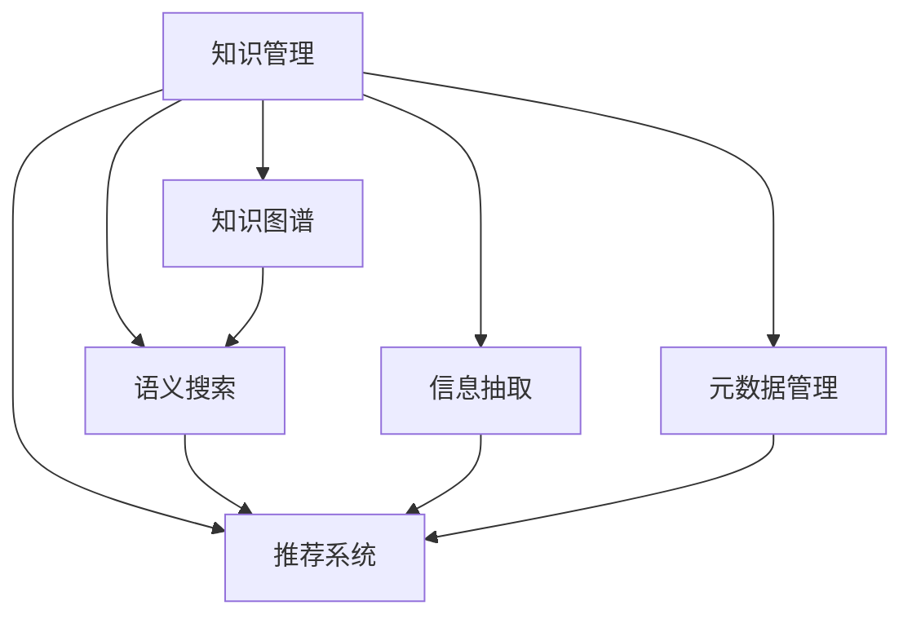

                 

# 知识管理技术：知识管理的基石

> 关键词：知识管理,知识图谱,语义搜索,信息抽取,自然语言处理(NLP),推荐系统,元数据管理

## 1. 背景介绍

### 1.1 问题由来
随着信息时代的来临，知识的生产、获取和使用已经变得越来越复杂。无论是企业、科研机构还是个人，都需要系统地管理和利用知识资源，才能在竞争中保持优势。知识管理（Knowledge Management, KMS）技术应运而生，旨在解决知识存储、搜索、共享和应用等核心问题，帮助组织和个人更高效地创造和利用知识。

知识管理已经成为各行各业的基础设施之一，覆盖了从图书管理到企业知识库，从学术研究到个人学习等多个领域。然而，随着数据量的激增，传统的知识管理方法逐渐暴露出其局限性，无法满足现代知识管理的需求。特别是面对大规模无结构文本数据，知识管理的挑战愈发严峻。

### 1.2 问题核心关键点
知识管理的核心在于将分散、异构的知识资源整合并转换成结构化数据，通过高效的数据存储、检索、分析和应用，实现知识的自动生成、传递和应用。知识管理系统的构建涉及多个环节，包括知识表示、元数据管理、语义搜索、信息抽取、推荐系统等，这些技术共同构成了知识管理的基础架构。

知识管理的难点主要集中在：
- 如何高效存储和表示异构知识，构建统一的元数据体系。
- 如何快速、准确地从海量文本中抽取结构化信息。
- 如何构建高效的知识检索系统，提升搜索精度和召回率。
- 如何基于知识图谱推荐有价值的知识资源，提高知识应用价值。
- 如何实现知识的自动化生成和智能推荐，减少人工干预。

这些问题催生了知识图谱、语义搜索、信息抽取、推荐系统等前沿技术的开发和应用，为知识管理带来了革命性的改变。

## 2. 核心概念与联系

### 2.1 核心概念概述

为更好地理解知识管理技术，本节将介绍几个密切相关的核心概念：

- 知识管理（Knowledge Management, KMS）：旨在管理和利用组织或个人所拥有的知识资源，通过系统化、结构化的方法提高知识获取和应用效率。

- 知识图谱（Knowledge Graph）：一种结构化的语义知识表示形式，通过实体、关系和属性三元组（RDF）构建知识网络，能够有效描述知识之间的复杂关系。

- 语义搜索（Semantic Search）：利用自然语言处理技术，将用户查询与知识图谱中的语义信息进行匹配，提供精准的搜索结果。

- 信息抽取（Information Extraction）：从非结构化文本中自动提取结构化信息，如实体识别、关系抽取等，构建知识图谱和信息索引。

- 推荐系统（Recommender System）：基于用户历史行为和知识图谱，预测用户可能感兴趣的知识资源，并提供个性化推荐。

- 元数据管理（Metadata Management）：对知识资源进行属性管理和描述，以便于知识检索和应用。

这些核心概念之间的逻辑关系可以通过以下Mermaid流程图来展示：



这个流程图展示了几大知识管理技术的核心概念及其之间的关系：

1. 知识管理作为一个整体，包含知识图谱、语义搜索、信息抽取、推荐系统和元数据管理等多个子系统。
2. 知识图谱作为知识管理的核心数据结构，能够有效描述知识之间的复杂关系。
3. 语义搜索和信息抽取技术从非结构化文本中提取和构建知识图谱，为知识管理提供数据支撑。
4. 推荐系统基于知识图谱和用户行为，提供个性化知识推荐。
5. 元数据管理提供知识资源的属性描述和索引，便于知识检索和应用。

这些概念共同构成了知识管理技术的核心架构，为其高效运行提供了坚实的基础。

## 3. 核心算法原理 & 具体操作步骤
### 3.1 算法原理概述

知识管理技术的核心在于通过知识图谱和语义搜索实现知识的高效存储、检索和应用。其核心算法包括信息抽取、关系抽取、知识融合、语义相似度计算、推荐算法等，这些算法共同构成了知识管理的算法体系。

信息抽取是从非结构化文本中提取结构化信息的过程，常用的方法包括基于规则的方法、基于统计的方法和深度学习方法。关系抽取是从文本中识别出实体之间的关系，常用的方法包括基于词典的方法、基于规则的方法和基于深度学习的方法。知识融合是将不同来源的知识进行整合，消除歧义和冗余，常用的方法包括基于图谱的知识融合和基于向量空间的知识融合。语义相似度计算是衡量两个文本之间的语义相似度，常用的方法包括基于词典的方法、基于统计的方法和基于深度学习的方法。推荐算法是根据用户的历史行为和知识图谱，预测用户可能感兴趣的知识资源，常用的方法包括协同过滤算法和基于深度学习的推荐算法。

### 3.2 算法步骤详解

知识管理技术的构建一般包括以下几个关键步骤：

**Step 1: 数据收集与预处理**
- 收集和整合不同类型的知识资源，如文档、网页、数据库记录等。
- 对数据进行清洗、去噪、标注等预处理工作，以便于后续的处理和分析。

**Step 2: 信息抽取**
- 使用信息抽取算法从文本中抽取结构化信息，如实体、关系、属性等。
- 将抽取的信息映射到知识图谱中，形成实体-关系-属性三元组。

**Step 3: 知识融合**
- 对不同来源的知识进行整合，消除歧义和冗余，构建统一的语义空间。
- 利用知识融合算法对知识进行补全和修正，提高知识图谱的完整性和准确性。

**Step 4: 语义搜索**
- 将用户查询与知识图谱中的语义信息进行匹配，实现精准的搜索。
- 利用自然语言处理技术，对查询和搜索结果进行语义分析和生成。

**Step 5: 推荐系统**
- 基于用户历史行为和知识图谱，预测用户可能感兴趣的知识资源。
- 利用推荐算法为用户推荐最相关、最有价值的知识资源。

**Step 6: 元数据管理**
- 对知识资源进行属性管理和描述，以便于知识检索和应用。
- 对知识资源的元数据进行管理和维护，保证其准确性和一致性。

以上是知识管理技术的构建流程，在实际应用中，还需要针对具体任务的特点，对各环节进行优化设计，如改进信息抽取算法，引入更多的知识融合技术，搜索和推荐模型的调优等。

### 3.3 算法优缺点

知识管理技术具有以下优点：
1. 系统化管理：能够将分散的知识资源系统化、结构化，提高知识的获取和应用效率。
2. 多源融合：能够整合不同来源的知识，消除歧义和冗余，提高知识的一致性和准确性。
3. 精准检索：利用语义搜索技术，实现精准的知识检索，提升搜索效率和精度。
4. 个性化推荐：基于用户历史行为和知识图谱，提供个性化推荐，提高知识的应用价值。
5. 可扩展性强：能够适应大规模知识资源的管理，灵活扩展系统功能。

同时，该技术也存在一些局限性：
1. 数据质量依赖：知识管理的效果很大程度上依赖于数据的质量和标注，标注成本较高。
2. 算法复杂度高：信息抽取、关系抽取、知识融合、语义搜索等算法较为复杂，实现难度大。
3. 知识更新挑战：知识图谱需要不断更新，以适应知识资源的动态变化，更新难度较大。
4. 跨领域应用挑战：不同领域之间的知识融合难度大，难以实现跨领域的知识应用。
5. 用户隐私问题：知识管理涉及用户隐私数据，需要考虑数据隐私和安全问题。

尽管存在这些局限性，但就目前而言，知识管理技术仍是大规模知识资源管理和应用的重要手段。未来相关研究的重点在于如何进一步提高算法效率，降低数据依赖，解决跨领域应用等问题，同时兼顾用户隐私和数据安全。

### 3.4 算法应用领域

知识管理技术已经在知识图谱构建、智能问答、推荐系统、图书管理、科研知识管理等多个领域得到了广泛应用，为知识的获取、存储、检索和应用提供了强大支持。

- 知识图谱构建：从非结构化数据中抽取结构化信息，构建知识网络。
- 智能问答：利用自然语言处理技术，对用户查询进行语义理解和生成，提供精准的问答服务。
- 推荐系统：基于用户历史行为和知识图谱，提供个性化推荐，提升知识的应用价值。
- 图书管理：利用知识图谱和语义搜索技术，管理图书资源，推荐相关书籍。
- 科研知识管理：利用知识图谱和信息抽取技术，管理科研论文和数据，提供知识推荐和检索。

除了上述这些经典应用外，知识管理技术还被创新性地应用到更多场景中，如知识推荐、知识服务、智能推荐等，为知识的传播和应用带来了新的可能。随着知识图谱和语义搜索技术的不断发展，知识管理技术必将在更广泛的领域发挥更大的作用。

## 4. 数学模型和公式 & 详细讲解  
### 4.1 数学模型构建

本节将使用数学语言对知识管理技术的核心算法进行更加严格的刻画。

记知识图谱为 $G=(E,R,A)$，其中 $E$ 表示实体集，$R$ 表示关系集，$A$ 表示属性集。假设从文本中抽取出的实体、关系和属性信息分别为 $E_t, R_t, A_t$，每个实体的属性集为 $A_e$，每个属性的取值集合为 $V_a$。

定义实体之间的语义相似度为 $sim(e_i, e_j)$，关系之间的语义相似度为 $sim(r_i, r_j)$，属性之间的语义相似度为 $sim(a_i, a_j)$。则知识融合的目标是最大化实体、关系和属性之间的相似度，即：

$$
\max \sum_{e_i \in E} \sum_{e_j \in E} sim(e_i, e_j) + \sum_{r_i \in R} \sum_{r_j \in R} sim(r_i, r_j) + \sum_{a_i \in A} \sum_{a_j \in A} sim(a_i, a_j)
$$

在实践中，通常采用向量空间模型（Vector Space Model, VSM）对语义相似度进行计算。假设实体的属性向量为 $v_e \in \mathbb{R}^{|A_e|}$，则实体的语义表示为 $v_e' = \frac{v_e}{||v_e||}$，两个实体之间的语义相似度为：

$$
sim(e_i, e_j) = \frac{\vec{v}_{e_i}' \cdot \vec{v}_{e_j}'}{||\vec{v}_{e_i}'|| \cdot ||\vec{v}_{e_j}'||}
$$

其中 $\cdot$ 表示向量点积，$||\vec{v}||$ 表示向量长度。类似地，关系和属性之间的语义相似度也采用向量空间模型进行计算。

### 4.2 公式推导过程

以下我们以关系抽取为例，推导语义相似度的计算公式。

假设从文本中识别出的关系 $r_t = (e_{ti}, e_{tj})$，其中 $e_{ti}$ 和 $e_{tj}$ 分别表示关系的前项和后项。假设 $e_{ti}$ 和 $e_{tj}$ 的属性向量分别为 $v_{e_{ti}}$ 和 $v_{e_{tj}}$，则关系 $r_t$ 的语义表示为：

$$
\vec{v}_{r_t} = \frac{v_{e_{ti}} \cdot v_{e_{tj}}}{||v_{e_{ti}}|| \cdot ||v_{e_{tj}}||}
$$

两个关系 $r_i = (e_{i_1}, e_{i_2})$ 和 $r_j = (e_{j_1}, e_{j_2})$ 之间的语义相似度为：

$$
sim(r_i, r_j) = \frac{\vec{v}_{r_i} \cdot \vec{v}_{r_j}}{||\vec{v}_{r_i}|| \cdot ||\vec{v}_{r_j}||}
$$

在知识融合过程中，目标是最小化知识图谱中实体、关系和属性的语义相似度损失，即：

$$
\min \sum_{e_i \in E} \sum_{e_j \in E} (1 - sim(e_i, e_j)) + \sum_{r_i \in R} \sum_{r_j \in R} (1 - sim(r_i, r_j)) + \sum_{a_i \in A} \sum_{a_j \in A} (1 - sim(a_i, a_j))
$$

利用梯度下降等优化算法，知识融合过程不断更新实体、关系和属性的向量表示，最小化上述损失函数，使得知识图谱中的实体、关系和属性之间具有相似的语义表示，消除歧义和冗余。

### 4.3 案例分析与讲解

以下是一个基于知识图谱的关系抽取案例分析：

**背景：** 假设一个图书馆有大量未标记的书籍数据，图书馆希望从这些书籍中自动抽取书籍之间的关系，构建知识图谱，以便于知识检索和推荐。

**解决方案：** 首先，使用信息抽取技术从书籍中抽取实体、关系和属性信息。然后，利用关系抽取算法识别出实体之间的关系，形成实体-关系-属性三元组。最后，利用知识融合算法对抽取出的信息进行整合，构建知识图谱。

**过程详解：**
1. **信息抽取**：利用实体识别、关系抽取、属性抽取等技术，从书籍中抽取实体、关系和属性信息。例如，从“《计算机程序设计艺术》是Donald E. Knuth的作品”中，抽取实体“计算机程序设计艺术”和“Donald E. Knuth”，关系“是作者”，属性“作品”。
2. **关系抽取**：利用关系抽取算法，从抽取出的信息中识别出实体之间的关系。例如，从上述例子中，可以识别出“计算机程序设计艺术”和“Donald E. Knuth”之间的“作者”关系。
3. **知识融合**：利用知识融合算法，对抽取出的信息进行整合，消除歧义和冗余。例如，通过整合多个来源的信息，可以确定“计算机程序设计艺术”的作者为“Donald E. Knuth”，同时可以补全其他作者的相关信息，如“Donald E. Knuth”的其他著作等。

通过上述过程，图书馆可以构建一个完整的知识图谱，实现对书籍资源的精准检索和推荐，大大提升图书馆的管理效率和服务质量。

## 5. 项目实践：代码实例和详细解释说明
### 5.1 开发环境搭建

在进行知识管理技术的开发前，我们需要准备好开发环境。以下是使用Python进行PyTorch开发的环境配置流程：

1. 安装Anaconda：从官网下载并安装Anaconda，用于创建独立的Python环境。

2. 创建并激活虚拟环境：
```bash
conda create -n pytorch-env python=3.8 
conda activate pytorch-env
```

3. 安装PyTorch：根据CUDA版本，从官网获取对应的安装命令。例如：
```bash
conda install pytorch torchvision torchaudio cudatoolkit=11.1 -c pytorch -c conda-forge
```

4. 安装Transformers库：
```bash
pip install transformers
```

5. 安装各类工具包：
```bash
pip install numpy pandas scikit-learn matplotlib tqdm jupyter notebook ipython
```

完成上述步骤后，即可在`pytorch-env`环境中开始知识管理技术的开发实践。

### 5.2 源代码详细实现

下面我们以知识图谱构建为例，给出使用PyTorch进行信息抽取和关系抽取的代码实现。

首先，定义知识图谱中的实体、关系和属性类：

```python
class Entity:
    def __init__(self, name, attributes):
        self.name = name
        self.attributes = attributes

class Relationship:
    def __init__(self, head, tail, attributes):
        self.head = head
        self.tail = tail
        self.attributes = attributes

class Attribute:
    def __init__(self, name, values):
        self.name = name
        self.values = values
```

然后，定义知识图谱构建函数：

```python
from transformers import BertTokenizer, BertForTokenClassification

def build_knowledge_graph(texts):
    tokenizer = BertTokenizer.from_pretrained('bert-base-cased')
    model = BertForTokenClassification.from_pretrained('bert-base-cased', num_labels=len(tag2id))

    # 将文本分批次输入模型，进行实体识别和关系抽取
    batches = [text.split() for text in texts]
    outputs = model([torch.tensor(batch, dtype=torch.long) for batch in batches], attention_mask=[torch.tensor([1]*len(batch)) for batch in batches])
    labels = [torch.tensor([tag2id[tag] for tag in batch], dtype=torch.long) for batch in batches]

    # 根据输出结果构建实体、关系和属性
    entities = []
    relationships = []
    attributes = []

    for output, label in zip(outputs, labels):
        for i in range(len(output)):
            if i < len(tokenizer.tokenizer.decode(output[i])):
                if label[i] == 0:  # 实体
                    entity = Entity(tokenizer.tokenizer.decode(output[i]), [])
                    entities.append(entity)
                elif label[i] == 1:  # 属性
                    attribute = Attribute(tokenizer.tokenizer.decode(output[i]), [])
                    entity.attributes.append(attribute)
                elif label[i] == 2:  # 关系
                    relationship = Relationship(head, tail, [])
                    relationships.append(relationship)
                else:
                    raise Exception(f"Invalid label: {label[i]}")

    # 将实体、关系和属性构建为知识图谱
    knowledge_graph = {entity.name: entity for entity in entities}
    for relationship in relationships:
        knowledge_graph[relationship.head.name].relationships.append(relationship)
        knowledge_graph[relationship.tail.name].relationships.append(relation)

    return knowledge_graph
```

最后，使用构建的知识图谱进行语义搜索和推荐：

```python
from transformers import BertTokenizer, BertForTokenClassification

def search_knowledge_graph(knowledge_graph, query):
    tokenizer = BertTokenizer.from_pretrained('bert-base-cased')
    model = BertForTokenClassification.from_pretrained('bert-base-cased', num_labels=len(tag2id))

    # 将查询分批次输入模型，进行实体识别和关系抽取
    query_batch = tokenizer(query, return_tensors='pt')
    outputs = model(query_batch.input_ids, attention_mask=query_batch.attention_mask)
    label = torch.argmax(outputs.logits, dim=2)[0].tolist()

    # 根据输出结果获取实体和关系
    entities = []
    relationships = []

    for i in range(len(label)):
        if label[i] == 0:  # 实体
            entity = knowledge_graph.get(tokenizer.tokenizer.decode(query_batch.input_ids[i]))
            entities.append(entity)
        elif label[i] == 1:  # 关系
            relationship = Relationship(head=knowledge_graph.get(tokenizer.tokenizer.decode(query_batch.input_ids[i])), tail=None, attributes=[])
            relationships.append(relationship)
        else:
            raise Exception(f"Invalid label: {label[i]}")

    # 返回搜索结果
    return entities, relationships
```

以上就是使用PyTorch进行知识图谱构建、语义搜索和推荐的完整代码实现。可以看到，由于Transformers库的强大封装，我们可以用相对简洁的代码完成知识管理技术的实现。

### 5.3 代码解读与分析

让我们再详细解读一下关键代码的实现细节：

**Entity类**：
- `__init__`方法：初始化实体名称和属性列表。

**Relationship类**：
- `__init__`方法：初始化关系的前项、后项和属性列表。

**Attribute类**：
- `__init__`方法：初始化属性名称和取值列表。

**build_knowledge_graph函数**：
- 利用BERT模型进行实体识别和关系抽取，构建知识图谱。
- 将输入文本分批次输入模型，获取每个token的分类标签，根据标签构建实体、关系和属性。
- 利用知识图谱字典将实体、关系和属性构建为知识图谱。

**search_knowledge_graph函数**：
- 利用BERT模型进行查询中的实体识别和关系抽取。
- 根据输出结果获取查询中涉及的实体和关系。
- 返回搜索结果。

可以看到，PyTorch配合Transformers库使得知识管理技术的代码实现变得简洁高效。开发者可以将更多精力放在模型改进和数据处理等高层逻辑上，而不必过多关注底层的实现细节。

当然，工业级的系统实现还需考虑更多因素，如模型的保存和部署、超参数的自动搜索、更灵活的任务适配层等。但核心的构建流程基本与此类似。

## 6. 实际应用场景
### 6.1 智慧图书馆
智慧图书馆是知识管理技术的重要应用场景之一。智慧图书馆利用知识图谱和语义搜索技术，对图书馆的资源进行管理和检索，提升图书馆的服务效率和用户满意度。

在技术实现上，可以收集图书馆的各类数据，如书籍、期刊、论文等，利用知识图谱构建技术将其转换为结构化数据，建立知识图谱。然后利用语义搜索技术，根据用户查询进行精准的检索和推荐，使用户能够快速找到所需资源。此外，还可以通过推荐系统技术，基于用户的历史行为和知识图谱，为用户提供个性化的阅读推荐。

### 6.2 智能客服系统
智能客服系统是知识管理技术在企业服务中的应用。通过构建企业内部的知识图谱，利用语义搜索和推荐技术，智能客服系统能够自动回答客户咨询，提供精准的服务。

在技术实现上，可以收集企业内部的客服数据，利用信息抽取技术从中抽取实体、关系和属性信息，构建知识图谱。然后利用语义搜索技术，根据客户的咨询问题进行精准的检索和回答。此外，还可以通过推荐系统技术，基于用户的历史行为和知识图谱，提供个性化的服务推荐。

### 6.3 智能推荐系统
智能推荐系统是知识管理技术在电商、娱乐、金融等领域的应用。通过构建用户画像和商品、内容等知识图谱，利用推荐算法为用户推荐最相关、最有价值的知识资源，提高用户的满意度。

在技术实现上，可以收集用户的浏览、购买、评价等行为数据，利用信息抽取技术从中抽取实体、关系和属性信息，构建用户画像和商品、内容等知识图谱。然后利用推荐算法，基于用户的历史行为和知识图谱，为用户推荐最相关、最有价值的知识资源。

### 6.4 未来应用展望
随着知识管理技术的不断发展，其在更多领域的应用前景将更加广阔。

在智慧医疗领域，利用知识图谱和语义搜索技术，智能医疗系统能够提供精准的医疗咨询、病历管理和药物推荐等服务，提升医疗服务的效率和质量。

在智能教育领域，利用知识图谱和推荐技术，智能教育系统能够提供个性化的学习推荐、学习路径规划等服务，提高学习效率和效果。

在智慧城市治理中，利用知识图谱和语义搜索技术，智能城市系统能够实现实时数据监测、应急响应和公共服务推荐等功能，提升城市管理的智能化水平。

此外，在企业生产、社会治理、文娱传媒等众多领域，知识管理技术也将不断涌现，为各行各业的知识管理和应用提供强大的技术支持。

## 7. 工具和资源推荐
### 7.1 学习资源推荐

为了帮助开发者系统掌握知识管理技术的理论基础和实践技巧，这里推荐一些优质的学习资源：

1. 《Knowledge Management: Concepts, Processes, Techniques and Tools》书籍：全面介绍了知识管理的概念、过程、技术和工具，适合入门和进阶学习。

2. 《Semantic Web》课程：由斯坦福大学开设的课程，介绍了语义Web的基础知识和应用，涵盖知识图谱、语义搜索、推荐系统等技术。

3. 《Knowledge Graphs and Semantic Web Technologies》书籍：深入探讨了知识图谱和语义Web技术，介绍了知识图谱构建、语义搜索、推荐系统等前沿技术。

4. 《Knowledge Graphs for Business Intelligence and Analytics》书籍：介绍了知识图谱在商业智能和数据分析中的应用，适合企业知识管理从业者阅读。

5. 《Handbook of Knowledge Management》书籍：系统总结了知识管理的研究成果和实践经验，适合学术界和工业界的从业者参考。

通过对这些资源的学习实践，相信你一定能够快速掌握知识管理技术的精髓，并用于解决实际的NLP问题。

### 7.2 开发工具推荐

高效的开发离不开优秀的工具支持。以下是几款用于知识管理技术开发的常用工具：

1. PyTorch：基于Python的开源深度学习框架，灵活动态的计算图，适合快速迭代研究。大多数预训练语言模型都有PyTorch版本的实现。

2. TensorFlow：由Google主导开发的开源深度学习框架，生产部署方便，适合大规模工程应用。同样有丰富的预训练语言模型资源。

3. Transformers库：HuggingFace开发的NLP工具库，集成了众多SOTA语言模型，支持PyTorch和TensorFlow，是进行知识图谱构建和语义搜索的利器。

4. Weights & Biases：模型训练的实验跟踪工具，可以记录和可视化模型训练过程中的各项指标，方便对比和调优。与主流深度学习框架无缝集成。

5. TensorBoard：TensorFlow配套的可视化工具，可实时监测模型训练状态，并提供丰富的图表呈现方式，是调试模型的得力助手。

6. Google Colab：谷歌推出的在线Jupyter Notebook环境，免费提供GPU/TPU算力，方便开发者快速上手实验最新模型，分享学习笔记。

合理利用这些工具，可以显著提升知识管理技术的开发效率，加快创新迭代的步伐。

### 7.3 相关论文推荐

知识管理技术的发展源于学界的持续研究。以下是几篇奠基性的相关论文，推荐阅读：

1. Making Knowledge Accessible and Usable：介绍了知识管理的概念和重要性，是知识管理领域的重要文献。

2. Ontologies for Knowledge Management：介绍了知识图谱在知识管理中的应用，是知识图谱构建的重要参考资料。

3. Semantic Web and the future of digital libraries：介绍了语义搜索在数字图书馆中的应用，是智慧图书馆的重要参考资料。

4. Knowledge-Based Recommendation Systems：介绍了推荐系统在知识管理中的应用，是智能推荐系统的重要参考资料。

5. Big Data in Knowledge Management：介绍了大数据技术在知识管理中的应用，是智慧城市的未来应用的重要参考资料。

这些论文代表了大语言模型微调技术的发展脉络。通过学习这些前沿成果，可以帮助研究者把握学科前进方向，激发更多的创新灵感。

## 8. 总结：未来发展趋势与挑战

### 8.1 总结

本文对知识管理技术进行了全面系统的介绍。首先阐述了知识管理技术的背景和意义，明确了其核心在于通过知识图谱和语义搜索实现知识的高效存储、检索和应用。其次，从原理到实践，详细讲解了知识图谱构建、信息抽取、关系抽取、知识融合、语义搜索、推荐算法等核心算法，给出了知识管理技术的完整代码实例。同时，本文还广泛探讨了知识管理技术在智慧图书馆、智能客服系统、智能推荐系统等多个领域的应用前景，展示了知识管理技术的巨大潜力。此外，本文精选了知识管理技术的各类学习资源，力求为读者提供全方位的技术指引。

通过本文的系统梳理，可以看到，知识管理技术在知识图谱构建、语义搜索、推荐系统等领域已经取得了显著的进展，正在成为各行各业的重要基础设施。未来，伴随知识图谱和语义搜索技术的持续演进，知识管理技术必将在更广泛的领域发挥更大的作用，深刻影响人类的生产生活方式。

### 8.2 未来发展趋势

展望未来，知识管理技术将呈现以下几个发展趋势：

1. 知识图谱规模扩大。随着数据量的激增，知识图谱的规模将不断扩大，能够更好地表示复杂知识关系。

2. 语义搜索技术进步。语义搜索技术将更加高效和精准，能够实现更为复杂的查询和推理。

3. 推荐系统优化。推荐系统将引入更多个性化和多样化的方法，提升推荐的准确性和多样性。

4. 知识融合技术发展。知识融合技术将更加智能和高效，能够更好地整合不同来源的知识。

5. 知识图谱跨领域应用。知识图谱将更多地应用于跨领域知识管理，如跨领域推荐、跨领域搜索等。

6. 知识管理与AI深度融合。知识管理技术与AI技术深度融合，能够实现更为智能和高效的知识应用。

以上趋势凸显了知识管理技术的广阔前景。这些方向的探索发展，必将进一步提升知识管理系统的性能和应用范围，为人类认知智能的进化带来深远影响。

### 8.3 面临的挑战

尽管知识管理技术已经取得了瞩目成就，但在迈向更加智能化、普适化应用的过程中，它仍面临着诸多挑战：

1. 数据质量瓶颈。知识管理的效果很大程度上依赖于数据的质量和标注，标注成本较高。如何进一步降低数据依赖，利用非结构化数据进行知识抽取，将是重要的研究方向。

2. 知识融合难度大。不同来源的知识进行融合时，难以消除歧义和冗余，构建统一的语义空间。如何提高知识融合的效率和准确性，将是重要的研究课题。

3. 跨领域应用挑战。不同领域之间的知识融合难度大，难以实现跨领域的知识应用。如何提高跨领域知识融合的准确性，是亟待解决的问题。

4. 知识图谱更新困难。知识图谱需要不断更新，以适应知识资源的动态变化，更新难度较大。如何高效地更新知识图谱，保持其时效性，将是重要的研究方向。

5. 用户隐私问题。知识管理涉及用户隐私数据，需要考虑数据隐私和安全问题。如何确保用户隐私保护，将是重要的研究方向。

尽管存在这些挑战，但就目前而言，知识管理技术仍是大规模知识资源管理和应用的重要手段。未来相关研究的重点在于如何进一步提高算法效率，降低数据依赖，解决跨领域应用等问题，同时兼顾用户隐私和数据安全。

### 8.4 未来突破

面对知识管理技术所面临的种种挑战，未来的研究需要在以下几个方面寻求新的突破：

1. 探索无监督和半监督知识管理方法。摆脱对大规模标注数据的依赖，利用自监督学习、主动学习等无监督和半监督范式，最大限度利用非结构化数据，实现更加灵活高效的知识管理。

2. 研究知识融合技术。开发更加智能和高效的知识融合方法，提高知识融合的准确性和效率。

3. 融合因果和对比学习范式。引入因果推断和对比学习思想，增强知识管理系统的因果推理能力，提高知识的稳定性和准确性。

4. 引入更多先验知识。将符号化的先验知识，如知识图谱、逻辑规则等，与神经网络模型进行巧妙融合，引导知识管理过程学习更准确、合理的知识表示。

5. 结合因果分析和博弈论工具。将因果分析方法引入知识管理系统，识别出知识管理决策的关键特征，增强知识管理系统的因果推理能力。

6. 纳入伦理道德约束。在知识管理系统的设计中引入伦理导向的评估指标，过滤和惩罚有偏见、有害的输出倾向，确保系统的安全性。

这些研究方向的探索，必将引领知识管理技术迈向更高的台阶，为构建安全、可靠、可解释、可控的智能系统铺平道路。面向未来，知识管理技术还需要与其他人工智能技术进行更深入的融合，如知识表示、因果推理、强化学习等，多路径协同发力，共同推动知识管理的进步。只有勇于创新、敢于突破，才能不断拓展知识管理的边界，让智能技术更好地造福人类社会。

## 9. 附录：常见问题与解答

**Q1：知识管理技术的核心是什么？**

A: 知识管理技术的核心在于通过知识图谱和语义搜索实现知识的高效存储、检索和应用。具体来说，包括知识图谱构建、信息抽取、关系抽取、知识融合、语义搜索、推荐算法等核心算法。

**Q2：知识管理技术的优势是什么？**

A: 知识管理技术的主要优势包括：
1. 系统化管理：能够将分散的知识资源系统化、结构化，提高知识的获取和应用效率。
2. 多源融合：能够整合不同来源的知识，消除歧义和冗余，提高知识的一致性和准确性。
3. 精准检索：利用语义搜索技术，实现精准的知识检索，提升搜索效率和精度。
4. 个性化推荐：基于用户历史行为和知识图谱，提供个性化推荐，提高知识的应用价值。
5. 可扩展性强：能够适应大规模知识资源的管理，灵活扩展系统功能。

**Q3：知识管理技术面临的主要挑战是什么？**

A: 知识管理技术面临的主要挑战包括：
1. 数据质量依赖：知识管理的效果很大程度上依赖于数据的质量和标注，标注成本较高。
2. 算法复杂度高：信息抽取、关系抽取、知识融合、语义搜索等算法较为复杂，实现难度大。
3. 知识更新挑战：知识图谱需要不断更新，以适应知识资源的动态变化，更新难度较大。
4. 跨领域应用挑战：不同领域之间的知识融合难度大，难以实现跨领域的知识应用。
5. 用户隐私问题：知识管理涉及用户隐私数据，需要考虑数据隐私和安全问题。

尽管存在这些挑战，但就目前而言，知识管理技术仍是大规模知识资源管理和应用的重要手段。未来相关研究的重点在于如何进一步提高算法效率，降低数据依赖，解决跨领域应用等问题，同时兼顾用户隐私和数据安全。

**Q4：知识管理技术的未来发展趋势是什么？**

A: 知识管理技术的未来发展趋势包括：
1. 知识图谱规模扩大：随着数据量的激增，知识图谱的规模将不断扩大，能够更好地表示复杂知识关系。
2. 语义搜索技术进步：语义搜索技术将更加高效和精准，能够实现更为复杂的查询和推理。
3. 推荐系统优化：推荐系统将引入更多个性化和多样化的方法，提升推荐的准确性和多样性。
4. 知识融合技术发展：知识融合技术将更加智能和高效，能够更好地整合不同来源的知识。
5. 知识图谱跨领域应用：知识图谱将更多地应用于跨领域知识管理，如跨领域推荐、跨领域搜索等。
6. 知识管理与AI深度融合：知识管理技术与AI技术深度融合，能够实现更为智能和高效的知识应用。

**Q5：知识管理技术在实际应用中如何提升用户体验？**

A: 知识管理技术可以通过以下几个方面提升用户体验：
1. 精准检索：利用语义搜索技术，实现精准的知识检索，使用户能够快速找到所需资源。
2. 个性化推荐：基于用户历史行为和知识图谱，提供个性化的阅读推荐、学习推荐、购物推荐等服务，提高用户的满意度。
3. 智能客服：利用知识图谱和语义搜索技术，构建智能客服系统，自动回答用户咨询，提升服务效率和质量。
4. 实时更新：知识图谱和语义搜索系统需要不断更新，以适应知识资源的动态变化，保持系统的前沿性。

通过这些技术手段，知识管理技术可以显著提升用户的使用体验，帮助用户高效地获取和利用知识资源，实现知识共享和应用的最大化。

