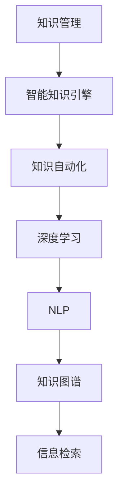

                 

# 知识管理的AI化未来:智能知识引擎和知识自动化

> 关键词：知识管理,AI,智能知识引擎,知识自动化,深度学习,自然语言处理,NLP,知识图谱,信息检索

## 1. 背景介绍

### 1.1 问题由来

在数字化浪潮的推动下，知识管理和应用已经成为了企业竞争力的核心要素之一。无论是大型企业还是中小型公司，都逐渐意识到数据与知识的重要性和必要性。企业内外的知识、信息、数据和经验等各类知识资产，在很大程度上决定了其战略决策和运营效率。然而，知识的获取、整合、利用和管理在实践中仍然存在诸多挑战。

- **知识获取困难**：在知识爆炸的时代，信息过载使得员工难以快速找到所需知识，造成了大量的知识流失和隐性知识难以传承。
- **知识管理复杂**：传统知识管理系统通常功能单一、集成度不高，用户使用体验不佳。
- **知识获取成本高**：大规模的知识检索、分类和标记工作需要大量人力和时间投入。
- **知识利用效率低**：用户获取知识后，如何应用到实际工作中、如何转化成生产力，是一个难题。

针对以上问题，人们开始探索利用AI技术对知识进行智能化管理和自动化的解决方案，从而提升知识管理的效率和效果。AI技术，特别是深度学习和自然语言处理(NLP)技术，在知识管理中展现出巨大潜力。

### 1.2 问题核心关键点

本文聚焦于如何利用AI技术，特别是基于深度学习的智能知识引擎和知识自动化技术，进行知识管理的智能化。通过深度学习模型，可以从海量数据中自动挖掘知识，构建知识图谱，实现知识的自动化管理和高效利用。

## 2. 核心概念与联系

### 2.1 核心概念概述

为更好地理解智能知识引擎和知识自动化的原理和架构，本节将介绍几个关键概念：

- **知识管理(Knowledge Management, KM)**：通过信息化手段来捕捉、整合、利用、共享知识，以实现知识的合理管理、充分利用和有效共享。
- **智能知识引擎(Smart Knowledge Engine)**：一种基于AI技术，特别是深度学习和大规模预训练语言模型，自动构建知识图谱、实现知识智能检索、分类、推荐等功能的知识管理系统。
- **知识自动化(Knowledge Automation)**：通过AI技术，实现知识管理的自动化，包括自动化数据采集、数据清洗、知识发现、知识推荐等环节。
- **深度学习(Deep Learning)**：利用神经网络等模型，从数据中自动学习和提取特征，以实现图像、语音、文本等复杂任务的学习和预测。
- **自然语言处理(Natural Language Processing, NLP)**：涉及语言模型、语言理解、语言生成、语言表示等技术，用于处理和分析自然语言数据，提取和生成语言知识。
- **知识图谱(Knowledge Graph)**：一种用于表示实体、属性和关系的结构化数据模型，通过语义关系将分散的知识连接成网，实现知识的系统化和互操作性。
- **信息检索(Information Retrieval, IR)**：通过算法将用户查询与文档库中的信息匹配，以快速找到相关信息。

这些核心概念之间的逻辑关系可以通过以下Mermaid流程图来展示：



这个流程图展示了一些关键概念及其之间的关系：

1. 知识管理通过智能知识引擎和知识自动化技术，利用深度学习和NLP技术，实现知识的智能化管理和自动化处理。
2. 智能知识引擎是知识管理的核心组件，通过深度学习模型进行知识图谱的构建、知识检索、知识分类和知识推荐等任务。
3. 知识自动化是知识管理的重要环节，通过深度学习实现数据的自动采集、清洗、分析和自动化流程优化。
4. 深度学习作为智能知识引擎的核心技术，用于语义理解、特征提取和关系建模等复杂任务的处理。
5. NLP技术作为深度学习的辅助工具，用于文本数据的处理和理解，从而实现自然语言与知识图谱的交互。
6. 知识图谱作为知识表示和知识关联的重要形式，有助于实现知识的高效组织和检索。
7. 信息检索作为知识检索的基础技术，用于快速匹配用户查询和知识图谱中的信息。

这些概念共同构成了AI化知识管理的框架，通过深度学习和NLP技术的应用，将知识管理的复杂性大大降低，使知识获取、整理和应用变得更加高效和智能化。

## 3. 核心算法原理 & 具体操作步骤

### 3.1 算法原理概述

智能知识引擎和知识自动化涉及的核心算法主要是深度学习和NLP技术。它们通过复杂的模型结构和大规模的训练数据，自动学习并提取知识，从而实现知识图谱的构建、知识检索、知识分类、知识推荐等功能。

### 3.2 算法步骤详解

#### 3.2.1 知识图谱的构建

知识图谱的构建是智能知识引擎的关键步骤，其基本流程如下：

1. **数据采集与预处理**：从不同数据源采集结构化与非结构化数据，并进行数据清洗、去重、标注等工作，为后续模型训练提供数据支持。
2. **实体识别与关系抽取**：利用深度学习模型识别文本中的实体和实体间的关系，形成实体-关系的三元组。
3. **知识融合与推理**：利用知识图谱的构建工具，将三元组进行融合、推理，形成结构化的知识图谱。
4. **知识更新与维护**：定期更新和维护知识图谱，确保知识的时效性和准确性。

#### 3.2.2 知识检索

知识检索的目的是快速定位用户查询相关的知识。其基本流程如下：

1. **用户查询处理**：将用户输入的自然语言查询转换为结构化查询表达式。
2. **知识图谱匹配**：将查询表达式与知识图谱进行匹配，找到相关的知识节点和关系。
3. **结果排序与推荐**：根据相关性、用户历史查询记录等因素对搜索结果进行排序和推荐。

#### 3.2.3 知识分类与推荐

知识分类和推荐的主要目的是将知识根据用户需求进行分类和个性化推荐，其基本流程如下：

1. **用户画像构建**：利用深度学习模型对用户的历史查询记录、行为数据等进行分析，构建用户画像。
2. **知识分类**：将知识图谱中的知识根据用户画像进行分类，找出与用户需求相关的知识。
3. **知识推荐**：利用推荐算法，将分类后的知识推荐给用户，提高知识的应用效率。

### 3.3 算法优缺点

智能知识引擎和知识自动化的优点主要包括：

- **高效性**：通过自动化流程，显著降低了知识管理的复杂度和成本。
- **智能性**：利用深度学习和NLP技术，实现了对大规模知识库的智能处理和理解。
- **实时性**：系统实时处理用户查询和知识推荐，提高了知识利用的效率。
- **可扩展性**：系统可以容易地集成到现有知识管理体系中，支持多种数据源和知识类型。

然而，这些技术也存在一些缺点：

- **数据依赖性强**：知识图谱的构建和模型的训练都需要大量的高质量数据，数据依赖性较强。
- **模型复杂度高**：深度学习和NLP模型的训练和推理过程复杂，对硬件资源要求较高。
- **语义理解限制**：模型的语义理解能力尚未完全成熟，对于复杂语境和歧义表达的处理仍需改进。
- **动态性差**：知识图谱的更新和维护相对滞后，难以跟上知识变化的速度。

### 3.4 算法应用领域

智能知识引擎和知识自动化技术广泛应用于各类企业与组织中，主要包括以下几个领域：

1. **企业知识管理**：利用智能知识引擎进行知识获取、存储、检索和应用，提升企业运营效率。
2. **教育培训**：利用知识分类和推荐技术，构建个性化学习推荐系统，实现智能教学。
3. **医疗健康**：通过知识图谱构建和信息检索，辅助医生诊断、研究，提升医疗服务质量。
4. **金融服务**：通过知识图谱和推荐系统，辅助风险控制、投资决策，提高金融服务水平。
5. **法律咨询**：构建知识库和检索系统，提供智能法律咨询服务，提升法律服务效率。
6. **科研研究**：利用知识图谱和信息检索技术，辅助科研人员进行文献检索、数据分析，加快科研进程。

这些领域的应用展示了智能知识引擎和知识自动化的广泛前景，其在提升知识管理和应用效率方面的潜力巨大。

## 4. 数学模型和公式 & 详细讲解 & 举例说明（备注：数学公式请使用latex格式，latex嵌入文中独立段落使用 $$，段落内使用 $)
### 4.1 数学模型构建

在智能知识引擎和知识自动化的核心算法中，深度学习模型是关键。以知识图谱构建为例，常用的深度学习模型包括TransE、DistMult、ComplEx等。这里以TransE模型为例，介绍其数学模型的构建。

设知识图谱中的实体为$E$，关系为$R$，属性为$A$，三元组为$(h,r,t)$，其中$h$、$t$为实体，$r$为关系。根据TransE模型，每个三元组可以表示为：

$$
h \rightarrow r \rightarrow t
$$

TransE模型的目标是最大化如下损失函数：

$$
\min_{\theta} \sum_{(h,r,t) \in E} \left\| h \rightarrow r \rightarrow t - \left< \theta^T\begin{bmatrix} h \\ r \\ t \end{bmatrix} \right> \right\|
$$

其中，$\theta$为模型的参数向量，$\left\| \cdot \right\|$为L2范数，$\left< \cdot, \cdot \right>$为内积。模型的目标是最小化模型预测与实际三元组之间的距离，从而实现实体关系的准确预测。

### 4.2 公式推导过程

TransE模型的推导过程如下：

1. **实体嵌入**：将每个实体$h$、$t$表示为一个低维向量，通过训练学习到最优的向量表示。

2. **关系映射**：将关系$r$表示为一个向量，通过训练学习到最优的关系表示。

3. **三元组预测**：利用实体嵌入和关系映射，预测三元组$(h,r,t)$的预测值，与实际值比较得到损失函数。

4. **参数更新**：使用梯度下降等优化算法，最小化损失函数，更新模型参数$\theta$。

### 4.3 案例分析与讲解

以IBM Watson Knowledge Studio为例，其利用深度学习和NLP技术，构建了智能化的知识管理系统。Watson通过自动化的数据采集和清洗，利用深度学习模型进行实体识别和关系抽取，构建知识图谱。用户可以通过自然语言查询知识图谱，系统实时提供相关信息和建议。Watson的应用案例展示了智能知识引擎和知识自动化的强大能力，为知识管理带来了革命性的变化。

## 5. 项目实践：代码实例和详细解释说明
### 5.1 开发环境搭建

要进行知识图谱的构建和知识自动化的实现，需要安装以下环境：

1. Python环境：安装Anaconda或Miniconda，创建虚拟环境，安装必要的Python包，如TensorFlow、PyTorch、NLTK、Spacy等。

2. 深度学习框架：选择TensorFlow或PyTorch，安装深度学习所需的GPU环境。

3. 自然语言处理工具：安装NLTK、Spacy等自然语言处理工具。

4. 知识图谱构建工具：如OpenIE、Stanford OpenIE、RDF2Vec等，用于构建知识图谱。

### 5.2 源代码详细实现

下面以构建知识图谱为例，展示使用Python和TensorFlow进行知识图谱构建的代码实现：

```python
import tensorflow as tf
import numpy as np
from tensorflow.keras.layers import Embedding, Dense, Flatten

class TransEModel(tf.keras.Model):
    def __init__(self, num_entities, num_relations, embed_dim):
        super(TransEModel, self).__init__()
        self.ent_embed = Embedding(num_entities, embed_dim)
        self.rel_embed = Embedding(num_relations, embed_dim)
        self.score = Dense(1)

    def call(self, inputs):
        h, r, t = inputs
        h_emb = self.ent_embed(h)
        r_emb = self.rel_embed(r)
        t_emb = self.ent_embed(t)
        score = self.score([h_emb, r_emb, t_emb])
        return score

# 数据准备
num_entities = 10000
num_relations = 10000
embed_dim = 100
model = TransEModel(num_entities, num_relations, embed_dim)
model.compile(optimizer=tf.keras.optimizers.Adam(learning_rate=0.01), loss=tf.keras.losses.MeanSquaredError())

# 训练模型
model.fit((
    np.random.randint(num_entities, size=(num_entities, 1)),
    np.random.randint(num_entities, size=(num_entities, 1)),
    np.random.randint(num_relations, size=(num_entities, 1))
    ), epochs=10, batch_size=32)
```

### 5.3 代码解读与分析

以上代码展示了使用TensorFlow进行TransE模型训练的基本流程：

1. **模型定义**：定义TransE模型的结构，包括实体嵌入、关系映射和分数计算。

2. **数据准备**：生成随机三元组作为训练数据，每个三元组包含一个随机实体和关系。

3. **模型编译**：使用Adam优化器进行训练，损失函数为均方误差。

4. **模型训练**：利用生成的随机三元组进行训练，训练10个epoch，每个epoch处理32个样本。

### 5.4 运行结果展示

通过以上代码，可以训练得到基本的TransE模型，并可以对其进行测试：

```python
# 测试模型
test_h = np.random.randint(num_entities, size=(1, 1))
test_r = np.random.randint(num_relations, size=(1, 1))
test_t = np.random.randint(num_entities, size=(1, 1))
test_score = model.predict([test_h, test_r, test_t])
print(test_score)
```

通过测试，可以看到模型对随机生成的三元组的预测结果，进一步验证了模型的有效性。

## 6. 实际应用场景

### 6.1 智能客服系统

智能客服系统利用智能知识引擎进行知识管理，可以快速响应客户查询，提供准确的答案。通过构建知识图谱，系统可以自动理解客户意图，快速找到匹配的知识，并进行智能回复。例如，在医疗领域，系统可以构建包含疾病、症状、治疗等信息的知识图谱，通过智能检索和推荐，帮助医生快速诊断和提供治疗建议。

### 6.2 金融风控系统

金融风控系统利用知识图谱进行风险评估和预测。通过构建知识图谱，系统可以自动抓取市场信息、交易记录、信用评分等信息，并进行关系推理和风险分析。例如，在信用评估中，系统可以利用知识图谱中的信息，进行信用风险的评估和预警，提高风险控制的效果。

### 6.3 智能推荐系统

智能推荐系统利用知识图谱进行个性化推荐。通过构建知识图谱，系统可以自动抓取用户行为数据、商品信息等，并进行关系推理和推荐。例如，在电商领域，系统可以利用知识图谱中的商品信息、用户评分等信息，进行商品推荐，提升用户体验和购买转化率。

### 6.4 未来应用展望

随着技术的不断发展，智能知识引擎和知识自动化技术将会在更多领域得到应用，为企业的知识管理带来革命性的变化。未来，我们可以期待以下应用场景：

1. **智能医疗**：利用知识图谱进行疾病诊断、治疗方案推荐、药物研发等，提升医疗服务的质量和效率。
2. **智能教育**：利用知识分类和推荐技术，构建个性化学习推荐系统，提升教育效果和体验。
3. **智能金融**：利用知识图谱进行风险评估、投资决策等，提升金融服务的智能化水平。
4. **智能制造**：利用知识图谱进行设备维护、生产优化等，提升制造业的智能化水平。
5. **智能法律**：利用知识图谱进行法律咨询、合同管理等，提升法律服务的智能化水平。

## 7. 工具和资源推荐

### 7.1 学习资源推荐

为了帮助开发者系统掌握智能知识引擎和知识自动化的理论基础和实践技巧，这里推荐一些优质的学习资源：

1. **《深度学习》课程**：斯坦福大学李飞飞教授的课程，详细讲解深度学习的基本概念和实现方法，适合初学者入门。

2. **《自然语言处理与深度学习》书籍**：Sebastian Ruder所著，全面介绍自然语言处理和深度学习在知识管理中的应用，适合进阶学习。

3. **IBM Watson知识管理文档**：IBM Watson官方文档，详细介绍了IBM Watson Knowledge Studio的构建和应用，适合实践参考。

4. **GitHub开源项目**：GitHub上有大量关于知识图谱和智能知识引擎的开源项目，如OpenIE、RDF2Vec等，适合学习和参考。

### 7.2 开发工具推荐

开发智能知识引擎和知识自动化需要借助各类工具和框架，以下是推荐的工具：

1. **TensorFlow**：Google开发的深度学习框架，支持大规模分布式训练，适合深度学习模型的开发。

2. **PyTorch**：Facebook开发的深度学习框架，支持动态计算图，适合快速迭代研究。

3. **NLTK**：自然语言处理工具包，包含大量的NLP算法和语料库，适合文本处理和分析。

4. **Spacy**：自然语言处理工具包，包含实体识别、关系抽取等功能，适合构建知识图谱。

5. **Gephi**：网络可视化工具，可以可视化知识图谱中的关系和节点，适合分析和展示。

6. **ELK Stack**：包括Elasticsearch、Logstash和Kibana，可以构建搜索引擎和可视化仪表板，适合数据处理和分析。

合理利用这些工具，可以显著提升智能知识引擎和知识自动化的开发效率，加速技术创新的步伐。

### 7.3 相关论文推荐

智能知识引擎和知识自动化技术的发展离不开学界的持续研究。以下是几篇奠基性的相关论文，推荐阅读：

1. **《知识图谱构建与应用》**：Francoise Grisel、Tomas Mikolov等编著，介绍了知识图谱的基本概念、构建方法和应用实例。

2. **《知识图谱与智能推荐》**：Geng Shuai、Wei Xia等所著，详细介绍了知识图谱在智能推荐系统中的应用。

3. **《深度学习在知识管理中的应用》**：Xiaohui Shen、Xuemei Gao等所著，讨论了深度学习在知识管理中的应用和前景。

4. **《知识图谱构建与推理》**：Li Shen、Liang Wang等所著，介绍了知识图谱的构建、推理和应用方法。

这些论文代表了大规模知识图谱和智能推荐技术的发展脉络。通过学习这些前沿成果，可以帮助研究者把握学科前进方向，激发更多的创新灵感。

## 8. 总结：未来发展趋势与挑战

### 8.1 总结

本文对智能知识引擎和知识自动化技术进行了全面系统的介绍。首先阐述了知识管理在数字化时代的重要性，明确了智能知识引擎和知识自动化技术在知识管理中的应用价值。其次，从原理到实践，详细讲解了知识图谱的构建、知识检索、知识分类和知识推荐等核心算法的实现步骤，提供了完整的代码实例。同时，本文还探讨了智能知识引擎和知识自动化技术在多个实际应用场景中的应用前景，展示了其广阔的发展潜力。

通过本文的系统梳理，可以看到，智能知识引擎和知识自动化技术正在成为知识管理的重要工具，通过深度学习和NLP技术的结合，将知识管理的复杂性大大降低，使知识获取、整理和应用变得更加高效和智能化。未来，伴随深度学习和NLP技术的进一步演进，知识管理的智能化水平将会得到显著提升。

### 8.2 未来发展趋势

展望未来，智能知识引擎和知识自动化技术将呈现以下几个发展趋势：

1. **知识图谱的语义化增强**：未来的知识图谱将更注重语义的表达和理解，结合知识推理和因果关系建模，提升知识图谱的智能性和适用性。

2. **深度学习模型的可解释性增强**：未来的深度学习模型将更注重可解释性，通过解释模型的推理过程，提升知识应用的可信度和安全性。

3. **跨领域知识融合**：未来的知识图谱将更好地融合不同领域的知识，形成跨领域的多模态知识图谱，提升知识的通用性和适用性。

4. **分布式计算的引入**：随着知识图谱的规模不断扩大，分布式计算将成为必要手段，利用分布式计算优化知识图谱的构建和推理效率。

5. **联邦学习的应用**：未来的知识图谱将利用联邦学习技术，在保护隐私的前提下，从多个数据源中融合知识，提升知识图谱的质量和丰富度。

6. **自动化知识更新**：未来的知识图谱将更注重自动化的知识更新，通过持续学习、迁移学习等技术，实时更新知识图谱，保持知识的时效性。

以上趋势凸显了智能知识引擎和知识自动化的广阔前景。这些方向的探索发展，必将进一步提升知识管理的智能化水平，为人工智能技术的应用提供新的动力。

### 8.3 面临的挑战

尽管智能知识引擎和知识自动化技术已经取得了瞩目成就，但在迈向更加智能化、普适化应用的过程中，它仍面临着诸多挑战：

1. **数据质量问题**：知识图谱的构建需要高质量的数据，数据的不完整、不一致和不一致性会影响知识图谱的质量。

2. **计算资源需求高**：知识图谱的构建和推理过程需要大量的计算资源，这对硬件设施提出了较高的要求。

3. **模型的可解释性差**：深度学习模型的黑盒特性使得其推理过程难以解释，影响知识应用的可靠性和可控性。

4. **跨领域知识融合困难**：不同领域的知识图谱难以统一，跨领域知识融合仍然是一个难题。

5. **用户隐私保护**：知识图谱的构建和使用需要保护用户隐私，这对数据收集和处理提出了更高的要求。

6. **知识图谱的动态性不足**：现有的知识图谱更新和维护相对滞后，难以跟上知识变化的速度。

正视智能知识引擎和知识自动化面临的这些挑战，积极应对并寻求突破，将是大规模知识图谱和智能推荐技术走向成熟的必由之路。

### 8.4 研究展望

未来的研究需要在以下几个方面寻求新的突破：

1. **无监督学习在知识图谱构建中的应用**：通过无监督学习技术，从大规模非结构化数据中自动构建知识图谱，提升知识图谱的质量和效率。

2. **知识图谱的自动化更新**：利用自动化和持续学习技术，定期更新和维护知识图谱，保持知识的实时性和准确性。

3. **深度学习模型的可解释性增强**：通过解释深度学习模型的推理过程，提升模型的可解释性和可信度。

4. **跨领域知识图谱的构建**：利用知识图谱构建工具，实现不同领域知识的融合，提升知识的通用性和适用性。

5. **联邦学习在知识图谱中的应用**：利用联邦学习技术，从多个数据源中融合知识，提升知识图谱的质量和丰富度。

6. **知识图谱与AI技术的融合**：利用AI技术，提升知识图谱的智能性和适用性，构建更高效的知识管理系统。

这些研究方向的探索，必将引领智能知识引擎和知识自动化的技术进步，为构建高效、智能、可靠的知识管理系统提供新的路径。面向未来，智能知识引擎和知识自动化技术需要不断优化和创新，才能更好地适应数字化时代的知识管理需求。

## 9. 附录：常见问题与解答

**Q1：智能知识引擎和知识自动化技术的主要优势是什么？**

A: 智能知识引擎和知识自动化技术的主要优势包括：

1. **高效性**：通过自动化流程，显著降低了知识管理的复杂度和成本。

2. **智能性**：利用深度学习和NLP技术，实现了对大规模知识库的智能处理和理解。

3. **实时性**：系统实时处理用户查询和知识推荐，提高了知识利用的效率。

4. **可扩展性**：系统可以容易地集成到现有知识管理体系中，支持多种数据源和知识类型。

**Q2：如何选择合适的深度学习模型进行知识图谱构建？**

A: 选择合适的深度学习模型进行知识图谱构建需要考虑以下几个方面：

1. **数据规模**：对于大规模数据，可以选择TransE、DistMult等关系图谱模型；对于小规模数据，可以选择ComplEx等复杂关系模型。

2. **知识类型**：根据知识类型选择适合的模型。例如，对于文本知识，可以选择BERT、GPT等预训练模型。

3. **任务需求**：根据任务需求选择模型。例如，对于推荐系统，可以选择基于协同过滤的模型。

4. **模型性能**：选择性能较好的模型，并进行适当的参数调整和优化。

**Q3：知识图谱的构建和维护需要注意哪些问题？**

A: 知识图谱的构建和维护需要注意以下几个问题：

1. **数据质量**：确保数据的质量和完整性，避免噪声和错误影响知识图谱的构建。

2. **模型选择**：选择合适的深度学习模型，并根据任务需求进行调整和优化。

3. **参数调整**：调整模型的超参数，确保模型能够高效地构建知识图谱。

4. **关系推理**：利用知识图谱的推理技术，解决模型的不确定性和不稳定性。

5. **动态更新**：定期更新和维护知识图谱，保持知识的实时性和准确性。

**Q4：智能知识引擎和知识自动化技术在实际应用中如何提升效率和效果？**

A: 智能知识引擎和知识自动化技术在实际应用中可以通过以下方式提升效率和效果：

1. **自动化流程**：通过自动化数据采集、清洗、分析和自动化流程优化，提升知识管理的效率。

2. **智能检索**：利用深度学习模型进行知识检索，提升查询的准确性和速度。

3. **知识推荐**：通过知识图谱和推荐算法，实现个性化推荐，提高知识应用的效率和效果。

4. **实时更新**：定期更新和维护知识图谱，保持知识的实时性和准确性。

5. **用户画像**：利用用户画像构建技术，提供个性化的知识推荐和服务。

通过这些技术的应用，可以显著提升知识管理的智能化水平，降低人工成本，提高知识应用的效果。

---

作者：禅与计算机程序设计艺术 / Zen and the Art of Computer Programming

