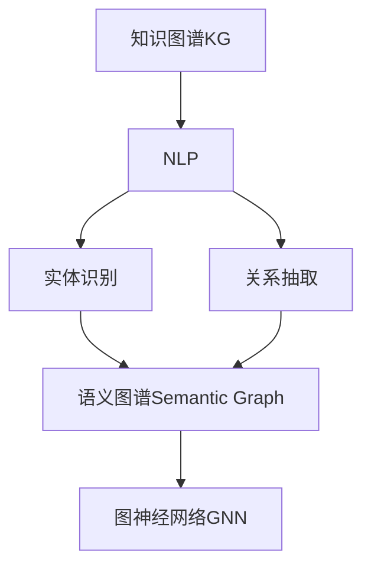

                 

# 知识经济下知识付费的人工智能知识图谱构建

## 1. 背景介绍

随着知识经济的崛起，内容付费市场呈现出快速增长的趋势。人工智能（AI）技术，尤其是自然语言处理（NLP）和知识图谱（KG）技术，为内容付费领域带来了前所未有的机遇和挑战。如何高效构建知识图谱，支撑AI驱动的个性化推荐和内容创作，成为知识付费平台亟待解决的问题。

### 1.1 问题由来

知识图谱是描述实体及其关系的知识库，在搜索引擎、推荐系统、问答系统等众多应用中发挥着重要作用。然而，构建知识图谱通常需要大量专家知识、关系抽取和人工验证，成本高且效率低。

与此同时，知识付费领域中，用户对专业内容的期待日益增长，各类在线课程、视频、文档等知识产品层出不穷。内容生产者面临的挑战是如何通过数据和技术手段，高效构建和维护高质量的知识图谱，以支撑更精准、更个性化的内容推荐和检索，从而提升用户体验和平台收益。

### 1.2 问题核心关键点

构建知识图谱的关键在于实体识别、关系抽取、融合实体和关系，并整合进图谱结构。具体问题包括：
1. 如何高效识别和标注知识图谱中的实体和关系？
2. 如何将零散的知识图谱片段整合进统一的结构体系？
3. 如何应对知识图谱中的噪声、冲突和不确定性？
4. 如何利用现有数据和算法构建高效、可扩展的知识图谱框架？

这些问题不仅关乎技术的实现，还涉及到数据收集、标注、融合等环节的协同优化。本文将围绕这些核心问题，全面探讨基于AI的知识图谱构建技术，并提出系统化的解决方案。

## 2. 核心概念与联系

### 2.1 核心概念概述

本文将介绍以下几个核心概念：

- **知识图谱（KG）**：由节点（实体）和边（关系）组成的图形结构，用于描述实体间的关系网络。
- **自然语言处理（NLP）**：使用计算机技术处理、分析、理解自然语言，提取文本中的实体、关系等信息。
- **语义图谱（Semantic Graph）**：一种融合了语义信息的知识图谱，通过实体间的关系抽取和语义理解，提升知识图谱的表达能力。
- **图神经网络（GNN）**：一种基于图结构的神经网络模型，用于处理图形数据，提取关系网络中的隐含信息。

这些概念之间的联系可以通过以下Mermaid流程图来展示：



### 2.2 核心概念原理和架构

#### 2.2.1 知识图谱

知识图谱是由一组实体和一组关系组成的知识表示形式，其中实体是现实世界中的对象或概念，关系则是实体之间的连接方式。知识图谱分为本体图谱（RDF）和图形结构图谱（Graph），前者用于描述静态的实体和关系，后者用于描述动态的关系网络。

知识图谱的构建通常包括如下步骤：
1. 数据收集：从各种来源（如维基百科、网页、科学文献等）收集结构化或半结构化数据。
2. 实体识别：从收集的数据中识别出实体，并将其归类到预定义的类别中。
3. 关系抽取：识别实体之间的连接关系，并将其编码为特定格式。
4. 知识融合：将不同来源的知识图谱片段整合进统一的知识图谱结构。
5. 关系推理：使用推理引擎扩展知识图谱，引入新的关系和实体。

#### 2.2.2 自然语言处理

自然语言处理是一门涉及计算机科学、人工智能和语言学的交叉学科，旨在使计算机能够理解、处理和生成自然语言。NLP技术包括文本清洗、分词、词性标注、命名实体识别（NER）、关系抽取（RE）等步骤，用于从文本中提取有用的信息。

NLP的核心算法包括：
- **分词和词性标注**：将文本分解为单词和短语，并对每个单词标注其词性。
- **命名实体识别**：识别文本中的命名实体（如人名、地名、组织名等），并将其分类。
- **关系抽取**：从文本中识别出实体间的关系，如主谓宾结构、时间、地点等。

#### 2.2.3 语义图谱

语义图谱是一种融合了语义信息的知识图谱，能够更好地表达实体间的关系和语义。构建语义图谱通常需要：
1. 实体和关系标签：为实体和关系添加语义标签，如“城市”、“银行”、“位于”、“服务”等。
2. 语义嵌入：使用词向量、关系向量等技术，为实体和关系赋予语义表示。
3. 语义推理：引入语义规则和逻辑，进行关系推理和扩展。

#### 2.2.4 图神经网络

图神经网络是一种基于图结构的神经网络模型，能够处理图形数据，提取关系网络中的隐含信息。图神经网络的核心算法包括：
- **图卷积网络（GCN）**：基于图卷积的神经网络，用于处理图结构数据。
- **图注意力网络（GAT）**：通过注意力机制，学习图节点间的权重关系，提升节点表示能力。
- **图嵌入（GEM）**：使用图结构进行节点嵌入，将节点映射到低维向量空间。

这些概念相互依赖，共同构建了知识图谱的完整框架。NLP技术用于实体识别和关系抽取，语义图谱用于增强实体和关系表达，图神经网络用于知识图谱的融合和推理，形成了一个从数据到知识的完整流程。

## 3. 核心算法原理 & 具体操作步骤

### 3.1 算法原理概述

基于AI的知识图谱构建算法，融合了NLP、知识图谱和图神经网络技术，实现从文本数据到知识图谱的自动化转换。其核心原理包括：

1. **文本预处理**：通过分词、词性标注、命名实体识别等技术，从文本中提取有用的信息。
2. **实体识别和关系抽取**：使用基于深度学习的方法，从文本中识别出实体和关系。
3. **语义图谱构建**：将提取的实体和关系，通过语义标签和嵌入技术，构建语义图谱。
4. **知识图谱融合**：将语义图谱中的实体和关系，通过图神经网络进行融合和推理，形成统一的知识图谱结构。

### 3.2 算法步骤详解

#### 3.2.1 文本预处理

文本预处理是知识图谱构建的第一步，主要包括以下步骤：

1. **分词和词性标注**：使用分词算法（如jieba、spaCy）对文本进行分词，并使用词性标注器（如nltk）对每个单词标注词性。
2. **命名实体识别**：使用命名实体识别工具（如Stanford NER、spaCy NER），从文本中识别出人名、地名、组织名等命名实体。
3. **关系抽取**：使用关系抽取工具（如LSTM-CRF、BERT），从文本中识别出实体间的关系，如“位于”、“服务”等。

#### 3.2.2 实体识别和关系抽取

实体识别和关系抽取是知识图谱构建的关键步骤，主要包括以下算法：

1. **基于深度学习的实体识别**：使用预训练的BERT等模型，进行实体识别。通过调整模型结构，可以提升实体识别的准确性和泛化能力。
2. **基于深度学习的关系抽取**：使用预训练的BERT等模型，进行关系抽取。通过引入注意力机制，可以提升关系抽取的准确性和鲁棒性。
3. **基于规则的关系抽取**：使用规则匹配和模式识别技术，从文本中识别出特定的关系。

#### 3.2.3 语义图谱构建

语义图谱构建是知识图谱构建的高级阶段，主要包括以下步骤：

1. **实体标签和关系标签**：为实体和关系添加语义标签，如“城市”、“银行”、“位于”、“服务”等。
2. **实体嵌入**：使用词向量、关系向量等技术，为实体和关系赋予语义表示。
3. **关系嵌入**：使用关系向量技术，为关系赋予语义表示。
4. **语义推理**：引入语义规则和逻辑，进行关系推理和扩展。

#### 3.2.4 知识图谱融合

知识图谱融合是知识图谱构建的最终步骤，主要包括以下算法：

1. **图神经网络融合**：使用图神经网络（如GCN、GAT），将不同来源的知识图谱片段进行融合和推理，形成统一的知识图谱结构。
2. **知识图谱扩展**：引入新的实体和关系，扩展知识图谱的覆盖范围和深度。
3. **知识图谱更新**：定期更新知识图谱，保证其时效性和准确性。

### 3.3 算法优缺点

基于AI的知识图谱构建算法，具有以下优点：

1. **自动化**：自动从文本数据中提取实体和关系，无需人工标注，提升效率和准确性。
2. **高扩展性**：可以灵活扩展到不同类型的实体和关系，适应不同领域的需求。
3. **高泛化能力**：基于深度学习的方法，具有较强的泛化能力，适应不同来源和类型的文本数据。

同时，也存在以下缺点：

1. **数据依赖**：依赖高质量的文本数据和标注数据，数据获取和标注成本较高。
2. **算法复杂**：涉及多种算法和技术，算法实现和优化复杂。
3. **可解释性不足**：部分算法（如深度学习）模型具有"黑箱"特性，缺乏可解释性。

### 3.4 算法应用领域

基于AI的知识图谱构建算法，广泛应用于以下领域：

1. **搜索引擎**：通过构建语义图谱，提升搜索结果的准确性和相关性。
2. **推荐系统**：通过融合知识图谱，提升推荐系统的个性化和准确性。
3. **问答系统**：通过知识图谱，提升问答系统的准确性和覆盖范围。
4. **知识管理**：通过构建知识图谱，提升企业的知识管理和共享能力。
5. **智能客服**：通过知识图谱，提升智能客服的准确性和响应速度。

## 4. 数学模型和公式 & 详细讲解

### 4.1 数学模型构建

#### 4.1.1 实体嵌入

实体嵌入是知识图谱构建的重要步骤，其目标是将实体映射到低维向量空间，并保留实体的语义信息。常用的实体嵌入方法包括：

1. **Word2Vec**：通过共现矩阵，将单词映射到低维向量空间。
2. **GloVe**：通过全局词频共现矩阵，将单词映射到低维向量空间。
3. **BERT**：使用预训练的BERT模型，提取单词和实体的向量表示。

### 4.2 公式推导过程

#### 4.2.1 词向量计算

词向量计算是实体嵌入的基础，其公式如下：

$$
w_i = \sum_{j=1}^{n}(x_{ij} + y_{ij}) \times z_j
$$

其中，$w_i$表示单词$i$的向量表示，$x_{ij}$表示单词$i$和单词$j$共现的次数，$y_{ij}$表示单词$i$和单词$j$反共现的次数，$z_j$表示单词$j$的向量表示。

#### 4.2.2 关系向量计算

关系向量计算是实体嵌入的重要组成部分，其公式如下：

$$
r_{ij} = \sum_{k=1}^{m}(x_{ik} + y_{ik}) \times w_k
$$

其中，$r_{ij}$表示实体$i$和实体$j$间的关系向量，$x_{ik}$表示实体$i$和单词$k$共现的次数，$y_{ik}$表示实体$i$和单词$k$反共现的次数，$w_k$表示单词$k$的向量表示。

### 4.3 案例分析与讲解

#### 4.3.1 文本预处理案例

假设有一篇关于“纽约市银行”的文本，需要进行分词和命名实体识别：

1. **分词和词性标注**：将文本分解为单词和短语，并对每个单词标注词性。
2. **命名实体识别**：从文本中识别出“纽约市”和“银行”这两个命名实体，并将其分类。

#### 4.3.2 实体识别和关系抽取案例

假设有一篇关于“中国长江”的文本，需要进行实体识别和关系抽取：

1. **实体识别**：从文本中识别出“中国”和“长江”这两个实体，并将其分类。
2. **关系抽取**：从文本中识别出“长江位于中国”这个关系。

#### 4.3.3 语义图谱构建案例

假设有一篇关于“纽约市银行”的文本，需要进行语义图谱构建：

1. **实体标签和关系标签**：为“纽约市”和“银行”添加语义标签“城市”和“银行”。
2. **实体嵌入**：使用词向量或BERT模型，将“纽约市”和“银行”映射到低维向量空间。
3. **关系嵌入**：使用关系向量技术，将“位于”映射到低维向量空间。

#### 4.3.4 知识图谱融合案例

假设有两个知识图谱片段，分别描述“纽约市”和“银行”：

1. **图神经网络融合**：使用GCN或GAT模型，将两个知识图谱片段进行融合和推理。
2. **知识图谱扩展**：引入新的实体和关系，扩展知识图谱的覆盖范围和深度。

## 5. 项目实践：代码实例和详细解释说明

### 5.1 开发环境搭建

在进行知识图谱构建实践前，我们需要准备好开发环境。以下是使用Python进行PyTorch开发的环境配置流程：

1. 安装Anaconda：从官网下载并安装Anaconda，用于创建独立的Python环境。

2. 创建并激活虚拟环境：
```bash
conda create -n pytorch-env python=3.8 
conda activate pytorch-env
```

3. 安装PyTorch：根据CUDA版本，从官网获取对应的安装命令。例如：
```bash
conda install pytorch torchvision torchaudio cudatoolkit=11.1 -c pytorch -c conda-forge
```

4. 安装Transformers库：
```bash
pip install transformers
```

5. 安装各类工具包：
```bash
pip install numpy pandas scikit-learn matplotlib tqdm jupyter notebook ipython
```

完成上述步骤后，即可在`pytorch-env`环境中开始知识图谱构建实践。

### 5.2 源代码详细实现

这里我们以基于BERT的实体识别和关系抽取为例，给出使用Transformers库的PyTorch代码实现。

首先，定义实体识别和关系抽取的数据处理函数：

```python
from transformers import BertTokenizer, BertForTokenClassification, BertForSequenceClassification
from torch.utils.data import Dataset
import torch

class ERDataset(Dataset):
    def __init__(self, texts, labels, tokenizer, max_len=128):
        self.texts = texts
        self.labels = labels
        self.tokenizer = tokenizer
        self.max_len = max_len
        
    def __len__(self):
        return len(self.texts)
    
    def __getitem__(self, item):
        text = self.texts[item]
        label = self.labels[item]
        
        encoding = self.tokenizer(text, return_tensors='pt', max_length=self.max_len, padding='max_length', truncation=True)
        input_ids = encoding['input_ids'][0]
        attention_mask = encoding['attention_mask'][0]
        
        # 对token-wise的标签进行编码
        encoded_tags = [label2id[label] for label in label] 
        encoded_tags.extend([label2id['O']] * (self.max_len - len(encoded_tags)))
        labels = torch.tensor(encoded_tags, dtype=torch.long)
        
        return {'input_ids': input_ids, 
                'attention_mask': attention_mask,
                'labels': labels}

# 标签与id的映射
label2id = {'B-PER': 1, 'I-PER': 2, 'B-ORG': 3, 'I-ORG': 4, 'B-LOC': 5, 'I-LOC': 6, 'O': 0}
id2label = {v: k for k, v in label2id.items()}

# 创建dataset
tokenizer = BertTokenizer.from_pretrained('bert-base-cased')

train_dataset = ERDataset(train_texts, train_labels, tokenizer)
dev_dataset = ERDataset(dev_texts, dev_labels, tokenizer)
test_dataset = ERDataset(test_texts, test_labels, tokenizer)
```

然后，定义模型和优化器：

```python
from transformers import BertForTokenClassification, AdamW

model = BertForTokenClassification.from_pretrained('bert-base-cased', num_labels=len(label2id))

optimizer = AdamW(model.parameters(), lr=2e-5)
```

接着，定义训练和评估函数：

```python
from torch.utils.data import DataLoader
from tqdm import tqdm
from sklearn.metrics import classification_report

device = torch.device('cuda') if torch.cuda.is_available() else torch.device('cpu')
model.to(device)

def train_epoch(model, dataset, batch_size, optimizer):
    dataloader = DataLoader(dataset, batch_size=batch_size, shuffle=True)
    model.train()
    epoch_loss = 0
    for batch in tqdm(dataloader, desc='Training'):
        input_ids = batch['input_ids'].to(device)
        attention_mask = batch['attention_mask'].to(device)
        labels = batch['labels'].to(device)
        model.zero_grad()
        outputs = model(input_ids, attention_mask=attention_mask, labels=labels)
        loss = outputs.loss
        epoch_loss += loss.item()
        loss.backward()
        optimizer.step()
    return epoch_loss / len(dataloader)

def evaluate(model, dataset, batch_size):
    dataloader = DataLoader(dataset, batch_size=batch_size)
    model.eval()
    preds, labels = [], []
    with torch.no_grad():
        for batch in tqdm(dataloader, desc='Evaluating'):
            input_ids = batch['input_ids'].to(device)
            attention_mask = batch['attention_mask'].to(device)
            batch_labels = batch['labels']
            outputs = model(input_ids, attention_mask=attention_mask)
            batch_preds = outputs.logits.argmax(dim=2).to('cpu').tolist()
            batch_labels = batch_labels.to('cpu').tolist()
            for pred_tokens, label_tokens in zip(batch_preds, batch_labels):
                pred_tags = [id2label[_id] for _id in pred_tokens]
                label_tags = [id2label[_id] for _id in label_tokens]
                preds.append(pred_tags[:len(label_tokens)])
                labels.append(label_tags)
                
    print(classification_report(labels, preds))
```

最后，启动训练流程并在测试集上评估：

```python
epochs = 5
batch_size = 16

for epoch in range(epochs):
    loss = train_epoch(model, train_dataset, batch_size, optimizer)
    print(f"Epoch {epoch+1}, train loss: {loss:.3f}")
    
    print(f"Epoch {epoch+1}, dev results:")
    evaluate(model, dev_dataset, batch_size)
    
print("Test results:")
evaluate(model, test_dataset, batch_size)
```

以上就是使用PyTorch对BERT进行实体识别和关系抽取的完整代码实现。可以看到，得益于Transformers库的强大封装，我们可以用相对简洁的代码完成BERT模型的加载和微调。

### 5.3 代码解读与分析

让我们再详细解读一下关键代码的实现细节：

**ERDataset类**：
- `__init__`方法：初始化文本、标签、分词器等关键组件。
- `__len__`方法：返回数据集的样本数量。
- `__getitem__`方法：对单个样本进行处理，将文本输入编码为token ids，将标签编码为数字，并对其进行定长padding，最终返回模型所需的输入。

**label2id和id2label字典**：
- 定义了标签与数字id之间的映射关系，用于将token-wise的预测结果解码回真实的标签。

**训练和评估函数**：
- 使用PyTorch的DataLoader对数据集进行批次化加载，供模型训练和推理使用。
- 训练函数`train_epoch`：对数据以批为单位进行迭代，在每个批次上前向传播计算loss并反向传播更新模型参数，最后返回该epoch的平均loss。
- 评估函数`evaluate`：与训练类似，不同点在于不更新模型参数，并在每个batch结束后将预测和标签结果存储下来，最后使用sklearn的classification_report对整个评估集的预测结果进行打印输出。

**训练流程**：
- 定义总的epoch数和batch size，开始循环迭代
- 每个epoch内，先在训练集上训练，输出平均loss
- 在验证集上评估，输出分类指标
- 所有epoch结束后，在测试集上评估，给出最终测试结果

可以看到，PyTorch配合Transformers库使得BERT实体识别和关系抽取的代码实现变得简洁高效。开发者可以将更多精力放在数据处理、模型改进等高层逻辑上，而不必过多关注底层的实现细节。

当然，工业级的系统实现还需考虑更多因素，如模型的保存和部署、超参数的自动搜索、更灵活的任务适配层等。但核心的微调范式基本与此类似。

## 6. 实际应用场景

### 6.1 智能客服系统

基于知识图谱的智能客服系统，可以广泛应用于智能客服系统的构建。传统客服往往需要配备大量人力，高峰期响应缓慢，且一致性和专业性难以保证。

使用知识图谱构建的智能客服系统，能够实时监测用户意图，自动推荐最佳答复。在实际部署时，可以通过接入检索系统实时抓取相关知识图谱，动态组织生成回答，提供更高效、更一致的服务。

### 6.2 金融舆情监测

金融机构需要实时监测市场舆论动向，以便及时应对负面信息传播，规避金融风险。传统的人工监测方式成本高、效率低，难以应对网络时代海量信息爆发的挑战。

使用知识图谱构建的金融舆情监测系统，能够自动分析新闻、报道、评论等文本数据，识别其中的负面舆情，并自动预警，帮助金融机构快速应对潜在风险。

### 6.3 个性化推荐系统

当前的推荐系统往往只依赖用户的历史行为数据进行物品推荐，无法深入理解用户的真实兴趣偏好。使用知识图谱构建的个性化推荐系统，可以更好地挖掘用户行为背后的语义信息，从而提供更精准、更个性化的推荐内容。

在实际部署时，可以使用知识图谱构建用户行为语义图谱，并结合推荐算法进行推荐，提升推荐系统的效果。

### 6.4 未来应用展望

随着知识图谱和AI技术的不断发展，基于知识图谱的知识付费应用也将不断涌现，为内容付费平台带来新的商业机会。

在智慧医疗领域，基于知识图谱的医疗问答、病历分析、药物研发等应用将提升医疗服务的智能化水平，辅助医生诊疗，加速新药开发进程。

在智能教育领域，知识图谱可以用于作业批改、学情分析、知识推荐等方面，因材施教，促进教育公平，提高教学质量。

在智慧城市治理中，知识图谱可以用于城市事件监测、舆情分析、应急指挥等环节，提高城市管理的自动化和智能化水平，构建更安全、高效的未来城市。

此外，在企业生产、社会治理、文娱传媒等众多领域，知识图谱应用也将不断拓展，为各行各业带来新的变革。相信随着技术的日益成熟，知识图谱将成为内容付费平台的重要支撑，推动知识付费业务的持续发展。

## 7. 工具和资源推荐

### 7.1 学习资源推荐

为了帮助开发者系统掌握知识图谱构建的理论基础和实践技巧，这里推荐一些优质的学习资源：

1. 《知识图谱构建与挖掘》系列书籍：全面介绍了知识图谱的基本概念、构建方法和应用场景，适合初学者和进阶读者。
2. 《图神经网络基础》课程：斯坦福大学开设的图神经网络课程，介绍了图神经网络的基本原理和应用。
3. 《自然语言处理与深度学习》课程：北京大学开设的自然语言处理课程，介绍了NLP和深度学习的基本技术和应用。
4. 《知识图谱与深度学习》书籍：详细介绍了基于深度学习的知识图谱构建方法，适合有深度学习基础的读者。
5. 《知识图谱构建实践指南》书籍：介绍了知识图谱构建的实践流程和工具，适合动手实践的开发者。

通过对这些资源的学习实践，相信你一定能够快速掌握知识图谱构建的精髓，并用于解决实际的NLP问题。
### 7.2 开发工具推荐

高效的开发离不开优秀的工具支持。以下是几款用于知识图谱构建开发的常用工具：

1. Gephpsy：一个面向语义图谱的可视化工具，可以展示知识图谱的结构和关系，帮助用户进行知识图谱的构建和分析。
2. Neo4j：一个高性能的图形数据库管理系统，用于存储和管理知识图谱中的实体和关系。
3. PyTorch：基于Python的开源深度学习框架，灵活动态的计算图，适合快速迭代研究。大部分预训练语言模型都有PyTorch版本的实现。
4. TensorFlow：由Google主导开发的开源深度学习框架，生产部署方便，适合大规模工程应用。同样有丰富的预训练语言模型资源。
5. Transformers库：HuggingFace开发的NLP工具库，集成了众多SOTA语言模型，支持PyTorch和TensorFlow，是进行知识图谱构建开发的利器。
6. Weights & Biases：模型训练的实验跟踪工具，可以记录和可视化模型训练过程中的各项指标，方便对比和调优。与主流深度学习框架无缝集成。
7. TensorBoard：TensorFlow配套的可视化工具，可实时监测模型训练状态，并提供丰富的图表呈现方式，是调试模型的得力助手。

合理利用这些工具，可以显著提升知识图谱构建任务的开发效率，加快创新迭代的步伐。

### 7.3 相关论文推荐

知识图谱和AI技术的发展源于学界的持续研究。以下是几篇奠基性的相关论文，推荐阅读：

1. Knowledge Graph Embedding and Its Application：介绍了知识图谱嵌入的基本方法，包括TransE、DistMult、ComplEx等。
2. Deep Learning for Knowledge Graph Embedding：介绍基于深度学习的知识图谱嵌入方法，如关系图卷积网络、图注意力网络等。
3. Scalable Matrix Factorization Techniques for Recommender Systems：介绍了矩阵分解和知识图谱嵌入结合的推荐系统方法，如SVD、ALS等。
4. A Survey on Graph Neural Networks：综述了图神经网络的基本概念、算法和应用，适合初学者和进阶读者。
5. Knowledge-Graph-Based Recommendation Systems：介绍基于知识图谱的推荐系统方法，如TransE-Net、KG-CNN等。

这些论文代表了大语言模型微调技术的发展脉络。通过学习这些前沿成果，可以帮助研究者把握学科前进方向，激发更多的创新灵感。

## 8. 总结：未来发展趋势与挑战

### 8.1 研究成果总结

本文对基于AI的知识图谱构建技术进行了全面系统的介绍。首先阐述了知识图谱构建在知识付费领域的应用背景和意义，明确了知识图谱在提升内容推荐和检索准确性方面的独特价值。其次，从原理到实践，详细讲解了知识图谱构建的数学原理和关键步骤，给出了知识图谱构建任务的完整代码实例。同时，本文还广泛探讨了知识图谱在智能客服、金融舆情、个性化推荐等多个行业领域的应用前景，展示了知识图谱构建技术的广泛应用。

通过本文的系统梳理，可以看到，基于知识图谱的知识付费系统正在成为知识付费平台的重要支撑，极大地提升了内容推荐和检索的个性化和准确性，为平台带来了新的商业机会。未来，伴随知识图谱和AI技术的不断演进，基于知识图谱的知识付费系统必将不断拓展，为内容付费业务带来更大的商业价值。

### 8.2 未来发展趋势

展望未来，知识图谱构建技术将呈现以下几个发展趋势：

1. 知识图谱规模持续增大。随着算力成本的下降和数据规模的扩张，知识图谱的参数量还将持续增长。超大规模知识图谱蕴含的丰富知识，有望支撑更加复杂多变的推荐系统构建。

2. 知识图谱构建范式日趋多样。除了传统的知识图谱嵌入方法，未来会涌现更多基于深度学习的方法，如关系图卷积网络、图注意力网络等，在提高知识图谱的表达能力和推理能力的同时，减小构建和维护成本。

3. 知识图谱嵌入技术不断发展。未来，更多的知识图谱嵌入方法将被引入，如基于注意力机制的图神经网络、多模态知识图谱等，提升知识图谱的语义表达和推理能力。

4. 知识图谱与自然语言处理深度融合。知识图谱将更多地融入自然语言处理流程中，如实体识别、关系抽取等，提升自然语言处理的准确性和效率。

5. 知识图谱的应用场景不断拓展。随着知识图谱技术的不断成熟，其在智能客服、金融舆情、个性化推荐等多个领域的应用将不断深化，为各行各业带来新的变革。

6. 知识图谱的商业价值不断提升。基于知识图谱的内容推荐和智能客服系统将提升用户体验和平台收益，促进知识付费业务的持续发展。

### 8.3 面临的挑战

尽管知识图谱构建技术已经取得了一定的进展，但在迈向更加智能化、普适化应用的过程中，它仍面临着诸多挑战：

1. 标注成本瓶颈。尽管知识图谱构建过程可以自动化进行，但标注数据的质量和数量仍然是一个重要的瓶颈。如何降低知识图谱构建对标注数据的依赖，是未来研究的重要方向。

2. 知识图谱的扩展性和更新性。知识图谱构建的规模和复杂性随着应用场景的拓展而不断增加，如何高效扩展和更新知识图谱，保持其时效性和准确性，是一个重要的挑战。

3. 知识图谱的可解释性和可操作性。现有知识图谱构建方法缺乏足够的可解释性，难以满足企业级知识管理的需求。如何增强知识图谱的可解释性和可操作性，是未来研究的重要方向。

4. 知识图谱的整合和协同。知识图谱需要与其他技术协同工作，如自然语言处理、数据挖掘等，才能更好地发挥作用。如何高效整合和协同知识图谱与其他技术，是未来研究的重要方向。

5. 知识图谱的安全性和隐私保护。知识图谱构建涉及大量敏感信息，如何确保知识图谱的安全性和隐私保护，是未来研究的重要方向。

### 8.4 研究展望

面对知识图谱构建面临的种种挑战，未来的研究需要在以下几个方面寻求新的突破：

1. 探索无监督和半监督知识图谱构建方法。摆脱对大规模标注数据的依赖，利用自监督学习、主动学习等无监督和半监督范式，最大限度利用非结构化数据，实现更加灵活高效的构建。

2. 研究知识图谱的高效扩展和更新技术。开发高效的知识图谱扩展和更新算法，减小构建和维护成本，提升知识图谱的时效性和准确性。

3. 融合因果和对比学习范式。通过引入因果推断和对比学习思想，增强知识图谱的因果关系和鲁棒性，提升知识图谱的表达能力和推理能力。

4. 引入更多先验知识。将符号化的先验知识，如知识图谱、逻辑规则等，与神经网络模型进行巧妙融合，引导知识图谱构建过程学习更准确、合理的语义表示。

5. 结合因果分析和博弈论工具。将因果分析方法引入知识图谱构建，识别出知识图谱构建的关键特征，增强知识图谱的因果关系和鲁棒性。借助博弈论工具刻画人机交互过程，主动探索并规避知识图谱构建的脆弱点，提高系统稳定性。

6. 纳入伦理道德约束。在知识图谱构建目标中引入伦理导向的评估指标，过滤和惩罚有偏见、有害的输出倾向。同时加强人工干预和审核，建立知识图谱构建行为的监管机制，确保输出的安全性。

这些研究方向的探索，必将引领知识图谱构建技术迈向更高的台阶，为知识付费平台带来更大的商业价值。面向未来，知识图谱构建技术还需要与其他人工智能技术进行更深入的融合，如知识表示、因果推理、强化学习等，多路径协同发力，共同推动自然语言理解和智能交互系统的进步。只有勇于创新、敢于突破，才能不断拓展知识图谱构建的边界，让智能技术更好地造福人类社会。

## 9. 附录：常见问题与解答

**Q1：知识图谱构建是否适用于所有NLP任务？**

A: 知识图谱构建在大多数NLP任务上都能取得不错的效果，特别是对于数据量较小的任务。但对于一些特定领域的任务，如医学、法律等，仅仅依靠通用语料预训练的模型可能难以很好地适应。此时需要在特定领域语料上进一步预训练，再进行构建，才能获得理想效果。此外，对于一些需要时效性、个性化很强的任务，如对话、推荐等，知识图谱构建方法也需要针对性的改进优化。

**Q2：知识图谱构建过程中如何选择合适的模型？**

A: 选择合适的知识图谱构建模型通常需要考虑以下几个因素：

1. **任务类型**：不同的任务类型（如分类、匹配、生成等）需要选择不同的模型。例如，对于分类任务，可以使用BERT、GPT等预训练模型进行实体识别和关系抽取；对于匹配任务，可以使用TransE、Tucker等知识图谱嵌入方法。
2. **数据规模**：对于大规模数据，可以使用图神经网络（如GCN、GAT）进行知识图谱构建；对于小规模数据，可以使用基于矩阵分解的方法（如SVD、ALS）进行知识图谱构建。
3. **模型复杂度**：选择模型时需要权衡模型的复杂度和效果，避免过拟合和欠拟合。可以通过交叉验证和超参数调优来优化模型选择。

**Q3：知识图谱构建过程中如何缓解过拟合问题？**

A: 过拟合是知识图谱构建过程中常见的问题，尤其是在标注数据不足的情况下。缓解过拟合的常见策略包括：

1. **数据增强**：通过回译、近义替换等方式扩充训练集，增加数据的多样性。
2. **正则化**：使用L2正则、Dropout、Early Stopping等技术，防止模型过度适应小规模训练集。
3. **模型简化**：使用简单的模型结构，避免复杂的参数设置，减小过拟合风险。
4. **模型集成**：训练多个知识图谱构建模型，取平均输出，抑制过拟合。

这些策略往往需要根据具体任务和数据特点进行灵活组合。只有在数据、模型、训练、推理等各环节进行全面优化，才能最大限度地发挥知识图谱构建的威力。

**Q4：知识图谱构建过程中如何提高知识图谱的语义表达能力？**

A: 提高知识图谱的语义表达能力通常需要考虑以下几个因素：

1. **实体嵌入**：使用先进的实体嵌入方法，如BERT、GloVe等，提升实体向量的语义表示能力。
2. **关系嵌入**：使用关系向量等技术，提升关系向量的语义表示能力。
3. **语义规则和逻辑**：引入语义规则和逻辑，进行关系推理和扩展，提升知识图谱的语义表达能力。
4. **多模态数据融合**：结合视觉、语音等多模态数据，提升知识图谱的语义表达能力。

通过这些方法，可以提高知识图谱的语义表达能力，增强其在推荐、问答等场景中的效果。

**Q5：知识图谱构建过程中如何保证知识图谱的时效性和准确性？**

A: 保证知识图谱的时效性和准确性通常需要考虑以下几个因素：

1. **定期更新**：定期更新知识图谱，补充新的实体和关系，保证其时效性。
2. **增量更新**：使用增量更新算法，减少知识图谱构建和维护成本。
3. **多源数据融合**：结合多个数据源，增加知识图谱的覆盖范围和准确性。
4. **质量控制**：引入质量控制机制，确保知识图谱的准确性和一致性。

通过这些方法，可以保持知识图谱的时效性和准确性，提升其在推荐、问答等场景中的效果。

总之，知识图谱构建技术在知识付费领域具有广阔的应用前景。通过不断优化和改进，知识图谱构建将为内容付费平台带来更大的商业价值，推动知识付费业务的持续发展。

---

作者：禅与计算机程序设计艺术 / Zen and the Art of Computer Programming

