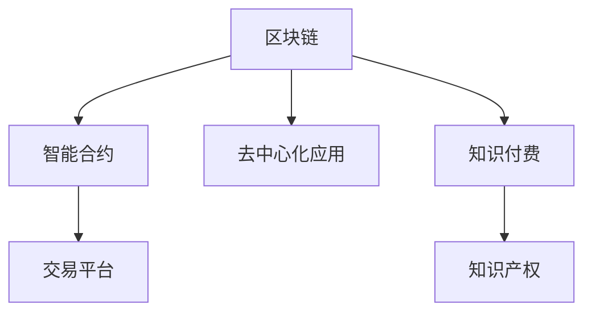

                 

# 知识经济下知识付费的区块链知识产权交易平台

> 关键词：知识付费, 区块链, 知识产权, 交易平台, 智能合约, 用户行为分析, 区块链技术, 交易机制设计

## 1. 背景介绍

### 1.1 问题由来
随着知识经济的兴起，知识付费作为一种新兴的经济模式，受到了越来越多人的关注。知识付费平台通过聚集海量优质知识资源，为知识创作者提供价值回报，同时也为知识消费者提供高效获取知识的途径。然而，当前的知识付费平台普遍存在版权保护不力、交易透明度低、用户权益保障不足等问题，严重阻碍了平台的可持续发展。

### 1.2 问题核心关键点
为了解决这些痛点，基于区块链技术的知识产权交易平台应运而生。区块链技术的去中心化、透明性、不可篡改性等特点，为知识付费平台提供了全新的解决方案。本文将深入探讨基于区块链技术的知识付费平台的设计思路、技术架构和关键实现，为构建一个安全、高效、透明的知识付费生态提供参考。

### 1.3 问题研究意义
通过构建知识付费的区块链知识产权交易平台，可以有效保护创作者版权，提升交易透明度，确保用户权益，从而促进知识经济的繁荣发展。该平台还可以为各类知识资源（如文字作品、视频、音频等）提供便捷的数字化交易和版权管理，为知识创作者带来稳定的收入，推动知识付费的普及和创新。

## 2. 核心概念与联系

### 2.1 核心概念概述

本节将介绍几个关键概念及其相互联系，为后续深入探讨区块链知识产权交易平台提供理论基础。

- **区块链（Blockchain）**：一种去中心化的分布式账本技术，通过加密技术和共识机制保证数据的不可篡改和透明性，广泛用于金融、供应链、智能合约等多个领域。
- **智能合约（Smart Contract）**：在区块链上运行的自动化合约，能够自动执行、监控和验证合约条款，减少人工干预和信任成本。
- **去中心化应用（Decentralized Application, DApp）**：基于区块链技术构建的去中心化应用，与传统应用不同，DApp具有更高的安全性、透明性和用户控制权。
- **知识付费（Knowledge Pay）**：用户为获取知识资源而付费的商业模式，通过激励知识创作者，推动高质量知识的创作和传播。
- **知识产权（Intellectual Property）**：创作者对其智力劳动成果所享有的专有权利，包括版权、专利权、商标权等。

这些核心概念之间的关系可以用以下Mermaid流程图来展示：



## 3. 核心算法原理 & 具体操作步骤
### 3.1 算法原理概述

区块链知识产权交易平台的核心算法原理主要围绕智能合约的运行机制展开，通过智能合约实现知识资源的数字化、交易和管理，保护创作者权益，确保交易透明和安全。

### 3.2 算法步骤详解

基于区块链的知识付费交易平台一般包括以下几个关键步骤：

**Step 1: 设计智能合约逻辑**
- 设计基于区块链的智能合约，定义知识资源的确权、交易、转让、授权等操作。
- 使用Solidity等编程语言实现智能合约，确保其功能完备和安全性。

**Step 2: 部署智能合约**
- 将智能合约部署到区块链上，确保其能够被所有网络节点访问和执行。
- 完成合约的初始化配置，如创建创作者账户、设置付费规则等。

**Step 3: 创建知识资源**
- 创作者将原创作品（如文章、视频、音频等）上传到平台，并进行版权登记。
- 平台为每个作品生成唯一的标识（Token ID）和版权证明（Proof of Ownership）。

**Step 4: 设置付费规则**
- 设定知识资源的付费方式和金额标准，包括单次付费、订阅付费等。
- 根据作品类型和创作者要求，设置合适的版权期限和转让规则。

**Step 5: 用户购买知识资源**
- 用户通过平台接口访问知识资源，触发智能合约执行付费流程。
- 智能合约验证用户支付金额，并转移作品版权至用户账户。

**Step 6: 版权转让和授权**
- 创作者可以授权他人使用其作品，通过智能合约进行版权转让。
- 授权到期或创作者取消授权后，作品版权自动回归创作者。

**Step 7: 用户行为分析**
- 平台通过智能合约记录用户行为数据，包括付费次数、消费金额、阅读时长等。
- 分析用户行为数据，提供个性化推荐和内容优化建议。

**Step 8: 平台运营维护**
- 平台管理员通过智能合约监控交易记录和用户行为，处理投诉和纠纷。
- 定期更新智能合约和平台规则，确保系统的稳定性和适用性。

### 3.3 算法优缺点

基于区块链的知识付费交易平台具有以下优点：
- 安全性高：区块链的去中心化、不可篡改特性，确保了知识资源版权的不可侵犯和交易的透明性。
- 交易高效：智能合约自动执行交易操作，无需人工干预，大大提高了交易效率。
- 用户权益保障：通过智能合约和区块链技术，确保了用户权益的保护和追究。

同时，该平台也存在一些局限性：
- 技术门槛高：区块链和智能合约技术较为复杂，开发和维护成本较高。
- 性能瓶颈：大量交易操作可能导致区块链网络拥堵，影响交易速度。
- 法律和监管问题：区块链技术缺乏明确法律规范，可能面临法律和监管风险。

### 3.4 算法应用领域

基于区块链的知识付费交易平台主要应用于以下领域：

- **教育培训**：提供各类在线课程和资料，通过知识付费激励教育资源的创新。
- **企业培训**：为员工提供培训资源，通过知识付费提升企业知识管理水平。
- **出版发行**：保护各类书籍、文章等作品的版权，提供便捷的数字化交易渠道。
- **科普知识**：提供科普类知识资源，通过知识付费普及科学知识。
- **技术分享**：为开发者提供技术文档、代码等资源，通过知识付费促进技术交流和创新。

## 4. 数学模型和公式 & 详细讲解 & 举例说明
### 4.1 数学模型构建

本节将使用数学语言对基于区块链的知识付费交易平台进行更加严格的刻画。

设知识付费平台上有N个创作者，每个创作者拥有K个知识资源。平台上有M个用户，每个用户有可支付金额C。平台上的知识资源定价为P。

定义知识资源确权智能合约为 $M_{\theta}$，其中 $\theta$ 为智能合约参数。知识资源的确权操作为 $A: \mathcal{X} \rightarrow \mathcal{Y}$，其中 $\mathcal{X}$ 为输入空间，$\mathcal{Y}$ 为输出空间。

定义交易智能合约为 $T_{\theta}$，其中 $\theta$ 为智能合约参数。知识资源的交易操作为 $T: \mathcal{X} \rightarrow \mathcal{Y}$，其中 $\mathcal{X}$ 为输入空间，$\mathcal{Y}$ 为输出空间。

### 4.2 公式推导过程

在知识付费平台中，知识资源的确权和交易操作可以分别表示为：

$$
A: \mathcal{X} \rightarrow \mathcal{Y}, \quad A(x) = \begin{cases}
\text{确认版权归属} & \text{创作者上传原创作品} \\
\text{取消版权归属} & \text{创作者撤销版权} \\
\end{cases}
$$

$$
T: \mathcal{X} \rightarrow \mathcal{Y}, \quad T(x) = \begin{cases}
\text{记录交易记录} & \text{用户购买知识资源} \\
\text{记录版权转让记录} & \text{创作者授权他人使用作品} \\
\end{cases}
$$

用户购买知识资源的过程可以表示为智能合约 $T_{\theta}$ 的执行：

$$
T_{\theta}(x) = \begin{cases}
\text{用户支付C} & \text{平台验证用户身份和作品版权} \\
\text{转移版权至用户} & \text{用户支付成功} \\
\text{用户未支付} & \text{平台拒绝交易} \\
\end{cases}
$$

### 4.3 案例分析与讲解

考虑一个简单的知识付费平台案例：某教育培训机构提供一门线上课程，课程定价为P=100元。课程上传后，平台为该课程生成唯一的Token ID和版权证明。某用户希望购买该课程，通过平台接口触发智能合约执行付费流程。智能合约首先验证用户身份和课程版权，如果验证通过，则自动记录交易记录，并将课程版权转移至用户账户。用户支付后，平台向用户发放课程访问权限，并记录交易数据。

## 5. 项目实践：代码实例和详细解释说明
### 5.1 开发环境搭建

在进行知识付费平台开发前，我们需要准备好开发环境。以下是使用Python进行Solidity开发的环境配置流程：

1. 安装Solidity：从官网下载并安装Solidity编译器，确保其版本与区块链网络兼容。

2. 安装Remix IDE：Remix IDE是一款流行的Solidity开发工具，提供了集成的智能合约调试和测试环境。

3. 创建以太坊账户：在Remix IDE中创建以太坊账户，用于测试和部署智能合约。

4. 安装Truffle框架：Truffle是一个流行的Solidity框架，提供了开发、测试和部署智能合约的工具和脚手架。

5. 安装OpenZeppelin库：OpenZeppelin是一个开源的智能合约安全库，提供了常见的安全功能和模板。

完成上述步骤后，即可在Remix IDE中进行知识付费平台的开发。

### 5.2 源代码详细实现

以下是使用Solidity实现一个简单的知识付费交易平台的示例代码：

```solidity
// SPDX-License-Identifier: MIT
pragma solidity ^0.8.0;

import "@openzeppelin/contracts/access/Ownable.sol";
import "@openzeppelin/contracts/access/Role.sol";

contract CoursePlatform is Ownable, Role {
    struct Course {
        uint id;
        string title;
        uint price;
        bool isPublic;
        address owner;
        address[] purchasers;
        bytes32[][] contentHashes;
    }

    mapping(uint => Course) public courses;
    mapping(uint => bytes32[]) public contentHashes;
    mapping(uint => address) public courseOwners;
    mapping(address => uint) public userCourses;

    event CoursePurchased(uint courseId, address buyer);
    event CourseTransferred(uint courseId, address seller, address buyer);

    constructor() {
        // 初始化系统参数
        Course memory testCourse;
        testCourse.id = 1;
        testCourse.title = "区块链技术入门";
        testCourse.price = 100;
        testCourse.isPublic = true;
        testCourse.owner = msg.sender;
        testCourse.contentHashes = [keccak256("blockchain入门视频1")];
        courses[testCourse.id] = testCourse;
        contentHashes[testCourse.id] = testCourse.contentHashes;
        courseOwners[testCourse.id] = testCourse.owner;
        userCourses[msg.sender] = 0;
    }

    function purchaseCourse(uint id) public payable {
        Course memory course = courses[id];
        require(course.isPublic || msg.sender == course.owner, "Course not available for purchase.");
        require(!userCourses[msg.sender], "You already purchased this course.");
        uint coursePrice = course.price;
        require(address(this).balance >= coursePrice, "Insufficient funds.");
        userCourses[msg.sender] += 1;
        CoursePurchased(id, msg.sender);
        createCourseHash(course.id);
        contentHashes[course.id] = course.contentHashes;
        courseOwners[course.id] = msg.sender;
    }

    function createCourseHash(uint id) public {
        // 记录课程内容哈希
        Course memory course = courses[id];
        contentHashes[course.id] = keccak256("blockchain入门视频1");
    }

    function transferCourseOwnership(uint id, address newOwner) public onlyOwner {
        Course memory course = courses[id];
        course.owner = newOwner;
        CourseTransferred(id, course.owner, newOwner);
    }

    function cancelCourseOwnership(uint id, address oldOwner, address newOwner) public onlyOwner {
        Course memory course = courses[id];
        course.owner = newOwner;
        CourseTransferred(id, oldOwner, newOwner);
        delete course;
    }

    function cancelCourse(uint id) public onlyOwner {
        Course memory course = courses[id];
        delete course;
    }

    function listCourses() public view returns (uint[] courseIds) {
        courseIds = keys(courses);
    }

    function getCourse(uint id) public view returns (Course memory course) {
        course = courses[id];
    }

    function getCourseContent(uint id) public view returns (bytes32[] contentHash) {
        contentHash = contentHashes[id];
    }
}
```

### 5.3 代码解读与分析

让我们再详细解读一下关键代码的实现细节：

**CoursePlatform合同**：
- 定义了一个Course结构体，用于存储课程信息。
- 通过mapping类型存储了课程、哈希值、所有者和购买者等信息。
- 使用Ownable和Role特性实现了智能合约的拥有者角色。

**合同函数**：
- `purchaseCourse`函数：用户支付购买课程，触发创建课程哈希值和更新购买者信息。
- `createCourseHash`函数：创建课程内容哈希值，记录在区块链上。
- `transferCourseOwnership`函数：创作者将课程所有权转移给其他人。
- `cancelCourseOwnership`函数：创作者取消课程所有权，并将所有权转移给新所有者。
- `cancelCourse`函数：创作者撤销课程。
- `listCourses`函数：列出所有课程ID。
- `getCourse`函数：获取指定课程信息。
- `getCourseContent`函数：获取课程内容哈希值。

**事件**：
- `CoursePurchased`事件：记录用户购买课程的事件。
- `CourseTransferred`事件：记录课程所有权转移的事件。

**构造函数**：
- 初始化测试课程的参数和信息，创建课程记录。

**测试**：
- 通过Remix IDE运行测试脚本，验证智能合约的正确性。

## 6. 实际应用场景
### 6.1 教育培训

基于区块链的知识付费交易平台可以广泛应用于教育培训领域，提供各类在线课程和资料。平台可以为课程创作者提供版权保护和收益分成，同时通过智能合约记录和监管交易行为，确保用户的合法权益。

例如，某教育机构提供了多个在线课程，课程内容包括视频讲解、PPT、习题等。用户可以通过平台购买课程，平台将课程版权转移至用户账户，并记录购买记录。创作者可以监控课程购买情况，并获得相应的收益。平台管理员可以处理投诉和纠纷，维护平台秩序。

### 6.2 企业培训

企业可以基于知识付费平台，为员工提供各类培训课程和资料，激励员工学习和提升技能。平台可以通过智能合约管理培训资源，确保培训内容的版权和质量。

例如，某公司开发了多门技术培训课程，包括Python、Java、机器学习等。员工可以通过平台购买课程，平台将课程版权转移至员工账户，并记录培训记录。公司可以监控培训课程的购买和使用情况，激励员工学习和提升技能。平台管理员可以处理投诉和纠纷，维护培训秩序。

### 6.3 出版发行

出版机构可以基于知识付费平台，为各类书籍、文章等作品提供便捷的数字化交易渠道。平台可以为作者提供版权保护和收益分成，同时通过智能合约记录和监管交易行为，确保作者的合法权益。

例如，某出版社提供了多本文学作品，作品内容包括电子书、小说、论文等。读者可以通过平台购买作品，平台将作品版权转移至读者账户，并记录购买记录。作者可以监控作品购买情况，并获得相应的收益。平台管理员可以处理投诉和纠纷，维护平台秩序。

### 6.4 科普知识

科普组织可以基于知识付费平台，为公众提供科普类知识资源，通过知识付费普及科学知识。平台可以为科普创作者提供版权保护和收益分成，同时通过智能合约记录和监管交易行为，确保科普资源的版权和质量。

例如，某科普组织提供了多门科普课程，课程内容包括科学实验、科学史、天文学等。公众可以通过平台购买课程，平台将课程版权转移至用户账户，并记录购买记录。科普创作者可以监控课程购买情况，并获得相应的收益。平台管理员可以处理投诉和纠纷，维护平台秩序。

## 7. 工具和资源推荐
### 7.1 学习资源推荐

为了帮助开发者系统掌握知识付费平台的理论基础和实践技巧，这里推荐一些优质的学习资源：

1. Solidity官方文档：Solidity编译器官方文档，提供了详细的Solidity语法和智能合约开发指南。

2. Remix IDE官方文档：Remix IDE官方文档，提供了智能合约开发和测试工具的使用方法。

3. OpenZeppelin安全库：OpenZeppelin安全库官方文档，提供了常见的智能合约安全功能和模板。

4. Solidity社区：Solidity社区官方文档，提供了大量的智能合约开发和测试案例。

5. Truffle框架官方文档：Truffle框架官方文档，提供了智能合约开发、测试和部署的详细指南。

通过对这些资源的学习实践，相信你一定能够快速掌握区块链知识产权交易平台的技术实现，并用于解决实际的NLP问题。

### 7.2 开发工具推荐

高效的开发离不开优秀的工具支持。以下是几款用于知识付费平台开发的常用工具：

1. Solidity编译器：Solidity官方提供的编译器，用于将智能合约代码编译为以太坊字节码。

2. Remix IDE：一款流行的智能合约开发工具，提供了集成的智能合约调试和测试环境。

3. Truffle框架：一款流行的智能合约开发框架，提供了开发、测试和部署智能合约的工具和脚手架。

4. OpenZeppelin库：OpenZeppelin开源的安全库，提供了常见的智能合约安全功能和模板。

5. MetaMask钱包：一款流行的以太坊钱包，支持智能合约的交互和交易操作。

合理利用这些工具，可以显著提升知识付费平台的开发效率，加快创新迭代的步伐。

### 7.3 相关论文推荐

知识付费平台的开发需要深度理解区块链技术和智能合约的原理和应用。以下是几篇奠基性的相关论文，推荐阅读：

1. Solidity官方白皮书：Solidity编译器官方白皮书，介绍了Solidity语言的原理和应用。

2. Ethereum官方白皮书：以太坊官方白皮书，介绍了以太坊平台的原理和应用。

3. Smart Contracts: Security and Formality（智能合约的安全性和形式化）：介绍智能合约的安全性和形式化验证技术。

4. Decentralized Applications on Ethereum（以太坊上的去中心化应用）：介绍以太坊平台上的去中心化应用开发。

这些论文代表了大语言模型微调技术的发展脉络。通过学习这些前沿成果，可以帮助研究者把握学科前进方向，激发更多的创新灵感。

## 8. 总结：未来发展趋势与挑战

### 8.1 总结

本文对基于区块链的知识付费交易平台进行了全面系统的介绍。首先阐述了知识付费平台的研究背景和意义，明确了区块链和智能合约技术在知识付费平台中的核心价值。其次，从原理到实践，详细讲解了智能合约的运行机制和关键实现，给出了智能合约开发和部署的完整代码实例。同时，本文还广泛探讨了区块链知识产权交易平台在教育培训、企业培训、出版发行、科普知识等多个领域的应用前景，展示了区块链技术的广阔前景。

通过本文的系统梳理，可以看到，基于区块链的知识付费平台正成为知识经济时代的重要基础设施，极大地提升了知识资源的传播和利用效率。未来，伴随区块链技术的不断演进和智能合约的应用拓展，知识付费平台必将在更多领域大放异彩，为知识经济的发展注入新的活力。

### 8.2 未来发展趋势

展望未来，知识付费交易平台将呈现以下几个发展趋势：

1. 技术融合加速：区块链与人工智能、物联网、大数据等技术深度融合，推动知识付费平台的多维应用。

2. 平台生态完善：知识付费平台将逐步构建起完整的生态系统，包括内容创作者、平台运营商、用户等多个角色，形成良性循环。

3. 用户行为分析深入：通过大数据和机器学习技术，深入分析用户行为，提供个性化推荐和内容优化。

4. 智能合约自动化增强：智能合约的自动化执行和监控能力将不断提升，减少人工干预，提高交易效率。

5. 跨链互操作加强：不同区块链平台之间的互操作性将得到增强，实现跨链支付和资源共享。

6. 多模态知识融合：知识付费平台将支持跨模态知识的融合，包括文本、音频、视频等多种形式的知识资源。

以上趋势凸显了知识付费交易平台的广阔前景。这些方向的探索发展，必将进一步提升平台的性能和应用范围，为知识经济的发展提供强大动力。

### 8.3 面临的挑战

尽管知识付费交易平台已经取得了一定成就，但在迈向更加智能化、普适化应用的过程中，它仍面临着诸多挑战：

1. 技术门槛高：区块链和智能合约技术较为复杂，开发和维护成本较高。

2. 交易速度慢：大规模交易操作可能导致区块链网络拥堵，影响交易速度。

3. 法律和监管问题：区块链技术缺乏明确法律规范，可能面临法律和监管风险。

4. 用户体验差：智能合约的复杂性和区块链的不可篡改性，可能影响用户的使用体验。

5. 数据隐私保护：区块链上的数据公开透明，可能面临用户隐私泄露的风险。

6. 市场竞争激烈：知识付费平台的市场竞争激烈，需要不断创新和优化。

这些挑战需要开发者、平台运营商和用户共同面对，不断探索和解决，才能实现知识付费交易平台的持续发展和优化。

### 8.4 研究展望

面对知识付费交易平台面临的挑战，未来的研究需要在以下几个方面寻求新的突破：

1. 探索更高效的技术解决方案：开发更加高效和安全的智能合约，提高交易速度和用户体验。

2. 增强跨链互操作性：研究跨链互操作技术，实现不同区块链平台之间的资源共享和支付。

3. 提升智能合约的自动化程度：开发更加智能和自动化的智能合约，减少人工干预，提高交易效率。

4. 加强用户隐私保护：研究隐私保护技术，确保用户数据的安全性和隐私性。

5. 提升法律和监管合规性：制定和完善区块链技术的法律和监管规范，确保平台的合规性和安全性。

6. 拓展平台的应用场景：将知识付费平台应用于更多垂直领域，如医疗、金融、法律等，拓展平台的普适性和影响力。

这些研究方向的探索，必将引领知识付费交易平台迈向更高的台阶，为知识经济的繁荣发展提供坚实的基础。

## 9. 附录：常见问题与解答

**Q1：如何保证知识付费平台的安全性？**

A: 区块链平台的安全性主要依赖于智能合约和加密技术。智能合约通过自动执行和监控交易，减少了人工干预和信任成本。同时，通过哈希函数和公钥加密技术，确保了数据的安全性和不可篡改性。平台管理员可以监控交易记录，处理投诉和纠纷，确保平台秩序。

**Q2：智能合约如何保证交易的透明性？**

A: 智能合约通过区块链的分布式账本技术，确保了交易的透明性和不可篡改性。每笔交易都被记录在区块链上，所有节点都可以实时查看和验证交易记录。通过智能合约的定义和执行，确保了交易的透明性和公正性。

**Q3：知识付费平台如何保证用户的合法权益？**

A: 知识付费平台通过智能合约保护用户的合法权益。用户购买课程后，智能合约自动将课程版权转移至用户账户，并记录交易记录。创作者可以监控课程的购买情况，并获得相应的收益。平台管理员可以处理投诉和纠纷，确保用户权益。

**Q4：知识付费平台如何保证内容的版权？**

A: 知识付费平台通过智能合约保护内容的版权。创作者上传原创作品后，平台将生成唯一的Token ID和版权证明。用户购买课程时，智能合约验证作品版权，确保内容的原创性和合法性。创作者可以监控作品的购买情况，并获得相应的收益。

**Q5：知识付费平台如何处理投诉和纠纷？**

A: 知识付费平台通过智能合约处理投诉和纠纷。用户可以提交投诉记录，平台管理员可以监控交易记录，处理投诉和纠纷。智能合约自动执行交易操作，减少了人工干预，提高了处理效率。

---

作者：禅与计算机程序设计艺术 / Zen and the Art of Computer Programming

