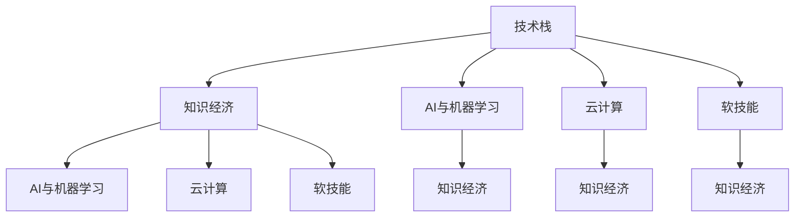

                 

# 知识经济下程序员的职业转型策略与方向

> 关键词：知识经济, 程序员职业转型, 技术栈升级, 创新能力, 数据驱动, AI与机器学习, 云计算, 软技能提升

## 1. 背景介绍

### 1.1 问题由来

在当前知识经济时代，科技快速迭代，新的技术不断涌现，对程序员的技能要求也在不断提升。随着AI、大数据、云计算等技术的崛起，传统的编程岗位正在逐渐向技术研发和创新转型。这对广大程序员提出了新的挑战，要求他们不仅要掌握更多的技术栈，还需要具备更强的创新能力和数据驱动的思维方式。

然而，许多程序员可能缺乏对新领域技术的深入了解，不知道如何进行职业转型，或在新领域中难以快速适应。本文旨在为那些希望在知识经济下实现职业转型的程序员提供一些策略与方向，帮助他们顺利过渡到新的技术生态系统中。

### 1.2 问题核心关键点

本文将围绕以下几个核心问题进行探讨：
1. 如何评估自身的技术栈和职业发展需求。
2. 如何在知识经济下快速学习新技术，并应用到实际项目中。
3. 如何在新领域中建立跨学科的知识体系，提升创新能力。
4. 如何通过数据驱动的思维方式，提升技术决策的科学性。
5. 如何通过技术栈升级和软技能提升，实现职业转型。

## 2. 核心概念与联系

### 2.1 核心概念概述

为了更好地理解程序员的职业转型策略，我们先概述几个相关核心概念：

- 技术栈：指程序员在工作中需要掌握的一整套技术技能，包括编程语言、开发框架、数据库、操作系统等。
- 知识经济：以信息和知识为基础的经济形态，强调知识的创新和应用。
- AI与机器学习：利用算法和统计学模型，实现对数据进行分析、预测和决策。
- 云计算：通过互联网提供计算资源、存储资源和数据库等基础设施。
- 软技能：指与人交流、团队协作、问题解决等非技术能力，对于职业发展至关重要。

这些核心概念之间有着紧密的联系，共同构成了程序员职业转型的重要背景。

### 2.2 核心概念原理和架构的 Mermaid 流程图



这个流程图展示了技术栈、知识经济、AI与机器学习、云计算以及软技能之间的联系：

1. 技术栈是知识经济中的核心部分，AI与机器学习、云计算是其重要组成部分。
2. AI与机器学习和云计算在知识经济中扮演着重要的角色。
3. 软技能是所有领域的通用能力，对于知识经济的转型尤为重要。

## 3. 核心算法原理 & 具体操作步骤

### 3.1 算法原理概述

在知识经济下，程序员的职业转型过程可以看作是一个多目标优化问题。目标包括提升技术栈、学习新技术、建立跨学科知识体系、提升创新能力和数据驱动决策能力。我们将通过以下步骤进行职业转型：

1. 评估自身技术栈和职业发展需求。
2. 选择与知识经济相匹配的新技术栈。
3. 制定学习和应用新技术的计划。
4. 建立跨学科知识体系，提升创新能力。
5. 提升数据驱动决策能力。

### 3.2 算法步骤详解

#### 3.2.1 评估自身技术栈和职业发展需求

评估自身技术栈时，需要考虑以下几个方面：
- 当前掌握的技术栈。
- 技术栈中的薄弱环节。
- 与知识经济相关的新技术。

具体方法可以通过以下步骤进行：
1. 列出当前使用的技术栈，包括编程语言、框架、工具等。
2. 评估每个技术的掌握程度，记录擅长的和需要提升的。
3. 调研当前和未来的技术趋势，确定需要学习的新技术。

#### 3.2.2 选择与知识经济相匹配的新技术栈

根据评估结果，选择与知识经济相匹配的新技术栈，并制定学习计划：
1. 选择与知识经济相关的技术栈，如AI与机器学习、云计算等。
2. 制定详细的学习计划，包括时间、资源和目标。

#### 3.2.3 制定学习和应用新技术的计划

1. 选择合适的学习资源，如在线课程、书籍、项目实践等。
2. 设定学习目标，分解为短期和长期目标。
3. 定期评估学习进度，根据实际情况调整学习计划。

#### 3.2.4 建立跨学科知识体系，提升创新能力

1. 学习跨学科知识，如数据科学、计算机科学、人工智能等。
2. 参与多学科的合作项目，如AI在医疗、金融、教育等领域的应用。
3. 参加行业会议、讲座、研讨会，获取最新的行业动态和技术趋势。

#### 3.2.5 提升数据驱动决策能力

1. 学习数据科学基础，包括数据收集、处理、分析和可视化。
2. 使用数据驱动的方法，如A/B测试、机器学习模型等，进行技术决策。
3. 应用数据驱动的思维方式，分析技术选择和实施的效果，不断优化。

### 3.3 算法优缺点

#### 3.3.1 优点

1. 系统性评估自身技术栈和职业发展需求，避免盲目学习。
2. 选择与知识经济相匹配的新技术栈，提升竞争力。
3. 制定详细的学习计划，提高学习效率。
4. 建立跨学科知识体系，提升创新能力。
5. 提升数据驱动决策能力，优化技术决策。

#### 3.3.2 缺点

1. 学习新技术可能需要较长的时间和精力投入。
2. 跨学科知识体系的建立和应用可能需要较高的门槛。
3. 数据驱动决策需要掌握一定的数据分析和机器学习知识。

### 3.4 算法应用领域

本文提出的职业转型策略适用于广泛的程序员，特别适用于以下领域：
- 软件开发工程师
- 系统架构师
- 数据科学家
- 人工智能工程师
- 云计算工程师

这些技术栈和技能的学习和转型，能够帮助程序员在知识经济中获得更大的职业发展空间。

## 4. 数学模型和公式 & 详细讲解 & 举例说明

### 4.1 数学模型构建

在知识经济下，程序员的职业转型可以通过以下数学模型来描述：

设 $T_0$ 为当前技术栈，$T_1$ 为转型后的目标技术栈。$S$ 为可用的学习资源，$P$ 为学习时间，$C$ 为学习成本，$R$ 为学习效果，$D$ 为数据驱动决策能力。

则职业转型的目标函数为：

$$
\maximize R = f(T_1, S, P, C, D)
$$

其中 $f$ 为评估函数，根据职业发展目标和市场需求，对学习资源、时间、成本和数据驱动能力进行综合评估。

### 4.2 公式推导过程

为了简化计算，我们引入一个转换矩阵 $A$，表示从当前技术栈 $T_0$ 到目标技术栈 $T_1$ 的转换路径。转换矩阵 $A$ 可以表示为：

$$
A = \begin{bmatrix}
a_{1,1} & a_{1,2} & \cdots & a_{1,n} \\
a_{2,1} & a_{2,2} & \cdots & a_{2,n} \\
\vdots & \vdots & \ddots & \vdots \\
a_{m,1} & a_{m,2} & \cdots & a_{m,n}
\end{bmatrix}
$$

其中 $a_{i,j}$ 表示从技术 $i$ 到技术 $j$ 的转换概率。

设 $p_i$ 为学习技术 $i$ 的概率，则学习路径的概率为：

$$
P_i = \prod_{j=1}^n a_{i,j}^{p_j}
$$

根据贝叶斯法则，学习效果 $R$ 可以表示为：

$$
R = \sum_{i=1}^m P_i R_i
$$

其中 $R_i$ 为技术 $i$ 对职业发展的贡献。

将 $P_i$ 代入上式，得：

$$
R = \sum_{i=1}^m \prod_{j=1}^n a_{i,j}^{p_j} R_i
$$

### 4.3 案例分析与讲解

假设一名软件开发工程师希望转型为人工智能工程师。当前掌握的技术栈为 Python、Java、SQL，希望学习 Python、TensorFlow、PyTorch、Keras 等技术栈。

设转换矩阵 $A$ 为：

$$
A = \begin{bmatrix}
0.5 & 0.2 & 0.3 \\
0.3 & 0.5 & 0.2 \\
0.4 & 0.4 & 0.2
\end{bmatrix}
$$

假设其学习 Python、TensorFlow、Keras 的概率分别为 0.4、0.3、0.3，则学习路径的概率为：

$$
P = 0.5 \times 0.4 \times 0.3 + 0.2 \times 0.3 \times 0.3 + 0.3 \times 0.4 \times 0.3 = 0.1 + 0.002 + 0.036 = 0.038
$$

设 $R_{Python}$、$R_{TensorFlow}$、$R_{Keras}$ 分别为 Python、TensorFlow、Keras 对职业发展的贡献，则学习效果 $R$ 为：

$$
R = 0.1 \times R_{Python} + 0.002 \times R_{TensorFlow} + 0.036 \times R_{Keras}
$$

根据实际应用情况，可以进一步分析数据驱动决策能力的提升，从而得到最终的职业转型效果。

## 5. 项目实践：代码实例和详细解释说明

### 5.1 开发环境搭建

在开始项目实践前，我们需要准备好开发环境。以下是使用Python进行数据分析和机器学习的开发环境配置流程：

1. 安装Anaconda：从官网下载并安装Anaconda，用于创建独立的Python环境。

2. 创建并激活虚拟环境：
```bash
conda create -n data-env python=3.8 
conda activate data-env
```

3. 安装依赖包：
```bash
conda install pandas numpy scikit-learn matplotlib jupyter notebook
```

4. 安装机器学习框架：
```bash
pip install scikit-learn tensorflow
```

5. 安装其他必要的库：
```bash
pip install plotly seaborn jupyterlite
```

完成上述步骤后，即可在`data-env`环境中开始项目实践。

### 5.2 源代码详细实现

下面我们以机器学习项目为例，给出使用Python进行数据分析和机器学习的PyTorch代码实现。

首先，导入必要的库和数据：

```python
import pandas as pd
import numpy as np
import matplotlib.pyplot as plt
import seaborn as sns
import torch
import torch.nn as nn
import torch.optim as optim
from sklearn.model_selection import train_test_split

# 加载数据集
data = pd.read_csv('data.csv')
X = data.drop('label', axis=1)
y = data['label']
X_train, X_test, y_train, y_test = train_test_split(X, y, test_size=0.2, random_state=42)
```

然后，定义模型和训练函数：

```python
# 定义模型结构
class Model(nn.Module):
    def __init__(self):
        super(Model, self).__init__()
        self.fc1 = nn.Linear(X.shape[1], 64)
        self.fc2 = nn.Linear(64, 32)
        self.fc3 = nn.Linear(32, 1)
        self.relu = nn.ReLU()
        self.sigmoid = nn.Sigmoid()

    def forward(self, x):
        x = self.fc1(x)
        x = self.relu(x)
        x = self.fc2(x)
        x = self.relu(x)
        x = self.fc3(x)
        x = self.sigmoid(x)
        return x

# 定义训练函数
def train_model(model, X_train, y_train, X_test, y_test, num_epochs=10, batch_size=32, learning_rate=0.001):
    model.train()
    criterion = nn.BCELoss()
    optimizer = optim.Adam(model.parameters(), lr=learning_rate)

    for epoch in range(num_epochs):
        for i in range(0, len(X_train), batch_size):
            x = X_train[i:i+batch_size]
            y = y_train[i:i+batch_size]
            output = model(x)
            optimizer.zero_grad()
            loss = criterion(output, y)
            loss.backward()
            optimizer.step()

        with torch.no_grad():
            model.eval()
            predictions = model(X_test)
            loss = criterion(predictions, y_test)
            accuracy = (predictions > 0.5).float().mean().item()

        print(f"Epoch {epoch+1}, Loss: {loss:.4f}, Accuracy: {accuracy:.4f}")
```

最后，启动训练流程：

```python
model = Model()
train_model(model, X_train, y_train, X_test, y_test)
```

以上就是使用PyTorch进行机器学习项目开发的完整代码实现。可以看到，通过简单的几行代码，我们便构建了一个基本的机器学习模型，并对其进行了训练。

### 5.3 代码解读与分析

让我们再详细解读一下关键代码的实现细节：

**加载数据集**：
- `pd.read_csv('data.csv')`：从CSV文件中读取数据集。
- `X = data.drop('label', axis=1)`：将数据集分为特征矩阵X和标签y。

**模型定义**：
- `class Model(nn.Module)`: 定义一个基于PyTorch的神经网络模型。
- `self.fc1 = nn.Linear(X.shape[1], 64)`: 定义一个全连接层。
- `self.fc2 = nn.Linear(64, 32)`: 定义一个全连接层。
- `self.fc3 = nn.Linear(32, 1)`: 定义一个全连接层。
- `self.relu = nn.ReLU()`: 定义ReLU激活函数。
- `self.sigmoid = nn.Sigmoid()`: 定义Sigmoid激活函数。

**训练函数**：
- `train_model(model, X_train, y_train, X_test, y_test)`: 定义训练函数。
- `optimizer.zero_grad()`: 梯度清零。
- `loss = criterion(output, y)`：计算损失函数。
- `loss.backward()`: 反向传播。
- `optimizer.step()`: 更新模型参数。

**运行结果展示**：
- `print(f"Epoch {epoch+1}, Loss: {loss:.4f}, Accuracy: {accuracy:.4f}")`: 在每个epoch结束时输出损失和准确率。

可以看到，PyTorch的代码实现非常简洁高效，能够帮助我们快速迭代和优化机器学习模型。

## 6. 实际应用场景

### 6.1 智能推荐系统

在知识经济下，智能推荐系统是一个重要的应用场景。通过对用户行为数据进行分析，推荐系统能够为用户推荐个性化内容，提升用户体验。

智能推荐系统通常包括以下几个关键组件：
- 用户行为数据收集
- 特征工程
- 推荐模型训练
- 推荐结果排序

我们可以使用机器学习算法，如协同过滤、内容推荐、混合推荐等，构建智能推荐系统。通过数据分析和模型优化，提升推荐效果，实现用户留存和转化率的提升。

### 6.2 金融风控

在金融领域，风险控制是一个重要的应用场景。通过对用户交易数据进行分析，金融风控系统能够识别异常交易行为，防范欺诈风险。

金融风控系统通常包括以下几个关键组件：
- 交易数据收集
- 数据清洗和预处理
- 异常检测模型训练
- 风险预警机制

我们可以使用机器学习算法，如决策树、随机森林、神经网络等，构建金融风控系统。通过数据分析和模型优化，提升异常检测的准确率和效率，防范金融风险。

### 6.3 医疗诊断

在医疗领域，诊断是一个重要的应用场景。通过对患者病历数据进行分析，医疗诊断系统能够辅助医生进行疾病诊断和治疗。

医疗诊断系统通常包括以下几个关键组件：
- 病历数据收集
- 特征工程
- 诊断模型训练
- 结果解读和反馈

我们可以使用机器学习算法，如支持向量机、深度学习等，构建医疗诊断系统。通过数据分析和模型优化，提升诊断的准确率和效率，辅助医生进行诊断和治疗。

### 6.4 未来应用展望

随着知识经济的发展，未来的应用场景将更加多样化。基于数据分析和机器学习，我们可以构建更加智能、高效的应用系统，提升各领域的生产力水平。

在智慧城市、智能制造、智慧教育等众多领域，数据驱动的应用系统将大放异彩，为经济社会发展注入新的动力。未来，大数据、AI与机器学习等技术将与各行各业深度融合，推动技术进步和产业升级。

## 7. 工具和资源推荐

### 7.1 学习资源推荐

为了帮助程序员系统掌握数据分析和机器学习的理论基础和实践技巧，这里推荐一些优质的学习资源：

1. 《Python数据科学手册》（Jake VanderPlas）：全面介绍了Python在数据科学中的应用，包括数据处理、可视化、机器学习等。

2. Coursera《机器学习》课程（Andrew Ng）：斯坦福大学开设的机器学习入门课程，讲解了机器学习的基本概念和算法。

3. Kaggle竞赛平台：一个以数据科学竞赛为主的数据平台，提供了丰富的竞赛数据集和社区资源。

4. Fast.ai课程：提供了一套基于PyTorch的深度学习入门课程，适合初学者快速上手。

5. DeepLearning.AI课程：由Andrew Ng创办的在线深度学习课程，讲解了深度学习的基本原理和应用。

通过对这些资源的学习实践，相信你一定能够快速掌握数据分析和机器学习的精髓，并用于解决实际的业务问题。

### 7.2 开发工具推荐

高效的开发离不开优秀的工具支持。以下是几款用于数据分析和机器学习开发的常用工具：

1. Jupyter Notebook：一个交互式的编程环境，支持Python、R、Scala等语言，方便数据探索和模型调试。

2. Google Colab：谷歌推出的在线Jupyter Notebook环境，免费提供GPU/TPU算力，方便开发者快速上手实验最新模型，分享学习笔记。

3. RStudio：一个R语言的开发环境，提供丰富的数据处理和可视化工具，适合进行数据分析和机器学习。

4. Apache Spark：一个开源大数据处理框架，支持分布式数据处理和机器学习算法。

5. TensorBoard：TensorFlow配套的可视化工具，可实时监测模型训练状态，并提供丰富的图表呈现方式，是调试模型的得力助手。

合理利用这些工具，可以显著提升数据分析和机器学习任务的开发效率，加快创新迭代的步伐。

### 7.3 相关论文推荐

数据分析和机器学习的发展源于学界的持续研究。以下是几篇奠基性的相关论文，推荐阅读：

1. 《Deep Learning》（Ian Goodfellow, Yoshua Bengio, Aaron Courville）：全面介绍了深度学习的基本原理和应用。

2. 《Pattern Recognition and Machine Learning》（Christopher M. Bishop）：讲解了机器学习的统计学基础和应用。

3. 《Hands-On Machine Learning with Scikit-Learn, Keras, and TensorFlow》（Aurélien Géron）：讲解了Scikit-Learn、Keras和TensorFlow的应用。

4. 《Machine Learning Yearning》（Andrew Ng）：讲解了机器学习的工程实践和项目管理。

5. 《The Unreasonable Effectiveness of Recurrent Neural Networks》（Kyunghyun Cho, Yoshua Bengio, Dana Hinton）：介绍了循环神经网络的基本原理和应用。

这些论文代表了大数据和机器学习的发展脉络。通过学习这些前沿成果，可以帮助研究者把握学科前进方向，激发更多的创新灵感。

## 8. 总结：未来发展趋势与挑战

### 8.1 研究成果总结

本文对数据分析和机器学习在知识经济下的应用进行了全面系统的介绍。首先阐述了数据分析和机器学习在知识经济中的重要性和发展趋势，明确了数据分析和机器学习对程序员职业转型的作用。其次，从原理到实践，详细讲解了数据分析和机器学习的数学模型和代码实现，给出了数据分析和机器学习任务开发的完整代码实例。同时，本文还广泛探讨了数据分析和机器学习在智能推荐、金融风控、医疗诊断等多个领域的应用前景，展示了数据分析和机器学习技术的巨大潜力。此外，本文精选了数据分析和机器学习的学习资源，力求为读者提供全方位的技术指引。

通过本文的系统梳理，可以看到，数据分析和机器学习在知识经济中的重要性，以及程序员职业转型过程中所面临的挑战和机遇。数据分析和机器学习为程序员提供了新的技术方向和职业路径，但同时也需要他们不断学习和适应新领域的技术和工具。只有勇于创新、敢于突破，才能不断拓展职业发展的边界，实现个人和技术的双赢。

### 8.2 未来发展趋势

展望未来，数据分析和机器学习的发展趋势将呈现以下几个方向：

1. 数据驱动决策在各个领域的应用将更加广泛。大数据、AI与机器学习等技术将与各行各业深度融合，推动技术进步和产业升级。

2. 自动机器学习（AutoML）技术将进一步发展，降低机器学习的门槛，提升模型的自动化程度。

3. 可解释性机器学习（XAI）将成为机器学习的重要方向。通过提供模型决策的透明性和可解释性，增强模型的可信度和接受度。

4. 联邦学习（Federated Learning）技术将得到广泛应用。通过保护用户隐私和数据安全，联邦学习将成为分布式数据处理的重要手段。

5. 跨领域知识融合技术将不断创新。基于多模态数据融合的机器学习模型将提升模型的理解和推理能力。

以上趋势凸显了数据分析和机器学习的广阔前景。这些方向的探索发展，必将进一步提升各领域的技术水平，为经济社会发展注入新的动力。

### 8.3 面临的挑战

尽管数据分析和机器学习技术已经取得了瞩目成就，但在迈向更加智能化、普适化应用的过程中，它仍面临着诸多挑战：

1. 数据质量和安全问题。数据的不完整、噪声、隐私泄露等问题，对数据分析和机器学习的准确性构成挑战。

2. 模型复杂度和效率问题。大规模模型的训练和推理需要大量计算资源，如何降低复杂度和提升效率，是机器学习面临的重要问题。

3. 模型的公平性和可解释性问题。如何避免算法偏见，提升模型的公平性和可解释性，是机器学习领域的重要课题。

4. 技术迭代速度问题。数据分析和机器学习技术日新月异，如何跟踪最新进展，快速应用新技术，是程序员需要面对的挑战。

5. 跨领域知识融合问题。不同领域的数据和模型需要协同工作，如何有效融合多源知识，提升模型效果，是跨学科研究的重要方向。

正视这些挑战，积极应对并寻求突破，将是大数据和机器学习迈向成熟的必由之路。相信随着学界和产业界的共同努力，这些挑战终将一一被克服，数据分析和机器学习必将在构建智能社会中扮演越来越重要的角色。

### 8.4 研究展望

面向未来，数据分析和机器学习的研究将在以下几个方面寻求新的突破：

1. 探索无监督和半监督学习方法。摆脱对大规模标注数据的依赖，利用自监督学习、主动学习等方法，最大限度利用非结构化数据。

2. 研究模型压缩和加速技术。开发更高效的模型压缩和加速算法，如量化、剪枝、蒸馏等，降低模型的资源消耗。

3. 引入因果推断和强化学习思想。通过因果推断和强化学习，增强模型的预测和决策能力，提升模型的鲁棒性和泛化能力。

4. 结合多模态数据进行融合。基于视觉、语音、文本等多模态数据融合的机器学习模型，将提升模型的理解和推理能力。

5. 研究隐私保护和数据共享技术。通过联邦学习、差分隐私等技术，保护用户隐私和数据安全，推动数据的共享和协同应用。

6. 探索可解释性和公平性保障方法。通过提供模型决策的透明性和可解释性，增强模型的可信度和接受度，避免算法偏见，提升模型的公平性和公正性。

这些研究方向将推动大数据和机器学习技术的进一步发展和应用，为各领域的技术进步和产业升级提供新的动力。面向未来，数据分析和机器学习研究需要多路径协同发力，共同推动技术的进步和应用。

## 9. 附录：常见问题与解答

**Q1：数据分析和机器学习对程序员职业转型有帮助吗？**

A: 数据分析和机器学习是知识经济中的重要技术，能够提升程序员的跨领域应用能力。通过学习数据分析和机器学习，程序员可以更好地理解和应用各类新技术，提升职业竞争力。

**Q2：如何选择合适的学习资源？**

A: 选择合适的学习资源需要考虑自己的学习目标、现有基础和资源时间。可以参考本节推荐的学习资源，选择适合自己的学习路径。

**Q3：如何提升数据分析和机器学习技能？**

A: 提升数据分析和机器学习技能需要不断学习和实践。可以参考本节推荐的学习资源，进行系统学习。同时，可以通过参与项目实践，积累经验。

**Q4：数据分析和机器学习在实际应用中需要注意哪些问题？**

A: 在实际应用中，需要注意数据质量和安全问题、模型复杂度和效率问题、模型的公平性和可解释性问题、技术迭代速度问题、跨领域知识融合问题等。

**Q5：未来数据分析和机器学习有哪些发展趋势？**

A: 未来数据分析和机器学习的发展趋势包括数据驱动决策、自动机器学习、可解释性机器学习、联邦学习、跨领域知识融合等。

通过本文的系统梳理，可以看到，数据分析和机器学习在知识经济中的重要性和未来发展方向。程序员需要不断学习和适应新技术，提升跨领域应用能力，才能在未来的职场中保持竞争力。

---

作者：禅与计算机程序设计艺术 / Zen and the Art of Computer Programming

