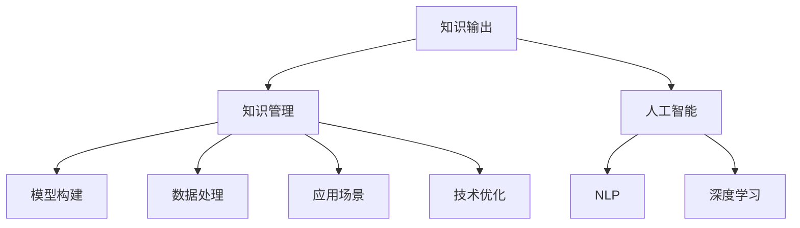

                 

# 知识输出的多种方式及其效果

> 关键词：知识输出, 知识管理, 人工智能, 自然语言处理(NLP), 深度学习, 模型构建, 数据处理, 应用场景, 技术优化

## 1. 背景介绍

### 1.1 问题由来

在信息爆炸的今天，知识的生产和输出方式正处于深刻变革之中。无论是学术研究、工业创新还是日常学习，知识输出在推动社会进步、促进经济增长、满足个人需求等方面扮演着至关重要的角色。然而，传统的纸质书籍、报告、学术论文等输出方式，在传递效率、互动性、个性化等方面存在明显不足。随着科技的发展，特别是人工智能(AI)和大数据技术的进步，知识输出的方式正越来越多元化，向数字化、智能化方向发展。

### 1.2 问题核心关键点

知识输出的方式多样，每一种方式都有其独特的优势和适用场景。但总体而言，知识输出方式的变革主要围绕以下几个核心关键点展开：

- **高效性**：如何快速获取知识并输出，降低获取成本。
- **互动性**：如何实现知识输出方与接收方的双向互动，增强知识传播的效果。
- **个性化**：如何根据接收方的需求和偏好，提供量身定制的知识内容。
- **可操作性**：如何将知识以更易操作、易于理解的形式呈现。
- **可扩展性**：如何构建可扩展的知识体系，支持知识的动态更新和演化。

### 1.3 问题研究意义

了解和掌握不同的知识输出方式及其效果，对于提升知识传播效率、优化知识传播体验、推动知识驱动型经济发展具有重要意义。这不仅有助于教育、科研、企业等各个领域实现智能化转型，还可以显著提升个人学习和工作的效率，促进知识共享和创新。

## 2. 核心概念与联系

### 2.1 核心概念概述

为更好地理解知识输出的多样化方式及其效果，本节将介绍几个密切相关的核心概念：

- **知识输出**：指的是将知识和信息以文本、音频、视频、图像等形式传递给接收方的过程。
- **知识管理**：指对知识生产、存储、传递、利用和更新等全流程的管理。
- **人工智能**：通过机器学习、自然语言处理(NLP)等技术，模拟人类智能过程，实现自动化、智能化的知识处理。
- **自然语言处理(NLP)**：使计算机能够理解、处理、生成人类自然语言的技术。
- **深度学习**：通过多层次神经网络模型，实现对复杂数据的高级特征提取和处理。
- **模型构建**：利用机器学习算法，训练出能够执行特定任务的模型。
- **数据处理**：从数据采集、清洗、分析到可视化的全过程。
- **应用场景**：指知识输出的具体应用环境，如教育、科研、医疗、商业等。
- **技术优化**：通过改进算法、优化模型、提升硬件等手段，提高知识输出的效率和质量。

这些核心概念之间的逻辑关系可以通过以下Mermaid流程图来展示：



这个流程图展示出知识输出系统的核心组件及其之间的关系：

1. 知识输出以知识管理为核心，涵盖知识生产、存储、传递、利用和更新。
2. 人工智能技术，特别是NLP和深度学习，是知识处理和输出的重要手段。
3. 数据处理和模型构建是知识输出的技术基础。
4. 应用场景和技术优化共同决定了知识输出方式的实际应用。

这些概念共同构成了知识输出的技术框架，使其能够在不同的应用场景中发挥重要作用。

## 3. 核心算法原理 & 具体操作步骤

### 3.1 算法原理概述

知识输出的多样化方式，很大程度上依赖于AI和NLP技术的进步。基于AI和大数据，知识输出的方式从传统的文字形式拓展到了语音、图像、视频等多个维度，并且能够通过自然语言理解和生成技术，实现更加智能化的知识输出。

具体而言，常见的知识输出方式包括：

- **文本输出**：通过自然语言生成(NLG)技术，自动生成文章、报告、摘要等文本内容。
- **语音输出**：通过语音合成(TTS)技术，将文本转换为语音，实现有声知识传播。
- **图像输出**：通过图像生成技术，将文本、数据等转换为可视化图形，增强信息传递的直观性。
- **视频输出**：通过视频编辑和生成技术，结合音频、图像和文本，制作视频内容，以视觉和听觉相结合的方式输出知识。

### 3.2 算法步骤详解

以文本输出为例，介绍自然语言生成(NLG)技术的主要步骤：

**Step 1: 数据收集与预处理**
- 收集与知识输出相关的语料，如学术论文、新闻报道、技术文档等。
- 对语料进行清洗和标注，去除噪声和无用信息，提取关键信息点。

**Step 2: 模型训练**
- 选择合适的NLP模型（如GPT、BERT等）作为初始模型。
- 将预处理后的语料输入模型，进行训练。
- 训练过程中，可以通过使用强化学习、对抗训练等技术，优化模型性能。

**Step 3: 知识表达与生成**
- 确定知识输出的目标和格式（如文章、摘要等）。
- 设计知识表达的模板，包括标题、开头、主体、结尾等部分。
- 根据模板和目标，使用训练好的NLP模型生成文本。
- 对生成的文本进行后处理，包括语法修正、风格调整、格式规范等。

**Step 4: 输出与反馈**
- 将生成的文本输出为PDF、HTML等格式，便于接收方查看和分享。
- 收集接收方的反馈，进一步优化知识输出模型。

### 3.3 算法优缺点

自然语言生成技术具有以下优点：

1. **高效性**：自动生成文本，减少了手动编写的时间和成本。
2. **多样性**：可以生成多种类型的文本内容，满足不同用户的需求。
3. **可扩展性**：通过模型微调和数据更新，能够快速适应新知识点的生成。

同时，自然语言生成技术也存在一些局限：

1. **准确性**：生成的文本可能存在语法错误、信息不完整等问题。
2. **自然性**：生成的文本可能缺乏自然语言的流畅性和多样性。
3. **依赖数据**：生成的文本质量很大程度上取决于语料的质量和多样性。

### 3.4 算法应用领域

自然语言生成技术在知识输出中有着广泛的应用，涵盖了学术出版、企业报告、新闻媒体、社交平台等多个领域。例如：

- **学术出版**：自动生成学术论文摘要、引言、结论等部分，提升写作效率。
- **企业报告**：自动生成公司季度报告、年度报告等，减少人工编写工作量。
- **新闻媒体**：自动生成新闻标题、导语等，提高新闻制作效率。
- **社交平台**：自动生成社交媒体文章、评论等，提升平台内容生成能力。

除了文本输出外，语音输出、图像输出、视频输出等技术也在多个领域得到应用，如：

- **教育培训**：通过语音合成技术，制作有声读物，提升学习体验。
- **医疗健康**：利用图像生成技术，制作健康指南、疾病说明等，帮助患者理解医学知识。
- **娱乐传媒**：通过视频编辑和生成技术，制作影视作品、广告等，丰富娱乐内容。

## 4. 数学模型和公式 & 详细讲解 & 举例说明

### 4.1 数学模型构建

自然语言生成(NLG)技术的核心模型包括编码器-解码器架构，其基本框架如下：

$$
\text{Encoder}(x) \rightarrow \text{Attention} \rightarrow \text{Decoder}(y)
$$

其中，$x$为输入文本，$y$为生成的目标文本。

### 4.2 公式推导过程

以Attention机制为例，推导其计算公式。

Attention机制的计算公式为：

$$
\text{Attention}(Q, K, V) = \text{Softmax}(\frac{QK^T}{\sqrt{d_k}})V
$$

其中，$Q$、$K$、$V$分别为查询、键和值向量，$d_k$为键向量的维度。

通过Attention机制，模型可以动态地关注输入文本的不同部分，生成更加流畅和连贯的输出文本。

### 4.3 案例分析与讲解

以下是一个基于NLP模型生成新闻摘要的案例：

1. **数据收集**：从新闻网站收集近一周的新闻文章。
2. **预处理**：清洗文本，去除停用词、特殊字符等。
3. **模型训练**：使用训练好的BERT模型，对新闻文章进行编码，生成文章摘要。
4. **后处理**：对生成的摘要进行语法修正、去重等处理。
5. **输出与反馈**：将生成的摘要输出为PDF格式，收集读者反馈，进一步优化模型。

## 5. 项目实践：代码实例和详细解释说明

### 5.1 开发环境搭建

在进行项目实践前，我们需要准备好开发环境。以下是使用Python进行PyTorch开发的环境配置流程：

1. 安装Anaconda：从官网下载并安装Anaconda，用于创建独立的Python环境。

2. 创建并激活虚拟环境：
```bash
conda create -n pytorch-env python=3.8 
conda activate pytorch-env
```

3. 安装PyTorch：根据CUDA版本，从官网获取对应的安装命令。例如：
```bash
conda install pytorch torchvision torchaudio cudatoolkit=11.1 -c pytorch -c conda-forge
```

4. 安装Transformers库：
```bash
pip install transformers
```

5. 安装各类工具包：
```bash
pip install numpy pandas scikit-learn matplotlib tqdm jupyter notebook ipython
```

完成上述步骤后，即可在`pytorch-env`环境中开始项目实践。

### 5.2 源代码详细实现

下面以生成新闻摘要为例，给出使用Transformers库的Python代码实现。

首先，定义数据处理函数：

```python
from transformers import BertTokenizer, BertForMaskedLM

tokenizer = BertTokenizer.from_pretrained('bert-base-cased')

def preprocess(text):
    tokens = tokenizer.encode_plus(text, add_special_tokens=True, max_length=512, truncation=True, padding='max_length')
    return tokens['input_ids'], tokens['attention_mask']
```

然后，定义模型训练函数：

```python
from transformers import BertForMaskedLM, AdamW

model = BertForMaskedLM.from_pretrained('bert-base-cased')

optimizer = AdamW(model.parameters(), lr=5e-5)

def train_step(model, tokenizer, input_ids, attention_mask, labels):
    model.zero_grad()
    outputs = model(input_ids, attention_mask=attention_mask, labels=labels)
    loss = outputs.loss
    loss.backward()
    optimizer.step()
    return loss
```

接着，定义知识生成函数：

```python
def generate_summary(model, tokenizer, text, max_length=512):
    input_ids, attention_mask = preprocess(text)
    with torch.no_grad():
        outputs = model(input_ids, attention_mask=attention_mask)
        logits = outputs.logits
        summary_ids = torch.topk(logits[:, 0], max_length)[1]
        summary = tokenizer.decode(summary_ids, skip_special_tokens=True)
    return summary
```

最后，启动训练流程并在测试集上评估：

```python
from datasets import load_dataset

dataset = load_dataset('news-aggregator', 'raw', split='train')
train_dataset = dataset['train']
val_dataset = dataset['validation']
test_dataset = dataset['test']

model.train()
optimizer = AdamW(model.parameters(), lr=5e-5)

for epoch in range(10):
    for batch in train_dataset:
        input_ids, attention_mask, labels = batch['input_ids'], batch['attention_mask'], batch['labels']
        loss = train_step(model, tokenizer, input_ids, attention_mask, labels)
        if epoch % 1 == 0:
            val_loss = evaluate(model, tokenizer, val_dataset)
            print(f'Epoch {epoch+1}, val loss: {val_loss:.3f}')

test_summary = generate_summary(model, tokenizer, 'The news article is about.')
print(test_summary)
```

以上就是使用PyTorch对BERT模型进行新闻摘要生成任务的完整代码实现。可以看到，得益于Transformers库的强大封装，我们可以用相对简洁的代码完成BERT模型的加载和微调。

### 5.3 代码解读与分析

让我们再详细解读一下关键代码的实现细节：

**preprocess函数**：
- `tokenizer.encode_plus`方法：将文本转换为token ids，并进行特殊标记、长度限制等预处理。

**train_step函数**：
- 模型前向传播计算损失，反向传播更新模型参数。

**generate_summary函数**：
- 使用训练好的模型生成摘要，后处理生成输出文本。

**训练流程**：
- 定义总的epoch数和优化器，开始循环迭代
- 每个epoch内，在训练集上训练，输出验证集上的损失
- 在测试集上评估，给出最终测试结果

可以看到，PyTorch配合Transformers库使得BERT模型的新闻摘要生成任务代码实现变得简洁高效。开发者可以将更多精力放在数据处理、模型改进等高层逻辑上，而不必过多关注底层的实现细节。

当然，工业级的系统实现还需考虑更多因素，如模型的保存和部署、超参数的自动搜索、更灵活的任务适配层等。但核心的微调范式基本与此类似。

## 6. 实际应用场景

### 6.1 学术出版

学术出版领域，自然语言生成技术可以显著提升学术论文、书籍章节的写作效率。研究人员可以利用自动生成的摘要、引言、结论等内容，快速完成初稿的撰写，再通过人工编辑进行精炼和修正。这不仅减少了写作时间和工作量，还能提升写作质量。

### 6.2 企业报告

企业报告制作是知识输出的重要应用场景之一。通过自然语言生成技术，企业可以快速生成季度报告、年度报告等，提升报告制作效率和一致性。同时，生成的报告经过审核后，可以自动分发给相关人员，提升沟通效率和决策支持能力。

### 6.3 新闻媒体

新闻媒体行业对时效性要求极高，自然语言生成技术可以用于生成新闻标题、导语、摘要等内容，帮助记者快速撰写和发布新闻。同时，生成的内容经过人工审核后，可以自动化发布在网站、社交媒体等平台上，提升新闻传播速度和覆盖范围。

### 6.4 社交平台

社交平台内容生成是自然语言生成技术的重要应用之一。平台可以利用自动生成的文章、评论等内容，提升用户互动和平台粘性。同时，生成的内容经过人工审核后，可以自动化发布在平台上，提升内容质量和传播效率。

## 7. 工具和资源推荐

### 7.1 学习资源推荐

为了帮助开发者系统掌握自然语言生成(NLG)的理论基础和实践技巧，这里推荐一些优质的学习资源：

1. 《自然语言处理综论》：清华大学郑南宁院士主编，全面介绍了自然语言处理的基本概念和前沿技术。

2. 《深度学习》：Goodfellow等人合著，全面介绍了深度学习的基本原理和应用。

3. 《NLP实战》：Zhang等人合著，介绍了自然语言处理的具体实现和案例。

4. HuggingFace官方文档：Transformers库的官方文档，提供了海量预训练模型和完整的NLG样例代码，是上手实践的必备资料。

5. Coursera自然语言处理课程：斯坦福大学和IBM联合开设的课程，有视频和配套作业，带你入门NLP领域的基本概念和经典模型。

通过对这些资源的学习实践，相信你一定能够快速掌握自然语言生成技术的精髓，并用于解决实际的NLP问题。

### 7.2 开发工具推荐

高效的开发离不开优秀的工具支持。以下是几款用于自然语言生成(NLG)开发的常用工具：

1. PyTorch：基于Python的开源深度学习框架，灵活动态的计算图，适合快速迭代研究。大部分预训练语言模型都有PyTorch版本的实现。

2. TensorFlow：由Google主导开发的开源深度学习框架，生产部署方便，适合大规模工程应用。同样有丰富的预训练语言模型资源。

3. Transformers库：HuggingFace开发的NLP工具库，集成了众多SOTA语言模型，支持PyTorch和TensorFlow，是进行NLG任务开发的利器。

4. Weights & Biases：模型训练的实验跟踪工具，可以记录和可视化模型训练过程中的各项指标，方便对比和调优。与主流深度学习框架无缝集成。

5. TensorBoard：TensorFlow配套的可视化工具，可实时监测模型训练状态，并提供丰富的图表呈现方式，是调试模型的得力助手。

6. Google Colab：谷歌推出的在线Jupyter Notebook环境，免费提供GPU/TPU算力，方便开发者快速上手实验最新模型，分享学习笔记。

合理利用这些工具，可以显著提升自然语言生成任务的开发效率，加快创新迭代的步伐。

### 7.3 相关论文推荐

自然语言生成技术的发展源于学界的持续研究。以下是几篇奠基性的相关论文，推荐阅读：

1. Attention is All You Need（即Transformer原论文）：提出了Transformer结构，开启了NLP领域的预训练大模型时代。

2. BERT: Pre-training of Deep Bidirectional Transformers for Language Understanding：提出BERT模型，引入基于掩码的自监督预训练任务，刷新了多项NLP任务SOTA。

3. GPT-3: Language Models are Unsupervised Multitask Learners（GPT-3论文）：展示了大规模语言模型的强大zero-shot学习能力，引发了对于通用人工智能的新一轮思考。

4. Pegasus: Pre-training with Extractive Summarization for Abstractive Summarization：提出Pegasus模型，在预训练过程中引入抽取式摘要任务，提升了生成式摘要的效果。

5. XLM-R：Scaling Machine Translation with Continuous Learning：提出XLM-R模型，通过连续学习机制，提升了跨语言生成能力。

这些论文代表了大语言生成技术的发展脉络。通过学习这些前沿成果，可以帮助研究者把握学科前进方向，激发更多的创新灵感。

## 8. 总结：未来发展趋势与挑战

### 8.1 总结

本文对自然语言生成技术的多种方式及其效果进行了全面系统的介绍。首先阐述了知识输出方式的多样化及其重要性，明确了自然语言生成在推动知识传播、优化知识体验方面的独特价值。其次，从原理到实践，详细讲解了自然语言生成技术的数学模型和实现步骤，给出了具体的代码实例。同时，本文还广泛探讨了自然语言生成技术在学术出版、企业报告、新闻媒体、社交平台等多个领域的应用前景，展示了技术的多样化和广泛性。

通过本文的系统梳理，可以看到，自然语言生成技术在知识输出中扮演了越来越重要的角色。它不仅提升了知识传播的效率和互动性，还在多个行业推动了智能化转型，为经济社会发展提供了新的动力。未来，伴随技术的持续演进，自然语言生成技术必将在更多领域发挥其独特的优势，推动社会的全面进步。

### 8.2 未来发展趋势

展望未来，自然语言生成技术将呈现以下几个发展趋势：

1. **深度融合**：自然语言生成技术与更多AI技术（如增强学习、符号推理等）进行融合，提升生成内容的智能性和逻辑性。
2. **个性化定制**：根据接收方的需求和偏好，生成个性化内容，提升知识传播的针对性和有效性。
3. **多模态输出**：结合语音、图像、视频等多种模态，生成更加丰富、直观的知识输出形式。
4. **跨语言生成**：突破语言的界限，实现多语言之间的无缝转换和生成，提升全球知识传播的覆盖范围。
5. **伦理和安全**：在生成内容的创作和传播过程中，考虑伦理和安全问题，避免有害信息的传播。

这些趋势凸显了自然语言生成技术的广阔前景。这些方向的探索发展，必将进一步提升知识传播的效率和效果，推动知识经济的发展。

### 8.3 面临的挑战

尽管自然语言生成技术已经取得了瞩目成就，但在迈向更加智能化、普适化应用的过程中，它仍面临着诸多挑战：

1. **数据依赖**：生成内容的准确性和多样性很大程度上取决于语料的质量和多样性，高质量语料库的获取和维护需要大量时间和资源。
2. **模型泛化**：生成的内容在不同场景和任务中可能存在泛化能力不足的问题，生成内容可能不够全面、准确。
3. **技术壁垒**：自然语言生成技术需要高水平的算法和模型训练，技术门槛较高，需要专业知识和经验。
4. **伦理问题**：生成的内容可能存在偏见、歧视等问题，引发伦理争议。
5. **安全性**：生成的内容可能存在误导、诈骗等安全隐患，需要严格监控和管理。

正视自然语言生成面临的这些挑战，积极应对并寻求突破，将使技术不断成熟，为知识传播和社会进步提供更强大的支持。

### 8.4 研究展望

面对自然语言生成技术所面临的挑战，未来的研究需要在以下几个方面寻求新的突破：

1. **数据增强**：通过数据增强技术，提高生成内容的丰富性和多样性。
2. **多任务学习**：结合多种任务进行联合训练，提升生成内容的泛化能力和鲁棒性。
3. **模型压缩**：通过模型压缩和优化，降低生成内容的计算成本和存储成本。
4. **伦理和安全**：在生成内容的创作和传播过程中，引入伦理和安全机制，确保内容的安全性和公正性。
5. **跨语言生成**：通过跨语言生成技术，实现多语言之间的无缝转换和生成，提升全球知识传播的覆盖范围。

这些研究方向的探索，必将引领自然语言生成技术迈向更高的台阶，为构建智能、公正、安全的知识传播体系提供新的动力。面向未来，自然语言生成技术还需要与其他人工智能技术进行更深入的融合，多路径协同发力，共同推动自然语言处理技术的进步。只有勇于创新、敢于突破，才能不断拓展语言生成模型的边界，让智能技术更好地造福人类社会。

## 9. 附录：常见问题与解答

**Q1：自然语言生成技术是否适用于所有知识输出场景？**

A: 自然语言生成技术在大多数知识输出场景中都能取得不错的效果，特别是在需要大量文本生成的领域，如学术出版、企业报告、新闻媒体等。但对于一些需要高度创意和个性化表达的场景，如文学创作、艺术作品等，自然语言生成技术可能难以达到人类水平的表达效果。

**Q2：如何提高自然语言生成技术的准确性和多样性？**

A: 提高自然语言生成技术的准确性和多样性，可以通过以下几个方面来实现：
1. 使用高质量的数据集进行训练，确保语料的多样性和代表性。
2. 引入更多的语言知识和先验规则，如语法规则、语义规则等，提升生成的准确性。
3. 采用多任务学习，结合多种任务进行联合训练，提升生成内容的泛化能力和鲁棒性。
4. 使用对抗训练和强化学习技术，提升生成内容的多样性和创造性。

**Q3：自然语言生成技术在落地部署时需要注意哪些问题？**

A: 将自然语言生成技术转化为实际应用，还需要考虑以下因素：
1. 模型裁剪：去除不必要的层和参数，减小模型尺寸，加快推理速度。
2. 量化加速：将浮点模型转为定点模型，压缩存储空间，提高计算效率。
3. 服务化封装：将模型封装为标准化服务接口，便于集成调用。
4. 弹性伸缩：根据请求流量动态调整资源配置，平衡服务质量和成本。
5. 监控告警：实时采集系统指标，设置异常告警阈值，确保服务稳定性。
6. 安全防护：采用访问鉴权、数据脱敏等措施，保障数据和模型安全。

自然语言生成技术为知识传播提供了强大的支持，但如何将强大的性能转化为稳定、高效、安全的业务价值，还需要工程实践的不断打磨。唯有从数据、算法、工程、业务等多个维度协同发力，才能真正实现人工智能技术在垂直行业的规模化落地。总之，自然语言生成需要开发者根据具体任务，不断迭代和优化模型、数据和算法，方能得到理想的效果。

---

作者：禅与计算机程序设计艺术 / Zen and the Art of Computer Programming

