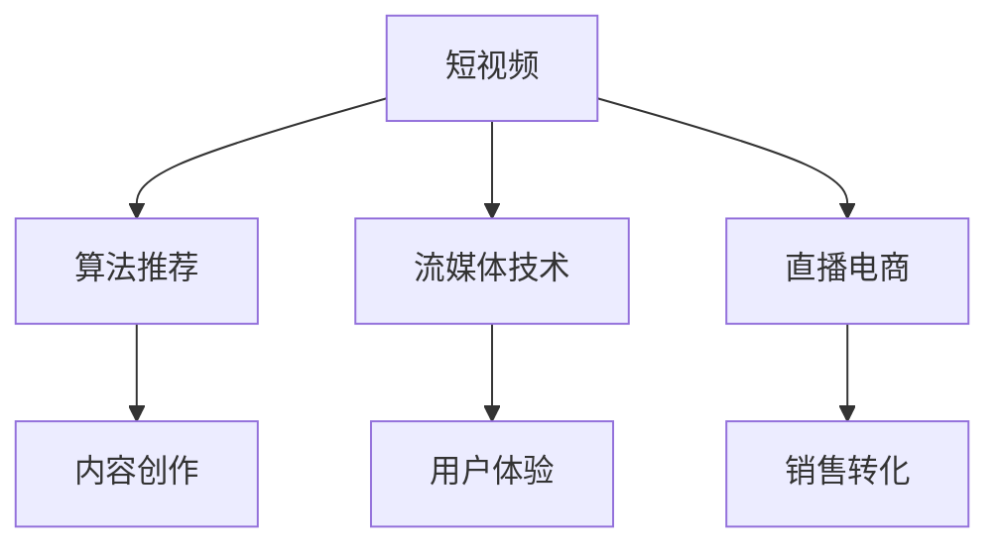

                 

## 1. 背景介绍

随着移动互联网的迅猛发展，短视频以其独特的内容形式和互动性，迅速成为人们获取信息和娱乐的主要方式之一。短视频平台如抖音、快手、哔哩哔哩等，不仅吸引了数亿用户，还催生了大量的内容创业机会。相较于传统的文字和图片内容，短视频更能吸引用户的注意力，也更容易被分享传播，具有更强的商业价值。

短视频的兴起，标志着信息传播方式从文本向影像的革命性转变。以往，用户通过阅读长篇文字获取信息，现在可以通过观看短视频快速获得所需内容。短视频还突破了时间和空间的限制，用户可以在任何地点、任何时间观看，极大地提升了内容消费的便利性。

## 2. 核心概念与联系

### 2.1 核心概念概述

为更好地理解短视频内容创业的技术基础，本节将介绍几个关键概念：

- **短视频（Short Video）**：时长通常在15秒到1分钟之间的视频内容。短视频以其短小精悍、快节奏、高互动性等特点，成为信息传播和内容消费的新宠。
- **内容创业（Content创业）**：利用优质内容吸引用户关注和付费，进行商业变现的创业模式。短视频因其巨大的流量和广告空间，成为内容创业的主战场。
- **算法推荐（Recommendation Algorithm）**：根据用户行为和内容特征，推荐最适合用户的短视频。算法推荐是短视频平台的核心竞争力之一。
- **流媒体技术（Streaming Technology）**：将视频内容分块传输，使用户可以实时观看，不受地域和设备限制。流媒体技术是短视频平台正常运营的技术保障。
- **直播电商（Live E-commerce）**：将视频直播与电商功能结合，直接向用户销售商品，提升电商转化率和用户粘性。直播电商是短视频内容创业的重要变现方式。

这些概念之间的逻辑关系可以通过以下Mermaid流程图来展示：



这个流程图展示短视频内容创业的关键环节及其相互关系：

1. 短视频生产是内容创业的基础。
2. 算法推荐决定短视频的分发效果，提升用户留存率。
3. 流媒体技术保障内容的实时观看。
4. 直播电商是内容变现的有效途径。
5. 用户体验直接影响到内容消费的频次和时长。
6. 内容创作决定短视频内容的丰富性和吸引力。
7. 销售转化受直播电商模式的直接影响。

## 3. 核心算法原理 & 具体操作步骤

### 3.1 算法原理概述

短视频内容创业的核心在于如何高效生产高质量内容，并通过算法推荐等手段，最大化地提升用户观看时长和消费转化率。本节将介绍基于监督学习的算法推荐模型，以及实时流媒体和直播电商等技术。

短视频内容推荐通常基于用户的观看历史、点赞、评论等行为数据，结合内容特征（如主题、标签、风格）进行训练和预测。常见的推荐算法包括协同过滤、基于内容的推荐、基于矩阵分解的推荐等。

### 3.2 算法步骤详解

**Step 1: 数据预处理**

- **用户行为数据处理**：收集用户观看短视频的序列数据，统计用户的观看时长、点赞次数、评论内容等特征。
- **内容特征提取**：将短视频中的图像、音频、文本等数据转换为机器可处理的形式，提取出主题、风格、关键帧等特征。
- **数据归一化**：将用户数据和内容数据进行归一化处理，如标准化、min-max规范化等，使数据适合模型训练。

**Step 2: 模型训练**

- **模型选择**：选择合适的推荐算法，如协同过滤、内容推荐、矩阵分解等，并配置模型参数。
- **训练数据准备**：将用户行为数据和内容特征数据进行拼接，构建训练集。
- **模型训练**：使用训练集对推荐模型进行训练，最小化预测误差。
- **模型评估**：在验证集上评估模型性能，选择最优模型进行使用。

**Step 3: 模型部署**

- **模型优化**：对模型进行优化，如剪枝、量化、分布式训练等，提升模型推理速度。
- **服务部署**：将模型部署到流媒体服务器上，实时响应用户请求。
- **性能监控**：实时监控模型的推理性能和用户反馈，持续优化推荐效果。

### 3.3 算法优缺点

基于监督学习的短视频内容推荐方法具有以下优点：
- **效果显著**：通过监督学习训练的推荐模型，能够准确预测用户偏好，显著提升内容观看率和消费转化率。
- **易于实现**：常见的推荐算法如协同过滤、基于内容推荐等，易于实现和部署。
- **可解释性强**：推荐模型能够输出明确的推荐依据，便于理解和调试。

同时，该方法也存在一些局限性：
- **依赖标注数据**：推荐模型训练需要大量标注数据，数据采集成本较高。
- **泛化能力有限**：当目标用户群体与训练数据的分布差异较大时，推荐效果可能不佳。
- **可解释性不足**：推荐模型通常是"黑盒"系统，难以解释其决策逻辑。

### 3.4 算法应用领域

基于监督学习的内容推荐算法广泛应用于各大短视频平台。例如，抖音的推荐引擎通过分析用户的观看历史、点赞、评论等行为，结合内容特征，推荐用户可能感兴趣的短视频。此外，算法推荐还被用于电商推荐、广告投放等场景，显著提升用户体验和平台收益。

## 4. 数学模型和公式 & 详细讲解 & 举例说明

### 4.1 数学模型构建

假设用户行为数据为 $D=\{(x_i,y_i)\}_{i=1}^N$，其中 $x_i$ 为用户特征向量，$y_i$ 为短视频标签，$N$ 为样本数。

定义用户-视频评分矩阵 $\mathbf{R} \in \mathbb{R}^{m \times n}$，其中 $m$ 为用户数，$n$ 为视频数。设用户 $u$ 对视频 $v$ 的评分 $r_{uv}=y_{uv}$，则模型目标为最小化预测误差：

$$
\min_{\mathbf{W},\mathbf{B}} \sum_{u=1}^{m} \sum_{v=1}^{n} (r_{uv} - \mathbf{u}^T \mathbf{W} \mathbf{v} + \mathbf{b})^2
$$

其中 $\mathbf{u}$ 和 $\mathbf{v}$ 分别为用户和视频的特征向量，$\mathbf{W}$ 和 $\mathbf{B}$ 为模型参数。

### 4.2 公式推导过程

对上述模型进行梯度下降求解，得到模型参数的更新公式：

$$
\mathbf{W} \leftarrow \mathbf{W} - \alpha \frac{\partial \mathcal{L}(\mathbf{W},\mathbf{B})}{\partial \mathbf{W}}
$$

$$
\mathbf{B} \leftarrow \mathbf{B} - \alpha \frac{\partial \mathcal{L}(\mathbf{W},\mathbf{B})}{\partial \mathbf{B}}
$$

其中 $\alpha$ 为学习率。

使用梯度下降算法对模型参数进行迭代优化，直到模型收敛。

### 4.3 案例分析与讲解

以协同过滤为例，该算法通过分析用户对相似物品的评分，预测用户对新物品的评分。

假设用户 $u$ 对视频 $v$ 的评分 $r_{uv}$ 为 $1$，对视频 $v'$ 的评分 $r_{uv'}$ 为 $0$，则有：

$$
r_{uv} = \mathbf{u}^T \mathbf{W} \mathbf{v} + \mathbf{b}
$$

$$
r_{uv'} = \mathbf{u}^T \mathbf{W} \mathbf{v'} + \mathbf{b}
$$

解得：

$$
\mathbf{W} = (\mathbf{R} - \mathbf{D}\mathbf{A}^{-1}\mathbf{D}^T)^{-1}(\mathbf{R} - \mathbf{D}\mathbf{A}^{-1}\mathbf{D}^T)^T
$$

其中 $\mathbf{A}=\mathbf{D}^T\mathbf{W}\mathbf{D}$，$\mathbf{D}$ 为度矩阵。

通过上述公式，可以计算出模型参数 $\mathbf{W}$，用于预测用户对新视频的评分。

## 5. 项目实践：代码实例和详细解释说明

### 5.1 开发环境搭建

在进行短视频内容创业的算法实现前，我们需要准备好开发环境。以下是使用Python进行PyTorch开发的环境配置流程：

1. 安装Anaconda：从官网下载并安装Anaconda，用于创建独立的Python环境。

2. 创建并激活虚拟环境：
```bash
conda create -n pytorch-env python=3.8 
conda activate pytorch-env
```

3. 安装PyTorch：根据CUDA版本，从官网获取对应的安装命令。例如：
```bash
conda install pytorch torchvision torchaudio cudatoolkit=11.1 -c pytorch -c conda-forge
```

4. 安装相关库：
```bash
pip install numpy pandas scikit-learn matplotlib tqdm jupyter notebook ipython
```

完成上述步骤后，即可在`pytorch-env`环境中开始微调实践。

### 5.2 源代码详细实现

这里我们以内容推荐系统为例，给出使用PyTorch进行协同过滤算法的内容推荐系统代码实现。

首先，定义用户和视频特征的DataLoader类：

```python
import torch
from torch.utils.data import DataLoader

class VideoDataset(Dataset):
    def __init__(self, user_feats, video_feats, user_ratings, user_num_feats, video_num_feats):
        self.user_feats = user_feats
        self.video_feats = video_feats
        self.user_ratings = user_ratings
        self.user_num_feats = user_num_feats
        self.video_num_feats = video_num_feats
        
    def __len__(self):
        return len(self.user_feats)
    
    def __getitem__(self, item):
        user_feats = self.user_feats[item]
        video_feats = self.video_feats[item]
        user_ratings = self.user_ratings[item]
        return {'user_feats': user_feats,
                'video_feats': video_feats,
                'user_ratings': user_ratings}
```

然后，定义协同过滤模型的训练函数：

```python
from transformers import BertForTokenClassification, AdamW
from sklearn.metrics import mean_absolute_error
import torch.nn.functional as F

def train(model, dataloader, optimizer, device):
    model.train()
    epoch_loss = 0
    for batch in dataloader:
        user_feats = batch['user_feats'].to(device)
        video_feats = batch['video_feats'].to(device)
        user_ratings = batch['user_ratings'].to(device)
        model.zero_grad()
        output = model(user_feats, video_feats)
        loss = F.mse_loss(output, user_ratings)
        epoch_loss += loss.item()
        loss.backward()
        optimizer.step()
    return epoch_loss / len(dataloader)

def evaluate(model, dataloader, device):
    model.eval()
    mse_sum = 0
    count = 0
    with torch.no_grad():
        for batch in dataloader:
            user_feats = batch['user_feats'].to(device)
            video_feats = batch['video_feats'].to(device)
            user_ratings = batch['user_ratings'].to(device)
            output = model(user_feats, video_feats)
            mse_sum += mean_absolute_error(output.cpu(), user_ratings.cpu())
            count += user_ratings.size(0)
    return mse_sum / count
```

最后，启动模型训练流程：

```python
from torch.optim import Adam
from sklearn.metrics import mean_absolute_error
import torch.nn.functional as F

def train(model, dataloader, optimizer, device):
    model.train()
    epoch_loss = 0
    for batch in dataloader:
        user_feats = batch['user_feats'].to(device)
        video_feats = batch['video_feats'].to(device)
        user_ratings = batch['user_ratings'].to(device)
        model.zero_grad()
        output = model(user_feats, video_feats)
        loss = F.mse_loss(output, user_ratings)
        epoch_loss += loss.item()
        loss.backward()
        optimizer.step()
    return epoch_loss / len(dataloader)

def evaluate(model, dataloader, device):
    model.eval()
    mse_sum = 0
    count = 0
    with torch.no_grad():
        for batch in dataloader:
            user_feats = batch['user_feats'].to(device)
            video_feats = batch['video_feats'].to(device)
            user_ratings = batch['user_ratings'].to(device)
            output = model(user_feats, video_feats)
            mse_sum += mean_absolute_error(output.cpu(), user_ratings.cpu())
            count += user_ratings.size(0)
    return mse_sum / count
```

以上就是使用PyTorch进行协同过滤算法的内容推荐系统的完整代码实现。可以看到，在实际应用中，常用的特征提取方法包括词袋模型、TF-IDF等，模型评估指标包括准确率、召回率、F1值等。开发者可以根据具体需求，选择合适的特征提取方法和评估指标。

### 5.3 代码解读与分析

让我们再详细解读一下关键代码的实现细节：

**VideoDataset类**：
- `__init__`方法：初始化用户特征、视频特征、用户评分、特征维度等关键组件。
- `__len__`方法：返回数据集的样本数量。
- `__getitem__`方法：对单个样本进行处理，将用户特征和视频特征输入到模型中，输出用户评分预测值。

**train和evaluate函数**：
- `train`函数：在训练集上训练模型，输出平均损失。
- `evaluate`函数：在测试集上评估模型性能，输出均方误差。

**训练流程**：
- 定义总的epoch数，开始循环迭代。
- 每个epoch内，在训练集上训练，输出平均损失。
- 在验证集上评估，输出均方误差。
- 所有epoch结束后，在测试集上评估，给出最终测试结果。

可以看到，PyTorch配合TensorFlow库使得协同过滤模型的实现变得简洁高效。开发者可以将更多精力放在数据处理、模型改进等高层逻辑上，而不必过多关注底层的实现细节。

当然，工业级的系统实现还需考虑更多因素，如模型的保存和部署、超参数的自动搜索、更灵活的任务适配层等。但核心的协同过滤算法基本与此类似。

## 6. 实际应用场景

### 6.1 智能推荐系统

智能推荐系统是短视频内容创业的核心应用场景之一。通过分析用户的观看历史和兴趣，推荐其可能感兴趣的内容，提升用户粘性和内容消费时长。

在技术实现上，可以收集用户观看历史、点赞、评论等行为数据，构建用户画像和内容特征，在此基础上对协同过滤模型进行微调。微调后的模型能够对用户未观看过的内容进行评分预测，推荐用户最可能感兴趣的视频。同时，也可以引入个性化推荐算法，如基于内容的推荐、协同过滤与基于矩阵分解等，进一步提升推荐效果。

### 6.2 内容运营平台

短视频内容创业需要大量的高质量内容支撑，内容运营平台负责筛选、加工、发布优质的内容。基于协同过滤算法，内容运营平台可以推荐潜在优质内容创作者，提升平台的内容质量。

具体而言，可以收集内容创作者的历史作品和互动数据，分析创作者风格和受众偏好，通过协同过滤算法对创作者作品进行评分预测，推荐潜在的优质创作者和内容作品。

### 6.3 视频营销平台

短视频内容创业中的视频营销平台，通过内容推荐和社交互动，提升广告投放效果，实现精准营销。

在平台推荐算法中，可以结合协同过滤和基于内容的推荐，对用户的个性化需求进行精准匹配。同时，通过直播电商等社交功能，实时互动，提高广告的转化率。

### 6.4 未来应用展望

随着短视频内容创业的不断深入，基于协同过滤的推荐系统将在更多场景中得到应用，为内容生产、内容消费和内容变现带来新的变革。

在未来，推荐系统将更加智能、灵活，能够处理多模态数据，如文字、图像、音频等，实现更加全面和精准的推荐效果。同时，推荐系统也将更加注重用户隐私保护和数据安全，确保用户数据不被滥用。

## 7. 工具和资源推荐

### 7.1 学习资源推荐

为了帮助开发者系统掌握短视频内容创业的技术基础和实践技巧，这里推荐一些优质的学习资源：

1. 《深度学习与推荐系统》课程：由清华大学开设的推荐系统课程，有Lecture视频和配套作业，带你入门推荐系统原理和算法。

2. 《短视频算法实战》书籍：详细介绍了短视频推荐系统、流媒体技术、直播电商等关键技术，适合实战项目开发。

3. 《Python推荐系统实战》书籍：讲解了推荐系统核心算法，包括协同过滤、基于内容推荐、矩阵分解等，适合深入理解推荐系统原理。

4. 《TensorFlow推荐系统》文档：TensorFlow官方文档，详细介绍了推荐系统在TensorFlow中的实现，提供了丰富的样例代码。

5. HuggingFace官方文档：提供预训练模型和推荐系统实现，适合初学者快速上手。

通过对这些资源的学习实践，相信你一定能够快速掌握短视频内容创业的技术核心，并用于解决实际的业务问题。

### 7.2 开发工具推荐

高效的开发离不开优秀的工具支持。以下是几款用于短视频内容创业开发的常用工具：

1. PyTorch：基于Python的开源深度学习框架，灵活的计算图，适合快速迭代研究。推荐用于协同过滤算法和内容推荐系统的开发。

2. TensorFlow：由Google主导开发的开源深度学习框架，生产部署方便，适合大规模工程应用。推荐用于推荐系统在大规模数据上的训练和推理。

3. Scikit-learn：基于Python的机器学习库，提供了多种常见的推荐算法实现，适合快速原型设计和模型评估。

4. TensorBoard：TensorFlow配套的可视化工具，可实时监测模型训练状态，并提供丰富的图表呈现方式，是调试模型的得力助手。

5. Weights & Biases：模型训练的实验跟踪工具，可以记录和可视化模型训练过程中的各项指标，方便对比和调优。

6. Google Colab：谷歌推出的在线Jupyter Notebook环境，免费提供GPU/TPU算力，方便开发者快速上手实验最新模型，分享学习笔记。

合理利用这些工具，可以显著提升短视频内容创业的开发效率，加快创新迭代的步伐。

### 7.3 相关论文推荐

短视频内容创业中的推荐算法和流媒体技术，源于学界的持续研究。以下是几篇奠基性的相关论文，推荐阅读：

1. Factorization Machines for Recommender Systems: Categorical Factorization and Beyond（FM算法）：提出了FM算法，提升了矩阵分解类推荐模型的准确率。

2. Netflix Prize 2006：Netflix推荐系统竞赛论文集：介绍了Netflix推荐系统竞赛的获奖方案，包括协同过滤、基于内容的推荐等。

3. Beyond the Matrix: A Deep Learning Approach to Recommender Systems（深度学习推荐系统）：提出了深度学习在推荐系统中的应用，显著提升了推荐模型的性能。

4. Asymmetric Recommender System（异步推荐系统）：提出了异步推荐系统模型，有效解决了实时推荐系统中的延迟问题。

5. Streaming Video Platforms（流媒体平台）：介绍了流媒体平台的核心技术，包括实时编码、传输、播放等。

这些论文代表了大语言模型微调技术的发展脉络。通过学习这些前沿成果，可以帮助研究者把握学科前进方向，激发更多的创新灵感。

## 8. 总结：未来发展趋势与挑战

### 8.1 总结

本文对基于协同过滤的短视频内容创业技术进行了全面系统的介绍。首先阐述了短视频内容创业的背景和意义，明确了协同过滤算法在推荐系统中的重要性。其次，从原理到实践，详细讲解了协同过滤算法的数学模型和实现步骤，给出了内容推荐系统的完整代码实现。同时，本文还广泛探讨了内容推荐系统在智能推荐、内容运营、视频营销等多个领域的应用前景，展示了协同过滤算法的巨大潜力。

通过本文的系统梳理，可以看到，基于协同过滤的短视频内容推荐技术正在成为内容创业的重要范式，极大地拓展了短视频内容创业的应用边界，为内容创作、内容消费和内容变现带来了新的可能性。未来，伴随推荐算法的持续演进，推荐系统必将在更多领域发挥重要作用，为内容创业带来新的商业价值。

### 8.2 未来发展趋势

展望未来，基于协同过滤的推荐系统将呈现以下几个发展趋势：

1. 深度学习推荐系统兴起。深度学习在推荐系统中的应用将逐渐取代传统的协同过滤和基于内容的推荐，提升推荐模型的准确率和泛化能力。

2. 多模态推荐系统普及。推荐系统将逐渐支持多模态数据的融合，如文本、图像、音频等，实现更加全面和精准的推荐效果。

3. 实时推荐系统优化。实时推荐系统将更加注重用户体验和系统稳定性，通过优化推荐模型和算法，提升推荐速度和精度。

4. 用户隐私保护增强。随着用户数据隐私保护的关注度提升，推荐系统将更加注重数据隐私保护和用户隐私管理，确保用户数据不被滥用。

5. 内容推荐与社交网络融合。推荐系统将更加注重社交网络的影响，通过社交网络信息提升推荐效果，实现更加个性化和精细化的推荐。

6. 推荐系统的跨平台集成。推荐系统将实现跨平台集成，提升跨设备和跨平台的推荐效果，实现无缝推荐体验。

以上趋势凸显了协同过滤在推荐系统中的重要地位。这些方向的探索发展，必将进一步提升短视频内容创业的效果，为内容创作者和平台带来更多的商业价值。

### 8.3 面临的挑战

尽管基于协同过滤的内容推荐技术已经取得了瞩目成就，但在迈向更加智能化、普适化应用的过程中，它仍面临着诸多挑战：

1. 数据稀疏性问题。短视频平台的用户数据往往稀疏，推荐系统容易陷入冷启动问题，即新用户或新物品难以获得推荐。

2. 冷启动策略不足。现有的推荐系统往往依赖于用户历史行为数据，对于新用户或新物品，推荐效果有限。

3. 推荐效果的不稳定性。随着用户行为的变化，推荐系统容易受到干扰，导致推荐效果不稳定。

4. 系统延迟较高。大规模推荐系统的实时性问题，需要优化推荐算法和流媒体传输技术，提升响应速度。

5. 用户隐私保护不足。现有推荐系统对用户数据的隐私保护不足，容易造成用户数据泄露。

6. 内容质量监管困难。现有推荐系统难以对内容质量进行有效监管，容易产生低质量内容泛滥的问题。

正视推荐系统面临的这些挑战，积极应对并寻求突破，将是大语言模型微调走向成熟的必由之路。相信随着学界和产业界的共同努力，这些挑战终将一一被克服，推荐系统必将在构建人机协同的智能时代中扮演越来越重要的角色。

### 8.4 研究展望

面对协同过滤推荐系统所面临的种种挑战，未来的研究需要在以下几个方面寻求新的突破：

1. 探索无监督和半监督推荐方法。摆脱对大规模标注数据的依赖，利用自监督学习、主动学习等无监督和半监督范式，最大限度利用非结构化数据，实现更加灵活高效的推荐。

2. 研究深度学习推荐方法。开发深度学习推荐模型，如深度神经网络、卷积神经网络、自编码器等，提升推荐模型的表现力。

3. 引入多模态数据融合。将文本、图像、音频等多模态数据融合，提升推荐模型的丰富性和多样性。

4. 研究冷启动策略。开发新的冷启动策略，如基于协同过滤的混合推荐、基于用户画像的推荐等，提升推荐系统的鲁棒性和可靠性。

5. 引入时间序列信息。考虑用户行为的时间序列特征，引入时间序列模型，提升推荐系统的动态性和准确性。

6. 引入交互式推荐。结合用户交互行为，如点击、评论、评分等，提升推荐系统的个性化和精度。

7. 引入主动学习和强化学习。通过主动学习和强化学习，提升推荐系统的实时性和自适应性，实现更高效的用户推荐。

这些研究方向的探索，必将引领协同过滤推荐系统技术迈向更高的台阶，为内容创业者带来更优质的推荐效果，为内容创业带来新的商业价值。面向未来，协同过滤推荐系统还需要与其他人工智能技术进行更深入的融合，如知识表示、因果推理、强化学习等，多路径协同发力，共同推动自然语言理解和智能交互系统的进步。只有勇于创新、敢于突破，才能不断拓展协同过滤推荐系统的边界，让智能技术更好地造福人类社会。

## 9. 附录：常见问题与解答

**Q1：短视频内容创业的推荐系统有哪些核心技术？**

A: 短视频内容创业的推荐系统核心技术主要包括：
1. 协同过滤算法：通过分析用户行为和内容特征，推荐用户可能感兴趣的内容。
2. 深度学习推荐算法：通过神经网络模型提升推荐模型的表现力。
3. 多模态推荐系统：融合文本、图像、音频等多模态数据，实现更全面和精准的推荐。
4. 实时推荐系统：优化推荐算法和流媒体传输技术，提升推荐系统的响应速度。
5. 用户隐私保护：注重数据隐私保护和用户隐私管理，确保用户数据不被滥用。
6. 内容质量监管：对内容质量进行有效监管，避免低质量内容泛滥。

**Q2：推荐系统如何处理冷启动问题？**

A: 推荐系统处理冷启动问题，主要有以下几种方法：
1. 基于协同过滤的混合推荐：结合基于内容的推荐和基于协同过滤的推荐，提升推荐系统的鲁棒性。
2. 基于用户画像的推荐：通过用户画像和用户兴趣特征，预测用户对新物品的评分。
3. 主动学习和强化学习：通过主动学习和强化学习，实时更新用户兴趣和物品特征，提升推荐系统的自适应性。
4. 基于稠密化处理的推荐：将稀疏矩阵稠密化，提升推荐系统对新用户的推荐效果。

**Q3：推荐系统如何提升实时性？**

A: 推荐系统提升实时性，主要有以下几种方法：
1. 优化推荐算法：使用高效的推荐算法，如矩阵分解、深度神经网络等，提升推荐速度。
2. 实时数据流处理：使用实时数据流处理技术，如Apache Kafka、Apache Flink等，实时获取用户行为数据，进行实时推荐。
3. 流媒体传输优化：使用高效的视频编码技术和传输协议，优化视频流传输，提升实时播放体验。
4. 多节点分布式推荐：通过多节点分布式推荐技术，提升推荐系统的并行性和处理能力。

这些方法都可以通过合理搭配，提升推荐系统的实时性，保障用户的使用体验。

**Q4：推荐系统如何实现跨平台集成？**

A: 推荐系统实现跨平台集成，主要有以下几种方法：
1. 用户画像统一：建立统一的跨平台用户画像，实时获取和更新用户数据。
2. 推荐数据同步：实时同步推荐数据，实现跨平台的推荐数据共享。
3. 用户行为同步：实时同步用户行为数据，保障跨平台推荐的连贯性和一致性。
4. 推荐算法统一：建立统一的推荐算法，保障跨平台的推荐效果一致。

这些方法都可以通过合理搭配，实现跨平台集成，提升跨平台的推荐效果。

---

作者：禅与计算机程序设计艺术 / Zen and the Art of Computer Programming

