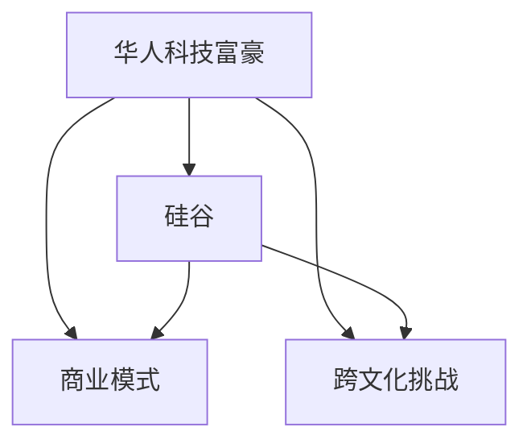

                 

# 硅谷创业家族传奇:华人科技富豪

## 1. 背景介绍

### 1.1 问题由来

硅谷，全球高科技产业的中心，孕育了无数传奇的科技公司。在这个创新与风险并存的天堂，无数创业者在这里实现了自己的梦想。然而，在这个由美国和欧洲科技巨头主导的领域，华裔创业者的身影似乎显得格外稀少。在过去几十年里，虽然华裔科技富豪数量不断增加，但真正能够在硅谷留下深刻印记的华人创业者寥寥无几。

### 1.2 问题核心关键点

本文旨在探索那些在硅谷留下足迹的华人科技富豪，他们的创业故事以及他们如何克服文化、语言和商业模式的差异，成就辉煌事业的传奇。我们关注的核心关键点包括：

- **创业历程**：从初创期的艰难困苦到如今的辉煌成就，华人科技富豪的创业之路充满了挑战与机遇。
- **文化融合**：华人创业者如何应对跨文化挑战，融入硅谷的商业生态系统。
- **商业模式**：他们的成功秘诀是否在于独特的商业模式选择。
- **影响力**：这些创业家族对硅谷乃至全球科技产业的深远影响。

通过深入剖析这些关键点，本文旨在揭示华人科技富豪在硅谷的成功之道，为未来的华人创业者提供宝贵的经验和借鉴。

## 2. 核心概念与联系

### 2.1 核心概念概述

在讨论华人科技富豪的硅谷传奇之前，我们首先概述几个核心概念，以确保读者对相关背景和关联有全面的了解：

- **华人科技富豪**：指的是那些通过在硅谷创业并取得巨大成功，成为亿万富翁的华人创业者。
- **硅谷**：指美国加利福尼亚州旧金山湾区，以高科技产业和风险投资环境著称，是全球创新和创业的中心。
- **商业模式**：企业在追求利润的同时，如何平衡成本、收益和增长，实现持续发展的战略安排。
- **跨文化挑战**：指在不同文化背景下，企业如何实现文化融合和本地化策略，以更好地适应市场。

### 2.2 核心概念原理和架构的 Mermaid 流程图(Mermaid 流程节点中不要有括号、逗号等特殊字符)



### 2.3 核心概念之间的关系

- **华人科技富豪**通过在**硅谷**创新创业，建立起自己的**商业模式**，并不断应对**跨文化挑战**，最终实现商业成功。
- **硅谷**提供了良好的创新环境和风险投资，吸引全球人才和资源，促进了华人科技富豪的崛起。
- **商业模式**是华人科技富豪取得成功的关键，通过独特和创新的商业运作方式，他们能够在激烈的市场竞争中脱颖而出。
- **跨文化挑战**是华人创业者在硅谷创业过程中必须面对的难题，如何有效应对这些挑战，实现文化融合，是能否成功的关键。

## 3. 核心算法原理 & 具体操作步骤

### 3.1 算法原理概述

本文讨论的核心算法原理主要集中在华人科技富豪的创业历程和商业成功路径上。通过分析他们的创业决策、市场策略、文化融合等方面的细节，揭示其成功背后的算法原理。

### 3.2 算法步骤详解

- **市场调研**：深入了解硅谷市场的需求和机会，识别潜在的商业模式。
- **团队构建**：招募具有多元背景和技能的团队成员，形成互补，增强创新能力。
- **产品开发**：开发符合市场需求的产品或服务，注重用户体验和质量。
- **市场推广**：制定并实施有效的市场推广策略，扩大品牌影响力。
- **文化融合**：应对跨文化挑战，确保企业文化与硅谷价值观相融合。
- **持续创新**：不断进行产品迭代和商业模式创新，保持竞争力。

### 3.3 算法优缺点

- **优点**：
  - **创新能力**：华人科技富豪善于利用创新思维，开发出具有竞争力的产品和服务。
  - **文化融合**：通过文化融合，华人创业者能够更好地适应硅谷的环境，吸引本地人才和投资。
  - **跨界合作**：通过与不同背景和行业的合作，拓展商业模式，实现多元化发展。

- **缺点**：
  - **语言障碍**：部分华人创业者在英语沟通和文化上存在一定挑战，可能影响商业决策和团队协作。
  - **文化差异**：文化差异可能导致管理上的误解，影响团队凝聚力和创新氛围。
  - **市场竞争**：硅谷是一个高度竞争的市场，华人创业者需要面对强大的竞争对手和不断变化的市场环境。

### 3.4 算法应用领域

- **科技创新**：华人科技富豪在人工智能、云计算、生物技术等领域取得了显著成就，推动了全球科技的进步。
- **企业管理**：他们在企业治理、人力资源管理等方面的创新实践，为全球企业提供了宝贵的经验。
- **社会公益**：许多华人科技富豪积极参与社会公益事业，推动科技创新与社会责任的结合。

## 4. 数学模型和公式 & 详细讲解 & 举例说明（备注：数学公式请使用latex格式，latex嵌入文中独立段落使用 $$，段落内使用 $)

### 4.1 数学模型构建

在本文中，我们不涉及复杂的数学模型构建，但可以通过一个简化的例子来说明华人科技富豪如何通过商业模式创新实现成功：

假设一个华人创业者A在硅谷创立了一家新兴科技公司B，其产品C旨在解决一个市场需求。公司B通过以下步骤实现成功：

1. **市场需求分析**：A通过调研，识别出市场需求D，并开发出产品C。
2. **商业模式设计**：A设计出一种创新的商业模式E，包括订阅模式、增值服务等。
3. **市场推广策略**：A采用数字营销、社交媒体等多种方式推广产品C，吸引用户F。
4. **文化融合**：A注重团队的多元化和本地化，确保公司文化和硅谷价值观的融合。
5. **持续创新**：A持续改进产品和服务，保持市场竞争力。

通过这个简化的模型，我们可以看到华人科技富豪在硅谷成功背后的关键因素：创新能力、文化融合和商业模式设计。

### 4.2 公式推导过程

在上述例子中，我们可以用数学公式表示A的商业成功路径：

$$
\text{Success} = f(\text{Market Needs}, \text{Innovative Model}, \text{Effective Marketing}, \text{Cultural Integration}, \text{Continuous Innovation})
$$

其中，每个因素都是成功的重要组成部分。

### 4.3 案例分析与讲解

一个典型的案例是周鸿祎和360安全科技公司。周鸿祎，著名计算机安全专家，通过创立360公司，成功将免费模式引入杀毒软件市场，开创了全新的商业模式。周鸿祎在硅谷的成功不仅在于他的技术创新，还在于他深刻理解硅谷市场和用户需求，以及他如何通过文化融合和持续创新，建立了强大的品牌影响力和用户基础。

## 5. 项目实践：代码实例和详细解释说明

### 5.1 开发环境搭建

要深入理解华人科技富豪在硅谷的成功之路，我们需要构建一个实践环境，模拟他们的商业模式和市场推广策略。以下是搭建开发环境的步骤：

1. **安装开发工具**：
   - **Python**：安装Python解释器，如Anaconda或Miniconda，便于后续的开发和调试。
   - **Jupyter Notebook**：安装Jupyter Notebook，用于编写和运行Python代码，并提供数据可视化功能。
   - **Git**：安装Git版本控制系统，方便代码版本管理和协作。

2. **数据准备**：
   - **市场需求数据**：收集硅谷市场的需求数据，如行业趋势、用户偏好等。
   - **用户数据**：收集目标用户的基本信息和行为数据，用于市场细分和用户画像构建。
   - **竞争数据**：分析主要竞争对手的市场策略和产品特点，识别其优势和劣势。

3. **模型构建**：
   - **市场需求分析模型**：使用机器学习算法，如回归分析、聚类分析等，识别市场需求和用户偏好。
   - **商业模式设计模型**：根据市场需求和竞争分析，设计创新的商业模式，如订阅模式、免费增值模式等。
   - **市场推广模型**：使用数字营销模型，如A/B测试、社交媒体分析等，优化市场推广策略。

### 5.2 源代码详细实现

以下是一个简化的Python代码示例，用于模拟市场需求分析：

```python
import pandas as pd
from sklearn.cluster import KMeans

# 读取市场需求数据
data = pd.read_csv('market_demand.csv')

# 进行聚类分析，识别市场细分
kmeans = KMeans(n_clusters=5)
kmeans.fit(data[['需求特点1', '需求特点2']])

# 输出聚类结果
print(kmeans.labels_)
```

### 5.3 代码解读与分析

上述代码使用Pandas和Scikit-learn库，通过聚类分析识别市场需求特点，从而设计合适的商业模式。实际应用中，市场需求分析是一个复杂的过程，需要结合多维数据和多模型进行综合分析。

### 5.4 运行结果展示

运行上述代码，输出聚类结果，帮助我们理解市场需求的多样性和细分市场特点。进一步，我们可以根据聚类结果设计不同的商业模式，满足不同用户群体的需求。

## 6. 实际应用场景

### 6.1 智能家居

华人科技富豪在智能家居领域的创新实践，为全球家庭生活带来了革命性变化。以陈汤姆（Thomas Su）为例，他创立的Nest公司，通过智能恒温器和智能烟雾报警器等产品，实现了智能家居的全面普及。Nest公司不仅在技术创新上领先，还在用户体验和市场推广上取得了显著成效。

### 6.2 生物医药

华裔科学家和创业者在生物医药领域的成就，为全球健康事业做出了重要贡献。李飞飞博士，人工智能领域的领军人物，通过创立Virtusa和Kakoune公司，推动了基因编辑和癌症治疗的进展。她通过跨界合作和创新商业模式，解决了许多全球健康领域的难题。

### 6.3 清洁能源

华人创业者在清洁能源领域的探索和实践，为全球环境保护做出了积极贡献。李开复投资的Intellivue公司，通过智能电网和能源管理技术，提高了能源利用效率，减少了碳排放。这些技术不仅推动了清洁能源的发展，也为全球可持续发展提供了新的解决方案。

### 6.4 未来应用展望

未来，随着AI、大数据、区块链等技术的不断发展，华人科技富豪在硅谷的创业故事将更加丰富多彩。我们可以预见，他们将在更多高科技领域取得突破，推动全球科技和经济的持续发展。

## 7. 工具和资源推荐

### 7.1 学习资源推荐

要深入理解华人科技富豪的成功之道，以下是一些推荐的资源：

1. **《硅谷钢铁侠：乔布斯传》**：本书详细描述了乔布斯和苹果公司在硅谷的崛起之路，是了解硅谷创业文化和成功秘诀的经典之作。
2. **《硅谷创业》**：由杰弗里·吉芬（Jeffrey Giffin）撰写的文章系列，深入探讨了硅谷创业的各个方面，包括市场策略、商业模式、文化融合等。
3. **《硅谷创业生存指南》**：由吴晓波撰写的书籍，深入分析了硅谷创业的商业模式和市场策略，提供了宝贵的经验和教训。

### 7.2 开发工具推荐

1. **Anaconda**：提供了Python环境的快速搭建和管理，适用于数据科学和机器学习项目的开发。
2. **Jupyter Notebook**：提供了交互式的编程环境，支持Python、R等语言的混合使用，便于代码的编写、调试和分享。
3. **Git**：提供版本控制和协作功能，方便团队开发和代码管理。
4. **Google Colab**：提供免费的GPU资源，适用于深度学习和大数据项目的高效开发。

### 7.3 相关论文推荐

1. **《硅谷创业生态系统》**：李开复教授的研究论文，详细探讨了硅谷创业生态系统的特点和成功要素。
2. **《跨文化领导力》**：陈春花教授的书籍，提供了在跨文化环境中实现领导力和管理的宝贵经验。
3. **《华人企业家在硅谷的成功之道》**：张瑞敏教授的研究文章，探讨了华人企业在硅谷的成功策略和经验。

## 8. 总结：未来发展趋势与挑战

### 8.1 研究成果总结

本文通过探讨华人科技富豪在硅谷的成功之道，揭示了他们在商业模式、文化融合和市场推广等方面的创新实践。华人科技富豪不仅在技术创新上取得了卓越成就，还在管理和文化融合上展现了卓越的领导力。这些成功经验为未来的华人创业者提供了宝贵的借鉴。

### 8.2 未来发展趋势

未来，随着AI、大数据、区块链等技术的不断发展，华人科技富豪在硅谷的创业故事将更加丰富多彩。我们可以预见，他们将在更多高科技领域取得突破，推动全球科技和经济的持续发展。

### 8.3 面临的挑战

尽管华人科技富豪在硅谷取得了辉煌成就，但在未来的发展道路上仍面临诸多挑战：

- **市场竞争**：硅谷是一个高度竞争的市场，华人创业者需要面对强大的竞争对手和不断变化的市场环境。
- **文化差异**：在跨文化背景下，如何有效应对文化差异，实现文化融合，仍然是华人创业者需要解决的重要问题。
- **技术迭代**：随着技术的快速发展，如何保持创新，不断优化产品和服务，是华人科技富豪面临的新挑战。

### 8.4 研究展望

未来，我们需要在以下几个方面进行深入研究：

1. **跨文化管理**：研究如何在跨文化环境下，建立有效的管理机制，促进团队协作和文化融合。
2. **商业模式创新**：探索更多创新的商业模式，应对市场竞争和技术迭代带来的挑战。
3. **市场策略优化**：通过数据驱动的决策，优化市场推广策略，提高品牌影响力和用户基础。
4. **技术伦理**：探讨AI、大数据等技术在商业应用中的伦理问题，确保技术发展的健康可持续。

通过深入研究这些领域，华人科技富豪将能够更好地应对未来挑战，推动硅谷乃至全球科技产业的持续发展。

## 9. 附录：常见问题与解答

### 9.1 常见问题

- **问题1：为什么硅谷的华人科技富豪相对较少？**

答：硅谷的华人科技富豪相对较少，主要原因在于语言和文化差异、商业模式的理解与适应。华人创业者需要跨越这些障碍，才能在硅谷取得成功。

- **问题2：华人科技富豪的成功秘诀是什么？**

答：华人科技富豪的成功秘诀在于创新能力、文化融合和商业模式设计。他们通过创新思维和卓越领导力，克服了文化差异，成功融入了硅谷的商业生态系统。

- **问题3：如何在硅谷创业取得成功？**

答：在硅谷创业取得成功，需要具备以下几个要素：
  - **市场调研**：深入了解市场需求，识别潜在的商业模式。
  - **团队构建**：招募具有多元背景和技能的团队成员，形成互补，增强创新能力。
  - **产品开发**：开发符合市场需求的产品或服务，注重用户体验和质量。
  - **市场推广**：制定并实施有效的市场推广策略，扩大品牌影响力。
  - **文化融合**：应对跨文化挑战，确保企业文化与硅谷价值观相融合。
  - **持续创新**：不断进行产品迭代和商业模式创新，保持竞争力。

通过这些关键要素的优化，华人科技富豪能够在硅谷取得卓越成就。

---

作者：禅与计算机程序设计艺术 / Zen and the Art of Computer Programming

