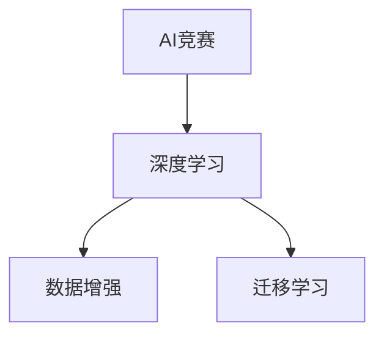

                 

# 硅谷的AI竞赛：贾扬清的观察，产品落地与基础研究并重

在AI的浪潮席卷硅谷和全球各大科技中心之际，一位深思熟虑的观察者从幕后走出，用自己的视角，为读者揭示了AI竞赛背后的真实图景。这个人，便是贾扬清（Fei-Fei Li），加州斯坦福大学计算机科学与电气工程系的教授，同时也是深度学习领域的先驱，与她的团队一起开发了图像识别领域中的多个里程碑，包括ImageNet项目和ImageNet大规模视觉识别挑战赛（ILSVRC）。她的新作《硅谷的AI竞赛：贾扬清的观察，产品落地与基础研究并重》不仅是一部技术文献，更是一部富有洞见的思想集锦，她通过亲历和观察，深入探讨了AI竞赛背后的技术、商业、伦理等多重维度。

## 1. 背景介绍

贾扬清教授的职业生涯始于AI领域，她在计算机视觉和机器学习领域取得了丰硕的研究成果，参与和推动了多个重大的AI项目。如今，她不仅在学术界享有盛誉，还在工业界担任着重要的角色，是Google AI的领军人物之一。她的研究不仅涉及前沿的基础研究，还着眼于AI技术的实际应用与产业化落地，推动了AI技术在各行各业的普及和应用。

## 2. 核心概念与联系

### 2.1 核心概念概述

贾扬清教授在其新书中，深入探讨了多个核心概念，包括AI竞赛、深度学习、数据增强、迁移学习等。以下是其中一些关键概念的概述：

- **AI竞赛**：指的是各大公司、研究机构之间通过举办公开比赛的方式，比拼AI技术的应用能力和创新性。
- **深度学习**：一种基于神经网络的机器学习方法，通过多层次的非线性变换来处理数据，广泛应用于图像识别、自然语言处理等领域。
- **数据增强**：通过一系列技术手段，如旋转、缩放、翻转等，生成新的训练数据，以提升模型泛化能力。
- **迁移学习**：将一个领域学到的知识迁移到另一个领域，以利用有限的数据资源，提升模型性能。

这些概念构成了AI竞赛和深度学习技术的基石，在书中有详细的描述和分析。

### 2.2 核心概念原理和架构的 Mermaid 流程图



这个流程图简洁地展示了AI竞赛、深度学习、数据增强和迁移学习之间的联系。其中，深度学习是核心技术手段，数据增强和迁移学习则是对深度学习的补充和优化，而AI竞赛则推动了这些技术的不断演进和普及。

## 3. 核心算法原理 & 具体操作步骤

### 3.1 算法原理概述

AI竞赛的核心在于通过公开的数据集和评分标准，激励研究者创新和竞赛。深度学习在这一过程中扮演了重要角色，其核心原理在于通过多层次的非线性变换，学习数据之间的复杂关系。具体步骤包括：

1. **数据预处理**：清洗和标准化数据，去除噪声和异常值。
2. **模型选择与训练**：选择合适的深度学习模型，并在大量数据上训练模型。
3. **模型优化**：通过调整模型参数和训练策略，提升模型性能。
4. **模型评估**：使用测试集评估模型性能，调整策略。
5. **模型部署与应用**：将模型部署到实际应用中，验证其效果。

### 3.2 算法步骤详解

以ImageNet大规模视觉识别挑战赛（ILSVRC）为例，步骤详解如下：

1. **数据集准备**：收集大规模的图像数据集，并进行预处理。
2. **模型设计**：选择或设计合适的深度学习模型，如卷积神经网络（CNN）。
3. **模型训练**：使用大规模标注数据对模型进行训练，调整超参数。
4. **模型验证与调优**：在验证集上评估模型性能，进行调优。
5. **模型测试与部署**：在测试集上评估最终模型性能，部署到实际应用中。

### 3.3 算法优缺点

深度学习的优势在于其强大的数据拟合能力，能够在处理复杂数据时表现出色。然而，深度学习的缺点也同样明显：

- **模型复杂度**：深度学习模型往往参数量巨大，需要大量计算资源进行训练和推理。
- **数据依赖性**：深度学习依赖于大规模、高质量的标注数据，数据不足时性能难以提升。
- **可解释性差**：深度学习模型通常被视为"黑盒"，难以解释其决策过程。

### 3.4 算法应用领域

深度学习在图像识别、自然语言处理、语音识别等多个领域取得了显著进展。以自然语言处理为例，深度学习通过Transformer等模型，实现了从文本分类到机器翻译、问答系统等多种应用，显著提升了NLP任务的性能。

## 4. 数学模型和公式 & 详细讲解 & 举例说明

### 4.1 数学模型构建

在自然语言处理中，Transformer模型是深度学习的代表。其核心在于自注意力机制，通过学习上下文关系，实现高效的文本表示。数学模型构建如下：

设输入序列为 $X = \{x_1, x_2, ..., x_n\}$，输出序列为 $Y = \{y_1, y_2, ..., y_n\}$，其中 $x_i, y_i \in \mathbb{R}^d$。

**Transformer模型**：

$$
\begin{aligned}
\text{Enc}(X) &= \text{Self-Attention}(X) + \text{Feed Forward}(\text{Self-Attention}(X)) \\
\text{Enc}(X) &= \text{Multi-Head Attention}(X, X, X) + \text{LayerNorm}(X) + \text{Feed Forward}(\text{Multi-Head Attention}(X, X, X)) \\
\text{Enc}(X) &= \text{Positional Encoding}(X) + \text{Multi-Head Attention}(X, X, X) + \text{LayerNorm}(X) + \text{Feed Forward}(\text{Multi-Head Attention}(X, X, X))
\end{aligned}
$$

### 4.2 公式推导过程

以Transformer模型为例，推导其前向传播过程：

设输入序列 $X$ 的长度为 $n$，通过多头注意力和前馈网络对 $X$ 进行编码，得到输出序列 $\text{Enc}(X)$。

$$
\begin{aligned}
\text{Enc}(X) &= \text{Positional Encoding}(X) + \text{Multi-Head Attention}(X, X, X) + \text{LayerNorm}(X) + \text{Feed Forward}(\text{Multi-Head Attention}(X, X, X)) \\
&= \text{Positional Encoding}(X) + \text{Attention}(QKV) + \text{LayerNorm}(X) + \text{FFN}(\text{Attention}(QKV))
\end{aligned}
$$

其中 $\text{Attention}(QKV)$ 表示多头注意力机制， $\text{FFN}$ 表示前馈网络， $\text{Positional Encoding}$ 表示位置编码。

### 4.3 案例分析与讲解

以图像识别任务为例，通过ImageNet大规模视觉识别挑战赛，讲解深度学习的实际应用。ImageNet项目包括1400万张标注图片，是深度学习模型的重要数据来源。通过训练大规模深度学习模型，如ResNet、Inception等，可以在图像分类任务上取得优异性能。

## 5. 项目实践：代码实例和详细解释说明

### 5.1 开发环境搭建

为进行深度学习项目开发，需要以下环境配置：

1. 安装Python：在Linux或macOS上，可以通过apt-get或brew命令安装Python 3.x。在Windows上，建议使用Anaconda安装Python，并创建一个虚拟环境。
2. 安装深度学习库：使用pip或conda安装TensorFlow、PyTorch等深度学习库。
3. 安装其他依赖库：如NumPy、Pandas等，使用pip或conda安装。

### 5.2 源代码详细实现

以PyTorch为例，实现一个简单的图像分类模型：

```python
import torch
import torch.nn as nn
import torch.optim as optim

class Net(nn.Module):
    def __init__(self):
        super(Net, self).__init__()
        self.conv1 = nn.Conv2d(3, 6, 5)
        self.pool = nn.MaxPool2d(2, 2)
        self.conv2 = nn.Conv2d(6, 16, 5)
        self.fc1 = nn.Linear(16 * 5 * 5, 120)
        self.fc2 = nn.Linear(120, 84)
        self.fc3 = nn.Linear(84, 10)

    def forward(self, x):
        x = self.pool(F.relu(self.conv1(x)))
        x = self.pool(F.relu(self.conv2(x)))
        x = x.view(-1, 16 * 5 * 5)
        x = F.relu(self.fc1(x))
        x = F.relu(self.fc2(x))
        x = self.fc3(x)
        return x

net = Net()
criterion = nn.CrossEntropyLoss()
optimizer = optim.SGD(net.parameters(), lr=0.001, momentum=0.9)

for epoch in range(2):  # 循环2次
    running_loss = 0.0
    for i, data in enumerate(trainloader, 0):
        inputs, labels = data
        optimizer.zero_grad()
        outputs = net(inputs)
        loss = criterion(outputs, labels)
        loss.backward()
        optimizer.step()
```

### 5.3 代码解读与分析

- `Net`类定义了一个简单的卷积神经网络模型。
- `forward`方法实现了前向传播过程，输入数据经过卷积、池化、全连接等操作，最终输出分类结果。
- `criterion`和`optimizer`分别定义了损失函数和优化器，用于模型训练。

### 5.4 运行结果展示

运行上述代码后，可以通过可视化工具（如TensorBoard）监控训练过程，使用测试集评估模型性能。

## 6. 实际应用场景

### 6.1 智能家居

AI竞赛催生了智能家居领域的飞速发展，通过自然语言交互，智能设备可以自动执行各种操作，如温度调节、灯光控制等。例如，Alexa和Google Assistant等智能音箱，可以通过语音命令控制家庭电器，实现便捷的智能生活。

### 6.2 自动驾驶

在自动驾驶领域，AI竞赛推动了图像识别、决策树优化等技术的发展。如Waymo、Uber等公司，通过深度学习模型和竞赛，提升了自动驾驶系统的安全性与可靠性。

### 6.3 金融科技

在金融科技领域，AI竞赛促进了算法交易、风险评估等应用的发展。如Bloomberg和Wall Street等公司，通过深度学习模型和竞赛，提升了金融产品的定价和风险管理能力。

## 7. 工具和资源推荐

### 7.1 学习资源推荐

1. **CS231n《卷积神经网络》**：斯坦福大学的经典课程，系统讲解了卷积神经网络在图像识别中的应用。
2. **《Deep Learning》**：Ian Goodfellow等人的经典著作，全面介绍了深度学习的基础理论和实践应用。
3. **Kaggle竞赛平台**：提供了丰富的AI竞赛，是学习和实践深度学习的绝佳平台。

### 7.2 开发工具推荐

1. **PyTorch**：灵活的深度学习框架，支持动态图和静态图。
2. **TensorFlow**：Google开发的深度学习框架，支持分布式计算和模型部署。
3. **Jupyter Notebook**：交互式编程环境，适合进行数据分析和模型验证。

### 7.3 相关论文推荐

1. **《ImageNet: A Large-Scale Hierarchical Image Database》**：Russell J. Hinton等人发表的ImageNet项目论文。
2. **《Deep Residual Learning for Image Recognition》**：Kaiming He等人发表的ResNet论文。
3. **《Attention is All You Need》**：Ashish Vaswani等人发表的Transformer论文。

## 8. 总结：未来发展趋势与挑战

### 8.1 研究成果总结

贾扬清教授的研究成果不仅推动了深度学习技术的发展，还促进了AI竞赛的蓬勃发展。她的工作为AI技术在实际应用中的落地提供了重要支撑。

### 8.2 未来发展趋势

未来，AI竞赛将向更加精细化、智能化方向发展，更多跨学科、跨领域的应用场景将涌现。AI竞赛的参与者和组织者也需要面对新的挑战和机遇。

### 8.3 面临的挑战

1. **数据隐私和安全**：AI竞赛中的数据隐私和安全问题日益突出，如何保护用户隐私和数据安全，是未来的重要课题。
2. **模型可解释性**：深度学习模型的"黑盒"特性需要被重视，增强模型的可解释性，有助于建立用户的信任和接受度。
3. **跨领域融合**：如何将AI技术与更多领域进行融合，实现跨学科的创新，是未来需要努力的方向。

### 8.4 研究展望

未来，AI竞赛和技术应用将更加注重伦理、法律和公平性。如何构建一个公平、透明、安全的AI竞赛环境，是研究者、开发者和监管机构共同面临的挑战。

## 9. 附录：常见问题与解答

**Q1: AI竞赛和深度学习之间的关系是什么？**

A: AI竞赛通过公开数据集和评分标准，激励研究者进行深度学习模型的创新和竞赛，推动深度学习技术的快速发展。

**Q2: 深度学习的优点和缺点有哪些？**

A: 优点在于其强大的数据拟合能力，能够在处理复杂数据时表现出色。缺点在于模型复杂度高，数据依赖性强，可解释性差。

**Q3: 如何在深度学习中实现数据增强？**

A: 数据增强可以通过一系列技术手段，如旋转、缩放、翻转等，生成新的训练数据，以提升模型泛化能力。

**Q4: 如何理解深度学习的"黑盒"特性？**

A: 深度学习的"黑盒"特性指的是模型在训练过程中学习到的复杂非线性关系，难以通过简单的公式或规则解释其决策过程。

---

作者：禅与计算机程序设计艺术 / Zen and the Art of Computer Programming

