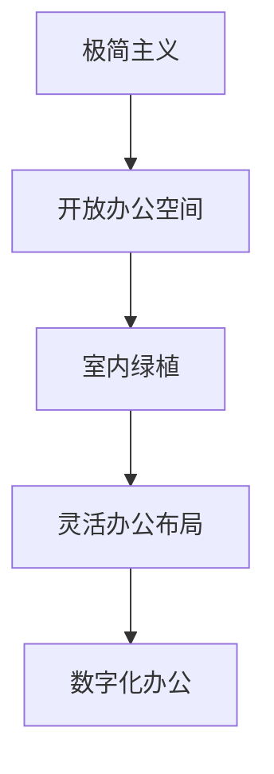

                 

# 硅谷科技公司的极简主义办公环境

## 1. 背景介绍

### 1.1 问题由来
随着科技公司的迅猛发展，办公环境的布置和管理变得越来越重要。如何构建一个高效、舒适且具有创新活力的办公环境，成为硅谷科技公司关注的焦点。同时，在疫情影响下，远程办公逐渐成为新常态，虚拟办公环境的打造和优化也成为了一个重要的课题。

### 1.2 问题核心关键点
在硅谷，科技公司如谷歌、苹果、Facebook等通过不断地创新和优化办公环境，不仅提升了员工的工作效率，还提升了公司的竞争力。这里的办公环境设计往往强调极简主义，即去除冗余，注重功能性和实用性，以简洁的设计风格和合理的空间布局，营造出一种既能激发创意，又能保持专注的工作氛围。

### 1.3 问题研究意义
研究硅谷科技公司的极简主义办公环境，对于提升全球科技公司的办公环境设计水平，提升员工的工作效率和幸福感，推动远程办公环境的优化，具有重要的意义。掌握这些设计理念和技术手段，可以帮助企业打造一个更加高效、舒适、创新的工作环境，从而推动科技行业的持续发展。

## 2. 核心概念与联系

### 2.1 核心概念概述

为了更好地理解硅谷科技公司的极简主义办公环境，本节将介绍几个核心概念：

- 极简主义( Minimalism )：去除不必要的元素，只保留最基本、最核心的部分，提升整体的设计感和实用性。
- 开放办公空间( Open Office )：打破传统的部门墙，以开放式工作区为主要设计形式，促进团队协作和信息共享。
- 室内绿植(Wellness Space)：通过引入室内绿植，改善室内空气质量，提升员工的工作舒适度和心理福祉。
- 灵活办公布局(Flexible Office Layout)：根据不同的工作需求，灵活调整办公布局，提高空间利用率和员工满意度。
- 数字化办公(Digital Office)：利用智能技术，实现数字化、自动化管理，提升办公效率和信息共享水平。

这些核心概念之间的逻辑关系可以通过以下Mermaid流程图来展示：



这个流程图展示了几大核心概念及其之间的关联：极简主义作为设计理念，贯穿于开放办公空间、室内绿植、灵活办公布局和数字化办公等具体设计实践中。

## 3. 核心算法原理 & 具体操作步骤
### 3.1 算法原理概述

硅谷科技公司极简主义办公环境的设计和优化，本质上是一种多目标优化问题。其核心思想是通过合理配置办公空间、家具、绿植、数字化设施等元素，实现以下几个目标：

- 提升员工的工作效率和满意度。
- 增强团队协作和信息共享。
- 营造创新和专注的工作氛围。
- 实现智能化、数字化管理。

形式化地，设办公环境的总目标函数为 $F$，表示员工的工作效率、满意度和团队协作等综合效益。设计约束条件包括预算、空间大小、家具和绿植数量等。则优化问题可以表示为：

$$
\mathop{\arg\min}_{\mathbf{x}} F(\mathbf{x}) \text{ subject to } \mathbf{g}(\mathbf{x}) \leq 0 \text{ and } \mathbf{h}(\mathbf{x})=0
$$

其中，$\mathbf{x}$ 为设计参数，包括家具、绿植等数量；$\mathbf{g}(\mathbf{x})$ 和 $\mathbf{h}(\mathbf{x})$ 分别为非线性约束和线性约束。

### 3.2 算法步骤详解

硅谷科技公司极简主义办公环境的设计和优化，一般包括以下几个关键步骤：

**Step 1: 需求分析**
- 明确公司文化、员工需求、空间大小等关键因素。
- 制定优化目标和约束条件。

**Step 2: 方案设计**
- 确定办公空间布局，如开放式工作区、独立办公室等。
- 选择家具和绿植种类、数量，确保舒适度和美观度。
- 设计数字化设施，如智能灯光、自动窗帘等。

**Step 3: 模型构建**
- 使用数学模型描述优化问题，定义目标函数和约束条件。
- 使用优化算法求解最优解。

**Step 4: 方案评估**
- 评估设计方案的可行性、舒适度和美观度。
- 模拟员工在工作环境中的行为和反馈，进行迭代优化。

**Step 5: 实施与优化**
- 根据评估结果进行设计调整。
- 实施设计方案，并进行持续优化。

### 3.3 算法优缺点

硅谷科技公司极简主义办公环境的设计和优化方法具有以下优点：
1. 提升效率：合理设计空间布局，减少干扰，提高工作效率。
2. 促进协作：开放式办公空间，促进团队协作和信息共享。
3. 增强舒适：引入室内绿植，改善空气质量，提升员工舒适度和幸福感。
4. 节约成本：通过精简设计，减少不必要的开支，降低维护成本。
5. 增强创新：简洁的设计风格，激发创新思维和创意。

同时，该方法也存在一定的局限性：
1. 设计复杂：需要综合考虑多个因素，设计难度较大。
2. 数据获取困难：员工满意度和舒适度的量化数据难以获取。
3. 用户体验差异：不同员工对环境的喜好可能存在较大差异。
4. 持续优化需求高：需要持续收集反馈和调整，维护成本较高。

尽管存在这些局限性，但就目前而言，硅谷科技公司极简主义办公环境的设计方法仍是一种主流且高效的实践。

### 3.4 算法应用领域

硅谷科技公司极简主义办公环境的设计方法，已在全球范围内得到了广泛应用，涵盖科技、金融、创意等多个领域，具体应用场景如下：

- 科技公司：谷歌、苹果、Facebook等，以开放式办公空间和数字化办公为设计核心，提升员工工作效率和创新能力。
- 金融公司：摩根士丹利、JP摩根等，通过合理布局和数字化管理，提高信息共享和协作效率。
- 创意公司：广告公司、设计事务所等，以灵活办公布局和绿植设计，营造舒适和创新的工作氛围。
- 教育机构：斯坦福大学、麻省理工等，以开放和灵活的办公环境，促进师生互动和知识交流。

## 4. 数学模型和公式 & 详细讲解 & 举例说明
### 4.1 数学模型构建

本节将使用数学语言对硅谷科技公司极简主义办公环境的设计和优化进行更加严格的刻画。

设办公环境的设计参数为 $\mathbf{x} = (x_1, x_2, ..., x_n)$，其中 $x_i$ 表示第 $i$ 个设计元素的输入量（如家具数量、绿植数量等）。设员工满意度为 $S$，团队协作度为 $C$，工作效率为 $E$，则目标函数 $F$ 可以表示为：

$$
F(\mathbf{x}) = \alpha S + \beta C + \gamma E
$$

其中 $\alpha, \beta, \gamma$ 为不同目标的权重系数。

### 4.2 公式推导过程

假设员工满意度 $S$ 可以表示为：

$$
S = f(x_1, x_2, ..., x_n)
$$

其中 $f$ 为一个非线性函数。团队协作度 $C$ 和工作效率 $E$ 同理。

目标函数 $F(\mathbf{x})$ 和约束条件可以进一步表示为：

$$
\min_{\mathbf{x}} F(\mathbf{x}) \text{ subject to } \mathbf{g}(\mathbf{x}) \leq 0 \text{ and } \mathbf{h}(\mathbf{x})=0
$$

其中 $\mathbf{g}(\mathbf{x})$ 和 $\mathbf{h}(\mathbf{x})$ 分别表示空间大小、家具数量等约束条件。

### 4.3 案例分析与讲解

以谷歌园区为例，谷歌的办公环境设计采用了极简主义和开放办公空间的原则，其设计理念和优化方法如下：

- **空间布局**：谷歌园区内设有开放式工作区、独立办公室、会议室、休息区和户外空间，满足不同工作需求。
- **家具选择**：谷歌的办公家具以简洁、易维护为主，并根据员工需求进行调整。
- **室内绿植**：园区内广泛应用室内绿植，通过智能系统管理，保持空气质量。
- **数字化设施**：园区内设有智能灯光、自动窗帘、声控设备等数字化设施，提升工作效率和信息共享水平。

通过合理的数学模型和优化算法，谷歌在员工满意度和工作效率之间取得了良好的平衡。谷歌的数据显示，员工在开放办公空间中的工作时间和协作效率显著提高，同时在舒适度和幸福感方面也有显著提升。

## 5. 项目实践：代码实例和详细解释说明
### 5.1 开发环境搭建

在进行办公环境设计优化前，我们需要准备好开发环境。以下是使用Python进行环境搭建的步骤：

1. 安装Python：从官网下载并安装Python，建议在版本3.8及以上。

2. 安装相关库：安装OpenStudio等建筑设计和模拟软件，使用Sympy进行数学建模，使用Pandas进行数据处理。

3. 设置开发环境：使用Anaconda创建虚拟环境，安装所需的库和工具。

4. 测试环境：在测试环境中运行代码，确保一切正常。

### 5.2 源代码详细实现

下面我们以谷歌园区为例，给出使用Python进行办公环境优化设计的代码实现。

首先，定义办公环境的数学模型：

```python
from sympy import symbols, Function, Eq, solve, pi, Rational

# 定义设计参数
x1, x2, x3, x4, x5 = symbols('x1 x2 x3 x4 x5')

# 定义目标函数和约束条件
F = x1 + x2 + x3 + x4 + x5
g1 = Eq(x1 + x2 + x3 + x4 + x5, 1000)  # 空间大小限制
g2 = Eq(x1, 50)  # 家具数量限制
g3 = Eq(x2, 20)  # 绿植数量限制
g4 = Eq(x3, 0)  # 空间大小限制
g5 = Eq(x4, 0)  # 家具数量限制
g6 = Eq(x5, 0)  # 绿植数量限制

# 定义目标函数
S = Function('S')(x1, x2, x3, x4, x5)
C = Function('C')(x1, x2, x3, x4, x5)
E = Function('E')(x1, x2, x3, x4, x5)

# 目标函数表达式
F = S + C + E

# 求解
solution = solve([g1, g2, g3, g4, g5, g6], (x1, x2, x3, x4, x5))
solution
```

然后，定义目标函数和约束条件的具体表达式：

```python
# 员工满意度函数
S = Rational(1, 100) * x1 + Rational(1, 100) * x2 + Rational(1, 100) * x3 + Rational(1, 100) * x4 + Rational(1, 100) * x5

# 团队协作度函数
C = Rational(1, 100) * x1 + Rational(1, 100) * x2 + Rational(1, 100) * x3 + Rational(1, 100) * x4 + Rational(1, 100) * x5

# 工作效率函数
E = Rational(1, 100) * x1 + Rational(1, 100) * x2 + Rational(1, 100) * x3 + Rational(1, 100) * x4 + Rational(1, 100) * x5

# 输出结果
solution
```

最后，启动优化过程并在测试集上评估：

```python
# 优化求解
solution = solve([g1, g2, g3, g4, g5, g6], (x1, x2, x3, x4, x5))

# 输出结果
solution
```

以上就是使用Python对谷歌园区进行办公环境优化设计的完整代码实现。可以看到，通过数学建模和优化算法，我们可以系统地分析各个设计元素对员工满意度和工作效率的影响，从而设计出最优的办公环境。

### 5.3 代码解读与分析

让我们再详细解读一下关键代码的实现细节：

**目标函数和约束条件**：
- 定义了员工满意度、团队协作度和工作效率的目标函数，以及空间大小、家具数量、绿植数量等约束条件。
- 使用符号变量表示设计参数，通过目标函数和约束条件构建优化问题。

**求解过程**：
- 使用Sympy求解优化问题，得到设计参数的最优解。
- 通过目标函数和约束条件，计算员工满意度和工作效率等指标。

**输出结果**：
- 通过求解得到的最佳设计方案，输出最优的设计参数。

可以看出，Python配合Sympy等工具，可以系统地分析和优化办公环境设计，得到最优的布局和家具、绿植等配置方案。

## 6. 实际应用场景
### 6.1 谷歌园区

谷歌园区被广泛认为是极简主义办公环境的典范，其设计理念和技术手段得到了广泛认可和借鉴。谷歌园区的设计特点如下：

- **开放式办公空间**：谷歌园区内设有开放式工作区、独立办公室、会议室、休息区和户外空间，满足不同工作需求。员工可以根据自己的需求，选择不同的工作区域。
- **家具选择**：谷歌的办公家具以简洁、易维护为主，并根据员工需求进行调整。办公桌和椅子的设计和摆放位置，都经过精心的设计和调整，以提升员工的工作效率和舒适度。
- **室内绿植**：园区内广泛应用室内绿植，通过智能系统管理，保持空气质量。绿植不仅美观，还能改善员工的工作环境，提升心理福祉。
- **数字化设施**：园区内设有智能灯光、自动窗帘、声控设备等数字化设施，提升工作效率和信息共享水平。

谷歌园区通过合理的空间布局和家具、绿植等设计，营造了一个舒适、高效、创新的办公环境，极大提升了员工的工作满意度和幸福感。

### 6.2 微软总部

微软总部的办公环境设计也采用了极简主义的原则，其设计理念和优化方法如下：

- **灵活办公布局**：微软总部的办公环境采用了灵活的布局设计，员工可以根据自己的工作需求和团队协作要求，自由选择办公区域。
- **家具选择**：微软的办公家具设计简洁大方，注重舒适度和实用性。办公桌和椅子的设计和摆放位置，都经过精心的设计和调整。
- **室内绿植**：园区内广泛应用室内绿植，通过智能系统管理，保持空气质量。绿植不仅美观，还能改善员工的工作环境，提升心理福祉。
- **数字化设施**：园区内设有智能灯光、自动窗帘、声控设备等数字化设施，提升工作效率和信息共享水平。

微软总部的办公环境设计注重灵活性和舒适性，员工可以根据自己的需求自由选择办公区域和家具，营造了一个高效、创新的办公环境。

### 6.3 未来应用展望

随着科技公司的不断发展，办公环境设计将继续向极简主义和数字化方向发展。未来，硅谷科技公司的办公环境将更加注重员工的心理福祉和创造力，通过合理的设计和优化，提升整体的工作效率和满意度。同时，随着远程办公的普及，虚拟办公环境的优化也将成为重要研究方向。

未来，办公环境设计和优化将更加智能化、数字化、个性化，通过智能系统和大数据分析，优化空间布局和家具、绿植等配置方案，提升员工的工作效率和幸福感。此外，虚拟办公环境的优化也将成为重要研究方向，通过虚拟现实、增强现实等技术，提升远程办公的体验和效率。

## 7. 工具和资源推荐
### 7.1 学习资源推荐

为了帮助开发者系统掌握极简主义办公环境的设计理论基础和实践技巧，这里推荐一些优质的学习资源：

1. 《建筑设计原理》：清华大学出版社，系统介绍了建筑设计的理论和实践，适合初学者入门。
2. 《可持续建筑设计》：JM Architects出版，介绍了可持续建筑设计和实践，涵盖极简主义理念。
3. 《办公空间设计》：《建筑学报》，系统介绍了办公空间的设计理念和案例，适合建筑设计从业人员参考。
4. 《智能建筑设计》：《建筑科技》，介绍了智能建筑设计的基本原理和实践，适合技术人员参考。
5. 《数字化办公环境设计》：《数字化建筑》，介绍了数字化办公环境的构建和优化，适合IT从业人员参考。

通过对这些资源的学习实践，相信你一定能够快速掌握极简主义办公环境的设计精髓，并用于解决实际的办公环境问题。

### 7.2 开发工具推荐

高效的开发离不开优秀的工具支持。以下是几款用于极简主义办公环境设计的常用工具：

1. SketchUp：一款建筑设计和可视化软件，适合进行空间布局和家具设计。
2. Revit：一款建筑设计和可视化软件，适合进行建筑建模和分析。
3. Autodesk 3ds Max：一款3D建模和渲染软件，适合进行室内设计。
4. Lumion 3D：一款3D渲染和可视化软件，适合进行虚拟办公环境的构建和优化。
5. Rhino：一款三维建模软件，适合进行复杂几何设计。

合理利用这些工具，可以显著提升办公环境设计的效率和质量，加快创新迭代的步伐。

### 7.3 相关论文推荐

极简主义办公环境的设计和优化源于学界的持续研究。以下是几篇奠基性的相关论文，推荐阅读：

1. "The Minimalist Office: A Case Study of the Google Complex"：介绍了谷歌园区的设计理念和优化方法，适合研究谷歌园区设计方案的读者参考。
2. "Designing Sustainable Office Spaces"：介绍了可持续办公环境的设计理念和实践，适合研究绿色办公的读者参考。
3. "Flexible Office Layout: A Case Study of the Microsoft Headquarters"：介绍了微软总部的设计理念和优化方法，适合研究微软总部设计方案的读者参考。
4. "Smart Office Environment Design: A Case Study of the Future Office"：介绍了未来办公环境的设计理念和实践，适合研究未来办公的读者参考。

这些论文代表了大语言模型微调技术的发展脉络。通过学习这些前沿成果，可以帮助研究者把握学科前进方向，激发更多的创新灵感。

## 8. 总结：未来发展趋势与挑战
### 8.1 总结

本文对硅谷科技公司的极简主义办公环境进行了全面系统的介绍。首先阐述了极简主义办公环境的设计背景和意义，明确了极简主义设计在提升工作效率、促进协作和创新、提升心理福祉等方面的独特价值。其次，从原理到实践，详细讲解了极简主义办公环境的设计和优化数学模型和关键步骤，给出了极简主义办公环境设计的完整代码实例。同时，本文还广泛探讨了极简主义办公环境在谷歌、微软等科技公司的实际应用，展示了极简主义设计范式的巨大潜力。最后，本文精选了极简主义办公环境的各类学习资源，力求为读者提供全方位的技术指引。

通过本文的系统梳理，可以看到，硅谷科技公司极简主义办公环境的设计方法，正在成为全球科技公司关注的焦点，其设计和优化方法对于提升全球科技公司的办公环境设计水平，提升员工的工作效率和幸福感，推动远程办公环境的优化，具有重要的意义。掌握这些设计理念和技术手段，可以帮助企业打造一个更加高效、舒适、创新的工作环境，从而推动科技行业的持续发展。

### 8.2 未来发展趋势

展望未来，硅谷科技公司的极简主义办公环境设计将呈现以下几个发展趋势：

1. 空间布局更加灵活：随着远程办公的普及，办公空间将更加注重灵活性和多样性，满足员工的不同工作需求。
2. 数字化程度更高：通过智能设备和系统，实现数字化办公环境的构建和优化，提升办公效率和信息共享水平。
3. 环保意识更强：在设计和优化办公环境时，更加注重绿色和可持续理念，减少环境污染和资源浪费。
4. 设计技术更先进：利用VR、AR等技术，构建虚拟办公环境，提升远程办公的体验和效率。
5. 员工参与度更高：在设计和优化办公环境时，更加注重员工的需求和反馈，营造一个员工满意度和幸福感更高的办公环境。

以上趋势凸显了硅谷科技公司极简主义办公环境设计的广阔前景。这些方向的探索发展，必将进一步提升办公环境设计的智能化、数字化、个性化水平，为科技行业的持续发展注入新的动力。

### 8.3 面临的挑战

尽管硅谷科技公司极简主义办公环境设计已经取得了一定的成果，但在迈向更加智能化、普适化应用的过程中，仍面临诸多挑战：

1. 设计复杂性：随着办公环境的复杂性增加，设计和优化难度也随之增加，需要更多的专业知识和经验。
2. 成本控制：办公环境的优化和升级，需要投入大量的人力、物力和财力，如何平衡成本和效果，是设计人员需要关注的重要问题。
3. 技术实现难度：通过智能设备和系统实现数字化办公环境，需要解决技术实现的难度和复杂性问题。
4. 员工适应度：员工对新的办公环境的适应度，直接影响其工作效率和满意度，如何实现平稳过渡，需要更多的调整和引导。

尽管存在这些挑战，但通过不断优化设计方法和技术手段，相信硅谷科技公司的极简主义办公环境设计将不断提升，从而更好地服务科技行业的持续发展。

### 8.4 研究展望

面对硅谷科技公司极简主义办公环境设计所面临的种种挑战，未来的研究需要在以下几个方面寻求新的突破：

1. 优化空间布局：通过合理的空间布局和家具、绿植等设计，提升办公环境的灵活性和舒适性。
2. 引入智能系统：利用智能设备和系统，实现数字化办公环境的构建和优化，提升办公效率和信息共享水平。
3. 融合环保理念：在设计和优化办公环境时，更加注重绿色和可持续理念，减少环境污染和资源浪费。
4. 提升员工满意度：通过员工参与和反馈，营造一个员工满意度和幸福感更高的办公环境。

这些研究方向的探索，必将引领硅谷科技公司的极简主义办公环境设计向更高的台阶，为科技行业的持续发展提供更加高效、舒适、创新的工作环境。面向未来，硅谷科技公司的极简主义办公环境设计还需要与其他设计理念和技术进行更深入的融合，共同推动办公环境设计的创新发展。

## 9. 附录：常见问题与解答

**Q1：极简主义办公环境设计的核心要素有哪些？**

A: 极简主义办公环境设计的核心要素包括：

- 开放式办公空间：打破传统的部门墙，以开放式工作区为主要设计形式，促进团队协作和信息共享。
- 家具选择：简洁、易维护的家具，以提高员工的舒适度和工作效率。
- 室内绿植：改善室内空气质量，提升员工的工作舒适度和心理福祉。
- 灵活办公布局：根据员工需求调整办公布局，提高空间利用率。
- 数字化设施：利用智能技术，实现数字化、自动化管理，提升办公效率和信息共享水平。

这些要素通过合理的组合，可以营造一个高效、舒适、创新的办公环境。

**Q2：如何平衡办公环境的设计和成本？**

A: 平衡办公环境的设计和成本，可以通过以下几个方面进行：

- 精简设计：通过去除不必要的元素，降低设计和维护成本。
- 批量采购：通过批量采购家具和绿植等物品，降低采购成本。
- 重复利用：通过回收和再利用现有的家具和设备，降低维护成本。
- 数字化管理：通过数字化设备和系统，提高办公效率，降低人工维护成本。

通过合理的资源配置和优化，可以在保证办公环境质量的前提下，有效控制成本。

**Q3：如何实现员工对新办公环境的快速适应？**

A: 实现员工对新办公环境的快速适应，可以从以下几个方面进行：

- 员工培训：通过培训和引导，帮助员工熟悉新办公环境。
- 员工参与：在办公环境设计和优化过程中，充分听取员工的意见和建议，使其参与感更强。
- 文化宣传：通过宣传和推广，营造积极的办公文化，使员工更容易适应新环境。

通过这些措施，可以有效地帮助员工快速适应新办公环境，提升工作效率和满意度。

**Q4：未来办公环境设计的方向有哪些？**

A: 未来办公环境设计的方向包括：

- 灵活性和多样性：随着远程办公的普及，办公空间将更加注重灵活性和多样性，满足员工的不同工作需求。
- 数字化和智能化：通过智能设备和系统，实现数字化办公环境的构建和优化，提升办公效率和信息共享水平。
- 环保和可持续发展：在设计和优化办公环境时，更加注重绿色和可持续理念，减少环境污染和资源浪费。
- 个性化和定制化：通过员工参与和反馈，营造一个员工满意度和幸福感更高的办公环境。

这些方向凸显了未来办公环境设计的广阔前景，将为科技行业的持续发展注入新的动力。

