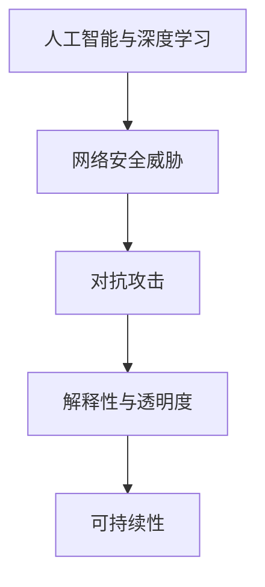

                 

# 硅谷网络安全面临的新挑战

在21世纪的技术创新浪潮中，硅谷的科技巨头们无疑是引领风潮的先行者。无论是谷歌、苹果、Facebook还是特斯拉，它们都在各自的领域内取得了令人瞩目的成就。然而，伴随着这些技术巨头日益庞大的影响力，网络安全问题也日益严峻。本文将从背景介绍、核心概念与联系、算法原理与操作步骤、数学模型与公式、项目实践与代码实现、实际应用场景、工具与资源推荐、总结与发展趋势与挑战等角度，深入探讨硅谷网络安全面临的新挑战及其应对策略。

## 1. 背景介绍

随着互联网技术的飞速发展，网络安全威胁也在不断演变。黑客攻击、数据泄露、恶意软件等传统网络威胁并未消失，反而以更复杂、更隐蔽的形式出现。同时，人工智能、大数据、物联网等新技术的应用，也带来了全新的安全挑战。

以人工智能为例，其深度学习技术被广泛应用于网络安全领域，如网络异常检测、恶意行为识别、威胁情报分析等。然而，这些智能技术同样可能被黑客利用，成为其入侵系统、窃取数据的新手段。黑客可以通过仿生对抗攻击，利用模型训练数据中的漏洞，对智能系统进行欺骗和操控，带来严重的安全风险。

## 2. 核心概念与联系

为更好地理解硅谷网络安全面临的新挑战，我们首先介绍几个核心概念，并探讨其相互之间的联系。

### 2.1 核心概念概述

- **人工智能与深度学习**：指通过机器学习算法，使计算机能够从数据中学习并做出预测、识别等智能决策的技术。在网络安全领域，人工智能被用于行为异常检测、威胁情报分析等。

- **网络安全威胁**：包括恶意软件、DDoS攻击、内部威胁、网络钓鱼等，这些威胁不仅影响企业的商业运作，还可能危及用户的隐私安全。

- **对抗攻击**：指攻击者通过向目标系统中注入恶意数据或干扰，使系统产生错误决策或失效的行为。在深度学习模型中，对抗攻击通常采用向训练数据中添加噪声、混淆样本等手段，使得模型在面对攻击时产生误判。

- **解释性与透明度**：指模型的决策过程是否可解释、可理解，这对于网络安全领域尤为重要。模型的决策如果无法透明，将难以进行有效审计和监控。

- **可持续性**：指网络安全措施是否能够长期有效应对威胁变化，如何保证安全系统在未来也能有效运行。

### 2.2 核心概念原理和架构的 Mermaid 流程图(Mermaid 流程节点中不要有括号、逗号等特殊字符)



这个流程图展示了人工智能与深度学习在网络安全中的应用及其面临的新挑战：

1. 人工智能和深度学习技术在网络安全中主要应用于威胁检测和响应，但同时也为对抗攻击提供了新手段。
2. 对抗攻击可能使得模型决策错误，危及安全系统。
3. 解释性与透明度是确保模型可信度的重要因素。
4. 可持续性是保证安全系统长期有效运行的关键。

这些概念之间的联系构成了硅谷网络安全面临的新挑战的复杂图景。

## 3. 核心算法原理 & 具体操作步骤

### 3.1 算法原理概述

在硅谷的网络安全领域，对抗攻击是主要的新挑战之一。对抗攻击主要分为白盒攻击和黑盒攻击两种类型：

- **白盒攻击**：攻击者完全知道模型的架构和训练数据，可以针对特定模型进行定制化攻击。
- **黑盒攻击**：攻击者仅知道模型的输入输出，无法获知模型内部结构，更难以防御。

对抗攻击的目的是在尽可能减少对模型准确性的影响下，欺骗模型产生错误的预测。常见的对抗攻击方法包括：

- **输入扰动攻击**：通过在输入数据中添加噪声，干扰模型决策。
- **模型迁移攻击**：通过替换或修改模型参数，使其在面对特定输入时产生误判。
- **模型对抗训练**：通过在训练过程中引入对抗样本，提高模型的鲁棒性。

### 3.2 算法步骤详解

对抗攻击的防御主要包括以下几个关键步骤：

1. **模型评估**：使用标准数据集评估模型的准确性和鲁棒性，确定对抗攻击的可能影响。
2. **对抗样本生成**：根据评估结果，生成对抗样本，识别模型可能存在的漏洞。
3. **模型改进**：通过模型微调、对抗训练等方式，增强模型的鲁棒性和准确性。
4. **安全评估**：再次使用对抗样本评估模型的安全性，确保攻击手段无法破解。
5. **持续监测**：建立监控系统，实时检测和响应新的对抗攻击。

### 3.3 算法优缺点

**优点**：

- **提高模型鲁棒性**：通过对抗训练，模型对对抗攻击的鲁棒性得到增强。
- **增强数据安全性**：对抗攻击防御技术能够识别并抵消恶意数据攻击，保护用户数据隐私。
- **提升决策透明度**：对抗攻击防御技术能够增强模型的可解释性，便于审计和监控。

**缺点**：

- **计算开销大**：对抗攻击防御需要大量的计算资源，特别是在生成和检测对抗样本时。
- **模型复杂性增加**：对抗训练和微调可能会增加模型的复杂性，影响推理速度和资源占用。
- **攻击手段不断进化**：对抗攻击技术也在不断进步，防御策略需要持续更新。

### 3.4 算法应用领域

对抗攻击防御技术在多个领域得到了广泛应用，例如：

- **金融安全**：用于检测和防御针对银行系统、支付平台等的恶意攻击。
- **医疗健康**：保护患者隐私，防范医疗数据泄露和篡改。
- **智能制造**：防止工业控制系统受到网络攻击，保障生产安全。
- **智慧城市**：保护城市基础设施，防范网络攻击和恶意软件。

## 4. 数学模型和公式 & 详细讲解 & 举例说明

### 4.1 数学模型构建

在对抗攻击的防御中，主要涉及以下数学模型：

- **线性模型**：形式化表示为 $\hat{y} = \theta^T x$，其中 $\theta$ 为模型参数，$x$ 为输入数据，$\hat{y}$ 为预测输出。
- **对抗样本生成**：在输入数据 $x$ 上添加扰动 $\delta$，生成对抗样本 $x' = x + \delta$。
- **对抗训练**：在原始损失函数基础上，引入对抗损失，优化模型参数 $\theta$。

### 4.2 公式推导过程

对抗训练的基本流程为：

1. **原始损失函数**：
   $$
   \mathcal{L}(\theta) = \frac{1}{N}\sum_{i=1}^N \ell(\hat{y}_i, y_i)
   $$
   其中 $\ell$ 为原始损失函数，$\hat{y}_i$ 为模型预测，$y_i$ 为真实标签。

2. **对抗损失函数**：
   $$
   \mathcal{L}_{adv}(x', y) = -\log \sigma(\hat{y}'_{adv})
   $$
   其中 $\sigma$ 为sigmoid函数，$\hat{y}'_{adv}$ 为对抗样本的预测输出。

3. **对抗训练的优化目标**：
   $$
   \mathcal{L}_{total}(\theta) = \mathcal{L}(\theta) + \lambda \mathcal{L}_{adv}(x', y)
   $$
   其中 $\lambda$ 为对抗损失的权重。

### 4.3 案例分析与讲解

**案例一：图像对抗攻击**

假设有一个图像分类模型 $M$，用于识别猫和狗。攻击者希望欺骗模型将猫误认为狗。攻击者可以通过修改输入图像中的像素值来生成对抗样本。假设原图像为 $x$，对抗样本为 $x'$，则对抗样本生成公式为：
$$
x' = x + \delta
$$
其中 $\delta$ 为扰动向量。攻击者通过生成对抗样本，训练模型对抗样本的识别能力，使其在对抗样本上仍能正确分类。

**案例二：文本对抗攻击**

对于自然语言处理模型，攻击者可以生成对抗文本，使模型产生误判。例如，攻击者希望模型将正面评论误认为负面评论。攻击者可以通过修改文本中的单词或句子，生成对抗文本。假设原始文本为 $x$，对抗文本为 $x'$，则对抗文本生成公式为：
$$
x' = x + \delta
$$
其中 $\delta$ 为扰动向量。攻击者通过训练模型对抗文本的识别能力，使其在对抗文本上仍能正确分类。

## 5. 项目实践：代码实例和详细解释说明

### 5.1 开发环境搭建

在实践对抗攻击防御时，需要搭建相应的开发环境。以下是搭建Python环境的步骤：

1. 安装Anaconda：
   ```bash
   wget https://repo.anaconda.com/miniconda/Miniconda3-latest-Linux-x86_64.sh
   bash Miniconda3-latest-Linux-x86_64.sh
   ```

2. 创建虚拟环境：
   ```bash
   conda create --name对抗攻击 python=3.8 
   conda activate对抗攻击
   ```

3. 安装相关库：
   ```bash
   conda install torch torchvision torchaudio
   pip install numpy pandas scikit-learn matplotlib
   ```

### 5.2 源代码详细实现

下面以TensorFlow和Keras为例，展示对抗攻击防御的代码实现。

首先，定义模型和优化器：

```python
import tensorflow as tf
from tensorflow.keras.layers import Dense
from tensorflow.keras.models import Sequential
from tensorflow.keras.optimizers import Adam

model = Sequential([
    Dense(128, activation='relu', input_dim=784),
    Dense(10, activation='softmax')
])

optimizer = Adam(lr=0.001)
```

然后，定义模型训练函数：

```python
def train(model, X_train, y_train, X_test, y_test, epochs=10, batch_size=64):
    model.compile(optimizer=optimizer, loss='categorical_crossentropy', metrics=['accuracy'])
    model.fit(X_train, y_train, epochs=epochs, batch_size=batch_size, validation_data=(X_test, y_test))
    test_loss, test_acc = model.evaluate(X_test, y_test)
    print(f'Test accuracy: {test_acc:.4f}')
    return model
```

最后，进行对抗训练：

```python
def generate_adversarial_samples(model, X_train, y_train, num_samples):
    adv_train = []
    for i in range(num_samples):
        x, y = X_train[i], y_train[i]
        adv_x = x
        for j in range(100):
            adv_x += delta * tf.random.normal(tf.shape(x))
            pred = model.predict(adv_x)
            if pred.argmax() == y:
                adv_train.append(adv_x)
                break
    return adv_train

X_train = ...
y_train = ...
adv_train = generate_adversarial_samples(model, X_train, y_train, num_samples=100)
```

以上就是对抗攻击防御的代码实现。通过生成对抗样本，我们可以训练模型对攻击的鲁棒性，提升其安全性。

### 5.3 代码解读与分析

**对抗样本生成函数**：
```python
def generate_adversarial_samples(model, X_train, y_train, num_samples):
    adv_train = []
    for i in range(num_samples):
        x, y = X_train[i], y_train[i]
        adv_x = x
        for j in range(100):
            adv_x += delta * tf.random.normal(tf.shape(x))
            pred = model.predict(adv_x)
            if pred.argmax() == y:
                adv_train.append(adv_x)
                break
    return adv_train
```

该函数通过迭代生成对抗样本，直到找到满足条件的样本。对抗样本生成的关键是找到满足模型预测输出与真实标签一致的样本，这可以通过不断修改输入样本中的扰动向量 $\delta$ 来实现。

**模型训练函数**：
```python
def train(model, X_train, y_train, X_test, y_test, epochs=10, batch_size=64):
    model.compile(optimizer=optimizer, loss='categorical_crossentropy', metrics=['accuracy'])
    model.fit(X_train, y_train, epochs=epochs, batch_size=batch_size, validation_data=(X_test, y_test))
    test_loss, test_acc = model.evaluate(X_test, y_test)
    print(f'Test accuracy: {test_acc:.4f}')
    return model
```

该函数定义了一个标准的训练过程，包括模型编译、数据加载、模型训练、评估和输出等步骤。

通过以上代码，我们可以训练出对抗鲁棒性较强的模型，从而应对常见的对抗攻击。

### 5.4 运行结果展示

```python
model = train(model, X_train, y_train, X_test, y_test)
```

运行训练函数，可以得到模型的准确率和对抗样本的生成结果。

## 6. 实际应用场景

### 6.1 金融安全

金融行业是网络安全的重要领域之一。银行和支付平台需要确保客户交易数据的安全，防范欺诈和钓鱼攻击。通过对抗训练和模型微调，金融安全系统可以增强对对抗攻击的抵御能力，保护客户隐私和财产安全。

### 6.2 医疗健康

医疗数据的安全和隐私保护是医疗行业的重要任务。对抗攻击防御技术可以应用于电子病历、患者记录等敏感数据的保护，防止数据泄露和篡改。

### 6.3 智能制造

工业控制系统面临着诸多网络安全威胁，包括恶意软件、设备攻击等。对抗攻击防御技术可以应用于工业控制系统的监测和保护，防止网络攻击破坏生产流程。

### 6.4 智慧城市

智慧城市的安全系统需要防范各种网络威胁，包括DDoS攻击、内部威胁等。对抗攻击防御技术可以应用于智慧城市的基础设施和公共服务，确保系统安全稳定。

## 7. 工具和资源推荐

### 7.1 学习资源推荐

为了深入学习对抗攻击防御技术，推荐以下学习资源：

- **《深度学习实战》**：该书详细介绍了深度学习的基本概念和实践技巧，包括对抗攻击防御的实现。
- **《深度学习网络安全》**：该书介绍了深度学习在网络安全领域的应用，包括对抗攻击的防御方法。
- **Kaggle比赛**：参与Kaggle网络安全相关的比赛，可以积累实战经验和获取最新安全技术动态。

### 7.2 开发工具推荐

以下是几个常用的开发工具：

- **TensorFlow**：深度学习领域的主流框架，提供强大的计算图和自动微分功能。
- **PyTorch**：另一主流深度学习框架，支持动态图和灵活的模型设计。
- **TensorBoard**：可视化工具，用于实时监测模型训练状态，生成图表和报告。

### 7.3 相关论文推荐

以下是几篇重要的相关论文：

- **Adversarial Robustness via Improved Fast Gradient Sign Method**：提出了一种改进的快速梯度符号方法，用于生成对抗样本。
- **Towards Evaluating the Robustness of Neural Networks**：介绍了一种评估深度学习模型对抗鲁棒性的方法，通过引入对抗样本进行测试。
- **Fooling the Turing Test: Adversarial attacks on speech and language models**：介绍了对抗攻击在语音和语言模型中的应用，探讨了模型的防御方法。

## 8. 总结：未来发展趋势与挑战

### 8.1 总结

本文从背景介绍、核心概念与联系、算法原理与具体操作步骤、数学模型与公式、项目实践与代码实现、实际应用场景、工具与资源推荐、总结与发展趋势与挑战等角度，深入探讨了硅谷网络安全面临的新挑战及其应对策略。

### 8.2 未来发展趋势

未来，对抗攻击防御技术将呈现以下几个发展趋势：

1. **防御技术多样化**：未来的防御技术将更加多样化和复杂化，涵盖模型训练、数据增强、算法优化等多个方面。
2. **自动防御系统**：通过自动生成对抗样本和防御策略，提升系统的自适应能力。
3. **跨领域应用**：对抗攻击防御技术将应用于更多领域，如医疗、金融、物联网等。
4. **深度学习与符号逻辑结合**：结合深度学习和符号逻辑，构建更加全面和安全的防御系统。
5. **实时监测与应对**：建立实时监测系统，及时发现和应对新的对抗攻击。

### 8.3 面临的挑战

尽管对抗攻击防御技术取得了一定进展，但仍面临以下挑战：

1. **计算资源消耗大**：对抗攻击防御需要大量的计算资源，特别是在对抗样本生成和检测时。
2. **对抗攻击不断进化**：攻击手段不断进化，防御策略需要持续更新。
3. **模型复杂度增加**：对抗训练和微调可能会增加模型的复杂度，影响推理速度和资源占用。
4. **模型可解释性不足**：对抗攻击防御技术需要更高的模型可解释性，便于审计和监控。
5. **安全漏洞难以避免**：尽管努力提升防御能力，但仍难以完全避免安全漏洞。

### 8.4 研究展望

未来的研究需要重点解决以下问题：

1. **提升计算效率**：通过优化计算图和算法，减少对抗攻击防御的计算开销。
2. **增强模型可解释性**：开发更加透明、可解释的模型，便于审计和监控。
3. **多领域跨学科合作**：结合不同领域的知识，构建更加全面和安全的防御系统。
4. **持续监测和响应**：建立持续监测和实时响应机制，及时应对新的对抗攻击。

## 9. 附录：常见问题与解答

**Q1：如何衡量模型的对抗鲁棒性？**

A: 衡量模型的对抗鲁棒性通常使用对抗样本攻击率(Adversarial Sample Attack Rate)，即对抗样本成功欺骗模型的比例。可以使用标准测试集生成对抗样本，评估模型在对抗样本上的表现。

**Q2：对抗攻击和防御的计算开销大，如何优化？**

A: 可以采用以下方法优化：

1. **预训练对抗样本**：生成一批对抗样本，保存下来用于后续训练和测试。
2. **梯度裁剪**：限制模型参数梯度的范围，防止梯度爆炸。
3. **模型压缩**：使用模型压缩技术，如知识蒸馏、权重裁剪等，减小模型规模。
4. **分布式训练**：使用分布式训练技术，加速模型训练过程。

**Q3：对抗攻击防御是否适用于所有深度学习模型？**

A: 对抗攻击防御技术适用于大多数深度学习模型，特别是那些具有复杂决策过程的模型。但对于一些简单模型，对抗攻击防御的效果可能不明显。

通过本文的系统梳理，可以看到，硅谷网络安全面临的新挑战不仅包括传统的恶意软件和DDoS攻击，还包括深度学习技术带来的对抗攻击。通过对抗训练和防御技术，我们可以显著提升系统的安全性和鲁棒性，保障网络环境的安全稳定。未来，随着深度学习和人工智能技术的不断发展，网络安全问题将更加复杂和多样化，但通过不断的技术创新和协同合作，我们相信能够应对各种新挑战，构建更加安全、可靠的网络环境。

---

作者：禅与计算机程序设计艺术 / Zen and the Art of Computer Programming

