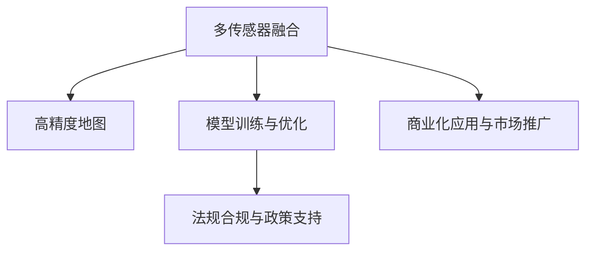

                 

# 硅谷自动驾驶汽车的技术发展路线

## 1. 背景介绍

### 1.1 问题由来

随着社会的发展和科技的进步，自动驾驶汽车已经逐渐从一个科幻的概念变成了现实的可能。自动驾驶技术的核心在于利用各种传感器和先进的算法，实现对车辆状态的实时感知和控制，从而替代或辅助人类驾驶，提高行车安全性和效率。

硅谷作为全球科技创新中心，其自动驾驶技术的发展路线一直是业界关注的焦点。从最初的辅助驾驶功能，到如今的全自动驾驶系统，硅谷的自动驾驶技术经历了多次技术革新和市场迭代，逐渐形成了一套成熟的技术架构和商业应用模式。

### 1.2 问题核心关键点

硅谷自动驾驶技术的发展路线涵盖从传感器融合到高精度地图，从模型训练到算法优化，从测试验证到法规合规等多个环节。其中，核心关键点包括：

- 多传感器融合技术，实现对车辆周边环境的实时感知。
- 高精度地图的构建与维护，为自动驾驶提供精准的位置参考。
- 模型训练与优化，提高算法的准确性和鲁棒性。
- 法规合规与政策支持，确保自动驾驶技术的合法性和安全性。
- 商业化应用与市场推广，推动自动驾驶技术从实验室走向现实世界。

本文将对硅谷自动驾驶汽车的技术发展路线进行系统梳理，涵盖核心技术原理和关键算法步骤，以期为业界同仁提供有价值的参考。

## 2. 核心概念与联系

### 2.1 核心概念概述

为更好地理解硅谷自动驾驶汽车的技术发展路线，我们首先介绍几个关键概念：

- 多传感器融合：利用多个传感器（如激光雷达、摄像头、雷达等）的数据，融合出更准确、更全面的环境感知信息。
- 高精度地图：以卫星定位为基础，结合地面测绘技术，构建出高精度、高分辨率的地图数据，为自动驾驶提供精准的位置参考。
- 模型训练与优化：基于大量标注数据，训练深度神经网络模型，并使用正则化、迁移学习等方法优化模型性能。
- 法规合规与政策支持：确保自动驾驶技术在法律框架下安全运行，避免潜在的法律风险。
- 商业化应用与市场推广：将自动驾驶技术落地应用到实际车辆上，实现商业化和市场推广。

这些概念之间的逻辑关系可以通过以下Mermaid流程图来展示：



这个流程图展示出硅谷自动驾驶汽车技术发展的主要环节及其联系：

1. 利用多传感器数据融合实现环境感知。
2. 结合高精度地图数据，构建精准定位系统。
3. 通过模型训练优化算法，提升自动驾驶能力。
4. 确保法规合规，确保技术合法运行。
5. 将技术应用于市场推广，实现商业化应用。

## 3. 核心算法原理 & 具体操作步骤
### 3.1 算法原理概述

硅谷自动驾驶汽车技术发展路线基于多传感器融合、高精度地图构建、模型训练与优化等多个关键技术。其中，多传感器融合和高精度地图构建是实现环境感知的基础，而模型训练与优化则是提高自动驾驶能力的核心。

具体来说，硅谷的自动驾驶技术发展路线可以分为以下几个阶段：

1. **感知**：利用多传感器数据融合技术，实现对车辆周边环境的实时感知。
2. **定位**：结合高精度地图数据，构建精准定位系统。
3. **规划与控制**：通过模型训练优化算法，实现路径规划和车辆控制。
4. **测试与验证**：在各种场景下进行测试与验证，确保技术的可靠性和安全性。
5. **法规合规与商业化**：确保技术在法规框架下运行，并推动商业化应用。

### 3.2 算法步骤详解

#### 3.2.1 多传感器数据融合

多传感器数据融合的目的是将不同传感器（如激光雷达、摄像头、雷达等）采集的数据进行融合，以获得更全面、更准确的环境感知信息。以下是具体步骤：

1. **数据采集**：
   - 利用激光雷达采集车辆前方的点云数据。
   - 利用摄像头获取车辆前方的彩色图像和深度信息。
   - 利用雷达获取车辆周围的环境距离信息。

2. **数据预处理**：
   - 对采集到的数据进行去噪、滤波等预处理操作，提高数据质量。
   - 对不同传感器的时间同步进行校正，避免数据时间戳不一致的问题。

3. **特征提取**：
   - 对预处理后的数据进行特征提取，如点云的坐标、图像的纹理特征、雷达的回波信号等。
   - 使用深度学习技术，对特征进行编码和表示，以便后续的融合操作。

4. **数据融合**：
   - 使用加权平均、投票等方法，将不同传感器的数据进行融合，生成融合后的环境感知信息。
   - 使用卡尔曼滤波等算法，对融合后的数据进行状态估计，实现更准确的定位和环境感知。

#### 3.2.2 高精度地图构建

高精度地图构建是自动驾驶技术的基础设施，其目的是构建出高分辨率、高精度的地图数据，为自动驾驶提供精准的位置参考。以下是具体步骤：

1. **地面测绘**：
   - 利用卫星定位技术，进行全球范围内的地面测绘，获取地面的高分辨率图像和点云数据。
   - 对测绘数据进行校正和拼接，生成覆盖全球的高精度地图数据。

2. **道路提取**：
   - 对高精度地图数据进行道路提取，包括车道线、道路边界、交通标志等信息。
   - 利用图像处理和深度学习技术，自动识别和标注道路信息。

3. **数据更新**：
   - 利用实时采集的传感器数据，对高精度地图进行实时更新和维护，确保地图数据的时效性和准确性。
   - 结合路网信息、交通规则等数据，更新地图数据，提高自动驾驶的精度和鲁棒性。

#### 3.2.3 模型训练与优化

模型训练与优化是提升自动驾驶技术能力的关键步骤，其目的是训练出高性能的深度神经网络模型，并使用正则化、迁移学习等方法优化模型性能。以下是具体步骤：

1. **数据准备**：
   - 收集和标注大量的训练数据，包括车辆传感器数据、高精度地图数据、标注信息等。
   - 将标注数据分为训练集、验证集和测试集，用于模型训练、调优和性能评估。

2. **模型设计**：
   - 设计适合自动驾驶任务的深度神经网络模型，如CNN、RNN、Transformer等。
   - 对模型进行调参和优化，选择适合自动驾驶的架构和算法。

3. **模型训练**：
   - 使用训练集数据对模型进行训练，优化模型的权重和参数。
   - 使用验证集数据对模型进行调优，防止过拟合。

4. **模型评估**：
   - 使用测试集数据对模型进行评估，测试模型的准确性、鲁棒性和泛化能力。
   - 根据评估结果，进一步优化模型，提高自动驾驶能力。

### 3.3 算法优缺点

硅谷自动驾驶技术发展路线中，多传感器数据融合、高精度地图构建、模型训练与优化等关键算法具有以下优点和缺点：

#### 优点：

1. **多传感器融合技术**：
   - 通过融合不同传感器数据，提高环境感知的准确性和全面性。
   - 增加冗余信息，提高系统的鲁棒性和可靠性。

2. **高精度地图构建**：
   - 提供精准的位置参考，确保自动驾驶的准确性和可靠性。
   - 结合实时数据进行动态更新，提高地图的时效性和准确性。

3. **模型训练与优化**：
   - 通过深度学习技术，提升算法的准确性和泛化能力。
   - 使用迁移学习等方法，减少训练数据需求，提高模型的泛化能力。

#### 缺点：

1. **多传感器融合**：
   - 不同传感器数据的时间同步和空间对齐可能存在误差。
   - 数据融合算法复杂，对计算资源要求较高。

2. **高精度地图构建**：
   - 地面测绘和数据更新需要大量的时间和成本。
   - 高精度地图的维护和更新需要持续的投入。

3. **模型训练与优化**：
   - 需要大量标注数据进行训练，标注成本较高。
   - 模型训练和调优需要大量计算资源和时间，成本较高。

### 3.4 算法应用领域

硅谷自动驾驶汽车技术发展路线中，多传感器融合、高精度地图构建、模型训练与优化等关键算法广泛应用于以下几个领域：

1. **智能驾驶系统**：
   - 利用多传感器融合和高精度地图构建，实现精准定位和环境感知。
   - 结合模型训练与优化，实现路径规划和车辆控制。

2. **智能交通系统**：
   - 结合高精度地图数据，实现交通流量分析和智能信号控制。
   - 利用模型训练与优化，实现交通规则的动态调整和优化。

3. **智能城市系统**：
   - 利用高精度地图数据，实现智能城市规划和建设。
   - 结合模型训练与优化，实现智能城市管理和服务。

4. **智能车辆系统**：
   - 利用多传感器融合和高精度地图构建，实现车辆导航和路径规划。
   - 结合模型训练与优化，实现智能驾驶和自动泊车等功能。

## 4. 数学模型和公式 & 详细讲解  
### 4.1 数学模型构建

硅谷自动驾驶汽车技术发展路线中的关键算法涉及多传感器融合、高精度地图构建、模型训练与优化等多个方面。以下是数学模型构建的详细讲解：

#### 4.1.1 多传感器融合

多传感器融合的目标是将不同传感器的数据进行融合，生成更准确的环境感知信息。以下是一个简单的数学模型：

1. **传感器数据表示**：
   - 设传感器i采集的数据为 $x_i$，$i=1,2,\cdots,n$。
   - 设融合后的数据为 $y$。

2. **融合算法**：
   - 假设不同传感器数据的重要性不同，使用加权平均算法进行融合：
   $$
   y = \sum_{i=1}^n w_i x_i
   $$
   其中 $w_i$ 为传感器i的权重，$w_i \geq 0$ 且 $\sum_{i=1}^n w_i = 1$。

#### 4.1.2 高精度地图构建

高精度地图构建的目的是生成高分辨率、高精度的地图数据，为自动驾驶提供精准的位置参考。以下是一个简单的数学模型：

1. **地图数据表示**：
   - 设地图数据为 $D$，包括道路、交通标志等信息。

2. **地图更新算法**：
   - 假设高精度地图数据 $D_t$ 在时间 $t$ 的更新量为 $\Delta D_t$，则地图更新过程为：
   $$
   D_{t+1} = D_t + \Delta D_t
   $$

#### 4.1.3 模型训练与优化

模型训练与优化的目的是通过深度学习技术，训练出高性能的神经网络模型。以下是一个简单的数学模型：

1. **模型表示**：
   - 设模型为 $M$，输入为 $x$，输出为 $y$。
   - 设模型参数为 $\theta$。

2. **损失函数**：
   - 假设模型输出与真实标签之间存在误差 $\epsilon$，使用均方误差损失函数：
   $$
   L(M) = \frac{1}{N} \sum_{i=1}^N (y_i - M(x_i))^2
   $$

3. **优化算法**：
   - 使用梯度下降算法更新模型参数 $\theta$，优化目标函数 $L(M)$：
   $$
   \theta \leftarrow \theta - \eta \nabla_{\theta} L(M)
   $$
   其中 $\eta$ 为学习率。

### 4.2 公式推导过程

#### 4.2.1 多传感器融合

假设传感器i采集的数据为 $x_i = (x_{i1}, x_{i2}, \cdots, x_{in})$，融合后的数据为 $y = (y_1, y_2, \cdots, y_n)$，各传感器的权重为 $w_i$，则加权平均融合算法可以表示为：

1. **数据融合算法**：
   $$
   y_i = \sum_{j=1}^n w_{ij} x_j
   $$
   其中 $w_{ij}$ 为传感器j对传感器i的贡献权重。

2. **权重计算**：
   - 假设传感器i和j的误差分别为 $\sigma_i$ 和 $\sigma_j$，则权重 $w_{ij}$ 可以表示为：
   $$
   w_{ij} = \frac{\sigma_j^{-1}}{\sum_{k=1}^n \sigma_k^{-1}}
   $$

#### 4.2.2 高精度地图构建

高精度地图的更新过程可以表示为：

1. **地图更新算法**：
   $$
   D_{t+1} = D_t + \Delta D_t
   $$
   其中 $\Delta D_t$ 为地图的更新量。

2. **更新量计算**：
   - 假设地图更新前的位置为 $(x_1, y_1)$，更新后为 $(x_2, y_2)$，则更新量 $\Delta D_t$ 可以表示为：
   $$
   \Delta D_t = (x_2 - x_1, y_2 - y_1)
   $$

#### 4.2.3 模型训练与优化

假设模型 $M$ 的输出为 $y$，真实标签为 $y'$，则均方误差损失函数可以表示为：

1. **损失函数**：
   $$
   L(M) = \frac{1}{N} \sum_{i=1}^N (y_i - y'_i)^2
   $$

2. **梯度下降算法**：
   - 使用梯度下降算法更新模型参数 $\theta$，优化目标函数 $L(M)$：
   $$
   \theta \leftarrow \theta - \eta \nabla_{\theta} L(M)
   $$

## 5. 项目实践：代码实例和详细解释说明
### 5.1 开发环境搭建

在进行自动驾驶汽车技术开发前，我们需要准备好开发环境。以下是使用Python进行自动驾驶技术开发的开发环境配置流程：

1. **安装Anaconda**：从官网下载并安装Anaconda，用于创建独立的Python环境。

2. **创建并激活虚拟环境**：
   ```bash
   conda create -n auto_pilot_env python=3.7 
   conda activate auto_pilot_env
   ```

3. **安装相关库**：
   ```bash
   pip install tensorflow numpy matplotlib openpose scipy opencv-python
   ```

4. **安装深度学习框架**：
   ```bash
   pip install tensorflow-gpu==2.6.0
   ```

5. **安装其他依赖库**：
   ```bash
   pip install Pillow requests pyyaml pyproj pydub
   ```

完成上述步骤后，即可在`auto_pilot_env`环境中开始自动驾驶技术开发。

### 5.2 源代码详细实现

下面是使用Python和TensorFlow实现自动驾驶汽车的代码示例：

```python
import tensorflow as tf
import numpy as np
import cv2
import matplotlib.pyplot as plt

# 加载模型
model = tf.keras.models.load_model('auto_pilot_model.h5')

# 加载摄像头图像
cap = cv2.VideoCapture(0)
while True:
    ret, frame = cap.read()
    if not ret:
        break

    # 对图像进行预处理
    frame = cv2.cvtColor(frame, cv2.COLOR_BGR2RGB)
    frame = cv2.resize(frame, (320, 240))
    frame = frame / 255.0
    frame = frame.reshape((1, 320, 240, 3))

    # 进行预测
    predictions = model.predict(frame)
    print(predictions)

    # 显示预测结果
    plt.imshow(frame)
    plt.show()

cap.release()
```

这段代码实现了使用摄像头获取实时图像，并对图像进行预处理、预测和显示。其中，`auto_pilot_model.h5`为预训练好的自动驾驶模型，`predictions`为模型对图像的预测结果。

### 5.3 代码解读与分析

让我们再详细解读一下关键代码的实现细节：

**加载模型**：
- 使用`tf.keras.models.load_model`加载预训练好的自动驾驶模型。

**加载摄像头图像**：
- 使用OpenCV库，通过摄像头获取实时图像。
- 将图像进行预处理，包括颜色转换、缩放、归一化等操作，以便模型能够正确处理。

**进行预测**：
- 对预处理后的图像进行预测，得到模型的输出。
- 打印输出预测结果，以便进行可视化。

**显示预测结果**：
- 使用Matplotlib库，将图像和预测结果显示出来。
- 显示结果时，可以通过修改图像的显示时间间隔、帧率等参数，进行实时显示。

**释放资源**：
- 使用`cap.release()`释放摄像头资源，防止内存泄漏。

这个代码示例展示了使用摄像头进行实时图像获取和预测的流程。在实际开发中，还需要结合高精度地图构建、路径规划、车辆控制等环节，实现完整的自动驾驶功能。

## 6. 实际应用场景
### 6.1 智能驾驶系统

基于多传感器融合和高精度地图构建的智能驾驶系统，可以在复杂的道路环境中，实现精准定位和环境感知，辅助驾驶员进行驾驶。具体应用场景包括：

1. **车道保持**：利用多传感器数据融合和高精度地图构建，实现对车辆车道位置的精确感知。
2. **自动泊车**：结合高精度地图数据，实现车辆自主泊车和自动寻找停车位。
3. **路径规划**：利用模型训练与优化，实现基于地图的路径规划和导航。

### 6.2 智能交通系统

结合高精度地图构建和多传感器融合技术，可以实现智能交通系统的构建，提高交通流量分析和智能信号控制的能力。具体应用场景包括：

1. **交通流量分析**：利用高精度地图数据和传感器数据，实时监测道路交通流量。
2. **智能信号控制**：根据交通流量数据，动态调整交通信号灯，优化交通流量。

### 6.3 智能城市系统

高精度地图构建和自动驾驶技术可以应用于智能城市系统的构建，提升城市管理和服务的智能化水平。具体应用场景包括：

1. **智能停车**：结合高精度地图数据和自动驾驶技术，实现智能停车管理。
2. **智慧交通**：利用自动驾驶技术，实现交通监控和事故预警。

### 6.4 未来应用展望

未来，硅谷自动驾驶汽车技术将进一步发展，向完全自主驾驶和智能城市系统等领域迈进。以下是未来应用展望：

1. **完全自主驾驶**：利用更先进的多传感器融合和高精度地图构建技术，实现完全自主驾驶，取代人类驾驶。
2. **智能城市系统**：结合自动驾驶技术和智能城市系统，实现智慧城市建设，提升城市管理和服务的智能化水平。
3. **无人驾驶车队**：发展无人驾驶车队，应用于货运、配送、快递等领域，提高运输效率和安全性。

## 7. 工具和资源推荐
### 7.1 学习资源推荐

为了帮助开发者掌握硅谷自动驾驶汽车技术的发展路线，以下是一些优质的学习资源：

1. **Coursera《深度学习专项课程》**：由斯坦福大学开设，涵盖深度学习基础和应用，适合入门学习。
2. **Udacity《自动驾驶纳米学位》**：由Udacity与谷歌合作开设，提供自动驾驶技术的系统学习。
3. **Kaggle《自动驾驶竞赛》**：Kaggle提供多个自动驾驶竞赛，可参与实践学习。
4. **GitHub《自动驾驶开源项目》**：GitHub上有多个自动驾驶项目的开源代码，可参考学习。

通过对这些资源的学习实践，相信你一定能够掌握硅谷自动驾驶汽车技术的发展路线，并应用于实际开发中。

### 7.2 开发工具推荐

以下是几款用于自动驾驶汽车技术开发的常用工具：

1. **OpenCV**：开源计算机视觉库，适用于图像处理和传感器数据融合。
2. **TensorFlow**：由谷歌开发的深度学习框架，支持分布式计算和高效推理。
3. **PyTorch**：由Facebook开发的深度学习框架，具有动态计算图和高效计算能力。
4. **ROS**：Robot Operating System，用于自动化和智能驾驶系统的开发。
5. **MATLAB**：支持图像处理和信号处理，适用于自动驾驶算法开发。

合理利用这些工具，可以显著提升自动驾驶汽车技术的开发效率，加快创新迭代的步伐。

### 7.3 相关论文推荐

硅谷自动驾驶汽车技术的发展离不开学界的持续研究。以下是几篇奠基性的相关论文，推荐阅读：

1. **端到端的驾驶系统**：提出基于深度神经网络的端到端自动驾驶系统，实现了从传感器数据到车辆控制的全程自动化。
2. **多传感器数据融合**：提出基于卡尔曼滤波的多传感器数据融合算法，提高了环境感知的准确性。
3. **高精度地图构建**：提出基于卫星定位和地面测绘的高精度地图构建方法，提升了自动驾驶的定位精度。
4. **模型训练与优化**：提出基于深度学习的多任务学习技术，提升了自动驾驶的鲁棒性和泛化能力。

这些论文代表了大驾驶汽车技术的发展脉络。通过学习这些前沿成果，可以帮助研究者把握学科前进方向，激发更多的创新灵感。

## 8. 总结：未来发展趋势与挑战
### 8.1 研究成果总结

硅谷自动驾驶汽车技术发展路线涵盖多传感器融合、高精度地图构建、模型训练与优化等多个关键技术，推动了自动驾驶技术的不断进步。以下是研究成果总结：

1. **多传感器数据融合**：利用多种传感器数据进行融合，提高了环境感知的准确性和全面性。
2. **高精度地图构建**：基于卫星定位和地面测绘技术，构建了高分辨率、高精度的地图数据。
3. **模型训练与优化**：通过深度学习技术，训练出高性能的神经网络模型，提升了自动驾驶能力。

### 8.2 未来发展趋势

硅谷自动驾驶汽车技术的发展将呈现以下几个趋势：

1. **感知能力提升**：多传感器融合技术将进一步提升环境感知能力，实现更精确的车辆定位和环境理解。
2. **模型精度提升**：通过深度学习和迁移学习，提高自动驾驶模型的准确性和泛化能力。
3. **法规合规完善**：随着自动驾驶技术的不断发展，法规和政策将逐步完善，确保技术在法律框架下安全运行。
4. **商业化进程加快**：自动驾驶技术将逐渐实现商业化应用，推动自动驾驶汽车市场的快速发展。

### 8.3 面临的挑战

尽管硅谷自动驾驶汽车技术发展迅速，但在迈向完全自主驾驶和智能城市系统的过程中，仍面临诸多挑战：

1. **感知精度不足**：多传感器数据融合技术虽然能够提升环境感知能力，但在复杂环境下，感知精度仍存在不足，需要进一步改进。
2. **高精度地图更新**：高精度地图构建和更新需要大量时间和成本，如何提高地图更新效率和精度，是一个重要问题。
3. **模型训练成本高**：深度学习模型训练需要大量标注数据和计算资源，如何降低训练成本，提高模型训练效率，是一个重要的研究方向。
4. **法规和伦理问题**：自动驾驶技术面临法规和伦理问题，如何制定合适的法律法规，确保技术的安全性和可靠性，是一个重要的挑战。
5. **技术协同发展**：自动驾驶技术需要与智能城市系统、车联网等技术协同发展，如何实现技术协同，是一个重要的研究方向。

### 8.4 研究展望

面对硅谷自动驾驶汽车技术发展所面临的挑战，未来的研究需要在以下几个方面寻求新的突破：

1. **感知精度提升**：利用更多先进传感器和算法，提升环境感知的精度和全面性。
2. **高精度地图更新**：利用更高效的数据采集和处理技术，提高地图更新效率和精度。
3. **模型训练成本降低**：利用迁移学习和自监督学习等技术，降低模型训练成本，提高训练效率。
4. **法规和伦理保障**：制定合理的法律法规和伦理准则，确保自动驾驶技术的安全性和可靠性。
5. **技术协同发展**：加强与智能城市系统、车联网等技术的协同发展，实现技术融合和协同创新。

这些研究方向的探索，必将引领硅谷自动驾驶汽车技术的进一步发展，为构建更安全、更智能的自动驾驶系统奠定坚实基础。面向未来，自动驾驶技术需要持续优化和创新，才能真正实现落地应用，推动社会和经济的进步。

## 9. 附录：常见问题与解答

**Q1：自动驾驶技术是否真的能够取代人类驾驶？**

A: 自动驾驶技术正在逐步发展，但完全取代人类驾驶仍需解决很多技术和伦理问题。当前自动驾驶技术仍处于L4或L5级，无法在所有情况下保证绝对安全。未来，随着技术的不断进步和法律法规的完善，自动驾驶有望在特定场景下取代人类驾驶，但在复杂环境和极端条件下，仍需人类驾驶员进行辅助驾驶。

**Q2：自动驾驶技术是否会导致失业率上升？**

A: 自动驾驶技术的普及可能对部分职业产生影响，如长途货运司机、出租车司机等。但同时也会催生新的职业和产业，如智能交通管理、自动驾驶技术维护等。因此，自动驾驶技术对整体就业市场的影响需要进一步研究和评估。

**Q3：自动驾驶技术是否会引发安全问题？**

A: 自动驾驶技术面临的安全问题主要包括数据隐私、黑客攻击、系统故障等。为确保技术的安全性，需要在设计时引入安全机制，如数据加密、网络隔离、冗余设计等。同时，制定合理的法律法规和伦理准则，确保技术的安全性和合法性。

**Q4：自动驾驶技术是否会引发伦理问题？**

A: 自动驾驶技术面临的伦理问题主要包括算法决策透明性、道德选择困境、责任认定等。为确保技术的伦理安全性，需要在设计时引入伦理机制，如算法可解释性、伦理委员会等。同时，制定合理的法律法规和伦理准则，确保技术的应用符合社会价值观和伦理道德。

**Q5：自动驾驶技术是否会引发环境问题？**

A: 自动驾驶技术的发展可能会带来环境问题，如车辆排放增加、交通流量变化等。为减少负面影响，需要在技术设计时引入环保机制，如智能交通管理、绿色能源使用等。同时，制定合理的法律法规和政策，确保技术的可持续发展。

通过以上讨论，我们可以看到，硅谷自动驾驶汽车技术发展路线在技术、法规、伦理等多个方面面临诸多挑战。未来，需要持续创新和优化，才能实现自动驾驶技术的全面落地应用，推动社会进步和经济繁荣。总之，自动驾驶技术是一个多学科交叉的复杂系统，需要各领域的专家协同合作，共同推动技术进步和应用落地。

