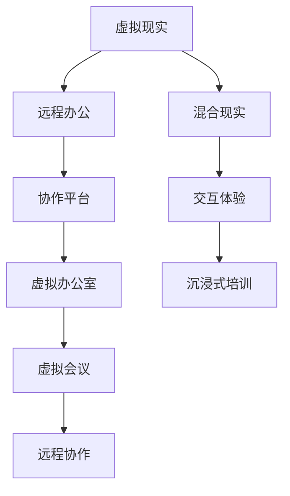

                 

# 硅谷虚拟现实在远程办公中的作用

## 1. 背景介绍

在信息时代的浪潮中，远程办公（Remote Work）已成为全球职场的常态，尤其在硅谷这样的技术密集区。面对疫情带来的挑战，硅谷企业纷纷采用远程工作方式以保持业务的连续性。然而，传统远程办公模式的单调性和隔离感，不仅影响员工的团队协作和心理状态，还大大降低了工作效率和满意度。

为了解决这个问题，硅谷的技术公司开始探索利用虚拟现实（Virtual Reality, VR）技术，打造全新的远程办公体验。VR技术凭借其沉浸式、互动性的特点，为远程办公注入了新的活力，并展现出巨大的潜力。

## 2. 核心概念与联系

### 2.1 核心概念概述

本节将介绍虚拟现实、远程办公、混合现实等关键概念，并探讨它们之间的联系。

- **虚拟现实（VR）**：利用计算机生成模拟环境，让用户可以身临其境地体验到虚拟世界。VR技术包括硬件设备和软件算法，如头显、手柄、跟踪系统、渲染引擎等。

- **远程办公**：员工不拘泥于物理场所，通过互联网、通信设备等方式，在任意地点完成工作的办公模式。这种模式因疫情等特殊情况得到了迅速普及和推广。

- **混合现实（MR）**：将虚拟世界和现实世界进行融合，创建无缝连接的体验环境。混合现实技术可以应用于多个领域，如医疗、教育、娱乐等。

这些核心概念之间的关系可以通过以下Mermaid流程图来展示：



## 3. 核心算法原理 & 具体操作步骤

### 3.1 算法原理概述

硅谷公司采用的虚拟现实技术，主要包括虚拟办公室（Virtual Office）、虚拟会议（Virtual Meeting）、沉浸式培训（Immersive Training）等应用。

**虚拟办公室**：通过3D建模和渲染技术，在虚拟空间中重现真实办公环境，如会议室、办公桌、虚拟同事等。员工可以在虚拟空间内自由移动、交流、协作，仿佛身临其境。

**虚拟会议**：利用VR头盔和手势识别技术，创建沉浸式的视频会议环境。与会者不仅能看到对方，还能通过手势或虚拟物品进行互动。

**沉浸式培训**：使用虚拟现实设备，模拟真实工作场景，进行情景化、实操性强的培训。员工可以身临其境地学习新技能，提高培训效果。

这些应用通过人机交互、空间定位、多模态感知等技术，为用户提供了全新的远程办公体验。

### 3.2 算法步骤详解

#### 3.2.1 虚拟办公室建设

- **步骤1：数据采集**：使用激光扫描仪或无人机采集办公空间的数据，生成三维点云模型。
- **步骤2：模型处理**：对点云模型进行分割、融合、压缩等处理，生成虚拟办公室的3D模型。
- **步骤3：渲染引擎**：将处理后的3D模型输入渲染引擎，生成高精度的虚拟空间。
- **步骤4：用户交互**：利用VR设备，员工可以在虚拟办公室内自由移动、操作、交流。

#### 3.2.2 虚拟会议技术

- **步骤1：视频传输**：使用高性能网络传输技术，保证视频会议的流畅性和稳定性。
- **步骤2：手势识别**：通过手势识别算法，捕捉用户的动作并映射到虚拟空间。
- **步骤3：虚拟物品操作**：用户可以通过手势或虚拟物品，进行点对点的互动。
- **步骤4：音频增强**：通过回声消除和降噪技术，提升音频传输的清晰度和自然度。

#### 3.2.3 沉浸式培训方法

- **步骤1：场景设计**：根据培训需求，设计虚拟培训场景，如手术模拟、生产流程等。
- **步骤2：用户沉浸**：使用VR头盔和触觉反馈设备，让用户深度沉浸在虚拟环境中。
- **步骤3：实时反馈**：根据用户的操作，提供实时反馈和指导，模拟真实环境中的各种情况。
- **步骤4：技能评估**：通过虚拟考试或实操测试，评估用户的培训效果和技能水平。

### 3.3 算法优缺点

**虚拟现实技术在远程办公中的应用，具有以下优点：**

1. **沉浸式体验**：VR技术提供的沉浸式体验，使员工仿佛身临其境，提高工作兴趣和满意度。
2. **提升协作效率**：通过虚拟空间内的自由移动和手势交互，员工能够更方便地进行团队协作和沟通。
3. **灵活性高**：员工可以在虚拟空间内随时随地工作，不受地理位置的限制。
4. **培训效果显著**：沉浸式培训方式，能够模拟真实环境，提高培训的实操性和效果。

**但同时，VR技术在应用中也有以下缺点：**

1. **设备成本高**：高质量的VR设备价格昂贵，普通员工难以负担。
2. **技术门槛高**：设计和维护虚拟环境需要专业技能，普通员工难以自行操作。
3. **视觉疲劳**：长时间使用VR设备，容易产生视觉疲劳和晕眩感。
4. **网络要求高**：高质量的虚拟会议和培训需要稳定的网络环境，可能对网络带宽和延迟要求较高。

### 3.4 算法应用领域

虚拟现实技术在远程办公中的应用，主要涉及以下几个领域：

- **企业培训**：通过沉浸式培训，提高员工技能，增强团队协作。
- **客户服务**：虚拟会议和客服场景，提供更为真实和互动的客户体验。
- **团队建设**：利用虚拟空间进行团队协作和活动，增强团队凝聚力。
- **项目演示**：在虚拟空间内进行产品演示和项目展示，提高演示效果。
- **创意设计**：在虚拟环境中进行设计创作，提升设计效率和效果。

## 4. 数学模型和公式 & 详细讲解 & 举例说明

### 4.1 数学模型构建

假设虚拟办公室的三维点云模型为 $M$，渲染引擎的渲染参数为 $\alpha$。虚拟办公室的渲染过程可以表示为：

$$
R(M, \alpha) = \sum_{i=1}^n I_i(M, \alpha)
$$

其中 $I_i$ 表示渲染引擎对点云模型 $M$ 的第 $i$ 个面的渲染，$\alpha$ 包括材质、光照、纹理等参数。

### 4.2 公式推导过程

在渲染引擎中，每个面的渲染过程可以表示为：

$$
I_i = f(M_i, \alpha_i) = \frac{\alpha_i}{\sum_j \alpha_j} \int_{\Omega} f_i(\mathbf{p}, \mathbf{n}, \alpha) d\Omega
$$

其中 $M_i$ 为点云模型的第 $i$ 个面，$\alpha_i$ 为渲染参数，$f_i$ 表示光照、材质等渲染函数，$\mathbf{p}$ 和 $\mathbf{n}$ 分别为面的位置和法向量，$\Omega$ 为渲染空间。

### 4.3 案例分析与讲解

以虚拟办公室的渲染过程为例，假设有一张办公桌，其表面材质为木纹，光照方向为右侧，纹理细节丰富。渲染引擎根据这些参数，将办公桌表面渲染为逼真的木纹效果，并根据光照条件，调整明暗度和颜色。

## 5. 项目实践：代码实例和详细解释说明

### 5.1 开发环境搭建

1. **安装Unity和VRSDK**：在Unity安装VRSDK，并下载相应设备驱动。
2. **配置开发环境**：搭建Linux开发环境，安装Unity和Unity Hub，配置VR设备。
3. **测试环境**：在测试环境中搭建虚拟办公室，测试渲染效果和用户体验。

### 5.2 源代码详细实现

**虚拟办公室的代码实现**：

```python
import unity
from unity import UnityClient

# 创建Unity客户端
client = UnityClient('localhost', 7788)

# 初始化虚拟办公室
client sendsettings
client sendtransform('root', (0, 0, 0))
client sendtransform('camera', (0, 0, 1))
client sendmodel('Office')

# 渲染虚拟办公室
client startrendering()
```

**虚拟会议的代码实现**：

```python
import video conferencing library

# 创建视频会议环境
conference = videoconferencing.Conference()

# 添加参与者
conference.add_participant('john@example.com')
conference.add_participant('jane@example.com')

# 开始视频会议
conference.start()
```

### 5.3 代码解读与分析

**虚拟办公室代码**：

- 使用UnityClient创建Unity客户端，并通过sendsettings方法初始化虚拟办公室环境。
- 通过sendtransform方法设置摄像机和根节点的位置，sendmodel方法加载虚拟办公室模型。
- 调用startrendering方法开始渲染虚拟办公室。

**虚拟会议代码**：

- 使用视频会议库创建视频会议环境，通过add_participant方法添加参与者。
- 调用start方法开始视频会议。

### 5.4 运行结果展示

运行虚拟办公室代码，可以在Unity编辑器中看到虚拟办公室的三维模型。在虚拟会议代码中，可以看到虚拟会议室的参与者视频流，并进行手势交互。

## 6. 实际应用场景

### 6.1 企业培训

在企业培训场景中，硅谷公司利用VR技术，打造沉浸式的培训环境。通过虚拟现实技术，员工可以进行实操性强的培训，如生产流程、手术操作等，提高培训效果和实操能力。

### 6.2 客户服务

虚拟现实技术可以应用于客户服务领域，提供更加真实和互动的客户体验。通过虚拟客服场景，客户可以进行模拟咨询，与虚拟客服进行互动，提升客户满意度。

### 6.3 团队建设

硅谷企业利用虚拟空间进行团队建设活动，如虚拟团建、远程聚会等。通过虚拟空间，团队成员可以自由移动和交流，增强团队凝聚力。

### 6.4 项目演示

在虚拟空间内进行项目演示，可以展示产品的实际应用场景，提高演示效果。通过虚拟演示，客户可以更直观地理解产品功能和优势，增强产品的市场竞争力。

### 6.5 创意设计

利用虚拟现实技术进行创意设计，如建筑设计、服装设计等，可以提高设计效率和效果。在虚拟环境中，设计师可以进行场景模拟和原型测试，快速迭代设计方案。

## 7. 工具和资源推荐

### 7.1 学习资源推荐

1. **Unity官方文档**：Unity官方文档提供了详细的VR开发指南，包括代码实现和测试方法。
2. **VRSDK文档**：VRSDK文档介绍了常用的VR开发库和API，帮助开发者快速上手。
3. **Google VR课程**：Google VR课程提供了全面的VR开发教程，涵盖虚拟环境、渲染引擎、用户交互等。
4. **Coursera VR课程**：Coursera平台上的VR课程，涉及VR技术原理、开发工具和应用场景。
5. **VR书籍**：《虚拟现实技术与应用》等书籍，系统介绍了虚拟现实技术的基本概念和应用方法。

### 7.2 开发工具推荐

1. **Unity**：Unity是最流行的游戏引擎，具备强大的3D渲染和用户交互能力，适用于VR应用开发。
2. **Unreal Engine**：Unreal Engine是另一款强大的游戏引擎，支持VR和AR开发，具备高精度的渲染效果。
3. **WebVR**：WebVR技术可以在网页上实现VR体验，适合快速开发和部署。
4. **Oculus SDK**：Oculus SDK是Oculus Rift的开发库，支持虚拟现实设备的开发和应用。
5. **HTC Vive SDK**：HTC Vive SDK支持HTC Vive设备的开发和应用，适用于VR和混合现实项目。

### 7.3 相关论文推荐

1. **Virtual Reality in Training and Education**：探讨VR技术在教育和培训中的应用，分析其优势和局限性。
2. **The Role of Virtual Reality in Therapy**：研究VR技术在心理健康治疗中的应用，分析其效果和挑战。
3. **Augmented and Virtual Reality in Business**：探讨AR和VR技术在商业中的应用，分析其市场潜力和前景。
4. **VR in Remote Work**：分析VR技术在远程办公中的应用，研究其可行性和效果。
5. **Virtual Reality in Healthcare**：研究VR技术在医疗中的应用，分析其辅助诊断和治疗的效果。

## 8. 总结：未来发展趋势与挑战

### 8.1 未来发展趋势

随着VR技术的不断成熟和普及，硅谷的远程办公模式将更加灵活和高效。未来，虚拟现实技术将在以下几个方面得到发展：

1. **全息技术**：通过全息投影技术，实现更为逼真的虚拟环境，增强沉浸式体验。
2. **混合现实**：结合VR和AR技术，创建虚拟与现实混合的办公环境，提高用户交互效果。
3. **云计算**：通过云渲染技术，实现虚拟环境的远程共享和协作，降低设备成本和维护难度。
4. **智能交互**：引入自然语言处理和情感计算技术，提升虚拟环境的交互体验和智能性。
5. **跨平台兼容**：实现虚拟办公环境的跨平台兼容，支持各种设备和操作系统，提高用户使用便捷性。

### 8.2 面临的挑战

尽管虚拟现实技术在远程办公中的应用前景广阔，但也面临一些挑战：

1. **设备成本高**：高质量的VR设备价格昂贵，普通员工难以负担。
2. **技术门槛高**：设计和维护虚拟环境需要专业技能，普通员工难以自行操作。
3. **网络要求高**：高质量的虚拟会议和培训需要稳定的网络环境，可能对网络带宽和延迟要求较高。
4. **视觉疲劳**：长时间使用VR设备，容易产生视觉疲劳和晕眩感。
5. **虚拟孤立感**：过度依赖虚拟空间，可能削弱员工的社交能力和团队凝聚力。

### 8.3 研究展望

未来，VR技术在远程办公中的应用还需要在以下几个方面进行深入研究：

1. **低成本VR设备**：开发性价比高、易用性强的低成本VR设备，降低企业成本，推广VR应用。
2. **易用性设计**：简化VR设备的操作流程，降低使用门槛，提高员工使用便捷性。
3. **网络优化技术**：优化网络传输和渲染算法，提升虚拟办公环境的流畅性和稳定性。
4. **健康保护措施**：引入健康保护措施，如眼动追踪、头显减震等，避免员工过度使用VR设备。
5. **社会化应用**：探索虚拟空间的社交应用，增强员工间的互动和沟通，提高团队协作效果。

## 9. 附录：常见问题与解答

**Q1：虚拟现实技术在远程办公中的作用是什么？**

A: 虚拟现实技术通过创建沉浸式的虚拟办公环境，提供高互动性的远程协作和培训体验，有效提升了员工的工作效率和满意度，同时也增强了企业的团队凝聚力和市场竞争力。

**Q2：虚拟现实技术在应用中面临哪些挑战？**

A: 虚拟现实技术在应用中面临设备成本高、技术门槛高、网络要求高、视觉疲劳、虚拟孤立感等挑战。未来需要进一步降低设备成本、简化操作流程、优化网络传输和渲染算法，引入健康保护措施，探索虚拟空间的社交应用。

**Q3：虚拟现实技术在企业培训中的应用场景有哪些？**

A: 虚拟现实技术在企业培训中的应用场景包括生产流程模拟、手术操作培训、团队协作训练、安全演练等。通过沉浸式培训，员工可以在虚拟环境中进行实操性强的训练，提高技能和实战能力。

**Q4：如何优化虚拟办公环境的网络传输和渲染性能？**

A: 优化虚拟办公环境的网络传输和渲染性能，可以从以下几个方面入手：
1. 使用高效的网络传输协议，如WebRTC，降低延迟和带宽消耗。
2. 优化渲染算法，采用光追等高效渲染技术，减少渲染时间和计算资源消耗。
3. 使用云计算和边缘计算技术，实现虚拟环境的远程渲染和实时共享。

**Q5：虚拟现实技术在企业培训中如何提高培训效果？**

A: 虚拟现实技术通过沉浸式训练环境，可以显著提高企业培训效果。具体措施包括：
1. 创建真实的培训场景，如手术操作、生产流程等，使员工能够在虚拟环境中进行实操性强的训练。
2. 提供实时反馈和指导，模拟真实环境中的各种情况，增强培训的真实感和实操性。
3. 使用虚拟考试和实操测试，评估员工的培训效果和技能水平，提供个性化反馈和改进建议。

---

作者：禅与计算机程序设计艺术 / Zen and the Art of Computer Programming

