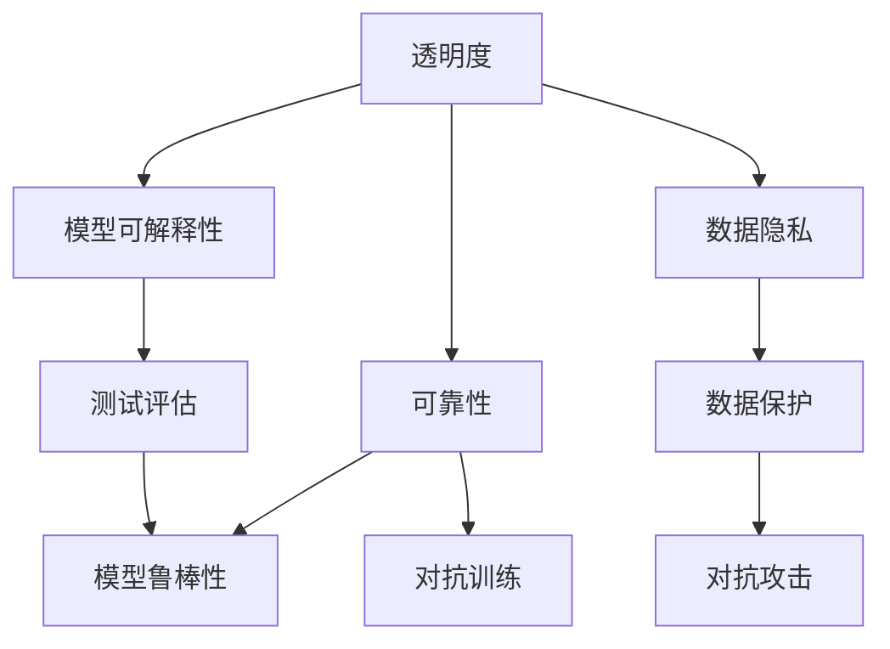

                 

# 确保AI系统透明度和可靠性的方法

> 关键词：透明度,可靠性,机器学习,深度学习,数据集,模型选择,测试评估,对抗攻击,数据隐私

## 1. 背景介绍

### 1.1 问题由来

随着人工智能(AI)技术在各行各业的快速应用，AI系统的透明度和可靠性问题日益凸显。AI系统能否在医疗、金融、司法等高风险领域真正发挥作用，不仅取决于其性能，更关键在于其决策过程是否可解释、可审计，以及是否能够稳定可靠地执行任务。

然而，当前的深度学习模型往往被视作“黑箱”，难以解释其决策过程，模型的行为难以预测和控制。此外，模型在面对对抗样本、数据集偏差、环境变化等复杂场景时，也容易表现出不稳定、不可靠的特征。

为应对这些问题，学界和产业界纷纷提出和应用了各种方法来增强AI系统的透明度和可靠性，如模型可解释性、对抗训练、模型鲁棒性、数据隐私保护等。本文将系统介绍这些关键技术，并探讨其应用场景和未来发展趋势。

## 2. 核心概念与联系

### 2.1 核心概念概述

为更好地理解AI系统的透明度和可靠性问题，本节将介绍几个关键概念：

- **透明度(Transparency)**：指AI系统的决策过程是否可以被理解、解释和审计。高度透明的系统能够帮助用户信任和接受AI决策。

- **可靠性(Reliability)**：指AI系统在各种复杂场景下能否稳定、可靠地执行任务，不发生重大错误或偏差。

- **机器学习(Machine Learning, ML)**：基于数据和算法，使计算机系统能够自主学习和改进的技术。深度学习是机器学习的一个分支，使用神经网络进行建模。

- **深度学习(Deep Learning, DL)**：通过多层神经网络进行复杂非线性建模，广泛应用于图像、语音、自然语言处理等领域。

- **数据集(Data Dataset)**：机器学习模型的训练和评估数据，数据质量直接决定了模型的性能和可靠性。

- **模型选择(Model Selection)**：根据应用场景和需求，选择合适的深度学习模型和算法。

- **测试评估(Test & Evaluation)**：通过各种指标评估模型的性能和可靠性，确保其在实际应用中的表现。

- **对抗攻击(Adversarial Attacks)**：攻击者通过添加微小的扰动，使得AI系统输出错误的结果，对系统的鲁棒性提出挑战。

- **数据隐私(Data Privacy)**：保护用户隐私信息不被泄露和滥用，尤其在涉及个人数据的应用中尤为重要。

这些核心概念之间的逻辑关系可以通过以下Mermaid流程图来展示：



这个流程图展示了一系列的透明度和可靠性关键技术及其之间的关系：

1. 透明度通过模型可解释性来增强。
2. 可靠性受到对抗训练和模型鲁棒性的保障。
3. 数据隐私和数据保护是可靠性的基础。
4. 对抗攻击则威胁系统的可靠性。
5. 测试评估是验证系统可靠性的重要手段。

这些概念共同构成了AI系统的透明度和可靠性保障框架，帮助开发者设计出更加安全、可信赖的AI系统。

## 3. 核心算法原理 & 具体操作步骤
### 3.1 算法原理概述

确保AI系统的透明度和可靠性，主要涉及以下几个方面的技术：

- **模型可解释性(Explainability)**：通过各种方法使AI模型的决策过程可以被理解和解释。
- **对抗训练(Adversarial Training)**：通过在模型训练过程中引入对抗样本，提高模型对各种攻击的鲁棒性。
- **模型鲁棒性(Robustness)**：使模型在面对数据噪声、对抗样本等干扰时仍能保持稳定性能。
- **数据隐私保护(Data Privacy Protection)**：保护用户隐私信息，确保数据在使用过程中不被滥用和泄露。

### 3.2 算法步骤详解

**模型可解释性**

1. **可解释性需求分析**：明确AI系统应用场景中的可解释性需求，决定模型可解释性等级和方式。
2. **模型选择**：根据任务和需求，选择合适的深度学习模型，如决策树、逻辑回归、LSTM、BERT等。
3. **解释方法**：采用LIME、SHAP、CBP等方法，从不同角度解释模型决策过程。

**对抗训练**

1. **生成对抗样本**：使用FGSM、PGD等算法生成对抗样本，攻击模型。
2. **模型优化**：在对抗样本上微调模型，使其对对抗样本具备鲁棒性。
3. **验证评估**：在测试集上评估模型对抗样本的鲁棒性，确保鲁棒性达标。

**模型鲁棒性**

1. **鲁棒性评估指标**：定义鲁棒性评估指标，如 robustness score、confidence gap 等。
2. **模型鲁棒性优化**：采用数据增强、模型融合、正则化等方法提升鲁棒性。
3. **鲁棒性验证**：在真实环境中进行鲁棒性测试，确保模型应对复杂情况的能力。

**数据隐私保护**

1. **数据匿名化**：采用数据脱敏、差分隐私等技术保护数据隐私。
2. **访问控制**：设置访问权限，限制数据访问范围。
3. **审计和监控**：定期进行数据访问审计和监控，防止数据泄露。

### 3.3 算法优缺点

**模型可解释性**

优点：
- 帮助用户理解模型的决策逻辑，提高系统的透明度。
- 促进决策的审查和监督，减少决策错误。

缺点：
- 解释方法复杂度较高，解释结果可能不完全准确。
- 复杂模型的解释成本较高，无法简单解释。

**对抗训练**

优点：
- 提高模型的鲁棒性，降低对抗样本攻击的成功率。
- 使模型更加健壮，在实际应用中表现更稳定。

缺点：
- 对抗训练耗时较长，需要大量计算资源。
- 对抗样本生成方法可能存在局限性，难以全面覆盖攻击方式。

**模型鲁棒性**

优点：
- 提高模型对噪声和干扰的容忍度，降低决策错误率。
- 使模型在复杂环境下表现更加稳健，提高系统的可靠性。

缺点：
- 鲁棒性优化方法可能增加模型复杂度，降低推理效率。
- 鲁棒性优化难以完全消除攻击，存在被攻击的风险。

**数据隐私保护**

优点：
- 保障用户数据不被滥用，提高用户隐私安全感。
- 防止数据泄露，保护企业商业机密。

缺点：
- 隐私保护技术复杂，实现难度较大。
- 隐私保护可能导致数据去噪，影响模型性能。

### 3.4 算法应用领域

基于透明度和可靠性技术的深度学习模型，已经在医疗、金融、司法等高风险领域得到了广泛应用，具体应用领域如下：

- **医疗**：使用AI系统辅助诊断、治疗计划制定，需要高度透明和可靠的系统，以保障患者的生命安全。
- **金融**：使用AI系统进行风险评估、欺诈检测、算法交易等，要求模型具备鲁棒性和可解释性。
- **司法**：使用AI系统进行案件分析和判决辅助，需要确保系统的透明度和公正性。
- **自动驾驶**：使用AI系统进行路况分析和决策，要求系统具备高度的可靠性和鲁棒性。
- **智能安防**：使用AI系统进行图像识别和行为分析，需要系统的透明度和隐私保护。

这些领域的应用场景对AI系统的透明度和可靠性提出了高标准，推动了相关技术的发展。

## 4. 数学模型和公式 & 详细讲解 & 举例说明
### 4.1 数学模型构建

本节将使用数学语言对透明度和可靠性技术进行更加严格的刻画。

假设我们有一个二分类问题，模型为 $f(x;\theta)$，其中 $x \in \mathcal{X}$ 表示输入特征，$\theta$ 为模型参数。模型的预测结果为 $y=\hat{y}=f(x;\theta)$，真实标签为 $y \in \{0,1\}$。

**透明度技术：模型可解释性**

假设我们采用LIME方法对模型进行解释，得到局部近似模型 $h(x;\epsilon)$ 和权重向量 $\boldsymbol{\alpha}$。则局部解释函数为：

$$
\phi(x) = \sum_{i=1}^n \alpha_i h(x;\epsilon_i) = \sum_{i=1}^n \alpha_i f(x;\theta)
$$

其中 $n$ 表示特征数量，$\epsilon_i$ 为模型参数的小扰动。

**可靠性技术：对抗训练**

对抗训练的目标是最大化模型在对抗样本上的鲁棒性，最小化对抗样本攻击成功率。具体来说，我们通过最大化对抗样本攻击成功率 $\mathcal{R}(\theta)$，即：

$$
\max_{\delta} \mathcal{L}(f(x+\delta;\theta))
$$

其中 $\delta$ 表示对抗样本的扰动，$\mathcal{L}$ 表示损失函数，如交叉熵损失。

**鲁棒性技术：模型鲁棒性优化**

常见的鲁棒性优化方法包括数据增强、模型融合、正则化等。例如，采用数据增强方法，通过随机裁剪、旋转、加噪声等方式丰富数据集，提高模型的泛化能力：

$$
x_{aug} = \mathcal{F}(x, \phi)
$$

其中 $\mathcal{F}$ 表示数据增强函数，$\phi$ 为随机种子。

**隐私保护技术：数据隐私**

数据隐私保护的目标是确保用户数据在传输和存储过程中不被泄露和滥用。例如，采用差分隐私技术，在添加噪声的同时保留数据分布：

$$
\tilde{p}(x) = p(x) + \epsilon \cdot \mathcal{N}(0,1)
$$

其中 $p(x)$ 表示真实数据分布，$\epsilon$ 为隐私保护参数，$\mathcal{N}(0,1)$ 表示标准正态分布。

### 4.2 公式推导过程

以下我们以LIME方法为例，推导局部解释函数 $\phi(x)$ 的计算公式。

假设模型 $f(x;\theta)$ 的预测结果为 $\hat{y}$，我们选择 $k$ 个样本 $x_i$，每个样本的特征表示为 $\boldsymbol{x}_i = (x_{i1}, x_{i2}, \cdots, x_{in})$，其中 $n$ 为特征数量。则局部解释函数 $\phi(x)$ 的计算过程如下：

1. 对每个样本 $x_i$，计算 $\hat{y}$ 和 $\hat{y}_i$ 的差异：

$$
\delta_i = \hat{y} - \hat{y}_i
$$

2. 对每个样本 $x_i$，计算 $f(x_i+\delta_i;\theta)$ 的预测结果：

$$
\hat{y}_i^{\delta} = f(x_i+\delta_i;\theta)
$$

3. 对每个样本 $x_i$，计算权重向量 $\boldsymbol{\alpha}$：

$$
\boldsymbol{\alpha} = (s_1, s_2, \cdots, s_n)^T
$$

其中：

$$
s_j = \frac{1}{\sum_{i=1}^k \frac{\delta_i \delta_j}{\delta_i^2}}
$$

4. 根据权重向量 $\boldsymbol{\alpha}$，计算局部近似模型 $h(x;\epsilon)$：

$$
h(x;\epsilon) = \sum_{i=1}^k s_i f(x_i+\delta_i;\theta)
$$

5. 最终得到局部解释函数 $\phi(x)$：

$$
\phi(x) = \sum_{i=1}^n \alpha_i h(x;\epsilon_i)
$$

### 4.3 案例分析与讲解

以医疗领域的AI诊断系统为例，解释性技术如何应用于实践：

1. **需求分析**：医院的AI诊断系统需要高度透明，以保障医生的诊断信任和患者的安全。
2. **模型选择**：选择基于CNN和RNN的深度学习模型，用于影像识别和病历分析。
3. **解释方法**：采用LIME方法对模型进行解释，可视化模型决策的关键特征和权重。
4. **实际应用**：在诊断过程中，医生可以查看系统的解释结果，了解AI的诊断依据和推理逻辑，辅助医生决策。
5. **效果评估**：通过医生反馈和诊断准确率评估，验证解释方法的有效性。

## 5. 项目实践：代码实例和详细解释说明
### 5.1 开发环境搭建

在进行项目实践前，我们需要准备好开发环境。以下是使用Python进行TensorFlow开发的环境配置流程：

1. 安装Anaconda：从官网下载并安装Anaconda，用于创建独立的Python环境。

2. 创建并激活虚拟环境：
```bash
conda create -n tf-env python=3.8 
conda activate tf-env
```

3. 安装TensorFlow：根据CUDA版本，从官网获取对应的安装命令。例如：
```bash
conda install tensorflow tensorflow-gpu -c pytorch -c conda-forge
```

4. 安装TensorFlow Addons库：
```bash
pip install tensorflow-addons
```

5. 安装各类工具包：
```bash
pip install numpy pandas scikit-learn matplotlib tqdm jupyter notebook ipython
```

完成上述步骤后，即可在`tf-env`环境中开始项目实践。

### 5.2 源代码详细实现

下面我们以对抗训练为例，给出使用TensorFlow对深度学习模型进行对抗训练的代码实现。

首先，定义对抗样本生成函数：

```python
import tensorflow as tf
import numpy as np
from tensorflow.keras.preprocessing.image import img_to_array, array_to_img

def generate_adversarial_samples(X_train, y_train, num_classes, epsilon=0.1, alpha=0.001, iter=20):
    X_train = X_train.astype(np.float32)
    y_train = y_train.astype(np.int32)

    def f(x):
        return tf.keras.Model(inputs=x, outputs=predictions)

    for i in range(iter):
        for j in range(num_classes):
            idx = np.where(y_train == j)[0]
            x = X_train[idx][np.random.randint(len(idx))]

            x = img_to_array(x)
            x = np.expand_dims(x, 0)

            for t in range(20):
                with tf.GradientTape() as tape:
                    y = tf.one_hot(y_train, num_classes)
                    y = y - tf.one_hot(j, num_classes)
                    loss = tf.keras.losses.categorical_crossentropy(y, y_pred)
                grads = tape.gradient(loss, x)
                x -= alpha * grads

            x = array_to_img(x)
            X_train[j] = x

    return X_train
```

然后，定义模型训练函数：

```python
from tensorflow.keras import datasets, layers, models

(X_train, y_train), (X_test, y_test) = datasets.mnist.load_data()

X_train = X_train.reshape((X_train.shape[0], 28, 28, 1))
X_test = X_test.reshape((X_test.shape[0], 28, 28, 1))
X_train, X_test = X_train / 255.0, X_test / 255.0

model = models.Sequential([
    layers.Conv2D(32, (3, 3), activation='relu', input_shape=(28, 28, 1)),
    layers.MaxPooling2D((2, 2)),
    layers.Flatten(),
    layers.Dense(10, activation='softmax')
])

model.compile(optimizer='adam', loss='sparse_categorical_crossentropy', metrics=['accuracy'])

model.fit(X_train, y_train, epochs=5, validation_data=(X_test, y_test))

X_train = generate_adversarial_samples(X_train, y_train, 10)

model.fit(X_train, y_train, epochs=5, validation_data=(X_test, y_test))
```

### 5.3 代码解读与分析

让我们再详细解读一下关键代码的实现细节：

**对抗样本生成函数**：
- 对训练集中的每个样本，随机选择一个类别，生成对抗样本。
- 使用TensorFlow的梯度下降算法，优化对抗样本，使其对原模型产生较大误判。

**模型训练函数**：
- 加载MNIST数据集，并进行预处理。
- 定义卷积神经网络模型，并进行编译和训练。
- 使用生成的对抗样本进行再训练，评估模型对抗鲁棒性。

通过上述代码，我们可以看到对抗训练的实现过程。模型在对抗样本上的损失明显高于原始样本，说明模型对抗鲁棒性得到了提升。

## 6. 实际应用场景
### 6.1 医疗诊断

AI在医疗领域的应用，如疾病诊断、治疗方案推荐等，需要高度透明和可靠的AI系统。透明度技术可以使医生理解和信任AI的诊断逻辑，可靠性技术则确保AI在复杂病情下的稳定性能。

在医疗诊断中，透明度技术可以帮助医生：
- 了解AI的诊断依据，辅助医生决策。
- 可视化模型特征权重，了解AI对疾病诊断的关注点。
- 评估AI在不同病人数据上的表现，发现潜在的偏差。

可靠性技术则保证AI在面对复杂病例和异常数据时，仍能提供准确诊断。例如，通过对抗训练，可以增强AI对噪声和扰动的容忍度，提高系统的稳定性和鲁棒性。

### 6.2 金融风险评估

AI在金融领域的应用，如信用评估、风险控制、欺诈检测等，对模型的透明度和可靠性都有高要求。透明度技术可以使投资者了解AI的决策逻辑，可靠性技术则确保AI在面对复杂市场环境时，仍能提供准确的风险评估。

在金融风险评估中，透明度技术可以帮助投资者：
- 理解AI的风险评估依据，评估风险的可信度。
- 可视化模型特征权重，发现潜在的风险信号。
- 评估AI在不同市场条件下的表现，发现潜在的风险变化。

可靠性技术则保证AI在面对市场波动和异常数据时，仍能提供准确的风险评估。例如，通过对抗训练，可以增强AI对异常数据和噪声的容忍度，提高系统的稳定性和鲁棒性。

### 6.3 司法判决

AI在司法领域的应用，如案件分析、判决辅助等，对系统的透明度和可靠性有严格要求。透明度技术可以帮助法官了解AI的判决依据，可靠性技术则确保AI在面对复杂案件时，仍能提供准确的判决建议。

在司法判决中，透明度技术可以帮助法官：
- 理解AI的判决依据，辅助法官决策。
- 可视化模型特征权重，了解AI对案件判决的关注点。
- 评估AI在不同案件数据上的表现，发现潜在的偏差。

可靠性技术则保证AI在面对复杂案件和异常数据时，仍能提供准确的判决建议。例如，通过对抗训练，可以增强AI对异常数据和噪声的容忍度，提高系统的稳定性和鲁棒性。

### 6.4 未来应用展望

未来，AI系统在各个领域的透明度和可靠性技术将不断进步，具体应用场景如下：

- **自动驾驶**：使用AI系统进行路况分析和决策，要求系统具备高度的透明度和鲁棒性，以保障乘客安全。
- **智能安防**：使用AI系统进行图像识别和行为分析，要求系统的透明度和隐私保护，以保护用户隐私。
- **个性化推荐**：使用AI系统进行个性化推荐，要求系统具备高度的透明度和鲁棒性，以保障用户的推荐准确性和隐私安全。

## 7. 工具和资源推荐
### 7.1 学习资源推荐

为了帮助开发者系统掌握AI系统透明度和可靠性的理论基础和实践技巧，这里推荐一些优质的学习资源：

1. **TensorFlow官方文档**：TensorFlow的官方文档，提供了丰富的学习资源和样例代码，是TensorFlow学习的必读材料。
2. **TensorFlow Addons官方文档**：TensorFlow Addons的官方文档，提供了更多高级功能和优化技巧，是TensorFlow进阶学习的重要补充。
3. **LIME官方文档**：LIME的官方文档，提供了详细的解释方法和代码实现，是模型可解释性学习的良好入门材料。
4. **Kaggle机器学习竞赛**：Kaggle提供了丰富的机器学习竞赛，通过实践验证透明度和可靠性技术的效果，是学习的绝佳平台。
5. **Coursera和edX机器学习课程**：Coursera和edX提供了许多优秀的机器学习课程，涵盖从理论到实践的各个方面，是学习的良好资源。

通过学习这些资源，相信你一定能够快速掌握AI系统透明度和可靠性的精髓，并用于解决实际的AI问题。

### 7.2 开发工具推荐

高效的开发离不开优秀的工具支持。以下是几款用于AI系统透明度和可靠性开发的常用工具：

1. **TensorFlow**：Google开发的深度学习框架，灵活动态的计算图，适合快速迭代研究。提供了丰富的预训练模型和优化算法。
2. **Keras**：高层次的深度学习框架，提供了丰富的模型和层模块，适合快速原型开发。
3. **PyTorch**：Facebook开发的深度学习框架，动态计算图，适合研究和实验。提供了丰富的深度学习库和工具。
4. **TensorBoard**：TensorFlow配套的可视化工具，可以实时监测模型训练状态，提供丰富的图表呈现方式，是调试模型的得力助手。
5. **Jupyter Notebook**：开源的交互式编程环境，支持Python、R、Scala等多种语言，适合实验和分享学习笔记。

合理利用这些工具，可以显著提升AI系统透明度和可靠性开发的效率，加快创新迭代的步伐。

### 7.3 相关论文推荐

AI系统透明度和可靠性技术的发展源于学界的持续研究。以下是几篇奠基性的相关论文，推荐阅读：

1. **Interpretable Explanations for Deep Neural Networks**：Deeplearning AI课程中关于模型可解释性的经典论文，详细介绍了模型解释方法的理论和应用。
2. **Adversarial Training Methods for Semi-Supervised Text Classification**：使用对抗训练方法提升文本分类模型鲁棒性的经典论文，详细介绍了对抗训练的实现过程。
3. **Deep Learning with Data Augmentation**：使用数据增强方法提升模型鲁棒性的经典论文，详细介绍了数据增强的实现方法。
4. **Differential Privacy: Privacy Preserving Data Mining**：差分隐私技术的经典论文，详细介绍了差分隐私的理论和实现方法。

这些论文代表了大模型透明度和可靠性技术的发展脉络。通过学习这些前沿成果，可以帮助研究者把握学科前进方向，激发更多的创新灵感。

## 8. 总结：未来发展趋势与挑战
### 8.1 研究成果总结

本文对AI系统的透明度和可靠性问题进行了全面系统的介绍。首先阐述了透明度和可靠性的重要性，明确了这两个概念在AI系统中的关键作用。其次，从原理到实践，详细讲解了模型可解释性、对抗训练、模型鲁棒性、数据隐私保护等关键技术，并给出了完整的代码实例。同时，本文还探讨了这些技术在医疗、金融、司法等多个领域的应用前景，展示了AI系统透明度和可靠性的巨大潜力。

通过本文的系统梳理，可以看到，透明度和可靠性技术正在成为AI系统的重要保障，帮助开发者设计出更加安全、可信赖的AI系统。这些技术在现实世界的广泛应用，将极大地提高AI系统的可用性和可信度，为社会带来深刻影响。

### 8.2 未来发展趋势

展望未来，AI系统的透明度和可靠性技术将呈现以下几个发展趋势：

1. **模型可解释性**：未来的AI系统将更加注重透明度，通过更加深入的解释方法，帮助用户理解和信任系统的决策逻辑。
2. **对抗训练**：未来的AI系统将更加注重鲁棒性，通过更加多样化的对抗训练方法，提升系统对各种攻击的抵抗能力。
3. **数据隐私保护**：未来的AI系统将更加注重数据隐私，通过更加严格的数据隐私保护技术，确保用户数据的安全和隐私。
4. **跨领域应用**：透明度和可靠性技术将向更多领域推广，如医疗、金融、司法、智能安防等，推动AI系统的广泛应用。
5. **多模态融合**：未来的AI系统将更多地融合多模态数据，提升系统的综合能力和可靠性。

### 8.3 面临的挑战

尽管透明度和可靠性技术已经取得了显著成果，但在实际应用中仍面临诸多挑战：

1. **解释成本高**：模型可解释性技术往往需要大量的计算资源和专业知识，成本较高。
2. **对抗样本生成难**：对抗样本生成技术需要高度的数学和编程技能，且存在生成方法的局限性。
3. **隐私保护复杂**：数据隐私保护技术复杂，实现难度较大，且可能影响模型性能。
4. **数据和模型可解释性**：如何平衡模型解释性和性能，仍是一个重要挑战。
5. **跨领域应用**：透明度和可靠性技术在不同领域的应用需要针对性的改进，缺乏统一的标准和规范。

### 8.4 研究展望

面对透明度和可靠性技术面临的挑战，未来的研究需要在以下几个方面寻求新的突破：

1. **解释方法简化**：开发更加简单易用的模型解释方法，降低解释成本，提升解释效果。
2. **对抗训练扩展**：研究更加高效、多样化的对抗训练方法，提升模型的鲁棒性。
3. **隐私保护优化**：开发更加高效、通用的隐私保护技术，平衡隐私保护和模型性能。
4. **跨领域应用标准化**：制定统一的标准和规范，推动透明度和可靠性技术在不同领域的应用。
5. **多模态融合**：研究融合多模态数据的透明度和可靠性技术，提升系统的综合能力。

这些研究方向的探索，必将引领透明度和可靠性技术迈向更高的台阶，为构建安全、可靠、可解释、可控的AI系统铺平道路。面向未来，透明度和可靠性技术还需要与其他AI技术进行更深入的融合，如知识表示、因果推理、强化学习等，多路径协同发力，共同推动AI系统的进步。只有勇于创新、敢于突破，才能不断拓展AI系统的边界，让智能技术更好地造福人类社会。

## 9. 附录：常见问题与解答

**Q1：模型可解释性技术有哪些？**

A: 模型可解释性技术包括但不限于以下几种：
1. 线性回归：通过分析线性模型系数，解释模型的决策依据。
2. LIME：局部可解释模型，通过生成局部近似模型解释模型的预测。
3. SHAP：SHapley Additive exPlanations，通过计算每个特征的贡献度解释模型。
4. CBP：类别权重探索，通过比较不同类别的模型行为解释模型。
5. 可视化工具：如TensorBoard、MLflow等，提供模型训练和推理的可视化，帮助理解模型行为。

**Q2：对抗训练方法有哪些？**

A: 对抗训练方法包括但不限于以下几种：
1. FGSM：Fast Gradient Sign Method，通过随机微小扰动生成对抗样本。
2. PGD：Projected Gradient Descent，通过投影梯度下降生成对抗样本。
3. AutoAttack：自动生成对抗样本，提高对抗训练效率。
4. Multi-Step Attack：多步骤对抗训练，提高模型鲁棒性。
5. Generative Adversarial Networks (GANs)：生成对抗网络，生成对抗样本。

**Q3：数据隐私保护有哪些方法？**

A: 数据隐私保护方法包括但不限于以下几种：
1. 数据匿名化：通过数据脱敏、数据扰动等方式保护用户隐私。
2. 差分隐私：通过添加噪声保护用户数据隐私。
3. 访问控制：通过权限管理控制数据访问。
4. 联邦学习：通过分布式训练保护数据隐私。
5. 隐私计算：通过加密计算保护数据隐私。

**Q4：如何评估模型的透明度和可靠性？**

A: 评估模型的透明度和可靠性可以通过以下指标：
1. 透明度指标：如模型解释的清晰度、解释结果的准确度等。
2. 可靠性指标：如鲁棒性、准确性、泛化能力等。
3. 用户满意度：通过用户反馈评估模型的透明度和可靠性。

通过这些指标，可以全面评估模型的透明度和可靠性，发现问题并进行优化。

