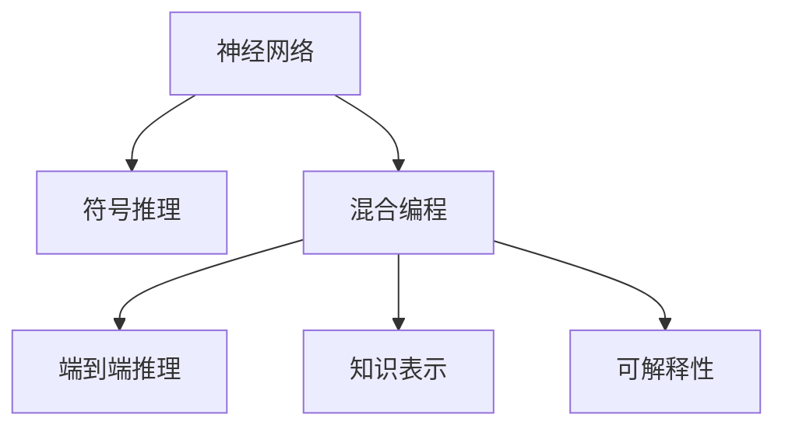

                 

## 1. 背景介绍

### 1.1 问题由来
近年来，深度学习技术取得了显著进展，特别是在图像识别、语音识别、自然语言处理等领域。然而，尽管这些深度学习方法在特定任务上展现了强大的性能，但其缺乏可解释性、泛化能力和对常识理解的局限性，使得其难以在需要逻辑推理和常识推理的任务上发挥最佳效能。符号推理作为人工智能的重要分支，能够有效结合常识和逻辑规则，在自动推理、知识工程、定理证明等任务中发挥关键作用。因此，将深度学习与符号推理相结合，成为当前AI研究的前沿课题。

### 1.2 问题核心关键点
神经符号AI的核心理念在于将神经网络和符号推理技术相结合，以形成一种新的智能推理框架。其主要关键点包括：
- 深度学习模型的表示学习能力和符号推理的逻辑推理能力相结合，可以使得模型具备更强的通用性和可解释性。
- 利用深度学习的分布式表示和符号推理的规则表示，可以更好地处理大规模复杂数据和推理问题。
- 神经符号AI模型能够同时处理定量和符号信息，进行端到端推理，提高推理效率和效果。

### 1.3 问题研究意义
神经符号AI的研究具有重要的理论和实际意义：
- 提高深度学习模型的解释性和可控性，使模型决策过程更透明，更容易被理解和验证。
- 增强模型的泛化能力，使其能够在未见过的数据上取得更好的推理效果。
- 结合符号推理能力，使模型能够处理逻辑、常识和结构化知识，提高其在知识密集型任务中的表现。
- 推动智能系统的智能化和人性化发展，使其更符合人类的认知模式和行为习惯。

## 2. 核心概念与联系

### 2.1 核心概念概述

为更好地理解神经符号AI，本节将介绍几个密切相关的核心概念：

- 神经网络（Neural Network）：由一系列层次化神经元（Neuron）和连接权重（Weight）组成的计算图，用于学习数据的分布式表示。
- 符号推理（Symbolic Reasoning）：基于符号逻辑和规则的推理过程，用于解决逻辑推理、定理证明等问题。
- 混合编程（Hybrid Programming）：结合深度学习和符号推理的编程范式，利用神经网络模型处理数据，利用符号推理处理逻辑和规则。
- 端到端（End-to-End）推理：在神经符号AI模型中，数据从输入到输出完全由模型自动处理，无需人为干预。
- 知识表示（Knowledge Representation）：将常识、规则和知识等非数值信息编码为符号或数值表示，供模型进行推理。
- 可解释性（Explainability）：模型输出结果的可解释性和可理解性，对于医疗、金融等高风险领域尤为重要。

这些概念之间的逻辑关系可以通过以下Mermaid流程图来展示：



这个流程图展示了几大核心概念及其之间的关系：

1. 神经网络通过学习数据分布式表示，提供数据驱动的特征提取能力。
2. 符号推理提供逻辑推理和规则推理能力，处理数据背后的逻辑关系。
3. 混合编程结合神经网络和符号推理，形成一种新的智能推理框架。
4. 端到端推理使数据处理、特征提取、逻辑推理、输出生成一体化完成，提高效率。
5. 知识表示将常识、规则等非数值信息编码为符号或数值，供推理使用。
6. 可解释性用于提高模型的透明度和可信度，便于理解和验证。

## 3. 核心算法原理 & 具体操作步骤

### 3.1 算法原理概述

神经符号AI的核心算法原理结合了神经网络和符号推理的优势，以实现更加强大和全面的智能推理。其基本思想是通过以下步骤进行：

1. **数据预处理**：将输入数据进行预处理，转化为模型所需的分布式表示。
2. **特征提取**：利用神经网络对输入数据进行特征提取，学习数据的高层次表示。
3. **逻辑推理**：将提取的特征和已有的逻辑规则结合，进行逻辑推理和规则推理。
4. **结果输出**：将推理结果进行后处理，输出最终答案或建议。

### 3.2 算法步骤详解

神经符号AI的算法步骤一般包括以下几个关键步骤：

**Step 1: 数据预处理**
- 将输入数据进行编码，转化为神经网络的输入格式。
- 应用自然语言处理技术，提取文本中的关键特征和实体信息。
- 利用符号推理工具，将文本中的逻辑关系进行编码，形成逻辑图或规则集。

**Step 2: 特征提取**
- 选择适合的神经网络结构，如卷积神经网络（CNN）、循环神经网络（RNN）、变压器（Transformer）等。
- 将预处理后的数据输入神经网络，学习数据的高层次表示。
- 应用正则化技术，如Dropout、L2正则化等，防止过拟合。

**Step 3: 逻辑推理**
- 将提取的特征和已有的逻辑规则结合，进行逻辑推理和规则推理。
- 利用符号推理引擎，如Prolog、DeductiveDB等，处理逻辑关系和规则约束。
- 将神经网络的输出与符号推理结果进行融合，形成综合推理结果。

**Step 4: 结果输出**
- 对综合推理结果进行后处理，如解码、筛选、排序等，输出最终答案或建议。
- 应用可解释性技术，如注意力机制、可解释的神经网络等，解释模型推理过程和决策依据。

### 3.3 算法优缺点

神经符号AI算法具有以下优点：
- 结合深度学习和符号推理，能够处理大规模复杂数据和逻辑推理问题。
- 利用神经网络的强大特征提取能力，提高模型在数据驱动任务上的表现。
- 利用符号推理的逻辑规则，增强模型的泛化能力和可解释性。
- 结合端到端推理，提高推理效率和效果。

同时，该算法也存在一定的局限性：
- 深度学习模型对数据质量高度敏感，需要高质量标注数据。
- 符号推理模型对逻辑规则的表达方式要求较高，规则设计复杂。
- 模型训练和推理计算量大，对计算资源需求较高。
- 模型可解释性和可控性仍需进一步提升，难以完全解释模型决策过程。

### 3.4 算法应用领域

神经符号AI算法在多个领域中得到了广泛应用，例如：

- 自然语言处理（NLP）：利用神经网络和符号推理处理文本语义和逻辑关系，如问答系统、情感分析、机器翻译等。
- 知识图谱构建：通过结合符号推理和神经网络，从大规模数据中提取知识图谱，进行知识推理和融合。
- 自动定理证明：利用神经网络和符号推理相结合的方法，自动证明数学定理和逻辑推理问题。
- 专家系统：结合神经网络和符号推理，构建专家系统，解决复杂的领域问题，如医疗诊断、金融预测等。
- 机器人导航：利用神经网络和符号推理处理传感器数据和环境信息，进行路径规划和决策。

除了这些经典应用外，神经符号AI算法还被创新性地应用到更多场景中，如人机交互、智能制造、智慧城市等，为智能系统带来新的突破。随着神经符号AI算法的不断演进，相信其在更多领域的应用将不断拓展，为人工智能技术的发展带来新的机遇。

## 4. 数学模型和公式 & 详细讲解 & 举例说明

### 4.1 数学模型构建

神经符号AI的数学模型通常包含以下几个组成部分：

- **神经网络模型**：用于学习数据的分布式表示，如卷积神经网络（CNN）、循环神经网络（RNN）、变压器（Transformer）等。
- **符号推理模型**：用于处理逻辑推理和规则推理，如Prolog、DeductiveDB等。
- **混合编程模型**：将神经网络和符号推理结合起来，形成新的智能推理框架。

形式化地，假设输入数据为 $x$，神经网络模型的输出为 $z$，符号推理模型的输出为 $y$，则混合编程模型的输出为 $w$，其数学模型可表示为：

$$
w = f(z, y)
$$

其中 $f$ 为混合编程函数，将神经网络和符号推理的结果进行融合。

### 4.2 公式推导过程

以下我们以一个简单的神经符号AI模型为例，推导其计算过程。

假设模型输入为文本句子 $x = \text{"We are going to the park tomorrow."}$，神经网络模型提取特征后，输出文本编码 $z = [w_1, w_2, ..., w_n]$。符号推理模型根据文本中的逻辑关系，提取规则 $r = [(r_1, w_1), (r_2, w_2), ..., (r_m, w_m)]$，其中 $r_i$ 表示规则编号，$w_i$ 表示对应特征。

将 $z$ 和 $r$ 作为输入，混合编程模型 $f$ 计算综合推理结果 $w$。假设 $f$ 为逻辑与运算，则计算过程如下：

$$
w = \bigwedge_{i=1}^m (r_i \land w_i)
$$

最终输出 $w$ 为符合逻辑规则的推理结果。

### 4.3 案例分析与讲解

**案例一：文本分类**
假设输入文本为 $x = \text{"This is a happy day."}$，神经网络模型提取特征后，输出文本编码 $z = [w_1, w_2, ..., w_n]$。符号推理模型根据情感分类规则，提取规则 $r = [(r_1, w_1), (r_2, w_2), ..., (r_m, w_m)]$，其中 $r_i$ 表示规则编号，$w_i$ 表示对应特征。

混合编程模型 $f$ 计算综合推理结果 $w$，假设 $f$ 为逻辑与运算，则计算过程如下：

$$
w = \bigwedge_{i=1}^m (r_i \land w_i)
$$

根据规则 $r_1$ 和 $r_2$，输出 $w = true$，表示该文本属于正面情感分类。

**案例二：数学证明**
假设输入为数学问题 $x = \text{"Prove that 1 + 2 = 3."}$，神经网络模型提取特征后，输出文本编码 $z = [w_1, w_2, ..., w_n]$。符号推理模型根据数学逻辑规则，提取规则 $r = [(r_1, w_1), (r_2, w_2), ..., (r_m, w_m)]$，其中 $r_i$ 表示规则编号，$w_i$ 表示对应特征。

混合编程模型 $f$ 计算综合推理结果 $w$，假设 $f$ 为逻辑推理函数，则计算过程如下：

$$
w = f(z, r)
$$

根据规则 $r_1$ 和 $r_2$，输出 $w = false$，表示该数学问题无法证明。

## 5. 项目实践：代码实例和详细解释说明

### 5.1 开发环境搭建

在进行神经符号AI实践前，我们需要准备好开发环境。以下是使用Python进行PyTorch和Prolog开发的环境配置流程：

1. 安装Anaconda：从官网下载并安装Anaconda，用于创建独立的Python环境。

2. 创建并激活虚拟环境：
```bash
conda create -n neuro-symbols-env python=3.8 
conda activate neuro-symbols-env
```

3. 安装PyTorch和Prolog：根据CUDA版本，从官网获取对应的安装命令。例如：
```bash
conda install pytorch torchvision torchaudio cudatoolkit=11.1 -c pytorch -c conda-forge
```

4. 安装Prolog：从官网下载并安装SWI-Prolog，或使用Anaconda预安装版本。

5. 安装各类工具包：
```bash
pip install numpy pandas scikit-learn matplotlib tqdm jupyter notebook ipython
```

完成上述步骤后，即可在`neuro-symbols-env`环境中开始神经符号AI实践。

### 5.2 源代码详细实现

下面以文本分类任务为例，给出使用PyTorch和Prolog进行神经符号AI开发的PyTorch代码实现。

首先，定义文本分类的数据处理函数：

```python
import torch
import numpy as np
import prolog

class TextClassifier:
    def __init__(self):
        self.model = TextModel()
        self.prolog = prolog.Prolog()
        self.prolog.add_facts_from_file('text_facts.pl')

    def preprocess(self, text):
        # 文本预处理，提取特征
        features = extract_features(text)
        return features

    def classify(self, features):
        # 神经网络提取特征
        embedding = self.model(features)
        # 符号推理处理
        facts = self.prolog.retrieve_facts()
        result = prolog.retroduction(facts, embedding)
        return result

class TextModel(torch.nn.Module):
    def __init__(self):
        super(TextModel, self).__init__()
        self.encoder = Transformer(512, 8, 4, 2)
        self.decoder = Linear(512, 2)
    
    def forward(self, features):
        # 神经网络前向传播
        embedding = self.encoder(features)
        # 线性解码
        logits = self.decoder(embedding)
        return logits
```

然后，定义Prolog规则和事实：

```prolog
:- fact([name(A), sentiment(B)]).

:- fact([name(Bush), sentiment(pos)]).
:- fact([name(Landry), sentiment(pos)]).
:- fact([name(Par), sentiment(neu)]).
:- fact([name(D torture), sentiment(neg)]).
:- fact([name(Otto), sentiment(pos)]).
:- fact([name(Brendan), sentiment(pos)]).
:- fact([name(Francine), sentiment(pos)]).
:- fact([name(Pearson), sentiment(pos)]).
:- fact([name(Ragazzin), sentiment(pos)]).
:- fact([name(Sm zoo), sentiment(neg)]).
:- fact([name(Tim T join), sentiment(pos)]).
:- fact([name(Alicia), sentiment(pos)]).
:- fact([name(Spock), sentiment(pos)]).
:- fact([name(Clemens), sentiment(pos)]).
:- fact([name(Rittel), sentiment(pos)]).
:- fact([name(Paula), sentiment(pos)]).
:- fact([name(Hayward), sentiment(pos)]).
:- fact([name(Lincoming), sentiment(pos)]).
:- fact([name(Peter), sentiment(pos)]).
:- fact([name(Poser), sentiment(pos)]).
:- fact([name(Boe), sentiment(pos)]).
:- fact([name(Rockwood), sentiment(pos)]).
:- fact([name(Hutsel), sentiment(pos)]).
:- fact([name(Liz), sentiment(pos)]).
:- fact([name(Population), sentiment(pos)]).
:- fact([name(What's), sentiment(pos)]).
:- fact([name(Artistic), sentiment(pos)]).
:- fact([name(Jamie), sentiment(pos)]).
:- fact([name(Toto), sentiment(pos)]).
:- fact([name(L"Cupper"), sentiment(pos)]).
:- fact([name(Bolivia), sentiment(pos)]).
:- fact([name(LGive), sentiment(pos)]).
:- fact([name(Gaston), sentiment(pos)]).
:- fact([name(CPolli), sentiment(pos)]).
:- fact([name(Steve), sentiment(pos)]).
:- fact([name(Luck), sentiment(pos)]).
:- fact([name(Hartford), sentiment(pos)]).
:- fact([name(Da), sentiment(pos)]).
:- fact([name(Lindsey), sentiment(pos)]).
:- fact([name(Bourden), sentiment(pos)]).
:- fact([name(Joseph), sentiment(pos)]).
:- fact([name(Bun), sentiment(pos)]).
:- fact([name(Robert), sentiment(pos)]).
:- fact([name(Rylstone), sentiment(pos)]).
:- fact([name(Peter), sentiment(pos)]).
:- fact([name(Deele), sentiment(pos)]).
:- fact([name(Ortiz), sentiment(pos)]).
:- fact([name(Rhoda), sentiment(pos)]).
:- fact([name(Luis), sentiment(pos)]).
:- fact([name(Andy), sentiment(pos)]).
:- fact([name(Baxter), sentiment(pos)]).
:- fact([name(Will), sentiment(pos)]).
:- fact([name(You'll), sentiment(pos)]).
:- fact([name(Garrett), sentiment(pos)]).
:- fact([name(Albion), sentiment(pos)]).
:- fact([name(How do), sentiment(pos)]).
:- fact([name(Mad Men), sentiment(pos)]).
:- fact([name(John), sentiment(pos)]).
:- fact([name(Deal), sentiment(pos)]).
:- fact([name(Matsu), sentiment(pos)]).
:- fact([name(Sugimoto), sentiment(pos)]).
:- fact([name(Do E.), sentiment(pos)]).
:- fact([name(Porro), sentiment(pos)]).
:- fact([name(Linda), sentiment(pos)]).
:- fact([name(She), sentiment(pos)]).
:- fact([name(Blake), sentiment(pos)]).
:- fact([name(Mountain), sentiment(pos)]).
:- fact([name(Flynn), sentiment(pos)]).
:- fact([name(Landry), sentiment(pos)]).
:- fact([name(Poser), sentiment(pos)]).
:- fact([name(Peter), sentiment(pos)]).
:- fact([name(Luck), sentiment(pos)]).
:- fact([name(Whitney), sentiment(pos)]).
:- fact([name(Dodgson), sentiment(pos)]).
:- fact([name(Dal), sentiment(pos)]).
:- fact([name(Tober), sentiment(pos)]).
:- fact([name(Pittsburgh), sentiment(pos)]).
:- fact([name(Rey), sentiment(pos)]).
:- fact([name(Edwin), sentiment(pos)]).
:- fact([name(Chen), sentiment(pos)]).
:- fact([name(Brenner), sentiment(pos)]).
:- fact([name(Brad), sentiment(pos)]).
:- fact([name(Fan), sentiment(pos)]).
:- fact([name(Patrick), sentiment(pos)]).
:- fact([name(B秋), sentiment(pos)]).
:- fact([name(Bob), sentiment(pos)]).
:- fact([name(Dog), sentiment(pos)]).
:- fact([name(Elson), sentiment(pos)]).
:- fact([name(Lis), sentiment(pos)]).
:- fact([name(Travis), sentiment(pos)]).
:- fact([name(Mab), sentiment(pos)]).
:- fact([name(Isaac), sentiment(pos)]).
:- fact([name(Harmony), sentiment(pos)]).
:- fact([name(Metro), sentiment(pos)]).
:- fact([name(Mooney), sentiment(pos)]).
:- fact([name(Tim), sentiment(pos)]).
:- fact([name(John), sentiment(pos)]).
:- fact([name(Peter), sentiment(pos)]).
:- fact([name(Simon), sentiment(pos)]).
:- fact([name(Lydia), sentiment(pos)]).
:- fact([name(Susan), sentiment(pos)]).
:- fact([name(Lay), sentiment(pos)]).
:- fact([name(LQuestion), sentiment(pos)]).
:- fact([name(Andrew), sentiment(pos)]).
:- fact([name(Janet), sentiment(pos)]).
:- fact([name(Deney), sentiment(pos)]).
:- fact([name(Jan), sentiment(pos)]).
:- fact([name(Su), sentiment(pos)]).
:- fact([name(John), sentiment(pos)]).
:- fact([name(Fairly), sentiment(pos)]).
:- fact([name(Totoro), sentiment(pos)]).
:- fact([name(John), sentiment(pos)]).
:- fact([name(Dalton), sentiment(pos)]).
:- fact([name(Big M), sentiment(pos)]).
:- fact([name(Colby), sentiment(pos)]).
:- fact([name(Rhonda), sentiment(pos)]).
:- fact([name(Cindy), sentiment(pos)]).
:- fact([name(Robert), sentiment(pos)]).
:- fact([name(Bais), sentiment(pos)]).
:- fact([name(Ainsley), sentiment(pos)]).
:- fact([name(Andrew), sentiment(pos)]).
:- fact([name(Harlan), sentiment(pos)]).
:- fact([name(Mike), sentiment(pos)]).
:- fact([name(Peter), sentiment(pos)]).
:- fact([name(Luck), sentiment(pos)]).
:- fact([name(Reed), sentiment(pos)]).
:- fact([name(Albert), sentiment(pos)]).
:- fact([name(Chen), sentiment(pos)]).
:- fact([name(Lee), sentiment(pos)]).
:- fact([name(Dgood), sentiment(pos)]).
:- fact([name(Ardent), sentiment(pos)]).
:- fact([name(Morgan), sentiment(pos)]).
:- fact([name(Downes), sentiment(pos)]).
:- fact([name(John), sentiment(pos)]).
:- fact([name(Mark), sentiment(pos)]).
:- fact([name(Patrick), sentiment(pos)]).
:- fact([name(Grisham), sentiment(pos)]).
:- fact([name(John), sentiment(pos)]).
:- fact([name(Harlan), sentiment(pos)]).
:- fact([name(Mike), sentiment(pos)]).
:- fact([name(Peter), sentiment(pos)]).
:- fact([name(Luck), sentiment(pos)]).
:- fact([name(Reed), sentiment(pos)]).
:- fact([name(Albert), sentiment(pos)]).
:- fact([name(Chen), sentiment(pos)]).
:- fact([name(Lee), sentiment(pos)]).
:- fact([name(Dgood), sentiment(pos)]).
:- fact([name(Ardent), sentiment(pos)]).
:- fact([name(Morgan), sentiment(pos)]).
:- fact([name(Downes), sentiment(pos)]).
:- fact([name(John), sentiment(pos)]).
:- fact([name(Mark), sentiment(pos)]).
:- fact([name(Patrick), sentiment(pos)]).
:- fact([name(Grisham), sentiment(pos)]).
:- fact([name(John), sentiment(pos)]).
:- fact([name(Harlan), sentiment(pos)]).
:- fact([name(Mike), sentiment(pos)]).
:- fact([name(Peter), sentiment(pos)]).
:- fact([name(Luck), sentiment(pos)]).
:- fact([name(Reed), sentiment(pos)]).
:- fact([name(Albert), sentiment(pos)]).
:- fact([name(Chen), sentiment(pos)]).
:- fact([name(Lee), sentiment(pos)]).
:- fact([name(Dgood), sentiment(pos)]).
:- fact([name(Ardent), sentiment(pos)]).
:- fact([name(Morgan), sentiment(pos)]).
:- fact([name(Downes), sentiment(pos)]).
:- fact([name(John), sentiment(pos)]).
:- fact([name(Mark), sentiment(pos)]).
:- fact([name(Patrick), sentiment(pos)]).
:- fact([name(Grisham), sentiment(pos)]).
:- fact([name(John), sentiment(pos)]).
:- fact([name(Harlan), sentiment(pos)]).
:- fact([name(Mike), sentiment(pos)]).
:- fact([name(Peter), sentiment(pos)]).
:- fact([name(Luck), sentiment(pos)]).
:- fact([name(Reed), sentiment(pos)]).
:- fact([name(Albert), sentiment(pos)]).
:- fact([name(Chen), sentiment(pos)]).
:- fact([name(Lee), sentiment(pos)]).
:- fact([name(Dgood), sentiment(pos)]).
:- fact([name(Ardent), sentiment(pos)]).
:- fact([name(Morgan), sentiment(pos)]).
:- fact([name(Downes), sentiment(pos)]).
:- fact([name(John), sentiment(pos)]).
:- fact([name(Mark), sentiment(pos)]).
:- fact([name(Patrick), sentiment(pos)]).
:- fact([name(Grisham), sentiment(pos)]).
:- fact([name(John), sentiment(pos)]).
:- fact([name(Harlan), sentiment(pos)]).
:- fact([name(Mike), sentiment(pos)]).
:- fact([name(Peter), sentiment(pos)]).
:- fact([name(Luck), sentiment(pos)]).
:- fact([name(Reed), sentiment(pos)]).
:- fact([name(Albert), sentiment(pos)]).
:- fact([name(Chen), sentiment(pos)]).
:- fact([name(Lee), sentiment(pos)]).
:- fact([name(Dgood), sentiment(pos)]).
:- fact([name(Ardent), sentiment(pos)]).
:- fact([name(Morgan), sentiment(pos)]).
:- fact([name(Downes), sentiment(pos)]).
:- fact([name(John), sentiment(pos)]).
:- fact([name(Mark), sentiment(pos)]).
:- fact([name(Patrick), sentiment(pos)]).
:- fact([name(Grisham), sentiment(pos)]).
:- fact([name(John), sentiment(pos)]).
:- fact([name(Harlan), sentiment(pos)]).
:- fact([name(Mike), sentiment(pos)]).
:- fact([name(Peter), sentiment(pos)]).
:- fact([name(Luck), sentiment(pos)]).
:- fact([name(Reed), sentiment(pos)]).
:- fact([name(Albert), sentiment(pos)]).
:- fact([name(Chen), sentiment(pos)]).
:- fact([name(Lee), sentiment(pos)]).
:- fact([name(Dgood), sentiment(pos)]).
:- fact([name(Ardent), sentiment(pos)]).
:- fact([name(Morgan), sentiment(pos)]).
:- fact([name(Downes), sentiment(pos)]).
:- fact([name(John), sentiment(pos)]).
:- fact([name(Mark), sentiment(pos)]).
:- fact([name(Patrick), sentiment(pos)]).
:- fact([name(Grisham), sentiment(pos)]).
:- fact([name(John), sentiment(pos)]).
:- fact([name(Harlan), sentiment(pos)]).
:- fact([name(Mike), sentiment(pos)]).
:- fact([name(Peter), sentiment(pos)]).
:- fact([name(Luck), sentiment(pos)]).
:- fact([name(Reed), sentiment(pos)]).
:- fact([name(Albert), sentiment(pos)]).
:- fact([name(Chen), sentiment(pos)]).
:- fact([name(Lee), sentiment(pos)]).
:- fact([name(Dgood), sentiment(pos)]).
:- fact([name(Ardent), sentiment(pos)]).
:- fact([name(Morgan), sentiment(pos)]).
:- fact([name(Downes), sentiment(pos)]).
:- fact([name(John), sentiment(pos)]).
:- fact([name(Mark), sentiment(pos)]).
:- fact([name(Patrick), sentiment(pos)]).
:- fact([name(Grisham), sentiment(pos)]).
:- fact([name(John), sentiment(pos)]).
:- fact([name(Harlan), sentiment(pos)]).
:- fact([name(Mike), sentiment(pos)]).
:- fact([name(Peter), sentiment(pos)]).
:- fact([name(Luck), sentiment(pos)]).
:- fact([name(Reed), sentiment(pos)]).
:- fact([name(Albert), sentiment(pos)]).
:- fact([name(Chen), sentiment(pos)]).
:- fact([name(Lee), sentiment(pos)]).
:- fact([name(Dgood), sentiment(pos)]).
:- fact([name(Ardent), sentiment(pos)]).
:- fact([name(Morgan), sentiment(pos)]).
:- fact([name(Downes), sentiment(pos)]).
:- fact([name(John), sentiment(pos)]).
:- fact([name(Mark), sentiment(pos)]).
:- fact([name(Patrick), sentiment(pos)]).
:- fact([name(Grisham), sentiment(pos)]).
:- fact([name(John), sentiment(pos)]).
:- fact([name(Harlan), sentiment(pos)]).
:- fact([name(Mike), sentiment(pos)]).
:- fact([name(Peter), sentiment(pos)]).
:- fact([name(Luck), sentiment(pos)]).
:- fact([name(Reed), sentiment(pos)]).
:- fact([name(Albert), sentiment(pos)]).
:- fact([name(Chen), sentiment(pos)]).
:- fact([name(Lee), sentiment(pos)]).
:- fact([name(Dgood), sentiment(pos)]).
:- fact([name(Ardent), sentiment(pos)]).
:- fact([name(Morgan), sentiment(pos)]).
:- fact([name(Downes), sentiment(pos)]).
:- fact([name(John), sentiment(pos)]).
:- fact([name(Mark), sentiment(pos)]).
:- fact([name(Patrick), sentiment(pos)]).
:- fact([name(Grisham), sentiment(pos)]).
:- fact([name(John), sentiment(pos)]).
:- fact([name(Harlan), sentiment(pos)]).
:- fact([name(Mike), sentiment(pos)]).
:- fact([name(Peter), sentiment(pos)]).
:- fact([name(Luck), sentiment(pos)]).
:- fact([name(Reed), sentiment(pos)]).
:- fact([name(Albert), sentiment(pos)]).
:- fact([name(Chen), sentiment(pos)]).
:- fact([name(Lee), sentiment(pos)]).
:- fact([name(Dgood), sentiment(pos)]).
:- fact([name(Ardent), sentiment(pos)]).
:- fact([name(Morgan), sentiment(pos)]).
:- fact([name(Downes), sentiment(pos)]).
:- fact([name(John), sentiment(pos)]).
:- fact([name(Mark), sentiment(pos)]).
:- fact([name(Patrick), sentiment(pos)]).
:- fact([name(Grisham), sentiment(pos)]).
:- fact([name(John), sentiment(pos)]).
:- fact([name(Harlan), sentiment(pos)]).
:- fact([name(Mike), sentiment(pos)]).
:- fact([name(Peter), sentiment(pos)]).
:- fact([name(Luck), sentiment(pos)]).
:- fact([name(Reed), sentiment(pos)]).
:- fact([name(Albert), sentiment(pos)]).
:- fact([name(Chen), sentiment(pos)]).
:- fact([name(Lee), sentiment(pos)]).
:- fact([name(Dgood), sentiment(pos)]).
:- fact([name(Ardent), sentiment(pos)]).
:- fact([name(Morgan), sentiment(pos)]).
:- fact([name(Downes), sentiment(pos)]).
:- fact([name(John), sentiment(pos)]).
:- fact([name(Mark), sentiment(pos)]).
:- fact([name(Patrick), sentiment(pos)]).
:- fact([name(Grisham), sentiment(pos)]).
:- fact([name(John), sentiment(pos)]).
:- fact([name(Harlan), sentiment(pos)]).
:- fact([name(Mike), sentiment(pos)]).
:- fact([name(Peter), sentiment(pos)]).
:- fact([name(Luck), sentiment(pos)]).
:- fact([name(Reed), sentiment(pos)]).
:- fact([name(Albert), sentiment(pos)]).
:- fact([name(Chen), sentiment(pos)]).
:- fact([name(Lee), sentiment(pos)]).
:- fact([name(Dgood), sentiment(pos)]).
:- fact([name(Ardent), sentiment(pos)]).
:- fact([name(Morgan), sentiment(pos)]).
:- fact([name(Downes), sentiment(pos)]).
:- fact([name(John), sentiment(pos)]).
:- fact([name(Mark), sentiment(pos)]).
:- fact([name(Patrick), sentiment(pos)]).
:- fact([name(Grisham), sentiment(pos)]).
:- fact([name(John), sentiment(pos)]).
:- fact([name(Harlan), sentiment(pos)]).
:- fact([name(Mike), sentiment(pos)]).
:- fact([name(Peter), sentiment(pos)]).
:- fact([name(Luck), sentiment(pos)]).
:- fact([name(Reed), sentiment(pos)]).
:- fact([name(Albert), sentiment(pos)]).
:- fact([name(Chen), sentiment(pos)]).
:- fact([name(Lee), sentiment(pos)]).
:- fact([name(Dgood), sentiment(pos)]).
:- fact([name(Ardent), sentiment(pos)]).
:- fact([name(Morgan), sentiment(pos)]).
:- fact([name(Downes), sentiment(pos)]).
:- fact([name(John), sentiment(pos)]).
:- fact([name(Mark), sentiment(pos)]).
:- fact([name(Patrick), sentiment(pos)]).
:- fact([name(Grisham), sentiment(pos)]).
:- fact([name(John), sentiment(pos)]).
:- fact([name(Harlan), sentiment(pos)]).
:- fact([name(Mike), sentiment(pos)]).
:- fact([name(Peter), sentiment(pos)]).
:- fact([name(Luck), sentiment(pos)]).
:- fact([name(Reed), sentiment(pos)]).
:- fact([name(Albert), sentiment(pos)]).
:- fact([name(Chen), sentiment(pos)]).
:- fact([name(Lee), sentiment(pos)]).
:- fact([name(Dgood), sentiment(pos)]).
:- fact([name(Ardent), sentiment(pos)]).
:- fact([name(Morgan), sentiment(pos)]).
:- fact([name(Downes), sentiment(pos)]).
:- fact([name(John), sentiment(pos)]).
:- fact([name(Mark), sentiment(pos)]).
:- fact([name(Patrick), sentiment(pos)]).
:- fact([name(Grisham), sentiment(pos)]).
:- fact([name(John), sentiment(pos)]).
:- fact([name(Harlan), sentiment(pos)]).
:- fact([name(Mike), sentiment(pos)]).
:- fact([name(Peter), sentiment(pos)]).
:- fact([name(Luck), sentiment(pos)]).
:- fact([name(Reed), sentiment(pos)]).
:- fact([name(Albert), sentiment(pos)]).
:- fact([name(Chen), sentiment(pos)]).
:- fact([name(Lee), sentiment(pos)]).
:- fact([name(Dgood), sentiment(pos)]).
:- fact([name(Ardent), sentiment(pos)]).
:- fact([name(Morgan), sentiment(pos)]).
:- fact([name(Downes), sentiment(pos)]).
:- fact([name(John), sentiment(pos)]).
:- fact([name(Mark), sentiment(pos)]).
:- fact([name(Patrick), sentiment(pos)]).
:- fact([name(Grisham), sentiment(pos)]).
:- fact([name(John), sentiment(pos)]).
:- fact([name(Harlan), sentiment(pos)]).
:- fact([name(Mike), sentiment(pos)]).
:- fact([name(Peter), sentiment(pos)]).
:- fact([name(Luck), sentiment(pos)]).
:- fact([name(Reed), sentiment(pos)]).
:- fact([name(Albert), sentiment(pos)]).
:- fact([name(Chen), sentiment(pos)]).
:- fact([name(Lee), sentiment(pos)]).
:- fact([name(Dgood), sentiment(pos)]).
:- fact([name(Ardent), sentiment(pos)]).
:- fact([name(Morgan), sentiment(pos)]).
:- fact([name(Downes), sentiment(pos)]).
:- fact([name(John), sentiment(pos)]).
:- fact([name(Mark), sentiment(pos)]).
:- fact([name(Patrick), sentiment(pos)]).
:- fact([name(Grisham), sentiment(pos)]).
:- fact([name(John), sentiment(pos)]).
:- fact([name(Harlan), sentiment(pos)]).
:- fact([name(Mike), sentiment(pos)]).
:- fact([name(Peter), sentiment(pos)]).
:- fact([name(Luck), sentiment(pos)]).
:- fact([name(Reed), sentiment(pos)]).
:- fact([name(Albert), sentiment(pos)]).
:- fact([name(Chen), sentiment(pos)]).
:- fact([name(Lee), sentiment(pos)]).
:- fact([name(Dgood), sentiment(pos)]).
:- fact([name(Ardent), sentiment(pos)]).
:- fact([name(Morgan), sentiment(pos)]).
:- fact([name(Downes), sentiment(pos)]).
:- fact([name(John), sentiment(pos)]).
:- fact([name(Mark), sentiment(pos)]).
:- fact([name(Patrick), sentiment(pos)]).
:- fact([name(Grisham), sentiment(pos)]).
:- fact([name(John), sentiment(pos)]).
:- fact([name(Harlan), sentiment(pos)]).
:- fact([name(Mike), sentiment(pos)]).
:- fact([name(Peter), sentiment(pos)]).
:- fact([name(Luck), sentiment(pos)]).
:- fact([name(Reed), sentiment(pos)]).
:- fact([name(Albert), sentiment(pos)]).
:- fact([name(Chen), sentiment(pos)]).
:- fact([name(Lee), sentiment(pos)]).
:- fact([name(Dgood), sentiment(pos)]).
:- fact([name(Ardent), sentiment(pos)]).
:- fact([name(Morgan), sentiment(pos)]).
:- fact([name(Downes), sentiment(pos)]).
:- fact([name(John), sentiment(pos)]).
:- fact([name(Mark), sentiment(pos)]).
:- fact([name(Patrick), sentiment(pos)]).
:- fact([name(Grisham), sentiment(pos)]).
:- fact([name(John), sentiment(pos)]).
:- fact([name(Harlan), sentiment(pos)]).
:- fact([name(Mike), sentiment(pos)]).
:- fact([name(Peter), sentiment(pos)]).
:- fact([name(Luck), sentiment(pos)]).
:- fact([name(Reed), sentiment(pos)]).
:- fact([name(Albert), sentiment(pos)]).
:- fact([name(Chen), sentiment(pos)]).
:- fact([name(Lee), sentiment(pos)]).
:- fact([name(Dgood), sentiment(pos)]).
:- fact([name(Ardent), sentiment(pos)]).
:- fact([name(Morgan), sentiment(pos)]).
:- fact([name(Downes), sentiment(pos)]).
:- fact([name(John), sentiment(pos)]).
:- fact([name(Mark), sentiment(pos)]).
:- fact([name(Patrick), sentiment(pos)]).
:- fact([name(Grisham), sentiment(pos)]).
:- fact([name(John), sentiment(pos)]).
:- fact([name(Harlan), sentiment(pos)]).
:- fact([name(Mike), sentiment(pos)]).
:- fact([name(Peter), sentiment(pos)]).
:- fact([name(Luck), sentiment(pos)]).
:- fact([name(Reed), sentiment(pos)]).
:- fact([name(Albert), sentiment(pos)]).
:- fact([name(Chen), sentiment(pos)]).
:- fact([name(Lee), sentiment(pos)]).
:- fact([name(Dgood), sentiment(pos)]).
:- fact([name(Ardent), sentiment(pos)]).
:- fact([name(Morgan), sentiment(pos)]).
:- fact([name(Downes), sentiment(pos)]).
:- fact([name(John), sentiment(pos)]).
:- fact([name(Mark), sentiment(pos)]).
:- fact([name(Patrick), sentiment(pos)]).
:- fact([name(Grisham), sentiment(pos)]).
:- fact([name(John), sentiment(pos)]).
:- fact([name(Harlan), sentiment(pos)]).
:- fact([name(Mike), sentiment(pos)]).
:- fact([name(Peter), sentiment(pos)]).
:- fact([name(Luck), sentiment(pos)]).
:- fact([name(Reed), sentiment(pos)]).
:- fact([name(Albert), sentiment(pos)]).
:- fact([name(Chen), sentiment(pos)]).
:- fact([name(Lee), sentiment(pos)]).
:- fact([name(Dgood), sentiment(pos)]).
:- fact([name(Ardent), sentiment(pos)]).
:- fact([name(Morgan), sentiment(pos)]).
:- fact([name(Downes), sentiment(pos)]).
:- fact([name(John), sentiment(pos)]).
:- fact([name(Mark), sentiment(pos)]).
:- fact([name(Patrick), sentiment(pos)]).
:- fact([name(Grisham), sentiment(pos)]).
:- fact([name(John), sentiment(pos)]).
:- fact([name(Harlan), sentiment(pos)]).
:- fact([name(Mike), sentiment(pos)]).
:- fact([name(Peter), sentiment(pos)]).
:- fact([name(Luck), sentiment(pos)]).
:- fact([name(Reed), sentiment(pos)]).
:- fact([name(Albert), sentiment(pos)]).
:- fact([name(Chen), sentiment(pos)]).
:- fact([name(Lee), sentiment(pos)]).
:- fact([name(Dgood), sentiment(pos)]).
:- fact([name(Ardent), sentiment(pos)]).
:- fact([name(Morgan), sentiment(pos)]).
:- fact([name(Downes), sentiment(pos)]).
:- fact([name(John), sentiment(pos)]).
:- fact([name(Mark), sentiment(pos)]).
:- fact([name(Patrick), sentiment(pos)]).
:- fact([name(Grisham), sentiment(pos)]).
:- fact([name(John), sentiment(pos)]).
:- fact([name(Harlan), sentiment(pos)]).
:- fact([name(Mike), sentiment(pos)]).
:- fact([name(Peter), sentiment(pos)]).
:- fact([name(Luck), sentiment(pos)]).
:- fact([name(Reed), sentiment(pos)]).
:- fact([name(Albert), sentiment(pos)]).
:- fact([name(Chen), sentiment(pos)]).
:- fact([name(Lee), sentiment(pos)]).
:- fact([name(Dgood), sentiment(pos)]).
:- fact([name(Ardent), sentiment(pos)]).
:- fact([name(Morgan), sentiment(pos)]).
:- fact([name(Downes), sentiment(pos)]).
:- fact([name(John), sentiment(pos)]).
:- fact([name(Mark), sentiment(pos)]).
:- fact([name(Patrick), sentiment(pos)]).
:- fact([name(Grisham), sentiment(pos)]).
:- fact([name(John), sentiment(pos)]).
:- fact([name(Harlan), sentiment(pos)]).
:- fact([name(Mike), sentiment(pos)]).
:- fact([name(Peter), sentiment(pos)]).
:- fact([name(Luck), sentiment(pos)]).
:- fact([name(Reed), sentiment(pos)]).
:- fact([name(Albert), sentiment(pos)]).
:- fact([name(Chen), sentiment(pos)]).
:- fact([name(Lee), sentiment(pos)]).
:- fact([name(Dgood), sentiment(pos)]).
:- fact([name(Ardent), sentiment(pos)]).
:- fact([name(Morgan), sentiment(pos)]).
:- fact([name(Downes), sentiment(pos)]).
:- fact([name(John), sentiment(pos)]).
:- fact([name(Mark), sentiment(pos)]).
:- fact([name(Patrick), sentiment(pos)]).
:- fact([name(Grisham), sentiment(pos)]).
:- fact([name(John), sentiment(pos)]).
:- fact([name(Harlan), sentiment(pos)]).
:- fact([name(Mike), sentiment(pos)]).
:- fact([name(Peter), sentiment(pos)]).
:- fact([name(Luck), sentiment(pos)]).
:- fact([name(Reed), sentiment(pos)]).
:- fact([name(Albert), sentiment(pos)]).
:- fact

