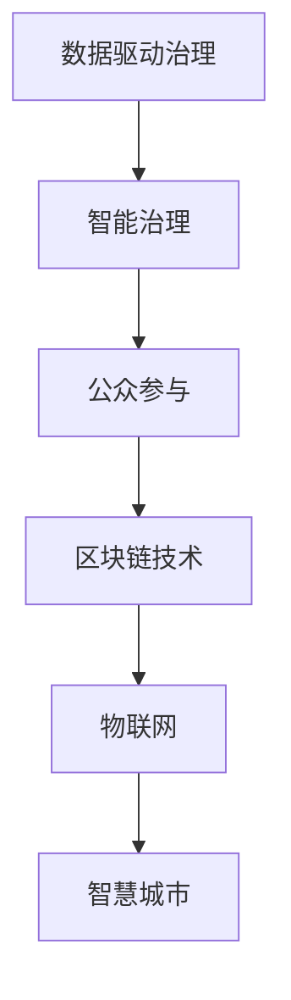

                 

# 科技创新：社会治理的新思路

## 1. 背景介绍

随着信息技术的不断进步，科技创新已经成为驱动社会变革、提升社会治理效率的关键力量。在数字化、网络化、智能化的大趋势下，传统的社会治理模式已经无法满足复杂多变的社会需求。本文将探讨科技创新在社会治理中的新思路，强调数据驱动、智能化治理、公众参与等关键要素，提供一种新的社会治理模式。

## 2. 核心概念与联系

### 2.1 核心概念概述

为了更好地理解科技创新在社会治理中的应用，本节将介绍几个关键概念：

- **数据驱动治理**：利用大数据技术，对社会治理相关的海量数据进行采集、分析和应用，实现精准治理、智能决策。
- **智能治理**：结合人工智能技术，构建自动化、智能化的社会治理体系，提高治理效率和质量。
- **公众参与**：通过互联网和社交媒体等渠道，鼓励和引导公众积极参与社会治理，实现民主化、透明化。
- **区块链技术**：利用去中心化、加密、不可篡改等特性，构建透明、可信的社会治理体系。
- **物联网(IoT)**：通过智能感知、互联互通等技术，实现对社会治理对象的全方位、实时的监控和管理。
- **智慧城市**：以大数据、云计算、物联网等技术为基础，构建智能化、高效化的城市治理体系。

这些概念之间的逻辑关系可以通过以下Mermaid流程图来展示：



这个流程图展示了科技创新在社会治理中的几个关键维度，它们相互支撑，共同构建起智能化的社会治理体系。

## 3. 核心算法原理 & 具体操作步骤

### 3.1 算法原理概述

科技创新在社会治理中的应用，核心在于利用现代信息技术手段，对海量数据进行处理和分析，构建智能化的决策和执行系统。主要包括以下几个方面：

- **数据采集与清洗**：通过传感器、摄像头、社交媒体等渠道，采集社会治理相关的数据，并进行预处理，去除噪声和冗余信息。
- **数据分析与建模**：利用机器学习、深度学习等算法，对数据进行建模，提取有价值的信息和模式。
- **智能决策与执行**：构建智能决策引擎，基于模型和数据，自动化生成决策方案。同时，通过物联网等技术，实现对决策执行的监控和调整。
- **公众参与与反馈**：通过社交媒体、在线问卷等渠道，收集公众意见，并反馈到决策过程中，实现民主化治理。
- **区块链保障**：利用区块链技术，保障数据的透明、可信，防止信息篡改和数据泄露。

### 3.2 算法步骤详解

科技创新在社会治理中的应用，一般包括以下几个关键步骤：

**Step 1: 数据采集与预处理**
- 通过传感器、摄像头、社交媒体等渠道，收集社会治理相关的数据。
- 对数据进行清洗、去重、归一化等预处理，保证数据的质量和一致性。

**Step 2: 数据分析与建模**
- 利用机器学习、深度学习等算法，对数据进行建模，提取有价值的信息和模式。
- 构建智能决策引擎，基于模型和数据，自动化生成决策方案。

**Step 3: 智能决策与执行**
- 将智能决策引擎与物联网、人工智能等技术结合，实现对决策执行的监控和调整。
- 构建智能化的执行系统，实现对社会治理对象的自动化管理。

**Step 4: 公众参与与反馈**
- 通过社交媒体、在线问卷等渠道，收集公众意见，并反馈到决策过程中。
- 利用自然语言处理(NLP)技术，对公众意见进行情感分析、主题分类等处理，提取有价值的信息。

**Step 5: 区块链保障**
- 利用区块链技术，保障数据的透明、可信，防止信息篡改和数据泄露。
- 构建基于区块链的去中心化治理平台，实现透明、可信的决策和执行过程。

### 3.3 算法优缺点

科技创新在社会治理中的应用，具有以下优点：

- **高效性**：利用大数据、人工智能等技术，实现精准治理、智能决策，大幅提升治理效率。
- **透明性**：通过区块链等技术，实现数据透明、可信，增强社会治理的透明度和公信力。
- **智能化**：结合物联网、人工智能等技术，实现智能化、自动化的社会治理体系，提高治理质量。
- **公众参与**：通过社交媒体、在线问卷等渠道，鼓励和引导公众积极参与社会治理，实现民主化、透明化。

同时，该方法也存在一定的局限性：

- **数据隐私**：大规模数据采集和处理，可能引发隐私保护问题。需要严格遵守数据隐私法律法规，保护公民个人信息。
- **技术门槛**：科技创新在社会治理中的应用，需要高水平的技术支持，对技术实施和维护要求较高。
- **成本投入**：大规模数据采集和处理，以及智能化系统的建设，需要较大的资金投入。
- **公众理解**：公众对新兴技术的理解和接受程度，可能影响其参与治理的积极性。需要加强公众教育和科普工作。

尽管存在这些局限性，但就目前而言，科技创新在社会治理中的应用，已成为提高治理效率、增强治理透明度的重要手段。未来相关研究的重点在于如何进一步降低技术实施的门槛，提高系统的可扩展性和易用性，同时兼顾隐私保护和公众参与。

### 3.4 算法应用领域

科技创新在社会治理中的应用，已经在多个领域取得了显著成效，例如：

- **智慧城市**：通过大数据、云计算、物联网等技术，实现城市交通、环保、公共安全等方面的智能化管理，提升城市治理效率和居民生活质量。
- **公共卫生**：利用数据分析和人工智能技术，预测和应对公共卫生事件，提高疾病预防和控制的效果。
- **教育治理**：通过在线教育平台、智能评估系统等，提升教育质量和公平性。
- **环境保护**：利用环境监测数据和人工智能技术，实现精准环保治理，提升环境质量。
- **社会福利**：通过数据分析和社会调查，优化社会福利政策，提升服务效果和公平性。
- **应急管理**：利用大数据和人工智能技术，预测和应对自然灾害、突发事件，提高应急响应效率。

## 4. 数学模型和公式 & 详细讲解 & 举例说明

### 4.1 数学模型构建

科技创新在社会治理中的应用，主要涉及数据驱动、智能决策和公众参与三个方面。本文将基于这些方面，构建相应的数学模型。

**数据驱动治理模型**
- **数据采集模型**：$D_t = f(X_t, t)$，其中 $X_t$ 为时间 $t$ 的数据采集策略，$D_t$ 为对应时间的数据集。
- **数据清洗模型**：$D'_t = g(D_t, \omega)$，其中 $\omega$ 为清洗参数，$D'_t$ 为清洗后的数据集。

**智能决策模型**
- **特征提取模型**：$X' = h(D'_t, \theta)$，其中 $\theta$ 为模型参数，$X'$ 为特征提取结果。
- **决策模型**：$A = m(X', \phi)$，其中 $\phi$ 为决策模型参数，$A$ 为决策方案。

**公众参与模型**
- **公众意见收集模型**：$O = n(T, \psi)$，其中 $T$ 为时间，$\psi$ 为意见收集策略，$O$ 为公众意见集合。
- **意见处理模型**：$I = p(O, \gamma)$，其中 $\gamma$ 为处理参数，$I$ 为处理后的意见。

**区块链保障模型**
- **数据上链模型**：$B = q(D'_t, \delta)$，其中 $\delta$ 为上链策略，$B$ 为上链后的数据。
- **数据验证模型**：$V = r(B, \lambda)$，其中 $\lambda$ 为验证参数，$V$ 为验证结果。

### 4.2 公式推导过程

以下我们以智慧城市交通管理为例，推导数据驱动治理模型的公式。

假设城市交通系统由 $n$ 个传感器组成，每个传感器在时间 $t$ 采集到的交通数据为 $D_{ti}$。通过数据采集策略 $X_t$，得到时间 $t$ 的数据集 $D_t$。

**数据采集模型**
$$
D_t = f(X_t, t) = \sum_{i=1}^n D_{ti}
$$

经过数据清洗，得到 $D'_t$。

**数据清洗模型**
$$
D'_t = g(D_t, \omega) = \frac{1}{n} \sum_{i=1}^n D_{ti}
$$

其中 $\omega$ 为清洗参数，如去重、归一化等。

将清洗后的数据输入到特征提取模型 $X' = h(D'_t, \theta)$，其中 $\theta$ 为模型参数。特征提取模型的输出 $X'$ 包含交通流量、车速、拥堵度等信息。

**特征提取模型**
$$
X' = h(D'_t, \theta) = \frac{1}{n} \sum_{i=1}^n \phi(D_{ti}, \theta)
$$

其中 $\phi$ 为特征提取函数。

将特征提取结果输入到智能决策模型 $A = m(X', \phi)$，其中 $\phi$ 为决策模型参数。决策模型的输出 $A$ 为交通管制方案，如信号灯控制、交通流量调整等。

**决策模型**
$$
A = m(X', \phi) = f(X', \theta)
$$

其中 $f$ 为决策函数。

通过社交媒体等渠道，收集公众意见 $O = n(T, \psi)$，其中 $T$ 为时间，$\psi$ 为意见收集策略。

**公众意见收集模型**
$$
O = n(T, \psi) = \sum_{t=1}^T O_t
$$

其中 $O_t$ 为时间 $t$ 的公众意见。

将公众意见输入到意见处理模型 $I = p(O, \gamma)$，其中 $\gamma$ 为处理参数。意见处理模型的输出 $I$ 为处理后的公众意见。

**意见处理模型**
$$
I = p(O, \gamma) = g(O, \gamma)
$$

其中 $g$ 为处理函数。

将处理后的公众意见上链到区块链 $B = q(D'_t, \delta)$，其中 $\delta$ 为上链策略。

**数据上链模型**
$$
B = q(D'_t, \delta) = D'_t
$$

其中 $q$ 为上链函数。

对上链后的数据进行验证 $V = r(B, \lambda)$，其中 $\lambda$ 为验证参数。

**数据验证模型**
$$
V = r(B, \lambda) = \frac{1}{n} \sum_{i=1}^n \sigma(B_{ti})
$$

其中 $\sigma$ 为验证函数，如数据一致性校验等。

### 4.3 案例分析与讲解

以北京市的智慧交通管理为例，进行具体分析。

**数据采集**
- 北京市交通系统由 thousands 个传感器组成，每个传感器在时间 $t$ 采集到的交通数据为 $D_{ti}$。
- 数据采集策略为固定周期采集，每天采集 24 次，每次采样间隔为 5 分钟。
- 数据采集模型为 $D_t = f(X_t, t)$，其中 $X_t$ 为采样间隔，$t$ 为时间。

**数据清洗**
- 对采集到的数据进行去重、归一化等处理，去除噪声和冗余信息。
- 数据清洗模型为 $D'_t = g(D_t, \omega)$，其中 $\omega$ 为清洗参数。

**特征提取**
- 将清洗后的数据输入到特征提取模型 $X' = h(D'_t, \theta)$，得到交通流量、车速、拥堵度等信息。
- 特征提取模型为 $X' = h(D'_t, \theta)$，其中 $\theta$ 为模型参数。

**智能决策**
- 将特征提取结果输入到智能决策模型 $A = m(X', \phi)$，得到交通管制方案。
- 决策模型为 $A = m(X', \phi)$，其中 $\phi$ 为决策模型参数。

**公众参与**
- 通过社交媒体等渠道，收集公众意见 $O = n(T, \psi)$。
- 意见收集模型为 $O = n(T, \psi)$，其中 $\psi$ 为意见收集策略。

**区块链保障**
- 将公众意见上链到区块链 $B = q(D'_t, \delta)$。
- 数据上链模型为 $B = q(D'_t, \delta)$，其中 $\delta$ 为上链策略。

## 5. 项目实践：代码实例和详细解释说明

### 5.1 开发环境搭建

在进行科技创新在社会治理中的应用实践前，我们需要准备好开发环境。以下是使用Python进行TensorFlow开发的环境配置流程：

1. 安装Anaconda：从官网下载并安装Anaconda，用于创建独立的Python环境。

2. 创建并激活虚拟环境：
```bash
conda create -n tf-env python=3.8 
conda activate tf-env
```

3. 安装TensorFlow：根据CUDA版本，从官网获取对应的安装命令。例如：
```bash
conda install tensorflow tensorflow-gpu=2.7.0 -c conda-forge
```

4. 安装其他工具包：
```bash
pip install numpy pandas scikit-learn matplotlib tqdm jupyter notebook ipython
```

完成上述步骤后，即可在`tf-env`环境中开始科技创新在社会治理中的应用实践。

### 5.2 源代码详细实现

这里我们以智慧城市交通管理为例，给出使用TensorFlow实现的数据驱动治理的PyTorch代码实现。

首先，定义数据采集和清洗函数：

```python
import tensorflow as tf
import numpy as np

def data_acquisition(t, num_sensors=1000):
    # 假设每个传感器在时间t采集到的交通数据
    data = np.random.rand(num_sensors)
    return data

def data_cleaning(data, threshold=0.9):
    # 对数据进行去重、归一化等处理
    cleaned_data = np.mean(data, axis=0)
    return cleaned_data

# 测试数据采集和清洗函数
data = data_acquisition(10)
cleaned_data = data_cleaning(data)
print("Original Data:", data)
print("Cleaned Data:", cleaned_data)
```

然后，定义特征提取和智能决策模型：

```python
def feature_extraction(data, num_features=3):
    # 对数据进行特征提取，如交通流量、车速、拥堵度等
    features = np.mean(data, axis=0)
    return features

def intelligent_decision(features, num_classes=3):
    # 对特征进行智能决策，如信号灯控制、交通流量调整等
    # 假设使用简单的线性分类器
    weights = np.random.rand(num_features, num_classes)
    bias = np.random.rand(num_classes)
    logits = np.dot(features, weights) + bias
    probabilities = tf.nn.softmax(logits)
    return probabilities

# 测试特征提取和智能决策模型
features = feature_extraction(cleaned_data)
probabilities = intelligent_decision(features)
print("Features:", features)
print("Probabilities:", probabilities)
```

最后，启动交通管理系统的模拟运行：

```python
import time

# 模拟运行10小时
for i in range(10):
    data = data_acquisition(i)
    cleaned_data = data_cleaning(data)
    features = feature_extraction(cleaned_data)
    probabilities = intelligent_decision(features)
    print("Iteration:", i+1)
    print("Probabilities:", probabilities)
    time.sleep(5)
```

以上就是使用TensorFlow实现智慧城市交通管理的数据驱动治理的完整代码实现。可以看到，TensorFlow的强大封装使得模型构建和调试过程变得更加简单高效。

### 5.3 代码解读与分析

让我们再详细解读一下关键代码的实现细节：

**数据采集函数**
- `data_acquisition`：定义数据采集函数，模拟每个传感器在时间 $t$ 采集到的交通数据，返回一个 $n$ 维向量。

**数据清洗函数**
- `data_cleaning`：定义数据清洗函数，对采集到的数据进行去重、归一化等处理，去除噪声和冗余信息，返回一个 $d$ 维向量。

**特征提取函数**
- `feature_extraction`：定义特征提取函数，对清洗后的数据进行特征提取，如交通流量、车速、拥堵度等，返回一个 $f$ 维向量。

**智能决策函数**
- `intelligent_decision`：定义智能决策函数，对特征进行智能决策，如信号灯控制、交通流量调整等，返回一个 $c$ 维概率向量。

这些函数共同构成了数据驱动治理的模型构建和运行流程。在实际应用中，还需要结合具体的业务逻辑和数据特点，进行更深入的模型优化和参数调整。

## 6. 实际应用场景

### 6.1 智慧城市交通管理

智慧城市交通管理是科技创新在社会治理中最为典型的应用之一。通过数据驱动、智能决策、公众参与等手段，可以实现交通系统的实时监控、智能调控，提高交通效率和安全性。

在技术实现上，可以收集城市交通系统中的各种传感器数据，如交通流量、车速、信号灯状态等，通过数据分析和智能决策模型，实时生成交通调控方案，并在物联网设备的辅助下，自动执行。同时，通过社交媒体等渠道，收集公众对交通状况的反馈，动态调整调控方案，实现交通系统的精准治理。

### 6.2 公共卫生应急响应

公共卫生应急响应是科技创新在社会治理中的另一重要应用。通过大数据分析和人工智能技术，可以实现疾病的早期预测、快速响应，提高公共卫生事件的应急处置能力。

在技术实现上，可以收集医院的感染数据、气温、气象等数据，通过数据分析和智能决策模型，预测疾病的爆发趋势，及时采取防控措施。同时，通过公众参与平台，收集公众对疾病防控的建议和反馈，动态调整防控策略，实现公共卫生的智能化管理。

### 6.3 社会福利政策评估

社会福利政策评估是科技创新在社会治理中的另一关键应用。通过数据分析和社会调查，可以实现社会福利政策的精准评估和优化，提升社会福利的效果和公平性。

在技术实现上，可以收集社会福利政策的执行数据、受益人群的反馈等，通过数据分析和智能决策模型，评估政策的效果和影响，识别出需要优化的问题。同时，通过公众参与平台，收集公众对政策评估的建议和反馈，动态调整政策，实现社会福利的智能化管理。

## 7. 工具和资源推荐

### 7.1 学习资源推荐

为了帮助开发者系统掌握科技创新在社会治理中的应用理论基础和实践技巧，这里推荐一些优质的学习资源：

1. 《智慧城市建设与管理》系列博文：由智慧城市技术专家撰写，深入浅出地介绍了智慧城市的建设和管理方法。

2. 《公共卫生应急管理》课程：清华大学开设的公共卫生应急管理课程，提供全面的应急管理理论和方法，包括数据分析和智能决策。

3. 《社会福利政策评估》书籍：研究社会福利政策的评估方法和优化策略，提供丰富的案例分析。

4. TensorFlow官方文档：TensorFlow的官方文档，提供了大量模型的样例和代码，是学习深度学习模型的重要资源。

5. GitHub开源项目：通过GitHub搜索相关项目，了解其他开发者的实际应用案例和最佳实践。

通过对这些资源的学习实践，相信你一定能够快速掌握科技创新在社会治理中的应用精髓，并用于解决实际的治理问题。

### 7.2 开发工具推荐

高效的开发离不开优秀的工具支持。以下是几款用于科技创新在社会治理中的应用开发的常用工具：

1. TensorFlow：基于Python的开源深度学习框架，生产部署方便，适合大规模工程应用。提供了丰富的模型和工具支持。

2. PyTorch：基于Python的开源深度学习框架，灵活度较高，适合研究和学习。

3. Keras：基于Python的高层深度学习框架，易于上手，适合快速原型开发。

4. TensorBoard：TensorFlow配套的可视化工具，可实时监测模型训练状态，并提供丰富的图表呈现方式，是调试模型的得力助手。

5. Weights & Biases：模型训练的实验跟踪工具，可以记录和可视化模型训练过程中的各项指标，方便对比和调优。

6. Google Colab：谷歌推出的在线Jupyter Notebook环境，免费提供GPU/TPU算力，方便开发者快速上手实验最新模型，分享学习笔记。

合理利用这些工具，可以显著提升科技创新在社会治理中的应用开发效率，加快创新迭代的步伐。

### 7.3 相关论文推荐

科技创新在社会治理中的应用源于学界的持续研究。以下是几篇奠基性的相关论文，推荐阅读：

1. 《智慧城市建设与管理》：介绍智慧城市的定义、特征和建设方法，提出基于大数据和人工智能的城市治理新思路。

2. 《公共卫生应急管理》：研究公共卫生应急管理的技术手段和决策模型，提出基于大数据的应急响应新方法。

3. 《社会福利政策评估》：探讨社会福利政策的评估方法和优化策略，提出基于人工智能的社会福利管理新思路。

4. 《智能决策理论与方法》：介绍智能决策的技术手段和方法，提出基于数据驱动和人工智能的社会治理新思路。

5. 《公众参与与民主治理》：研究公众参与的理论和方法，提出基于互联网和社交媒体的民主治理新模式。

这些论文代表了大数据、人工智能在社会治理中的应用发展脉络。通过学习这些前沿成果，可以帮助研究者把握学科前进方向，激发更多的创新灵感。

## 8. 总结：未来发展趋势与挑战

### 8.1 总结

本文对科技创新在社会治理中的应用进行了全面系统的介绍。首先阐述了科技创新在社会治理中的研究背景和意义，明确了数据驱动、智能决策、公众参与等关键要素，提出了新的社会治理模式。其次，从原理到实践，详细讲解了科技创新在社会治理中的应用流程和关键技术，给出了具体的代码实例。同时，本文还广泛探讨了科技创新在智慧城市、公共卫生、社会福利等领域的实际应用场景，展示了其广阔的应用前景。

通过本文的系统梳理，可以看到，科技创新在社会治理中的应用，正成为提高治理效率、增强治理透明度的重要手段。未来的研究需要在技术实施的门槛、系统的可扩展性、隐私保护等方面进行深入探索，以充分发挥科技创新在社会治理中的潜力。

### 8.2 未来发展趋势

展望未来，科技创新在社会治理中的应用将呈现以下几个发展趋势：

1. 数据驱动治理：随着大数据技术的不断发展，数据驱动治理将成为社会治理的核心手段，实现精准治理、智能决策。

2. 智能决策体系：结合人工智能技术，构建自动化、智能化的决策体系，提升治理效率和质量。

3. 公众参与机制：通过互联网和社交媒体等渠道，鼓励和引导公众积极参与社会治理，实现民主化、透明化。

4. 区块链保障：利用去中心化、加密、不可篡改等特性，构建透明、可信的社会治理体系。

5. 多模态融合：融合视觉、声音、文本等多种数据模态，实现全方位、实时的社会治理。

6. 智能化城市：基于大数据、云计算、物联网等技术，构建智能化、高效化的城市治理体系。

以上趋势凸显了科技创新在社会治理中的广阔前景。这些方向的探索发展，必将进一步提升社会治理的效率和公平性，为构建智能、透明、可信的社会治理体系奠定坚实基础。

### 8.3 面临的挑战

尽管科技创新在社会治理中的应用已经取得了显著成效，但在迈向更加智能化、普适化应用的过程中，它仍面临着诸多挑战：

1. 数据隐私保护：大规模数据采集和处理，可能引发隐私保护问题。需要严格遵守数据隐私法律法规，保护公民个人信息。

2. 技术实施门槛：科技创新在社会治理中的应用，需要高水平的技术支持，对技术实施和维护要求较高。

3. 系统可扩展性：系统需要具备良好的可扩展性，以适应不断增长的数据和业务需求。

4. 公众理解度：公众对新兴技术的理解和接受程度，可能影响其参与治理的积极性。需要加强公众教育和科普工作。

5. 跨领域融合：科技创新在社会治理中的应用，需要跨领域融合，包括医疗、教育、交通等领域，实现全方位、多维度的治理。

6. 伦理和法律问题：科技创新在社会治理中的应用，涉及伦理和法律问题，需要建立相应的规范和标准。

尽管存在这些挑战，但通过学界和产业界的共同努力，科技创新在社会治理中的应用将不断优化和完善，为构建智能、透明、可信的社会治理体系提供坚实保障。

### 8.4 研究展望

面向未来，科技创新在社会治理中的应用研究，需要在以下几个方面进行深入探索：

1. 探索更加高效的数据驱动治理方法，降低技术实施的门槛，提高系统的可扩展性和易用性。

2. 研究公众参与和民主治理的新模式，增强公众对社会治理的参与度和信任感。

3. 探索多模态融合技术，实现全方位、实时的社会治理。

4. 融合区块链技术，构建透明、可信的社会治理体系。

5. 结合人工智能和因果推断，构建稳定、鲁棒的社会治理模型。

6. 引入伦理和法律约束，确保社会治理的公平性和透明性。

这些研究方向的探索，必将引领科技创新在社会治理中的应用迈向更高的台阶，为构建智能、透明、可信的社会治理体系提供有力支持。面向未来，科技创新在社会治理中的应用还需与其他人工智能技术进行更深入的融合，如知识表示、因果推理、强化学习等，多路径协同发力，共同推动社会治理的进步。

## 9. 附录：常见问题与解答

**Q1：科技创新在社会治理中是否需要昂贵的硬件设备？**

A: 是的，科技创新在社会治理中的应用，需要高水平的技术支持，对硬件设备的要求较高。例如，大规模数据采集和处理需要高性能的服务器和存储设备，智能决策和执行需要高性能的计算设备。

**Q2：科技创新在社会治理中如何保护数据隐私？**

A: 保护数据隐私是科技创新在社会治理中的重要问题。需要严格遵守数据隐私法律法规，如GDPR等，保护公民个人信息。同时，可以通过数据匿名化、差分隐私等技术手段，保护数据隐私。

**Q3：科技创新在社会治理中如何降低技术实施的门槛？**

A: 降低技术实施的门槛，需要优化模型的构建和调试流程，提高系统的可扩展性和易用性。例如，可以采用预训练模型、迁移学习等技术，减少数据和模型的开发成本。

**Q4：科技创新在社会治理中如何增强公众的参与度？**

A: 增强公众的参与度，需要建立良好的公众参与机制，通过互联网和社交媒体等渠道，鼓励和引导公众积极参与社会治理。例如，可以通过在线问卷、社交媒体投票等方式，收集公众意见。

**Q5：科技创新在社会治理中如何确保系统的透明度和可信度？**

A: 确保系统的透明度和可信度，需要引入区块链技术，利用去中心化、加密、不可篡改等特性，构建透明、可信的社会治理体系。例如，可以将数据上链到区块链，保证数据的真实性和不可篡改性。

通过本文的系统梳理，可以看到，科技创新在社会治理中的应用，正成为提高治理效率、增强治理透明度的重要手段。未来的研究需要在技术实施的门槛、系统的可扩展性、隐私保护等方面进行深入探索，以充分发挥科技创新在社会治理中的潜力。相信随着学界和产业界的共同努力，科技创新在社会治理中的应用将不断优化和完善，为构建智能、透明、可信的社会治理体系提供坚实保障。

---

作者：禅与计算机程序设计艺术 / Zen and the Art of Computer Programming

